# ContractContextManagement 模块文档

## 1. 模块概述

ContractContextManagement 是合同服务（ContractCore）的**数据准备与上下文管理**子模块。它基于 Spring AOP + ThreadLocal 模式，在合同操作（保存/提交/查询详情）执行前，自动聚合来自多个外部服务的数据，并将其存入线程级上下文对象，供下游业务逻辑直接读取。

### 核心职责

| 职责 | 说明 |
|------|------|
| **数据预聚合** | 在合同操作前，通过切面拦截并行获取项目信息、报价信息、图纸信息、存管账户等多维度数据 |
| **线程上下文管理** | 通过 ThreadLocal 持有请求级别的 `ContractContext` / `ContractDetailContext`，实现无参传递 |
| **参数预处理** | 对前端传入的请求参数进行清洗、裁剪（如根据签约形式清空无关字段） |
| **生命周期保障** | 在 `@After` / `@AfterThrowing` 中确保上下文清除，防止内存泄漏 |

---

## 2. 架构设计

### 2.1 组件总览

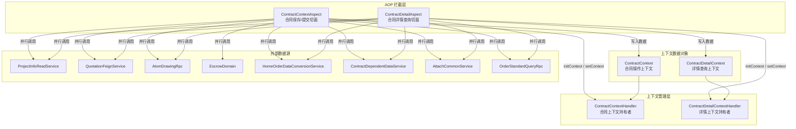

### 2.2 上下文类继承关系

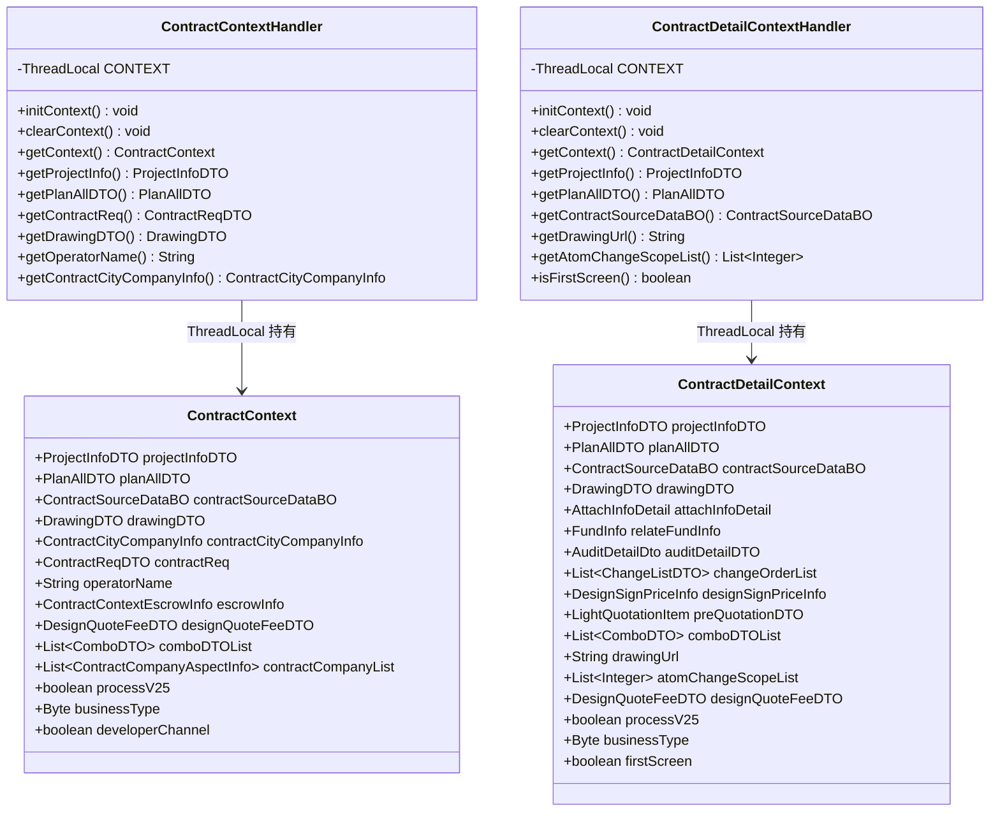

---

## 3. 核心组件详解

### 3.1 ContractContextAspect（合同保存/提交切面）

**切面点**：拦截所有标注 `@ContractDataPrepare` 注解的方法。

#### 执行流程

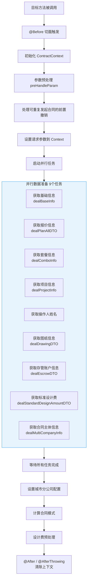

#### 参数预处理规则

参数预处理 (`preHandleParam`) 是一个复杂的决策树，根据合同类型、签约形式等条件裁剪请求参数：

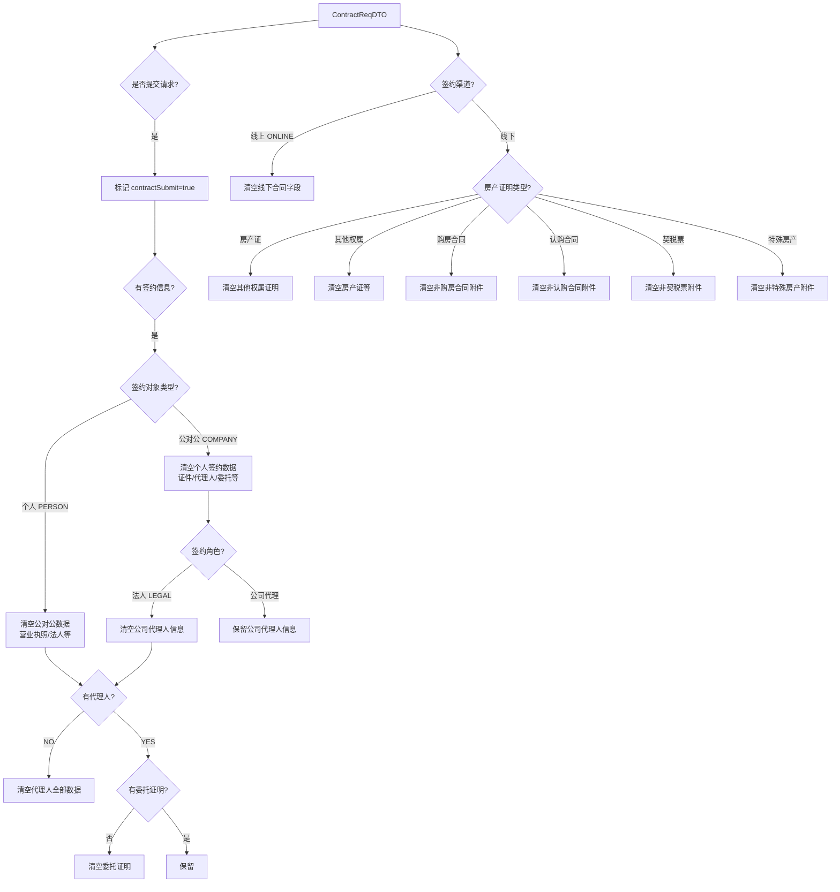

#### 合同类型与数据获取的关系

不同合同类型需要获取的数据维度不同：

| 数据维度 | PACKAGE_FORMAL | PACKAGE_CHANGE | ADVANCE | DRAWING | PERSONAL | DESIGN | TERMINAL | FUND_ESCROW |
|----------|:-:|:-:|:-:|:-:|:-:|:-:|:-:|:-:|
| 报价信息 | Y | Y | Y | Y | Y | - | - | - |
| 图纸信息 | Y | Y | - | Y | Y | - | - | - |
| 套餐信息 | Y(2.5) | - | - | - | - | - | - | - |
| 存管账户 | - | - | - | - | - | - | - | - |
| 设计费 | - | - | - | - | - | Y | - | - |
| 合同主体 | - | - | - | - | - | - | - | Y |

> 具体的合同类型枚举含义请参考枚举定义类 `ContractTypeEnum`，不要仅凭名称推测业务含义。

---

### 3.2 ContractContextHandler（合同上下文持有者）

基于 **ThreadLocal** 模式的上下文管理器，提供静态方法访问当前线程的 `ContractContext`。

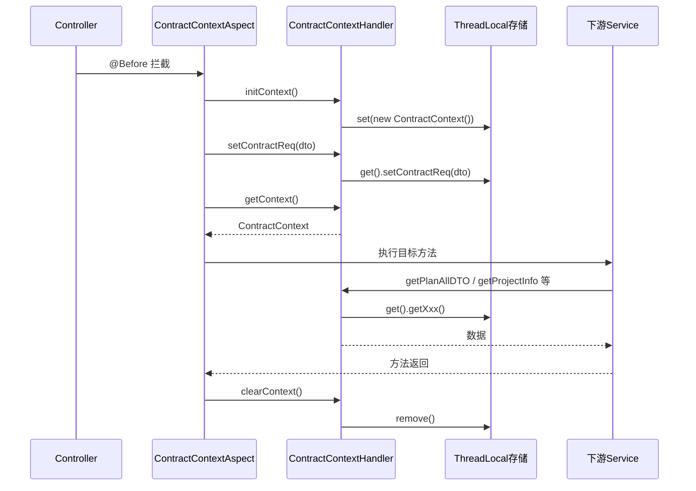

#### 线程安全设计

| 设计要点 | 说明 |
|---------|------|
| ThreadLocal 隔离 | 每个请求线程持有独立的 `ContractContext` 实例，无共享状态 |
| 生命周期明确 | `@Before` 初始化，`@After` / `@AfterThrowing` 清除 |
| 空值保护 | 所有 getter 方法均先检查 `CONTEXT.get() == null`，避免 NPE |
| 异常安全 | `@AfterThrowing` 确保异常路径也能清除上下文 |

---

### 3.3 ContractDetailAspect（合同详情查询切面）

**切面点**：拦截所有标注 `@ContractDetailDataPrepare` 注解的方法。

#### 执行流程

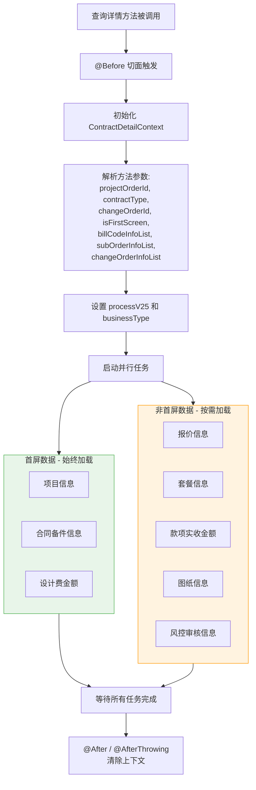

#### 首屏优化策略

`ContractDetailAspect` 实现了**首屏优先加载**策略：

- **首屏（isFirstScreen=true）**：只加载项目信息、备件信息、设计费金额，快速返回首屏所需数据
- **非首屏（isFirstScreen=false）**：额外加载报价、套餐、图纸、款项、审核等耗时数据

这有效降低了详情页的首屏响应时间。

---

### 3.4 ContractDetailContextHandler（详情上下文持有者）

与 `ContractContextHandler` 结构完全一致，但持有的是 `ContractDetailContext` 实例。两个 Handler 互不干扰，分别服务于合同保存和详情查询两个不同场景。

---

## 4. 模块间依赖关系

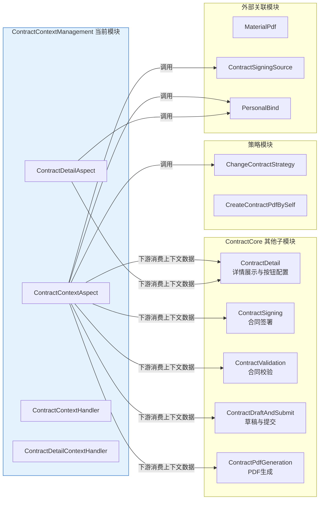

### 4.1 对外暴露的静态 API

`ContractContextHandler` 和 `ContractDetailContextHandler` 作为静态工具类，被 ContractCore 下的多个子模块广泛引用：

| 静态方法 | 提供方 | 消费场景 |
|---------|--------|---------|
| `ContractContextHandler.getPlanAllDTO()` | ContractContextAspect | 合同保存时获取报价数据 |
| `ContractContextHandler.getProjectInfo()` | ContractContextAspect | 获取项目信息进行字段填充 |
| `ContractContextHandler.getContractReq()` | ContractContextAspect | 获取原始请求参数 |
| `ContractContextHandler.getDrawingDTO()` | ContractContextAspect | 获取图纸数据生成合同附件 |
| `ContractContextHandler.getContractCityCompanyInfo()` | ContractContextAspect | 获取城市分公司配置 |
| `ContractDetailContextHandler.getPlanAllDTO()` | ContractDetailAspect | 详情页展示报价数据 |
| `ContractDetailContextHandler.getProjectInfo()` | ContractDetailAspect | 详情页展示项目信息 |
| `ContractDetailContextHandler.isFirstScreen()` | ContractDetailAspect | 控制详情页分段加载 |

---

## 5. 并行任务编排

两个切面均使用 `ParallelTaskService` 实现数据的并行获取，大幅提升数据准备效率：

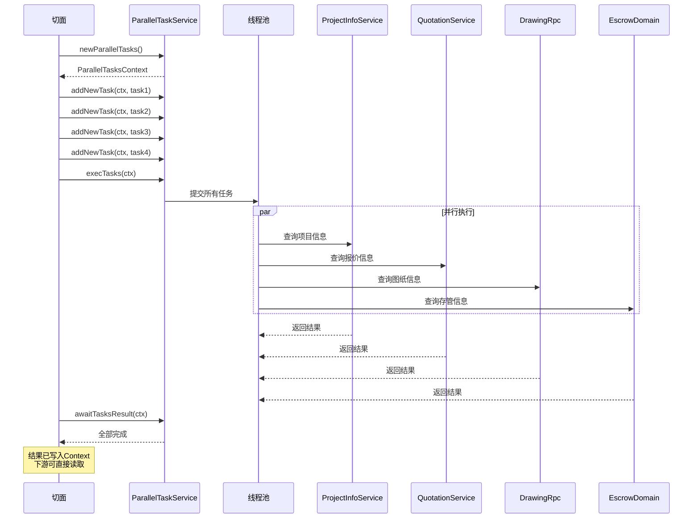

### 并行任务清单

#### ContractContextAspect（合同保存）- 9 个并行任务

| 序号 | 任务 | 调用服务 | 条件 |
|:---:|------|---------|------|
| 1 | 获取基础信息 | `ContractUnifyService` | 始终执行 |
| 2 | 获取报价信息 | `HomeOrderDataConversionService` / `AtomChangeRpc` | 按合同类型路由 |
| 3 | 获取套餐信息 | `OrderStandardQueryRpc` | 仅 2.5 流程 + 证房业务 + 正签 |
| 4 | 获取项目信息 | `ProjectInfoReadService` | 始终执行 |
| 5 | 获取操作人姓名 | `HomeAndPcCommonService` | 始终执行 |
| 6 | 获取图纸信息 | `AtomDrawingRpc` / `ContractBusinessService` | 按合同类型路由 |
| 7 | 获取存管账户信息 | `EscrowDomain` | 仅需要展示存管的合同类型 |
| 8 | 获取标准设计费 | `HomeAndPcCommonService` | 仅设计合同 + 特定城市 |
| 9 | 获取合同主体信息 | `FundEscrowService` / `MdmRpc` | 仅存管协议 |

#### ContractDetailAspect（合同详情）- 最多 8 个并行任务

| 序号 | 任务 | 首屏加载 | 非首屏加载 |
|:---:|------|:---:|:---:|
| 1 | 项目信息 | Y | Y |
| 2 | 备件信息 | Y | Y |
| 3 | 设计费金额 | Y | Y |
| 4 | 报价信息 | - | Y |
| 5 | 套餐信息 | - | Y |
| 6 | 款项实收 | - | Y |
| 7 | 图纸信息 | - | Y |
| 8 | 风控审核 | - | Y |

---

## 6. 报价信息路由策略

报价信息的获取是两个切面中最复杂的逻辑，根据合同类型和业务模式有多条路由：

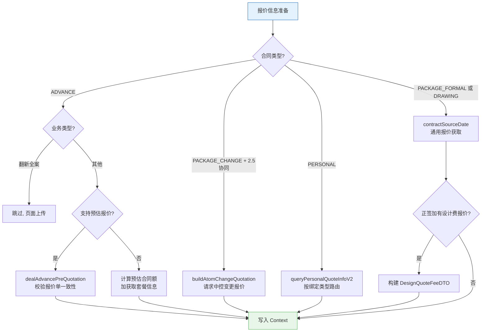

### 变更合同报价的特殊处理

对于 2.5 协同模式下的变更协议（`PACKAGE_CHANGE`），报价获取路径与通用路径不同：

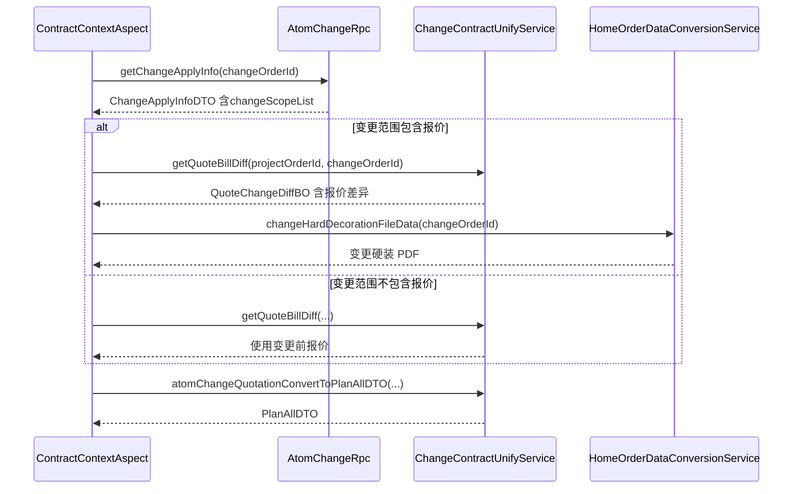

---

## 7. 上下文生命周期

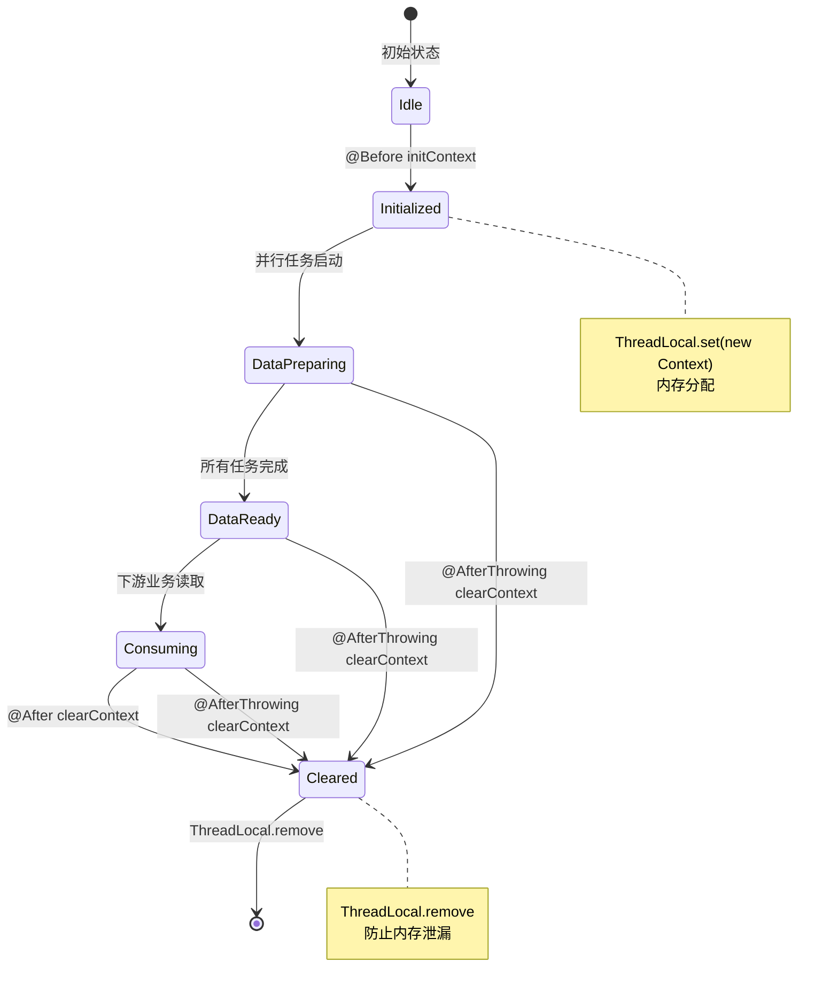

---

## 8. 设计模式总结

| 模式 | 应用 | 说明 |
|------|------|------|
| **AOP + 注解驱动** | `ContractContextAspect` / `ContractDetailAspect` | 通过自定义注解标记需要数据准备的方法，切面自动拦截 |
| **ThreadLocal 上下文** | `ContractContextHandler` / `ContractDetailContextHandler` | 请求级别的隐式参数传递，避免方法签名膨胀 |
| **并行编排** | `ParallelTaskService` | 将无依赖的数据获取任务并行执行，降低总耗时 |
| **模板方法变体** | 两个 Aspect 结构相似但数据维度不同 | 共享相同的生命周期管理模式 |
| **条件路由** | 报价信息 / 图纸信息获取 | 根据合同类型、业务模式、流程版本路由到不同的获取策略 |
| **策略模式** | 通过 `ContractSigningSourceRouter` 路由 | 个性化合同的图纸获取按绑定类型走不同策略 |

---

## 9. 相关模块文档

- [ContractDetail](ContractDetail.md) - 合同详情展示与按钮配置（消费本模块上下文数据）
- [ContractSigning](ContractSigning.md) - 合同签署（消费本模块上下文数据）
- [ContractValidation](ContractValidation.md) - 合同校验（消费本模块上下文数据）
- [ContractDraftAndSubmit](ContractDraftAndSubmit.md) - 合同草稿与提交（消费本模块上下文数据）
- [ContractPdfGeneration](ContractPdfGeneration.md) - 合同 PDF 生成
- [ContractSigningSource](ContractSigningSource.md) - 签约来源路由策略（本模块调用）
- [PersonalBind](PersonalBind.md) - 个人绑定关系处理（本模块调用）
