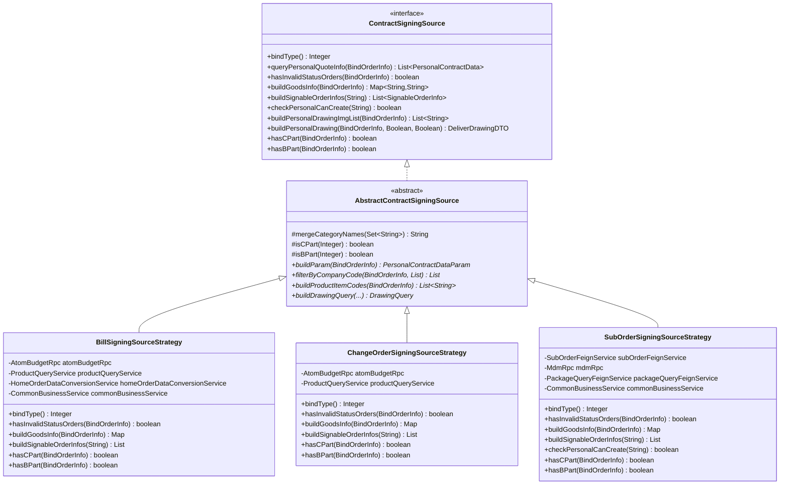
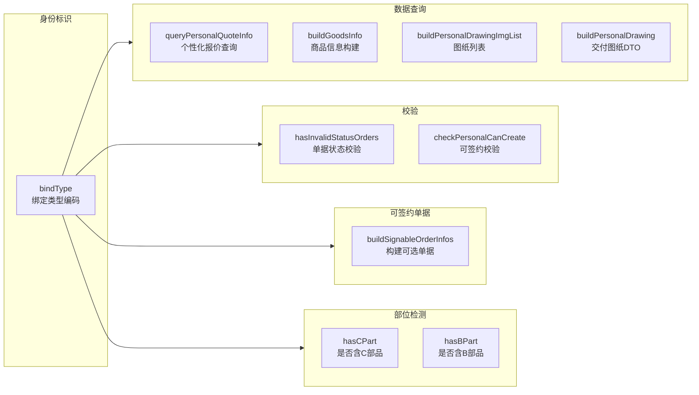
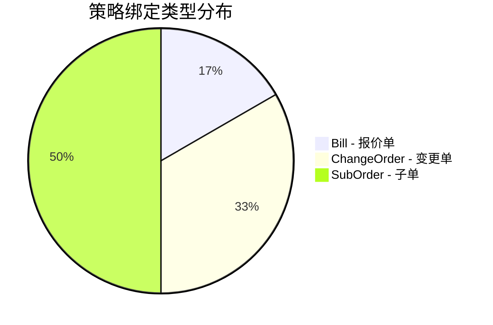
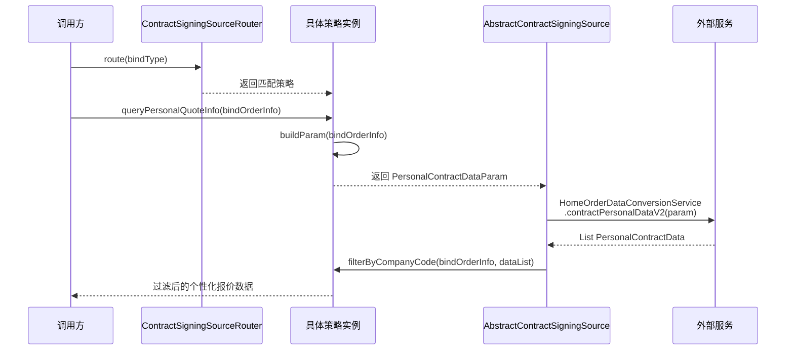
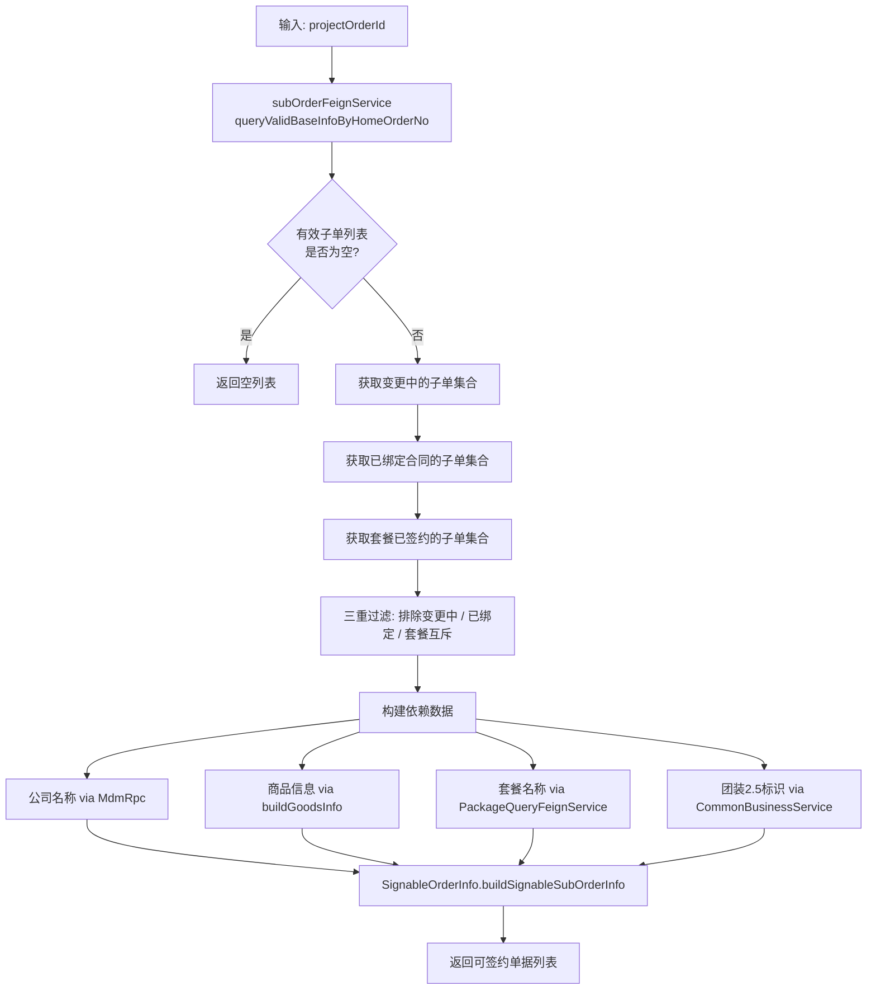
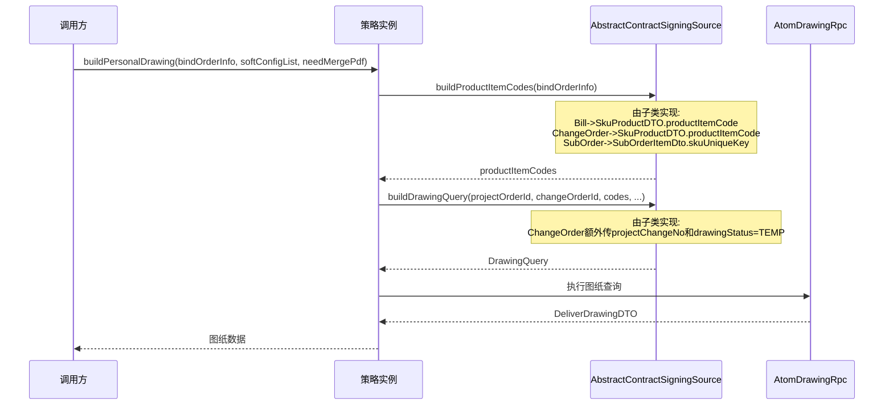
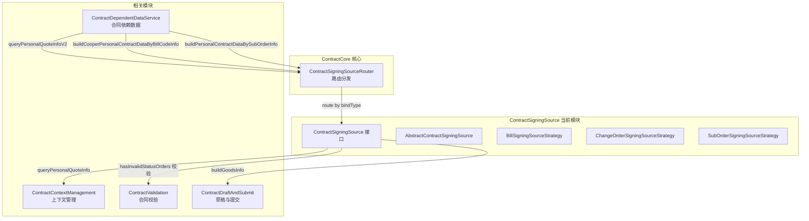
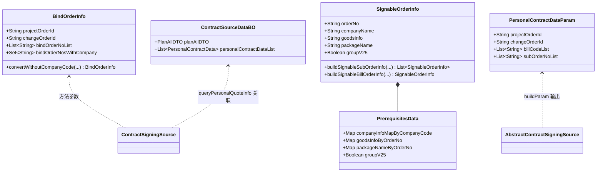

# ContractSigningSource 模块文档

## 1. 模块概述

ContractSigningSource 是合同服务（ContractCore）的**个性化签约数据源**子模块。它采用**策略模式（Strategy Pattern）**，根据绑定订单类型（报价单 / 变更单 / 子单）提供统一的数据查询接口，为个性化合同签约流程提供数据支撑。

### 核心职责

| 职责 | 说明 |
|------|------|
| **个性化报价查询** | 根据绑定类型从主订单中获取个性化报价信息 |
| **单据有效性校验** | 判断所选单据是否处于可签约状态（如报价单非调整中/已删除/已取消） |
| **商品信息构建** | 从各数据源提取 SKU 类目名称，拼接为合同商品摘要 |
| **可签约单据构造** | 为"单独发起销售合同"弹窗提供可选择的基础报价单 / S 单列表 |
| **图纸数据获取** | 构建个性化图纸列表与交付图纸 DTO，供 PDF 生成使用 |
| **商品部位检测** | 判断绑定单据中是否包含 C 部分（自购品）或 B 部分商品 |

---

## 2. 架构设计

### 2.1 组件总览

```mermaid
graph TD
    subgraph Router_Layer[路由层]
        CSR[ContractSigningSourceRouter<br/>路由分发器]
    end

    subgraph Interface_Layer[接口层]
        CSS[ContractSigningSource<br/>统一接口]
    end

    subgraph Abstract_Layer[抽象层]
        ACSS[AbstractContractSigningSource<br/>抽象基类 - 模板方法]
    end

    subgraph Strategy_Layer[策略实现层]
        BSS[BillSigningSourceStrategy<br/>报价单策略]
        COSS[ChangeOrderSigningSourceStrategy<br/>变更单策略]
        SOSS[SubOrderSigningSourceStrategy<br/>子单策略]
    end

    subgraph External_Services[外部数据源]
        ABR[AtomBudgetRpc<br/>报价/变更RPC]
        PQR[ProductQueryService<br/>商品查询服务]
        SQF[SubOrderFeignService<br/>子单Feign]
        OQS[OrderQueryApi<br/>订单查询]
        HDR[HomeOrderDataConversionService<br/>主订单数据转换]
        MDM[MdmRpc<br/>组织主数据]
        PQR2[PackageQueryFeignService<br/>套餐查询]
        OBS[CommonBusinessService<br/>业务类型判断]
        CDS[ContractDependentDataService<br/>合同依赖数据服务]
        DRS[AtomDrawingRpc via Params<br/>图纸服务]
    end

    CSR -->|route bindType| CSS
    CSS <|.. ACSS
    ACSS <|-- BSS
    ACSS <|-- COSS
    ACSS <|-- SOSS

    BSS --> ABR
    BSS --> PQR
    BSS --> HDR
    BSS --> OBS
    BSS --> CDS
    COSS --> ABR
    COSS --> PQR
    SOSS --> SQF
    SOSS --> OQS
    SOSS --> MDM
    SOSS --> PQR2
    SOSS --> OBS
```

### 2.2 类继承关系



---

## 3. 核心接口 — ContractSigningSource

`ContractSigningSource` 定义了所有策略必须实现的契约方法。各方法按职责可归为以下几类：

### 3.1 方法职责分组



### 3.2 方法说明

| 方法 | 返回类型 | 说明 |
|------|---------|------|
| `bindType()` | `Integer` | 返回策略标识码，对应 `BindTypeEnum` 枚举（报价单=1, 变更单=2, 子单=3） |
| `queryPersonalQuoteInfo(BindOrderInfo)` | `List<PersonalContractData>` | 从主订单获取个性化报价数据，用于个性化合同签约 |
| `hasInvalidStatusOrders(BindOrderInfo)` | `boolean` | 判断所选绑定单据中是否包含不可签约状态的单据 |
| `buildGoodsInfo(BindOrderInfo)` | `Map<String, String>` | 构建 `单据编号 -> 商品类目摘要` 映射，用于合同摘要展示 |
| `buildSignableOrderInfos(String)` | `List<SignableOrderInfo>` | 获取主订单下所有可签约单据，供前端弹窗展示选择列表 |
| `checkPersonalCanCreate(String)` | `boolean` | 创建/编辑合同前，校验是否存在可签约的单据 |
| `buildPersonalDrawingImgList(BindOrderInfo)` | `List<String>` | 构建个性化图纸图片 URL 列表 |
| `buildPersonalDrawing(BindOrderInfo, Boolean, Boolean)` | `DeliverDrawingDTO` | 构建完整的个性化交付图纸 DTO（含软配筛选、合并 PDF 选项） |
| `hasCPart(BindOrderInfo)` | `boolean` | 判断绑定商品中是否包含 C 部分（自购品） |
| `hasBPart(BindOrderInfo)` | `boolean` | 判断绑定商品中是否包含 B 部分 |

---

## 4. 策略实现详解

### 4.1 绑定类型映射



| 策略 | BindTypeEnum | 业务场景 |
|------|-------------|---------|
| `BillSigningSourceStrategy` | `BILL_CODE` | 基于报价单编码发起个性化合同签约 |
| `ChangeOrderSigningSourceStrategy` | `CHANGE_ORDER` | 基于变更单发起个性化合同签约 |
| `SubOrderSigningSourceStrategy` | `SUB_ORDER` | 基于 S 单（子单）发起个性化合同签约 |

### 4.2 BillSigningSourceStrategy — 报价单策略

**核心数据源**：`AtomBudgetRpc`（报价查询）、`ProductQueryService`（商品查询）、`HomeOrderDataConversionService`（主订单数据）

#### 关键业务逻辑

- **状态校验**：查询报价单，校验状态不能为 `IN_ADJUST`（调整中）、`DELETED`（已删除）、`CANCELED`（已取消）
- **商品信息**：通过 `productQueryService.getQuotationProductDTOS()` 获取 SKU 商品，提取 `skuCategoryName` 拼接
- **可签约单据**：仅在 `REFORM_ALL`（全翻新）和 `HOUSE_CERTIFICATE`（房产证）业务类型下返回个性化报价单数据
- **图纸构建**：通过 `buildDrawingQuery` + `buildProductItemCodes` 构建图纸查询参数（无变更单号）

### 4.3 ChangeOrderSigningSourceStrategy — 变更单策略

**核心数据源**：`AtomBudgetRpc`（变更详情查询）、`ProductQueryService`（变更商品查询）

#### 关键业务逻辑

- **状态校验**：变更流程状态必须为 `WAIT_SIGN`（待签约）或 `FINISHED`（已完成），否则不允许签约
- **商品信息**：通过 `productQueryService.getChangeQuotationProductDTOS()` 获取变更单下 SKU，提取类目名称
- **可签约单据**：`buildSignableOrderInfos` 直接返回空列表（变更单不支持单独发起签约弹窗）
- **图纸构建**：图纸查询参数额外携带 `projectChangeNo`（变更单号）和 `drawingStatus = TEMP`（临时图纸）

### 4.4 SubOrderSigningSourceStrategy — 子单策略

**核心数据源**：`SubOrderFeignService`（子单查询）、`MdmRpc`（组织主数据）、`PackageQueryFeignService`（套餐查询）

#### 关键业务逻辑

- **状态校验**：校验子单数量一致 + 状态不在 `SubOrderFeignService.invalidStatus` 集合中
- **商品信息**：从子单商品项中提取 `frontCategoryName`（优先）或 `backCategoryName`，超 50 字符截断
- **可签约单据**（最复杂的策略）：
  1. 获取状态有效的子单列表
  2. 过滤掉变更中的子单
  3. 过滤掉已绑定合同的子单
  4. 过滤掉同套餐内已签约的子单（套餐互斥约束）
  5. 构建依赖数据（公司名称、商品信息、套餐名称、团装2.5标识）
- **checkPersonalCanCreate**：该策略是唯一真正实现此方法的策略（其他两个返回 `false`），通过 `buildSignableOrderInfos(projectOrderId, true)` 判断是否有可签约单据
- **图纸构建**：通过子单商品的 `skuUniqueKey` 构建图纸查询

---

## 5. 数据流

### 5.1 个性化报价查询流程



### 5.2 可签约单据构建流程（SubOrder 策略为例）



### 5.3 图纸构建流程



---

## 6. 模块间依赖关系

### 6.1 内部模块依赖



### 6.2 外部服务依赖

| 外部服务 | 依赖策略 | 用途 |
|---------|---------|------|
| `AtomBudgetRpc` | Bill, ChangeOrder | 报价单查询、变更详情查询 |
| `ProductQueryService` | Bill, ChangeOrder | SKU 商品查询（报价/变更） |
| `SubOrderFeignService` | SubOrder | 子单批量查询、有效子单查询、变更中子单查询 |
| `HomeOrderDataConversionService` | Bill | 主订单数据转换、个性化报价数据获取 |
| `MdmRpc` | SubOrder | 组织主数据查询（公司中文名） |
| `PackageQueryFeignService` | SubOrder | 套餐信息查询 |
| `CommonBusinessService` | Bill, SubOrder | 业务类型判断、团装2.5标识 |
| `ContractDependentDataService` | Bill | 合同依赖数据查询 |
| `ContractQuotationRelationService` | SubOrder | 报价关联关系查询 |

---

## 7. 设计模式与设计决策

### 7.1 策略模式（Strategy Pattern）

本模块是典型的策略模式实现：

- **Strategy 接口**：`ContractSigningSource` 定义统一契约
- **Concrete Strategies**：`BillSigningSourceStrategy`、`ChangeOrderSigningSourceStrategy`、`SubOrderSigningSourceStrategy`
- **Context（上下文路由）**：`ContractSigningSourceRouter` 根据 `bindType()` 分发到对应策略

### 7.2 模板方法模式（Template Method Pattern）

`AbstractContractSigningSource` 作为抽象基类，提取了各策略的公共逻辑：

- **模板方法**：`queryPersonalQuoteInfo`、`buildPersonalDrawingImgList`、`buildPersonalDrawing` 等定义了算法骨架
- **抽象钩子**：`buildParam()`、`filterByCompanyCode()`、`buildProductItemCodes()`、`buildDrawingQuery()` 由子类实现差异化逻辑
- **公共工具方法**：`mergeCategoryNames()`、`isCPart()`、`isBPart()` 等在基类统一实现

### 7.3 关键设计决策

| 决策 | 原因 |
|------|------|
| 报价单策略仅在特定业务类型下返回可签约单据 | `REFORM_ALL` 和 `HOUSE_CERTIFICATE` 是仅有的需要从报价单发起个人签约的业务类型 |
| 变更单策略的 `buildSignableOrderInfos` 返回空列表 | 变更单不支持"单独发起签约"弹窗，只能在已有关联合同时触发 |
| 子单策略是唯一实现 `checkPersonalCanCreate` 的策略 | 只有 S 单场景需要在创建合同前判断是否存在可签约单据 |
| 子单可签约过滤含套餐互斥约束 | 同一套餐下的子单只能整体签约，避免部分签约导致数据不一致 |
| 图纸构建使用模板方法 | 不同策略的图纸查询参数不同（如变更单需要 `projectChangeNo` 和 `TEMP` 状态），但查询流程一致 |

---

## 8. 数据模型

### 8.1 核心 BO 对象



### 8.2 各策略的商品信息构建对比

| 策略 | 数据源 | Key | Value（类目来源） |
|------|--------|-----|------------------|
| Bill | `productQueryService.getQuotationProductDTOS` | 报价单号 `billCode` | `SkuProductDTO.skuCategoryName` |
| ChangeOrder | `productQueryService.getChangeQuotationProductDTOS` | 变更单号 `changeOrderId` | `SkuProductDTO.skuCategoryName` |
| SubOrder | `subOrderFeignService.batchQuerySubOrderByNo` | 子单号 `orderNo` | `SubOrderItemDto.frontCategoryName`（回退用 `backCategoryName`），超 50 字符截断 |

---

## 9. 相关模块文档

- [ContractContextManagement](ContractContextManagement.md) — 合同上下文管理模块，管理 ThreadLocal 上下文生命周期，ContractSigningSource 为其提供个性化报价数据
- [ContractValidation](ContractValidation.md) — 合同校验模块，部分校验逻辑（如单据状态校验）由本模块的 `hasInvalidStatusOrders` 方法支撑
- [MaterialPdf](MaterialPdf.md) — 材料 PDF 模块，与本模块的图纸构建功能相关但独立运作
