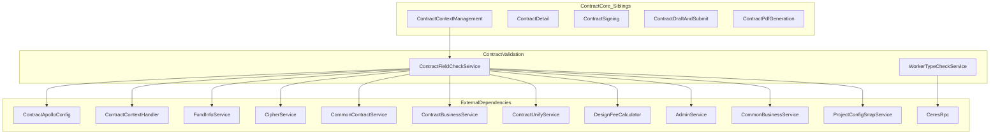
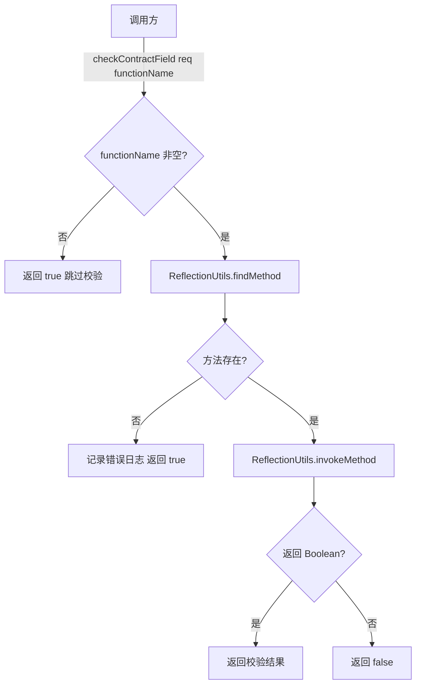
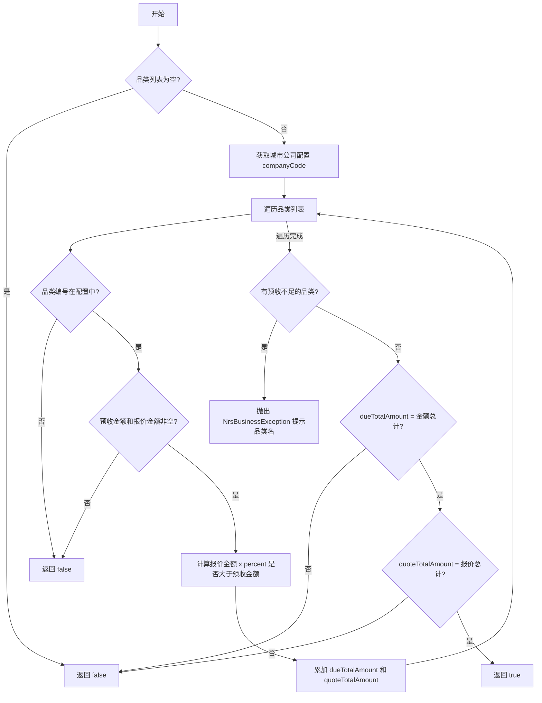
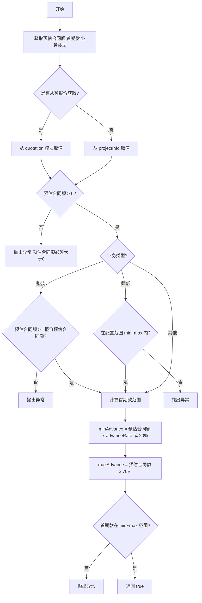
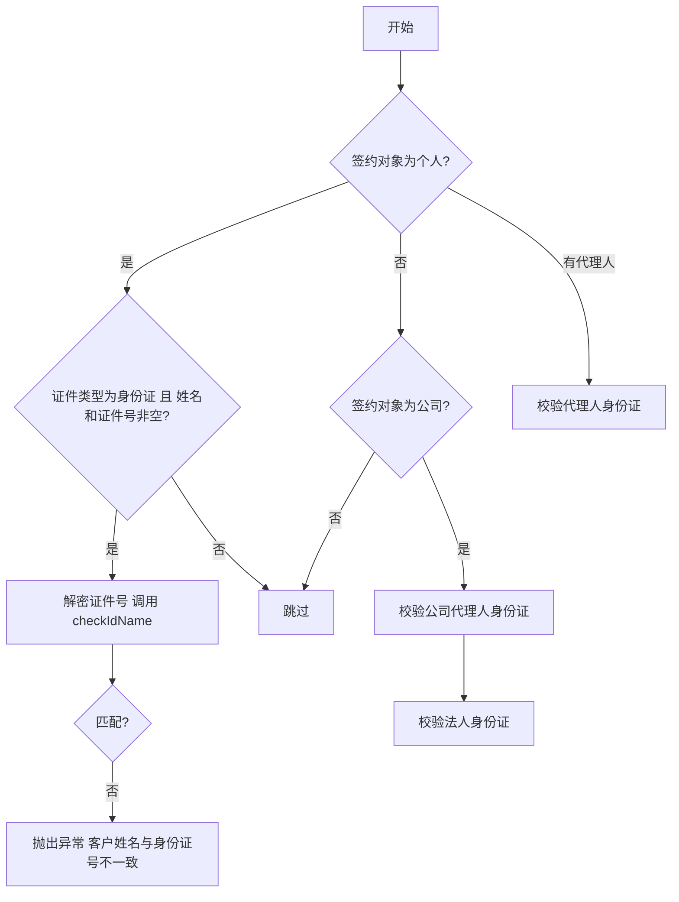
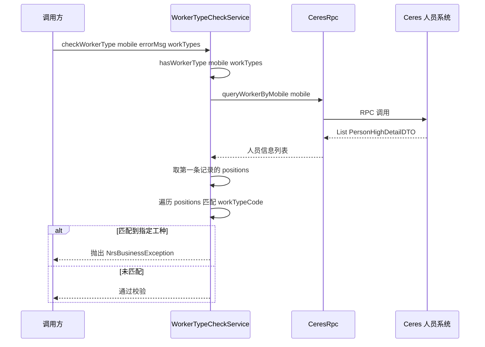
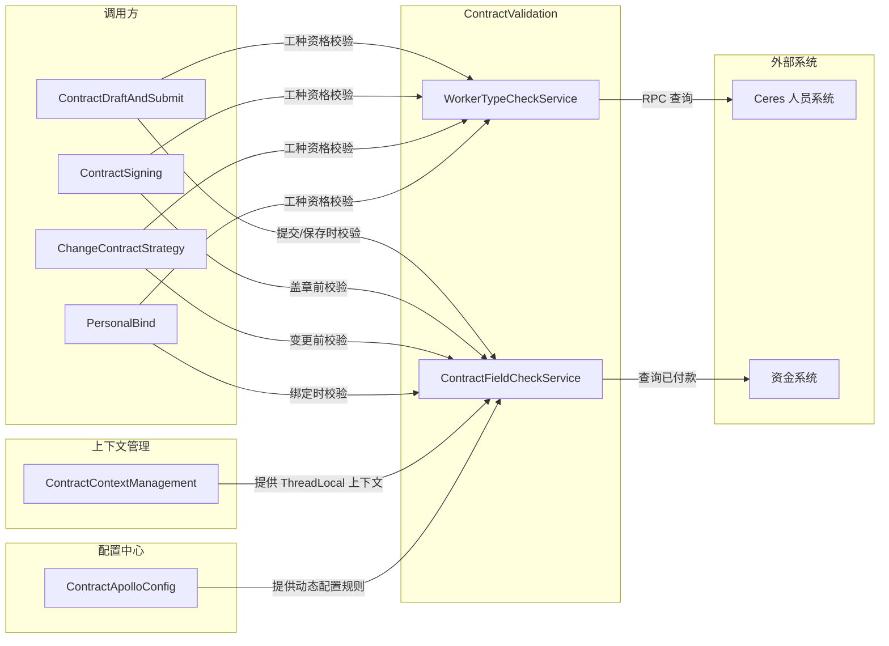

# ContractValidation 模块文档

## 简介

ContractValidation 是 `ContractCore` 的子模块，负责合同数据的业务校验。该模块包含两个核心服务：

- **ContractFieldCheckService** — 基于反射的合同字段校验引擎，提供品类金额、首期款比例、身份证一致性、企业信息、设计服务费等多维度校验。
- **WorkerTypeCheckService** — 工种资格校验服务，通过 RPC 调用外部人员系统（Ceres）验证手机号对应的人员是否属于指定工种。

两个服务在合同保存、提交、盖章、变更等多个流程节点被调用，是合同业务完整性保障的关键防线。

---

## 模块架构

---

## 组件详解

### 1. ContractFieldCheckService

> 源码路径：`ContractCore/ContractValidation/ContractFieldCheckService.java`

#### 设计模式

采用**反射派发**设计：对外暴露统一入口 `checkContractField(ContractReqDTO, String functionName)`，内部通过 `ReflectionUtils.findMethod` 根据 `functionName` 动态调用对应的 `public boolean checkXXX(ContractReqDTO)` 方法。

> **⚠️ 注意**：所有 `checkXXX` 方法通过反射调用，**方法名称不能修改，方法不能删除**，否则校验链路将静默失败（找不到方法时默认返回 `true`）。

#### 校验方法一览

| 方法名 | 校验内容 | 依赖 | 异常类型 |
|--------|---------|------|---------|
| `checkBrandList` | 品类列表：预收金额合计、报价金额合计、品类编号配置、预收比例下限 | `ContractApolloConfig`、`ContractContextHandler` | `NrsBusinessException` |
| `checkBrandTotalAmount` | 品类预收总计 ≥ 已付款金额 | `FundInfoService` | — |
| `checkAdvanceAmount` | 首期款金额在预估合同额 20%~70% 范围内；整装不可低于报价预估合同额；翻新在配置范围内 | `ContractUnifyService`、`ContractApolloConfig` | `UtopiaBussinessException` |
| `checkAdvanceFileSize` | 首期款报价单文件大小不超过配置阈值（如 10M） | `AdminService` | `NrsBusinessException` |
| `checkHouseType` | 正式套餐合同（2.5流程整装）的房产类型与报价侧一致 | `ContractContextHandler`、`CommonBusinessService` | `NrsBusinessException` |
| `checkIdCardInfo` | 签约人/代理人/公司代理人/法人 身份证号与姓名一致性 | `CommonContractService`、`CipherService` | `UtopiaBussinessException` |
| `checkCompanyInfo` | 企业名称与统一社会信用代码非空且匹配 | `ContractBusinessService` | `UtopiaBussinessException` |
| `checkDesignAmount` | 设计服务费优惠后 ≤ 优惠前，且 ≥ 0（仅线上签约且开城城市） | `DesignFeeCalculator`、`ContractApolloConfig`、`ContractUnifyService` | `UtopiaBussinessException` |

#### 校验流程详解

##### checkBrandList — 品类列表校验

##### checkAdvanceAmount — 首期款校验

##### checkIdCardInfo — 身份证校验

#### 动态配置依赖

`ContractFieldCheckService` 大量依赖 `ContractApolloConfig` 实现规则外置，关键配置项包括：

| 配置用途 | 说明 |
|---------|------|
| 品类名称映射 | `getBrandNameByCode(brandCode, companyCode)` — 根据品类编号和公司编码获取品类名称 |
| 预收比例下限 | `getAdvanceBrandDueAmountPercent()` — 品类预收金额不得低于报价金额的此比例 |
| 翻新合同额范围 | `getAdvanceReformMinAmount()` / `getAdvanceReformMaxAmount()` |
| 报价单文件大小上限 | `getAdvanceReformMaxSize()` |
| 设计费开城城市列表 | `getStandardDesignFeeCityCodes()` |

---

### 2. WorkerTypeCheckService

> 源码路径：`ContractCore/ContractValidation/WorkerTypeCheckService.java`

#### 功能说明

提供通用的工种校验能力，核心场景为**阻止特定工种人员参与某些合同操作**（如设计工种人员不能作为施工签约人）。

#### 接口设计

| 方法 | 签名 | 说明 |
|------|------|------|
| `hasWorkerType` | `(String mobile, WorkTypeEnum... workTypes) → boolean` | 查询手机号对应的人员是否包含任一指定工种 |
| `checkWorkerType` | `(String mobile, String errorMsg, WorkTypeEnum... workTypes) → void` | 若人员包含指定工种则抛出 `NrsBusinessException` |

#### 调用流程

---

## 模块间依赖关系

---

## 与其他模块的关系

| 关联模块 | 关系类型 | 说明 |
|---------|---------|------|
| [ContractContextManagement](ContractContextManagement.md) | **依赖** | `ContractFieldCheckService` 通过 `ContractContextHandler` 的静态方法获取合同上下文数据（城市公司配置、报价数据等） |
| [ContractDraftAndSubmit](ContractDraftAndSubmit.md) | **被依赖** | `ContractSaveDraftService` 和 `ContractEscrowService` 在保存草稿和提交托管时调用本模块进行字段校验 |
| [ContractSigning](ContractSigning.md) | **被依赖** | `ContractCompanySignService` 和 `ContractSelfSealService` 在盖章签约前调用本模块校验 |
| [ContractDetail](ContractDetail.md) | **被依赖** | `ContractDetailService` 在合同详情展示时可能触发校验 |
| [ChangeContractStrategy](ChangeContractStrategy.md) | **被依赖** | `NormalChangeContractStrategy` 和 `ZQChangeContractStrategy` 在变更提交前调用 `beforeSubmitCheck` 触发校验 |
| [PersonalBind](PersonalBind.md) | **被依赖** | `PersonalRelationHandlerImpl` 在人员绑定时调用校验 |

---

## 关键枚举说明

本模块引用的枚举定义在 `com.ke.utopia.nrs.salesproject.enums.contract` 包下，校验逻辑依赖以下枚举值做分支判断：

| 枚举 | 用途 | 参考文档 |
|------|------|---------|
| `ContractTypeEnum` | 合同类型，决定校验分支（如正式套餐合同才校验房屋类型） | [ContractDraftAndSubmit](ContractDraftAndSubmit.md) |
| `BusinessTypeEnum` | 业务类型（整装/翻新），决定预估合同额校验规则 | — |
| `SignChannelTypeEnum` | 签约渠道（ONLINE/OFFLINE），决定设计服务费是否校验 | [ContractContextManagement](ContractContextManagement.md) |
| `ContractObjectTypeEnum` | 签约对象类型（PERSON/COMPANY），决定身份证还是企业信息校验路径 | [ContractContextManagement](ContractContextManagement.md) |
| `CertificateTypeEnum` | 证件类型，判断是否为身份证以触发姓名一致性校验 | — |
| `CommonYesOrNoEnum` | 通用是否枚举，判断是否存在代理人 | [ContractContextManagement](ContractContextManagement.md) |
| `WorkTypeEnum` | 工种类型，`WorkerTypeCheckService` 用于匹配人员工种 | — |

> **开发规范提醒**：阅读枚举时务必查看枚举类定义中的确切含义，不能仅凭常量名称推测业务含义。

---

## 设计要点

### 反射派发的可扩展性

`ContractFieldCheckService` 使用反射调用校验方法，使得新增校验规则只需：
1. 在类中添加 `public boolean checkXxx(ContractReqDTO contractReq)` 方法
2. 在配置中将 `functionName` 设为方法名

无需修改框架代码。但这也带来了**编译期无法发现拼写错误**的风险——方法名写错时校验会被静默跳过（日志记录但不阻断）。

### 校验异常策略

模块采用两种异常类型区分错误严重程度：

| 异常类型 | 行为 | 使用场景 |
|---------|------|---------|
| `UtopiaBussinessException` | 标准业务异常 | 金额范围、身份信息匹配等硬性校验 |
| `NrsBusinessException` (Level.WARN) | 带告警级别的业务异常，部分场景可通过前端提示用户修正 | 品类预收不足、房屋类型不一致等可修正校验 |

### WorkerTypeCheckService 的防御式设计

- `hasWorkerType` 为纯查询方法，入参为空时安全返回 `false`（不抛异常）
- `checkWorkerType` 为守卫方法，匹配到指定工种时抛异常阻断流程
- 支持可变参数 `WorkTypeEnum...`，一次调用可校验多个工种
