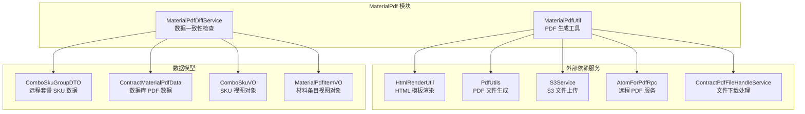
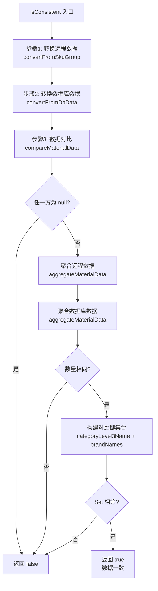
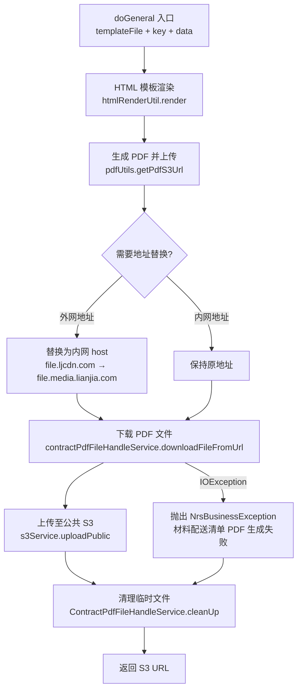
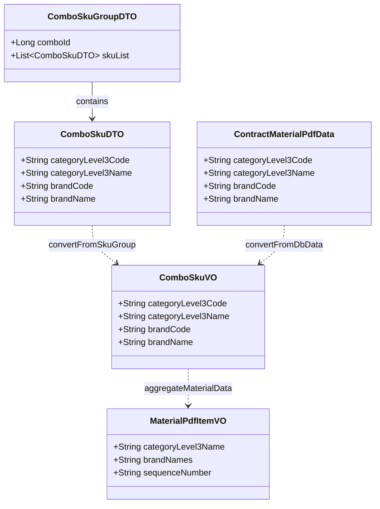
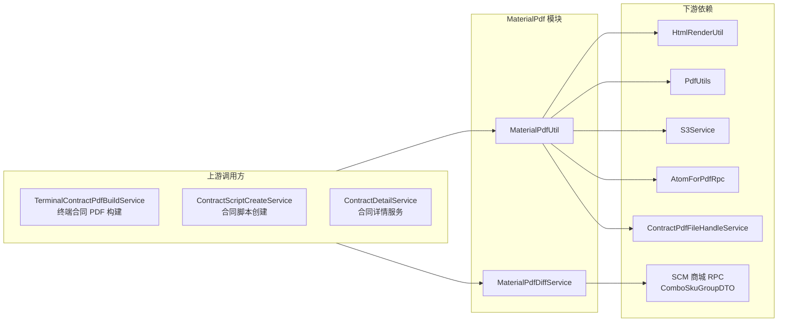
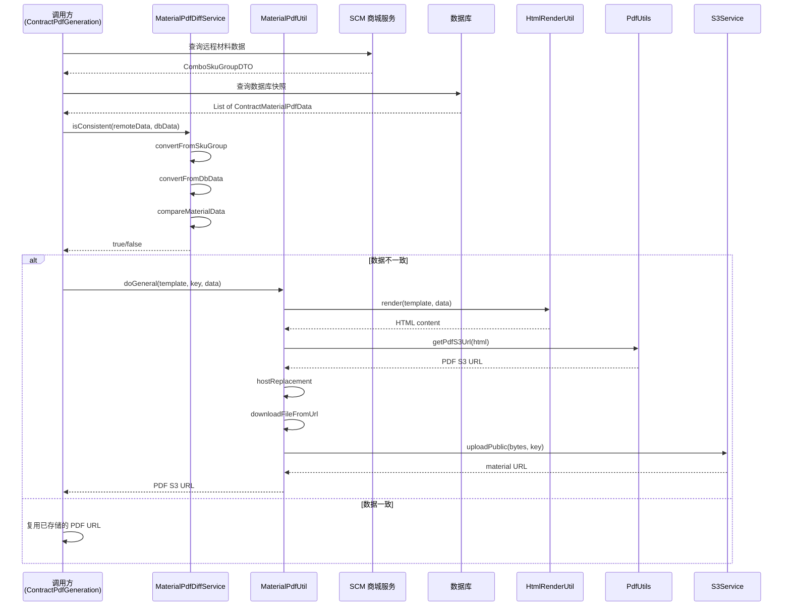

# MaterialPdf 模块文档

## 1. 模块概述

MaterialPdf 模块是合同系统中**材料清单 PDF 生成**的核心模块，负责：
- **数据一致性检查**：对比远程实时材料数据与数据库已存储数据，判断是否需要重新生成 PDF
- **PDF 生成与上传**：将材料清单数据通过 HTML 模板渲染为 PDF 文件，并上传至 S3 存储

该模块位于合同子套餐（Combo）的材料（Material）域下，是合同 PDF 生成流水线中的关键环节。

---

## 2. 模块架构

### 2.1 核心组件

| 组件 | 类名 | 职责 |
|------|------|------|
| 数据差异检查服务 | `MaterialPdfDiffService` | 比较远程与数据库材料数据的一致性 |
| PDF 工具类 | `MaterialPdfUtil` | HTML 模板渲染 → PDF 生成 → S3 上传 |

### 2.2 架构总览



---

## 3. 组件详细设计

### 3.1 MaterialPdfDiffService - 数据一致性检查服务

#### 3.1.1 功能说明

该服务的核心目标是**判断材料清单 PDF 是否需要重新生成**。通过对比以下两个数据源：
- **远程实时数据**：来自 `ComboSkuGroupDTO`（SCM 商城材料选择系统）
- **数据库存储数据**：来自 `ContractMaterialPdfData`（合同材料 PDF 快照）

#### 3.1.2 核心方法

| 方法 | 可见性 | 说明 |
|------|--------|------|
| `isConsistent(ComboSkuGroupDTO, List<ContractMaterialPdfData>)` | public | 主入口：检查两个数据源是否一致 |
| `convertFromSkuGroup(ComboSkuGroupDTO)` | public | 将远程 DTO 转换为 `ComboSkuVO` 列表 |
| `convertFromDbData(List<ContractMaterialPdfData>)` | public | 将数据库模型转换为 `ComboSkuVO` 列表 |
| `compareMaterialData(List<ComboSkuVO>, List<ComboSkuVO>)` | private | 执行实际数据对比 |
| `aggregateMaterialData(List<ComboSkuVO>)` | private | 聚合材料数据（分组、过滤、排序） |
| `buildMaterialItemCompareKey(MaterialPdfItemVO)` | private | 构建对比唯一键 |

#### 3.1.3 数据差异检查流程



#### 3.1.4 数据转换与聚合规则

**远程数据转换规则（`convertFromSkuGroup`）：**
1. 输入：`ComboSkuGroupDTO` → 获取 `List<ComboSkuDTO>`
2. 按 `categoryLevel3Code + brandCode` 组合键去重
3. 冲突时保留第一条记录，保持原始顺序（使用 `LinkedHashMap`）

**数据聚合规则（`aggregateMaterialData`）：**
1. 按 `categoryLevel3Code` 分组
2. 组内品牌名按字母升序排序
3. 过滤掉品牌名为 `"其他"` 的项
4. 同组品牌名用 `"/"` 连接，去重
5. 品牌为空的三级类目不展示（跳过）
6. 结果按 `categoryLevel3Name` 正序排序
7. 重新赋值 `sequenceNumber`（从 1 开始递增）

**对比唯一键格式：**
```
{categoryLevel3Name}|{brandNames}
```

### 3.2 MaterialPdfUtil - PDF 生成工具

#### 3.2.1 功能说明

封装了从 HTML 模板到 PDF 文件的完整生成链路，包括模板渲染、PDF 转换、网络地址替换和 S3 上传。

#### 3.2.2 依赖注入

| 依赖 | 类型 | 用途 |
|------|------|------|
| `HtmlRenderUtil` | 组件 | HTML 模板引擎渲染 |
| `PdfUtils` | 组件 | HTML 转 PDF 文件 |
| `S3Service` | 服务 | 公共 S3 上传 |
| `AtomForPdfRpc` | RPC | 远程 PDF 服务调用 |
| `ContractPdfFileHandleService` | 服务 | PDF 文件下载与清理 |

#### 3.2.3 PDF 生成流程



#### 3.2.4 网络地址替换规则

| 场景 | 原始地址 | 替换后地址 |
|------|---------|-----------|
| 外网 → 内网 | `https://file.ljcdn.com/...` | `http://file.media.lianjia.com/...` |
| 内网 | `http://file.media.lianjia.com/...` | 保持不变 |

> **设计意图**：PDF 生成服务部署在内网环境，使用内网文件服务地址可提升下载速度和稳定性。

---

## 4. 数据模型

### 4.1 核心数据模型



### 4.2 数据模型说明

| 模型 | 来源 | 说明 |
|------|------|------|
| `ComboSkuGroupDTO` | SCM 商城远程接口 | 套餐 SKU 分组数据，包含多个 SKU 条目 |
| `ComboSkuDTO` | SCM 商城远程接口 | 单个 SKU 数据，含三级类目和品牌信息 |
| `ContractMaterialPdfData` | 数据库持久化 | 合同材料 PDF 快照数据，上次生成时保存 |
| `ComboSkuVO` | 内部转换对象 | 统一的 SKU 视图对象，用于数据对比中间层 |
| `MaterialPdfItemVO` | 内部转换对象 | 聚合后的材料条目，用于 PDF 展示和对比 |

---

## 5. 模块间依赖关系

### 5.1 在合同系统中的位置

```mermaid
graph TD
    subgraph ContractSystem[合同系统]
        subgraph ContractCore[ContractCore]
            PdfGen[ContractPdfGeneration<br/>合同 PDF 生成]
            Detail[ContractDetail<br/>合同详情]
            Signing[ContractSigning<br/>合同签署]
            Validation[ContractValidation<br/>合同校验]
            DraftSubmit[ContractDraftAndSubmit<br/>草稿与提交]
            Context[ContractContextManagement<br/>上下文管理]
        end

        subgraph Strategies[策略模块]
            ChangeStrategy[ChangeContractStrategy<br/>变更合同策略]
            SelfPdf[CreateContractPdfBySelf<br/>自行生成 PDF]
        end

        subgraph MaterialDomain[材料域]
            MaterialPdf[MaterialPdf<br/>材料清单 PDF]
            SignSource[ContractSigningSource<br/>签署来源]
            Personal[PersonalBind<br/>人员绑定]
        end
    end

    PdfGen --> MaterialPdf : 调用材料清单生成
    Detail --> MaterialPdf : 查看材料清单
    Signing --> MaterialPdf : 签署时检查一致性
```

### 5.2 依赖方向



---

## 6. 与相关模块的交互

### 6.1 与 ContractPdfGeneration 的交互

`ContractPdfGeneration`（包含 `ContractScriptCreateService` 和 `TerminalContractPdfBuildService`）是合同 PDF 生成的编排层：

1. **判断是否需要重新生成**：调用 `MaterialPdfDiffService.isConsistent()` 检查数据一致性
2. **如果数据不一致**：调用 `MaterialPdfUtil.doGeneral()` 重新生成材料清单 PDF
3. **如果数据一致**：复用数据库中已存储的 PDF URL，跳过生成

### 6.2 与 ContractDetail 的交互

`ContractDetailService` 展示合同详情时：
- 读取已生成的材料清单 PDF URL
- 不直接调用 MaterialPdf 模块

### 6.3 与 CreateContractPdfBySelf 的关系

`CreateContractPdfBySelf` 策略模块（如 `DrawingContractPdfBySelfStrategy`、`GroupFormalContractPdfBySelfStrategy`）处理自行生成 PDF 的场景：
- 材料清单 PDF 作为合同附件的一部分被引用
- 但 PDF 的实际生成由 MaterialPdf 模块负责

---

## 7. 关键设计决策

### 7.1 为什么使用 Set 对比而非逐条比较？

```java
Set<String> remoteKeySet = remoteMaterialItemList.stream()
    .map(this::buildMaterialItemCompareKey)
    .collect(Collectors.toSet());

Set<String> dbKeySet = dbMaterialItemList.stream()
    .map(this::buildMaterialItemCompareKey)
    .collect(Collectors.toSet());

return remoteKeySet.equals(dbKeySet);
```

**优势：**
- **顺序无关**：远程数据和数据库数据的顺序可能不同，Set 比较自动忽略顺序
- **性能高效**：O(n) 复杂度构建 Set，O(n) 复杂度比较
- **代码简洁**：避免嵌套循环的复杂性

### 7.2 为什么过滤"其他"品牌？

在聚合规则中，品牌名为 `"其他"` 的项被过滤：
```java
.filter(brandName -> !"其他".equals(brandName))
```

**业务原因**：`"其他"` 是兜底品牌分类，不具有实际业务意义，在 PDF 材料清单中不展示。

### 7.3 为什么进行内外网地址替换？

```java
private static final String TARGE_HOST = "http://file.media.lianjia.com";
private static final String REPLACE_HOST = "https://file.ljcdn.com";
```

**部署环境要求**：PDF 生成服务运行在内网，使用内网文件服务地址避免跨网段访问，提升稳定性和速度。

---

## 8. 异常处理

### 8.1 MaterialPdfUtil 异常策略

| 场景 | 处理方式 |
|------|---------|
| PDF 下载失败（IOException） | 抛出 `NrsBusinessException("材料配送清单 PDF 生成失败")` |
| 临时文件清理 | 在 `finally` 块中确保清理，防止磁盘泄漏 |

### 8.2 MaterialPdfDiffService 防御性设计

- **空值保护**：`convertFromSkuGroup` 和 `convertFromDbData` 均处理 null 输入
- **空列表处理**：返回 `Collections.emptyList()` 避免 NPE
- **去重逻辑**：远程数据按组合键去重，避免重复数据导致误判

---

## 9. 流程总结

### 9.1 完整业务流程



---

## 10. 相关模块文档

| 模块 | 说明 | 文档链接 |
|------|------|---------|
| ContractCore | 合同核心模块，包含 PDF 生成编排 | [ContractCore.md](ContractCore.md) |
| CreateContractPdfBySelf | 自行生成 PDF 策略 | [CreateContractPdfBySelf.md](CreateContractPdfBySelf.md) |
| ChangeContractStrategy | 变更合同策略 | [ChangeContractStrategy.md](ChangeContractStrategy.md) |
| ContractSigningSource | 签署来源策略 | [ContractSigningSource.md](ContractSigningSource.md) |
| PersonalBind | 人员绑定关系 | [PersonalBind.md](PersonalBind.md) |
