# ButtonConfig 模块文档

## 1. 模块概述

**ButtonConfig** 模块是合同管理系统中负责 **按钮动态可见性控制** 的核心配置模块。它位于模块层级 `ContractCore > ContractDetail > ButtonConfig`，基于 **Aviator 表达式引擎 + 多维配置服务** 的规则引擎模式，在应用启动时将按钮可见性规则注入规则引擎，在运行时根据合同状态、类型等上下文参数动态计算每个按钮是否展示。

该模块覆盖四大业务场景的按钮配置：

| 配置模块 | 配置 Key | 适用端 | 按钮枚举 |
|---------|---------|-------|---------|
| Home 合同列表 | `homeContractListButtonConfig` | 移动端 | `ContractButtonEnum` |
| PC 合同列表 | `pcContractListButtonConfig` | PC 端 | `PcButtonEnum` |
| 授权列表 | `authListContractButtonConfig` | 移动端 | `ContractButtonEnum` |
| 合同预览页 | `contractPreviewButtonConfig` | 移动端 | `ContractButtonEnum` |

---

## 2. 架构设计

### 2.1 整体架构图

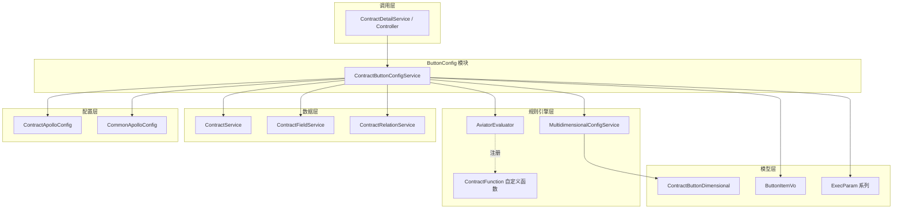

### 2.2 模块在系统中的位置

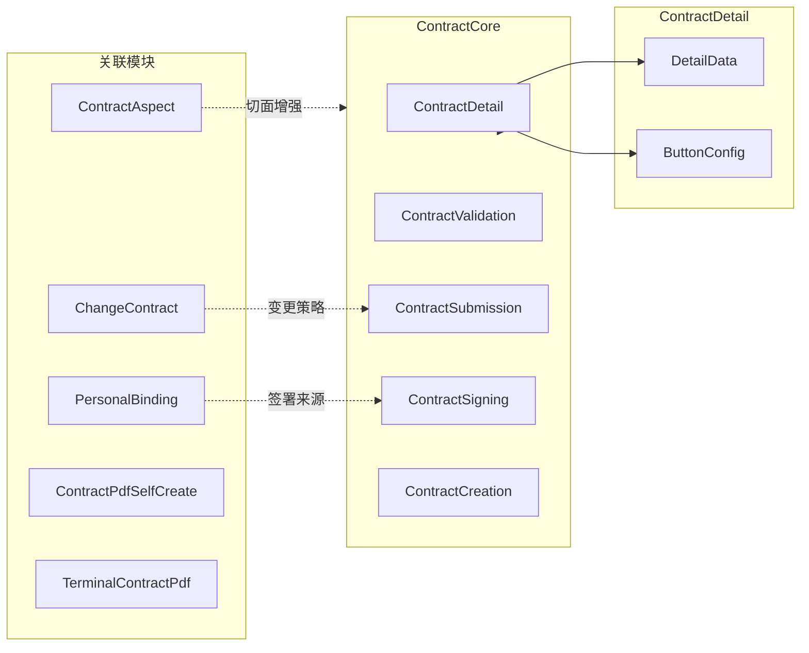

---

## 3. 核心组件详解

### 3.1 ContractButtonConfigService

该服务是模块唯一的主类，承担 **配置加载器** 和 **按钮查询接口** 双重职责。

#### 3.1.1 生命周期

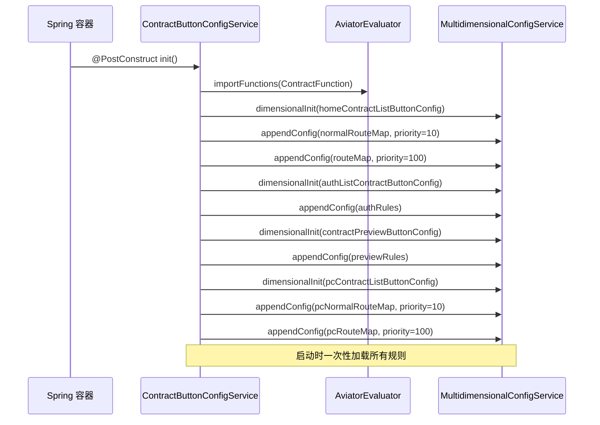

#### 3.1.2 配置加载策略

配置采用 **两级优先级** 的规则体系：

| 层级 | 优先级值 | 维度键 contractType | 语义 |
|------|---------|-------------------|------|
| 通用规则（normalRouteMap） | 10 | `null`（通配符 `*`） | 对所有合同类型生效的默认规则 |
| 专属规则（routeMap） | 100 | 具体合同类型编码 | 特定合同类型的覆盖规则 |
| 兜底规则 | 0 | 空（默认） | 默认返回 `false` |

当通用规则与专属规则冲突时，通过 `MultidimensionalConfigService` 的匹配机制，**更精确的维度匹配（有 contractType）优先于通配符匹配（contractType=null）**。这意味着即使通用规则优先级数值更低（10），专属规则（100）在维度匹配更精确时仍然优先生效。

#### 3.1.3 按钮可见性计算流程

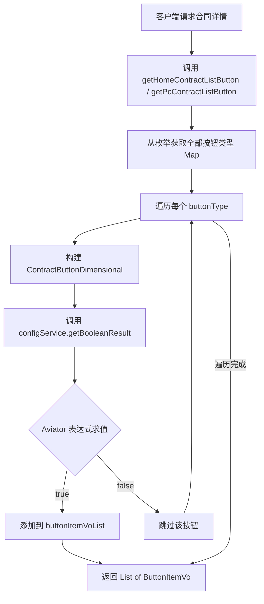

#### 3.1.4 四大查询接口

| 方法 | 用途 | 输入参数 | 输出 |
|------|------|---------|------|
| `getHomeContractListButton()` | 移动端合同列表按钮 | `ContractListButtonExecParam` | `List<ButtonItemVo>` |
| `getPcContractListButton()` | PC 端合同列表按钮 | `ContractListButtonExecParam` | `List<ButtonItemVo>` |
| `getAuthListContractButtonList()` | 授权列表按钮 | 基本参数（已废弃） | `List<ButtonItemVo>`（含 schema） |
| `getPreviewButtonList()` | 合同预览页按钮 | `Contract` + `Contract` | `List<ButtonItemVo>`（含 schema/icon） |

> **注意**：`getAuthListContractButtonList()` 已标记 `@Deprecated`。

#### 3.1.5 按钮类型覆盖矩阵

**Home 端按钮（ContractButtonEnum）**

| 按钮类型码 | 按钮名称 | 适用合同类型 |
|-----------|---------|------------|
| 1 | 预览并分享 | 通用（非草稿/非取消） |
| 2 | 编辑 | 草稿态 |
| 3 | 撤销并修改 | 待签署/待确认/待用章/审核中 |
| 4 | 申请用章 | 待用章 |
| 5 | 审核详情 | 有待审核号且状态匹配 |
| 6 | 删除 | 草稿态 |
| 7 | 查看 | 非草稿/非取消 |
| 8 | 去重签 | 特定条件下 |
| 12 | 去变更 | 设计合同/设计变更协议 |

**PC 端按钮（PcButtonEnum）**

| 按钮类型码 | 按钮名称 | 适用合同类型 |
|-----------|---------|------------|
| 1 | 去创建 | 设计/首期款/销售合同 |
| 2 | 查看 | 各类合同 |
| 3 | 编辑 | 草稿态 |
| 4 | 撤销并修改 | 待确认/待用章/审核中 |
| 5 | 审核详情 | 审核中 |
| 6 | 预览合同 | 非草稿/非取消 |
| 9 | 申请用章 | 待用章 |
| 12 | 去变更 | 设计合同 |
| 14 | 分享合同 | 非草稿/非取消 |
| 18 | 删除 | 草稿态 |
| 19 | 去重签 | 特定条件下 |

---

## 4. 依赖关系

### 4.1 依赖关系图

```mermaid
graph TD
    CBCS[ContractButtonConfigService]

    subgraph RuleEngine[规则引擎]
        MDCS[MultidimensionalConfigService]
        AE[AviatorEvaluator]
        CF[ContractFunction]
    end

    subgraph Enums[枚举定义]
        CBE[ContractButtonEnum]
        PBE[PcButtonEnum]
        CTE[ContractTypeEnum]
    end

    subgraph BO[业务对象]
        CBD[ContractButtonDimensional]
        BIV[ButtonItemVo]
        CLBEP[ContractListButtonExecParam]
        ALBEP[AuthListButtonExecParam]
        CPBEP[ContractPreviewButtonExecParam]
    end

    subgraph DAO[数据访问]
        CS[ContractService]
        CFS[ContractFieldService]
        CRS[ContractRelationService]
    end

    subgraph Apollo[配置中心]
        CAC[ContractApolloConfig]
        CACG[CommonApolloConfig]
    end

    CBCS --> MDCS
    CBCS --> AE
    AE -.注册.-> CF
    CBCS --> CBE
    CBCS --> PBE
    CBCS --> CTE
    CBCS --> CBD
    CBCS --> BIV
    CBCS --> CLBEP
    CBCS --> ALBEP
    CBCS --> CPBEP
    CBCS --> CS
    CBCS --> CFS
    CBCS --> CRS
    CBCS --> CAC
    CBCS --> CACG
```

### 4.2 依赖分类说明

| 依赖类别 | 组件 | 职责 |
|---------|------|------|
| **规则引擎** | `MultidimensionalConfigService` | 多维配置存储与 Aviator 表达式求值 |
| **规则引擎** | `AviatorEvaluator` | 表达式编译与执行 |
| **规则引擎** | `ContractFunction` | 注册自定义函数（showUndoButton 等） |
| **枚举定义** | `ContractButtonEnum` / `PcButtonEnum` | 按钮类型定义与遍历 |
| **枚举定义** | `ContractTypeEnum` | 合同类型编码 |
| **业务对象** | `ContractButtonDimensional` | 多维配置查询键（buttonType + contractType） |
| **业务对象** | `ButtonItemVo` | 返回给前端的按钮项 VO |
| **业务对象** | `ExecParam` 系列 | 运行时参数，作为 Aviator 表达式的变量绑定源 |
| **数据访问** | `ContractService` / `ContractFieldService` | 查询合同信息用于预览按钮参数构建 |
| **配置中心** | `ContractApolloConfig` / `CommonApolloConfig` | URL 模板、域名等外部配置 |

### 4.3 被调用方（上游依赖）

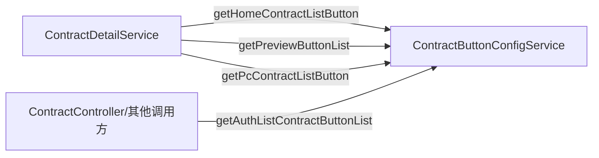

`ContractButtonConfigService` 作为 `ContractDetail` 子模块的组件，被 `ContractDetailService` 调用以获取合同详情页所需的按钮列表。

---

## 5. 数据流

### 5.1 完整数据流图

```mermaid
flowchart TD
    subgraph Startup[启动阶段 - @PostConstruct]
        S1[initFunction: 注册 ContractFunction 到 Aviator]
        S2[initContractListButtonConfig: 加载 Home 按钮规则]
        S3[initAuthListButtonConfig: 加载授权列表按钮规则]
        S4[initContractPreviewButtonConfig: 加载预览页按钮规则]
        S5[initPcContractButtonConfig: 加载 PC 端按钮规则]
        S1 --> S2 --> S3 --> S4 --> S5
    end

    subgraph Runtime[运行时 - 请求处理]
        R1[接收请求: 合同类型 + 状态 + 上下文参数]
        R2[构建 ContractButtonDimensional 维度键]
        R3[构建 ExecParam 运行时参数]
        R4[MultidimensionalConfigService 匹配规则]
        R5[AviatorEvaluator 执行表达式]
        R6{表达式结果}
        R7[生成 ButtonItemVo]
        R8[填充 schema/iconUrl]
        R9[返回 List of ButtonItemVo]
        R1 --> R2 --> R3 --> R4 --> R5 --> R6
        R6 -->|true| R7 --> R8 --> R9
        R6 -->|false| R10[跳过]
    end

    subgraph ExpressionExample[Aviator 表达式示例]
        E1["contractStatus == 1"]
        E2["include(seq.list(2,4,5,6), contractStatus)"]
        E3["ContractFunction.showUndoButton(contractCode, userConfirmNodeList)"]
    end
```

### 5.2 运行时参数绑定

Aviator 表达式中引用的所有变量均来自 `ExecParam` 对象的字段，通过反射自动绑定：

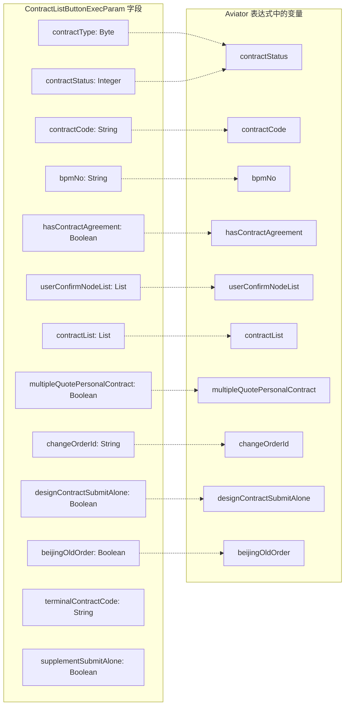

---

## 6. 关键设计模式

### 6.1 规则引擎模式

模块的核心设计模式是 **声明式规则引擎**：

- **规则定义**：按钮可见性以 Aviator 表达式字符串的形式声明，而非硬编码 `if/else` 逻辑
- **规则存储**：`MultidimensionalConfigService` 按维度（contractType × buttonType）组织规则
- **规则求值**：运行时将上下文参数绑定到表达式变量，由 Aviator 引擎统一求值
- **优先级机制**：通用规则（priority=10）→ 专属规则（priority=100）→ 兜底规则（priority=0）

这种设计的优势：
1. **可配置化**：新增/修改按钮规则无需改动 Java 代码
2. **关注点分离**：业务规则与执行逻辑解耦
3. **一致性**：所有按钮可见性通过统一的引擎计算

### 6.2 策略模式

不同场景（Home 列表、PC 列表、授权列表、预览页）的按钮配置遵循相同的 **初始化 + 查询** 模式，但各有独立的配置模块键和维度定义，体现了策略模式的思想。

### 6.3 自定义函数扩展

当业务逻辑过于复杂无法用简单表达式描述时，通过 `ContractFunction` 类注册自定义 Aviator 函数：

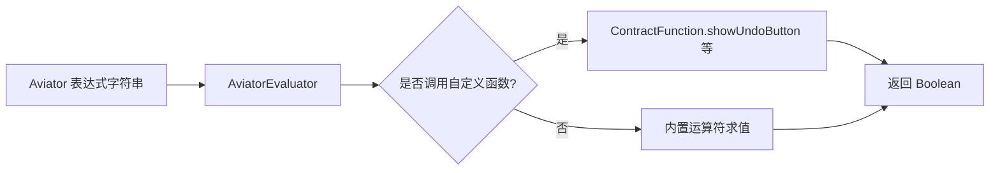

已注册的自定义函数：

| 函数 | 用途 | 调用位置 |
|------|------|---------|
| `showUndoButton(contractCode, userConfirmNodeList)` | 判断是否显示撤销按钮 | Home/PC 列表 |
| `showReSignButton(contractCode, contractType, contractStatus, contractList)` | 判断是否显示重签按钮 | Home/PC 列表 |
| `showChangeButton(contractList, contractCode)` | 判断是否显示去变更按钮 | Home 列表 |
| `showPersonCreateButton(contractList)` | 判断是否显示个性化合同创建按钮 | PC 列表 |

### 6.4 通配符维度匹配

配置中使用 `null`（对应表达式中的 `*`）作为 contractType 的通配符值：

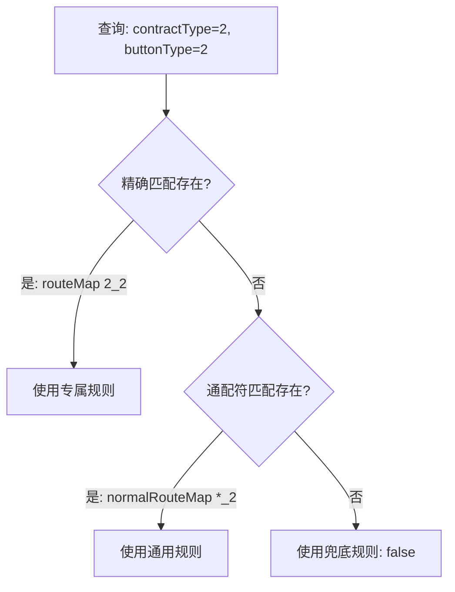

---

## 7. 合同类型与按钮规则映射

### 7.1 Home 端合同类型按钮矩阵

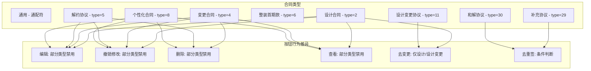

### 7.2 关键特殊规则说明

| 合同类型 | 按钮 | 特殊逻辑 |
|---------|------|---------|
| 变更合同（4） | 编辑/删除/撤销/查看 | 全部禁用（`false`） |
| 解约协议（5） | 编辑/撤销/删除 | 全部禁用 |
| 解约协议（5） | 查看 | 仅当前项目的解约协议可见 |
| 个性化合同（8） | 编辑 | 仅 C 单独发起时可见 |
| 个性化合同（8） | 删除 | 仅 C 单独发起且非变更发起时可见 |
| 设计合同（2） | 编辑/撤销/删除/查看 | 仅单独发起的设计合同可见 |
| 补充协议（29） | 编辑/撤销/删除 | 仅单独发起时可见 |
| 补充协议（29） | 审核详情 | 待签署/待确认时也允许查看 |
| 首期款合同（6） | 查看 | 已取消状态不展示 |
| 木作首期款 | 编辑 | 全部禁用 |

---

## 8. 关联模块引用

- **[ContractDetail](ContractDetail.md)**：ButtonConfig 的父模块，调用本模块获取合同详情页按钮
- **[DetailData](DetailData.md)**：同级模块，提供合同详情数据供按钮参数构建使用
- **[ContractAspect](ContractAspect.md)**：切面模块，通过 AOP 增强合同上下文，间接影响按钮参数
- **[ContractValidation](ContractValidation.md)**：字段校验模块，与按钮可见性形成互补（按钮控制能否操作，校验控制操作合法性）
- **[ContractSubmission](ContractSubmission.md)**：保存草稿和托管模块，按钮触发后进入的下游流程
- **[ContractSigning](ContractSigning.md)**：签约模块，签署相关按钮的目标流程