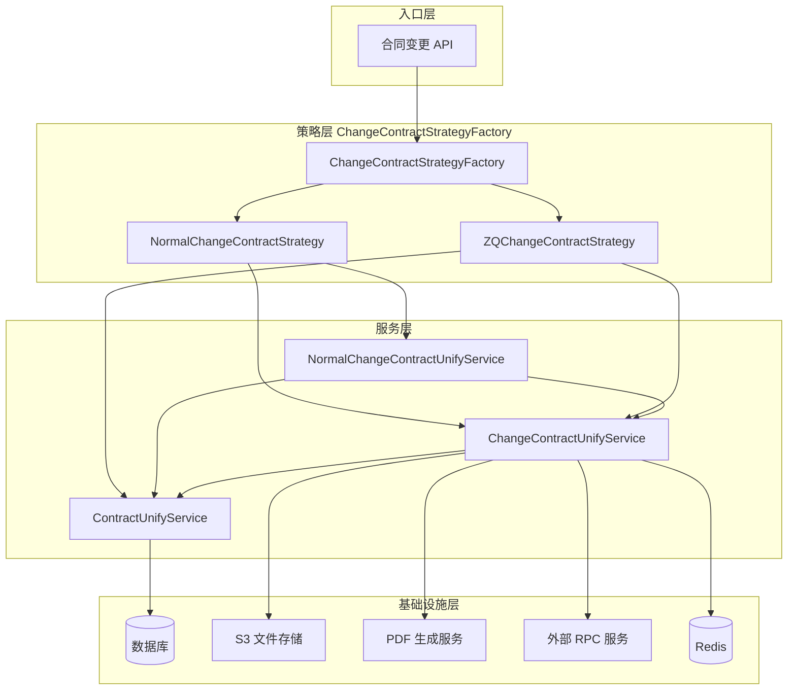
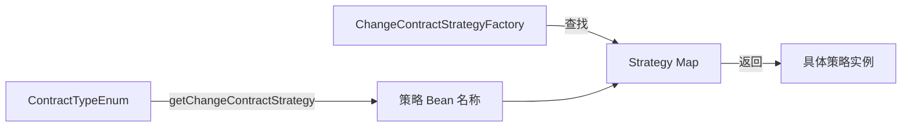
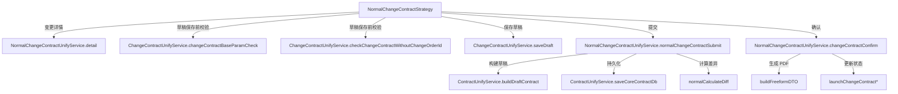
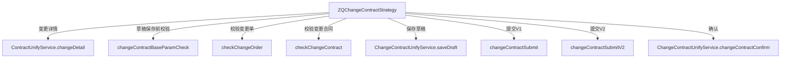
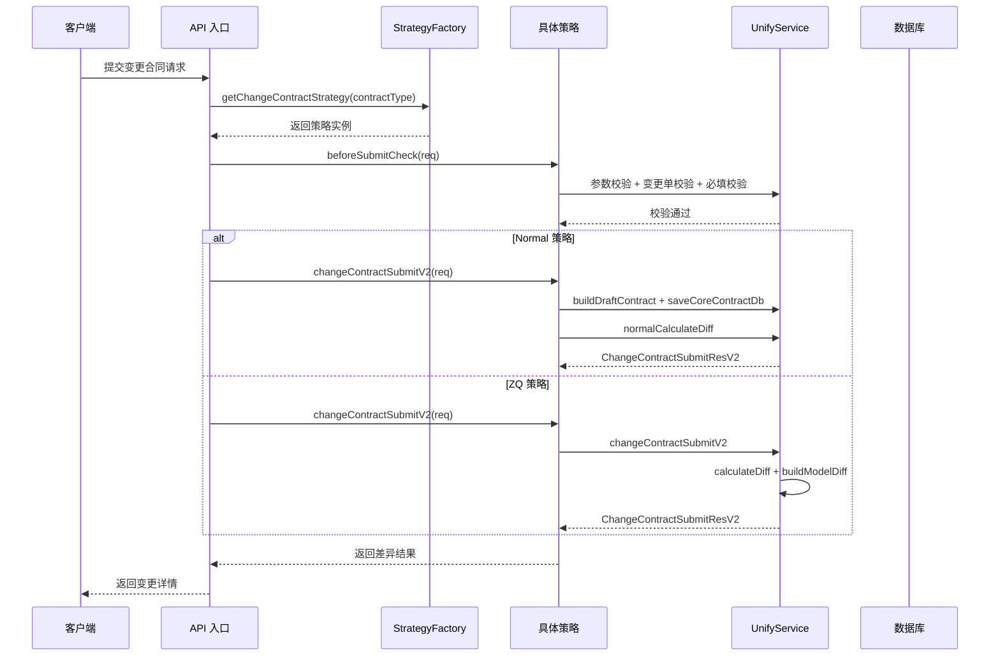
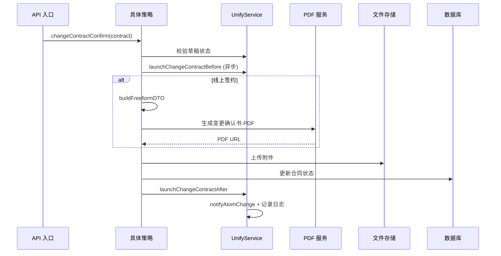
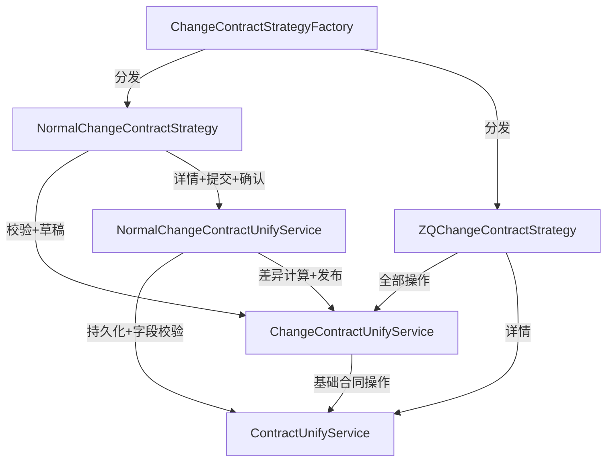

# ChangeContract 模块文档

## 模块概述

ChangeContract 模块负责**合同变更**业务流程的编排与执行。当客户在签约后需要修改合同条款（如设计费调整、套餐变更等），系统通过本模块生成一份变更合同，记录变更前后的差异，并走完审批、签章、确认的完整流程。

该模块采用**策略模式**，根据合同类型（如设计变更、套餐变更）路由到不同的策略实现，每种策略在验证规则、差异计算方式、提交流程上有所区别，但共享同一套底层服务。

---

## 架构总览



---

## 核心组件详解

### 1. ChangeContractStrategy — 策略接口

定义合同变更生命周期的 7 个核心操作，所有策略实现必须提供这些方法：

| 方法 | 阶段 | 说明 |
|------|------|------|
| `changeDetail()` | 查看 | 根据合同编号或工单号加载变更合同详情 |
| `beforeSaveDraftCheck()` | 保存草稿前 | 校验基础参数、变更单/变更合同的可发起状态 |
| `saveDraft()` | 保存草稿 | 持久化变更合同为草稿状态 |
| `beforeSubmitCheck()` | 提交前 | 在草稿校验基础上增加必填字段校验 |
| `changeContractSubmit()` | 提交(V1) | 按模块粒度计算差异的提交接口（兼容旧版 PC 端） |
| `changeContractSubmitV2()` | 提交(V2) | 统一差异字段的提交接口（2.5 版本） |
| `changeContractConfirm()` | 确认 | 异步执行变更合同的最终确认和 PDF 生成 |

### 2. ChangeContractStrategyFactory — 策略工厂

基于 Spring `ApplicationContextAware` 实现的策略工厂，在容器启动时自动收集所有 `ChangeContractStrategy` 实现 Bean，存入 `Map<String, ChangeContractStrategy>`。运行时通过 `ContractTypeEnum.getChangeContractStrategy()` 获取 Bean 名称进行查找。



### 3. NormalChangeContractStrategy — 设计变更策略

处理**设计变更合同**（`DESIGN_CHANGE` 类型），特点是不依赖变更单（changeOrderId），直接基于项目工单发起变更。



**关键特性**：
- 提交流程使用 `@ContractDataPrepare` 注解自动加载合同上下文
- 差异计算仅比较模板字段级变化（签约主体、客户信息、项目信息、设计金额四个维度）
- 确认时根据城市和业务类型生成对应配置的 PDF 变更确认书

### 4. ZQChangeContractStrategy — 套餐变更策略

处理**套餐变更合同**（`PACKAGE_CHANGE` 类型），必须关联变更单（changeOrderId），操作更完整地委托给 `ChangeContractUnifyService`。



**关键特性**：
- 需要验证变更单状态和变更合同的可发起条件
- 提交时按模块粒度计算差异（图纸、报价、附件、模板字段）
- 提供两个版本的提交接口：V1 按模块对比（兼容 PC）、V2 统一差异字段

### 5. ChangeContractUnifyService — 通用变更服务

提供 55+ 个方法，是两个策略共享的核心服务层，按职责可分为以下子域：

| 子域 | 核心方法 | 说明 |
|------|---------|------|
| **参数校验** | `changeContractBaseParamCheck`、`checkChangeOrder`、`checkChangeContract` | 变更合同发起前的前置校验 |
| **草稿管理** | `saveDraft` | 保存变更合同草稿 |
| **提交处理** | `changeContractSubmit`、`changeContractSubmitV2` | 两个版本的差异计算与提交 |
| **差异计算** | `calculateDiff`、`buildModelDiff`、`buildDrawingDiff` 等 | 多维度差异计算引擎 |
| **合同对比** | `compareContract`、`compareContractOther`、`compareContractQuote` | 新旧合同字段级对比 |
| **确认与发布** | `changeContractConfirm`、`launchChangeContract*` | 异步确认及后续处理 |
| **PDF 处理** | `isChangeContractPdf`、`pdfConvertToImage` | PDF 生成与图片转换 |
| **个人合同** | `generatePersonalContract`、`savePersonalContract` | 个人变更合同的生成与保存 |

### 6. NormalChangeContractUnifyService — 设计变更专用服务

8 个方法，专注设计变更合同的详情、提交和确认流程。见 [ContractCore](ContractCore.md) 中 ContractDetail 和 ContractSubmission 子模块的详细说明。

---

## 两种策略对比

| 维度 | NormalChangeContractStrategy | ZQChangeContractStrategy |
|------|------------------------------|--------------------------|
| **合同类型** | 设计变更（`DESIGN_CHANGE`） | 套餐变更（`PACKAGE_CHANGE`） |
| **变更单依赖** | 不需要 changeOrderId | 必须关联 changeOrderId |
| **变更单校验** | `checkChangeContractWithoutChangeOrderId` | `checkChangeOrder` + `checkChangeContract` |
| **详情查询** | `NormalChangeContractUnifyService.detail` | `ContractUnifyService.changeDetail` |
| **提交版本** | 仅支持 V2 | 支持 V1 和 V2 |
| **差异计算维度** | 模板字段（签约主体/客户/项目/金额） | 模块级（图纸/报价/附件/模板字段） |
| **确认 PDF** | `NormalChangeContractFreeformDTO` | `ChangeContractUnifyService` 统一处理 |

---

## 数据流

### 变更合同提交流程



### 变更合同确认流程



---

## 依赖关系

### 模块内部依赖



### 对外模块依赖

| 依赖模块 | 引用方式 | 用途 |
|---------|---------|------|
| [ContractCore](ContractCore.md) | `ContractUnifyService`、`ContractFieldCheckService`、`ContractDetailService` 等 | 基础合同操作（构建草稿、持久化、字段校验、详情查询） |
| [ContractAspect](ContractAspect.md) | `ContractContextAspect`、`@ContractDataPrepare` | AOP 切面自动加载合同上下文到 ThreadLocal |
| [PersonalBinding](PersonalBinding.md) | 通过 `ChangeContractUnifyService` 间接调用 | 个人合同关联关系处理 |
| [ContractPdfSelfCreate](ContractPdfSelfCreate.md) | 通过 `ChangeContractUnifyService` 间接调用 | PDF 自建模板生成 |
| [MaterialPdfDiff](MaterialPdfDiff.md) | 通过 `ChangeContractUnifyService` 间接调用 | 材料 PDF 差异比对 |

### 外部服务依赖

| 外部服务 | 说明 |
|---------|------|
| `AtomChangeRpc` | 原子变更系统，用于通知变更事件 |
| `AtomBudgetRpc` | 预算系统，获取报价数据 |
| `AtomDrawingRpc` | 图纸系统，获取图纸数据 |
| `QuotationFeignService` | 报价服务，获取报价单信息 |
| `PdfToImageService` | PDF 转图片服务 |
| `S3Service` | 文件存储服务 |
| `EventService` | 事件通知服务 |
| `LockService` | 分布式锁服务，防止并发提交 |
| `MemberRpc` | 会员服务，获取用户信息 |
| `CeresRpc` | Ceres 外部系统 |

---

## 关键设计模式

### 1. 策略模式 (Strategy Pattern)

`ChangeContractStrategy` 接口 + `ChangeContractStrategyFactory` 工厂构成经典的策略模式。通过 `ContractTypeEnum` 枚举的 `getChangeContractStrategy()` 方法将合同类型映射到策略 Bean 名称，实现了**类型→策略的解耦**。新增变更类型只需添加一个 `ChangeContractStrategy` 实现类并配置枚举映射即可。

### 2. 模板方法模式 (Template Method)

两个策略的执行流程遵循统一的生命周期：

```
beforeCheck → saveDraft → beforeSubmitCheck → submit → confirm
```

不同策略在每个步骤中的具体行为不同，但整体编排结构一致，调用方只需按顺序调用即可。

### 3. AOP 上下文注入 (`@ContractDataPrepare`)

`NormalChangeContractStrategy` 的提交流程使用 `@ContractDataPrepare` 注解（参见 [ContractAspect](ContractAspect.md)），由 `ContractContextAspect` 在方法执行前自动加载合同上下文（项目信息、城市公司信息、报价数据等）到 ThreadLocal，避免重复的数据加载逻辑。

### 4. 异步确认 + 轮询状态

合同确认流程采用异步执行模式：
- `changeContractConfirm()` 返回 pollKey
- 客户端通过 pollKey 轮询提交状态
- 后台通过 `launchChangeContractBefore` → PDF 生成 → `launchChangeContractAfter` 完成全链路
- 异常时通过 `launchChangeContractException` 记录错误状态

### 5. 分布式锁防并发

通过 `LockService` 在提交和确认阶段加锁，防止同一工单的并发提交导致数据不一致。`checkContractLaunching()` 方法检查合同是否正在提交中。