Based on the core component codes already provided, I have sufficient information to generate the comprehensive documentation. Let me proceed directly.

# ContractAspect 模块文档

## 1. 模块概述

ContractAspect 是合同服务（Contract Service）中的**横切关注点（Cross-Cutting Concern）模块**，基于 Spring AOP 实现。该模块的核心职责是在合同业务操作执行**之前**，自动完成数据预加载和上下文初始化，将分散在各业务 Service 中的数据准备逻辑统一收敛到切面层，实现**数据准备与业务逻辑的解耦**。

该模块管理两个独立的 AOP 切面流：

- **合同保存/提交流**（`ContractContextAspect`）：拦截标注了 `@ContractDataPrepare` 注解的方法，在合同保存草稿、提交、签约等操作前并行加载项目信息、报价信息、图纸信息、存管账户信息等。
- **合同详情查询流**（`ContractDetailAspect`）：拦截标注了 `@ContractDetailDataPrepare` 注解的方法，在查询合同详情前并行加载项目信息、报价信息、备件信息、款项信息、风控审核信息等。

两个切面各配合一个基于 `ThreadLocal` 的上下文 Handler（`ContractContextHandler` / `ContractDetailContextHandler`），确保同一线程内的下游 Service 可以直接获取预加载数据，无需重复查询。

## 2. 架构设计

### 2.1 模块在整体系统中的位置

```mermaid
graph TD
    subgraph ClientLayer[客户端层]
        HomeApp[Home APP]
        PCWeb[PC Web]
    end

    subgraph ControllerLayer[Controller 层]
        HomeContractCtrl[Home 合同 Controller]
        PCContractCtrl[PC 合同 Controller]
        HomeDetailCtrl[Home 详情 Controller]
        PCDetailCtrl[PC 详情 Controller]
    end

    subgraph AspectLayer[ContractAspect 模块]
        CDA[ContractDataPrepare 注解]
        CDPA[ContractDetailDataPrepare 注解]
        CCA[ContractContextAspect]
        CDA_A[ContractDetailAspect]
        CCH[ContractContextHandler]
        CDCH[ContractDetailContextHandler]
    end

    subgraph CoreLayer[ContractCore 模块]
        SaveDraft[ContractSaveDraftService]
        Escrow[ContractEscrowService]
        CompanySign[ContractCompanySignService]
        SelfSeal[ContractSelfSealService]
        Detail[ContractDetailService]
        BtnConfig[ContractButtonConfigService]
    end

    subgraph RpcLayer[RPC / 外部服务]
        ProjectRPC[ProjectInfoReadService]
        QuotaRPC[QuotationFeignService]
        DrawRPC[AtomDrawingRpc]
        EscrowRPC[EscrowRpc]
        ChangeRPC[AtomChangeRpc]
        AuditRPC[AuditRpc]
        FundRPC[FundInfoService]
        OrderRPC[OrderStandardQueryRpc]
    end

    HomeApp --> HomeContractCtrl
    PCWeb --> PCContractCtrl
    HomeApp --> HomeDetailCtrl
    PCWeb --> PCDetailCtrl

    HomeContractCtrl --> CDA
    PCContractCtrl --> CDA
    HomeDetailCtrl --> CDPA
    PCDetailCtrl --> CDPA

    CDA --> CCA
    CDPA --> CDA_A

    CCA --> CCH
    CDA_A --> CDCH

    CCA --> SaveDraft
    CCA --> Escrow
    CCA --> CompanySign
    CCA --> SelfSeal
    CDA_A --> Detail
    CDA_A --> BtnConfig

    CCA --> ProjectRPC
    CCA --> QuotaRPC
    CCA --> DrawRPC
    CCA --> EscrowRPC
    CCA --> ChangeRPC

    CDA_A --> ProjectRPC
    CDA_A --> QuotaRPC
    CDA_A --> DrawRPC
    CDA_A --> FundRPC
    CDA_A --> AuditRPC
    CDA_A --> ChangeRPC
    CDA_A --> OrderRPC
```

### 2.2 核心组件关系

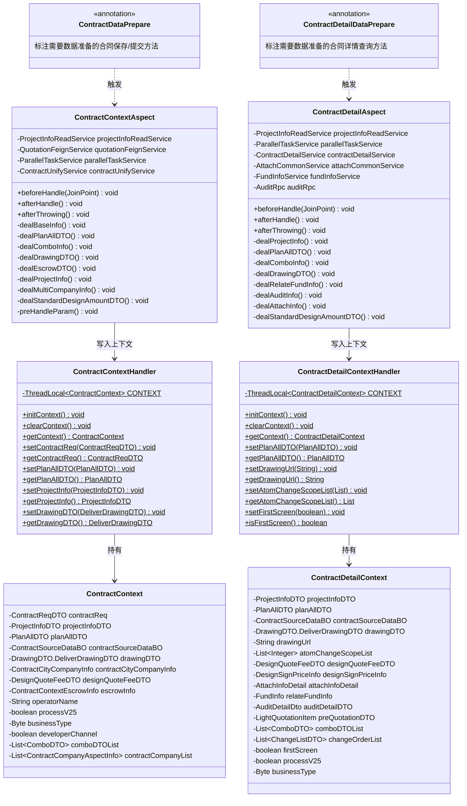

## 3. 核心组件详解

### 3.1 ContractContextAspect — 合同保存/提交切面

`ContractContextAspect` 是标注了 `@Aspect` 和 `@Component` 的 Spring Bean，通过 AOP 拦截所有标注了 `@ContractDataPrepare` 注解的方法。其生命周期如下：

| AOP 通知 | 方法 | 职责 |
|----------|------|------|
| `@Before` | `beforeHandle()` | 初始化上下文、参数预处理、并行加载数据、设置上下文 |
| `@After` | `afterHandle()` | 清除 ThreadLocal 上下文 |
| `@AfterThrowing` | `afterThrowing()` | 异常时也清除 ThreadLocal 上下文，防止内存泄漏 |

#### 3.1.1 数据准备流程

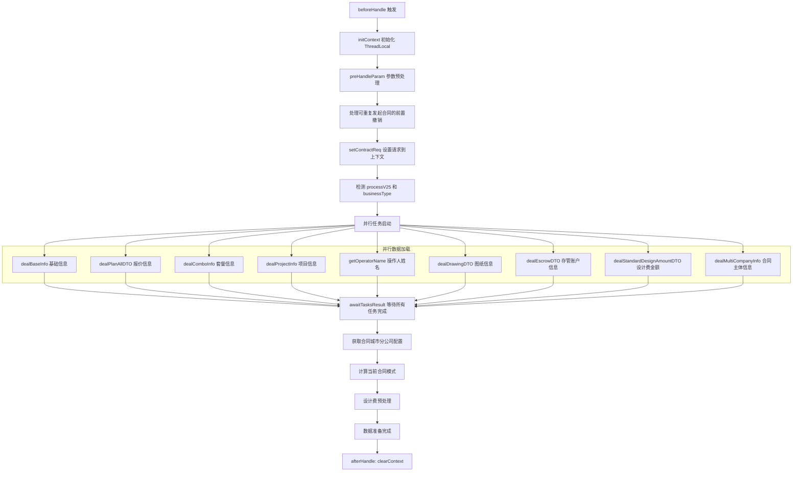

#### 3.1.2 参数预处理逻辑

`preHandleParam()` 方法在并行数据加载之前执行，负责根据业务规则清理和规范化请求参数：

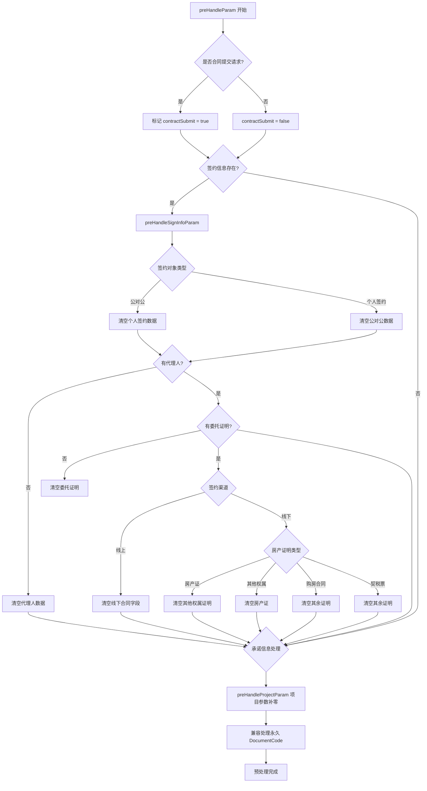

#### 3.1.3 报价信息准备（dealPlanAllDTO）

报价信息的获取路径根据合同类型和业务类型有多条分支：

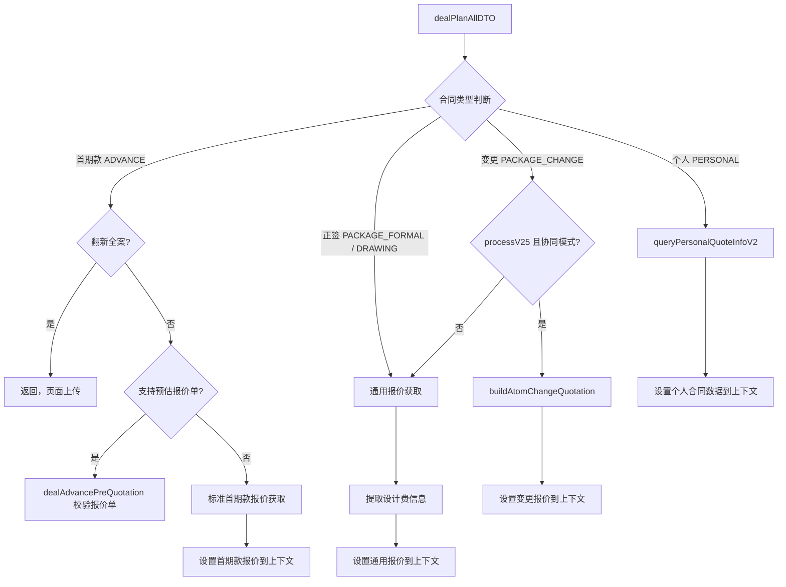

### 3.2 ContractContextHandler — 合同保存上下文管理器

`ContractContextHandler` 是一个纯静态工具类，基于 `ThreadLocal<ContractContext>` 实现线程安全的上下文传递：

| 特性 | 说明 |
|------|------|
| **线程隔离** | 每个请求线程拥有独立的 `ContractContext` 实例 |
| **生命周期管理** | `@Before` 初始化 → 业务方法使用 → `@After` / `@AfterThrowing` 清除 |
| **防泄漏保障** | 异常路径也会执行 `clearContext()` |
| **空安全** | getter 方法先检查 `CONTEXT.get() == null`，防止 NPE |

### 3.3 ContractDetailAspect — 合同详情查询切面

`ContractDetailAspect` 的结构与 `ContractContextAspect` 类似，但面向**合同详情查询**场景，增加了首屏优化和更多详情相关数据的加载。

#### 3.3.1 首屏优化策略

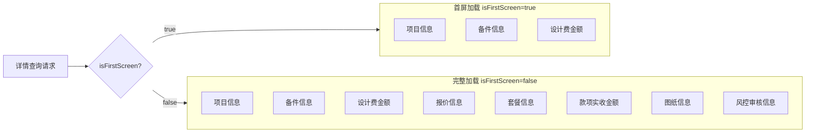

首屏模式下仅加载 3 项基础数据，减少首屏响应时间；非首屏时并行加载全部 8 项数据。

#### 3.3.2 详情查询额外数据

与合同保存切面相比，详情切面额外加载以下数据：

| 数据项 | 方法 | 说明 |
|--------|------|------|
| 款项实收金额 | `dealRelateFundInfo()` | 根据合同类型映射关联款项类型，查询实际收款金额 |
| 风控审核信息 | `dealAuditInfo()` | 仅合并发起的正签合同，获取审核详情和变更单列表 |
| 备件信息 | `dealAttachInfo()` | 仅正签合同，获取项目级备件信息 |
| 预估报价单 | `dealPlanAllDTO()` 中首期款分支 | 获取 `LightQuotationDTO` 预估报价 |

### 3.4 ContractDetailContextHandler — 合同详情上下文管理器

与 `ContractContextHandler` 结构相同，操作 `ThreadLocal<ContractDetailContext>`。额外暴露了详情特有的访问方法：

- `setDrawingUrl(String)` / `getDrawingUrl()` — 变更图纸 URL
- `setAtomChangeScopeList(List<Integer>)` / `getAtomChangeScopeList()` — 变更范围列表
- `setFirstScreen(boolean)` / `isFirstScreen()` — 首屏标记

## 4. 数据流

### 4.1 合同保存/提交数据流

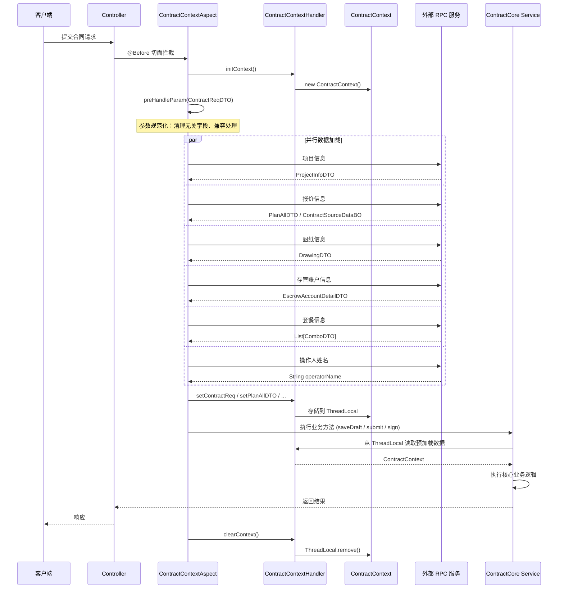

### 4.2 合同详情查询数据流

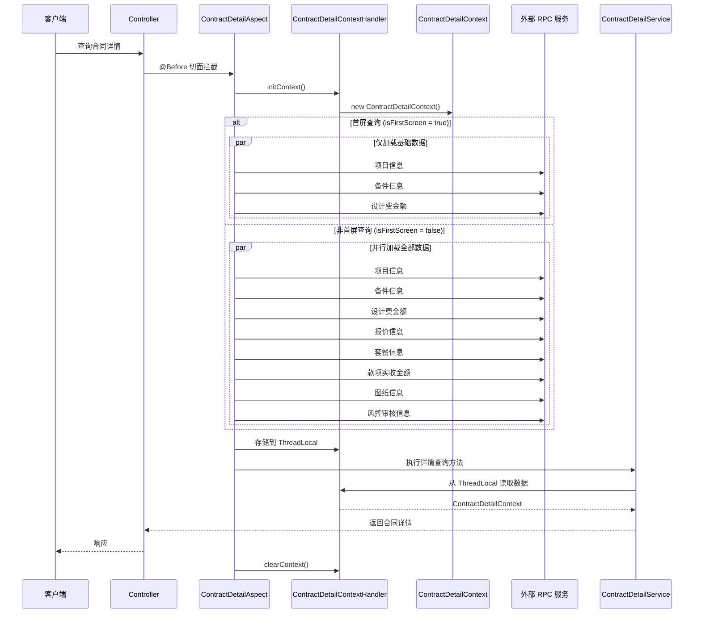

## 5. 依赖关系

### 5.1 模块间依赖

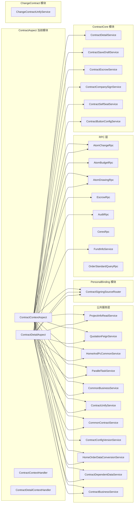

### 5.2 外部 RPC 依赖清单

| RPC 服务 | 所属系统 | 调用切面 | 用途 |
|----------|---------|---------|------|
| `ProjectInfoReadService` | 项目服务 | 两个切面 | 获取项目信息 |
| `QuotationFeignService` | 中控报价 | 两个切面 | 获取报价单和套餐信息 |
| `AtomDrawingRpc` | 图纸服务 (Atom) | 两个切面 | 获取施工图纸 |
| `AtomChangeRpc` | 变更服务 (Atom) | 两个切面 | 获取变更申请信息和变更列表 |
| `AtomBudgetRpc` | 预算服务 (Atom) | ContextAspect | 获取预估报价单 |
| `EscrowDomain` / `EscrowRpc` | 存管服务 | ContextAspect | 获取存管账户开户信息 |
| `OrderStandardQueryRpc` | 工单标准查询 | 两个切面 | 获取套餐信息（2.5 流程） |
| `FundInfoService` | 款项服务 | DetailAspect | 获取关联款项实收金额 |
| `AuditRpc` | 审计服务 | DetailAspect | 获取风控审核信息 |
| `CeresRpc` | 服务者中心 | DetailAspect | 获取设计师人员信息 |
| `MdmDataRpc` / `MdmRpc` | MDM 主数据 | ContextAspect | 获取分公司信息 |
| `HomeOrderDataConversionService` | 工单转换 | 两个切面 | 获取正签/变更报价源数据 |
| `ContractDependentDataService` | 合同依赖数据 | 两个切面 | 构建个人合同报价数据 |

## 6. 关键设计模式

### 6.1 AOP + ThreadLocal 上下文模式

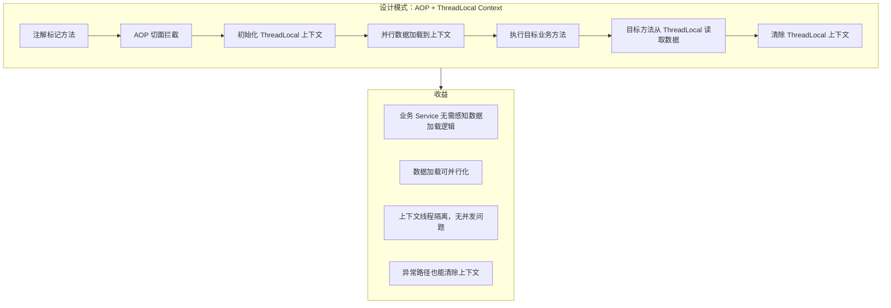

**优势**：
- **关注点分离**：ContractCore 中的 Service（如 `ContractSaveDraftService`）只需通过 `ContractContextHandler.getContext()` 获取预加载数据，无需了解数据如何获取
- **并行加速**：通过 `ParallelTaskService` 并行执行多个 RPC 调用，显著降低总耗时
- **线程安全**：`ThreadLocal` 保证每个请求线程有独立的上下文副本

**风险与缓解**：
- **内存泄漏**：通过 `@After` + `@AfterThrowing` 双重保障清除
- **Long-lived 线程**：仅在 HTTP 请求线程中使用，不涉及线程池复用场景

### 6.2 策略分发模式 — 合同类型路由

报价信息获取（`dealPlanAllDTO`）和图纸信息获取（`dealDrawingDTO`）根据合同类型和业务类型走不同分支，本质上是一种策略分发：

| 合同类型 | 报价来源 | 图纸来源 |
|---------|---------|---------|
| 首期款 (ADVANCE) | 预估报价单 / `AtomBudgetRpc` | 不获取 |
| 正签 (PACKAGE_FORMAL) | `HomeOrderDataConversionService` | 2.5 团装走 `getGroupDrawingDTO`，其他走 `AtomDrawingRpc` |
| 变更 (PACKAGE_CHANGE) | 2.5 协同模式走 `buildAtomChangeQuotation`，其他走通用 | `AtomDrawingRpc.getChangeListDrawings` |
| 图纸合同 (DRAWING) | 通用报价 | `AtomDrawingRpc.listDrawings` |
| 个人 (PERSONAL) | `ContractDependentDataService` | `ContractSigningSourceRouter` 策略路由 |
| 设计合同 (DESIGN) | 不获取报价 | 不获取图纸 |
| 存管 (FUND_ESCROW) | 不获取报价 | 不获取图纸 |
| 解约 (TERMINAL) | 不获取报价 | 不获取图纸 |

### 6.3 首屏优化模式

`ContractDetailAspect` 引入 `isFirstScreen` 标记，实现分阶段加载：

- **首屏**（`isFirstScreen = true`）：仅加载项目信息、备件信息、设计费金额 3 项轻量数据，快速返回页面首屏所需内容
- **完整加载**（`isFirstScreen = false`）：并行加载全部 8 项数据，包括报价、图纸、审核等重量级数据

该模式有效降低了合同详情页面的首屏加载时间。

## 7. 与 ContractCore 模块的交互

ContractAspect 模块与 [ContractCore](ContractCore.md) 模块形成**数据准备 → 业务消费**的协作关系：

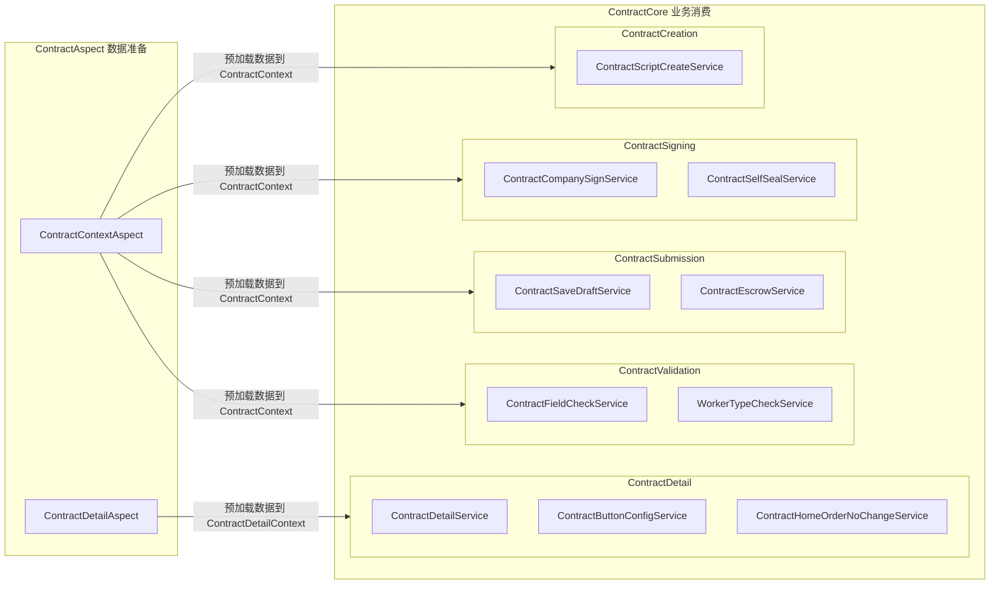

ContractCore 中的 Service 通过 `ContractContextHandler.getContext()` 和 `ContractDetailContextHandler.getContext()` 获取切面预加载的数据，避免了重复的 RPC 调用。