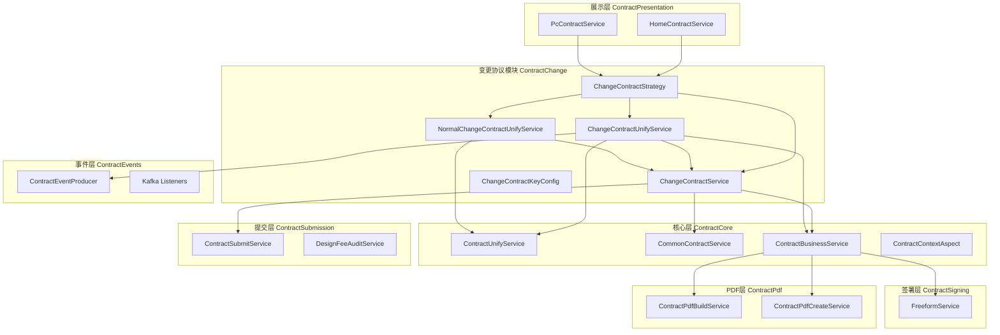
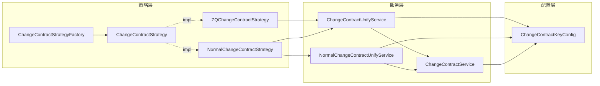
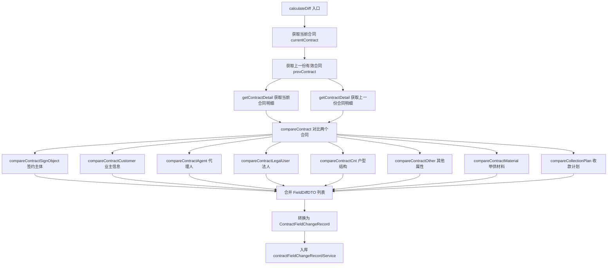
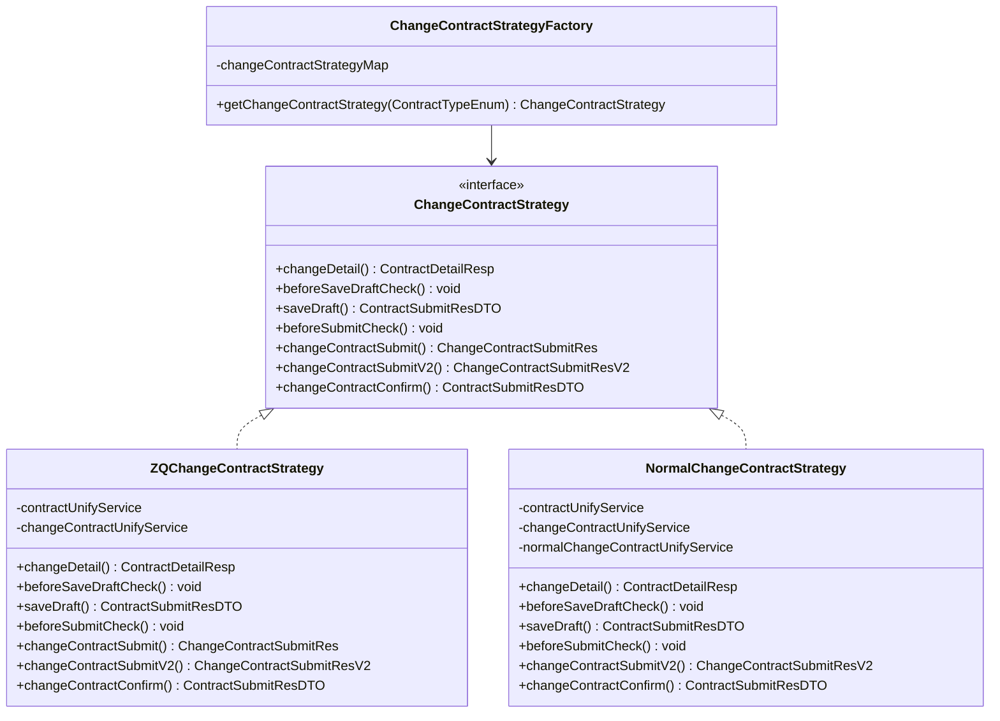
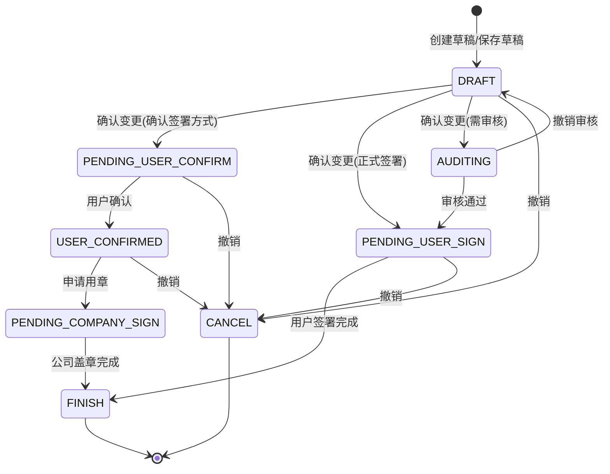
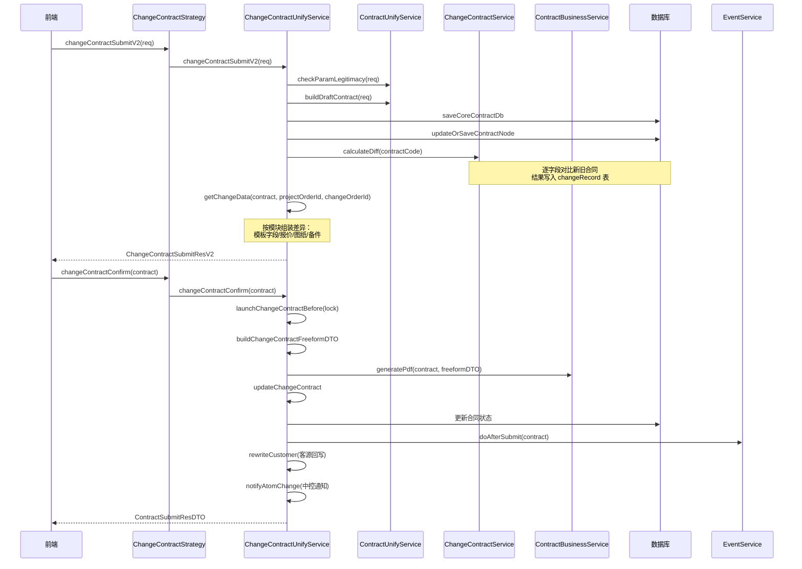
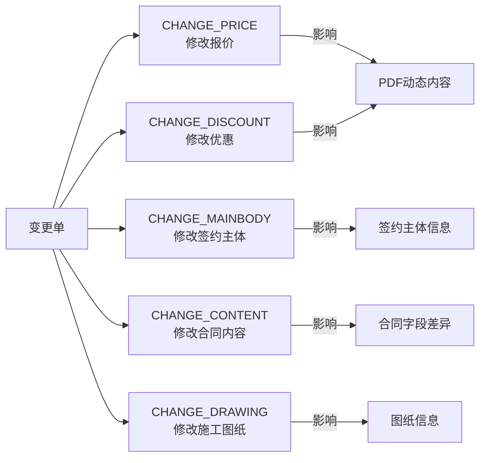
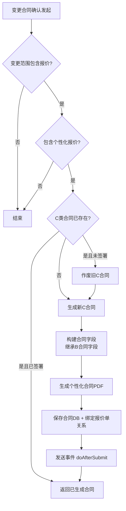
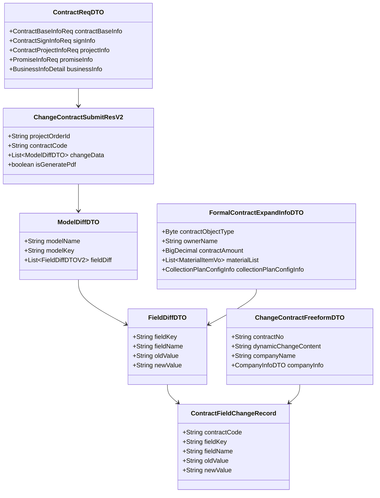

# ContractChange 模块文档

## 1. 模块概述

ContractChange 模块是合同管理系统中的**变更协议**子系统，负责在已有正签合同/变更合同的基础上，管理合同内容的变更流程。该模块覆盖了变更协议的完整生命周期：创建草稿 → 提交差异对比 → 确认发起 → PDF 生成 → 客户签署 → 公司盖章 → 合同完成。

模块支持多种业务场景的变更协议，包括：
- **整装变更（PACKAGE_CHANGE）**：标准套餐装修合同的变更
- **设计变更（DESIGN_CHANGE）**：设计服务费相关合同的变更
- **个性化变更**：变更过程中同步生成个性化（C类）合同

同时兼容两种业务流程模式：
- **2.0 模式**：基于报价服务（QuotationFeignService）的变更流程
- **2.5 模式（合并发起）**：基于中控变更（AtomChangeRpc）的新流程

## 2. 架构总览

### 2.1 模块在系统中的位置

### 2.2 核心组件依赖关系

## 3. 核心组件详解

### 3.1 ChangeContractService（变更协议核心服务）

**职责**：处理 2.0 模式下的变更协议核心逻辑，包括草稿管理、差异计算、合同对比、签约主体管理、PDF 构建等。

**关键方法分组**：

| 方法分组 | 代表方法 | 说明 |
|---------|---------|------|
| 字段详情 | `fieldsDetail`, `initChangeContractDetail` | 加载变更合同编辑页面的字段信息，初始化上一份合同数据 |
| 差异计算 | `calculateDiff`, `compareContract` | 对比新旧合同，生成 `ContractFieldChangeRecord` 差异记录 |
| 差异对比子维度 | `compareContractSignObject`, `compareContractCustomer`, `compareContractAgent`, `compareContractLegalUser`, `compareContractCnt`, `compareContractOther`, `compareContractMaterial`, `compareCollectionPlan` | 分维度逐字段对比：签约主体、客户、代理人、法人、户型、其他属性、甲供材料、收款计划 |
| 差异展示 | `getContractDiff`, `getContractDiffWithSection`, `getAllContractDiffWithSection`, `getContractDiffWithSectionForPc` | 查询差异记录并按区域分组（主体差异/内容差异/优惠差异） |
| 签约主体 | `getSignObject`, `saveSignObject`, `encryptSignObject` | 管理变更合同的签约主体（个人/公对公） |
| 草稿与提交 | `saveChangeContractDraft`, `submitChangeContractDraft`, `confirmChangeContract` | 草稿保存、提交差异确认、最终确认发起 |
| PDF 构建 | `buildChangeContractFreeformDTO`, `preview` | 构建变更协议 Freeform DTO 用于 PDF 生成 |
| 变更范围判断 | `changePriceScope`, `changeDiscountScope`, `changeSignObjectScope` | 根据变更单判断变更范围（报价/优惠/主体） |
| 合同列表与按钮 | `getChangContractList`, `getChangeContractButtonList` | PC 端变更协议列表和按钮逻辑 |
| 撤销 | `undoContract` | 撤销变更合同，回退状态到草稿 |

**核心数据流——差异计算**：

### 3.2 ChangeContractUnifyService（统一变更协议服务）

**职责**：处理 2.5 模式（合并发起）下的变更协议逻辑，是对 `ChangeContractService` 的扩展和升级，支持中控变更交互、个性化合同生成、多维度差异展示等。

**关键方法分组**：

| 方法分组 | 代表方法 | 说明 |
|---------|---------|------|
| 草稿保存 | `saveDraft` | 校验参数 + 构建草稿 + 入库 |
| 变更校验 | `checkChangeOrder`, `checkChangeContract`, `changeContractBaseParamCheck` | 校验变更单状态、在途合同、必填参数 |
| 提交流程 | `changeContractSubmit`, `changeContractSubmitV2` | 提交变更合同，计算差异，返回差异展示数据 |
| 差异构建（V2） | `buildChangeContractDiffV2`, `getChangeData`, `buildModelDiff`, `buildQuotationModelDiff`, `buildDrawingDiff`, `buildAttachModelDiff` | 按模块（签约信息/报价/图纸/备件）构建结构化差异 |
| 合同确认 | `changeContractConfirm`, `launchChangeContractBefore/After/Exception` | 异步确认发起变更合同，含锁机制和异常处理 |
| 撤销审核 | `undoAudit`, `undoAuditChangeContract` | 团装合同撤销审核 |
| 个性化合同 | `generatePersonalContract`, `generatePersonalContractV2`, `generatePersonalContractV3`, `buildPersonContract` | 变更触发个性化（C类）合同的自动生成 |
| PDF 构建 | `buildChangeContractFreeformDTO` | 构建变更协议 Freeform DTO（2.5 增强版） |
| 差异计算 | `calculateDiff`, `calculateDiffByReq` | 从 DB 或请求参数计算差异 |
| 报价差异 | `getQuoteBillDiff`, `buildAtomChangeQuotationPdfDiff`, `buildQuoteChangeDiffBo` | 2.5 模式下基于中控报价的差异计算 |

### 3.3 NormalChangeContractUnifyService（普通变更协议服务）

**职责**：处理设计变更（DESIGN_CHANGE）合同的逻辑，专注于设计费、设计师级别、房屋结构等字段的差异对比。

**关键方法**：

| 方法 | 说明 |
|------|------|
| `detail` | 加载设计变更合同详情，继承正签合同字段 |
| `normalChangeContractSubmit` | 设计变更合同提交，计算模板字段差异 |
| `changeContractConfirm` | 异步确认发起设计变更合同 |
| `normalCalculateDiff` | 计算设计变更差异（签约主体 + 业主 + 房屋信息 + 设计费） |
| `buildFreeformDTO` | 构建设计变更 PDF 的 Freeform DTO |

### 3.4 策略模式（ChangeContractStrategy）

**策略路由规则**：
- `ZQChangeContractStrategy`：处理整装/局装/团装/翻新全案的变更合同（PACKAGE_CHANGE 等）
- `NormalChangeContractStrategy`：处理设计变更合同（DESIGN_CHANGE）

`ChangeContractStrategyFactory` 通过 `ContractTypeEnum.getChangeContractStrategy()` 获取对应的 Spring Bean 名称，从容器中查找策略实现。

### 3.5 ChangeContractKeyConfig（变更条款配置）

**职责**：根据城市和业务类型，维护变更协议 PDF 中各变更项的条款位置（第几条第几款）。

**配置映射表**：

| 配置键 | 业务场景 | 示例条目 |
|-------|---------|---------|
| `default_1_4` | 默认整装变更 | AGENT→第四条第一款, STRUCTURE→第一条第三款 |
| `default_3_4` | 默认局装变更 | PART_ROOM_RANGE→第一条第四款 |
| `default_2_4` | 默认团装变更 | CONTRACT_AMOUNT→第一条第六款 |
| `default_4_4` | 默认翻新全案变更 | GUARANTEE_INFO→第三条第二款 |
| `mergeLaunch_1_4` | 北京整装变更(2.5) | PRICING_AREA→第一条1.2款 |
| `default_1_11` | 整装/局装设计变更 | AFTER_DISCOUNT_DESIGNER_AMOUNT→第三条2.2款 |

## 4. 变更协议完整生命周期

### 4.1 状态流转

### 4.2 变更协议提交确认流程

## 5. 变更范围与差异维度

### 5.1 变更范围枚举

变更范围定义了本次变更可以修改的内容：

### 5.2 差异对比维度

系统支持以下维度的差异对比：

| 维度 | 方法 | 对比字段 |
|------|------|---------|
| 签约主体 | `compareContractSignObject` | 主体类型、签约形式、签署方式、线下合同附件 |
| 业主信息 | `compareContractCustomer` | 姓名、手机号、证件类型/号、住所地址、公司信息、经办人信息 |
| 代理人 | `compareContractAgent` | 是否有代理人、姓名、手机号、证件 |
| 法人信息 | `compareContractLegalUser` | 签约人角色、法定代表人信息 |
| 户型结构 | `compareContractCnt` | 厅/室/厨/卫/阳台/储物间数量、建筑面积 |
| 其他属性 | `compareContractOther` | 住宅结构、房本地址、承包方式、税率、纠纷处理、保修年限、工期、设计费 |
| 甲供材料 | `compareContractMaterial` | 材料清单数量和内容 |
| 收款计划 | `compareCollectionPlan` | 收款阶段和金额 |
| 报价信息 | `compareContractQuote`(2.5) | 套餐名称、计价面积、报价金额 |
| 备件字段 | `compareContractAttachFiled` | 代理人委托证明 |

## 6. 个性化合同生成

当变更范围包含报价变更时，系统可能触发个性化（C类）合同的自动生成：

**V3 版本（generatePersonalContractV3）** 增加了：
- 分公司维度支持（companyCodeList）
- 重试机制（@Retryable, 最多 3 次）
- 分布式锁（LockService）
- 补贴单正式签署校验

## 7. 关键设计模式

### 7.1 策略模式（Strategy Pattern）

变更合同操作通过 `ChangeContractStrategy` 接口抽象，`ChangeContractStrategyFactory` 根据合同类型路由到具体实现：
- **ZQChangeContractStrategy**：正签类变更（整装/局装/团装/翻新全案）
- **NormalChangeContractStrategy**：设计变更

调用方无需关心具体业务类型，统一通过策略接口操作。

### 7.2 模板方法模式（Template Method）

变更合同确认流程 `changeContractConfirm` 遵循统一模板：
1. 前置检查（launchBefore）：加锁 + 设置上下文
2. 核心逻辑：生成 PDF → 更新状态 → 发送事件
3. 后置处理（launchAfter）：保存结果到 Redis + 解锁
4. 异常处理（launchException）：记录错误信息 + 解锁

### 7.3 AOP 上下文准备（@ContractDataPrepare）

通过 `ContractContextAspect` 切面，在方法执行前自动准备变更合同所需的上下文数据：
- 项目信息（ProjectInfoDTO）
- 报价信息（PlanAllDTO）
- 套餐信息（ComboInfo）
- 图纸信息（DrawingDTO）
- 托管信息（EscrowDTO）

### 7.4 异步确认 + 轮询

合同确认采用异步模式：
- `changeContractConfirm` 提交后立即返回 pollingKey
- 前端通过 pollingKey 轮询获取结果
- 内部使用 `CompletableFuture` + `contractSubmitExternalExecutor` 线程池执行
- 同步/异步通过 `contractUnifyService.contractSubmitSync` 控制

### 7.5 加密脱敏

敏感字段（手机号、证件号）在差异对比前统一加密：
- `encryptExpandInfo`：批量加密 `FormalContractExpandInfoDTO` 中的敏感字段
- `encryptSignObject`：加密签约主体中的敏感字段
- 确保差异记录中存储的是加密后的值，保护用户隐私

## 8. 与其他模块的依赖关系

```mermaid
graph TD
    subgraph ContractChange[ContractChange 变更协议]
        CCS[ChangeContractService]
        CCUS[ChangeContractUnifyService]
    end

    subgraph DependsOn[依赖模块]
        ContractCore[ContractCore<br/>合同核心服务]
        ContractSubmission[ContractSubmission<br/>合同提交服务]
        ContractPdf[ContractPdf<br/>PDF生成服务]
        ContractConfig[ContractConfig<br/>合同配置]
        ContractEvents[ContractEvents<br/>事件驱动]
        ContractSigning[ContractSigning<br/>签约服务]
    end

    subgraph ExternalRPC[外部RPC依赖]
        Quotation[QuotationFeignService<br/>报价服务]
        Atom[AtomChangeRpc<br/>中控变更服务]
        AtomBudget[AtomBudgetRpc<br/>中控报价服务]
        Athena[AthenaRpc<br/>计划信息]
        Customer[CustomerFeignService<br/>客源服务]
        Freeform[FreeformService<br/>协议平台]
        Octopus[OctopusRpc<br/>款项服务]
    end

    CCS --> ContractCore
    CCS --> ContractSubmission
    CCS --> ContractConfig
    CCS --> ContractEvents
    CCUS --> ContractCore
    CCUS --> ContractSubmission
    CCUS --> ContractPdf
    CCUS --> ContractSigning
    CCUS --> ContractConfig
    CCUS --> ContractEvents
    CCS --> Quotation
    CCS --> Customer
    CCS --> Athena
    CCUS --> Atom
    CCUS --> AtomBudget
    CCUS --> Quotation
    CCUS --> Octopus
    CCUS --> Freeform
```

**关键依赖说明**：

| 依赖 | 模块 | 用途 |
|------|------|------|
| `ContractUnifyService` | ContractCore | 统一合同操作：校验、保存、详情构建 |
| `CommonContractService` | ContractCore | 公共合同服务：公司信息、收款计划、城市映射 |
| `ContractBusinessService` | ContractCore | 合同业务服务：PDF生成、盖章、签署结果 |
| `PcContractService` | ContractCore | PC端合同服务：详情构建、字段保存 |
| `ContractSubmitService` | ContractSubmission | 合同提交服务：构建提交数据、配额扣减 |
| `ContractPdfBuildService` | ContractPdf | PDF字段数据构建 |
| `ChangeContractKeyConfig` | ContractConfig | 变更条款位置配置 |
| `ContractApolloConfig` | ContractConfig | Apollo 动态配置 |
| `EventService` / Kafka | ContractEvents | 变更事件发布和消费 |
| `FreeformService` | ContractSigning | 协议平台 PDF 生成和盖章 |

## 9. 数据模型

### 9.1 核心数据表

| 表 | 说明 |
|----|------|
| `Contract` | 合同主表，存储合同状态、类型、编码、变更单ID等 |
| `ContractField` | 合同字段表，以 key-value 形式存储合同内容 |
| `ContractUser` | 合同用户表，存储业主/代理人/经办人/法人等角色信息 |
| `ContractAttach` | 合同附件表，存储线下合同、备件等文件 |
| `ContractMaterial` | 甲供材料表 |
| `ContractNode` | 合同节点表，记录提交/确认/签署/盖章等关键节点时间 |
| `ContractFieldChangeRecord` | 字段变更记录表，存储新旧合同的字段级差异 |
| `ContractStatusLog` | 状态变更日志 |
| `ContractCollectionPlanRecord` | 合同收款计划快照表 |

### 9.2 核心 DTO 关系

## 10. 2.0 与 2.5 模式对比

| 特性 | 2.0 模式 | 2.5 模式（合并发起） |
|------|---------|---------------------|
| 入口服务 | `ChangeContractService` | `ChangeContractUnifyService` |
| 报价来源 | `QuotationFeignService` | `AtomBudgetRpc` + `AtomChangeRpc` |
| 变更范围判断 | `ChangeOrderReadService` | `AtomChangeRpc.getChangeApplyInfo` |
| 差异展示 | 按字段分区域（signObjectDiff/contentDiff） | 按模块分组（模板字段/报价/图纸/备件） |
| 收款计划变更 | 支持差异对比 | 2.5 不在变更合同中展示 |
| PDF 模板 | `ChangeContractFreeformDTO` | 同一 DTO 增强版（含 PDF/图片多格式） |
| 个性化合同 | `generatePersonalContract` | `generatePersonalContractV2/V3` |
| 中控交互 | 无 | `notifyAtomChange` 同步提交到中控 |
| 图纸差异 | 不支持 | `buildDrawingDiff` 支持 |
| 备件差异 | 不支持 | `buildAttachModelDiff` 支持 |

## 11. 配置与扩展点

### 11.1 Apollo 动态配置

| 配置项 | 说明 |
|-------|------|
| `sign.change.collectionPlan.orderId` | 收款计划变更白名单项目 |
| `editColumnList` / `partEditColumnList` | 可编辑字段列表（整装/局装） |
| `changeContractFieldSection` | 差异字段分区配置（2.0 PC端） |

### 11.2 扩展新合同类型变更

1. 在 `ContractTypeEnum` 中定义新的变更合同类型及对应的策略 Bean 名称
2. 实现 `ChangeContractStrategy` 接口的策略类
3. 在 `ChangeContractKeyConfig` 中添加新合同类型的条款位置配置
4. 在 `ChangeKeyEnum` 中添加新合同类型的变更项枚举
