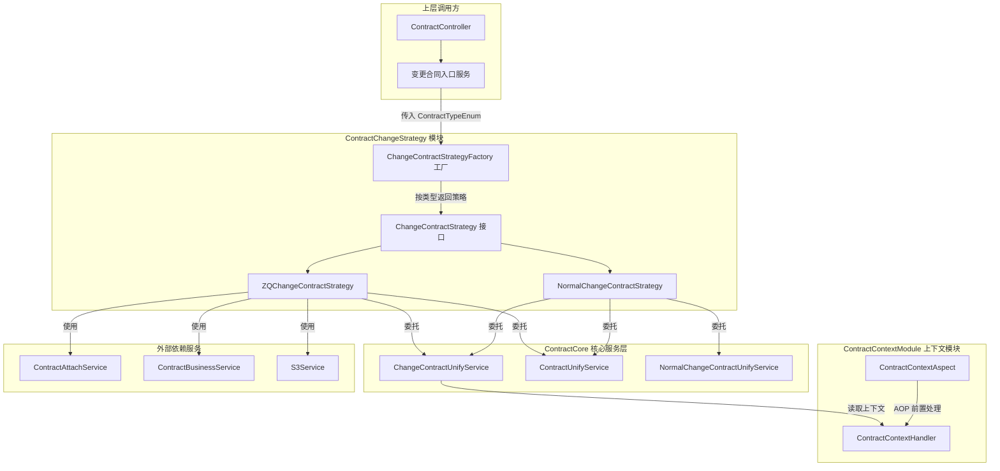
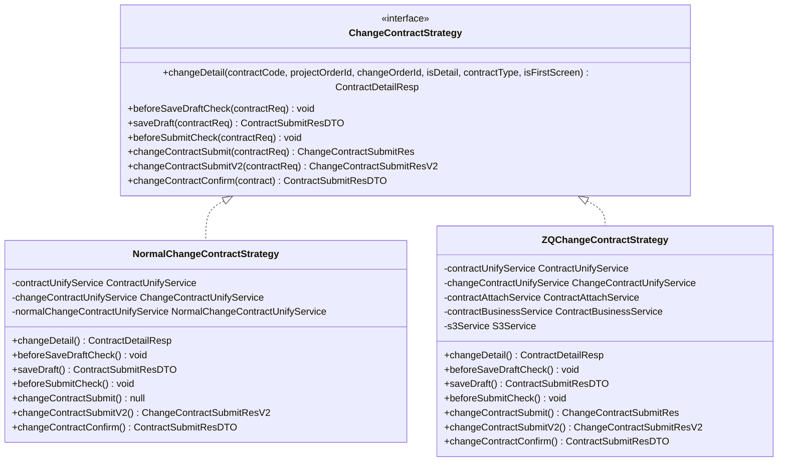
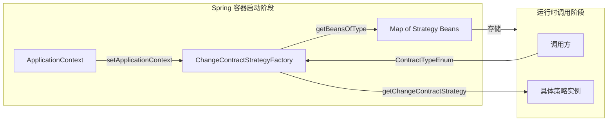
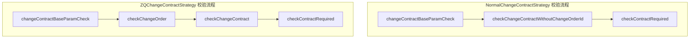
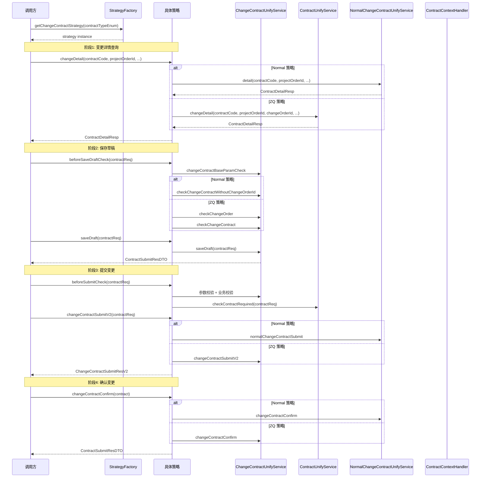
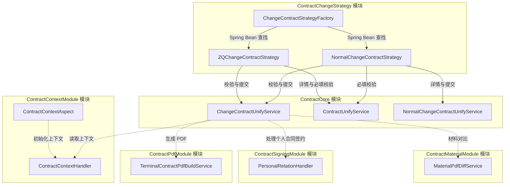

# ContractChangeStrategy 模块文档

## 模块概述

ContractChangeStrategy 是合同变更业务的核心策略分发模块，采用**策略模式（Strategy Pattern）+ 工厂模式（Factory Pattern）**实现不同合同类型下变更流程的差异化处理。该模块位于合同变更请求的入口层，负责将上层调用方的变更操作（查看详情、保存草稿、提交、确认）路由到对应类型的具体实现，同时委托底层统一服务（`ChangeContractUnifyService`、`ContractUnifyService`）完成实际业务逻辑。

该模块解决了以下核心问题：
- 不同合同类型（如普通合同、ZQ 合同）在变更流程中存在校验规则、数据组装、提交逻辑的差异
- 需要在不修改调用方代码的前提下，灵活扩展新合同类型的变更能力
- 变更流程的各阶段（校验 → 草稿 → 提交 → 确认）需要统一的接口契约

---

## 架构总览



---

## 核心组件详解

### 1. ChangeContractStrategy 接口

策略接口定义了合同变更全生命周期的 7 个核心方法，是本模块的契约核心：

| 方法 | 阶段 | 职责 |
|------|------|------|
| `changeDetail` | 查看 | 获取变更合同详情页数据 |
| `beforeSaveDraftCheck` | 草稿前 | 保存草稿前的参数校验 |
| `saveDraft` | 草稿 | 持久化草稿数据 |
| `beforeSubmitCheck` | 提交前 | 提交前的完整校验（含必填项） |
| `changeContractSubmit` | 提交V1 | PC 端旧版提交（兼容保留） |
| `changeContractSubmitV2` | 提交V2 | 统一 diff 提交接口 |
| `changeContractConfirm` | 确认 | 变更合同确认生效 |



### 2. ChangeContractStrategyFactory 工厂

工厂类通过实现 `ApplicationContextAware` 接口，在 Spring 容器启动时自动收集所有 `ChangeContractStrategy` 类型的 Bean，注册到内部 Map 中。运行时根据 `ContractTypeEnum` 中配置的策略 Bean 名称（`getChangeContractStrategy()`）查找并返回对应的策略实例。



**关键设计要点：**
- 工厂通过 `ApplicationContextAware` 实现零配置的策略自动注册，新增策略只需添加 `@Component` 注解即可被工厂发现
- `ContractTypeEnum.getChangeContractStrategy()` 返回的是 Spring Bean 的名称，与策略类的 Bean 名称（默认为首字母小写的类名）一一对应
- 当合同类型为 null 或未找到对应策略时，抛出 `NrsBusinessException`

---

## 策略实现差异对比

NormalChangeContractStrategy 和 ZQChangeContractStrategy 是两个核心策略实现，它们在以下维度存在显著差异：

### 校验逻辑差异



| 差异维度 | NormalChangeContractStrategy | ZQChangeContractStrategy |
|----------|-------------------------------|--------------------------|
| **详情获取** | `NormalChangeContractUnifyService.detail` | `ContractUnifyService.changeDetail` |
| **草稿前校验** | 基础参数校验 + 无变更单的合同变更校验 | 基础参数校验 + 变更单校验 + 合同变更校验 |
| **提交前校验** | 与草稿校验相同 + 必填校验 | 草稿校验 + 必填校验（含变更单维度校验） |
| **提交 V1** | 返回 null（不支持） | 委托 `changeContractUnifyService.changeContractSubmit`（兼容 PC 端） |
| **提交 V2** | `normalChangeContractUnifyService.normalChangeContractSubmit` | `changeContractUnifyService.changeContractSubmitV2` |
| **确认** | `normalChangeContractUnifyService.changeContractConfirm` | `changeContractUnifyService.changeContractConfirm` |
| **变更单依赖** | 不依赖变更单（`checkChangeContractWithoutChangeOrderId`） | 强依赖变更单（需传入 `changeOrderId`） |
| **额外依赖** | 无 | `ContractAttachService`、`ContractBusinessService`、`S3Service` |

**核心差异解读：**
- **Normal 策略**适用于不依赖变更单的普通合同变更场景，使用独立的 `NormalChangeContractUnifyService` 进行详情查询和提交处理
- **ZQ 策略**适用于需要关联变更单的合同变更场景，在校验阶段增加了变更单合法性校验（`checkChangeOrder`），并保留了 PC 端旧版提交接口的兼容能力

---

## 数据流

### 变更合同提交的完整数据流



---

## 模块依赖关系



**依赖方向说明：**
- **ContractChangeStrategy → ContractCore**：策略层依赖核心服务层完成实际业务处理，属于正常分层依赖
- **ContractChangeStrategy → ContractContextModule**：间接依赖，通过 `ChangeContractUnifyService` 在执行过程中读取由 AOP 切面初始化的上下文数据
- **ContractCore → ContractPdfModule / ContractSigningModule / ContractMaterialModule**：核心服务层在变更提交流程中会触发 PDF 生成、个人合同签约、材料对比等下游操作

---

## 关键设计模式

### 策略模式（Strategy Pattern）

本模块的核心设计模式。`ChangeContractStrategy` 接口定义了合同变更的统一行为契约，`NormalChangeContractStrategy` 和 `ZQChangeContractStrategy` 分别实现不同类型合同的差异化变更逻辑。调用方只需通过工厂获取策略实例并调用接口方法，无需关心具体的合同类型实现。

**优势：**
- 新增合同类型的变更能力时，只需实现 `ChangeContractStrategy` 接口并标注 `@Component`，工厂会自动发现并注册
- 各策略实现完全独立，修改一种类型的变更逻辑不会影响其他类型
- 符合开闭原则（Open-Closed Principle）

### 工厂模式（Factory Pattern）

`ChangeContractStrategyFactory` 结合 Spring 的 `ApplicationContextAware` 实现了策略的自动发现和按需获取。工厂内部维护 `Map<String, ChangeContractStrategy>`，键为 Bean 名称，值为策略实例。通过 `ContractTypeEnum.getChangeContractStrategy()` 获取 Bean 名称完成查找。

### 模板方法思想

虽然未使用严格的模板方法模式，但两个策略实现遵循了相同的执行流程骨架：

```
参数校验 → 业务校验 → 执行操作 → 返回结果
```

差异在于每个步骤委托的具体服务方法不同，这是策略模式与委托模式的典型结合。

---

## 与其他模块的关系

| 关联模块 | 关系类型 | 说明 |
|----------|---------|------|
| [ContractCore](ContractCore.md) | 强依赖 | 策略层委托 `ContractUnifyService`、`ChangeContractUnifyService`、`NormalChangeContractUnifyService` 完成实际业务逻辑 |
| [ContractContextModule](ContractContextModule.md) | 间接依赖 | 上下文通过 AOP 切面在请求进入时初始化，策略执行过程中通过 `ContractContextHandler` 读取项目信息、报价方案等上下文数据 |
| ContractPdfModule | 间接依赖 | 变更提交后通过 `ChangeContractUnifyService` 触发 PDF 生成流程 |
| ContractSigningModule | 间接依赖 | 变更确认时通过 `ChangeContractUnifyService` 处理个人合同的签约关系变更 |
| ContractMaterialModule | 间接依赖 | 变更提交时通过材料对比服务判断是否需要重新生成材料 PDF |

---

## 扩展指南

### 新增合同类型变更策略

1. 在 `ContractTypeEnum` 中添加新的枚举值，并在其 `getChangeContractStrategy()` 方法中返回新策略的 Bean 名称
2. 创建新策略类实现 `ChangeContractStrategy` 接口，添加 `@Component` 注解
3. 根据新合同类型的业务特点，注入所需的 Service 依赖并实现接口方法
4. 无需修改 `ChangeContractStrategyFactory`，Spring 容器启动时会自动注册新策略

### 注意事项

- `saveDraft` 方法在两个策略中实现相同（均委托 `changeContractUnifyService.saveDraft`），说明草稿保存逻辑是通用的，差异主要体现在校验和提交阶段
- `changeContractSubmit`（V1）是兼容旧版 PC 端的接口，Normal 策略直接返回 null，新功能应统一使用 `changeContractSubmitV2`
- 策略实现中的校验方法调用顺序不可随意调整，校验之间存在前置依赖关系（如必须先完成基础参数校验，再进行业务规则校验）
