# ContractComboAndMaterial 模块

## 模块概述

ContractComboAndMaterial 模块负责管理合同系统中与**套餐（Combo）配置**和**材料配送清单（Material List）**相关的全部业务逻辑。该模块解决的核心问题是：在装修合同场景下，如何根据套餐编码、合同类型、签约时间等维度，准确获取对应的精装细则、预算编制说明和材料配送清单，并支持材料清单 PDF 的自动生成、差异比对和版本快照管理。

模块在整体合同系统中的定位是**附件资源管理**——合同在创建、变更、PDF 生成等环节都需要引用套餐关联的附件资源，本模块统一管理这些资源的查询、版本匹配和生成逻辑。

## 架构总览

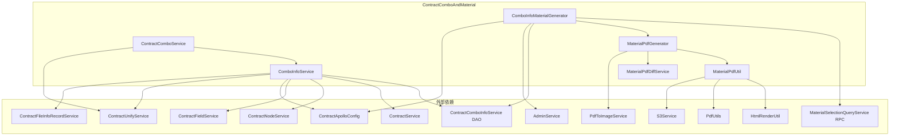

## 核心组件详解

### 1. ContractComboService — 套餐查询入口

`ContractComboService` 是模块对外暴露的顶层服务，提供单一入口方法 `queryComboFileInfo`。

**职责**：根据套餐编码和项目单号，一次性查询并返回套餐关联的三类附件 URL（精装细则、预算编制说明、材料配送清单）。

**调用链**：

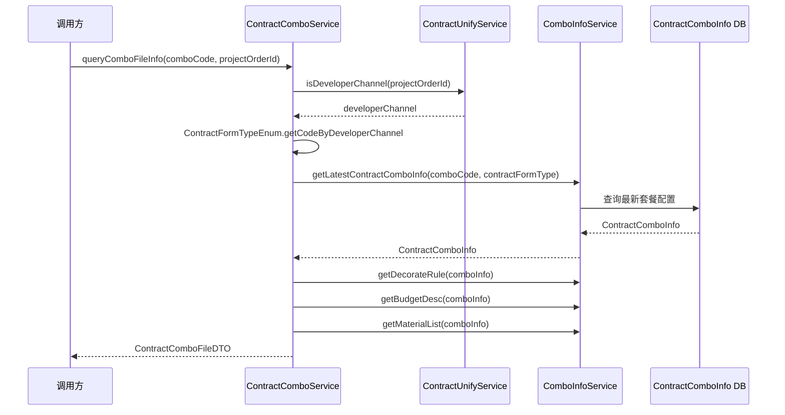

**设计要点**：
- 方法内部记录了 `projectOrderId` 为空的异常日志，用于监控接口流量，表明该方法有两个上游调用方
- 通过 `ContractFormTypeEnum` 区分普通住宅（NORMAL_HOUSE）和开发商渠道（DEVELOPER_CHANNEL）两种合同表单模式

### 2. ComboInfoService — 套餐配置核心服务

`ComboInfoService` 是本模块最核心、最复杂的服务类，承担套餐配置的版本查询、时间线匹配和三类附件资源的获取逻辑。

#### 2.1 套餐配置版本查询

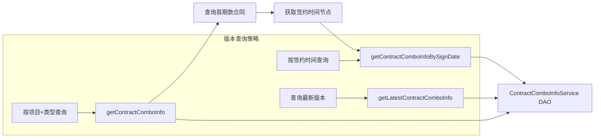

**版本匹配规则**：
- `getContractComboInfoBySignDate(signDate, comboCode, contractFormType)`：查找签约时间之前的最新配置版本；若不存在则返回最新一份
- `getContractComboInfoBySignDateNullable`：同上，但配置不存在时返回 null（不抛异常）
- `getLatestContractComboInfo`：直接获取当前最新配置

#### 2.2 三类附件获取逻辑

每类附件（精装细则、预算编制说明、材料配送清单）的获取逻辑遵循相同模式，但各有差异：

| 附件类型 | 方法 | 首期款已签约时 | 首期款未签约时 | 变更合同场景 |
|---------|------|-------------|-------------|-------------|
| 精装细则 | `getDecorateRule(projectOrderId, contractType, comboCode)` | 按首期款签约时间取版本 | 取最新版本 | 取最新版本 |
| 预算编制说明 | `getBudgetDesc(projectOrderId, contractType, comboCode)` | 根据首期款配置决定是否展示 | 取最新版本 | 取最新版本 |
| 材料配送清单 | `getMaterialList(projectOrderId, contractType, comboCode)` | 根据首期款配置决定是否展示 | 取最新版本 | 取最新版本 |

**精装细则的特殊规则**：
- 存在旧规则城市（`getDecorateRuleOldRuleCity`）白名单，这些城市仍使用旧的版本匹配逻辑
- 首期款合同的套餐码（advanceContractComboCode）与当前套餐码相同时，精装细则返回空列表（避免重复展示）
- 正签合同模板内需要通过 `decorateRuleComboConfigContainsType` 判断配置中是否包含当前合同类型的精装细则

#### 2.3 `getAllUrls` — 合并获取所有附件 URL

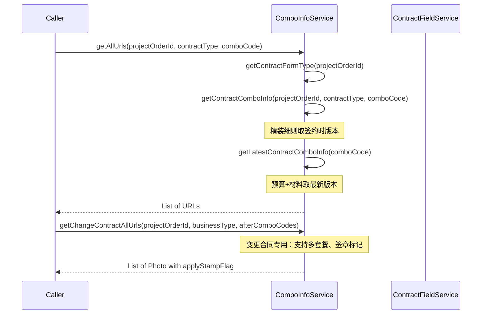

**`getChangeContractAllUrls` 的特殊逻辑**：
- 支持多套餐码批量查询
- 判断合同模板是否包含套餐附件（通过 `ContractFileInfoRecordService`）
- 在线签约且无附件记录、非房产证业务时返回空
- 精装细则最后一页自动标记 `applyStampFlag = true`（需要签章）

#### 2.4 配置类型匹配判断

三个 `xxxComboConfigContainsType` 方法用于判断套餐配置中某类附件是否包含指定合同类型：

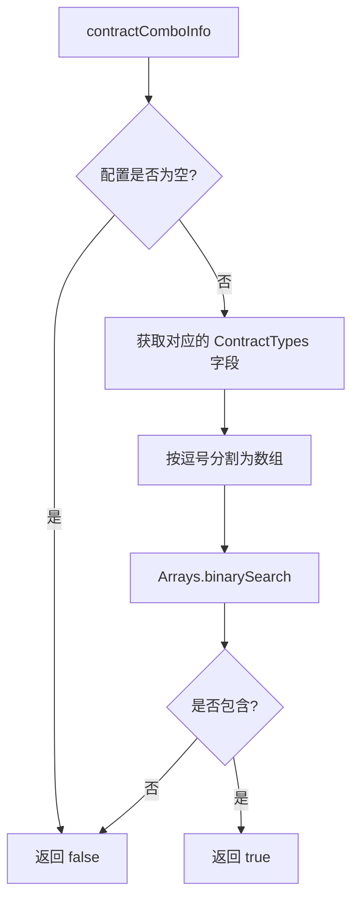

> **注意**：`Arrays.binarySearch` 要求数组已排序，如果 `ContractTypes` 字段存储的值未按升序排列，可能导致错误结果。

### 3. ComboInfoMaterialGenerator — 材料清单生成器

负责从远程 SCM 系统查询套餐 SKU 数据，生成材料配送清单 PDF，并更新数据库。

#### 3.1 生成流程

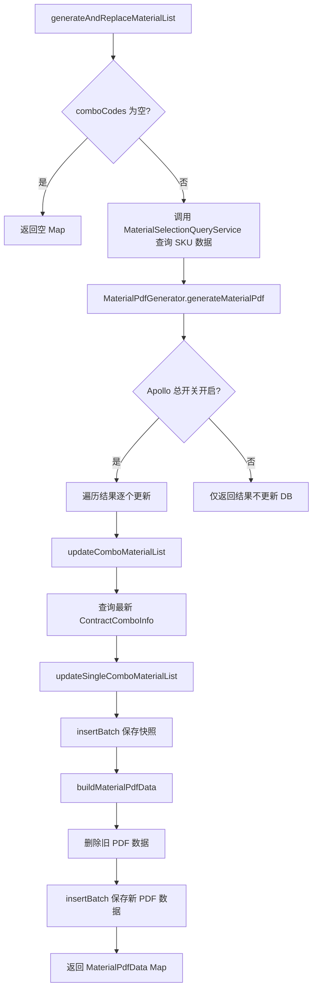

#### 3.2 数据模型

`ContractComboInfo` 表采用**快照模式**：每次更新不是修改原记录，而是插入一条新记录（`id = null`），保留历史版本。同时 `ContractMaterialPdfData` 表存储 PDF 生成时的 SKU 快照数据，用于后续差异比对。

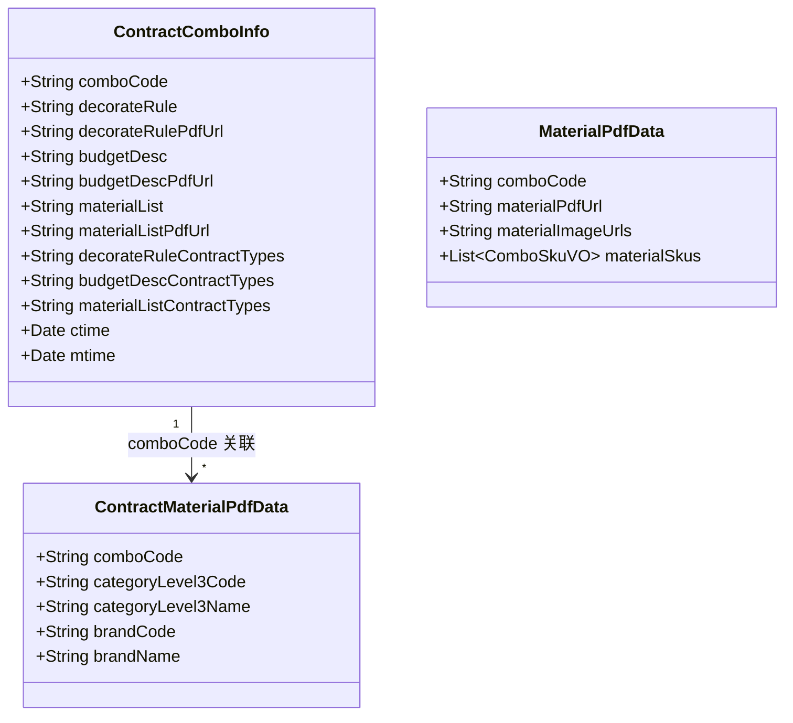

#### 3.3 事务与自调用

`updateComboMaterialList` 方法标注了 `@Transactional`，且通过注入 `comboInfoMaterialGeneratorSelf` 实现自调用，确保 Spring AOP 事务代理生效。

### 4. MaterialPdfGenerator — 材料清单 PDF 生成

负责将 SKU 数据聚合为 PDF，并管理是否需要重新生成的判断逻辑。

#### 4.1 生成决策流程

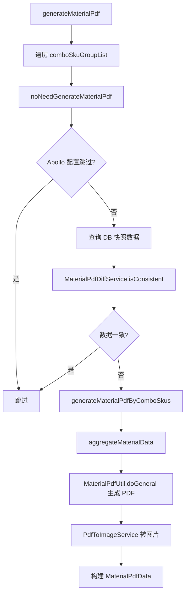

#### 4.2 SKU 数据聚合规则

`aggregateMaterialData` 方法对 SKU 数据进行多维度聚合：

1. **分组**：按 `categoryLevel3Code`（三级品类编码）分组
2. **过滤**：过滤掉品牌编码为 672（"其他"）的 SKU
3. **去重**：同一品类下的品牌名去重
4. **排序**：品牌名按字母序排列，用 "/" 连接
5. **裁剪**：品牌名为空的品类不在 PDF 中展示
6. **编号**：结果按品类名正序排列并重新编号

### 5. MaterialPdfDiffService — 数据一致性检查

负责对比远程实时数据与数据库存储数据，判断是否需要重新生成 PDF。

#### 5.1 差异比对流程

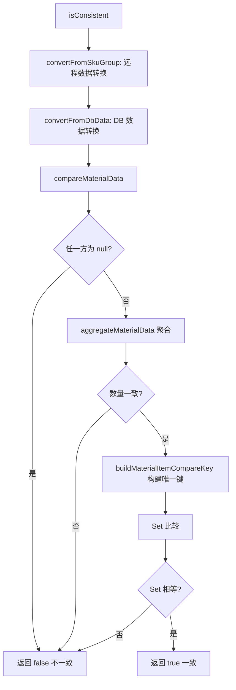

**唯一键格式**：`categoryLevel3Name|brandNames`，其中 brandNames 是品牌名按字母序用 "/" 拼接的字符串。

**远程数据去重规则**：`convertFromSkuGroup` 按 `categoryLevel3Code + "#" + brandCode` 去重，保留第一条，使用 `LinkedHashMap` 保持原始顺序。

### 6. MaterialPdfUtil — PDF 工具类

封装 PDF 生成的底层操作：HTML 模板渲染 → PDF 转换 → S3 上传。

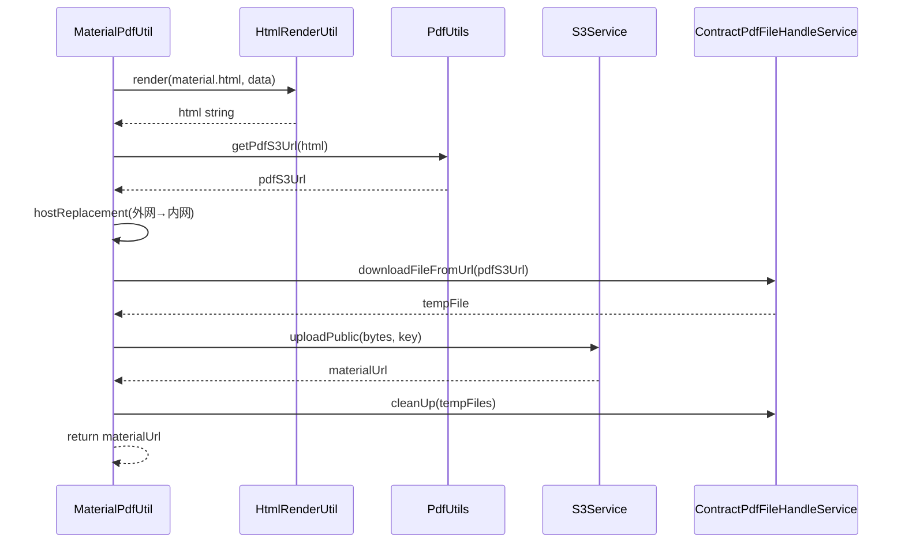

**关键细节**：
- 内网 host 替换：`https://file.ljcdn.com` → `http://file.media.lianjia.com`，确保 PDF 下载走内网
- 临时文件在 finally 块中清理，避免磁盘泄漏

## 与外部模块的依赖关系

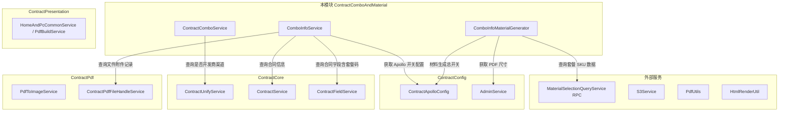

### 被依赖方

本模块主要被以下模块/服务调用：
- **ContractPresentation**（`ContractPdfBuildService`）：PDF 生成时获取精装细则、预算编制说明和材料配送清单的 URL
- **ContractChange**（`ChangeContractUnifyService`）：变更合同时获取变更后的套餐附件
- **ContractPdf**（`HouseFormalContractPdfBySelfStrategy`）：整装正签合同 PDF 自生成时拼接材料清单 PDF
- **ContractConfig**（`ContractToolService`）：运维工具调用 `generateComboMaterial` 手动触发材料清单生成

## 数据流

### 合同创建时的附件查询流

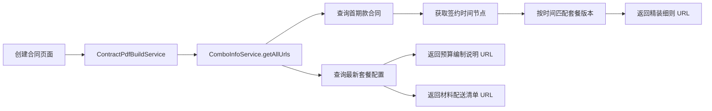

### 材料清单自动生成流

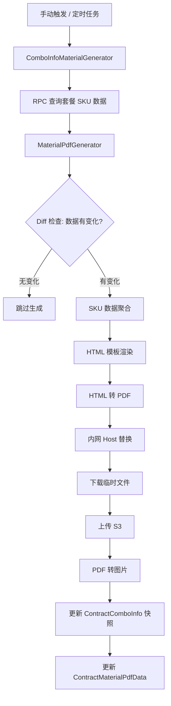

## 关键设计模式

### 1. 版本快照模式

`ContractComboInfo` 表不采用原地更新，而是每次变更插入新记录（`id = null`，`ctime` 为当前时间），通过 `ctime` 排序和 `comboCode` 联合查询获取特定时间点的配置版本。这保证了历史合同附件的可追溯性。

### 2. 差异驱动的 PDF 生成

`MaterialPdfGenerator` 在生成 PDF 前先通过 `MaterialPdfDiffService` 检查数据是否变化，避免重复生成相同内容的 PDF，减少存储和计算资源消耗。

### 3. 多租户表单模式分离

通过 `ContractFormTypeEnum` 区分普通住宅（NORMAL_HOUSE）和开发商渠道（DEVELOPER_CHANNEL），同一套餐码下维护两套独立的配置数据。

### 4. Apollo 开关控制

关键功能通过 Apollo 配置中心进行开关控制：
- `getMaterialListPdfGenerationEnabled()`：材料清单 PDF 自动生成总开关
- `getNoNeedAutoGenerateComboCodes()`：指定套餐码跳过自动生成

### 5. 策略式聚合

SKU 数据到 PDF 展示项的聚合逻辑遵循统一流程（分组→过滤→去重→排序→编号），但在不同场景下（生成 vs 比对）复用了相同的聚合规则，确保一致性。
