# ContractConfig 模块文档

## 1. 模块概述

ContractConfig 是合同系统的**配置管理与运营支撑模块**，负责合同全生命周期所需的各类配置数据的管理、查询和维护。该模块是整个合同体系的"基础设施层"，为 [ContractCore](ContractCore.md)、[ContractChange](ContractChange.md)、[ContractSubmission](ContractSubmission.md)、[ContractSigning](ContractSigning.md) 等业务模块提供配置驱动的能力。

模块核心职责包括：

- **城市分公司配置管理**：管理不同城市、分公司、业务类型下的合同模板（版式 ID/Key）、签约方式、审核类型等配置
- **配置版本管理**：支持配置的多版本快照机制，确保整装/零售业务版本一致性
- **Apollo 动态配置**：通过携程 Apollo 配置中心管理运行时可变参数（开城列表、校验规则、视频配置、UI Schema 等）
- **套餐材料配置管理**：管理套餐关联的精装细则、预算编制说明、材料配送清单等 PDF 附件
- **附件配置管理**：管理合同附属文件（服务承诺、估价说明、品类信息等）
- **按钮配置引擎**：基于维度化表达式引擎（Aviator）的按钮可见性配置
- **运营工具服务**：提供批量刷数、配置拷贝、数据修复、版本更新等运维能力
- **数据巡检与迁移**：支持合同字段分表迁移及数据一致性校验

## 2. 模块架构

```mermaid
graph TD
    subgraph ContractConfig
        ApolloConfig[ContractApolloConfig<br/>Apollo 动态配置]
        AdminService[AdminService<br/>河图后台管理]
        ContractToolService[ContractToolService<br/>运营工具服务]
        CityCompanyConfig[ContractCityCompanyConfigService<br/>城市分公司配置]
        ConfigVersion[ContractConfigVersionService<br/>配置版本管理]
        ConfigService[ContractConfigService<br/>配置规则服务]
        CustomConfig[ContractCustomConfigService<br/>自定义附件配置]
        ButtonConfig[ContractButtonConfigService<br/>按钮配置引擎]
        CommandService[CommandService<br/>命令查询服务]
        InspectService[ContractInspectService<br/>数据巡检]
        FieldDealData[ContactFieldDealDataService<br/>字段迁移服务]
        CompanyBiz[ContractCompanyBusinessService<br/>公司业务服务]
        CityInfo[CityCompanyInfoService<br/>城市信息辅助]
        SealConfig[SealRoleTypeConfig<br/>盖章角色配置]
        DrawCompress[DrawingCompressionConfig<br/>图纸压缩配置]
        VersionDTO[ContractVersionConfig<br/>版本配置DTO]
    end

    subgraph ExternalDeps[外部依赖]
        Apollo[Apollo 配置中心]
        DB[(MySQL 数据库)]
        Freeform[Freeform 协议平台]
        S3[S3 存储服务]
        PdfToImage[PdfToImageService]
        EventService[EventService]
    end

    AdminService --> DB
    AdminService --> Freeform
    AdminService --> S3
    AdminService --> PdfToImage
    AdminService --> ApolloConfig
    AdminService --> EventService

    CityCompanyConfig --> DB
    CityCompanyConfig --> ConfigVersion
    CityCompanyConfig --> ApolloConfig

    ConfigVersion --> DB
    ConfigVersion --> ApolloConfig

    ApolloConfig --> Apollo
    ContractToolService --> DB
    ContractToolService --> ApolloConfig
    ContractToolService --> Freeform

    ButtonConfig --> ApolloConfig
    CustomConfig --> PdfToImage
```

## 3. 核心组件详解

### 3.1 ContractApolloConfig — Apollo 动态配置中心

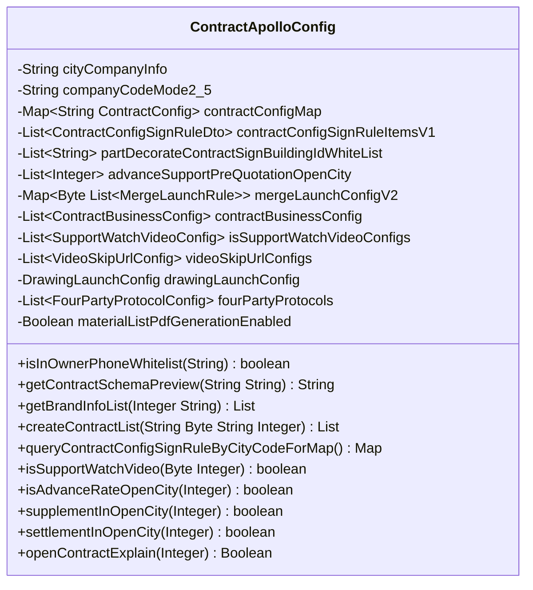

**职责说明**：`ContractApolloConfig` 是一个 Spring `@Configuration` 类，通过 `@Value` 和 `@ApolloJsonValue` 注解从 Apollo 配置中心动态加载合同系统的所有运行时可变参数。它是整个合同模块最核心的配置聚合点，几乎所有业务服务都依赖它获取配置。

**关键配置维度**：

| 配置类别 | 说明 | 示例配置项 |
|---------|------|-----------|
| 开城控制 | 按城市/业务类型控制功能开关 | `contract.multiSubjectOpenCity`, `contract.config.supplementOpenCity` |
| UI Schema | 合同各页面跳转链接模板 | `contract.schema.preview`, `contract.schema.launchPage` |
| 签约校验 | 签约金额、比例、白名单等规则 | `contract.config.signRuleItemV1` |
| 合同列表路由 | Home/PC 端合同创建列表路由映射 | `contract.home.contractConfig` |
| 视频配置 | 签约视频 URL、跳过规则 | `contract.video.videoSkipUrlV2` |
| 合并发起规则 | 合同合并发起的类型组合规则 | `contract.mergeLaunch.configV2` |
| 按钮配置 | 可创建/不可创建的合同类型列表 | 通过 `contractConfigMap` 路由 |
| 四方协议 | 资金存管四方协议模板配置 | `contract.config.escrow.fourPartyProtocols` |

**开城控制模式**：支持三种模式：
- `*` — 全量开放
- `cityCode1,cityCode2` — 指定城市开放
- 空字符串 — 关闭

### 3.2 AdminService — 河图后台管理服务

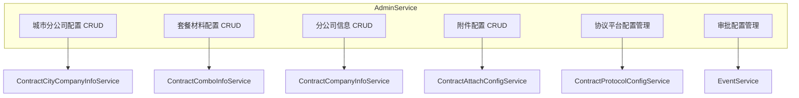

**职责说明**：`AdminService` 是面向河图运营后台的管理服务，提供合同各类配置数据的创建、更新、删除、查询功能。它是运营人员管理合同配置的唯一入口。

**核心业务流程**：

**1) 城市分公司配置创建 (`createConfig`)**

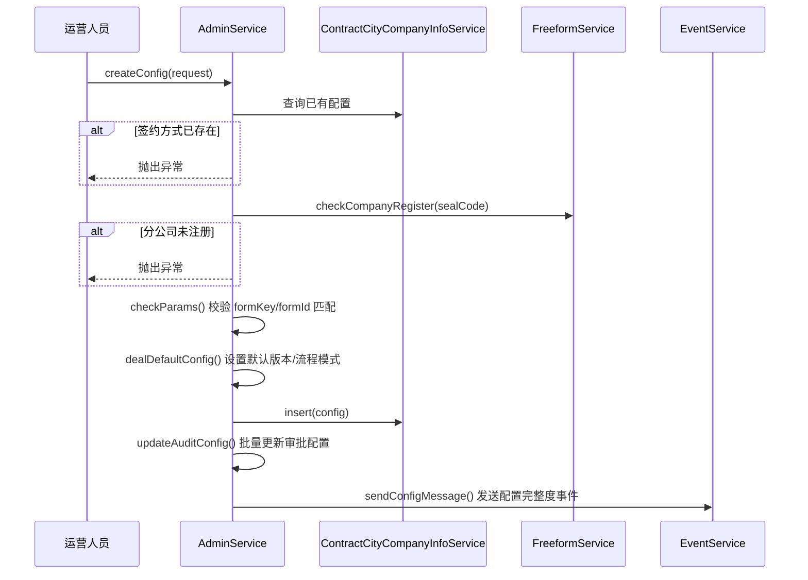

**2) 套餐材料配置创建 (`createComboConfig`)**

使用 `ParallelTaskService` 并行处理三个 PDF 转图片任务（精装细则、预算编制说明、材料配送清单），然后写入数据库，并异步生成材料配送清单 PDF。

**3) 附件配置管理 (`createContractAttachConfig`)**

支持 7 种附件类型的并行上传：服务承诺、估价说明、个性化签通知、品类信息、集团品类信息、安装配送、工期描述附件。

### 3.3 ContractCityCompanyConfigService — 城市分公司配置查询服务

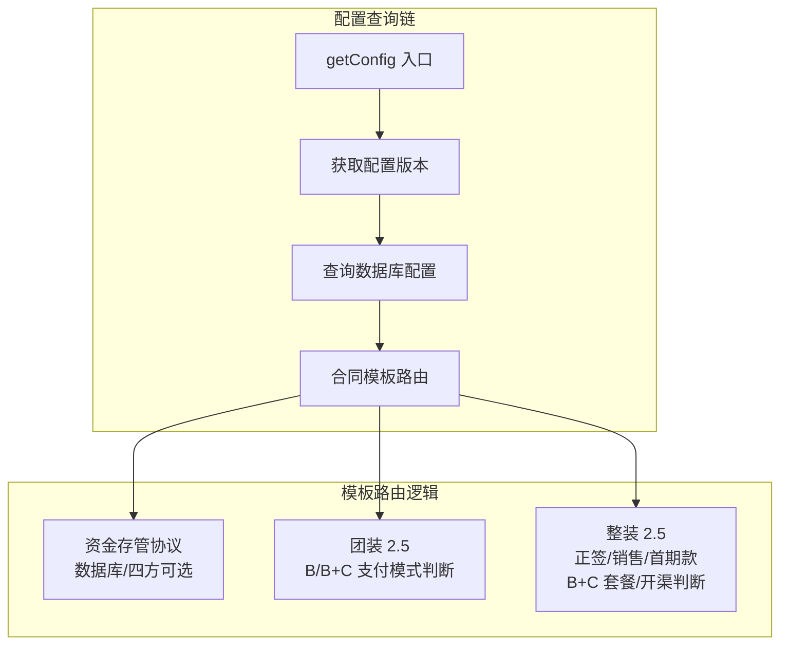

**职责说明**：该服务是合同系统获取城市分公司配置的**核心查询入口**，所有需要获取合同模板（formId/formKey）的业务场景都通过该服务获取。它封装了配置版本查询、模板路由等复杂逻辑。

**关键方法 `getConfigByContractType` 的路由逻辑**：

| 场景 | 条件 | 模板来源 |
|------|------|---------|
| 资金存管协议 | 合同类型 = FUND_ESCROW 且开启零售存管 | Apollo 四方协议配置 |
| 团装 2.5 B/B+C | 业务类型 = GROUP_DECORATE 且 2.5 流程且 B/B+C 支付模式 | secondFormId/secondFormKey |
| 整装 2.5 正签 B+C | 正签合同且 B+B+C 套餐 | secondFormId/secondFormKey |
| 整装 2.5 销售 B+C | 销售合同且包含 B 部分 | secondFormId/secondFormKey |
| 整装 2.5 首期款 B+C | 首期款合同且购买类型为 B/BC | secondFormId/secondFormKey |
| 整装 2.5 开渠 | 整装 2.5 且存在新房项目 | thirdFormId/thirdFormKey |
| 默认 | 以上条件均不满足 | formId/formKey |

### 3.4 ContractConfigVersionService — 配置版本管理服务

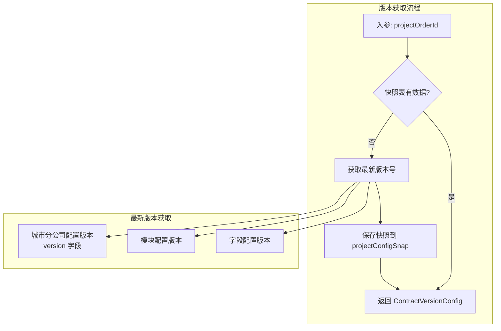

**职责说明**：合同配置版本管理是为了解决整装/零售业务版本不一致场景下合同正常签署的问题。版本号格式为 `{城市分公司版本}_{模块版本}_{字段版本}`，如 `2_2_2`。

**版本策略**：
- **2.0 流程**：默认版本 `1_1_1`
- **2.5 流程**：从数据库获取最新版本号
- **特殊场景**：局装 2.0 搭零售 2.5 且零售无客源编码时，返回 `2_2_2`
- **快照机制**：首次获取后保存到 `project_config_snap` 表，后续直接读取快照

### 3.5 ContractButtonConfigService — 按钮配置引擎

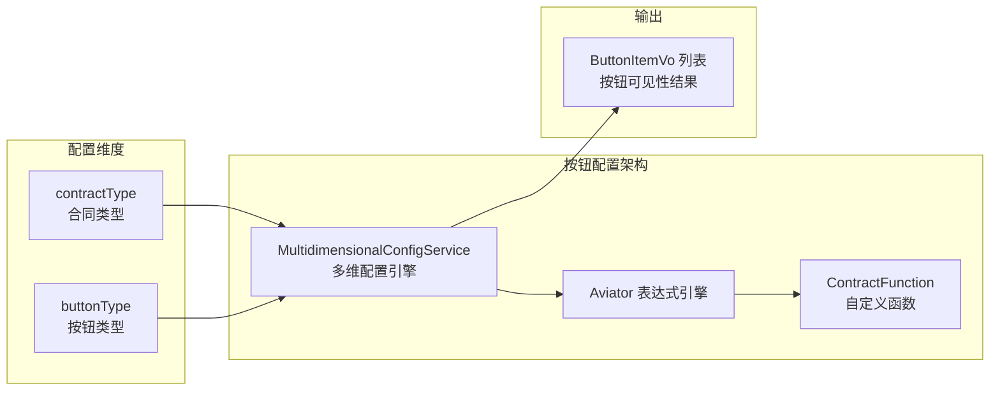

**职责说明**：`ContractButtonConfigService` 使用 Aviator 表达式引擎实现了声明式的按钮可见性配置。通过定义合同类型 × 按钮类型的二维配置矩阵，配合表达式规则判断按钮是否显示。

**配置层次**：
1. **通用规则**（优先级 10）：适用于所有合同类型的按钮规则，如 `*_1`（预览分享按钮：状态非草稿且非已取消）
2. **特殊规则**（优先级 100）：针对特定合同类型的覆盖规则，如 `4_3`（变更合同无撤回按钮 → `false`）
3. **兜底规则**（优先级 0）：默认 `false`

**支持的端**：Home 端（`homeContractListButtonConfig`）、PC 端（`pcContractListButtonConfig`）、授权列表（`authListContractButtonConfig`）、预览页（`contractPreviewButtonConfig`）

### 3.6 ContractToolService — 运营工具服务

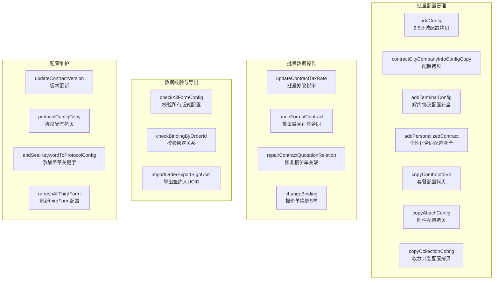

**职责说明**：`ContractToolService` 是运营团队的"瑞士军刀"，提供大量的批量操作、数据修复、配置维护等工具方法。这些方法通常通过河图后台接口或脚本调用，用于处理历史数据刷数、开城配置初始化等场景。

**关键批量操作**：

| 操作 | 说明 | 安全措施 |
|------|------|---------|
| `updateContractTaxRate` | Excel 导入批量修改正签/变更合同税率和承包模式 | 多层校验（合同存在、类型、状态、签署时间、当前税率） |
| `undoFormalContract` | Excel 导入批量撤回待签署正签合同 | 校验合同类型、状态、税率 |
| `repairContractQuotationRelation` | 修复报价单换绑为 S 单 | 分页处理，异常不中断 |
| `copyComboInfoV2` | 套餐配置从家装模式拷贝到开渠模式 | ctime+comboCode 幂等校验 |

### 3.7 CommandService — 命令查询服务

**职责说明**：`CommandService` 提供一系列运维命令接口，主要用于数据初始化、状态查询和应急处理。

**核心方法**：

| 方法 | 说明 |
|------|------|
| `auditPass` | 后门接口：手动触发审批通过，绕过 BPM 流程 |
| `companySeal` | 手动触发公司盖章 |
| `querySignResult` | 查询签署结果 |
| `initPdfCountAndImage` | 批量初始化 PDF 页数和图片 |
| `initCertificateTypeConfig` | 批量初始化证件类型字段配置 |

### 3.8 ContractConfigService — 配置规则服务

**职责说明**：提供签约校验规则查询和白名单判断功能。

**关键方法**：
- `queryOrDefaultConfigRule`：根据城市代码查询签约金额校验规则（零售变更金额汇总、零售金额比例等），支持默认规则兜底
- `checkInWhiteList`：判断订单是否命中楼盘/楼栋白名单（用于局改签约场景）

### 3.9 ContractCustomConfigService — 自定义附件配置

**职责说明**：管理合同的自定义附件配置（个性化附件），按城市、分公司、业务类型、合同模式四维度管理。支持正签合同、首期款合同、销售合同三种 PDF 附件类型，并行执行 PDF 转图片。

### 3.10 ContactFieldDealDataService — 字段表迁移服务

**职责说明**：支持 `contract_field` 旧表到 `contract_field_sharding` 分表的数据迁移和一致性校验。

**迁移策略**：
- 按合同 ID 范围批量处理
- 每条合同先删除新表数据再重新插入（保证幂等）
- 每 100 条休眠 100ms 控制速率
- Redis 记录迁移进度
- Apollo 开关控制是否中断

### 3.11 其他辅助服务

| 服务 | 职责 |
|------|------|
| `ContractCompanyBusinessService` | 获取项目下最新已签约合同的公司主体信息 |
| `CityCompanyInfoService` | 根据公司编码和套餐编码获取精装细则 URL 列表 |
| `ContractInspectService` | 合同数据巡检：分页获取合同信息，检查金额、收款计划、备件等 |
| `SealRoleTypeConfig` | 根据合同类型 + 装修类型映射协议平台签章角色类型 |
| `DrawingCompressionConfig` | 根据页数和文件大小匹配 DPI 压缩规则 |
| `ContractVersionConfig` | 版本配置 DTO，格式 `{city}_{module}_{field}` |

## 4. 模块间依赖关系

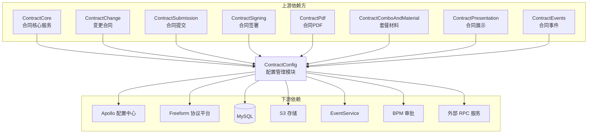

**被依赖关系说明**：

| 调用方 | 依赖的配置能力 |
|--------|--------------|
| [ContractCore](ContractCore.md) | `ContractCityCompanyConfigService.getConfig` 获取合同模板；`ContractApolloConfig` 获取各种运行时配置 |
| [ContractChange](ContractChange.md) | `ContractApolloConfig` 获取变更编辑列配置 |
| [ContractSubmission](ContractSubmission.md) | `ContractConfigVersionService` 获取配置版本；`ContractApolloConfig` 获取合并发起配置 |
| [ContractSigning](ContractSigning.md) | `ContractApolloConfig` 获取签约视频、盖章配置 |
| [ContractPdf](ContractPdf.md) | `ContractApolloConfig` 获取保修年限、品牌配置 |
| [ContractPresentation](ContractPresentation.md) | `ContractButtonConfigService` 获取按钮列表；`ContractApolloConfig` 获取 Schema 链接 |
| [ContractEvents](ContractEvents.md) | `ContractCityCompanyConfigService` 获取合同配置 |

## 5. 核心数据流

### 5.1 合同发起时的配置查询流

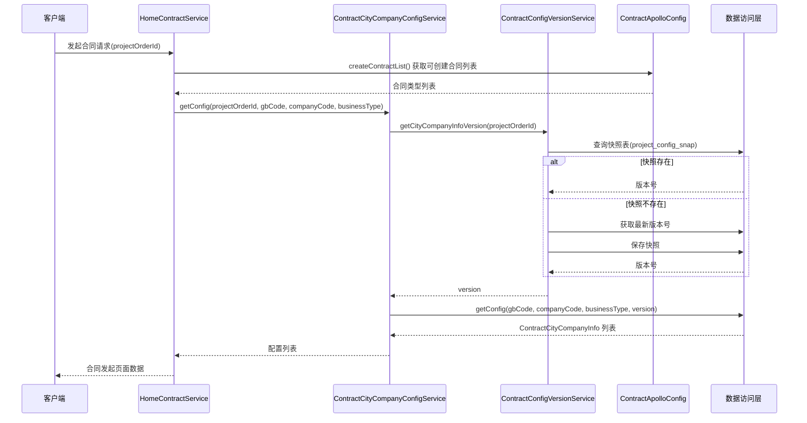

### 5.2 按钮配置查询流

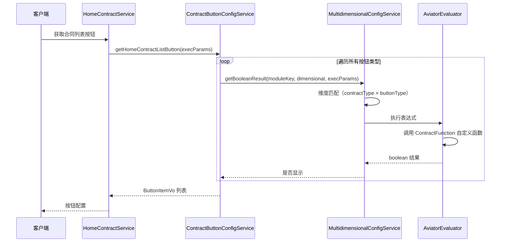

### 5.3 配置版本管理数据流

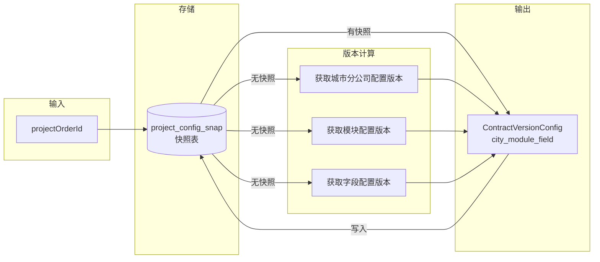

## 6. 关键设计模式

### 6.1 配置驱动模式

整个模块的核心设计理念是**配置驱动**：通过 Apollo 动态配置 + 数据库配置的双层架构，实现功能的灵活开关和参数化控制。

- **Apollo 配置层**：运行时可变参数（开城列表、校验规则、URL 模板），修改后秒级生效
- **数据库配置层**：结构化配置数据（城市分公司配置、套餐配置、附件配置），需要通过后台管理界面修改

### 6.2 版本快照模式

配置版本管理采用**快照模式**：首次查询时计算最新版本号并持久化到快照表，后续查询直接读取快照。这确保了同一订单在整个合同生命周期内使用同一套配置版本，避免配置变更导致的不一致问题。

### 6.3 表达式引擎驱动的按钮配置

按钮配置使用 **Aviator 表达式引擎**实现声明式配置，而非硬编码条件判断：
- 配置以表达式字符串存储（如 `"contractStatus == 1"`）
- 支持自定义函数注册（`ContractFunction` 类）
- 多维度优先级匹配（通用规则 → 特殊规则 → 兜底规则）

### 6.4 并行任务编排模式

`AdminService` 和 `ContractCustomConfigService` 大量使用 `ParallelTaskService` 进行并行任务编排：
- PDF 转图片等 IO 密集型任务并行执行
- 通过 `execTasks` + `awaitTasksResult` 控制同步点
- 单个任务失败不影响其他任务（异常隔离）

### 6.5 模板路由模式

`ContractCityCompanyConfigService.getConfigByContractType` 实现了基于业务场景的合同模板路由，通过判断业务类型、流程模式、支付模式、套餐类型等多个条件，选择正确的合同模板（formId/formKey），包括：
- 主模板（formId/formKey）
- 次模板（secondFormId/secondFormKey）：用于 B/B+C 支付模式
- 第三模板（thirdFormId/thirdFormKey）：用于开渠客源

## 7. 数据库表依赖

| 表名 | 说明 | 主要操作 |
|------|------|---------|
| `contract_city_company_info` | 城市分公司合同配置表 | CRUD、版本查询 |
| `contract_combo_info` | 套餐材料配置表 | CRUD、分页查询 |
| `contract_company_info` | 分公司信息表 | CRUD |
| `contract_attach_config` | 合同附件配置表 | CRUD |
| `contract_protocol_config` | 协议平台配置表 | 批量插入、查询 |
| `contract_custom_attach_config` | 自定义附件配置表 | CRUD |
| `contract` | 合同主表 | 查询、软删除 |
| `contract_field` | 合同字段表 | 查询、更新 |
| `contract_field_sharding` | 合同字段分表 | 批量插入、删除 |
| `project_config_snap` | 项目配置快照表 | 查询、更新 |
| `fund_item_config` | 资金项配置表（收款计划） | 查询、更新 |
| `contract_node` | 合同节点表 | 查询 |
| `contract_user` | 合同用户表 | 查询 |
| `contract_pdf_image` | 合同PDF图片表 | 查询 |
| `contract_audit` | 合同审核表 | 查询 |
