# ContractContextModule 模块文档

## 1. 模块概述

ContractContextModule 是合同系统的**数据预处理核心模块**，基于 Spring AOP 切面编程实现，在合同业务操作（保存/提交/查询详情）执行前，自动完成多源异构数据的并行采集与上下文装配。该模块通过 ThreadLocal 机制管理请求级别的上下文数据，使下游业务组件无需重复查询外部系统，实现数据准备与业务逻辑的解耦。

### 核心职责

- **数据预编排**：在合同保存/提交前，并行拉取项目信息、报价数据、图纸信息、存管账户等十余种外部数据源
- **参数预处理**：对前端入参进行清洗与标准化（签约人信息、附件字段、设计费参数等）
- **上下文传递**：通过 ThreadLocal 在 AOP 切面与业务方法之间共享已准备好的数据
- **详情查询优化**：为合同详情查询提供首屏/非首屏的分层数据加载策略

## 2. 架构总览

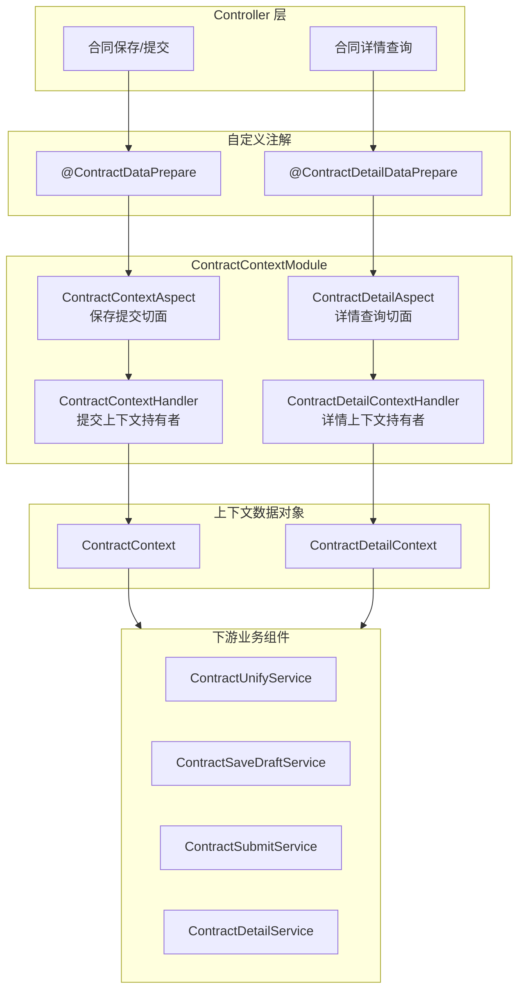

## 3. 核心组件详解

### 3.1 ContractContextAspect — 保存/提交数据预处理切面

该切面拦截所有标注 `@ContractDataPrepare` 注解的方法，在业务逻辑执行前完成数据准备，执行后清理上下文。

#### 生命周期

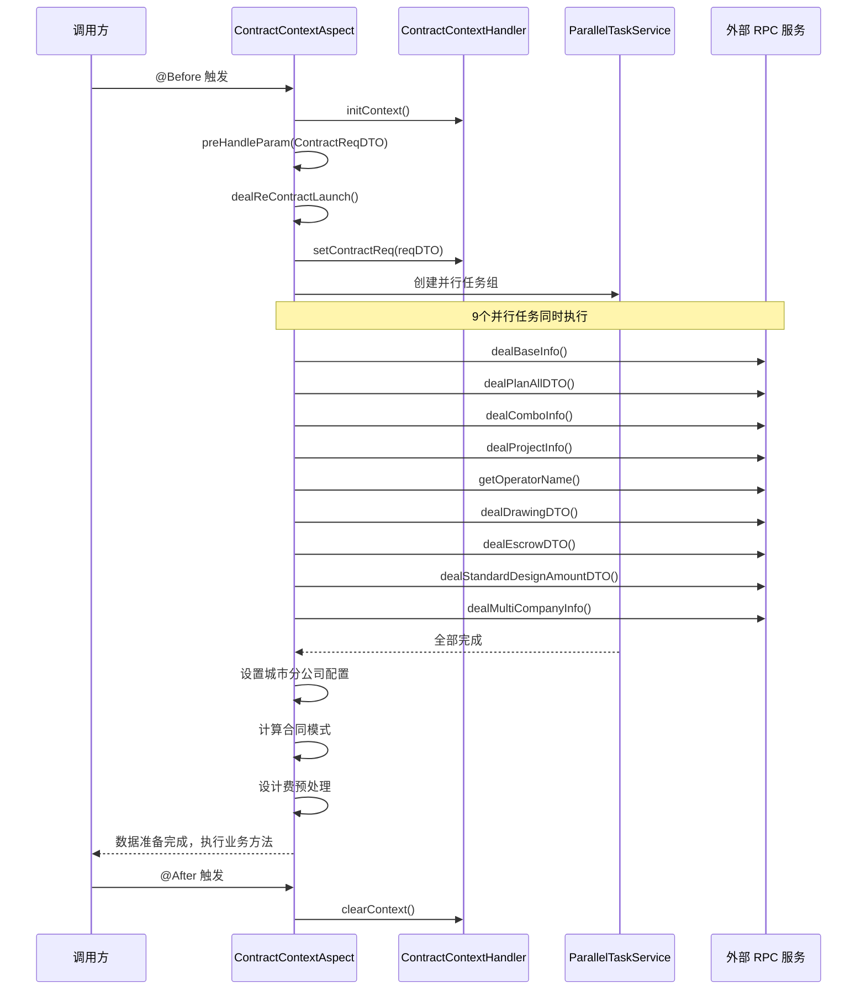

#### 并行数据采集任务清单

| 任务 | 方法 | 数据来源 | 适用条件 |
|------|------|---------|---------|
| 基础信息 | `dealBaseInfo()` | ContractUnifyService | 所有合同类型 |
| 报价信息 | `dealPlanAllDTO()` | 中控报价 / HomeOrderDataConversion | 正签/变更/图纸/个人 |
| 套餐信息 | `dealComboInfo()` | OrderStandardQueryRpc | 2.5流程 & 户证业务 & 正签 |
| 项目信息 | `dealProjectInfo()` | ProjectInfoReadService | 所有合同类型 |
| 操作人姓名 | `getOperatorName()` | HomeAndPcCommonService | 所有合同类型 |
| 图纸信息 | `dealDrawingDTO()` | AtomDrawingRpc / ContractBusinessService | 正签/图纸/个人 & 2.5 |
| 存管账户 | `dealEscrowDTO()` | EscrowDomain | 含存管的合同类型 |
| 设计费金额 | `dealStandardDesignAmountDTO()` | HomeAndPcCommonService | 设计合同 & 特定城市 |
| 合同主体 | `dealMultiCompanyInfo()` | FundEscrowService / MdmDataRpc | 存管协议合同 |

#### 参数预处理逻辑 (`preHandleParam`)

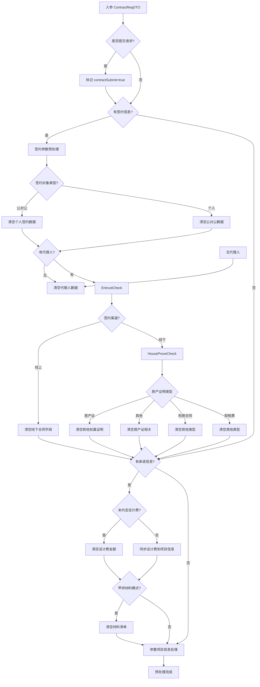

#### 报价信息获取策略 (`dealPlanAllDTO`)

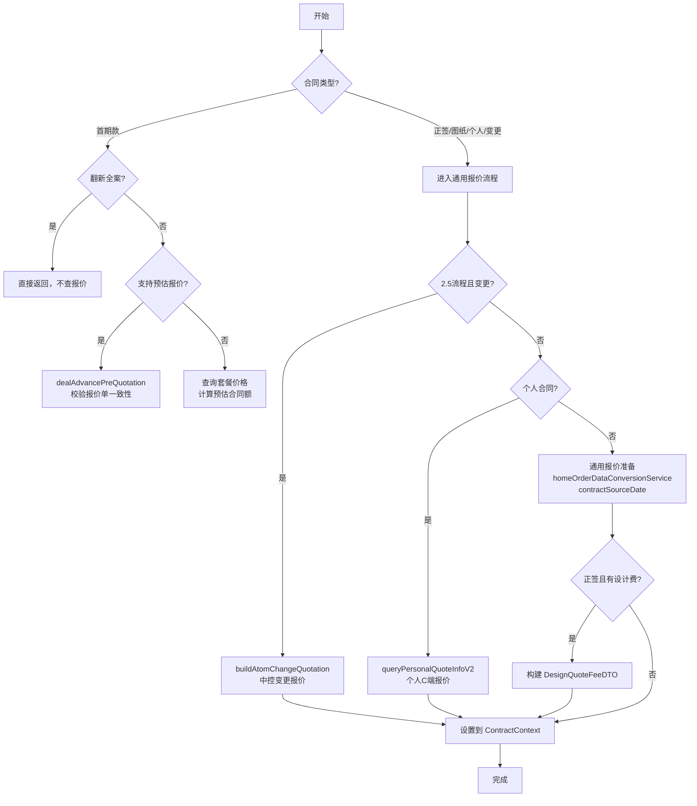

#### 异常与清理机制

切面通过 `@After` 和 `@AfterThrowing` 两个通知确保 ThreadLocal 被正确清理，防止内存泄漏：

- **正常完成**：`@After` 触发 `clearContext()`
- **异常抛出**：`@AfterThrowing` 触发 `clearContext()`
- **线程安全**：每个请求线程持有独立的 `ContractContext` 实例，互不干扰

### 3.2 ContractContextHandler — 提交上下文持有者

基于 `ThreadLocal<ContractContext>` 的静态工具类，为合同保存/提交流程提供上下文的存取能力。

#### 存储结构

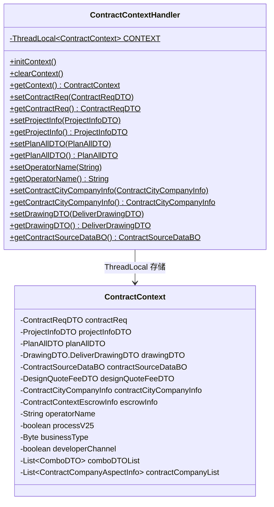

#### 设计要点

- **全静态方法**：无需注入，任何层级的组件均可直接调用
- **空值防护**：getter 方法在 `CONTEXT.get()` 为 null 时返回 null，而非抛出 NPE
- **生命周期由切面管理**：调用方无需手动 init/clear

### 3.3 ContractDetailAspect — 详情查询数据预处理切面

该切面拦截所有标注 `@ContractDetailDataPrepare` 注解的方法，为合同详情查询准备数据。与 `ContractContextAspect` 的核心差异：

| 维度 | ContractContextAspect | ContractDetailAspect |
|------|----------------------|---------------------|
| 用途 | 合同保存/提交 | 合同详情查询 |
| 注解 | `@ContractDataPrepare` | `@ContractDetailDataPrepare` |
| 上下文类型 | ContractContext | ContractDetailContext |
| 参数来源 | ContractReqDTO（第一个参数） | 方法签名的第2-8个参数 |
| 分层加载 | 无 | 首屏/非首屏分层加载 |
| 额外数据 | 存管账户、合同主体信息 | 款项实收、风控审核、变更单列表 |

#### 分层加载策略

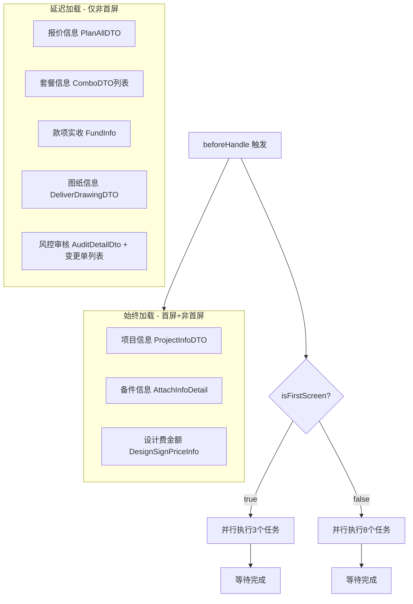

#### 变更报价构建 (`buildAtomChangeQuotation`)

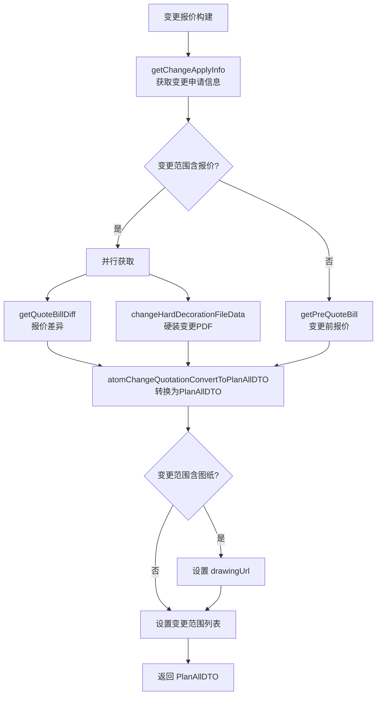

### 3.4 ContractDetailContextHandler — 详情上下文持有者

基于 `ThreadLocal<ContractDetailContext>` 的静态工具类，结构与 `ContractContextHandler` 类似，但持有的是 `ContractDetailContext` 实例。

#### 与 ContractContextHandler 的对比

| 特性 | ContractContextHandler | ContractDetailContextHandler |
|------|----------------------|---------------------------|
| 上下文类型 | ContractContext | ContractDetailContext |
| 管理切面 | ContractContextAspect | ContractDetailAspect |
| 额外字段 | escrowInfo, contractCompanyList, operatorName | drawingUrl, atomChangeScopeList, isFirstScreen |
| 用途场景 | 写操作（保存/提交） | 读操作（详情查询） |
| 空值防护 | 有 | getter 缺少空值防护（潜在风险点） |

## 4. 模块间依赖关系

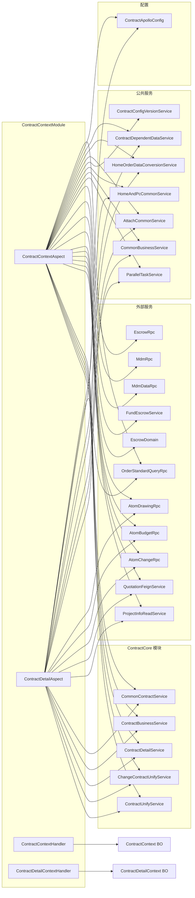

## 5. 数据流全景

### 5.1 合同保存/提交数据流

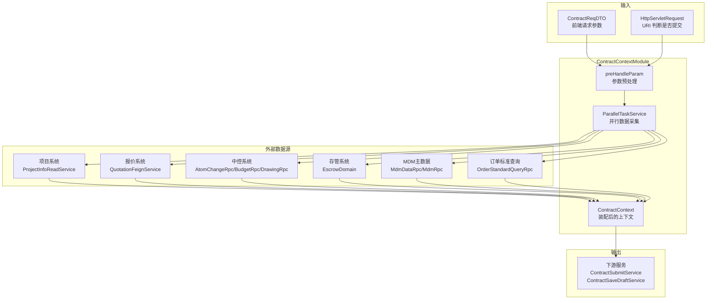

### 5.2 合同详情查询数据流

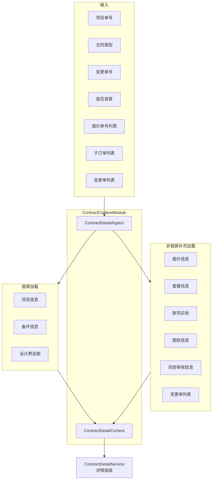

## 6. 关键设计模式

### 6.1 AOP + ThreadLocal 上下文模式

该模块采用经典的 **AOP + ThreadLocal 上下文** 模式：

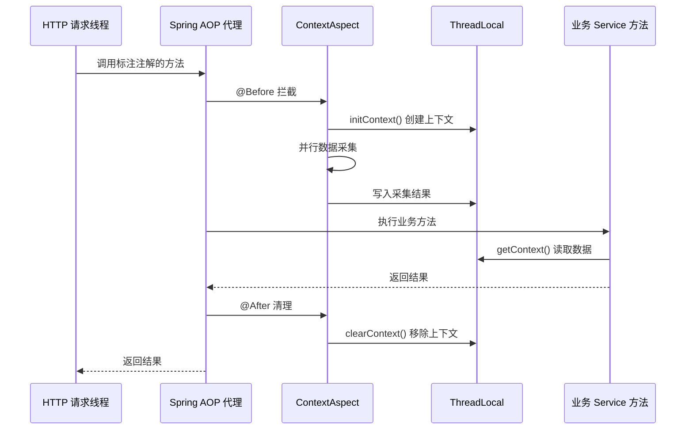

**优势**：
- 业务方法通过 `ContractContextHandler.getContext()` 直接获取已准备好的数据，无需关心数据采集细节
- 新增数据源只需在切面中添加并行任务，对下游透明
- 参数预处理逻辑集中管理，避免分散在各业务方法中

### 6.2 并行任务编排模式

使用 `ParallelTaskService` 实现多数据源并行查询：

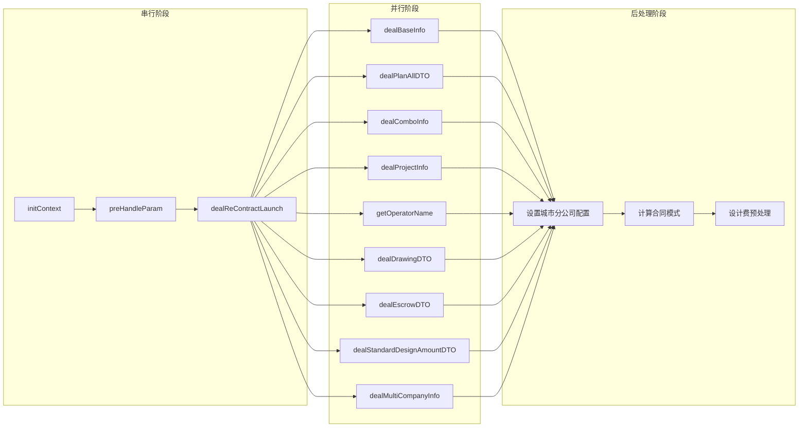

### 6.3 条件分发模式

数据采集方法内部通过**合同类型**、**业务类型**、**流程版本**三个维度的条件组合决定实际执行逻辑：

| 维度 | 取值示例 | 影响范围 |
|------|---------|---------|
| 合同类型 (ContractTypeEnum) | ADVANCE, PACKAGE_FORMAL, PACKAGE_CHANGE, DRAWING, PERSONAL, DESIGN, FUND_ESCROW, TERMINAL | 决定哪些数据采集任务生效 |
| 业务类型 (BusinessTypeEnum) | HOUSE_CERTIFICATE, GROUP_DECORATE, REFORM_ALL | 影响报价获取路径和套餐查询 |
| 流程版本 (processV25) | true / false | 影响图纸获取方式和报价接口选择 |

### 6.4 首屏分层加载模式

`ContractDetailAspect` 采用首屏优化策略，将数据加载分为两个批次：

- **第一批次（首屏）**：仅加载项目信息、备件信息、设计费金额 — 3 个轻量任务，快速返回页面首屏所需数据
- **第二批次（非首屏）**：追加报价信息、套餐信息、款项信息、图纸信息、风控审核 — 5 个较重任务，页面滚动或交互时再展示

## 7. 与其他模块的关系

| 相关模块 | 关系描述 |
|---------|---------|
| [ContractCore](ContractCore.md) | 本模块为 ContractCore 下的 `ContractUnifyService`、`ContractDetailService` 等提供预装配的上下文数据，是这些服务执行前的数据准备层 |
| [ContractChangeStrategy](ContractChangeStrategy.md) | 变更合同的报价差异构建（`buildAtomChangeQuotation`）产生的 `PlanAllDTO` 会被变更策略使用 |
| [ContractPdfModule](ContractPdfModule.md) | PDF 生成依赖上下文中的图纸信息（`DrawingDTO`）和报价信息（`PlanAllDTO`） |
| [ContractSigningModule](ContractSigningModule.md) | 个人合同签约源路由（`ContractSigningSourceRouter`）在图纸信息采集和报价信息采集中被调用 |
| [ContractMaterialModule](ContractMaterialModule.md) | 套餐信息中的材料清单数据通过本模块采集后供材料 PDF 差异对比使用 |

## 8. 注意事项与改进建议

### 8.1 潜在风险

1. **ContractDetailContextHandler 空值防护缺失**：`getProjectInfo()`、`getPlanAllDTO()` 等方法在 `CONTEXT.get()` 为 null 时会抛出 NPE，而 `ContractContextHandler` 的对应方法已做了空值防护。建议统一补齐。

2. **并行任务异常隔离**：当前并行任务中单个任务失败会导致整个切面异常，建议评估是否需要对非关键任务（如操作人姓名、存管账户）增加容错处理。

3. **切面参数强转**：`ContractDetailAspect.beforeHandle` 中对方法参数进行强转 `(String) args[1]`，依赖被拦截方法的参数顺序，缺乏类型安全保障。建议引入参数对象封装。

### 8.2 性能优化建议

- 合同保存切面的 9 个并行任务中，部分任务有条件判断提前返回（如 `dealComboInfo` 仅 2.5 流程生效），但任务创建本身仍会产生开销，可考虑条件化任务注册
- 首屏策略已生效于详情切面，保存/提交切面可参考类似思路优化关键路径
