# ContractCore 合同核心模块

## 1. 模块概述

ContractCore 是装修业务合同管理系统的核心模块，覆盖合同全生命周期管理，包括合同创建、草稿保存、提交发起、PDF生成、盖章签署、审核审批、变更管理、合同完成等完整业务链路。该模块支持多种合同类型（正签合同、个性化销售合同、首期款合同、设计合同、变更合同、解约协议、补充协议、和解协议等），适配家装整装、翻新全案、局装、团装、零售等多种业务场景，同时兼容线上线下签约方式、个人签约与公对公签约等差异化业务流程。

---

## 2. 系统架构

```mermaid
graph TD
    subgraph presentation[Presentation Layer - ContractPresentation]
        HC[HomeContractService]
        PC[PcContractService]
        MP[ContractMpService]
        HPC[HomeAndPcCommonService]
    end

    subgraph core[Core Service Layer - ContractCore]
        CCS[CommonContractService]
        CBS[ContractBusinessService]
        CUS[ContractUnifyService]
        CDS[ContractDetailService]
        CSS[ContractSubmitService]
        CSDS[ContractSaveDraftService]
    end

    subgraph context[Context & AOP Layer]
        CCA[ContractContextAspect]
        CCH[ContractContextHandler]
        CDA[ContractDetailAspect]
        CDH[ContractDetailContextHandler]
    end

    subgraph specialized[Specialized Services]
        CCUS[ChangeContractUnifyService]
        QRCS[QuotationRelationCommonService]
        CMGC[ContractMergeLaunchComputer]
        CFCS[ContractFieldCheckService]
        CDDS[ContractDependentDataService]
        CSSR[ContractSigningSourceRouter]
    end

    subgraph pdf[PDF & Signing]
        CPB[ContractPdfBuildService]
        CPC[ContractPdfCreateService]
        FRS[FreeformService]
        FS[FaceAuthService]
    end

    subgraph events[Event & Async - ContractEvents]
        CEP[ContractEventProducer]
        KL[Kafka Listeners]
        SCH[Schedules]
    end

    subgraph config[Config Layer - ContractConfig]
        CAP[ContractApolloConfig]
        CCC[ContractCityCompanyConfigService]
        CVS[ContractConfigVersionService]
    end

    subgraph privacy[Privacy Layer - ContractPrivacy]
        POS[PrivacyOperateStrategy]
    end

    subgraph dao[Data Access Layer]
        CS[ContractService]
        CFS[ContractFieldService]
        CUS2[ContractUserService]
        CAS[ContractAttachService]
        CNS[ContractNodeService]
        CRLS[ContractRelationService]
        CQRS[ContractQuotationRelationService]
    end

    subgraph external[External Dependencies]
        NFC[NerveCenter RPC]
        ABR[AtomBudget RPC]
        FFA[FreeformApiFacade]
        BPS[BPM Service]
        QFS[QuotationFeignService]
        MDM[MDM RPC]
    end

    HC --> CUS
    PC --> CUS
    MP --> CBS
    HPC --> CCS
    HPC --> CBS

    CUS --> CCS
    CUS --> CBS
    CUS --> CDS
    CUS --> CSS
    CUS --> CSDS
    CUS --> CMGC

    CCA --> CCH
    CCA --> CUS
    CDA --> CDH
    CDA --> CDS

    CCS --> CS
    CCS --> CFS
    CCS --> CUS2
    CCS --> NFC
    CBS --> FFA
    CBS --> BPS
    CSS --> CUS
    CSS --> CCS
    CUS --> CCC
    CUS --> CVS
    CUS --> CAP
    CUS --> QRCS

    CCUS --> CUS
    CCUS --> CCS
    QRCS --> CQRS
    QRCS --> CRLS
    CMGC --> CUS
    CSSR --> CDDS
    CFCS --> CUS

    CEP --> KL
    KL --> CCS
    KL --> CBS
    KL --> CUS
```

---

## 3. 合同类型体系

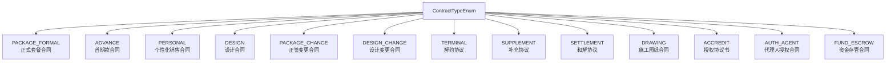

### 合同状态机

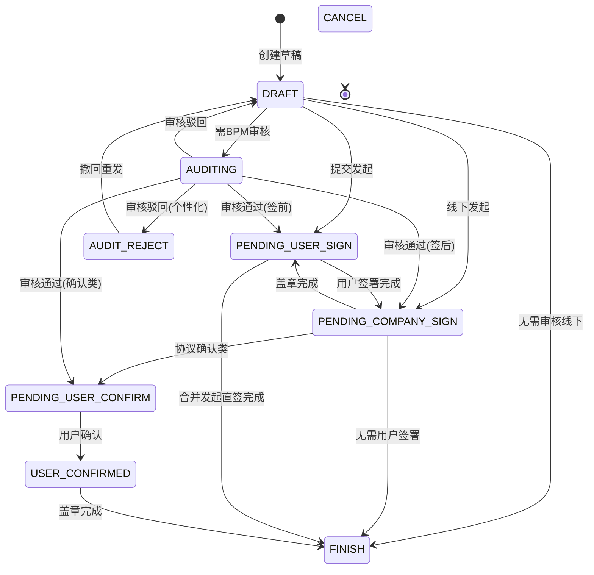

---

## 4. 核心组件详解

### 4.1 CommonContractService - 合同公共服务

**职责**: 提供合同基础查询、格式化、业务通用逻辑，是合同模块的基础服务层。

**核心方法分组**:

| 方法组 | 代表方法 | 说明 |
|--------|----------|------|
| 基础查询 | `getBaseContractInfo`, `queryContractList`, `queryContractListBatch` | 按项目/类型查询合同基础信息 |
| 详情格式化 | `formatContractBaseDTO`, `formatAllContract` | 将DB对象转换为DTO，附带PDF链接、单据号等 |
| 节点信息 | `getBaseContractNodeInfo`, `getUserConfirmSignMixTime` | 获取合同流程节点（提交、确认、签署等时间线） |
| 字段查询 | `queryFieldList`, `queryContractFieldInfo` | 查询合同扩展字段（KV结构存储） |
| 合同完成 | `contractFinishHandler` | 合同签署完成后处理：创建款项、作废历史合同、同步资金模型 |
| 短信提醒 | `sendContractSmsRemind`, `sendOnlineContractSmsRemind` | 线上/线下合同签署后的短信通知 |
| 合同作废 | `cancelHistoryContracts`, `cancelOtherContracts`, `cancelCurrentContract` | 合同状态流转至作废，关联BPM审批取消 |
| 资金同步 | `syncNerveCenter` | 合同完成后将金额同步到资金模型（定金/工程款/设计费） |
| 公对公签约 | `openCompanySignOnline`, `getCompanyInfo` | 判断公对公线上签约是否开放 |
| 合同模式 | `computeFormalContractMode`, `getContractModeByContractCode` | 计算正签合同模式（如全案模式） |
| 合并发起 | `mergeLaunchContract`, `buildMergeTerminalContractReq` | 构建合并发起关联合同参数 |
| 大表推送 | `contractDataPushBigTable` | 正签/变更合同签署后推送到数据大表 |

**关键依赖关系**:

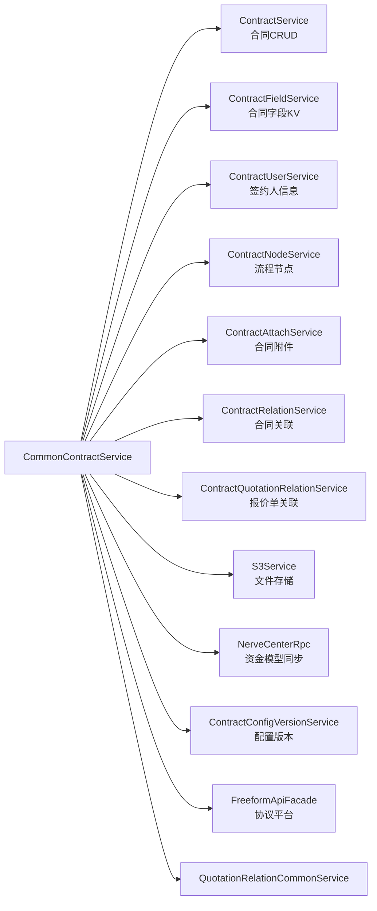

---

### 4.2 ContractBusinessService - 合同业务服务

**职责**: 处理合同签署、盖章、BPM审批、PDF生成等核心业务流程，是合同业务操作的中心枢纽。

**核心方法分组**:

| 方法组 | 代表方法 | 说明 |
|--------|----------|------|
| C端列表 | `getContractListGroup`, `getUserContractList`, `getUserContractListPage` | C端用户合同列表（整装+零售分组） |
| 签约URL | `getContractSignUrl`, `commonFetchSignUrl`, `accreditFetchAuthUrl` | 获取协议平台手签URL，区分个人签/公对公签/授权签 |
| 签约结果 | `contractSignResult`, `signSuccess` | 轮询签约结果，签署成功后更新状态 |
| 公司盖章 | `companySealSync`, `companySealAsync`, `updateCompanySealResult` | 同步/异步盖公司章，支持多主体盖章 |
| BPM审批 | `dealContractForBpm`, `applyContractBpm`, `dealContractResultForBpm` | 发起审批、获取审批人、处理审批结果 |
| PDF生成 | `generatePdf`, `generatePdfAddWaterMark` | 通过协议平台生成PDF（带/不带水印） |
| PDF转图片 | `contractPdfToImage`, `contractPdfToImageSchedule` | PDF转图片用于C端展示 |
| 签署校验 | `checkSignInfo`, `isFinishAfterSign`, `isFinishAfterChangeContractSign` | 校验实名认证、判断签署后是否直接完成 |
| 代理人 | `registerSignUser`, `registerUserSeal` | 注册个人签章，提前准备签署环境 |
| 关联合同 | `getRelationContract`, `getRelationContractCodeByContractCode` | 获取合并发起的关联合同列表 |

**合同签署流程**:

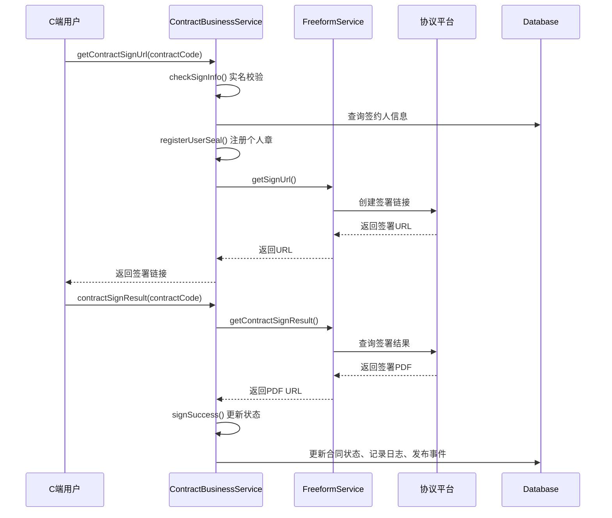

---

### 4.3 ContractUnifyService - 合同统一服务

**职责**: 合同核心业务的统一入口，涵盖签前校验、草稿保存、提交发起、详情查询、预览、配置管理等全流程操作。是整个合同模块中最大最核心的服务类。

**核心方法分组**:

#### 4.3.1 签前校验链

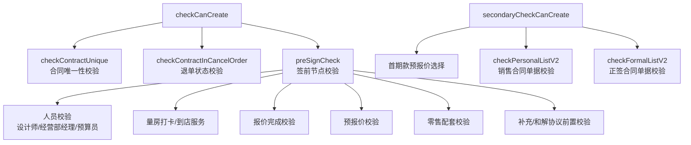

#### 4.3.2 合同详情构建

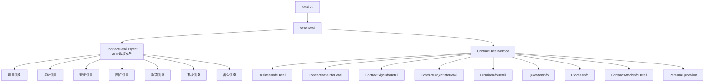

#### 4.3.3 合同保存与提交

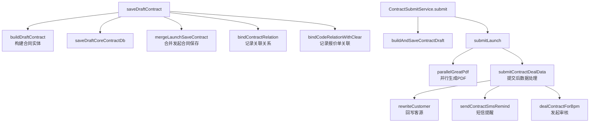

#### 4.3.4 合同配置系统

配置采用三级降级策略获取：

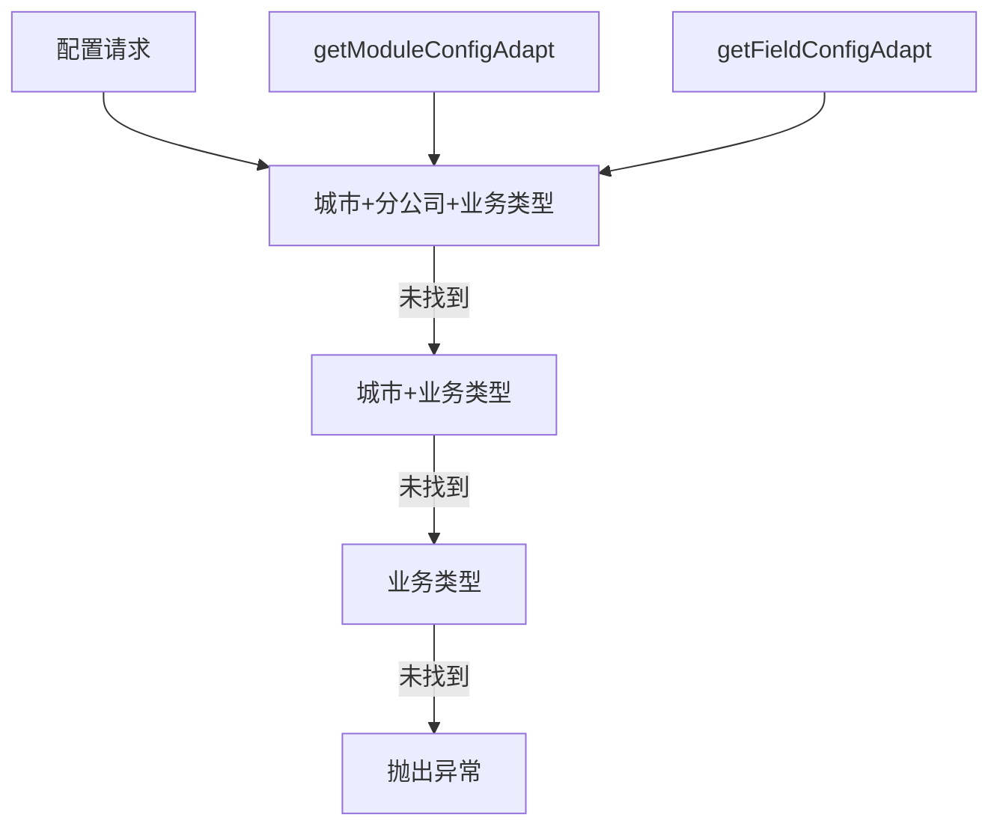

---

### 4.4 ContractContextAspect & ContractDetailAspect - AOP上下文管理

**职责**: 通过AOP切面，在合同操作前后自动准备和清理上下文数据（项目信息、报价信息、图纸信息、套餐信息等），避免在业务代码中重复查询。

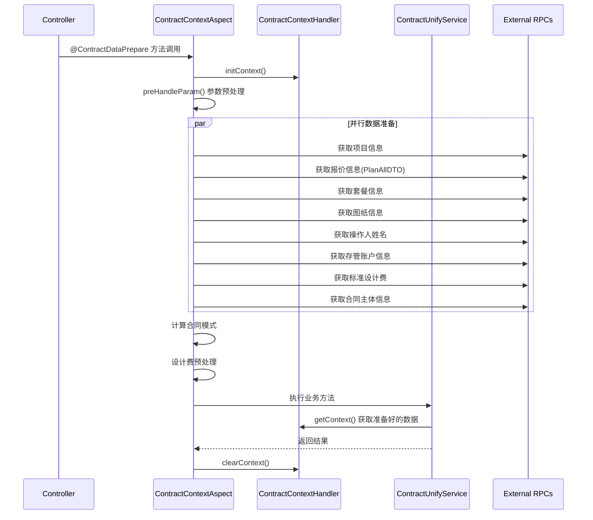

**ContractContext（ThreadLocal）包含的关键数据**:
- `projectInfoDTO` - 项目信息
- `planAllDTO` - 报价快照
- `contractSourceDataBO` - 报价源数据（含个性化报价）
- `drawingDTO` - 图纸信息
- `contractReq` - 合同请求参数
- `contractCityCompanyInfo` - 城市分公司配置
- `comboDTOList` - 套餐信息
- `designQuoteFeeDTO` - 设计费报价信息
- `mergeLaunch` - 是否合并发起标识

---

### 4.5 ContractMergeLaunchComputer - 合并发起计算器

**职责**: 根据Apollo配置规则，通过反射调用条件方法，计算当前合同需要合并发起的其他合同类型。

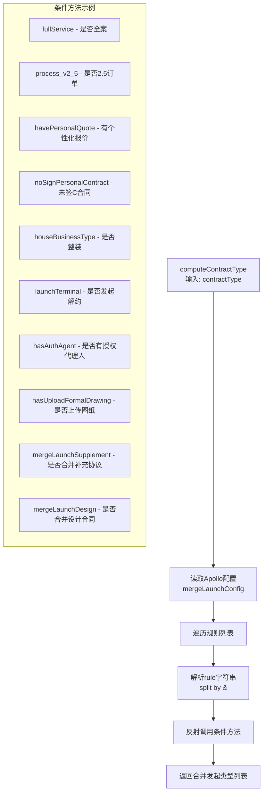

---

### 4.6 QuotationRelationCommonService - 报价单关联服务

**职责**: 管理合同与报价单/S单/变更单之间的绑定关系，支持绑定、解绑、换绑（协同报价单→S单）。

**绑定关系类型**:

| BindTypeEnum | 说明 | 典型场景 |
|-------------|------|---------|
| BILL_CODE | 报价单 | 基础报价、协同报价 |
| SUB_ORDER | S单（子订单） | 报价单下单后的实际订单 |
| CHANGE_ORDER | 变更单 | 变更场景下的新报价 |

**换绑流程**:

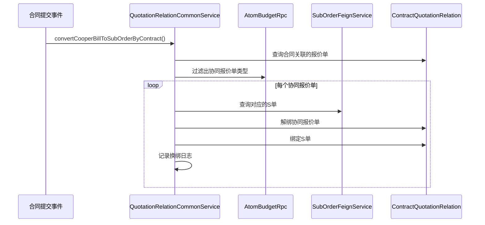

---

### 4.7 ContractFieldCheckService - 字段校验服务

**职责**: 通过反射机制，根据配置动态调用校验方法，支持条件化校验。

| 校验方法 | 校验内容 |
|---------|---------|
| `checkBrandList` | 品类列表约定预收金额、品类编号合法性 |
| `checkBrandTotalAmount` | 品类总计金额 >= 款项已付金额 |
| `checkAdvanceAmount` | 首期款金额在预估合同额20%~70%范围内 |
| `checkAdvanceFileSize` | 首期款报价单PDF大小 <= 10M |
| `checkHouseType` | 房屋类型与报价侧一致（2.5需要） |
| `checkIdCardInfo` | 身份证号与姓名一致性校验 |
| `checkCompanyInfo` | 公司名称与统一社会信用代码匹配 |
| `checkDesignAmount` | 设计服务费优惠后 <= 优惠前 |

---

### 4.8 ContractDependentDataService - 合同依赖数据服务

**职责**: 获取合同所需的报价相关数据（个性化报价、协同报价、S单报价等），是正签和销售合同数据准备的核心。

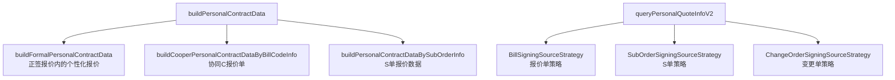

### 4.9 个性化合同签约源策略（策略模式）

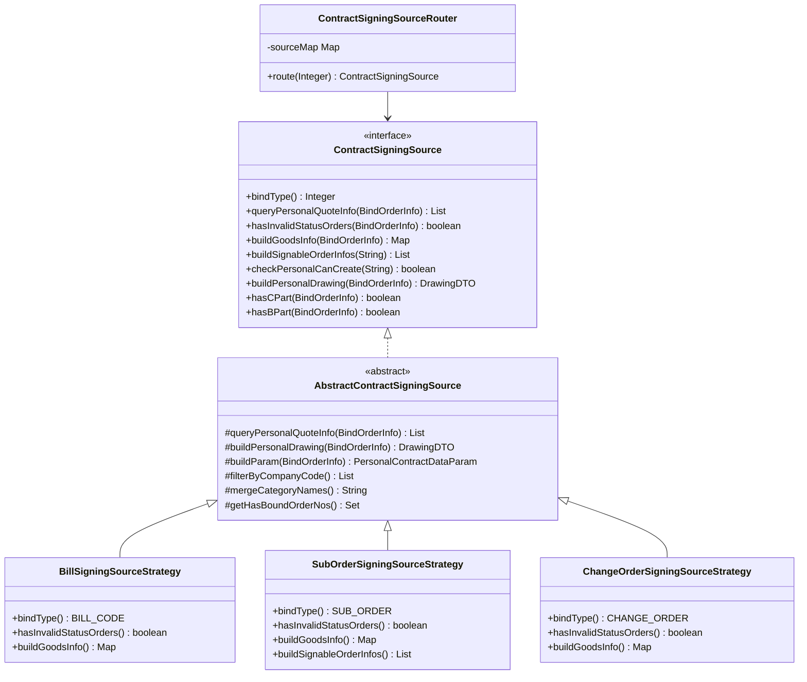

---

## 5. 事件驱动架构（ContractEvents）

### 5.1 合同生命周期事件

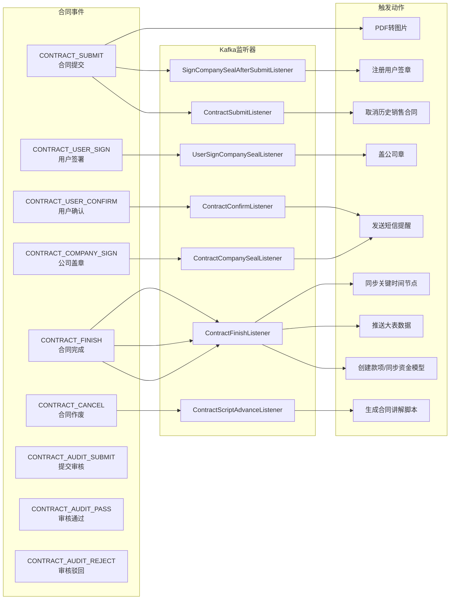

### 5.2 定时任务

| 定时任务 | 说明 |
|---------|------|
| `ApplyBpmSchedule` | 补偿BPM审批发起（异常重试） |
| `AsyncSignTimeCheckSchedule` | 异步校验签署时间 |
| `ChangePersonalContractFieldSchedule` | 同步变更个性化合同字段 |
| `ContractFieldCheckSchedule` | 合同字段一致性巡检 |
| `FormFieldConfigCheckSchedule` | 表单字段配置巡检 |
| `PrivacyAccessWarnSchedule` | 隐私数据访问告警 |

---

## 6. 数据模型与持久化

### 6.1 核心数据表关系

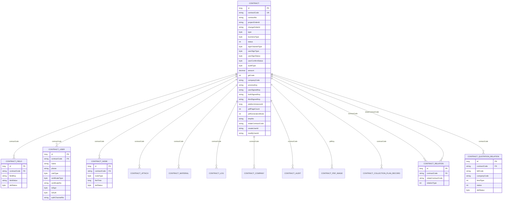

### 6.2 合同字段KV存储设计

合同扩展字段采用KV结构存储在`contract_field`表中，每个字段以`fieldKey`+`fieldValue`的形式持久化。这种设计使得：
- 不同合同类型可以存储不同的字段集合
- 支持动态字段扩展，无需DDL变更
- 通过`ContractFieldConfig`配置表控制字段的展示、校验、编辑规则

---

## 7. 关键业务流程

### 7.1 正签合同发起完整流程

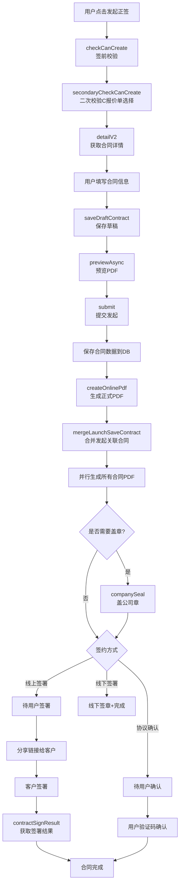

### 7.2 合同审核流程

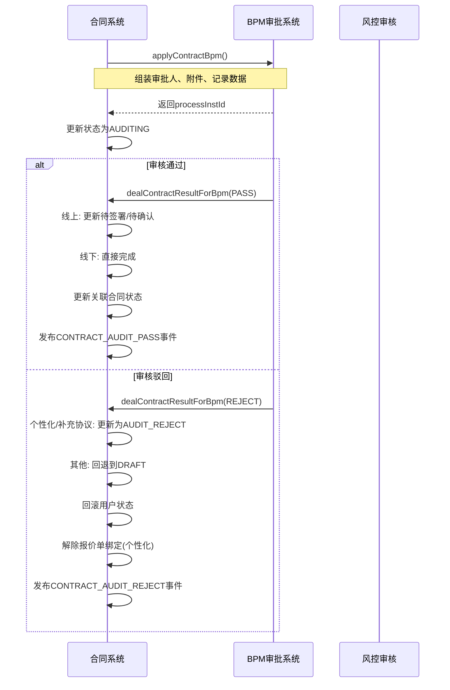

---

## 8. 变更合同子系统（ContractChange）

变更合同通过策略模式支持多种变更场景：

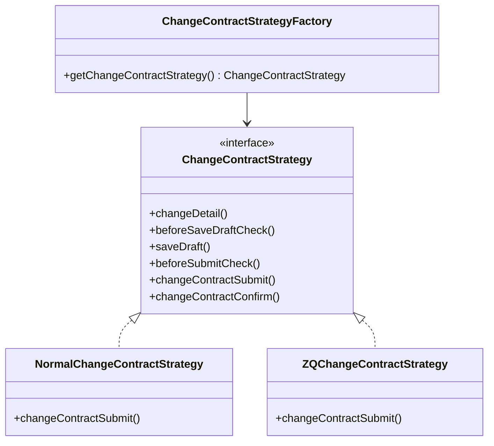

### 变更合同差异计算

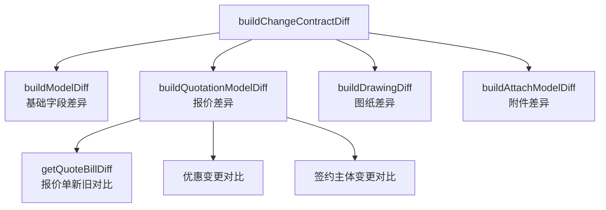

---

## 9. PDF生成子系统（ContractPdf）

### 9.1 PDF生成策略

```mermaid
graph TD
    REQ[createOnlinePdf] --> MODE{pdfGenerationMode?}
    MODE -->|FORMATTED| FREEFORM[ContractPdfCreateService<br/>createPdfByFreeform<br/>通过协议平台版式生成]
    MODE -->|UNFORMATTED| SELF[ContractPdfCreateService<br/>createPdfBySelfGeneration<br/>系统自行拼接生成]

    SELF --> FACTORY[CreateContractPdfBySelfStrategyFactory]
    FACTORY --> HOUSE[HouseFormalContractPdfBySelfStrategy<br/>整装正签]
    FACTORY --> DRAWING[DrawingContractPdfBySelfStrategy<br/>图纸合同]
    FACTORY --> GROUP[GroupFormalContractPdfBySelfStrategy<br/>团装正签]
    FACTORY --> REFORM[ReformAllFormalContractPdfBySelfStrategy<br/>翻新全案]
```

### 9.2 PDF字段映射（ContractPdfBuildService）

ContractPdfBuildService 负责从合同数据中提取并转换PDF模板所需的所有字段，包括：

| 分类 | 字段举例 |
|------|---------|
| 基本信息 | 合同编号、项目地址、面积、户型 |
| 签约信息 | 签约人信息、甲方/乙方信息、公司信息 |
| 报价信息 | 套餐名称、报价金额、优惠信息 |
| 承包约定 | 工期、承包方式、甲供材料 |
| 收款计划 | 各期款项节点、金额、比例 |
| 图纸信息 | 施工图纸URL、个性化图纸 |
| 保修信息 | 水电保修年限、防水保修年限 |
| 设计费 | 优惠前/后设计费、设计师职级 |

---

## 10. 隐私与安全（ContractPrivacy）

```mermaid
classDiagram
    class PrivacyOperateStrategy {
        <<interface>>
        +decryptPrivacyInfo()
        +recordAndPostProcess()
    }

    class CopyCustomerPhoneStrategy {
        +decryptPrivacyInfo() 手机号解密
    }

    class ViewContractPdfStrategy {
        +decryptPrivacyInfo() PDF查看解密
    }

    class ViewCustomerIdCardStrategy {
        +decryptPrivacyInfo() 身份证解密
    }

    class ViewPropertyAddressStrategy {
        +decryptPrivacyInfo() 房产地址解密
    }

    PrivacyOperateStrategy <|.. CopyCustomerPhoneStrategy
    PrivacyOperateStrategy <|.. ViewContractPdfStrategy
    PrivacyOperateStrategy <|.. ViewCustomerIdCardStrategy
    PrivacyOperateStrategy <|.. ViewPropertyAddressStrategy
```

---

## 11. 外部依赖关系总览

```mermaid
graph LR
    subgraph contract[ContractCore]
        C[合同模块]
    end

    subgraph fund[资金域]
        NFC[NerveCenter<br/>资金模型同步]
        PAY[PayServiceRpc<br/>支付/短信]
        OCT[OctopusRpc<br/>款项变更]
        ESC[EscrowRpc<br/>资金存管]
        ORC[OrderCenterRpc<br/>订单中心]
    end

    subgraph quotation[报价域]
        ABR[AtomBudgetRpc<br/>报价/预报价]
        ACR[AtomChangeRpc<br/>变更申请]
        ADR[AtomDrawingRpc<br/>图纸查询]
        QFS[QuotationFeignService<br/>报价查询/设计费]
    end

    subgraph order[订单域]
        OSQ[OrderStandardQueryRpc<br/>主订单查询]
        SOF[SubOrderFeignService<br/>S单查询]
    end

    subgraph signing[签署域]
        FFA[FreeformApiFacade<br/>协议平台]
        FAC[FaceAuthService<br/>人脸识别]
    end

    subgraph bpm[审批域]
        BPM[BpmService<br/>BPM审批]
        ADR2[AuditRpc<br/>风控审核]
    end

    subgraph user[用户域]
        MDM[MdmRpc<br/>分公司信息]
        MEM[MemberRpc<br/>用户信息]
        CER[CeresRpc<br/>人员服务]
        CRT[CertificateRpc<br/>证件服务]
    end

    C --> fund
    C --> quotation
    C --> order
    C --> signing
    C --> bpm
    C --> user
```

---

## 12. 设计模式总结

| 模式 | 应用位置 | 说明 |
|------|---------|------|
| **策略模式** | `ContractSigningSource` → 3种策略 | 按绑定类型（报价单/S单/变更单）差异化处理个性化合同数据 |
| **策略模式** | `ChangeContractStrategy` → 2种策略 | 正常变更/ZQ变更的差异化处理 |
| **策略模式** | `CreateContractPdfBySelfStrategy` → 4种策略 | 按业务类型差异化PDF自生成 |
| **策略模式** | `AuditCheckStrategy` | 设计费审核校验策略 |
| **策略模式** | `PrivacyOperateStrategy` | 不同隐私场景的解密策略 |
| **AOP切面模式** | `ContractContextAspect`, `ContractDetailAspect` | 自动准备和清理上下文数据 |
| **ThreadLocal模式** | `ContractContextHandler`, `ContractDetailContextHandler` | 请求级别的上下文数据传递 |
| **工厂模式** | `ChangeContractStrategyFactory`, `ContractSigningSourceRouter` | 根据类型路由到具体策略实现 |
| **事件驱动模式** | `ContractEventProducer` + Kafka Listeners | 合同状态变更触发异步后续处理 |
| **模板方法模式** | `AbstractContractSigningSource` | 定义个性化数据获取骨架，子类实现差异化逻辑 |
| **反射调用模式** | `ContractFieldCheckService`, `ContractMergeLaunchComputer` | 基于配置名称动态调用校验/条件方法 |
| **Builder模式** | `ContractReqDTO`, `SignableOrderInfo` | 复杂参数对象的构建 |

---

## 13. 子模块索引

| 子模块 | 文档链接 | 职责 |
|--------|----------|------|
| ContractChange | [ContractChange.md](ContractChange.md) | 变更合同的创建、提交、差异计算、确认 |
| ContractSubmission | [ContractSubmission.md](ContractSubmission.md) | 合同提交、PDF生成、设计费审核、补充协议BPM |
| ContractPdf | [ContractPdf.md](ContractPdf.md) | PDF字段映射、PDF生成策略、PDF转图片 |
| ContractSigning | [ContractSigning.md](ContractSigning.md) | 签署流程、公司授权、视频观看、自盖章 |
| ContractComboAndMaterial | [ContractComboAndMaterial.md](ContractComboAndMaterial.md) | 套餐信息、材料清单PDF |
| ContractConfig | [ContractConfig.md](ContractConfig.md) | Apollo配置、城市分公司配置、版本管理、管理后台 |
| ContractEvents | [ContractEvents.md](ContractEvents.md) | Kafka事件生产者/消费者、定时任务 |
| ContractPrivacy | [ContractPrivacy.md](ContractPrivacy.md) | 隐私数据解密策略 |
| ContractPresentation | [ContractPresentation.md](ContractPresentation.md) | H5端/PC端/小程序端合同展示层 |
| ContractDataModels | [ContractDataModels.md](ContractDataModels.md) | Excel配置导入、数据模型BO |
