# ContractCore 模块文档

## 1. 模块概述

ContractCore 是合同子系统的核心服务模块，负责家装/整装业务场景下合同全生命周期的业务逻辑编排。模块涵盖合同详情构建、草稿保存、字段校验、按钮配置、对公签约、资金存管、自主盖章、主订单变更等核心能力，是连接上层 Controller 与底层 DAO/RPC 的业务逻辑中枢。

**核心职责**：

- **合同详情聚合**：从报价、客源、备件、审核、资金等多个外部数据源聚合合同详情，支持首屏优化和延迟加载
- **草稿与提交编排**：管理合同草稿保存、合并发起、关联关系绑定等流程
- **字段校验引擎**：基于反射的动态校验机制，在合同提交前校验业务字段合法性
- **按钮可见性配置**：基于 Aviator 表达式引擎的多维度按钮配置，决定各合同类型在不同状态下的操作按钮展示
- **对公签约管理**：处理法人/代理人签约、授权协议生成与复用逻辑
- **PDF 与盖章**：支持自动生成合同 PDF、自主盖章等能力

---

## 2. 模块架构

```mermaid
graph TD
    subgraph ContractCore
        ContractDetailService[ContractDetailService<br/>合同详情服务]
        ContractSaveDraftService[ContractSaveDraftService<br/>草稿保存服务]
        ContractButtonConfigService[ContractButtonConfigService<br/>按钮配置服务]
        ContractFieldCheckService[ContractFieldCheckService<br/>字段校验服务]
        ContractCompanySignService[ContractCompanySignService<br/>对公签约服务]
        ContractEscrowService[ContractEscrowService<br/>资金存管服务]
        ContractSelfSealService[ContractSelfSealService<br/>自主盖章服务]
        ContractHomeOrderNoChangeService[ContractHomeOrderNoChangeService<br/>主订单变更服务]
        ContractScriptCreateService[ContractScriptCreateService<br/>脚本动态字段服务]
        WorkerTypeCheckService[WorkerTypeCheckService<br/>工种校验服务]
    end

    subgraph ContractContextModule
        ContractContextAspect[ContractContextAspect<br/>提交上下文切面]
        ContractContextHandler[ContractContextHandler<br/>提交上下文管理]
        ContractDetailAspect[ContractDetailAspect<br/>详情上下文切面]
        ContractDetailContextHandler[ContractDetailContextHandler<br/>详情上下文管理]
    end

    subgraph ContractChangeStrategy
        ChangeContractStrategyFactory[ChangeContractStrategyFactory<br/>变更策略工厂]
        NormalChangeContractStrategy[NormalChangeContractStrategy<br/>普通变更策略]
        ZQChangeContractStrategy[ZQChangeContractStrategy<br/>正签变更策略]
    end

    subgraph ContractPdfModule
        TerminalContractPdfBuildService[TerminalContractPdfBuildService<br/>解约PDF构建]
        DrawingContractPdfBySelfStrategy[DrawingContractPdfBySelfStrategy<br/>图纸合同PDF]
        GroupFormalContractPdfBySelfStrategy[GroupFormalContractPdfBySelfStrategy<br/>团装正签PDF]
        ReformAllFormalContractPdfBySelfStrategy[ReformAllFormalContractPdfBySelfStrategy<br/>翻新全案PDF]
    end

    subgraph ContractSigningModule
        PersonalRelationHandler[PersonalRelationHandler<br/>个性化关系统一接口]
        ContractSigningSource[ContractSigningSource<br/>签约数据源接口]
        ContractSigningSourceRouter[ContractSigningSourceRouter<br/>签约数据源路由]
        BillSigningSourceStrategy[BillSigningSourceStrategy<br/>报价单策略]
        ChangeOrderSigningSourceStrategy[ChangeOrderSigningSourceStrategy<br/>变更单策略]
        SubOrderSigningSourceStrategy[SubOrderSigningSourceStrategy<br/>子订单策略]
    end

    subgraph ContractMaterialModule
        MaterialPdfDiffService[MaterialPdfDiffService<br/>材料PDF差异比对]
        MaterialPdfUtil[MaterialPdfUtil<br/>材料PDF工具]
    end

    ContractDetailService --> ContractDetailContextHandler
    ContractDetailService --> ContractDetailAspect
    ContractSaveDraftService --> ContractContextHandler
    ContractSaveDraftService --> ContractContextAspect
    ContractFieldCheckService --> ContractContextHandler
    ContractSaveDraftService --> ContractSigningSourceRouter
```

---

## 3. 核心组件详解

### 3.1 ContractDetailService — 合同详情聚合引擎

合同子系统中最大且最核心的服务类，负责将分散在多个数据源（报价系统、客源系统、备件系统、审核系统、资金系统）的数据聚合为统一的合同详情视图。

#### 核心方法

| 方法 | 职责 |
|------|------|
| `initContractDetail()` | 合同详情初始化入口，根据合同类型和模块列表组装完整详情 |
| `buildContractProjectInfoDetail()` | 构建项目信息：地址、设计师、户型、面积、首期款比例等 |
| `buildContractSignInfoDetail()` | 构建签约信息：签约主体、证件信息、委托签署等 |
| `buildContractBaseInfoDetail()` | 构建基础信息：合同类型、状态、合并发起模式、设计费等 |
| `buildPromiseInfoDetail()` | 构建承包约定信息：工期模式、承包方式、甲供材料等 |
| `buildQuotationDetail()` | 构建报价信息：套餐、配置清单、图纸附件等 |
| `buildProcessInfoDetail()` | 构建审核流程信息：风控审核状态节点 |
| `buildContractAttachInfo()` | 构建合同附件信息：证件、房本、授权委托等 |
| `buildBusinessInfoDetail()` | 构建业务信息：品类、变更单、报价单等 |
| `mergeContractAttachInfoTOSignInfo()` | 将备件模块字段同步到签约信息模块 |

#### 首屏优化策略

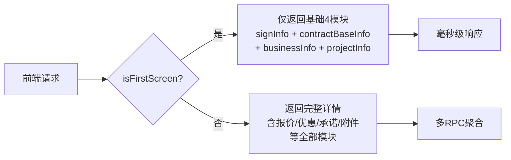

首屏请求通过 `ContractDetailContextHandler.isFirstScreen()` 判断，仅返回首屏必需的 4 个核心模块（签约信息、基础信息、业务信息、项目信息），避免不必要的 RPC 调用。非首屏请求则通过 `ContractDetailContextHandler` 上下文中预加载的数据，聚合完整的合同详情。

#### 设计费处理逻辑

设计费在合同详情中有两种来源路径：
- **标准设计费城市**：从上下文的 `DesignSignPriceInfo` 获取设计师职级和标准费用，根据面积计算
- **全国设计费开城**：通过 `CeresRpc` 查询服务者中心获取设计师职级信息
- **从报价获取**：当 `designFeeFromQuote` 开启时，从报价系统的 `DesignQuoteFeeDTO` 获取设计费信息

#### 审核流程状态机

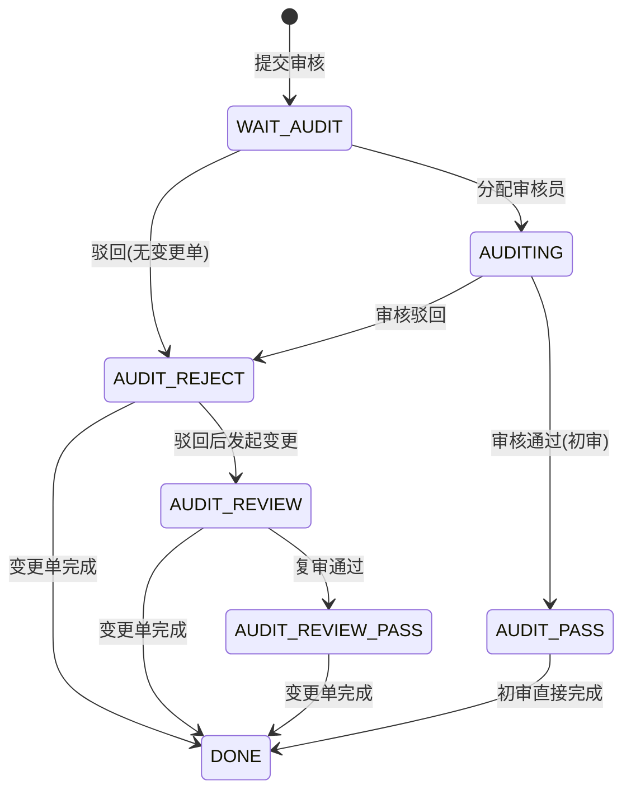

流程状态由 `computeProcessStatus()` 方法计算，综合考量审核系统状态（`AuditDetailDto`）和变更单状态（`ChangeListDTO`），通过 `ProcessStatusEnum` 枚举映射到前端可展示的流程节点。

---

### 3.2 ContractSaveDraftService — 草稿保存编排

负责合同草稿的保存流程编排，支持合并发起模式下多个合同同时保存。

#### 保存流程

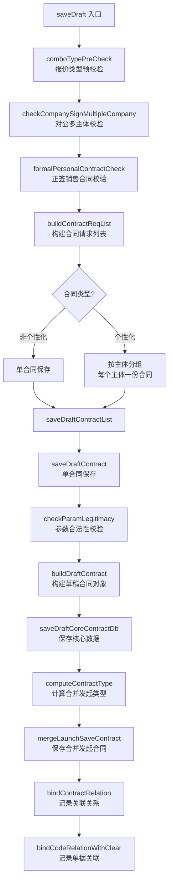

#### 个性化合同分组策略

个性化合同（`CONTRACT_TYPE = 8`）支持 B+C 协同发起。`buildContractReqList()` 方法根据 `ContractSourceDataBO.personalContractDataList` 按分公司（`organizationCode`）分组，每组生成独立的合同请求。每个请求携带该主体下的报价单、子订单、变更单等信息。

#### 关键依赖

| 依赖 | 作用 |
|------|------|
| `ContractUnifyService` | 参数校验、草稿构建、数据持久化 |
| `ContractSubmitService` | 合同关联关系绑定 |
| `ContractMergeLaunchComputer` | 计算合并发起的合同类型列表 |
| `ContractSigningSourceRouter` | 个性化合同商品信息构建路由 |
| `QuotationRelationCommonService` | 单据关联关系管理 |

---

### 3.3 ContractButtonConfigService — 按钮可见性配置引擎

基于 Aviator 表达式引擎的多维度按钮配置系统，决定不同合同类型在不同状态下的操作按钮展示。

#### 配置架构

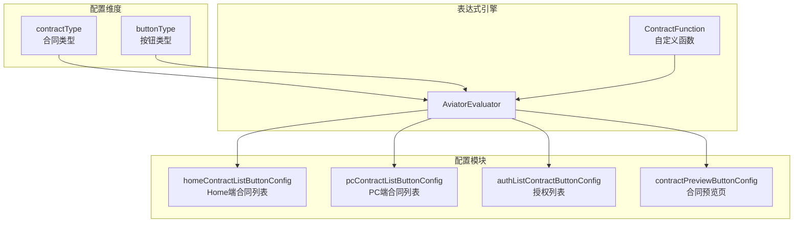

#### 配置优先级

配置采用**优先级覆盖**机制：
- **通用规则（normalRouteMap）**：优先级 10，匹配 `contractType = *` 的通用规则
- **特殊规则（routeMap）**：优先级 100，按 `contractType_buttonType` 精确匹配覆盖通用规则
- **默认值**：优先级 0，默认 `"false"` 不展示

#### 四大配置场景

| 配置模块 | 按钮枚举 | 使用场景 |
|---------|---------|---------|
| `homeContractListButtonConfig` | `ContractButtonEnum` | Home 端合同列表操作按钮 |
| `pcContractListButtonConfig` | `PcButtonEnum` | PC 端合同列表操作按钮 |
| `authListContractButtonConfig` | `ContractButtonEnum` | 授权协议列表按钮 |
| `contractPreviewButtonConfig` | `ContractButtonEnum` | 合同预览页操作按钮 |

#### 表达式中的自定义函数

通过 `ContractFunction` 类注册到 Aviator，提供以下业务判断：
- `ContractFunction.showUndoButton()` — 是否展示撤销按钮
- `ContractFunction.showReSignButton()` — 是否展示去重签按钮
- `ContractFunction.showChangeButton()` — 是否展示去变更按钮
- `ContractFunction.showPersonCreateButton()` — 是否展示个性化合同创建按钮

---

### 3.4 ContractFieldCheckService — 字段校验引擎

通过**反射机制**实现的动态字段校验服务。校验方法名通过配置下发，运行时通过 `ReflectionUtils.invokeMethod()` 动态调用。

> **重要约束**：方法名称不可修改、方法不可删除，因为外部通过方法名字符串引用。

#### 校验方法清单

| 方法 | 校验内容 |
|------|---------|
| `checkBrandList()` | 品类列表预收金额合计与总额一致性、品类编号在配置中、预收金额不小于报价金额的配置比例 |
| `checkBrandTotalAmount()` | 品类总计金额不小于款项已付金额 |
| `checkAdvanceAmount()` | 首期款金额在预估合同额的 20%~70% 范围内、预估合同额不低于报价预估值 |
| `checkAdvanceFileSize()` | 首期款报价单 PDF 不超过配置大小（默认 10M） |
| `checkHouseType()` | 正签合同房屋类型与报价侧一致（2.5 模式） |
| `checkIdCardInfo()` | 姓名与身份证号一致性校验（业主、代理人、法人、公司代理人） |
| `checkCompanyInfo()` | 公司名称与统一社会信用代码一致性校验 |
| `checkDesignAmount()` | 设计服务费优惠后不大于优惠前、不小于 0 |

---

### 3.5 ContractCompanySignService — 对公签约服务

处理企业客户的线上签约流程，核心能力是**授权协议书的生成与复用**。

#### 授权协议复用策略

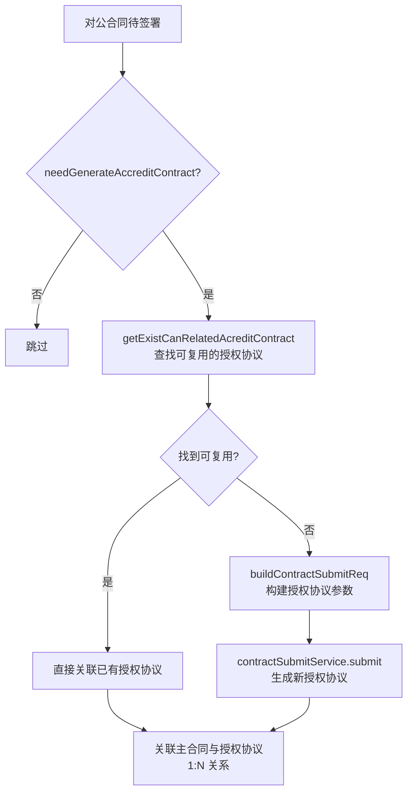

**复用条件**（同时满足）：
1. 乙方分公司（`companyCode`）相同
2. 甲方分公司（统一社会信用代码）相同
3. 法人证件号相同
4. 代理人证件号相同（或均无代理人）

**生成条件**：
- 线上签约 + 对公签约主体
- 合同类型属于需要授权协议的类型（正签、个性化、首期款、变更、设计、设计变更）
- 非协同发起的 C 合同
- 有协议变更（非无协议变更）

#### 授权列表查询

提供两种授权列表查询入口：
- `getContractAuthList()` — 基于项目下所有关联合同查找授权协议（已废弃）
- `getAccreditContractList()` — 基于登录人手机号匹配签约人身份查找授权协议

---

### 3.6 ContractEscrowService — 资金存管合同

生成资金存管协议合同，通过 RPC 查询存管账户信息后组装合同参数。

#### 核心流程

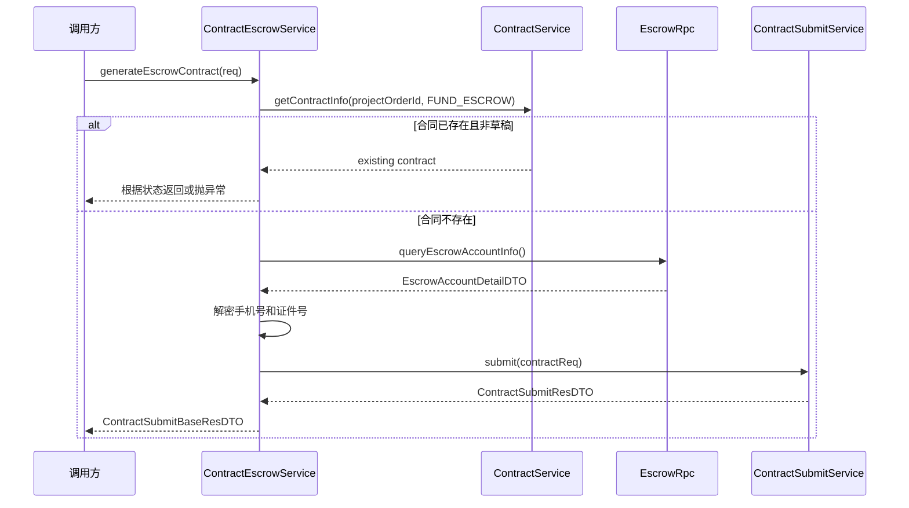

**幂等性保障**：如果合同已生成（非草稿态），直接返回已有合同信息，避免重复创建。

---

### 3.7 ContractSelfSealService — 自主盖章服务

支持上传 PDF 或图片文件，自动盖电子章并生成预览链接。

#### 盖章流程

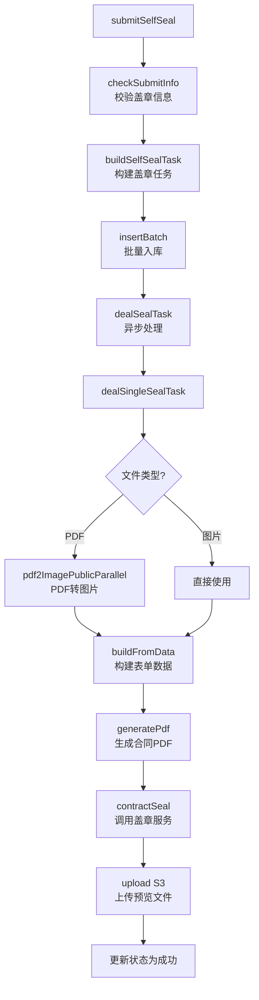

#### 权限控制

盖章服务基于**系统号（systemCode）+ 分公司（companyCode）**控制权限：
- `getSelfSealCompanyInfos()` 返回当前登录人系统号有权访问的分公司列表
- 提交时校验 `companyCode` 是否在允许列表中

---

### 3.8 ContractHomeOrderNoChangeService — 主订单变更

处理家装绑定客源变更场景下的合同数据迁移，支持变更和回滚操作。

#### 变更逻辑

1. **作废目标订单下的个性化首期合同**：软删除目标主订单下的个性化首期款合同
2. **迁移销售合同**：将源主订单下的个性化相关合同的 `projectOrderId` 更新为目标主订单

#### 回滚逻辑

1. **回滚销售合同**：将 `projectOrderId` 恢复为源主订单
2. **恢复作废合同**：通过 `recoverContractByContractCode()` 恢复被软删除的合同

变更结果通过 `ContractHomeOrderNoChangeResultDTO` 序列化存储，回滚时反序列化使用。

---

### 3.9 ContractScriptCreateService — 脚本动态字段服务

通过**反射 + 并行执行**的方式，批量获取合同 PDF 生成所需的动态字段。

#### 执行机制

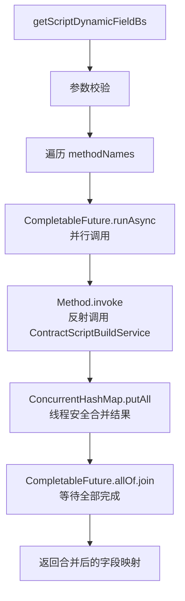

- 使用自定义线程池 `scriptDynamicFieldExecutor` 控制并发度
- 结果通过 `ConcurrentHashMap` 线程安全合并
- 异常隔离：单个方法调用失败不影响其他方法

---

### 3.10 WorkerTypeCheckService — 工种校验服务

通用的工种校验能力，通过 RPC 查询服务者中心获取人员工种信息。

| 方法 | 功能 |
|------|------|
| `hasWorkerType(mobile, workTypes...)` | 判断手机号对应人员是否属于指定工种（支持多工种或关系） |
| `checkWorkerType(mobile, errorMsg, workTypes...)` | 校验手机号不能为指定工种，匹配则抛异常 |

---

## 4. 上下文管理模块

### 4.1 ContractContextModule

上下文模块通过 AOP 切面 + ThreadLocal 的模式，在合同提交/保存流程中预加载外部数据。

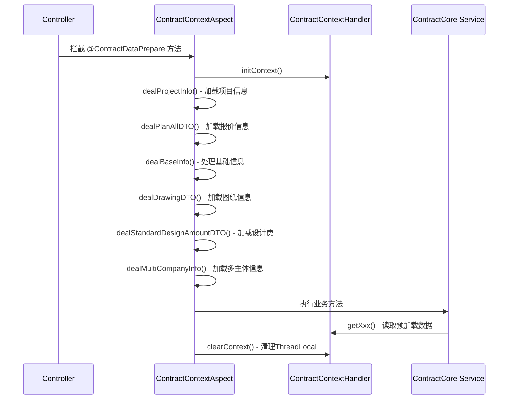

#### 两个上下文体系

| 上下文 | 切面 | Handler | 场景 |
|--------|------|---------|------|
| 提交上下文 | `ContractContextAspect` | `ContractContextHandler` | 合同保存/提交 |
| 详情上下文 | `ContractDetailAspect` | `ContractDetailContextHandler` | 合同详情查询 |

**提交上下文**额外处理参数预处理（`preHandleParam`）、签章信息（`preHandleSignInfoParam`）、项目参数（`preHandleProjectParam`）。

**详情上下文**额外加载资金信息（`dealRelateFundInfo`）、审核信息（`dealAuditInfo`）、备件信息（`dealAttachInfo`），并支持首屏标记（`isFirstScreen`）。

---

## 5. 变更合同策略模块

### ContractChangeStrategy

采用**策略模式**处理不同类型变更合同的差异逻辑。

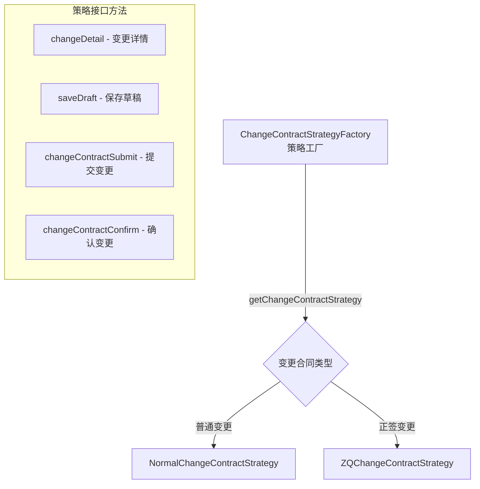

策略工厂通过 Spring `ApplicationContext` 动态获取策略 Bean，根据变更合同类型路由到对应实现。

---

## 6. PDF 生成模块

### ContractPdfModule

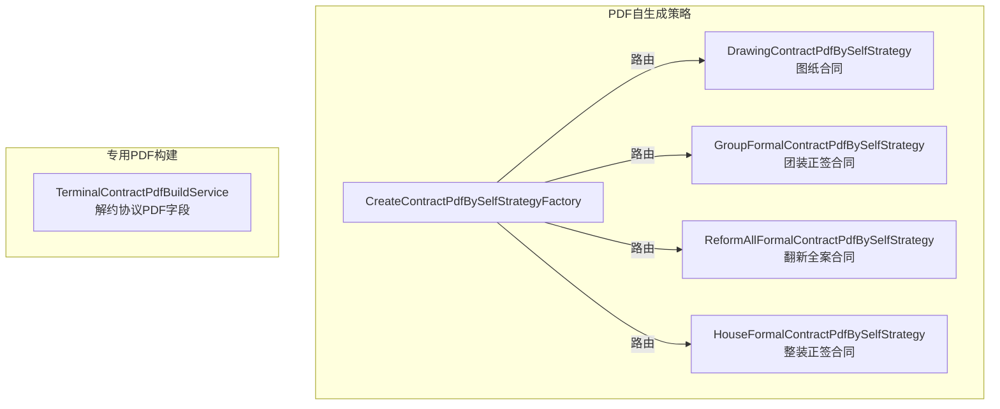

自生成 PDF 策略通过 `CreateContractPdfBySelfStrategyFactory` 工厂路由，每种合同类型有独立的 PDF 生成实现，支持从 Freeform 平台获取模板后自行填充数据生成 PDF（区别于调用 Freeform 生成）。

---

## 7. 签约数据源模块

### ContractSigningModule

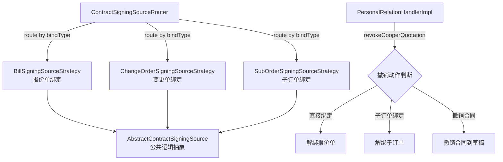

#### 签约数据源路由

个性化合同的报价数据可能来自三种绑定类型：
- **报价单（Bill）**：通过报价单号直接绑定
- **变更单（ChangeOrder）**：通过变更单关联的报价绑定
- **子订单（SubOrder）**：通过子订单关联的报价绑定

`ContractSigningSourceRouter` 根据 `bindType` 路由到对应策略，每个策略实现查询报价信息、校验可签约性、构建商品信息等能力。

---

## 8. 材料 PDF 模块

### ContractMaterialModule

| 服务 | 职责 |
|------|------|
| `MaterialPdfDiffService` | 比对报价系统材料数据与合同存储的材料数据是否一致，支持 SKU 组和数据库数据两种格式的转换 |
| `MaterialPdfUtil` | 材料 PDF 生成的通用工具方法，支持域名替换等 |

---

## 9. 关键设计模式

### 9.1 策略模式

| 应用点 | 策略接口 | 实现 |
|--------|---------|------|
| 变更合同处理 | `ChangeContractStrategy` | `NormalChangeContractStrategy`, `ZQChangeContractStrategy` |
| PDF 自生成 | `CreateContractPdfBySelfStrategy` | `DrawingContractPdfBySelfStrategy`, `GroupFormalContractPdfBySelfStrategy`, `ReformAllFormalContractPdfBySelfStrategy`, `HouseFormalContractPdfBySelfStrategy` |
| 签约数据源 | `ContractSigningSource` | `BillSigningSourceStrategy`, `ChangeOrderSigningSourceStrategy`, `SubOrderSigningSourceStrategy` |

### 9.2 AOP 上下文预加载

通过 `@ContractDataPrepare` 注解标记需要上下文的方法，切面在方法执行前通过多个 `deal*()` 方法预加载外部数据到 ThreadLocal，业务方法通过 `ContractContextHandler.getXxx()` 直接读取。方法结束后 `clearContext()` 清理。

### 9.3 反射动态校验

`ContractFieldCheckService.checkContractField()` 接收方法名字符串，通过 `ReflectionUtils.findMethod()` + `invokeMethod()` 动态调用校验方法。校验规则通过配置（如 Apollo）下发方法名，无需硬编码校验逻辑。

### 9.4 多维度表达式配置

`ContractButtonConfigService` 将按钮可见性规则抽象为 `[contractType, buttonType] -> booleanExpression` 的映射，通过 Aviator 表达式引擎在运行时动态求值。通用规则和特殊规则分层配置，特殊规则优先级高于通用规则。

### 9.5 并行任务编排

`ContractScriptCreateService` 使用 `CompletableFuture.runAsync()` + 自定义线程池并行调用多个动态字段方法，结果通过 `ConcurrentHashMap` 线程安全合并，最后 `allOf().join()` 等待全部完成。

---

## 10. 依赖关系图

```mermaid
graph TD
    subgraph 外部系统
        AuditSys[审核系统<br/>AuditRpc]
        QuoteSys[报价系统<br/>QuotationFeignService]
        ChangeSys[变更系统<br/>AtomChangeRpc]
        BudgetSys[预算系统<br/>AtomBudgetRpc]
        EscrowSys[存管系统<br/>EscrowRpc]
        CerberSys[服务者中心<br/>CeresRpc]
        FundSys[资金系统<br/>PayServiceRpc]
        FreeformSys[Freeform平台<br/>FreeformService]
        S3[S3存储<br/>S3Service]
        Apollo[Apollo配置<br/>ContractApolloConfig]
    end

    subgraph ContractCore
        DetailSvc[ContractDetailService]
        SaveDraftSvc[ContractSaveDraftService]
        BtnConfig[ContractButtonConfigService]
        FieldCheck[ContractFieldCheckService]
        CompSign[ContractCompanySignService]
        EscrowSvc[ContractEscrowService]
        SelfSeal[ContractSelfSealService]
    end

    subgraph 底层DAO
        ContractDAO[ContractService]
        FieldDAO[ContractFieldService]
        UserDAO[ContractUserService]
        AttachDAO[ContractAttachService]
        RelationDAO[ContractRelationService]
        NodeDAO[ContractNodeService]
    end

    DetailSvc --> AuditSys
    DetailSvc --> QuoteSys
    DetailSvc --> ChangeSys
    DetailSvc --> BudgetSys
    DetailSvc --> CerberSys
    DetailSvc --> Apollo

    CompSign --> ContractDAO
    CompSign --> FieldDAO
    CompSign --> UserDAO

    BtnConfig --> Apollo
    BtnConfig --> FieldDAO

    EscrowSvc --> EscrowSys
    EscrowSvc --> ContractDAO

    SelfSeal --> FreeformSys
    SelfSeal --> S3
    SelfSeal --> Apollo

    SaveDraftSvc --> ContractDAO

    FieldCheck --> Apollo
    FieldCheck --> CerberSys

    DetailSvc --> ContractDAO
    DetailSvc --> FieldDAO
    DetailSvc --> UserDAO
    DetailSvc --> RelationDAO
```

---

## 11. 核心数据流

### 11.1 合同详情查询数据流

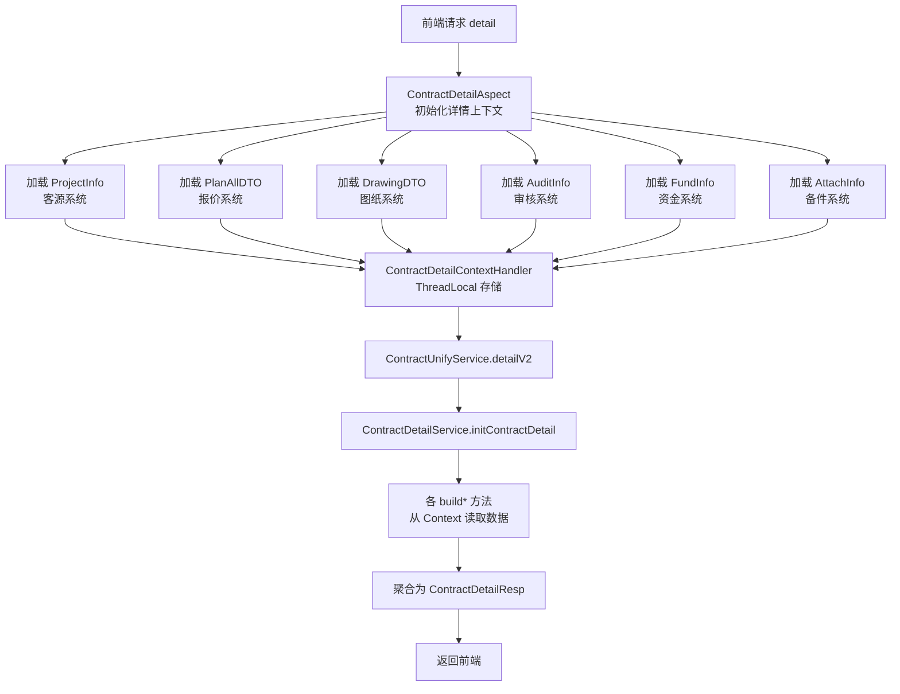

### 11.2 合同提交数据流

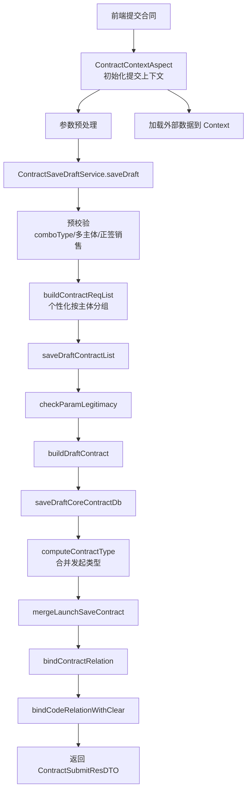

---

## 12. 模块间关系索引

| 相关模块 | 关系说明 | 文档链接 |
|---------|---------|---------|
| ContractContextModule | 为 ContractCore 提供上下文预加载能力 | [ContractContextModule](ContractContextModule.md) |
| ContractChangeStrategy | 变更合同的策略路由，被 ContractCore 调用 | [ContractChangeStrategy](ContractChangeStrategy.md) |
| ContractPdfModule | PDF 生成能力，被 ContractCore 在提交流程中调用 | [ContractPdfModule](ContractPdfModule.md) |
| ContractSigningModule | 个性化合同签约数据源路由，被 ContractSaveDraftService 调用 | [ContractSigningModule](ContractSigningModule.md) |
| ContractMaterialModule | 材料 PDF 差异比对，被合同提交/变更流程调用 | [ContractMaterialModule](ContractMaterialModule.md) |
