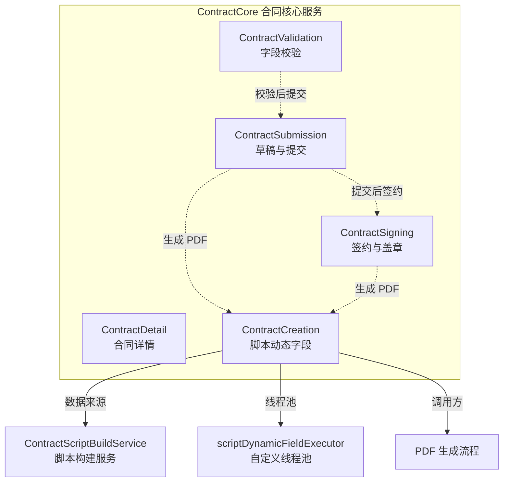
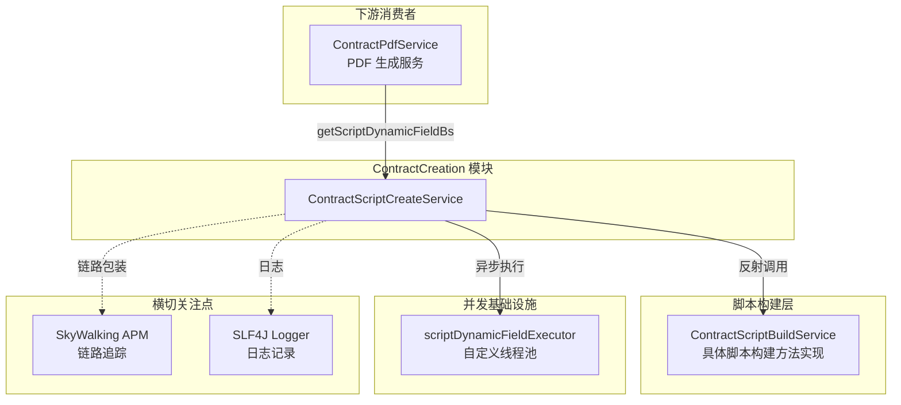
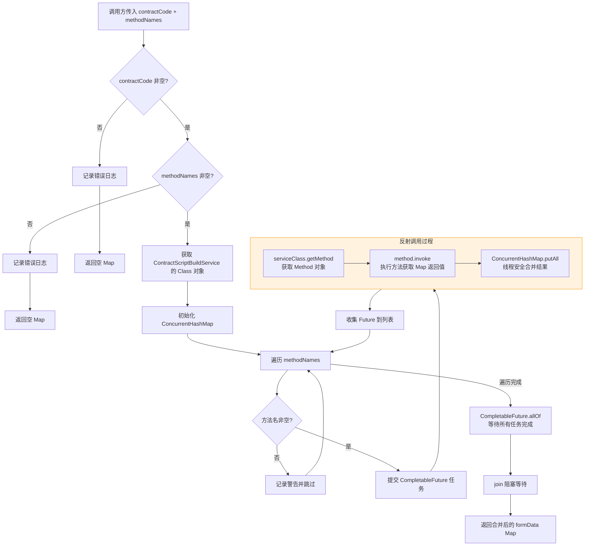
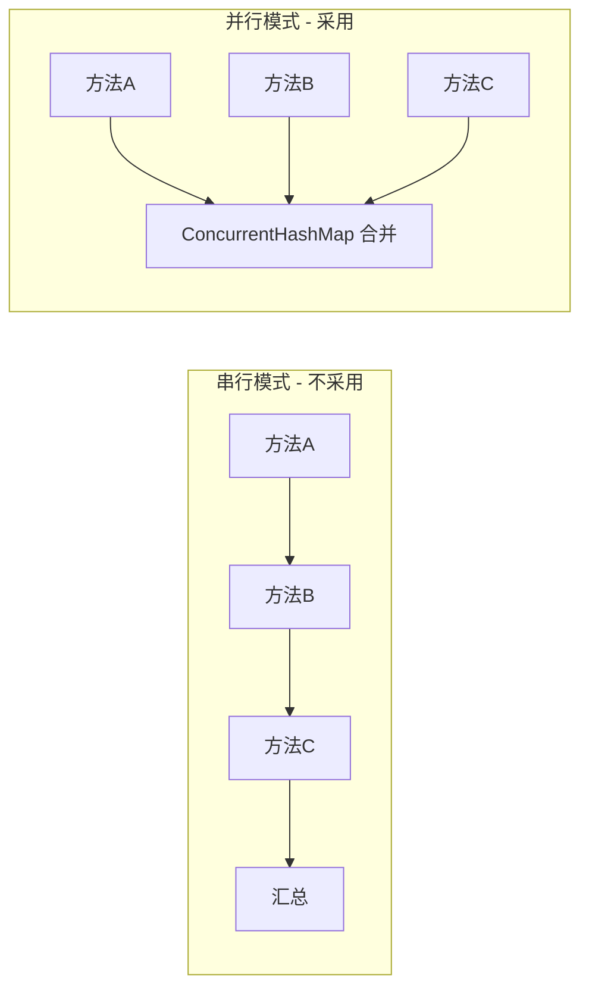
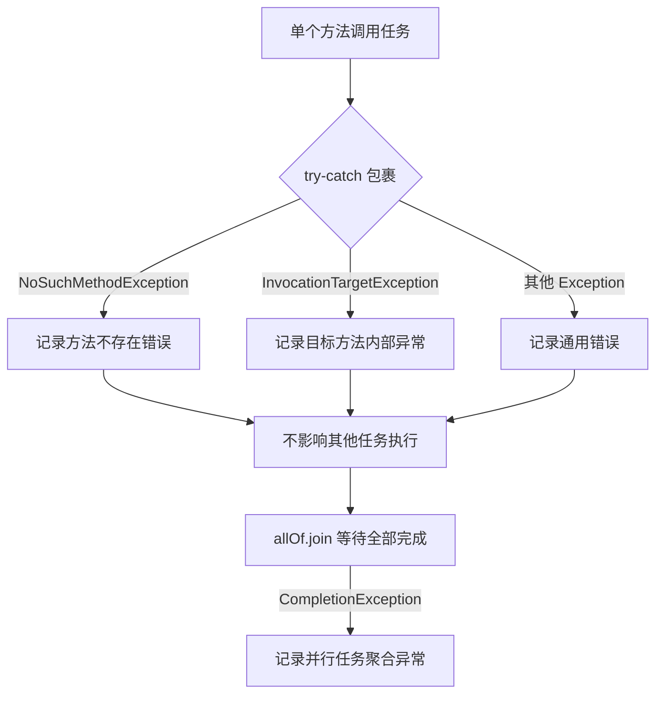
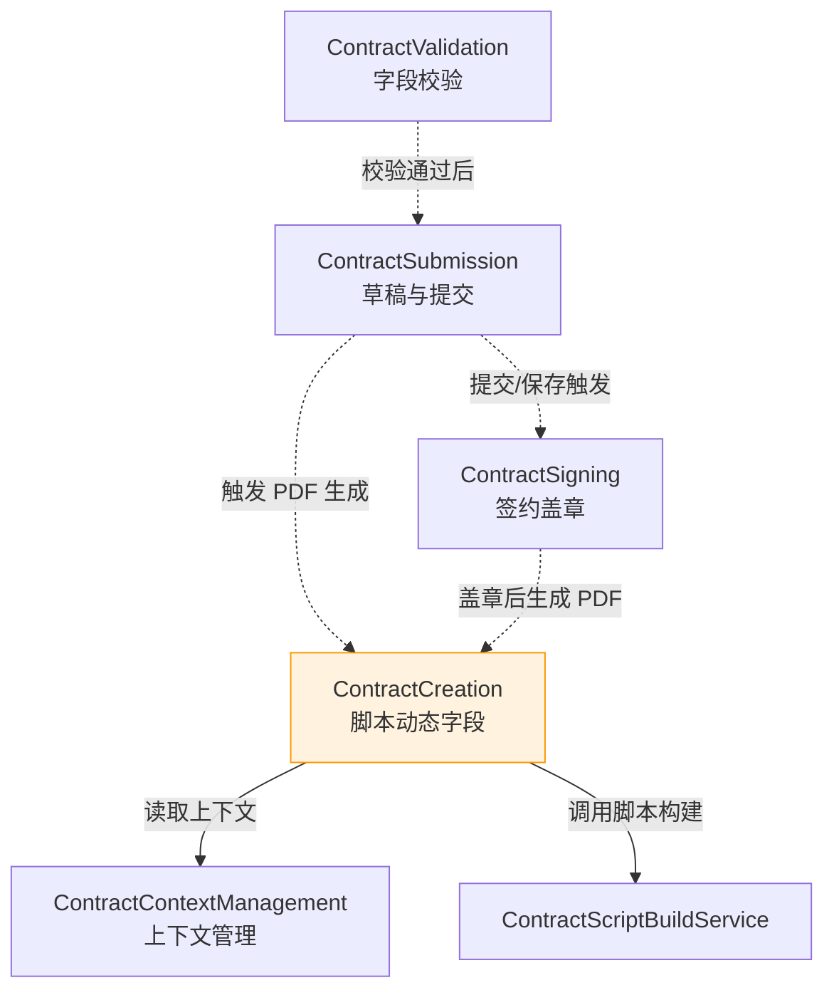

Now I have enough context about the code and the documentation style. Let me generate the complete document.

# ContractCreation 模块文档

## 简介

ContractCreation 是 `ContractCore` 的子模块，负责合同 PDF 生成过程中**脚本动态字段的并行获取**。该模块仅包含一个核心服务：

- **ContractScriptCreateService** — 基于反射 + `CompletableFuture` 并行调用 `ContractScriptBuildService` 上的多个脚本构建方法，将各方法返回的动态字段合并为统一的 `Map<String, Object>`，供下游 PDF 渲染引擎使用。

该服务在合同 PDF 生成流程中被调用，是脚本数据聚合的关键环节。

---

## 模块架构

### 在 ContractCore 中的位置

### 组件依赖总览

---

## 核心组件详解

### ContractScriptCreateService

> 源码路径：`ContractCore/ContractCreation/ContractScriptCreateService.java`

#### 类职责

该服务的核心职责是将 `ContractScriptBuildService` 上多个根据合同编号获取动态字段的方法**并行化调用**，并将结果汇总为一个完整的字段映射。它是合同 PDF 生成流程中脚本数据聚合的入口。

#### 核心方法

| 方法签名 | 说明 |
|---------|------|
| `getScriptDynamicFieldBs(String contractCode, Set<String> methodNames)` | 并行调用指定方法名集合，合并返回动态字段 Map |

#### 执行流程

#### 设计模式分析

**1. 反射派发模式**

与 [ContractValidation](ContractValidation.md) 中的 `ContractFieldCheckService` 类似，本服务采用**反射派发**设计：通过 `Class.getMethod(methodName, String.class)` 动态查找并调用目标方法。这使得调用方只需传入方法名集合，无需硬编码具体的方法调用，实现了脚本字段获取逻辑的**配置化**。

> **⚠️ 命名约束**：`ContractScriptBuildService` 中被调用的方法必须是 `public` 的、签名统一为 `Map methodName(String contractCode)`，否则调用将抛出 `NoSuchMethodException` 或 `ClassCastException`。

**2. 并行聚合模式**

每个方法的调用被封装为 `CompletableFuture.runAsync`，提交到专用线程池 `scriptDynamicFieldExecutor` 执行。结果通过 `ConcurrentHashMap.putAll` 线程安全地合并，最终通过 `CompletableFuture.allOf(...).join()` 阻塞等待所有任务完成。

**3. 异常隔离策略**

每个方法调用都有独立的 try-catch 包裹，单个方法的失败不会阻断其他方法的执行。异常被细分为三种类型分别记录：

| 异常类型 | 含义 | 处理方式 |
|---------|------|---------|
| `NoSuchMethodException` | `ContractScriptBuildService` 中不存在该方法名 | 记录错误日志，跳过 |
| `InvocationTargetException` | 方法存在但执行时内部抛出异常 | 提取原始异常信息记录，跳过 |
| `Exception` | 其他意外异常（如权限等） | 记录通用错误日志，跳过 |

外层还有 `CompletionException` 的 catch，处理 `allOf.join()` 阶段的聚合异常。

#### 链路追踪

使用 `org.apache.skywalking.apm.toolkit.trace.RunnableWrapper.of()` 包装每个异步任务，确保 SkyWalking 的 TraceId 在子线程中正确传播，实现跨线程的分布式链路追踪。

---

## 依赖关系

### 直接依赖

| 依赖 | 类型 | 用途 |
|------|------|------|
| `ContractScriptBuildService` | 业务服务 | 提供具体的脚本动态字段构建方法（如各类报价字段、设计费字段等） |
| `scriptDynamicFieldExecutor` | 线程池 Bean | 专用的异步执行线程池，隔离 PDF 脚本生成的并发资源 |
| SkyWalking `RunnableWrapper` | APM 工具 | 跨线程链路追踪传播 |
| SLF4J | 日志框架 | 结构化日志记录 |

### 被依赖方

| 调用方 | 调用场景 |
|--------|---------|
| PDF 生成服务（如 [TerminalContractPdf](TerminalContractPdf.md)） | 在构建合同 PDF 时，传入需要的方法名集合，获取脚本渲染所需的动态数据 |

### 与其他 ContractCore 子模块的关系

ContractCreation 模块在合同业务流程中处于**中后段**：在合同数据校验（ContractValidation）、草稿保存（ContractSubmission）、签约（ContractSigning）之后，为 PDF 生成提供动态数据聚合能力。它依赖 [ContractContextManagement](ContractContextManagement.md) 提供的线程级上下文获取项目信息等基础数据。

---

## 关键设计决策

### 为什么使用反射而非直接调用？

`ContractScriptBuildService` 可能包含数十个不同类型的脚本构建方法（报价明细、设计费、施工范围等）。使用反射派发的优势：

1. **配置驱动**：方法名集合可通过配置（如 Apollo）动态调整，无需修改调用代码
2. **开闭原则**：新增脚本方法只需在 `ContractScriptBuildService` 中添加方法，调用方无需改动
3. **灵活组合**：不同合同类型/场景可传入不同的方法名集合，实现按需获取

### 为什么使用专用线程池？

通过 `@Resource(name = "scriptDynamicFieldExecutor")` 注入独立线程池，而非使用 `ForkJoinPool.commonPool()` 或默认线程池：

1. **资源隔离**：避免 PDF 脚本生成的大量并行任务影响其他业务的线程资源
2. **容量可控**：线程池参数（核心线程数、最大线程数、队列容量）可独立调优
3. **监控友好**：便于通过线程池指标监控 PDF 生成的并发压力

### 为什么选择 ConcurrentHashMap？

多个子线程并发写入结果 Map，使用 `ConcurrentHashMap` 保证线程安全性。初始容量设为 16，适合脚本动态字段的典型规模。注意 `putAll` 在并发场景下存在**覆盖风险**——如果两个方法返回了相同 key，后写入的值会覆盖先写入的值，这要求各脚本方法返回的 key 互不冲突。