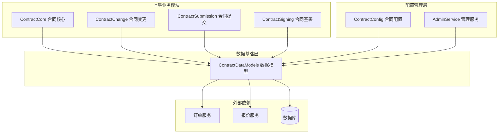
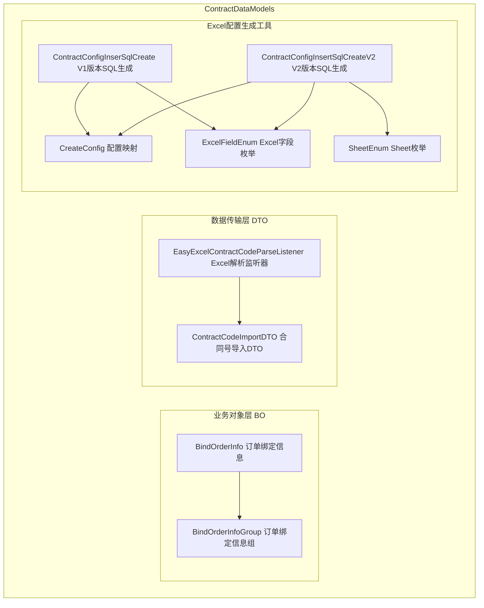
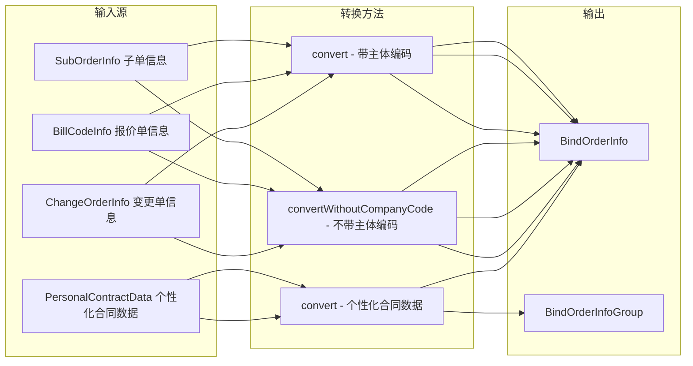
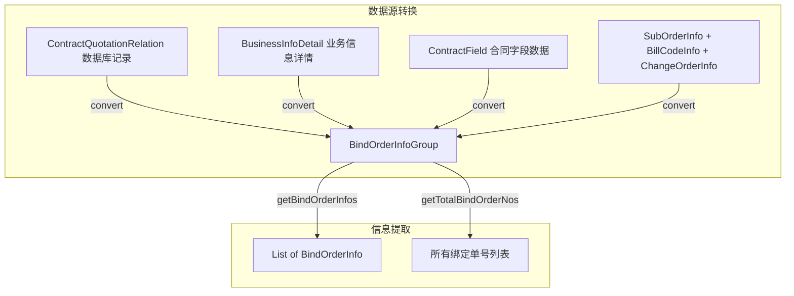
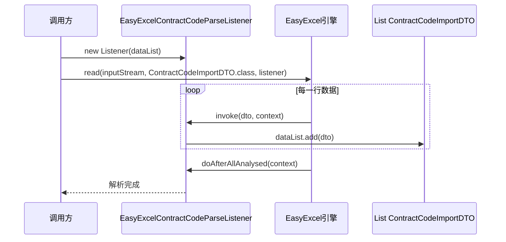
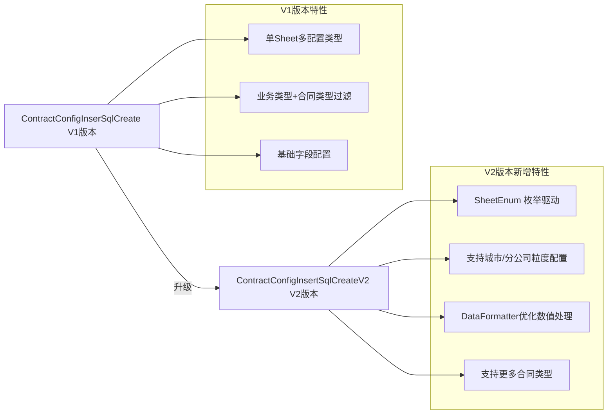
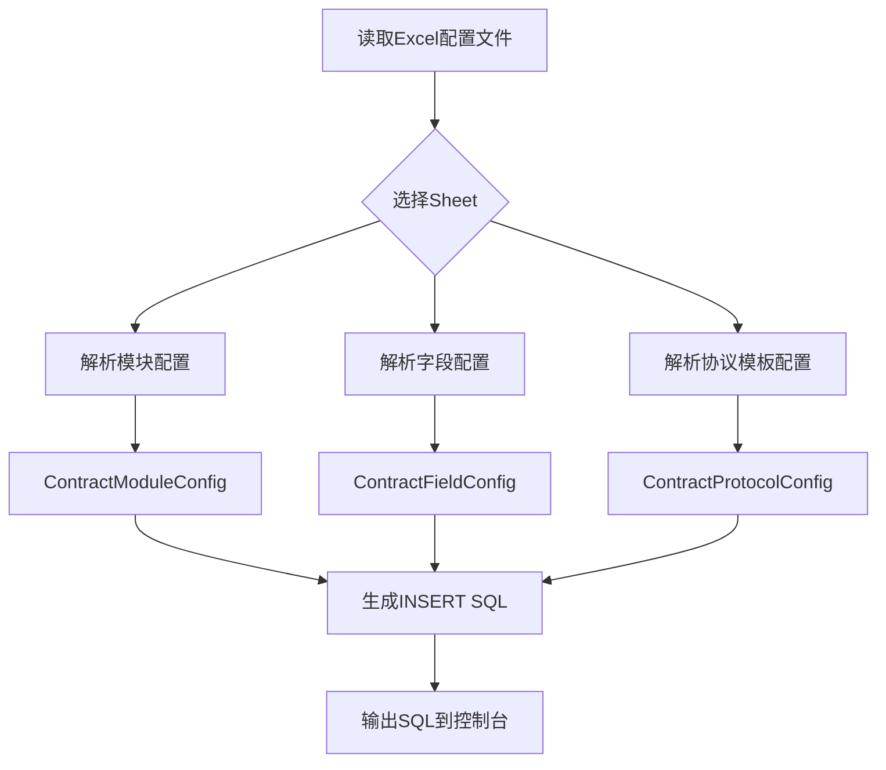
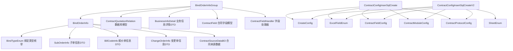
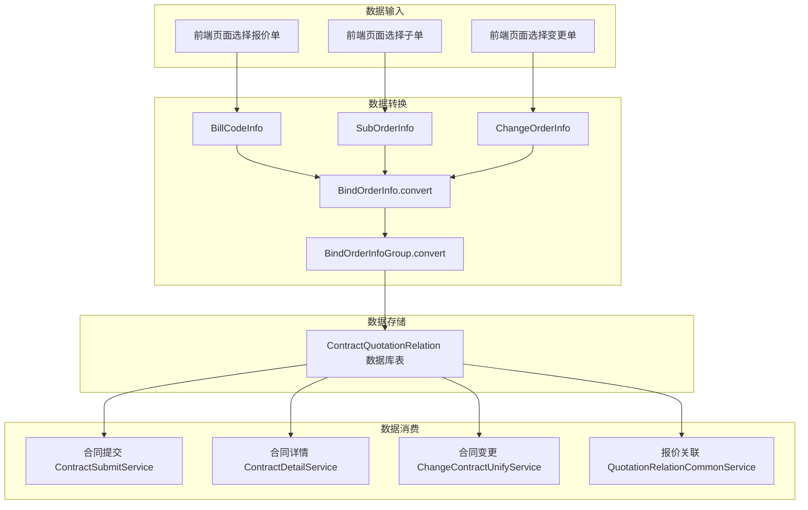
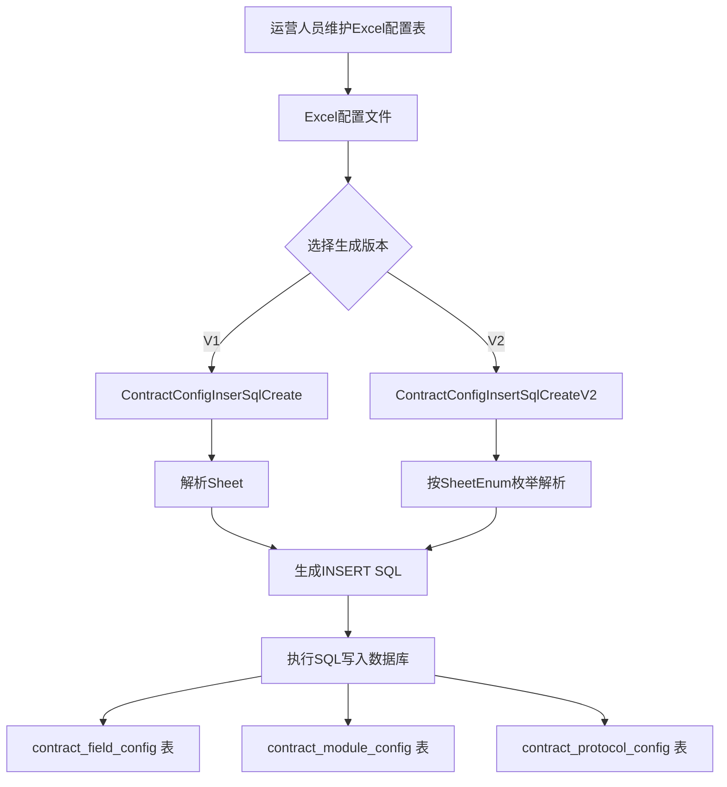

# ContractDataModels 模块文档

## 1. 模块概述

ContractDataModels 是合同系统中负责**数据模型定义与配置数据生成**的基础模块。该模块不直接参与合同业务流程的运行时逻辑，而是为整个合同系统提供：

- **业务对象（BO）**：定义合同与订单绑定关系的核心数据结构
- **数据传输对象（DTO）**：合同号 Excel 导入的解析监听器
- **Excel 配置读取工具**：从 Excel 文件生成合同字段配置、模块配置、协议模板配置的 SQL 插入语句

本模块是合同系统的数据基础层，为 [ContractCore](ContractCore.md)、[ContractConfig](ContractConfig.md)、[ContractSubmission](ContractSubmission.md) 等上层模块提供核心数据结构支撑。

---

## 2. 模块在系统中的位置

---

## 3. 核心组件架构

---

## 4. 核心组件详解

### 4.1 BindOrderInfo — 订单绑定信息

`BindOrderInfo` 是合同与各类订单（报价单、子单、变更单）绑定关系的核心数据模型。合同系统通过该对象统一管理不同类型的订单绑定。

#### 字段定义

| 字段 | 类型 | 说明 |
|------|------|------|
| `projectOrderId` | String | 主单号（项目工单号） |
| `bindOrderNosWithCompany` | Set&lt;String&gt; | 要绑定的单据号 + 主体编码，格式为 `单据号_主体编码` |
| `bindOrderNoList` | List&lt;String&gt; | 要绑定的单据号列表 |
| `bindType` | Integer | 绑定类型，对应 [BindTypeEnum](../enums/contract/BindTypeEnum.md) |

#### 绑定类型

| 类型 | 枚举值 | 说明 |
|------|--------|------|
| BILL_CODE | 报价单 | 合同与基础报价单绑定 |
| SUB_ORDER | 子单（S单） | 合同与子单绑定 |
| CHANGE_ORDER | 变更单 | 合同与变更单绑定 |

#### 核心转换方法

`BindOrderInfo` 提供了多个静态工厂方法，将不同来源的订单数据统一转换为绑定信息：

**优先级规则**：当多种订单类型同时存在时，`convert` 方法按以下优先级选择绑定类型：

1. **子单（S单）**优先级最高
2. **变更单**次之
3. **报价单**最低

> **注意**：在正签合同的 detail/submit 流程中，可能同时存在基础报价单 + S单两种类型，此时需要调用 `BindOrderInfoGroup.convert()` 方法进行分组转换。

#### 信息提取方法

| 方法 | 返回类型 | 说明 |
|------|----------|------|
| `getBillCodeInfoList()` | List&lt;BillCodeInfo&gt; | 提取报价单信息，仅在 bindType 为 BILL_CODE 时返回数据 |
| `getSubOrderInfoList()` | List&lt;SubOrderInfo&gt; | 提取子单信息，仅在 bindType 为 SUB_ORDER 时返回数据 |
| `getChangeOrderInfoList()` | List&lt;ChangeOrderInfo&gt; | 提取变更单信息，仅在 bindType 为 CHANGE_ORDER 时返回数据 |
| `getChangeOrderId()` | String | 获取变更单号，要求 bindOrderNoList 有且仅有一个元素 |

---

### 4.2 BindOrderInfoGroup — 订单绑定信息组

`BindOrderInfoGroup` 是 `BindOrderInfo` 的上层容器，用于处理**同一项目工单下多种绑定类型并存**的复杂场景。

#### 字段定义

| 字段 | 类型 | 说明 |
|------|------|------|
| `projectOrderId` | String | 主单号 |
| `billCodeInfos` | List&lt;BillCodeInfo&gt; | 报价单信息列表 |
| `subOrderInfos` | List&lt;SubOrderInfo&gt; | 子单信息列表 |
| `changeOrderInfos` | List&lt;ChangeOrderInfo&gt; | 变更单信息列表 |

#### 核心能力

**`getBindOrderInfos()` 方法**：将 Group 拆分为按绑定类型分组的 `BindOrderInfo` 列表，每种绑定类型生成一个独立的 `BindOrderInfo` 对象，过滤掉未使用的类型（bindType != -1）。

**`getTotalBindOrderNos()` 方法**：聚合所有类型的绑定单号为一个扁平列表。

#### 从数据库记录恢复

`convert(projectOrderId, List<ContractQuotationRelation>)` 方法从数据库中的 `ContractQuotationRelation` 记录恢复 `BindOrderInfoGroup`，根据 `bindType` 字段将记录分流到对应的列表中。当关系记录为空时返回空对象。

#### 从合同字段恢复

`convert(projectOrderId, ContractField, ContractField, ContractField)` 方法从合同字段表中解析出子单、报价单、变更单信息，利用 `ContractFieldHandler.parseFieldToList()` 进行反序列化。

---

### 4.3 EasyExcelContractCodeParseListener — Excel 解析监听器

基于 Alibaba EasyExcel 框架的合同号 Excel 导入监听器，用于批量导入合同编号。

**设计特点**：
- 采用事件驱动模式，逐行解析 Excel 数据
- 解析结果直接收集到外部传入的 `dataList` 中，避免内部状态管理
- 适用于合同号批量导入、合同数据迁移等场景

---

### 4.4 Excel 配置 SQL 生成工具

该子模块用于从 Excel 配置文件自动生成数据库 INSERT 语句，支持合同字段配置、模块配置、协议模板配置三类表的数据初始化。

#### 4.4.1 版本演进

#### 4.4.2 配置生成流程

#### 4.4.3 生成的数据库表

| 目标表 | 说明 | 关键字段 |
|--------|------|----------|
| `contract_field_config` | 合同字段配置表 | business_type, contract_type, module_key, field_key, field_name |
| `contract_module_config` | 合同模块配置表 | business_type, contract_type, module_key, module_name, step |
| `contract_protocol_config` | 协议平台模板字段配置表 | form_id, form_key, form_field_key, deal_function |

#### 4.4.4 SheetEnum — 配置表 Sheet 枚举

定义了 Excel 文件中各个 Sheet 的映射关系，每个 Sheet 对应一种合同类型和业务类型的组合：

| Sheet 枚举 | 合同类型 | 业务类型 |
|------------|----------|----------|
| 认购_整装 | 认购(1) | 整装(1) |
| 认购_局装 | 认购(1) | 局装(3) |
| 设计_整装 | 设计(2) | 整装(1) |
| 设计_局装 | 设计(2) | 局装(3) |
| 变更_局装 | 变更(4) | 局装(3) |
| 整装_2_5 | 正签(3) | 整装(1) |
| 施工图纸 | 图纸(7) | 整装(1) |
| 首期款_整装 | 首期款(6) | 整装(1) |
| 设计变更_整装_2_5 | 设计变更(11) | 整装(1) |
| 设计变更_局装 | 设计变更(11) | 局装(3) |
| 设计变更_整装 | 设计变更(11) | 整装(1) |

#### 4.4.5 CreateConfig — 配置映射

提供业务类型和合同类型字节值到中文描述的映射：

- **业务类型**：1=整装, 2=团装, 3=局装
- **合同类型**：1=认购, 2=设计, 3=正签, 4=变更

---

## 5. 依赖关系

### 5.1 内部依赖

### 5.2 外部依赖

| 依赖项 | 来源 | 用途 |
|--------|------|------|
| Alibaba EasyExcel | `com.alibaba.excel` | Excel 文件解析 |
| Apache POI | `org.apache.poi` | Excel 文件读取（配置生成工具） |
| FastJSON | `com.alibaba.fastjson` | JSON 序列化 |
| Hutool | `cn.hutool.core.collection` | 集合工具类 |
| Apache Commons Lang | `org.apache.commons.lang3` | 字符串工具 |
| Apache Commons Collections | `org.apache.commons.collections4` | 集合工具 |
| Lombok | `lombok` | 代码生成 |
| Slf4j | `lombok.extern.slf4j` | 日志 |

---

## 6. 数据流

### 6.1 订单绑定数据流

### 6.2 Excel 配置生成数据流

---

## 7. 关键设计模式

### 7.1 优先级策略模式（BindOrderInfo.convert）

`BindOrderInfo.convert()` 方法实现了隐式的优先级策略：当多种订单类型同时存在时，按 S单 > 变更单 > 报价单 的优先级选择绑定类型。这是一种简化的策略选择，确保每份合同在同一维度上只绑定一种类型的主订单。

### 7.2 空对象模式（BindOrderInfoGroup.EMPTY）

`BindOrderInfoGroup` 定义了静态的 `EMPTY` 对象，当数据库中无绑定记录时返回该对象而非 null，避免上层调用方的空指针检查。

### 7.3 工厂方法模式

`BindOrderInfo` 和 `BindOrderInfoGroup` 均通过静态工厂方法（`convert`）创建实例，封装了复杂的构建逻辑。不同入参类型的重载方法覆盖了多种业务场景。

### 7.4 枚举驱动配置（SheetEnum）

V2 版本的 SQL 生成工具采用枚举驱动方式，将 Excel Sheet 索引、合同类型、业务类型统一管理在 `SheetEnum` 枚举中，新增合同类型时只需添加枚举常量即可，无需修改生成逻辑。

### 7.5 合并单元格处理

Excel 配置读取工具专门处理了合并单元格的场景（`cellIsMerged` / `getMergedCellValue`），确保从合并区域中正确读取值，这在实际的配置 Excel 表中非常常见。

---

## 8. 与其他模块的关系

| 相关模块 | 关系说明 |
|----------|----------|
| [ContractCore](ContractCore.md) | `BindOrderInfo` / `BindOrderInfoGroup` 被 `QuotationRelationCommonService`、`ContractUnifyService` 等核心服务广泛使用，用于管理合同与订单的绑定关系 |
| [ContractConfig](ContractConfig.md) | Excel 配置生成工具产出的 SQL 直接写入 `contract_field_config`、`contract_module_config` 等配置表，供 `ContractConfigService` 在运行时读取 |
| [ContractSubmission](ContractSubmission.md) | 合同提交时通过 `BindOrderInfo` 确定要绑定的订单类型和单据号，`ContractSubmitService.bindContractRelation()` 使用绑定信息建立关联 |
| [ContractChange](ContractChange.md) | 变更合同场景中，`BindOrderInfo` 用于标识变更单绑定关系，`ChangeContractUnifyService` 依赖该数据结构处理变更流程 |
| [ContractPresentation](ContractPresentation.md) | 合同展示层通过 `BindOrderInfoGroup` 获取绑定的报价单/子单/变更单信息，用于构建合同详情页的业务信息区域 |
