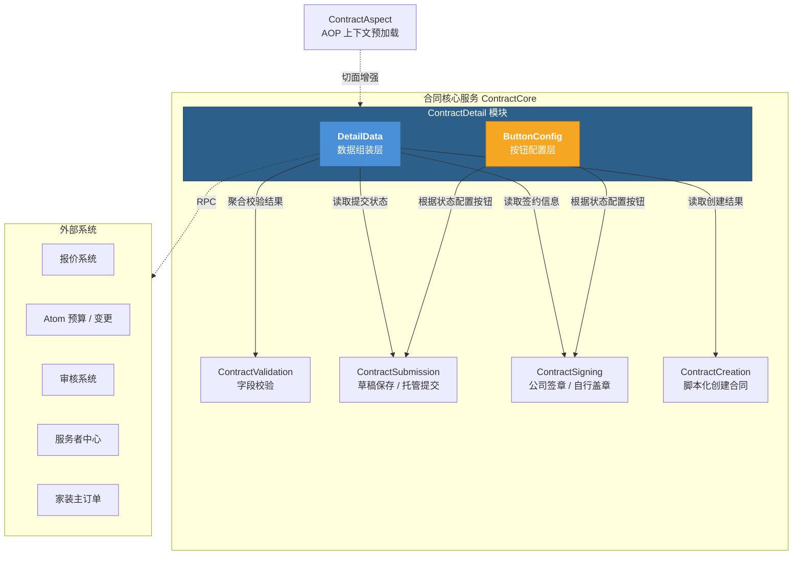
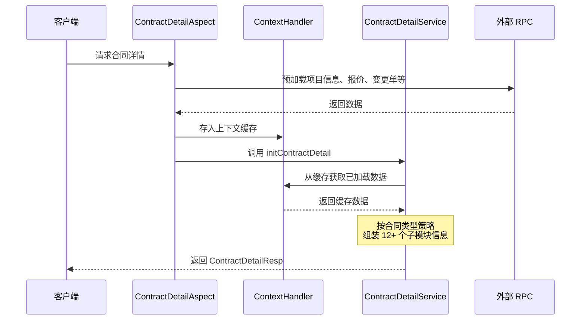
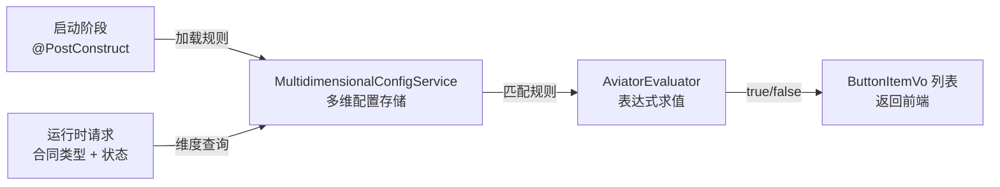
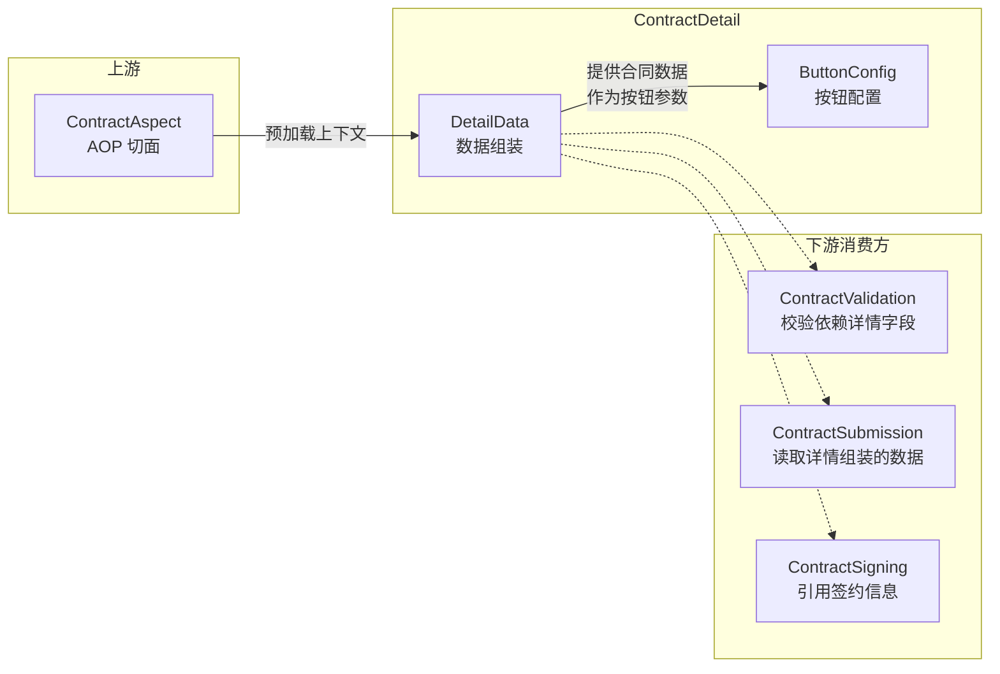

# ContractDetail 模块概览

## 1. 模块目的

**ContractDetail** 是合同管理系统（ContractCore）的详情展示模块，负责**合同详情页面的数据组装与操作按钮配置**。它是用户进入合同详情页时的核心入口，将合同的项目信息、签约信息、报价信息、附件信息、审核流程等十余个子模块的数据聚合为统一的详情视图，并根据合同类型和状态动态配置页面操作按钮。

模块承担两个核心职责：
- **数据组装**（DetailData）：从多个内部服务和外部 RPC 系统聚合合同全量数据，支持首屏优化的分步加载策略
- **按钮配置**（ButtonConfig）：基于 Aviator 规则引擎，以声明式配置控制合同详情页和列表页的按钮可见性

---

## 2. 模块架构

---

## 3. 子模块说明

### 3.1 DetailData — 数据组装层

> 📄 完整文档：[DetailData.md](./DetailData.md)

DetailData 是合同详情的核心数据组装层，包含两个服务：

| 服务 | 职责 |
|------|------|
| `ContractDetailService` | 合同详情全量数据初始化：组装项目信息、签约信息、报价信息、附件信息、流程信息、金额信息等 12+ 个子模块 |
| `ContractHomeOrderNoChangeService` | 家装主订单号变更场景下的合同数据迁移与回滚 |

**关键设计**：
- **首屏优化**：通过 `ContractDetailContextHandler.isFirstScreen()` 标记，首屏仅加载 4 个核心对象（signInfo、contractBaseInfo、businessInfo、projectInfo），其余延迟加载
- **上下文缓存**：`ContractDetailContextHandler` 在请求生命周期内缓存外部 RPC 数据，避免子模块构建时的重复调用
- **策略分支**：根据合同类型（正签/个性化/首期款/设计/终止等）采用不同的数据组装策略

### 3.2 ButtonConfig — 按钮配置层

> 📄 完整文档：[ButtonConfig.md](./ButtonConfig.md)

ButtonConfig 基于 **Aviator 表达式引擎 + 多维配置服务** 的规则引擎模式，动态控制合同页面的按钮可见性。

| 查询接口 | 适用端 | 覆盖按钮 |
|---------|-------|---------|
| `getHomeContractListButton()` | 移动端列表 | 预览分享、编辑、撤销修改、申请用章、审核详情、删除、查看、去重签、去变更 |
| `getPcContractListButton()` | PC 端列表 | 去创建、查看、编辑、撤销修改、审核详情、预览合同、申请用章、去变更、分享合同、删除、去重签 |
| `getPreviewButtonList()` | 合同预览页 | 预览页操作按钮 |

**关键设计**：
- **声明式规则**：按钮可见性以 Aviator 表达式定义，无需硬编码 if/else
- **两级优先级**：通用规则（priority=10, contractType=*）→ 专属规则（priority=100, contractType=具体类型）
- **自定义函数扩展**：复杂业务逻辑封装为 `ContractFunction`（如 `showUndoButton`、`showReSignButton`）

---

## 4. 子模块关系

**核心数据流**：`ContractAspect` 通过 AOP 切面在请求入口预加载外部数据到上下文 → `DetailData` 从上下文组装合同全量数据 → `ButtonConfig` 基于合同状态/类型配置操作按钮 → 前端渲染详情页。

---

## 5. 关键类索引

| 类 | 所属子模块 | 核心职责 |
|---|----------|---------|
| `ContractDetailService` | DetailData | 合同详情全量数据初始化与组装 |
| `ContractHomeOrderNoChangeService` | DetailData | 主订单号变更的数据迁移与回滚 |
| `ContractButtonConfigService` | ButtonConfig | 按钮可见性规则引擎查询 |
| `ContractDetailContextHandler` | — | 线程级上下文缓存，存放预加载的 RPC 数据 |
| `ContractDetailAspect` | — | AOP 切面，在详情请求前触发上下文预加载 |