# ContractEvents 模块文档

## 模块概述

ContractEvents 是合同系统的**事件驱动中枢**，负责通过 Kafka 消息队列实现合同生命周期中各关键节点的异步事件处理。该模块包含三类核心组件：

1. **事件生产者** (`ContractEventProducer`)：将合同业务事件持久化发送至 Kafka 主题
2. **事件监听器** (`kafka/listener/`)：30+ 个监听器分别处理合同提交、签署、盖章、确认、取消、变更等生命周期事件
3. **定时任务** (`schedule/`)：处理 BPM 审批补偿、异步盖章超时检测、数据一致性校验、隐私访问预警等运维保障任务

模块采用**发布-订阅模式**，通过 `@EventType` 注解将监听器绑定到特定事件类型，利用 `CompletableFuture.runAsync` 实现异步非阻塞处理，配合 `@Retryable` 和分布式锁保障关键操作的最终一致性。

---

## 模块架构

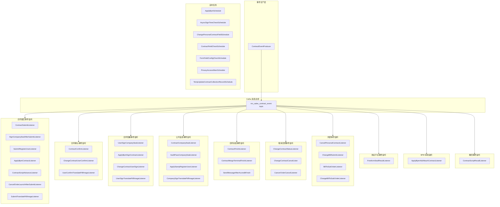

---

## 事件类型与监听器映射

模块定义的核心事件类型（`EventType`）及其对应的监听器如下：

| 事件类型 | 说明 | 监听器 |
|---------|------|--------|
| `CONTRACT_SUBMIT` | 合同发起 | ContractSubmitListener, SignCompanySealAfterSubmitListener, SubmitRegisterUserListener, ApplyBpmContractListener, ContractScriptAdvanceListener, CancelOrderLaunchAfterSubmitListener, SubmitTranslatePdfImageListener |
| `CONTRACT_USER_CONFIRM` | 用户确认合同 | ContractConfirmListener, ChangeContractUserConfirmListener, UserConfirmTranslatePdfImageListener |
| `CONTRACT_USER_SIGN` | 用户签署合同 | UserSignCompanySealListener, ApplyBpmSignContractListener, ChangeContractUserSignListener, UserSignTranslatePdfImageListener |
| `CONTRACT_COMPANY_SIGN` | 公司盖章完成 | ContractCompanySealListener, AuditPassCompanySealListener, ApplyStampRegisterUserListener, CompanySignTranslatePdfImageListener |
| `CONTRACT_FINISH` | 合同签署完结 | ContractFinishListener, SendMessageAfterAccreditFinish |
| `CONTRACT_APPLY_SEAL` | 申请盖章 | ApplyStampRegisterUserListener |
| `CONTRACT_AUDIT_PASS` | 审核通过 | AuditPassCompanySealListener |
| `CONTRACT_ATTACH_COMPLETE` | 备件补齐完成 | ApplyBpmAddAttachContractListener |
| `CONTRACT_RECALL` | 合同撤回 | ContractScriptRecallListener |
| `TERMINAL_CONTRACT_FINISH` | 解约协议签署完结 | ContractMergeTerminalFinishListener |
| `CHANGE_ORDER_NODE_EVENT` | 变更单节点事件 | ChangeContractStatusListener, ChangeContractCancelLister |
| `CANCEL_ORDER_STATUS_CHANGE` | 退单状态变更 | CancerOrderCancelListener |
| `freeform-contract-seal-result` | 协议平台盖章结果回调 | FreeformSealResultListener |
| `utopia-athena-domain-entity-bizType` | 外部域实体事件 | CancelPersonalContractListener, ChangeBillSubmitListener |
| `QUOTATION_CREATE_ORDER` | 报价单创建订单 | BillToSubOrderListener |
| `QUOTATION_CHANGE_CREATE_ORDER` | 变更单创建订单 | ChangeBillToSubOrderListener |

---

## 事件生命周期流转

### 合同完整生命周期事件链

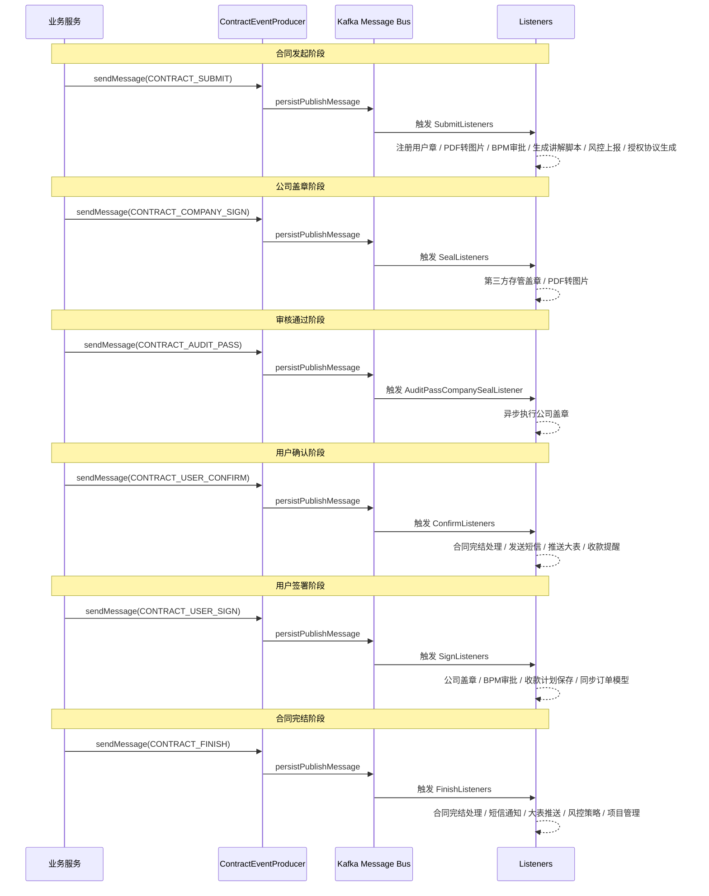

### 变更合同事件流转

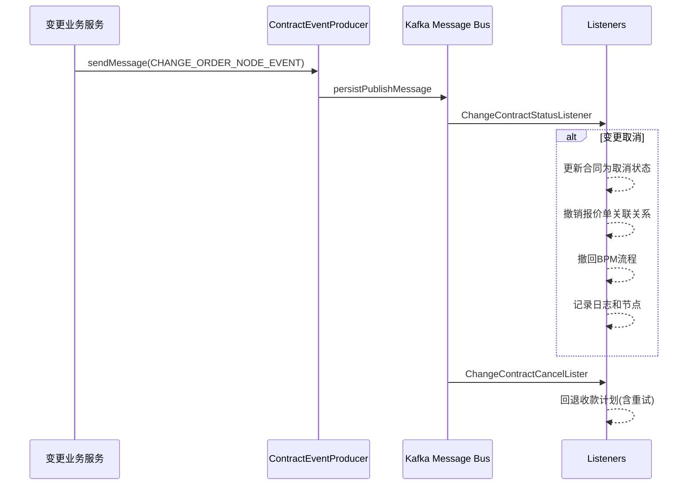

---

## 事件生产者详解

### ContractEventProducer

事件生产者是所有合同事件的统一发送入口，基于 `EventDrivenPublisher` 实现持久化消息发布。

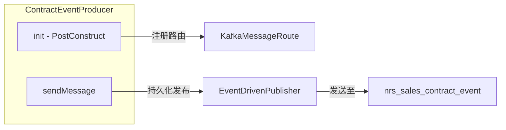

**关键设计点：**
- 通过 `@PostConstruct` 在应用启动时注册 bizType 到 KafkaTopic 的路由映射
- 使用 `persistPublishMessage` 而非 `publish`，确保消息持久化到数据库后再发送，防止消息丢失
- 统一的 `ContractEvent` 消息体包含 `contractCode`、`projectOrderId`、`type`、`signChannelType`、`createUserId` 等关键字段

**ContractEvent 数据结构：**

| 字段 | 类型 | 说明 |
|------|------|------|
| `contractCode` | String | 合同编码，核心关联键 |
| `projectOrderId` | String | 项目订单号 |
| `type` | Byte | 合同类型 |
| `signChannelType` | Byte | 签署渠道（线上/线下） |
| `createUserId` | String | 创建人用户ID |
| `triggerTime` | Date | 触发时间 |
| `extendInfo` | ContractExtendInfo | 扩展信息 |

---

## 监听器分类详解

### 一、合同提交事件监听器组

该组监听器在 `CONTRACT_SUBMIT` 事件触发后**并发执行**，各自处理独立的后续业务逻辑。

#### ContractSubmitListener

合同提交后的核心业务处理器，承载最多并行任务：

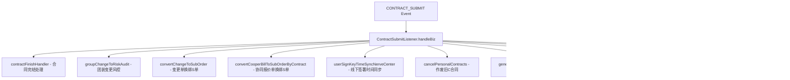

**核心逻辑：**
- 所有子任务通过 `CompletableFuture.runAsync(RunnableWrapper.of(...))` 并发执行，`RunnableWrapper` 提供 SkyWalking 链路追踪
- 对于销售合同（`PERSONAL` 类型），会作废同项目下的其他未完成合同
- 线下签署场景会同步签署时间到订单中枢

#### SignCompanySealAfterSubmitListener

合同提交后触发公司盖章，采用 `@Retryable` 重试机制：

- 校验合同状态为 `PENDING_COMPANY_SIGN`
- 根据配置选择同步盖章 (`companySealSync`) 或异步盖章 (`companySealAsync`)
- 最大重试 3 次，间隔 30 秒

#### SubmitRegisterUserListener / ApplyStampRegisterUserListener

提前注册用户印章，优化后续签署体验：

- 校验 `contractCode` 非空后直接调用 `registerSignUser`

#### ContractScriptAdvanceListener

合同提交后异步生成 AI 讲解脚本：

- 调用 `ContractAgentService.generateContractScript`
- 异常仅记录日志，不影响主流程

#### CancelOrderLaunchAfterSubmitListener

解约协议合同发起后触发退单流程：

- 校验合同类型为 `TERMINAL`（解约协议）
- 校验退单版本不为 V1
- 校验退单状态为 `AWAIT_SIGN_LAUNCH`
- 检查是否为合并发起方式（有关联关系则跳过）
- 更新退单状态并发起退单流程

### 二、合同确认事件监听器组

#### ContractConfirmListener

合同确认/签署后触发的综合处理监听器：

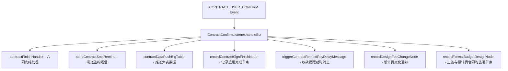

#### ChangeContractUserConfirmListener

变更合同用户确认后保存收款计划：

- 仅处理 `PACKAGE_CHANGE` 类型合同
- 从 `ContractCollectionPlanRecord` 获取收款计划快照
- 通过 `@Retryable(maxAttempts=4)` 调用 `FundBaseService.saveCollectionPlan`
- 收款金额基于 Athena 平台查询的 `contractPriceTotal`

### 三、合同签署事件监听器组

#### UserSignCompanySealListener

用户签署完成后触发公司盖章：

- 校验合同状态为 `PENDING_COMPANY_SIGN`
- 异步调用 `contractBusinessService.companySeal`
- 异常不抛出，由定时任务兜底

#### ChangeContractUserSignListener

变更合同用户签署处理：

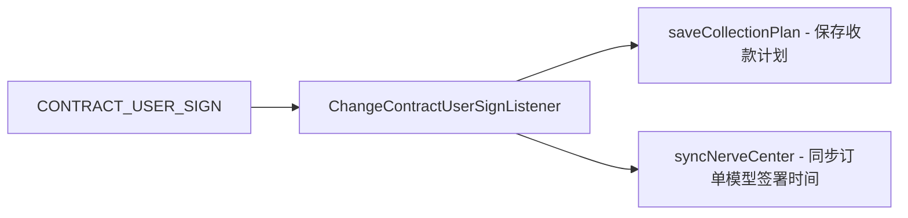

- 同时处理收款计划保存和签署时间同步两个独立任务

### 四、公司盖章事件监听器组

#### ContractCompanySealListener

监听公司盖章完成消息，触发第三方存管盖章：

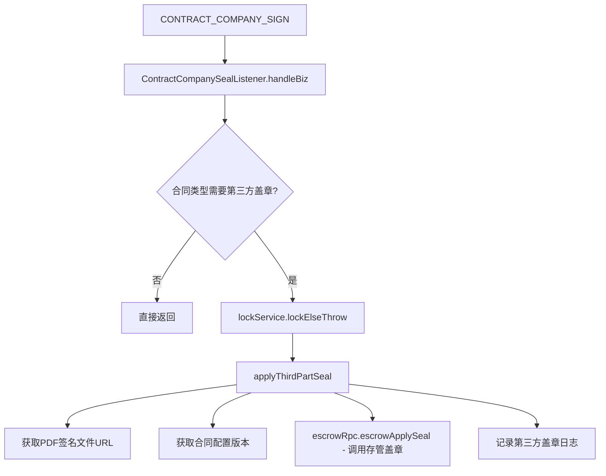

- 使用分布式锁防止并发盖章
- 盖章失败仅记录日志，不阻断流程

#### AuditPassCompanySealListener

审核通过后触发公司盖章：

- 校验合同状态为 `PENDING_COMPANY_SIGN`
- 通过 `CompletableFuture.runAsync` 异步执行，避免事件驱动事务超时

#### FreeformSealResultListener

监听协议平台（FreeForm）盖章结果回调：

- 通过 `instanceId` 查询关联合同
- 获取 Redis 中的异步盖章记录，记录回调时间间隔
- 使用分布式锁保证更新幂等性
- 调用 `updateCompanySealResult` 更新盖章结果到数据库

### 五、合同完结事件监听器组

#### ContractFinishListener

合同签署完成后的最全面处理器：

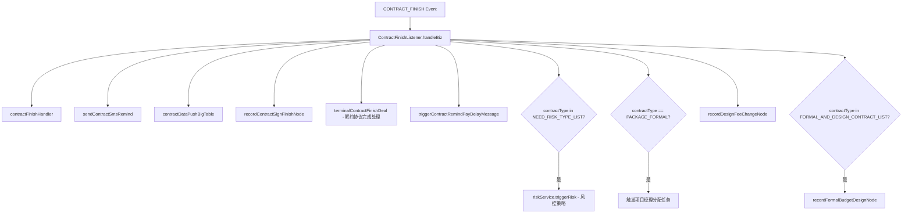

**与 ContractConfirmListener 的区别：**
- `ContractFinishListener` 在合同最终完结时触发，额外处理风控策略、项目经理分配任务、解约协议完结等
- `ContractConfirmListener` 在用户确认阶段触发，侧重通知和收款提醒

#### ContractMergeTerminalFinishListener

合并发起模式下解约协议签署完成：

- 校验项目订单下首期款或正签合同已签署完成
- 校验业务类型为团装 (`GROUP_DECORATE`)
- 异步触发 `homeOrderTerminal` 切换项目类型

#### SendMessageAfterAccreditFinish

法人授权协议书签署完成后发送短信：

- 校验合同类型为 `ACCCREDIT`（授权协议）
- 获取关联合同的签约人手机号
- 构建短信内容（合同名称 + 加密地址 + 小程序短链）
- 通过 `PayServiceRpc` 发送短信提醒

### 六、取消/变更事件监听器组

#### ChangeContractStatusListener

变更单状态变更（取消变更）处理：

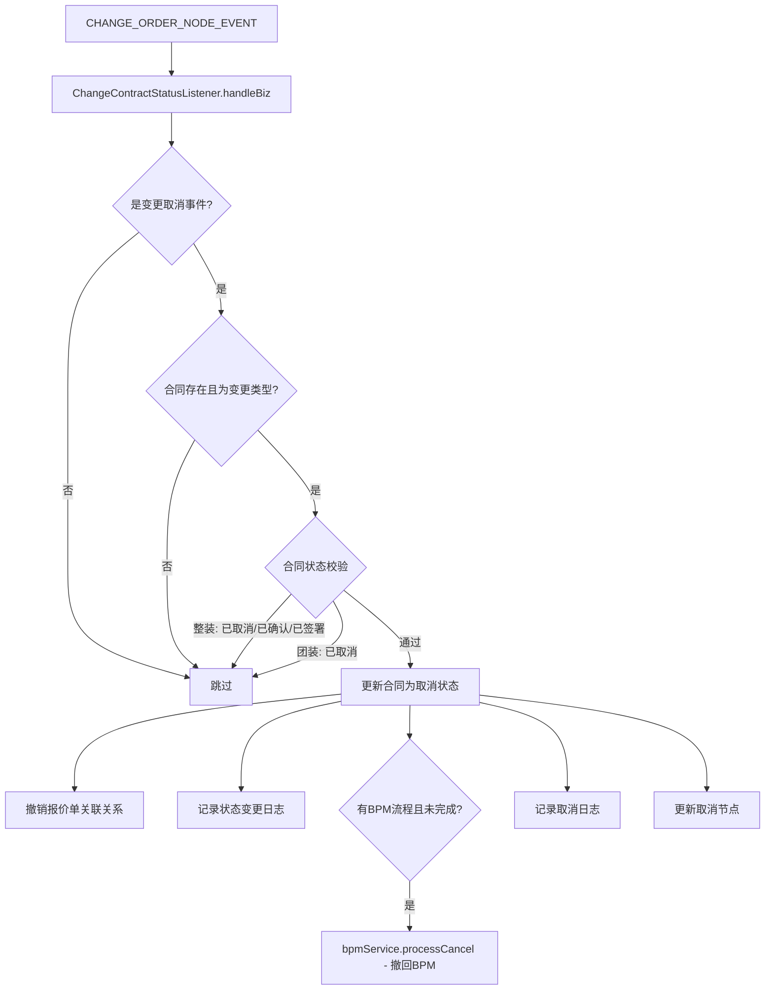

**团装与整装的区别处理：**
- 整装：已取消、已确认、已签署三种状态不可取消
- 团装：仅已取消状态不可取消

#### ChangeContractCancelLister

变更合同取消后回退收款计划：

- 从已完结的合同获取收款计划快照
- 通过 `@Retryable(maxAttempts=4)` 回退收款计划
- 使用 `CompletableFuture.runAsync` 异步执行

#### CancerOrderCancelListener

退单取消后置对应合同为已取消：

- 仅监听 `REVOKE_CANCEL_ORDER` 状态
- 遍历项目下所有解约协议合同
- 对未取消的合同执行：记录日志 → 更新节点 → 更新状态 → 发布取消事件

### 七、外部事件监听器

#### CancelPersonalContractListener

监听 Athena 平台个性化报价单撤回消息：

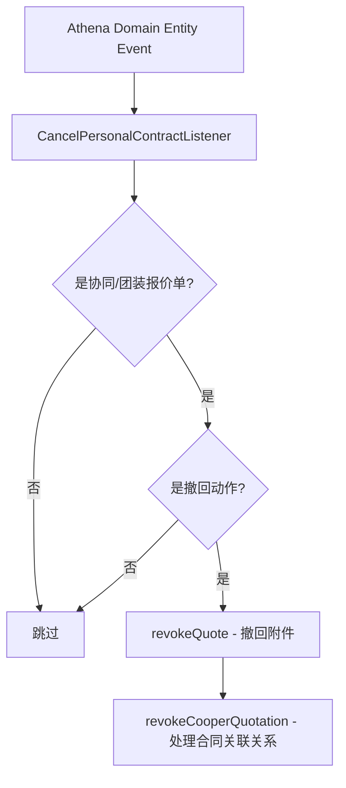

**撤回动作判断逻辑：**
- 正式版 → 调整中/已提交：报价单撤回
- 已提交 → 调整中：报价单撤回

#### ChangeBillSubmitListener

监听变更报价单提交消息：

- 仅处理变更标准单和变更协同单的提交动作
- 查询变更单对应原始报价单
- 撤回原始报价单对应的合同关联关系

#### BillToSubOrderListener / ChangeBillToSubOrderListener

报价单/变更单创建订单后，将报价单换绑至 S 单：

- `BillToSubOrderListener`：处理协同报价单和正签基础报价单的换绑
- `ChangeBillToSubOrderListener`：处理变更单对应 S 单的绑定

### 八、PDF 转图片监听器组

四个 `TranslatePdfImageListener` 在不同生命周期节点触发 PDF 转图片：

| 监听器 | 事件类型 | 触发时机 |
|--------|---------|---------|
| `SubmitTranslatePdfImageListener` | CONTRACT_SUBMIT | 合同提交时 |
| `CompanySignTranslatePdfImageListener` | CONTRACT_COMPANY_SIGN | 公司盖章后 |
| `UserConfirmTranslatePdfImageListener` | CONTRACT_USER_CONFIRM | 用户确认后 |
| `UserSignTranslatePdfImageListener` | CONTRACT_USER_SIGN | 用户签署后 |

所有监听器统一调用 `contractBusinessService.contractPdfToImageSchedule`，通过异步线程执行避免阻塞事件消费。

---

## 定时任务详解

```mermaid
graph TD
    subgraph BPM补偿[BPM 审批补偿]
        ABS[ApplyBpmSchedule]
        ABS -->|扫描| PENDING[状态为PENDING_SUBMIT_AUDIT的合同]
        ABS -->|重试| BPM[dealContractForBpm]
    end

    subgraph 超时检测[异步盖章超时检测]
        ASCTS[AsyncSignTimeCheckSchedule]
        ASCTS -->|扫描| COMPANY_SIGN[PENDING_COMPANY_SIGN状态合同]
        ASCTS -->|检查| REDIS[Redis中盖章记录时间]
        ASCTS -->|超时| WARN[记录报警日志]
    end

    subgraph 数据校验[数据一致性校验]
        CFCS[ContractFieldCheckSchedule]
        CFCS -->|查询| RECENT[前24小时新增合同数据]
        CFCS -->|比对| NEWOLD[新旧表数据一致性]
    end

    subgraph 隐私预警[隐私访问预警]
        PAWS[PrivacyAccessWarnSchedule]
        PAWS -->|统计| ACCESS[高频访问记录]
        PAWS -->|超阈值| ALERT[企微预警通知]
    end

    subgraph 历史修复[历史数据修复]
        CPCS[ChangePersonalContractFieldSchedule]
        CPCS -->|补充| FIELD[历史个性化合同字段表]
    end

    subgraph 配置检查[模板配置检查]
        FFCS[FormFieldConfigCheckSchedule]
        FFCS -->|校验| CONFIG[合同模板字段配置完整性]
    end

    subgraph 收款计划[收款计划更新]
        TCRS[TempUpdateContractCollectionRecordSchedule]
        TCRS -->|计算| PLAN[收款计划]
        TCRS -->|保存| RECORD[ContractCollectionPlanRecord]
    end
```

### ApplyBpmSchedule — BPM 审批补偿

- 定期扫描 `PENDING_SUBMIT_AUDIT` 状态的合同
- 对每笔合同重新调用 `dealContractForBpm` 发起 BPM 审批
- 兜底修复因事件丢失或异常导致的 BPM 发起失败

### AsyncSignTimeCheckSchedule — 异步盖章超时检测

- 扫描 `PENDING_COMPANY_SIGN` 状态的合同
- 检查 Redis 中记录的盖章发起时间
- 超过配置阈值（`asyncSignTimeCheckValue` 分钟）未收到回调则记录报警

### ContractFieldCheckSchedule — 新旧表数据核对

- 校验前 24 小时新增的合同数据在新旧表间的一致性
- 通过 `fromCheckId` 参数优化查询性能
- 使用分页查询避免全表扫描

### PrivacyAccessWarnSchedule — 隐私访问预警

- 统计指定时间窗口内操作人对合同 PDF 预览和手机号复制的访问次数
- 超过阈值（默认 10 次/100 分钟）触发企微预警
- 支持白名单豁免

### ChangePersonalContractFieldSchedule — 历史数据修复

- 按 ID 范围批量补充历史个性化合同字段表
- 每条记录间隔 50ms，避免对数据库造成压力
- 自动获取上一份已完成变更/B 合同作为数据源

### TempUpdateContractCollectionRecordSchedule — 收款计划记录更新

- 继承 `AbstractPusher` 框架，批量扫描项目
- 计算合同收款计划并保存到 `ContractCollectionPlanRecord`
- 先删后插，支持幂等重复执行

---

## 依赖关系

### 内部模块依赖

```mermaid
graph TD
    CE[ContractEvents] --> CCS[ContractCore - CommonContractService]
    CE --> CBS[ContractCore - ContractBusinessService]
    CE --> QRC[ContractCore - QuotationRelationCommonService]
    CE --> CAS[ContractCore - ContractCompanySignService]
    CE --> PRH[ContractCore - PersonalRelationHandler]
    CE --> CUS[ContractCore - ContractUnifyService]
    CE --> CCSVC[ContractConfig - ContractConfigVersionService]
    CE --> CAP[ContractConfig - ContractApolloConfig]
    CE --> CTS[ContractConfig - ContractToolService]
    CE --> CASVC[ContractCore - ContractAgentService]
    CE --> CSS[ContractCore - ContractScriptService]
    CE --> FBS[FundBaseService]
    CE --> FRS[FreeformService]
    CE --> PS[PdfToImageService]
    CE --> SMS[SmsService]

    CE --> DAO[DAO Layer]
    DAO --> CS[ContractService]
    DAO --> CLS[ContractLogService]
    DAO --> CNS[ContractNodeService]
    DAO --> CAUS[ContractAuditService]
    DAO --> CPRLS[ContractCollectionPlanRecordService]
    DAO --> CRLS[ContractRelationService]
    DAO --> CUSVC[ContractUserService]
    DAO --> CSLS[ContractStatusLogService]

    CE --> RPC[RPC Layer]
    RPC --> ESC[EscrowRpc - 存管服务]
    RPC --> ARPC[AthenaRpc - 订单中枢]
    RPC --> PSRPC[PayServiceRpc - 支付服务]

    CE --> COMMON[Common Services]
    COMMON --> LS[LockService - 分布式锁]
    COMMON --> S3S[S3Service - 文件存储]
    COMMON --> BPM[BpmService - BPM审批]
    COMMON --> RS[RiskService - 风控]
    COMMON --> CS2[CipherService - 加解密]
    COMMON --> ES[EventService - 事件发布]
    COMMON --> HOS[HomeOrderOperationService]
```

### 依赖服务分类

| 依赖类别 | 服务 | 用途 |
|---------|------|------|
| **核心业务** | ContractBusinessService | 公司盖章、BPM处理、PDF生成、用户注册 |
| **核心业务** | CommonContractService | 合同完结、短信发送、大表推送、收款提醒 |
| **报价关联** | QuotationRelationCommonService | 报价单与合同关联关系管理 |
| **授权签署** | ContractCompanySignService | 授权协议生成与管理 |
| **个性化** | PersonalRelationHandler | 个性化合同报价单撤回 |
| **配置** | ContractApolloConfig | Apollo 动态配置读取 |
| **配置** | ContractConfigVersionService | 合同配置版本管理 |
| **资金** | FundBaseService | 收款计划计算与保存 |
| **协议平台** | FreeformService | 协议平台盖章操作 |
| **图片服务** | PdfToImageService | PDF 转图片处理 |
| **审批** | BpmService | BPM 流程审批 |
| **风控** | RiskService | 风控策略触发 |
| **锁服务** | LockService | 分布式锁 |
| **订单中枢** | HomeOrderOperationService | 家装订单操作 |
| **AI 服务** | ContractAgentService | AI 讲解脚本生成 |

---

## 关键设计模式

### 1. 事件驱动 + 异步并行

所有监听器内部采用 `CompletableFuture.runAsync` 实现异步非阻塞处理：

```java
CompletableFuture.runAsync(RunnableWrapper.of(() -> {
    try {
        // 业务处理
    } catch (Exception e) {
        LOGGER.error("处理异常", e);
    }
}));
```

**优势：**
- 事件消费线程快速释放，不阻塞后续消息处理
- `RunnableWrapper` 提供 SkyWalking 分布式链路追踪
- 异常隔离，单个子任务失败不影响其他任务

### 2. 重试机制

关键操作使用 Spring `@Retryable` 注解实现自动重试：

| 场景 | 最大重试次数 | 间隔策略 |
|------|------------|---------|
| 公司盖章 | 3 次 | 固定 30 秒 |
| 收款计划保存 | 4 次 | 初始 1 秒，指数退避 |

### 3. 分布式锁

对并发敏感的操作使用 `LockService` 进行分布式锁控制：

- **盖章操作**：`LockService.CONTRACT_THIRD_PART_SEAL_TYPE + contractCode`
- **授权协议生成**：`generate_accredit:PROJECT_ORDER_ID + projectOrderId`
- **盖章结果更新**：`contract_company_seal: + contractCode`

### 4. 状态守卫

所有监听器在处理前进行严格的状态校验：

```java
// 状态校验示例
if (!ContractStatusEnum.PENDING_COMPANY_SIGN.getCode().equals(contract.getStatus())) {
    return; // 状态不符，直接返回
}
```

避免重复处理和状态不一致。

### 5. 事件路由机制

通过 `@EventType` 注解实现事件类型到监听器的自动路由：

```java
@EventType(bizType = "CONTRACT_SUBMIT", serverName = "utopia-nrs-sales-project")
```

- `bizType`：事件业务类型标识
- `serverName`：事件来源服务名称，用于跨服务事件订阅
- 同一 `bizType` 可被多个监听器订阅，实现一对多分发

### 6. SkyWalking 链路追踪

通过 `RunnableWrapper.of(...)` 包装异步任务，确保异步线程继承 SkyWalking 的 TraceContext，实现跨线程的全链路追踪。

---

## 监听器与下游服务交互矩阵

| 监听器 | CommonContractService | ContractBusinessService | QuotationRelation | RiskService | BpmService | FundBaseService | CancelOrderService | PersonalRelationHandler |
|--------|:---:|:---:|:---:|:---:|:---:|:---:|:---:|:---:|
| ContractSubmitListener | ● | | ● | ● | | | | |
| ContractConfirmListener | ● | ● | | | | | | |
| ContractFinishListener | ● | ● | | ● | | | | |
| ContractCompanySealListener | | | | | | | | |
| UserSignCompanySealListener | | ● | | | | | | |
| SignCompanySealAfterSubmitListener | | ● | | | | | | |
| ChangeContractStatusListener | | ● | ● | | ● | | | |
| ChangeContractCancelLister | | | | | | ● | | |
| ChangeContractUserConfirmListener | | | | | | ● | | |
| ChangeContractUserSignListener | ● | | | | | ● | | |
| CancelOrderLaunchAfterSubmitListener | | | | | | | ● | |
| CancerOrderCancelListener | ● | | | | | | | |
| ApplyBpmContractListener | | ● | | | | | | |
| ApplyBpmSignContractListener | | ● | | | | | | |
| ApplyBpmAddAttachContractListener | | ● | | | | | | |
| FreeformSealResultListener | | ● | | | | | | |
| CancelPersonalContractListener | | | | | | | | ● |
| ChangeBillSubmitListener | | | | | | | | ● |
| BillToSubOrderListener | | | ● | | | | | |
| ChangeBillToSubOrderListener | | | ● | | | | | |
| SendMessageAfterAccreditFinish | | | | | | | | |

---

## 异常处理策略

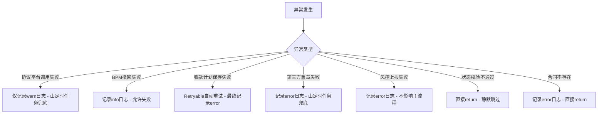

**异常处理原则：**
1. **不阻塞事件消费**：所有异常在 try-catch 中捕获，不向上抛出
2. **兜底机制**：协议平台调用、盖章等关键操作有定时任务补偿
3. **分级日志**：关键异常 error，可恢复异常 warn，正常跳过 info
4. **重试机制**：资金相关操作使用 `@Retryable` 保证最终一致性

---

## 与其他模块的关系

| 关联模块 | 关系描述 |
|---------|---------|
| [ContractCore](ContractCore.md) | 提供 `CommonContractService`、`ContractBusinessService` 等核心业务服务，是事件监听器的主要下游调用对象 |
| [ContractChange](ContractChange.md) | `ChangeContractStatusListener` 和 `ChangeContractCancelLister` 处理变更合同的取消事件 |
| [ContractSubmission](ContractSubmission.md) | `ContractSubmitListener` 处理合同提交事件，是提交流程的异步后处理 |
| [ContractConfig](ContractConfig.md) | `ContractApolloConfig` 提供动态配置，`ContractConfigVersionService` 提供配置版本管理 |
| [ContractPdf](ContractPdf.md) | PDF 转图片监听器调用 `PdfToImageService` 处理合同 PDF |
| [ContractSigning](ContractSigning.md) | 盖章监听器调用 `FreeformService` 与协议平台交互 |
| [ContractPresentation](ContractPresentation.md) | `HomeOrderOperationService` 用于记录合同签署完成节点 |
