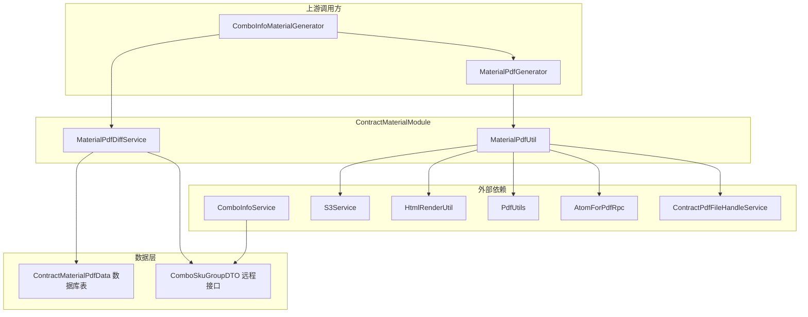
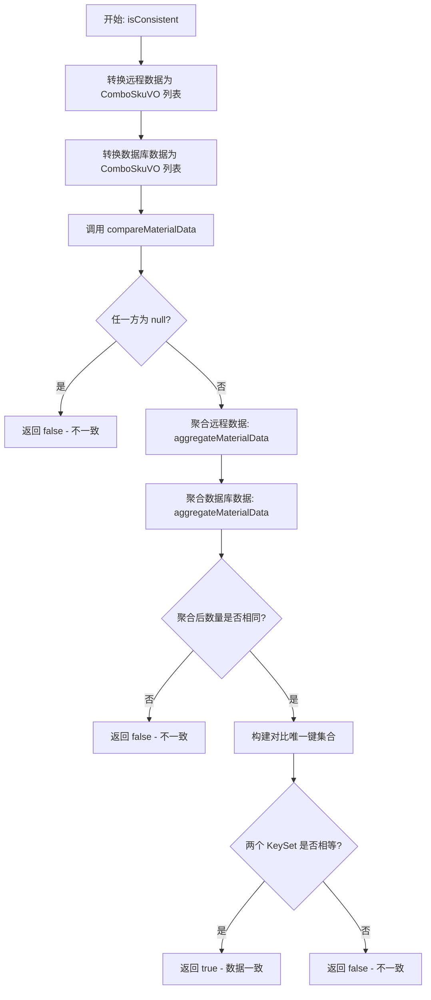
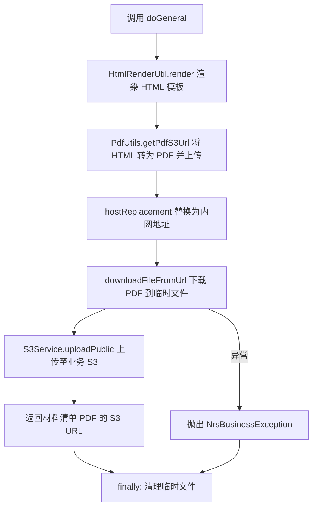
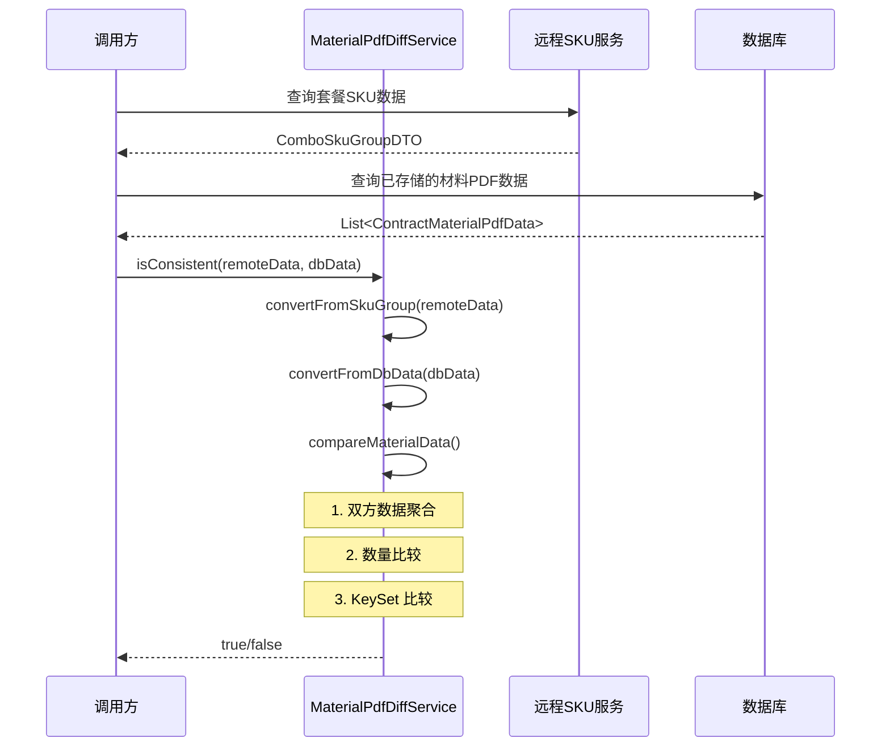
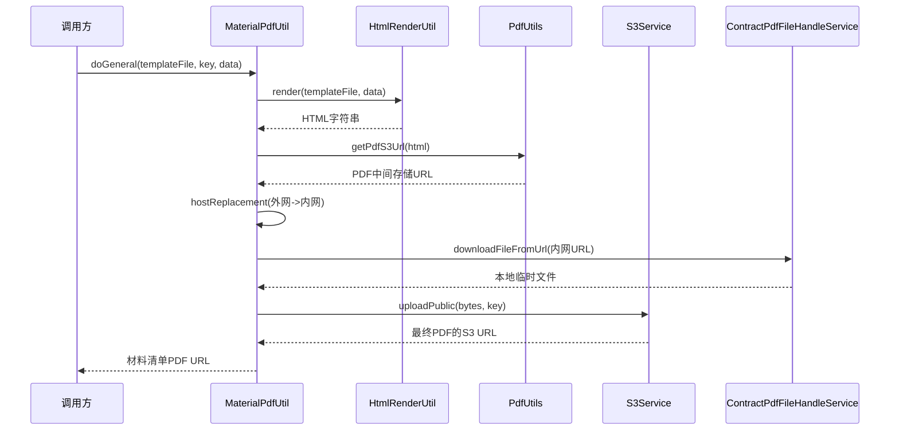
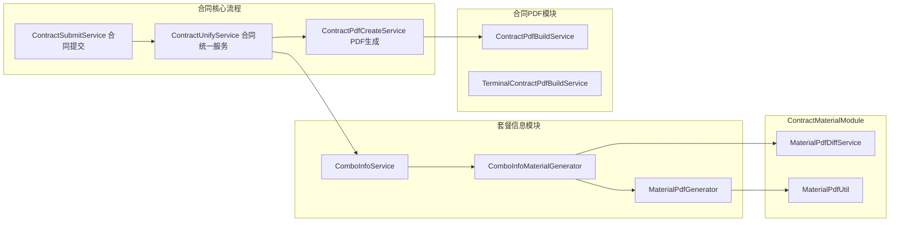

# ContractMaterialModule

## 模块概述

ContractMaterialModule 是合同系统中负责**材料清单 PDF 管理**的子模块，隶属于合同套餐（Combo）体系。该模块的核心职责是：

1. **数据差异检测**：比对远程实时材料数据与数据库已存储数据的一致性，判断是否需要重新生成 PDF
2. **PDF 生成与上传**：基于 HTML 模板渲染材料清单 PDF，并上传至 S3 存储

该模块在合同提交、预览、变更等业务流程中被调用，确保材料清单附件（如品牌清单、品类清单）的 PDF 始终与最新数据保持同步。

---

## 模块架构



---

## 核心组件详解

### 1. MaterialPdfDiffService

**职责**：材料清单 PDF 数据的差异检查服务。

该服务通过比对两个数据源——远程实时查询的套餐 SKU 数据（`ComboSkuGroupDTO`）与数据库已持久化的材料 PDF 数据（`ContractMaterialPdfData`）——来判断材料清单是否发生了变化，从而决定是否需要重新生成 PDF。

#### 核心方法

| 方法 | 可见性 | 说明 |
|------|--------|------|
| `isConsistent(ComboSkuGroupDTO, List<ContractMaterialPdfData>)` | public | 入口方法，检查远程数据与 DB 数据是否一致 |
| `convertFromSkuGroup(ComboSkuGroupDTO)` | public | 将远程 SKU 分组数据转换为统一的 `ComboSkuVO` 列表 |
| `convertFromDbData(List<ContractMaterialPdfData>)` | public | 将数据库记录转换为统一的 `ComboSkuVO` 列表 |
| `compareMaterialData(List<ComboSkuVO>, List<ComboSkuVO>)` | private | 执行实际的数据对比逻辑 |
| `aggregateMaterialData(List<ComboSkuVO>)` | private | 聚合材料数据：按三级品类分组、品牌拼接、排序 |
| `buildMaterialItemCompareKey(MaterialPdfItemVO)` | private | 构建对比唯一键 `categoryLevel3Name|brandNames` |

#### 数据对比流程



#### 数据聚合规则（aggregateMaterialData）

聚合是差异对比的核心步骤，将原始 SKU 列表转换为可比对的标准化格式：

1. **分组**：按 `categoryLevel3Code`（三级品类编码）分组
2. **品牌过滤**：过滤掉 `brandName` 为 `"其他"` 的项
3. **品牌拼接**：同一品类下的品牌按字母排序后用 `"/"` 连接
4. **空品牌跳过**：品牌为空的三级类目不参与 PDF 展示
5. **排序**：结果按 `categoryLevel3Name` 正序排列
6. **编号**：从 1 开始重新赋值 `sequenceNumber`

#### 远程数据转换规则（convertFromSkuGroup）

- 按 `(categoryLevel3Code + "#" + brandCode)` 组合键去重
- key 冲突时保留第一条记录
- 使用 `LinkedHashMap` 保持插入顺序

---

### 2. MaterialPdfUtil

**职责**：材料清单 PDF 的实际生成工具类，负责模板渲染、PDF 转换、临时文件管理及 S3 上传。

#### 核心方法

| 方法 | 说明 |
|------|------|
| `doGeneral(String templateFile, String key, Map<String, Object> data)` | 完整的 PDF 生成流程：模板渲染 → PDF 转换 → 上传 S3 |
| `hostReplacement(String pdfS3Url)` | 内外网地址替换，确保后续下载使用内网地址 |

#### PDF 生成流程



#### 关键设计

- **内外网地址替换**：PDF 生成服务返回的是外网地址（`https://file.ljcdn.com`），系统内部下载时需替换为内网地址（`http://file.media.lianjia.com`），减少网络开销
- **临时文件管理**：使用 `UUID` 生成临时文件名，通过 `finally` 块确保临时文件在流程结束后被清理
- **错误处理**：IOException 时抛出 `NrsBusinessException("材料配送清单 PDF 生成失败")`

---

## 依赖关系

### 依赖的外部服务

| 外部服务 | 注入字段 | 用途 |
|---------|---------|------|
| `HtmlRenderUtil` | `htmlRenderUtil` | 将 HTML 模板 + 数据渲染为最终 HTML |
| `PdfUtils` | `pdfUtils` | 将 HTML 转换为 PDF 并上传到中间存储 |
| `S3Service` | `s3Service` | 将 PDF 文件上传至业务 S3 存储 |
| `ContractPdfFileHandleService` | `contractPdfFileHandleService` | 从 URL 下载文件到本地临时路径 |
| `AtomForPdfRpc` | `atomForPdfRpc` | PDF 相关的远程过程调用（已注入，备用） |

### 依赖的数据模型

| 数据模型 | 方向 | 说明 |
|---------|---------|------|
| `ComboSkuGroupDTO` | 输入 | 远程查询的套餐 SKU 分组数据，包含 `comboId` 和 `skuList` |
| `ComboSkuDTO` | 输入 | 单个 SKU 数据，含品类编码/名称、品牌编码/名称 |
| `ContractMaterialPdfData` | 输入 | 数据库存储的材料 PDF 数据记录 |
| `ComboSkuVO` | 内部 | 统一转换中间对象，含 `categoryLevel3Code/Name`、`brandCode/Name` |
| `MaterialPdfItemVO` | 内部 | 聚合后的材料项对象，含 `categoryLevel3Name`、`brandNames`、`sequenceNumber` |

---

## 数据流

### 差异检测数据流



### PDF 生成数据流



---

## 在合同系统中的位置

### 模块间关系



### 调用场景

1. **合同提交时**：提交流程中检查套餐材料是否有变更，如有变更则重新生成材料清单 PDF
2. **合同预览时**：预览前检测材料数据一致性，确保展示最新的材料清单
3. **合同变更时**：变更单流程中重新校验材料数据并按需更新 PDF

---

## 关键设计模式

### 1. 数据转换管道模式

`MaterialPdfDiffService` 将差异检测拆分为清晰的管道步骤：

```
原始数据 → 统一转换(ComboSkuVO) → 聚合(MaterialPdfItemVO) → 键构建 → 集合比较
```

远程数据和数据库数据分别经过相同的转换管道，最终在统一格式上进行比较，消除了数据源格式差异的影响。

### 2. 防御性去重

`convertFromSkuGroup` 方法在转换时按 `(categoryLevel3Code + brandCode)` 组合键去重，确保即使远程数据存在重复 SKU 记录，对比结果也不会误判。

### 3. 工具类封装（MaterialPdfUtil）

`MaterialPdfUtil` 将 PDF 生成涉及的多个外部服务（模板渲染、HTML 转 PDF、S3 上传）封装为单一入口 `doGeneral()`，上游调用方无需关心底层的多步骤流程。

---

## 相关模块文档

| 模块 | 说明 | 文档链接 |
|------|------|---------|
| ContractPdfModule | 合同 PDF 构建与生成策略，包含自生成 PDF 的多种策略实现 | [ContractPdfModule.md](ContractPdfModule.md) |
| ContractCore | 合同核心服务层，包含提交、详情、草稿等基础能力 | [ContractCore.md](ContractCore.md) |
| ContractContextModule | 合同上下文管理，通过 AOP 切面预处理合同相关数据 | [ContractContextModule.md](ContractContextModule.md) |
