# ContractPdf 模块文档

## 1. 模块概述

ContractPdf 模块是合同系统中负责 **PDF 文档全生命周期管理** 的核心子模块，涵盖合同 PDF 的数据组装、生成、文件处理和图片转换四大能力域。该模块支持两种 PDF 生成模式（协议平台生成 / 系统自主生成），服务于装修行业中多种合同类型（正签合同、首期款合同、图纸合同、个性化合同、解约协议等），并通过策略模式适配不同业务类型的差异化 PDF 拼接逻辑。

### 核心职责

| 能力域 | 核心服务 | 说明 |
|--------|----------|------|
| PDF 数据组装 | `ContractPdfBuildService` | 通过反射机制动态构建 PDF 表单数据，支持 100+ 字段方法 |
| PDF 生成调度 | `ContractPdfCreateService` | 编排两种 PDF 生成模式：Freeform 协议平台模式和自主生成模式 |
| PDF 自主生成策略 | `CreateContractPdfBySelfStrategy` 体系 | 按合同类型/业务类型路由到不同的 PDF 拼接策略 |
| PDF 文件处理 | `ContractPdfFileHandleService` | 提供 PDF 合并、压缩、页脚添加、页数统计等底层操作 |
| PDF 转图片 | `PdfToImageService` | 将 PDF 转换为图片，支持本地渲染和远程工具服务两种模式 |
| 文件信息记录 | `ContractFileInfoService` | 异步记录 PDF 文件大小信息，用于运维监控 |

## 2. 模块架构

### 2.1 整体架构图

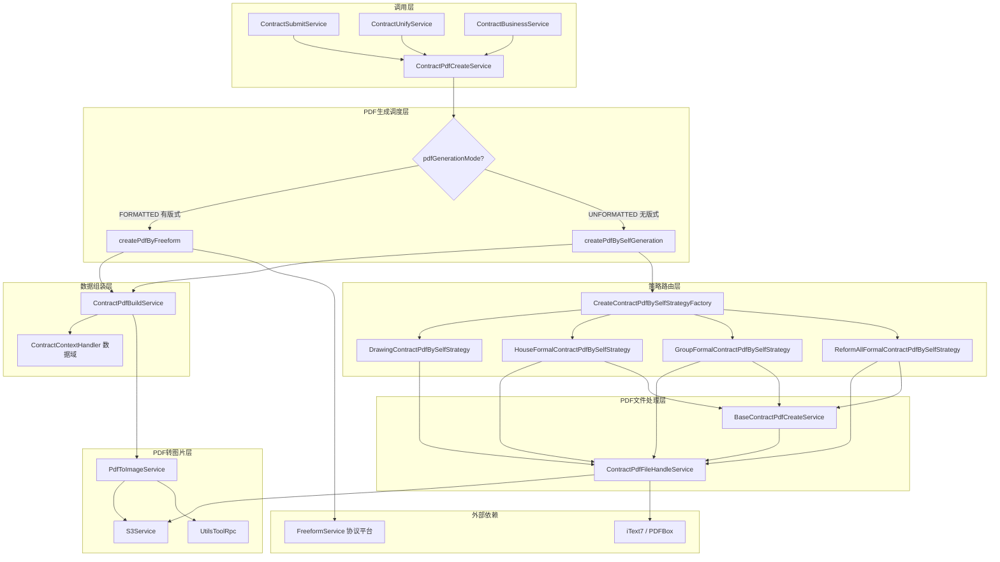

### 2.2 PDF 生成模式决策流程

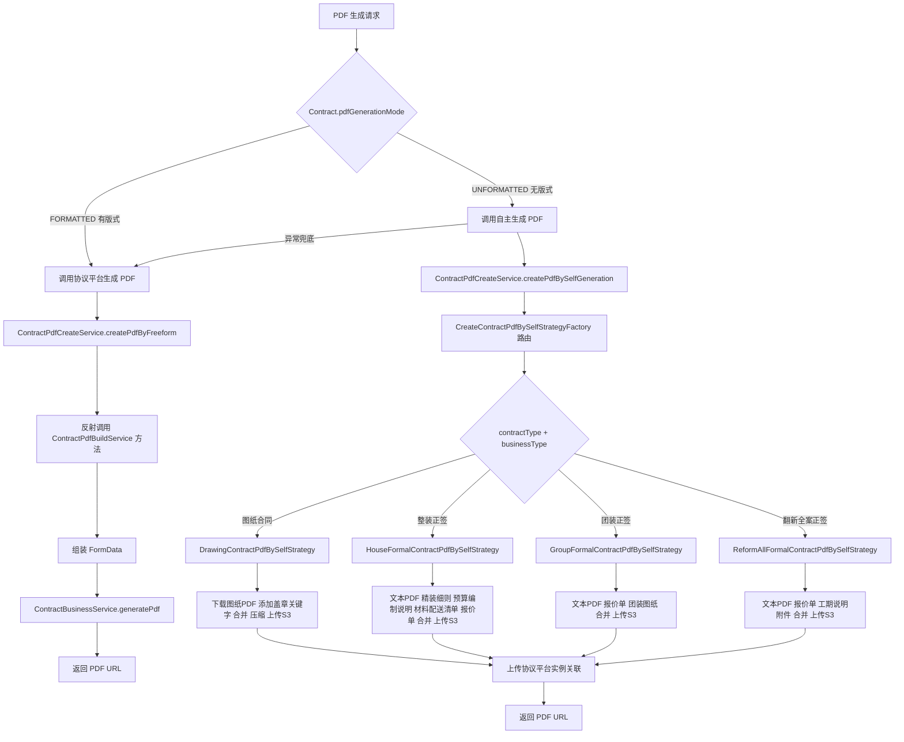

## 3. 核心组件详解

### 3.1 ContractPdfBuildService — PDF 表单数据构建

**职责**：通过反射被 `ContractPdfCreateService` 动态调用，为每种合同字段提供数据获取逻辑。

**关键设计**：所有 public 方法均通过反射调用，方法签名不得随意修改。每个方法返回 `Map<String, Object>`，key 为协议平台的表单字段名，value 为字段值。

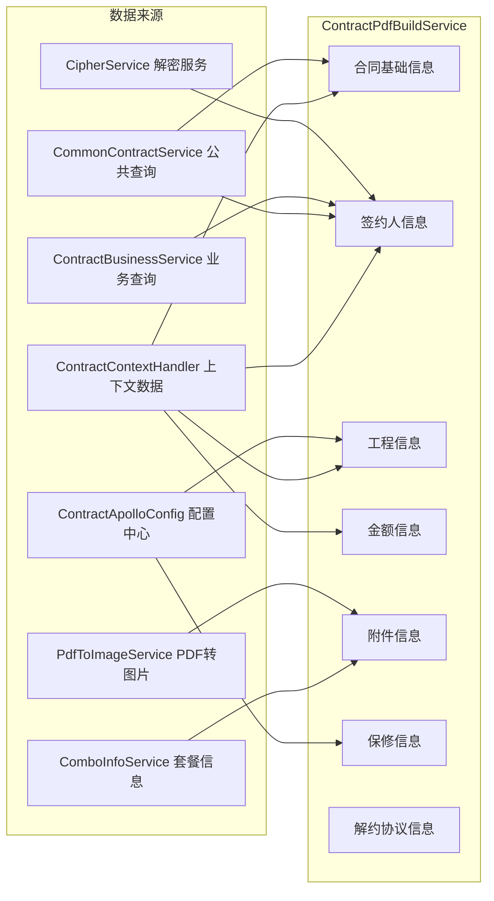

**字段方法分类**：

| 分类 | 方法示例 | 说明 |
|------|----------|------|
| 合同基础 | `getContractNo`, `getProjectOrderId`, `getContractSubmitDate` | 合同编号、项目单号、提交日期 |
| 签约人信息 | `getSignUserInfo`, `getSignUserInfoV2`, `getFirstPartUserInfo`, `getAgentUserInfo` | 支持个人/公司签约，含证件号解密 |
| 工程信息 | `getProjectContractAddress`, `getStructureInfo`, `getArea`, `getProjectDay` | 房屋地址、结构、面积、工期 |
| 金额信息 | `getContractAmount`, `getContractAdvanceAmount`, `getCollectionPlanInfo` | 合同金额、首期款、收款计划 |
| 附件信息 | `getBudgetUrl`, `getDecorateRuleUrl`, `getDrawingUrlV2`, `getPersonalBudgetUrlV2` | 报价单、精装细则、图纸（均需 PDF 转图片） |
| 保修信息 | `getWaterElectricGuaranteeYear`, `getWaterProofGuaranteeYear`, `getOtherGuaranteeYear` | 基于 Apollo 配置获取保修年限 |
| 解约协议 | `getTerminalSecondPartyCompanyInfo`, `getTerminalDetailFundInfo`, `getBreachPenaltyAmount` | 委托 `TerminalContractPdfBuildService` 处理 |

**敏感数据处理**：签约人证件号、手机号等通过 `CipherService` 解密后写入 PDF 表单。

### 3.2 ContractPdfCreateService — PDF 生成调度

**职责**：协调 PDF 生成的两种模式，处理协议平台字段一致性校验和数据完整性检查。

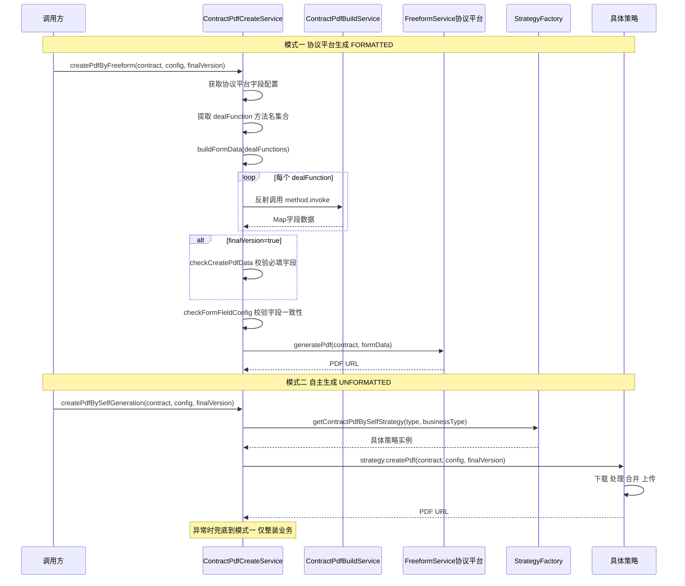

**`buildFormData` 反射机制**：

```
数据库 ContractProtocolConfig 表
    ├── formKey: 表单标识
    ├── formId: 表单ID
    ├── formFieldKey: 表单字段key (如 "contractNo")
    └── dealFunction: 数据获取方法名 (如 "getContractNo")
                        ↓ 反射调用
ContractPdfBuildService.getContractNo()
                        ↓ 返回
Map {"contractNo" => "HT-2025-001"}
```

### 3.3 自主生成策略体系

采用**策略模式** + **工厂模式**，按合同类型和业务类型路由到不同的 PDF 拼接策略。

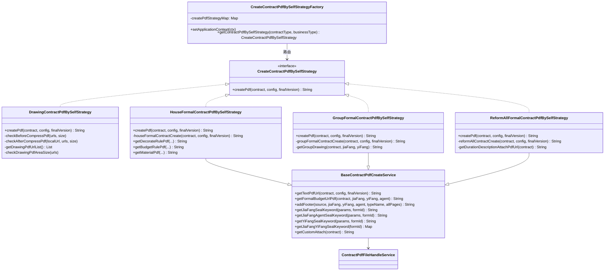

#### 各策略 PDF 拼接顺序

| 策略 | 适用场景 | PDF 拼接顺序 |
|------|----------|-------------|
| `DrawingContractPdfBySelfStrategy` | 图纸合同 | 图纸 PDF → 添加盖章关键字 → 压缩(可选) → 合并 |
| `HouseFormalContractPdfBySelfStrategy` | 整装正签合同 | 文本 PDF → 精装细则(盖章) → 预算编制说明 → 材料配送清单 → 报价单(盖章) → 个性化附件 |
| `GroupFormalContractPdfBySelfStrategy` | 团装正签合同 | 文本 PDF → 报价单(盖章) → 团装图纸(盖章) → 个性化附件 |
| `ReformAllFormalContractPdfBySelfStrategy` | 翻新全案正签合同 | 文本 PDF → 报价单(盖章) → 工期说明附件 → 个性化附件 |

#### 图纸合同特殊处理流程

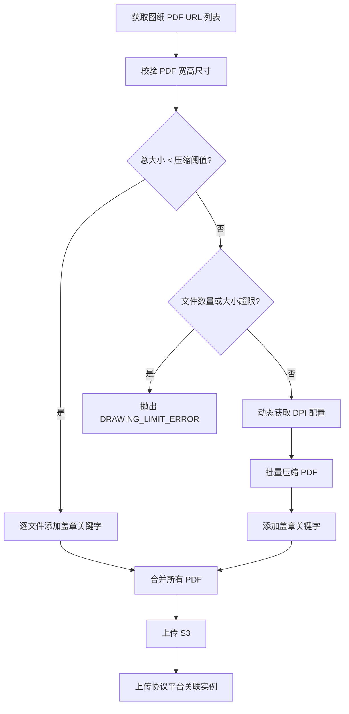

### 3.4 ContractPdfFileHandleService — PDF 文件操作

**职责**：提供 PDF 底层文件操作能力，包括添加页脚文字、压缩、合并、页数统计、图片转 PDF 等。

**技术栈**：
- **iText 7**：用于 PDF 文字添加（盖章关键字写入）、PDF 合并、内容流压缩
- **Apache PDFBox**：用于 PDF 压缩（渲染为图片再重组）、PDF 转图片渲染、页数统计

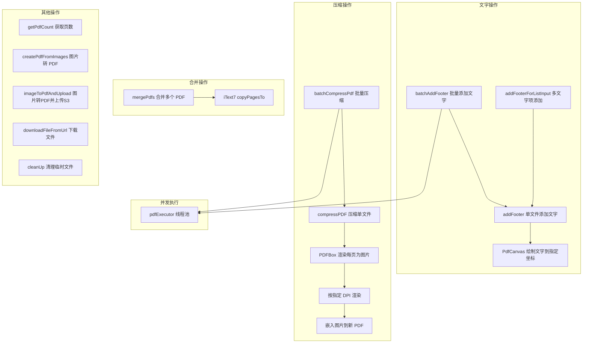

**并发模型**：
- `batchAddFooter` 和 `batchCompressPdf` 均使用 `pdfHandleExecutor` 线程池并行处理
- 使用 `CompletableFuture.allOf` 等待所有任务完成
- `downloadFileFromUrl` 配置了 Spring Retry（最多 3 次，间隔 100ms）

### 3.5 PdfToImageService — PDF 转图片

**职责**：将合同附件（报价单、精装细则、图纸等）的 PDF 文件转换为图片，供协议平台或自主生成模式使用。

**双模式设计**：

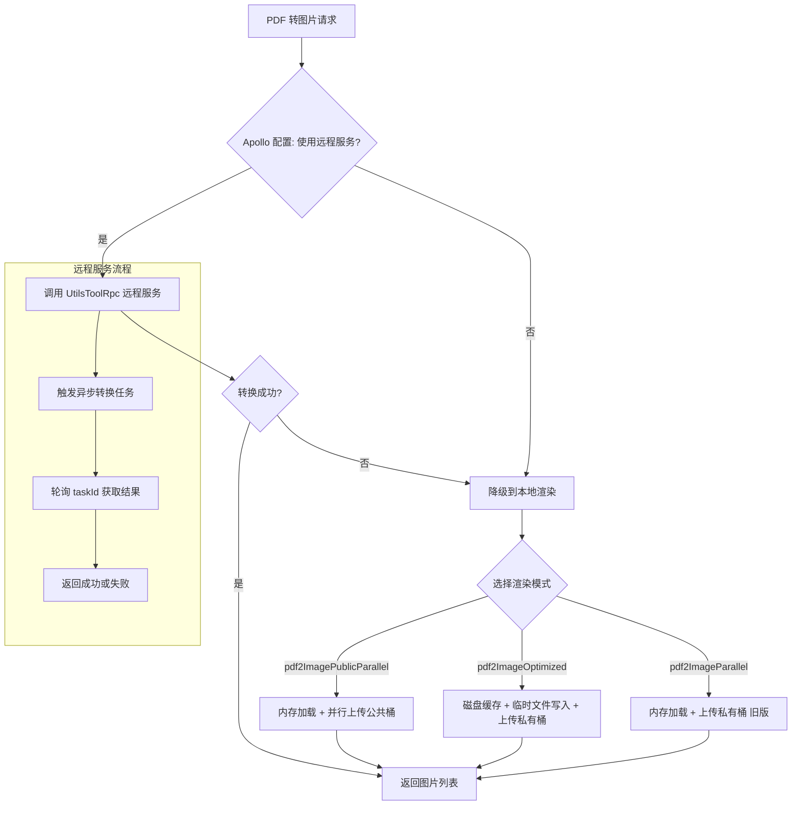

| 方法 | S3 类型 | 使用场景 | 特点 |
|------|---------|----------|------|
| `pdf2ImagePublicParallel` | 公共桶 | 报价单转图片、附件配置上传 | 内存加载，并行上传 |
| `pdf2ImageOptimized` | 私有桶 | 合同 PDF 转图片、收据 | 磁盘缓存，降低内存占用 |
| `pdf2ImageParallel` | 私有桶 | 已不使用（旧版） | 内存加载，并行上传 |

**关键配置项**：
- `contract.pdfToImage.dpi`：渲染分辨率（默认 80，越大越清晰但越慢）
- `contract.pdfToImage.imageType`：输出图片格式（默认 png）
- `contract.pdfToImage.limitPages`：合同页数上限（默认 100）

### 3.6 TerminalContractPdfBuildService — 解约协议 PDF 数据构建

**职责**：为解约协议类型的 PDF 提供专用的数据组装逻辑，处理退款信息、关联合同信息等。

**核心字段**：

| 字段 | 方法 | 说明 |
|------|------|------|
| 乙方公司 | `getTerminalSecondPartyCompanyInfo` | 从正向签约合同获取公司信息 |
| 房屋地址 | `getTerminalProjectContractAddress` | 从正向合同字段拼接完整地址 |
| 签约合同信息 | `getTerminalSignContractInfo` | 包含设计合同+正签合同+变更合同编号 |
| 款项明细 | `getTerminalDetailFundInfo` | 设计费、工程款、违约金等 |
| 总款项 | `getTerminalTotalFundInfo` | 甲方付款 or 乙方退款（含退款渠道信息） |
| 取回材料天数 | `getTerminalRetrieveMaterialDays` | 乙方可取回剩余施工材料时间 |
| 违约金 | `getBreachPenaltyAmount` | 保密义务违约金金额 |
| 关联正签信息 | `getTerminalRelationHouseFormalInfo` | 合并发起模式下关联的正签合同信息 |

### 3.7 ContractFileInfoService — 文件信息记录

**职责**：异步记录 PDF 文件大小信息，用于运维监控和质量分析。

```java
@Async  // 异步执行，不阻塞主流程
public void saveContractFileInfoRecord(projectOrderId, fileType, originalSize, compressSize)
```

记录的文件类型包括：正签报价单、精装细则、预算编制说明、材料配送清单、图纸合同、正签合同、基础图纸、工期说明附件、个性化附件等。

### 3.8 配置 DTO

#### DrawingLaunchConfig — 图纸合同发起配置

| 配置项 | 默认值 | 说明 |
|--------|--------|------|
| `openCity` | "" | 开城列表，`*` 表示全开 |
| `drawingCountLimit` | 100 | 图纸数量上限 |
| `drawingSpaceSizeLimit` | 60MB | 图纸占用空间上限 |
| `drawingCompressSize` | 15MB | 触发压缩的阈值 |
| `positionXRatio` / `positionYRatio` | 0.5 / 0.2 | 甲方盖章关键字位置比例 |
| `pdfMaxArea` | 3370x2384 | PDF 最大尺寸限制 |
| `checkPdfAreaSize` | false | 是否校验 PDF 尺寸 |

#### FormalLaunchConfig — 正签合同发起配置

| 配置项 | 默认值 | 说明 |
|--------|--------|------|
| `openCity` | "" | 开城列表 |
| `compressSize` | 5MB | 报价单压缩阈值 |
| `positionXRatioJiaFang` / `positionYRatioJiaFang` | 0.2 / 0.2 | 甲方关键字位置 |
| `positionXRatioJiaFangAgent` / `positionYRatioJiaFangAgent` | 0.1 / 0.17 | 甲方代理人关键字位置 |
| `positionXRatioYiFang` / `positionYRatioYiFang` | 0.7 / 0.2 | 乙方关键字位置 |

## 4. 模块依赖关系

### 4.1 上游依赖（被本模块调用）

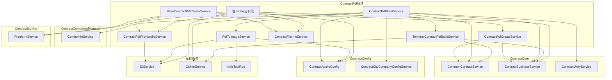

### 4.2 下游依赖（调用本模块的服务）

| 调用方 | 调用场景 |
|--------|----------|
| `ContractSubmitService` | 合同提交时并行生成 PDF |
| `ContractUnifyService.createOnlinePdf` | 在线创建 PDF |
| `ContractBusinessService.contractPdfToImage` | 合同 PDF 转图片（定时任务） |
| `ContractPdfBuildService` 内部 | 附件图片 URL 获取时调用 `PdfToImageService` |

### 4.3 外部系统依赖

| 外部系统 | 交互方式 | 说明 |
|----------|----------|------|
| Freeform 协议平台 | RPC | PDF 生成、实例上传、签章配置查询 |
| S3 存储 | SDK | PDF/图片文件上传与下载 |
| UtilsTool 服务 | RPC | 异步 PDF 转图片（远程渲染） |
| Apollo 配置中心 | SDK | 动态业务配置（压缩阈值、开城列表等） |

## 5. 数据流

### 5.1 合同 PDF 生成完整数据流

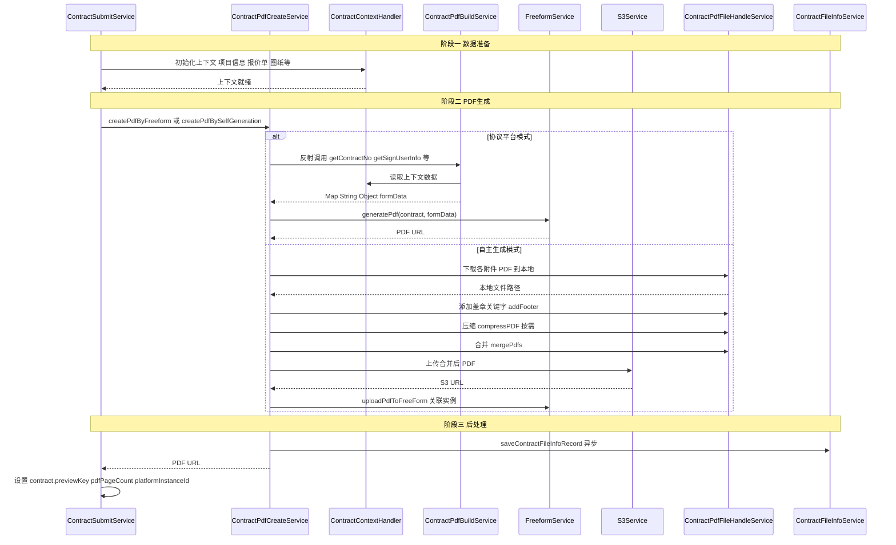

### 5.2 附件 PDF 转图片数据流

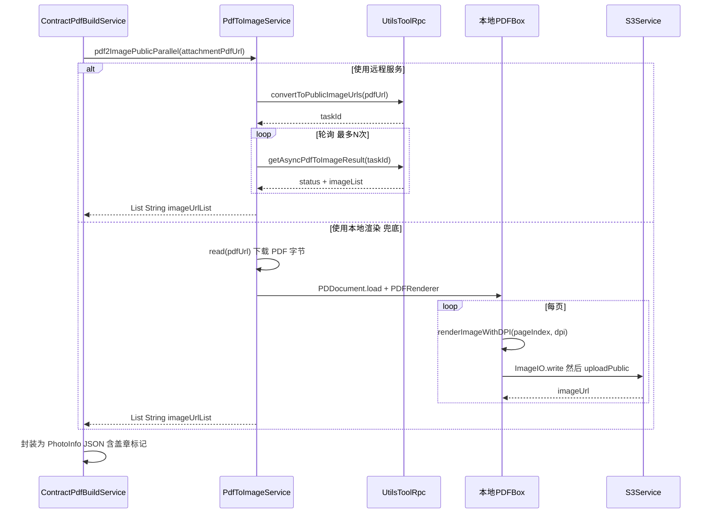

## 6. 关键设计模式

### 6.1 反射驱动的数据组装

`ContractPdfBuildService` 的方法通过 `ContractProtocolConfig` 数据库表中的 `dealFunction` 字段进行反射调用。这种设计允许：
- **无需代码变更即可调整字段**：运营人员在数据库中配置新的 dealFunction 即可添加新的 PDF 字段
- **方法级粒度的组合**：不同合同类型可以配置不同的方法集合

**注意事项**：方法名不得随意修改，所有方法通过 `contractPdfBuildService.getClass().getMethod(dealFunction)` 调用。

### 6.2 策略模式 + 工厂模式

`CreateContractPdfBySelfStrategyFactory` 通过 Spring 的 `ApplicationContextAware` 自动收集所有 `CreateContractPdfBySelfStrategy` 实现，按 Bean 名称路由：

```
ContractTypeEnum.getContractPdfBySelfStrategy(contractType, businessType)
    → 返回 Bean 名称
    → 从 Map 中获取策略实例
```

### 6.3 ThreadLocal 上下文模式

`ContractContextHandler` 使用 ThreadLocal 存储合同上下文数据，整个 PDF 生成链路共享同一个上下文：

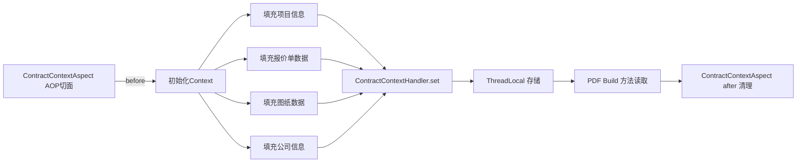

### 6.4 兜底降级策略

自主生成模式在异常时可降级到协议平台生成模式（仅整装业务支持）：

```
createPdfBySelfGeneration 异常
    → 仅整装业务(HOUSE_CERTIFICATE)支持兜底
    → 切换 pdfGenerationMode = FORMATTED
    → 调用 createPdfByFreeform
```

图纸合同的 PDF 转图片也有类似的降级：远程服务失败时降级到本地 PDFBox 渲染。

## 7. 模块间文档索引

| 相关模块 | 关系 | 文档链接 |
|----------|------|----------|
| [ContractCore](ContractCore.md) | 提供合同基础服务（CommonContractService、ContractBusinessService、ContractUnifyService） | [ContractCore 文档](ContractCore.md) |
| [ContractSubmission](ContractSubmission.md) | 合同提交流程中调用 PDF 生成 | [ContractSubmission 文档](ContractSubmission.md) |
| [ContractSigning](ContractSigning.md) | Freeform 协议平台交互（签章、生成 PDF） | [ContractSigning 文档](ContractSigning.md) |
| [ContractConfig](ContractConfig.md) | Apollo 配置、城市公司配置 | [ContractConfig 文档](ContractConfig.md) |
| [ContractComboAndMaterial](ContractComboAndMaterial.md) | 套餐信息（精装细则、预算编制说明、材料配送清单） | [ContractComboAndMaterial 文档](ContractComboAndMaterial.md) |
| [ContractEvents](ContractEvents.md) | PDF 转图片的异步事件监听 | [ContractEvents 文档](ContractEvents.md) |

## 8. 运维关注点

### 8.1 性能关键路径

- **批量 PDF 压缩**：使用 `pdfHandleExecutor` 线程池并行处理，需关注线程池配置
- **PDF 转图片**：默认 DPI 80，远程服务有轮询超时限制（`pdfToImageMaxAttempts`）
- **图纸合同**：可能涉及大量 PDF 下载和压缩，需关注临时文件磁盘空间

### 8.2 文件清理

所有临时文件通过 `ContractPdfFileHandleService.cleanUp` 方法在 finally 块中清理。图纸压缩过程中使用 `UUID` 临时目录存储中间图片，处理完成后递归删除。

### 8.3 监控指标

- `ContractFileInfoService` 异步记录文件大小，可用于：
  - 报价单压缩前后大小对比
  - 图纸合同压缩效果分析
  - 异常大文件预警

### 8.4 错误处理

| 错误码 | 场景 | 处理方式 |
|--------|------|----------|
| `PDF_PAGES_LIMIT` | PDF 页数超过 limitPages | 向用户展示友好提示 |
| `PDF_URL_ERROR` | PDF 文件 URL 不可访问 | 向用户展示友好提示 |
| `DRAWING_LIMIT_ERROR` | 图纸数量/大小超限 | 向用户展示提示，建议线下签署 |
| `CONTRACT_FIELD_MISS` | 必填字段为空 | 展示具体缺失字段名称 |
