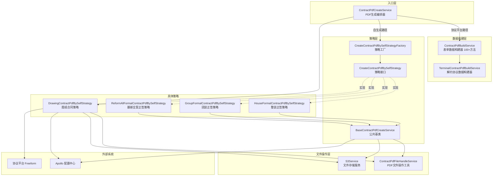
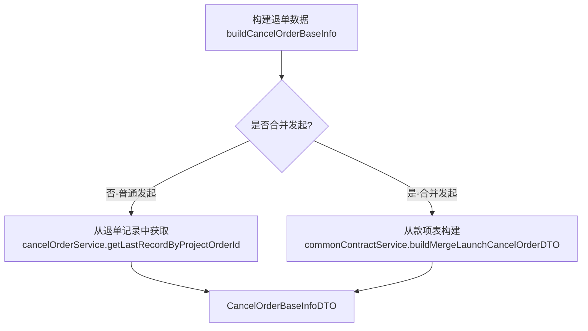
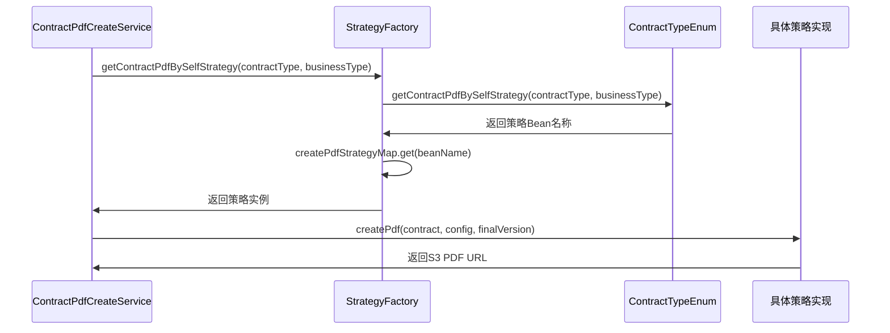
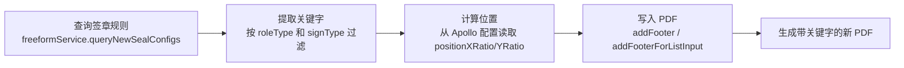
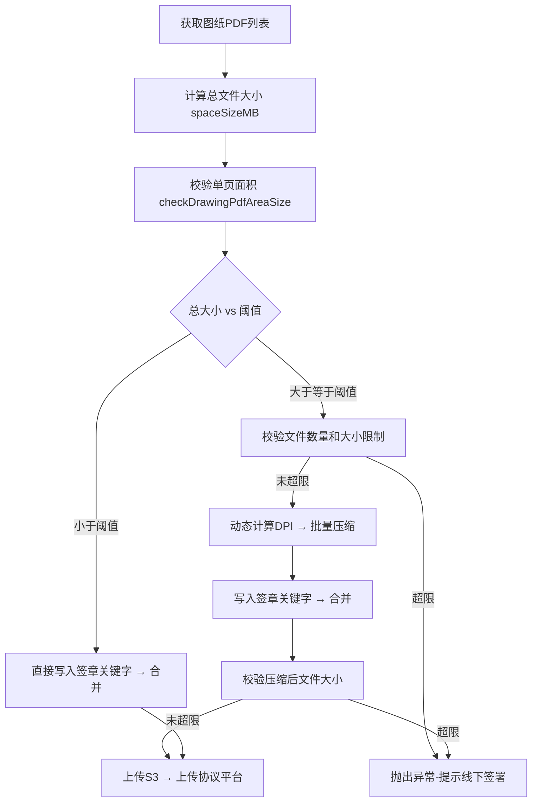
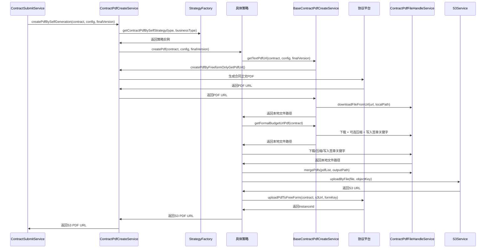
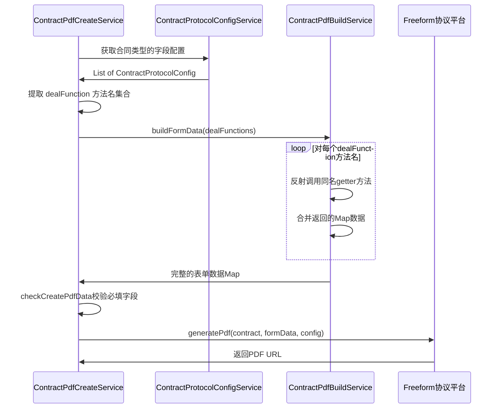

# ContractPdfModule 模块文档

## 1. 模块概述

ContractPdfModule 是合同系统的 **PDF 生成核心模块**，负责根据不同的合同类型和业务场景，自动化生成完整的合同 PDF 文件。模块支持两种生成路径：通过外部协议平台（Freeform）模板渲染生成，以及基于策略模式的本地自定义拼接生成。生成的 PDF 包含合同正文、报价单、图纸、装修细则、材料清单等多种附件，并在指定位置写入签章关键字，最终上传至 S3 和协议平台供签约使用。

### 核心职责

- **合同 PDF 生成编排**：根据合同类型（整装正签、团装正签、翻新全案、图纸合同、解约协议等）选择对应的生成策略
- **表单数据反射构建**：通过 Java 反射机制动态调用 100+ 个数据提供方法，组装协议平台所需的表单字段
- **多附件 PDF 拼接**：将合同正文、报价单、装修细则、图纸、材料清单、工期说明、个性化附件等多个 PDF 合并为一个完整文件
- **签章关键字写入**：在 PDF 的指定位置写入甲方/乙方/甲方代理人的签章关键字，供协议平台自动盖章
- **PDF 压缩与校验**：对大体积图纸 PDF 进行动态压缩，校验文件数量、尺寸和面积等限制
- **解约协议数据构建**：为解约协议提供乙方公司信息、房屋地址、已签合同信息、款项明细等专用数据

---

## 2. 模块架构

### 2.1 整体架构



### 2.2 类继承关系

```mermaid
classDiagram
    class CreateContractPdfBySelfStrategy {
        <<interface>>
        +createPdf(Contract, ContractCityCompanyInfo, boolean) String
    }

    class BaseContractPdfCreateService {
        +getTextPdfUrl(Contract, ContractCityCompanyInfo, boolean) String
        +getFormalBudgetUrlPdf(Contract, String, String, String) String
        +addFooter(String, String, String, String, String, boolean) String
        +getJiaFangSealKeyword(List, Long) String
        +getJiaFangAgentSealKeyword(List, Long) String
        +getYiFangSealKeyword(List, Long) String
        +getCustomAttach(Contract) String
    }

    class HouseFormalContractPdfBySelfStrategy {
        +createPdf(Contract, ContractCityCompanyInfo, boolean) String
        -houseFormalContractCreate(Contract, ContractCityCompanyInfo, boolean) String
        -getDecorateRulePdf(Contract, String, String, String, String, boolean) String
        -getBudgetRulePdf(Contract, String) String
        -getMaterialPdf(Contract, String) String
    }

    class GroupFormalContractPdfBySelfStrategy {
        +createPdf(Contract, ContractCityCompanyInfo, boolean) String
        -groupFormalContractCreate(Contract, ContractCityCompanyInfo, boolean) String
        -getGroupDrawing(Contract, String, String) String
    }

    class ReformAllFormalContractPdfBySelfStrategy {
        +createPdf(Contract, ContractCityCompanyInfo, boolean) String
        -reformAllContractCreate(Contract, ContractCityCompanyInfo, boolean) String
        -getDurationDescriptionAttachPdfUrl(Contract) String
        -getDurationDescriptionAttach(Contract) List
    }

    class DrawingContractPdfBySelfStrategy {
        +createPdf(Contract, ContractCityCompanyInfo, boolean) String
        -checkBeforeCompressPdf(List, double) void
        -checkAfterCompressPdf(String, List, double) void
        +checkDrawingPdfAreaSize(List) void
        +getPdfPageInfo(List) List
    }

    BaseContractPdfCreateService <|-- HouseFormalContractPdfBySelfStrategy
    BaseContractPdfCreateService <|-- GroupFormalContractPdfBySelfStrategy
    BaseContractPdfCreateService <|-- ReformAllFormalContractPdfBySelfStrategy
    CreateContractPdfBySelfStrategy <|.. HouseFormalContractPdfBySelfStrategy
    CreateContractPdfBySelfStrategy <|.. GroupFormalContractPdfBySelfStrategy
    CreateContractPdfBySelfStrategy <|.. ReformAllFormalContractPdfBySelfStrategy
    CreateContractPdfBySelfStrategy <|.. DrawingContractPdfBySelfStrategy
```



> 注：`DrawingContractPdfBySelfStrategy` 不继承 `BaseContractPdfCreateService`，而是独立实现 `CreateContractPdfBySelfStrategy` 接口，因为图纸合同的生成逻辑与正签合同差异较大。

---

## 3. 核心组件详解

### 3.1 ContractPdfCreateService — PDF 生成编排器

PDF 生成的中央编排器，提供两条生成路径的统一入口。

**两条生成路径**：

| 路径 | 方法 | 适用场景 | 说明 |
|------|------|----------|------|
| 协议平台生成 | `createPdfByFreeform()` | 通用合同类型 | 通过反射构建表单数据，发送到 Freeform 协议平台渲染 PDF |
| 本地自生成 | `createPdfBySelfGeneration()` | 整装正签、团装正签、翻新全案、图纸合同 | 本地下载多个 PDF 附件，拼接合并后上传 |

**反射数据构建机制**：

`ContractPdfCreateService.buildFormData()` 方法通过 Java 反射调用 `ContractPdfBuildService` 上的 100+ 个 getter 方法。方法名存储在数据库的 `ContractProtocolConfig.dealFunction` 字段中，不同合同类型配置不同的方法集合，实现配置驱动的数据组装。


**降级机制**：`createPdfBySelfGeneration()` 对整装（HOUSE_CERTIFICATE）业务类型实现了降级逻辑——当自生成路径失败时，自动回退到协议平台生成路径。

---

### 3.2 ContractPdfBuildService — 表单数据构建器

模块中体量最大的组件，拥有 100+ 个公共方法，每个方法返回 `Map<String, Object>` 格式的表单字段数据。通过 Spring 反射被 `ContractPdfCreateService.buildFormData()` 动态调用。

**方法分类**：

| 类别 | 方法示例 | 说明 |
|------|---------|------|
| 基本信息 | `getContractNo()`, `getProjectContractAddress()`, `getArea()` | 合同编号、项目地址、面积等 |
| 签约方信息 | `getFirstPartUserInfo()`, `getSecondPartyCompanyInfo()`, `getLegalUserInfo()` | 甲乙方、法人、代理人信息 |
| 金额信息 | `getContractAmount()`, `getAdvancePaidInfo()`, `getDesignContractAmountInfo()` | 合同金额、首期款、设计费 |
| 附件URL | `getBudgetUrlV2()`, `getDrawingUrlV2()`, `getMaterialUrl()` | 报价单、图纸、材料清单URL |
| 解约协议专用 | `getTerminalSecondPartyCompanyInfo()`, `getTerminalDetailFundInfo()`, `getTerminalTotalFundInfo()` | 委托 `TerminalContractPdfBuildService` |
| 签章信息 | `getJiaFangYiFangSealKeyword()` | 委托 `BaseContractPdfCreateService` |

**数据来源**：方法内部聚合来自多个数据源的信息，包括合同数据库（Contract）、报价服务（QuotationFeignService）、客源信息（ProjectOrderFeignService）、资金信息（FundInfoService）、图纸服务（AtomDrawingRpc）等。

---

### 3.3 TerminalContractPdfBuildService — 解约协议数据构建器

专门为解约协议 PDF 提供数据的构建服务，处理解约场景下的特殊业务逻辑。

**核心数据方法**：

| 方法 | 功能 | 业务说明 |
|------|------|----------|
| `getTerminalSecondPartyCompanyInfo()` | 获取乙方公司信息 | 根据正向签约合同的公司编码查询公司名称 |
| `getTerminalProjectContractAddress()` | 获取房屋地址 | 从正向合同字段中拼接城市-区县-小区-楼栋-单元-楼层-房间 |
| `getTerminalSignContractInfo()` | 获取已签合同信息 | 拼接设计合同、正签合同、变更合同的名称和编号 |
| `getTerminalDetailFundInfo()` | 获取款项明细 | 根据业务类型（整装/团装）使用不同模板，展示已付金额、违约金、已发生费用 |
| `getTerminalTotalFundInfo()` | 获取总款项信息 | 区分甲方需补款和乙方应退款两种场景，退款场景展示退款渠道和银行账户 |
| `getTerminalRetrieveMaterialDays()` | 材料取回天数 | 开工后乙方可取回剩余施工材料的天数 |
| `getBreachPenaltyAmount()` | 保密违约金 | 甲乙双方保密义务违约金金额 |
| `getTerminalRelationHouseFormalInfo()` | 关联合同信息 | 合并发起模式下，关联家装正签合同的公司和名称 |

**合并发起与普通发起的差异**：



**退款渠道映射**：

| 退款渠道枚举 | PDF 中展示编号 | 说明 |
|-------------|---------------|------|
| `BACKTRACK` | 1 | 原路退回（微信/支付宝/理房通） |
| `BANK` | 2 | 退至指定银行账户 |
| `REFUND_TO_WALLET` | 3 | 退至客户端账户余额 |

---

### 3.4 策略工厂与策略接口

#### CreateContractPdfBySelfStrategyFactory

基于 Spring `ApplicationContextAware` 实现的策略工厂。启动时自动收集所有 `CreateContractPdfBySelfStrategy` 实现类的 Bean，运行时通过 `ContractTypeEnum.getContractPdfBySelfStrategy(contractType, businessType)` 枚举映射查找对应的策略 Bean。



#### CreateContractPdfBySelfStrategy 接口

```java
public interface CreateContractPdfBySelfStrategy {
    String createPdf(Contract contract, ContractCityCompanyInfo config, boolean finalVersion) throws Exception;
}
```

单一方法接口，入参为合同实体、城市公司配置、是否为正式版本，返回 S3 上的 PDF URL。

---

### 3.5 BaseContractPdfCreateService — 公共基类

为三种正签策略（整装、团装、翻新全案）提供共享的 PDF 构建能力。

**提供的核心能力**：

| 方法 | 功能 |
|------|------|
| `getTextPdfUrl()` | 获取合同正文 PDF：调用协议平台生成文本 PDF → 下载到本地 |
| `getFormalBudgetUrlPdf()` | 获取报价单 PDF：下载 → 超过阈值时压缩 → 写入签章关键字 |
| `addFooter()` | 在 PDF 上写入签章关键字文本（甲/乙方关键字，支持指定位置和页码） |
| `getJiaFangSealKeyword()` | 从 Freeform 签章规则中提取甲方个人签约关键字 |
| `getJiaFangAgentSealKeyword()` | 提取甲方代理人签约关键字 |
| `getYiFangSealKeyword()` | 提取乙方（装修公司）签约关键字 |
| `getCustomAttach()` | 获取个性化附件 PDF（根据合同类型查不同配置） |

**签章关键字写入流程**：



---

### 3.6 具体策略实现

#### 3.6.1 HouseFormalContractPdfBySelfStrategy — 整装正签策略

整装（整套装修）正式合同的 PDF 生成策略，附件拼接最为复杂。

**PDF 拼接顺序**：
1. 正签文本部分 PDF（由协议平台生成）
2. 装修细则 PDF（支持多个套餐 code，每个套餐的最后一页写入签章关键字）→ 2025/05/09 已去除
3. 预算编制说明 PDF（多个套餐 code）
4. 材料配送清单 PDF（多个套餐 code）
5. 报价单 PDF（最后一页写入签章关键字）
6. 个性化附件 PDF（可选）

#### 3.6.2 GroupFormalContractPdfBySelfStrategy — 团装正签策略

团装（团体装修）正式合同的 PDF 生成策略。

**PDF 拼接顺序**：
1. 正签文本部分 PDF
2. 报价单 PDF（最后一页写入签章关键字）
3. 全屋图纸 PDF（`fileBizType = 全屋图纸`，超过 5MB 时压缩至 90 DPI）
4. 个性化附件 PDF（可选）

**图纸过滤逻辑**：仅包含扩展名为 PDF 且业务类型为"全屋图纸"的图纸文件。

#### 3.6.3 ReformAllFormalContractPdfBySelfStrategy — 翻新全案正签策略

翻新全案（局部翻新）正式合同的 PDF 生成策略。

**PDF 拼接顺序**：
1. 正签文本部分 PDF
2. 报价单 PDF（最后一页写入甲/乙方及甲方代理人签章关键字）
3. 工期说明附件 PDF（从附件配置表查询图片 URL → 转 PDF → 超过阈值时压缩）
4. 个性化附件 PDF（可选）

**工期说明附件特殊处理**：先从 `ContractAttachConfig` 表查询图片 URL 列表，通过 `contractPdfFileHandleService.imageToPdfAndUpload()` 转为 PDF，再根据文件大小决定是否压缩。

#### 3.6.4 DrawingContractPdfBySelfStrategy — 图纸合同策略

图纸合同的 PDF 生成策略，不继承 `BaseContractPdfCreateService`，独立实现。

**核心特性**：

| 特性 | 说明 |
|------|------|
| 图纸获取 | 从 `ContractContextHandler.getDrawingDTO()` 获取，仅取 `基础图纸` 类型的 PDF 文件 |
| 体积校验 | 校验文件数量、总大小、单页面积是否超限 |
| 动态压缩 | 小于阈值直接拼接，大于阈值根据 `DrawingCompressionConfig` 动态计算 DPI |
| 并行校验 | 使用 `CompletableFuture` 并行读取每个 PDF 的页面尺寸信息 |
| 签章关键字 | 仅写入甲方和甲方代理人关键字（不写乙方关键字） |

**图纸校验流程**：



**压缩后校验**：压缩完成后再次检查文件大小，如果压缩后仍超过协议平台限制，抛出异常提示线下签署。

---

### 3.7 ContractPdfFileHandleService — PDF 文件操作工具

模块底层的 PDF 文件操作服务，被所有策略和服务共同依赖。

**核心能力**：

| 方法 | 功能 | 使用场景 |
|------|------|----------|
| `mergePdfs(List, String)` | 合并多个 PDF 为一个 | 所有策略的最终合并步骤 |
| `cleanUp(List)` | 删除临时文件 | 所有策略的 finally 块 |
| `downloadFileFromUrl(String, String)` | 下载远程 PDF 到本地 | 获取报价单、图纸等附件 |
| `compressPDF(String, String, int)` | 按 DPI 压缩单个 PDF | 工期说明附件压缩 |
| `batchCompressPdf(List, int)` | 批量压缩 PDF | 图纸合同大批量压缩 |
| `addFooter(String, String, List, boolean)` | 在 PDF 指定位置写入文本 | 签章关键字写入 |
| `addFooterForListInput(List, List)` | 批量写入签章关键字 | 图纸合同批量处理 |
| `getPdfCount(String)` | 获取 PDF 页数 | 更新 contract.pdfPageCount |
| `imageToPdfAndUpload(List)` | 图片转 PDF 并上传 | 翻新全案工期说明附件 |

---

## 4. 数据流

### 4.1 自生成 PDF 完整数据流



### 4.2 协议平台 PDF 数据流



---

## 5. 模块间依赖关系

### 5.1 依赖关系图

```mermaid
graph TD
    subgraph ContractPdfModule[ContractPdfModule 当前模块]
        CPS[ContractPdfCreateService]
        CPBS[ContractPdfBuildService]
        TCPBS[TerminalContractPdfBuildService]
        Factory[CreateContractPdfBySelfStrategyFactory]
        Interface[CreateContractPdfBySelfStrategy]
        Base[BaseContractPdfCreateService]
        House[HouseFormal...Strategy]
        Group[GroupFormal...Strategy]
        Reform[ReformAll...Strategy]
        Drawing[Drawing...Strategy]
        CPFHS[ContractPdfFileHandleService]
    end

    subgraph ContextModule[ContractContextModule]
        CCH[ContractContextHandler]
    end

    subgraph CoreModule[ContractCore]
        CBS[ContractBusinessService]
        CCS[CommonContractService]
        CService[ContractService]
        CFS[ContractFieldService]
        CCIS[ContractCompanyInfoService]
        CFI[ContractFileInfoService]
    end

    subgraph External[外部依赖]
        FreeformS[FreeformService]
        S3Svc[S3Service]
        ApolloCfg[ContractApolloConfig]
        ComboSvc[ComboInfoService]
        COS[CancelOrderService]
    end

    CPS --> Factory
    CPS --> CPBS
    CPBS --> TCPBS
    Base --> CPFHS
    Base --> FreeformS
    Base --> ApolloCfg
    Drawing --> CPFHS
    Drawing --> FreeformS
    Drawing --> ApolloCfg
    Drawing --> CBS
    Group --> CPFHS
    Group --> CBS
    Reform --> CPFHS
    Reform --> CCS
    TCPBS --> CBS
    TCPBS --> CService
    TCPBS --> CFS
    TCPBS --> CCIS
    TCPBS --> COS
    TCPBS --> CCS
    House --> ComboSvc
    House --> CBS
    CPFHS --> S3Svc
    CPS --> CBS
```



### 5.2 与 ContractContextModule 的交互

ContractPdfModule 的数据构建高度依赖 [ContractContextModule](ContractContextModule.md) 提供的请求上下文：

| 上下文数据 | 获取方式 | 用途 |
|-----------|---------|------|
| 合同请求参数 | `ContractContextHandler.getContractReq()` | 获取 projectOrderId、项目信息等 |
| 项目信息 | `ContractContextHandler.getProjectInfo()` | 获取客源信息、业务类型 |
| 图纸数据 | `ContractContextHandler.getDrawingDTO()` | 图纸合同/团装图纸获取 |
| 合同提交上下文 | `ContractContextHandler.getContext()` | 判断是否合并发起、获取合同列表 |
| 城市公司配置 | `ContractContextHandler.getContractCityCompanyInfo()` | 获取协议模板配置 |

### 5.3 与 ContractCore 的交互

| ContractCore 组件 | 被依赖方式 | 说明 |
|-------------------|-----------|------|
| [ContractBusinessService](ContractCore.md) | 上传 PDF 到协议平台、查询正向合同信息 | `uploadPdfToFreeForm()`, `getTerminalUseContractInfo()` |
| [CommonContractService](ContractCore.md) | 获取公司信息、构建合并发起退单数据 | `getCompanyInfo()`, `buildMergeLaunchCancelOrderDTO()` |
| [ContractService](ContractCore.md) | 查询已签合同列表 | `getContractList()` |
| [ContractFieldService](ContractCore.md) | 查询合同字段（如地址字段） | `getListByContractCode()` |
| [ContractCompanyInfoService](ContractCore.md) | 查询乙方公司信息 | `getByCompanyCode()` |
| [ContractFileInfoService](ContractCore.md) | 记录 PDF 文件大小元数据 | `saveContractFileInfoRecord()` |

### 5.4 与 ContractSigningModule 的交互

`ContractPdfBuildService` 通过 `ContractSigningSourceRouter`（来自 [ContractSigningModule](ContractSigningModule.md)）获取签约来源信息，用于构建签约方相关的表单数据字段。

### 5.5 与 ContractMaterialModule 的交互

[ContractMaterialModule](ContractMaterialModule.md) 中的 `MaterialPdfDiffService` 和 `MaterialPdfUtil` 提供材料清单 PDF 差异比对和通用处理能力，与 `ContractPdfBuildService.getMaterialList()` 等方法配合使用。

---

## 6. 关键设计模式

### 6.1 策略模式（Strategy Pattern）

模块的核心设计模式。通过 `CreateContractPdfBySelfStrategy` 接口定义统一的 PDF 生成契约，四种合同类型各自提供独立的实现：

| 策略 | Bean 名称 | 适用合同类型 | 特点 |
|------|----------|-------------|------|
| `HouseFormalContractPdfBySelfStrategy` | houseFormalContractPdfBySelfStrategy | 整装正签 | 附件最多，支持多套餐 |
| `GroupFormalContractPdfBySelfStrategy` | groupFormalContractPdfBySelfStrategy | 团装正签 | 含全屋图纸 |
| `ReformAllFormalContractPdfBySelfStrategy` | reformAllFormalContractPdfBySelfStrategy | 翻新全案正签 | 含工期说明附件 |
| `DrawingContractPdfBySelfStrategy` | drawingContractPdfBySelfStrategy | 图纸合同 | 独立实现，含压缩逻辑 |

### 6.2 工厂模式（Factory Pattern）

`CreateContractPdfBySelfStrategyFactory` 实现了 `ApplicationContextAware`，在 Spring 启动时自动收集所有策略 Bean，运行时通过枚举映射选择策略。新增合同类型只需：
1. 实现 `CreateContractPdfBySelfStrategy` 接口
2. 在 `ContractTypeEnum` 中添加映射配置

### 6.3 反射驱动的数据构建

`ContractPdfCreateService.buildFormData()` 通过 Java 反射机制，根据数据库配置的方法名动态调用 `ContractPdfBuildService` 的 getter 方法。这种设计实现了**配置与代码的解耦**——新增表单字段只需在 `ContractPdfBuildService` 中添加方法并在数据库配置中注册方法名，无需修改框架代码。

### 6.4 模板方法模式（Template Method Pattern）

`BaseContractPdfCreateService` 作为公共基类，定义了获取文本 PDF、获取报价单 PDF、写入签章关键字等标准操作。子策略通过继承复用这些能力，只需关注各自特有的附件拼接逻辑。

### 6.5 临时文件管理

所有策略严格遵循 **try-finally** 模式管理临时文件：

```java
List<String> tempFiles = new ArrayList<>();
tempFiles.add(outputPdf);
try {
    // 生成、合并、上传...
} finally {
    ContractPdfFileHandleService.cleanUp(tempFiles);
}
```

---

## 7. 配置管理

模块通过 Apollo 配置中心（`ContractApolloConfig`）管理以下关键配置：

| 配置项 | 说明 | 使用组件 |
|--------|------|----------|
| 签章关键字位置（positionXRatio/YRatio） | 甲/乙方签章在 PDF 中的相对位置 | BaseContractPdfCreateService, DrawingStrategy |
| 图纸压缩阈值（drawingCompressSize） | 触发压缩的文件大小阈值（MB） | DrawingContractPdfBySelfStrategy |
| 图纸数量限制（drawingCountLimit） | 图纸 PDF 最大文件数 | DrawingContractPdfBySelfStrategy |
| 图纸面积限制（drawingSpaceSizeLimit） | 图纸最大总大小（MB） | DrawingContractPdfBySelfStrategy |
| PDF 页面面积限制（pdfMaxArea） | 单页最大宽高面积 | DrawingContractPdfBySelfStrategy |
| 正签压缩阈值（compressSize） | 正签附件触发压缩的阈值 | ReformAllFormalContractPdfBySelfStrategy |
| DPI 配置（DrawingCompressionConfig） | 根据文件数量和大小动态计算压缩 DPI | DrawingContractPdfBySelfStrategy |
