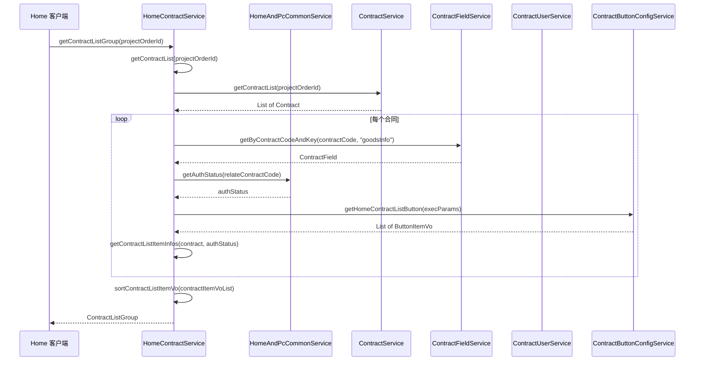
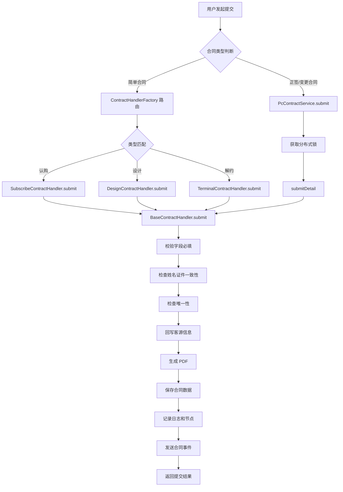
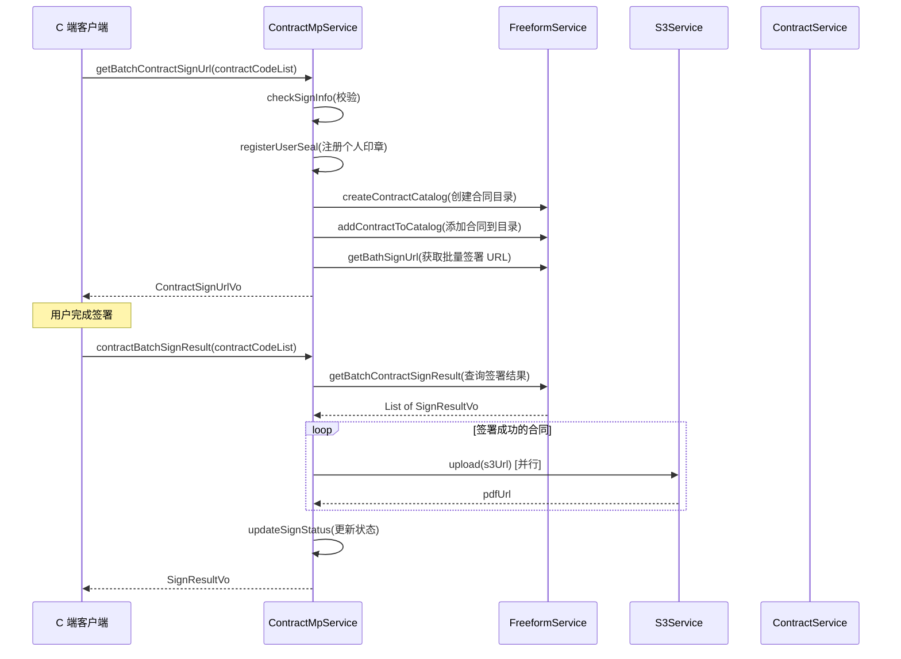
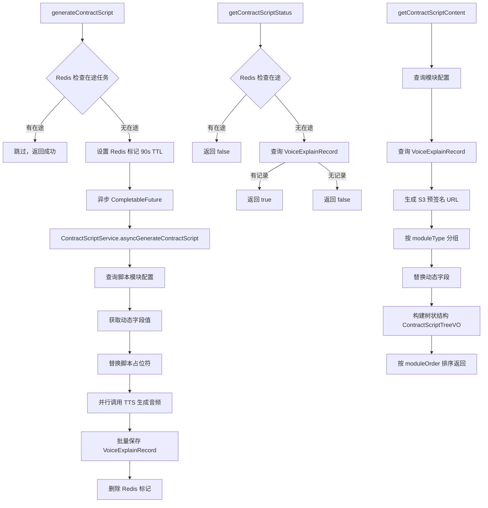
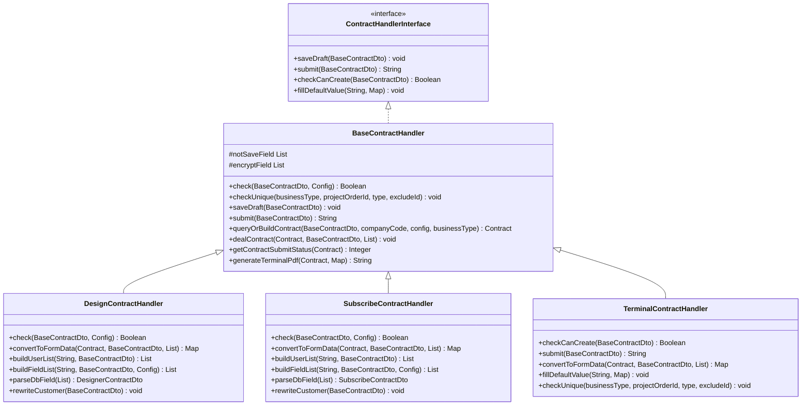
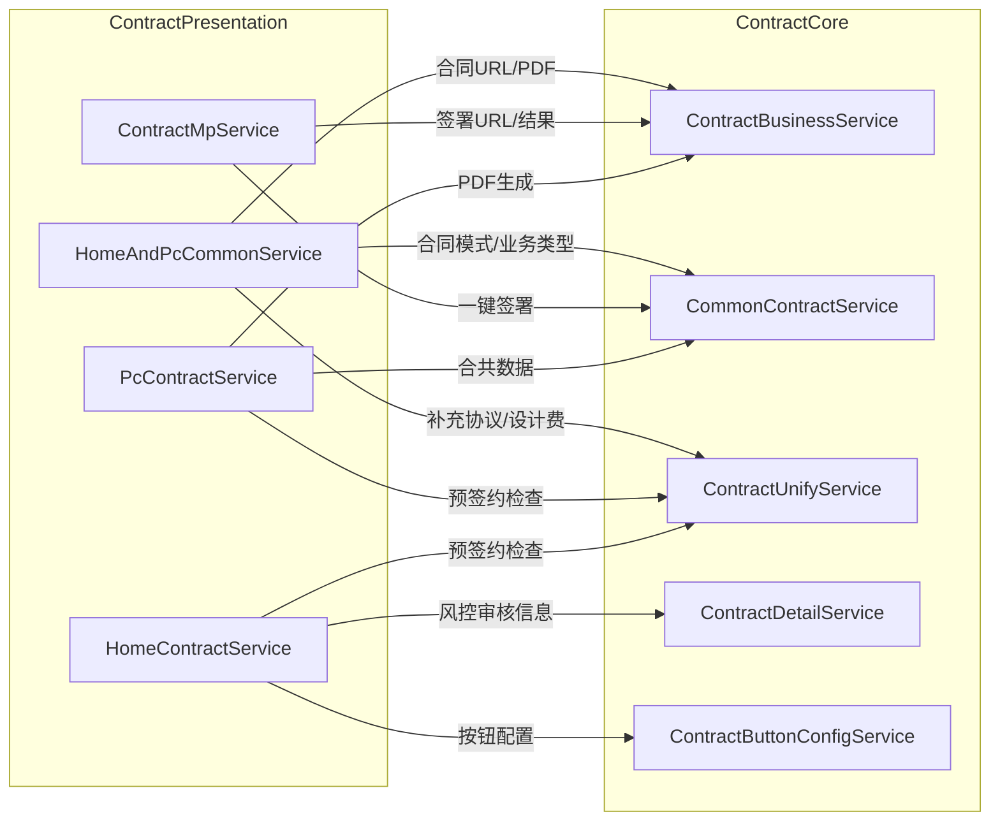
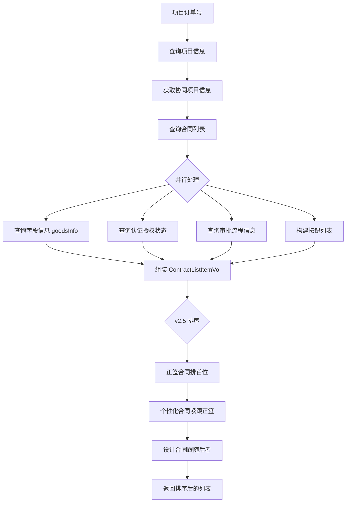
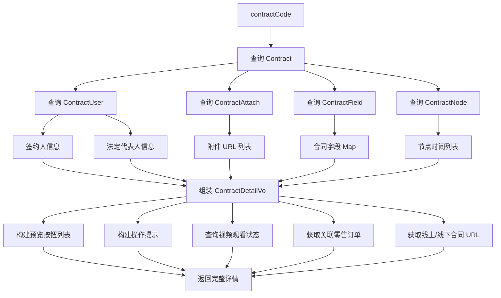
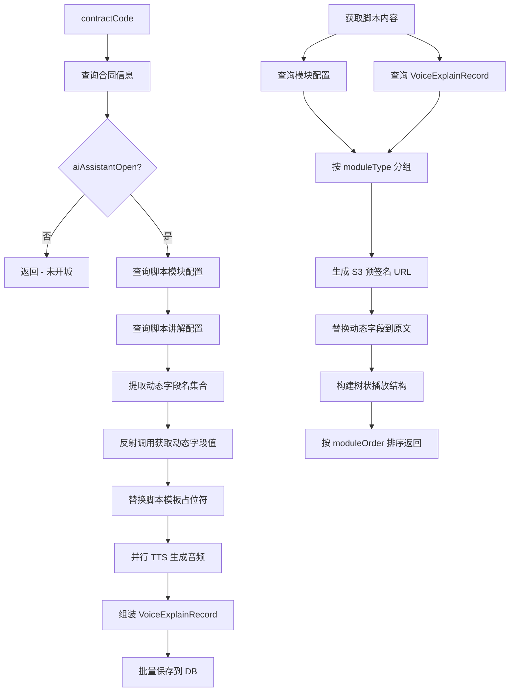

# ContractPresentation 模块文档

## 1. 模块概述

ContractPresentation 是合同系统的**展示与交互层**，负责为多端（Home 移动端、PC 管理端、小程序 C 端）提供合同的列表展示、详情查看、草稿保存、合同提交、按钮配置、智能体讲解等面向用户的核心能力。该模块是用户与合同系统交互的直接入口，承担着将底层合同数据（[ContractCore](ContractCore.md)）转换为前端可消费的展示形态的关键职责。

### 1.1 核心职责

| 职责域 | 说明 |
|--------|------|
| **合同列表展示** | 为 Home/PC 端提供合同类型列表、合同列表分组、分页查询等能力 |
| **合同详情展示** | 构建合同详情页数据，包括项目信息、签约信息、按钮列表、操作提示等 |
| **草稿保存与提交** | 支持分步草稿保存、一次性提交、分步提交等多种合同录入模式 |
| **按钮配置下发** | 根据合同状态、类型、用户角色动态生成操作按钮列表 |
| **智能体讲解** | 基于 AI 的合同讲解脚本异步生成、状态轮询、内容获取 |
| **小程序 C 端服务** | 合同摘要信息获取、批量签署 URL 获取、签署结果查询 |
| **短信服务** | 合同相关验证码的生成、发送和校验 |

### 1.2 端侧服务划分

```
┌─────────────────────────────────────────────────────┐
│                  ContractPresentation                │
│                                                     │
│  ┌──────────────┐  ┌──────────────┐  ┌───────────┐  │
│  │ Home 端服务   │  │  PC 端服务    │  │  C 端服务  │  │
│  │              │  │              │  │           │  │
│  │HomeContract  │  │PcContract    │  │ContractMp │  │
│  │  Service     │  │  Service     │  │  Service  │  │
│  └──────┬───────┘  └──────┬───────┘  └─────┬─────┘  │
│         │                 │                │        │
│         ▼                 ▼                ▼        │
│  ┌──────────────────────────────────────────────┐   │
│  │         HomeAndPcCommonService               │   │
│  │         (公共能力层)                          │   │
│  └──────────────────────────────────────────────┘   │
│                                                     │
│  ┌──────────────┐  ┌──────────────┐  ┌───────────┐  │
│  │ 智能体讲解    │  │ 短信服务      │  │ 合同处理  │  │
│  │              │  │              │  │ Handler   │  │
│  │ContractAgent │  │SmsService    │  │  策略模式  │  │
│  │  Service     │  │              │  │           │  │
│  └──────────────┘  └──────────────┘  └───────────┘  │
└─────────────────────────────────────────────────────┘
```

## 2. 架构设计

### 2.1 模块架构图

```mermaid
graph TD
    subgraph Controller_Layer[控制器层]
        HC[Home Controller]
        PC[PC Controller]
        MP[Mini Program Controller]
        AG[Agent Controller]
    end

    subgraph Presentation_Layer[ContractPresentation 展示层]
        HCS[HomeContractService]
        PCS[PcContractService]
        MPS[ContractMpService]
        HPCS[HomeAndPcCommonService]
        CAS[ContractAgentService]
        CSS[ContractScriptService]
        SMS[SmsService]
        CBF[ContractButtonConfigService]
    end

    subgraph Handler_Layer[合同处理策略层]
        HF[ContractHandlerFactory]
        BCH[BaseContractHandler]
        SCH[DesignContractHandler]
        SUBCH[SubscribeContractHandler]
        TCH[TerminalContractHandler]
        IF[ContractHandlerInterface]
    end

    subgraph Script_Layer[脚本构建层]
        CSBS[ContractScriptBuildService]
        CSCS[ContractScriptCreateService]
    end

    subgraph Core_Layer[ContractCore 核心层]
        CBS[ContractBusinessService]
        CCS[CommonContractService]
        CUS[ContractUnifyService]
        CDS[ContractDetailService]
    end

    subgraph Data_Layer[数据访问层]
        CS[ContractService]
        CFS[ContractFieldService]
        CUS2[ContractUserService]
        CAS2[ContractAttachService]
        CNS[ContractNodeService]
        CRS[ContractRelationService]
    end

    HC --> HCS
    PC --> PCS
    MP --> MPS
    AG --> CAS

    HCS --> HPCS
    HCS --> CBF
    HCS --> CUS
    PCS --> HPCS
    PCS --> CBF
    PCS --> CUS
    MPS --> CBS
    MPS --> HPCS
    MPS --> CSS

    CAS --> CSS
    CSS --> CSBS
    CSS --> CSCS

    HCS --> HF
    HF --> BCH
    HF --> SCH
    HF --> SUBCH
    HF --> TCH
    BCH -.->|implements| IF
    SCH -.->|extends| BCH
    SUBCH -.->|extends| BCH
    TCH -.->|extends| BCH

    HPCS --> CBS
    HPCS --> CCS
    HPCS --> CUS

    HCS --> CS
    HCS --> CFS
    HCS --> CUS2
    PCS --> CS
    PCS --> CFS
    PCS --> CUS2
    MPS --> CS
```



### 2.2 组件交互时序图 — Home 端合同列表查询



### 2.3 合同提交流程图



## 3. 核心组件详解

### 3.1 HomeContractService — Home 端合同服务

**职责**：为 Home 移动端提供合同列表、类型列表、详情、提交、草稿保存等全链路能力。

#### 核心方法

| 方法 | 说明 |
|------|------|
| `getContractListGroup` / `getContractListGroupV2` | 获取合同列表分组（整装 + 零售），并行请求两个子系统 |
| `getContractListPage` / `getContractListPageV2` | 按分组分页获取合同列表 |
| `getContractList` | 获取整装/搭售场景合同列表，组装完整的列表项信息（状态、按钮、关联关系等） |
| `getContractTypeList` / `getDecorateContractTypeList` | 获取可创建的合同类型列表，区分可创建/不可创建/已创建状态 |
| `contractDetail` | 获取合同详情，组装预览 URL、按钮列表、操作提示、视频观看状态等 |
| `submit` | 提交合同，使用 Redisson 分布式锁防重复提交 |
| `saveContractDraft` | 保存合同草稿 |
| `getContractListItemInfos` | 构建合同列表项展示信息（金额、编号、时间节点、认证状态等） |
| `sortContractListItemVo` | 对合同列表排序，将正签、个性化、设计合同按业务规则排列 |

#### 关键设计决策

- **并行请求优化**：`getContractListGroup` 和 `getContractTypeList` 使用 `CompletableFuture` 并行查询整装和零售合同，降低接口响应时间
- **分布式锁防重**：提交操作使用 `RedissonClient.getLock` 保证幂等性，锁粒度为 `contractCode` 或 `projectOrderId_type`
- **按钮配置化**：通过 `ContractButtonConfigService` 实现按钮的动态配置，避免硬编码
- **协同项目兼容**：通过 `CoordinationProjectInfo` 支持搭售场景下整装和零售项目的合同统一管理

### 3.2 HomeAndPcCommonService — Home/PC 公共合同服务

**职责**：为 Home 和 PC 两端提供公共的合同操作能力，包括 URL 获取、地址处理、合同撤销、权限校验等。

#### 核心方法分类

**URL 与展示**
- `getContractUrl` / `getAttachUrl` / `getContractPreviewUrl` — 获取合同/附件/预览 URL
- `getContractOnlineUrl` / `getContractOfflineUrl` / `getContractOnlineUrlForC` — 获取线上/线下合同 URL 列表
- `getShareUrl` — 生成微信/企微分享链接

**合同操作**
- `undoContract` — 撤销合同（含关联合同级联撤销、BPM 审批取消、产能预占回退）
- `deleteContract` — 删除草稿合同（含关联合同校验和报价单解绑）
- `applyStamp` / `applyStampFormField` — 申请用章（含身份证实名校验）

**校验与查询**
- `checkCanCreate` — 校验合同是否可创建（人员依赖、装修类型、报价状态等）
- `checkUnique` — 唯一性校验，防止重复创建
- `checkPermission` — 角色权限校验
- `getExpectContractAmount` — 查询预估合同金额

**数据处理**
- `reportContractSignAddress` — 合同签约地址上报（含门店/签约中心距离计算）
- `haversine` — Haversine 公式计算两点间地理距离
- `getShareUrl` — 复杂的分享链接生成逻辑（含视频观看检查、合并/单独发起判断）

### 3.3 PcContractService — PC 端合同服务

**职责**：为 PC 管理端提供合同类型列表、草稿保存（一次性/分步）、合同提交、详情查询等能力。

#### 核心流程 — 一次性提交 (`submit`)

```
获取分布式锁
  → 保存收款计划
  → 唯一性校验 + 创建校验 + 字段校验
  → 构建合同对象
  → 计算工期
  → 生成 PDF（线上合同）
  → 扣减产能预占
  → 回写客源信息
  → 保存合同/字段/用户/附件/材料/节点
  → 记录日志 + 发送事件
```

#### 特殊方法

- `buildFormalPackageContractFreeformDTO` — 构建正签合同 PDF 表单数据，处理报价单图片化、收款计划格式化、材料清单转换等复杂逻辑
- `getZqContractDetail` — 获取正签合同详情，组装完整的表单回填数据
- `getOperationLog` — 获取合同操作日志，支持 BPM 审核链接拼接

### 3.4 ContractMpService — 小程序 C 端服务

**职责**：为 C 端小程序提供合同摘要信息、批量签署、签署结果查询等能力。

#### 核心方法

| 方法 | 说明 |
|------|------|
| `getContractSummaryInfo` | 根据签约场景（正式/个性化）获取合同摘要信息，包含标题、合同列表、交易信息、服务描述 |
| `getBatchContractSignUrl` | 批量获取合同签署 URL，使用 FreeForm 协议平台创建合同目录并获取批量签署链接 |
| `contractBatchSignResult` | 查询批量签署结果，同步上传签署后的 PDF 到 S3 |
| `updateSignStatus` | 更新签署状态（事务性操作） |

#### 关键流程 — 批量签署



### 3.5 ContractAgentService — 合同智能体讲解服务

**职责**：提供 AI 驱动的合同讲解脚本异步生成、状态轮询和内容获取能力。

#### 核心流程



#### 依赖关系

- **ContractScriptService** — 脚本配置查询、动态字段替换、TTS 音频生成编排
- **ContractScriptBuildService** — 通过反射提供动态字段值（计划开工日期、工期、保修期、收款计划等）
- **ContractScriptCreateService** — 并行反射调用动态字段获取方法
- **S3Service** — 音频文件 URL 预签名

### 3.6 ContractScriptService — 合同讲解脚本服务

**职责**：管理合同讲解脚本的完整生命周期，包括异步生成、配置查询、动态字段替换、权限校验等。

#### 关键设计

- **动态字段机制**：脚本模板中使用 `${{fieldName}}` 占位符，运行时通过反射调用 `ContractScriptBuildService` 中的对应方法获取实际值
- **并行音频生成**：使用自定义线程池 `contractExplainExecutor` 并行调用 TTS 服务生成各段音频
- **开城控制**：`aiAssistantOpen` 方法综合判断 v2.5 流程、业务类型、黑名单、线下签约、开发商渠道等多个条件
- **树状结构**：`getContractScriptTree` 将音频记录按 `segmentOrder` 组装为链式树状结构，用于前端数字人播放

### 3.7 SmsService — 短信服务

**职责**：处理合同相关的短信验证码发送和校验。

- 生成 6 位随机验证码
- 通过 Redis 存储验证码（带过期时间）
- 调用 `SmsAPI` 发送短信
- 记录短信发送流水（加密存储手机号）
- 校验登录人与签约人一致性后才允许发送

### 3.8 合同处理策略 — Handler 模式

**职责**：通过策略模式处理不同合同类型（认购、设计、解约）的差异化逻辑。



**ContractHandlerFactory** 根据合同类型路由到对应 Handler：

| 合同类型 | Handler |
|----------|---------|
| 认购合同 (SUBSCRIBE) | SubscribeContractHandler |
| 设计合同 (DESIGN) | DesignContractHandler |
| 解约协议 (TERMINAL) | TerminalContractHandler |

## 4. 依赖关系

### 4.1 对 ContractCore 模块的依赖

ContractPresentation 重度依赖 [ContractCore](ContractCore.md) 提供的核心能力：



### 4.2 对其他模块的依赖

| 依赖模块 | 依赖服务 | 使用场景 |
|----------|----------|----------|
| [ContractChange](ContractChange.md) | ChangeContractService | 变更合同按钮列表、变更代理人判断 |
| [ContractPdf](ContractPdf.md) | ContractPdfBuildService | 讲解脚本动态字段获取（保修期等） |
| [ContractSigning](ContractSigning.md) | FreeformService | PDF 创建、印章盖章、签署结果查询 |
| [ContractConfig](ContractConfig.md) | ContractApolloConfig | 开城配置、按钮配置、视频配置等 |
| [ContractEvents](ContractEvents.md) | EventService | 合同提交/撤销/完成等事件发布 |

### 4.3 外部服务依赖

| 外部服务 | 说明 |
|----------|------|
| FreeForm 协议平台 | PDF 生成、印章盖章、签署链接获取 |
| S3 存储服务 | PDF/音频文件上传和 URL 预签名 |
| BPM 审批服务 | 审批流程发起和取消 |
| 产能日历服务 | 产能预占和回退 |
| TTS 语音服务 | 合同讲解音频生成 |
| Redis | 分布式锁、在途任务标记、验证码缓存、批量签署 URL 缓存 |
| MQ (Kafka/RocketMQ) | 合同事件消息、延时消息 |

## 5. 数据流

### 5.1 合同列表数据流



### 5.2 合同详情数据流



### 5.3 智能体讲解脚本数据流



## 6. 关键设计模式

### 6.1 策略模式 — 合同处理 Handler

`ContractHandlerFactory` + `ContractHandlerInterface` + `BaseContractHandler` 及其子类构成经典的策略模式。不同合同类型（认购、设计、解约）有差异化的校验规则、表单数据构建和提交逻辑，通过策略模式解耦。

### 6.2 工厂模式 — Handler 路由

`ContractHandlerFactory.getHandler()` 根据合同类型返回对应的 Handler 实例，`parseDbField()` 则根据类型将数据库字段反序列化为对应的 DTO。

### 6.3 模板方法模式 — BaseContractHandler

`BaseContractHandler` 定义了合同处理的标准流程（校验 → 构建 → 保存 → 提交 → 后处理），子类通过覆写 `check`、`convertToFormData`、`buildUserList`、`buildFieldList` 等方法实现差异化逻辑。

### 6.4 异步编排 — CompletableFuture

多个场景使用 `CompletableFuture` 实现并行化：
- `getContractListGroup` — 并行查询整装和零售合同
- `getContractTypeList` — 并行查询整装和零售合同类型
- `generateContractScript` — 并行生成多段 TTS 音频
- `getContractList` — 并行查询审批流程信息
- `contractBatchSignResult` — 并行上传签署后的 PDF

### 6.5 分布式锁 — 防重复提交

合同提交、草稿保存等写操作使用 Redisson 分布式锁，锁粒度为合同维度（`contractCode` 或 `projectOrderId_type`），超时 60 秒，防止并发重复提交。

### 6.6 反射 + 配置驱动 — 脚本动态字段

`ContractScriptCreateService` 通过 Java 反射机制，根据 `ScriptDynamicField` 表中的 `reflectMethod` 配置，动态调用 `ContractScriptBuildService` 中的方法获取字段值。这种设计使得新增动态字段只需：
1. 在 `ContractScriptBuildService` 中添加对应方法
2. 在配置表中注册方法名

### 6.7 AOP 切面 — 数据预处理

`ContractContextAspect` 和 `ContractDetailAspect` 通过 AOP 切面在合同提交/详情查询前自动预处理数据（项目信息、报价信息、图纸信息、托管信息等），将公共的数据准备工作从业务方法中抽离。

## 7. 关键枚举与常量

| 枚举 | 说明 |
|------|------|
| `ContractTypeEnum` | 合同类型（正签、变更、认购、设计、解约、个性化、补充等） |
| `ContractStatusEnum` | 合同状态（草稿、待提交审核、审核中、待公司盖章、待用户签署、待用户确认、已完成、已作废） |
| `SignChannelTypeEnum` | 签约渠道（线上、线下） |
| `UserSignTypeEnum` | 用户签署方式（签署、确认） |
| `ContractObjectTypeEnum` | 签约主体（个人、公司） |
| `BusinessTypeEnum` | 业务类型（家装、团装、翻新全案、局部装修等） |
| `ScriptModuleTypeEnum` | 讲解脚本模块类型（含对应图标） |
| `ScriptSceneTypeEnum` | 讲解脚本场景（合同讲解、合同问答） |

## 8. 模块间引用

| 引用文档 | 关系 |
|----------|------|
| [ContractCore](ContractCore.md) | 本模块依赖 ContractCore 提供的合同核心服务（CommonContractService、ContractBusinessService、ContractUnifyService 等） |
| [ContractChange](ContractChange.md) | 变更合同相关的按钮列表和代理人判断 |
| [ContractSubmission](ContractSubmission.md) | 合同提交后触发的事件由 Submission 模块消费 |
| [ContractPdf](ContractPdf.md) | PDF 生成能力及讲解脚本的动态字段来源 |
| [ContractSigning](ContractSigning.md) | 签署链接获取、印章盖章、签署结果查询 |
| [ContractConfig](ContractConfig.md) | 城市分公司配置、Apollo 动态配置、按钮配置 |
| [ContractEvents](ContractEvents.md) | 合同生命周期事件的发布与消费 |
| [ContractPrivacy](ContractPrivacy.md) | 敏感信息解密策略（查看 PDF 时的隐私解密） |
