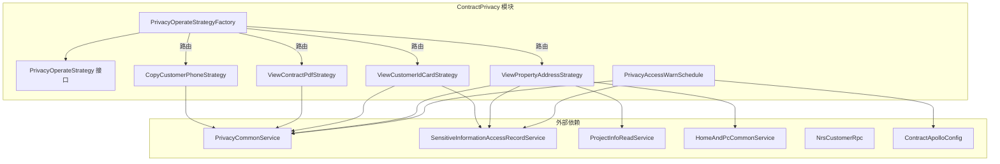
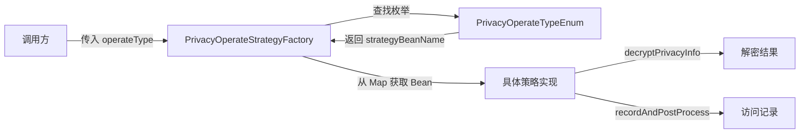
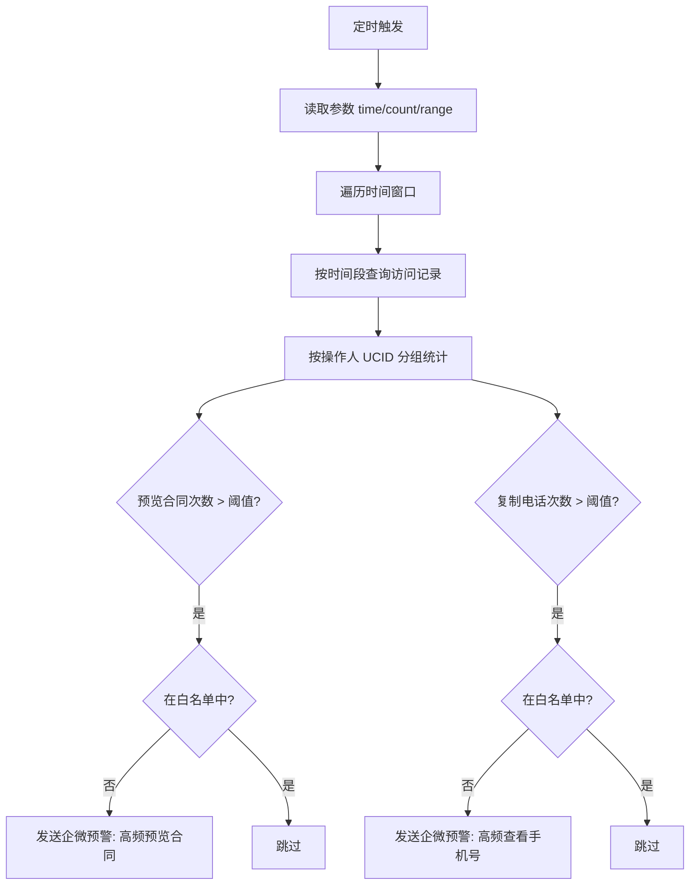
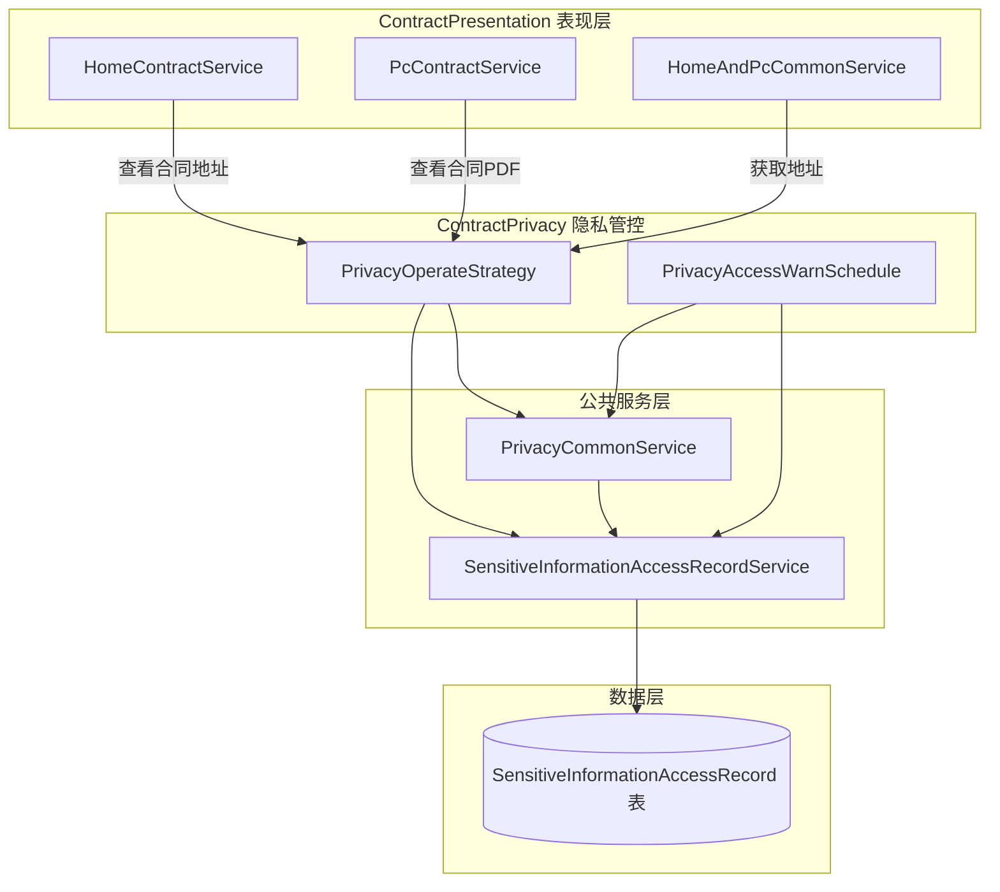

# ContractPrivacy 模块文档

## 模块概述

ContractPrivacy 是合同系统的**隐私数据访问管控模块**，负责在合同业务流程中对敏感信息（客户电话、身份证号、房产地址、合同PDF）的访问进行统一的安全管控。模块采用**策略模式**对不同类型的隐私操作进行差异化处理，并通过**访问记录 + 频率预警**双重机制保障数据安全合规。

模块核心解决两个问题：
1. **访问可追溯**：每次敏感信息访问都记录操作人、操作类型、时间等关键信息
2. **异常可预警**：通过定时任务扫描访问日志，对高频访问行为触发企微预警通知

## 系统架构

## 核心设计模式：策略模式

ContractPrivacy 模块的核心设计模式是**策略模式（Strategy Pattern）**，通过 `PrivacyOperateStrategy` 接口统一定义隐私操作的行为契约，由具体策略实现类处理不同类型的操作。

### 策略接口

`PrivacyOperateStrategy` 接口定义了两个核心方法：

| 方法 | 职责 | 说明 |
|------|------|------|
| `decryptPrivacyInfo(PrivateDataAccessDTO)` | 解密隐私信息 | 根据操作类型返回脱敏/解密后的信息，部分策略返回 null 表示无需解密 |
| `recordAndPostProcess(PrivateDataAccessDTO)` | 记录并后处理 | 记录访问行为，部分策略额外触发实时预警 |

### 策略工厂

`PrivacyOperateStrategyFactory` 实现 `ApplicationContextAware` 接口，在 Spring 容器启动时自动扫描所有 `PrivacyOperateStrategy` 类型的 Bean 并注册到 Map 中。运行时通过 `PrivacyOperateTypeEnum` 枚举值路由到对应策略。

## 四种隐私操作策略详解

### 策略对照表

| 策略类 | 操作类型 | 解密能力 | 记录方式 | 后处理特点 |
|--------|----------|----------|----------|------------|
| `CopyCustomerPhoneStrategy` | 复制客户电话 | 无（返回null） | `recordAndWarn` 实时记录+预警 | 每次操作触发企微预警 |
| `ViewContractPdfStrategy` | 查看合同PDF | 无（返回null） | `recordAndWarn` 实时记录+预警 | 每次操作触发企微预警 |
| `ViewCustomerIdCardStrategy` | 查看客户身份证 | 无（返回null） | DB 插入访问记录 | 仅记录，由定时任务批量预警 |
| `ViewPropertyAddressStrategy` | 查看房产地址 | **有**（返回真实地址） | DB 插入访问记录 | 仅记录，由定时任务批量预警 |

### 策略分层说明

策略按记录方式分为两类：

**实时预警型**（CopyCustomerPhone、ViewContractPdf）：
- 调用 `PrivacyCommonService.recordAndWarn()` 进行记录
- 每次操作即触发预警判断

**延迟预警型**（ViewCustomerIdCard、ViewPropertyAddress）：
- 通过 `SensitiveInformationAccessRecordService.insert()` 将记录写入数据库
- 由定时任务 `PrivacyAccessWarnSchedule` 周期性扫描并批量预警

### ViewPropertyAddressStrategy 特殊逻辑

ViewPropertyAddressStrategy 是唯一实现了 `decryptPrivacyInfo` 返回实际数据的策略：
1. 通过 `ProjectInfoReadService.getByProjectOrderIdWithoutCache()` 查询项目信息（不走缓存，确保数据实时性）
2. 调用 `HomeAndPcCommonService.getAddress()` 获取真实房产地址
3. 所有操作在 `@Transactional` 事务保护下执行

## 定时预警机制

### PrivacyAccessWarnSchedule

定时任务 `PrivacyAccessWarnSchedule` 是隐私访问管控的第二道防线，负责批量扫描访问记录并对高频行为发出预警。

**参数说明：**

| 参数 | 默认值 | 含义 |
|------|--------|------|
| `time` | 100 | 统计时间窗口（分钟） |
| `count` | 10 | 触发预警的访问次数阈值 |
| `range` | 2 | 滑动窗口范围（扫描 range 个时间段） |

**预警规则：**
- 统计时间范围：`当前时间 - (i+1)*time 分钟` 到 `当前时间 - i*time 分钟`
- 分别统计合同PDF预览和客户电话复制的操作次数
- 超过阈值且不在白名单中的操作人触发企微通知
- 预警消息示例：`【高频预览合同】「张三UCID001」，近100分钟预览合同数15份`

## 数据模型

### PrivateDataAccessDTO（隐私访问请求入参）

封装一次隐私数据访问请求的上下文信息，作为所有策略方法的入参。

核心字段包括：
- `projectOrderId` — 项目订单ID（用于定位项目信息和业务上下文）
- `operatorUcid` — 操作人UCID（用于记录和统计）
- `operatorName` — 操作人姓名（用于预警消息展示）
- `operationType` — 操作类型（对应 `PrivacyOperateTypeEnum`）

### SensitiveInformationAccessRecord（敏感信息访问记录）

持久化到数据库的访问日志记录，字段包含：
- `operatorUcid` — 操作人UCID
- `operatorName` — 操作人姓名
- `operationType` — 操作类型编码
- `ctime` — 访问时间

## 与系统其他模块的关系

| 相关模块 | 交互方式 | 说明 |
|----------|----------|------|
| [ContractPresentation](ContractPresentation.md) | 调用方 | 用户在合同列表/详情页查看敏感信息时触发隐私策略 |
| [ContractCore](ContractCore.md) | 共享枚举 | 使用 `PrivacyOperateTypeEnum` 定义操作类型 |
| [ContractEvents](ContractEvents.md) | 间接关联 | Kafka 事件中的合同操作可能间接触发隐私访问 |
| [ContractConfig](ContractConfig.md) | 配置提供 | `ContractApolloConfig` 提供预警白名单等配置 |

## 关键实现细节

### 1. 事务管理

- `ViewCustomerIdCardStrategy.recordAndPostProcess()` 和 `ViewPropertyAddressStrategy` 的两个方法均使用 `@Transactional` 注解，确保访问记录写入的原子性
- `ViewPropertyAddressStrategy.decryptPrivacyInfo()` 查询项目信息时使用 `getByProjectOrderIdWithoutCache()`，避免缓存导致的数据不一致

### 2. 策略路由机制

`PrivacyOperateStrategyFactory` 通过以下步骤完成路由：
1. Spring 容器启动时，`setApplicationContext()` 扫描所有 `PrivacyOperateStrategy` Bean 存入 Map（key 为 Bean 名称）
2. 调用时通过 `PrivacyOperateTypeEnum.getEnumByType(type)` 将整数操作类型转为枚举
3. 从枚举中获取 `strategy` 属性（Bean 名称），从 Map 中获取对应策略实例

### 3. 预警白名单

定时任务中的预警判断包含白名单校验（`contractApolloConfig.getWarnWhiteList()`），白名单中的 UCID 不触发企微通知，避免内部测试或特殊角色的误报。白名单配置通过 Apollo 动态配置中心管理。

### 4. 扩展性

新增隐私操作类型只需：
1. 在 `PrivacyOperateTypeEnum` 中添加枚举值并关联策略 Bean 名称
2. 创建新的 `PrivacyOperateStrategy` 实现类并标注 `@Service`
3. 无需修改工厂类或其他策略，符合开闭原则
