# ContractSigning 模块文档

## 1. 模块概述

ContractSigning 是合同系统中负责**合同签署流程**的核心模块，涵盖从签署前的视频观看与人脸认证、对公签约授权协议生成、PDF 盖章，到个性化合同关联关系管理、多主体报价签约源路由等完整签署链路。该模块作为 ContractSubmission（合同提交）的下游，在合同提交成功后通过事件驱动机制被触发，负责执行实际的签署操作。

### 核心职责

| 职责 | 关键服务 | 说明 |
|------|---------|------|
| 签署视频管理 | `ContractVideoService` | 签约前视频观看状态判定、视频跳转链接获取、观看记录提交 |
| 人脸身份认证 | `FaceAuthService` | 签署前活体人脸认证，校验签署人身份真实性 |
| 协议平台集成 | `FreeformService` | 对接第三方 Freeform 协议平台，统一处理实例创建、表单提交、PDF 生成、盖章、签署 |
| 对公签约授权 | `ContractCompanySignService` | 对公线上签约场景下自动生成授权协议书，管理法人授权流程 |
| 自主盖章 | `ContractSelfSealService` | 支持业务人员自主上传文件并盖电子章，异步处理盖章任务 |
| 正签合同重签 | `FormalReSignService` | 处理 2.0→2.5 订单模式迁移场景下正签合同的重签逻辑 |
| 多主体报价管理 | `FormalMultipleCompanyService` | 正签发起时管理多分公司 C 报价与协同报价的选择 |
| 个性化合同关联 | `PersonalRelationHandler` | 处理个性化合同与报价单/S 单的绑定关系撤回与解绑 |
| 签约源路由 | `ContractSigningSourceRouter` | 策略路由，按绑定类型（报价单/子订单/变更单）分发签约数据构建逻辑 |

---

## 2. 模块架构

### 2.1 整体架构图

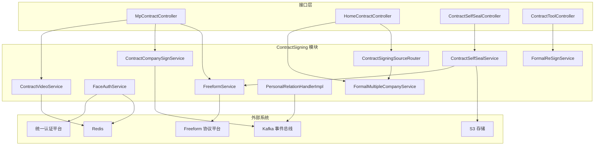

### 2.2 模块间依赖关系

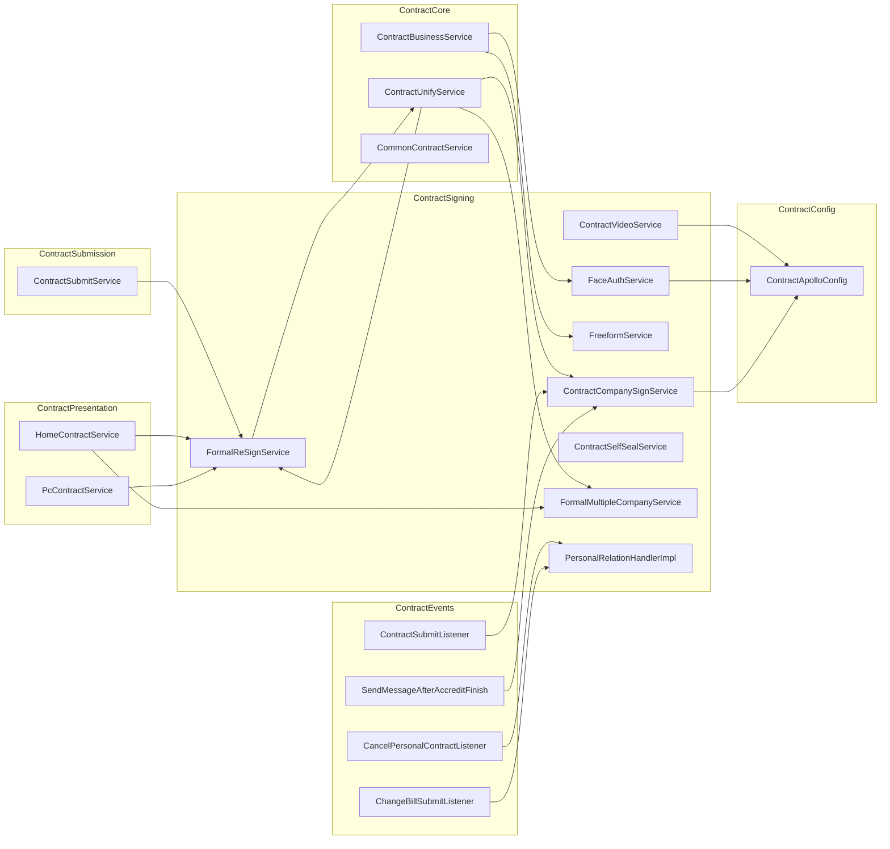

---

## 3. 核心组件详解

### 3.1 FreeformService — 协议平台集成层

`FreeformService` 是整个 ContractSigning 模块中被引用最广泛的服务（13+ 个服务依赖），作为系统与第三方 Freeform 协议平台之间的统一集成层，封装了所有平台交互操作。

#### 功能矩阵

| 功能分类 | 方法 | 说明 |
|---------|------|------|
| **实例管理** | `createInstance` | 创建协议平台表单实例 |
| | `submit` | 提交表单数据至协议平台 |
| | `uploadPdfForInstance` | 按实例 ID 上传 PDF |
| **PDF 生成** | `createPdf` | 根据实例和表单生成合同 PDF，支持水印 |
| **盖章操作** | `companySeal` / `multiCompanySeal` | 同步盖公司章（单主体/多主体） |
| | `companySealAsync` / `multiCompanySealAsync` | 异步盖公司章 |
| | `queryContractSealResult` | 查询异步盖章结果 |
| **签署操作** | `getSignUrl` | 获取用户手签 URL |
| | `getContractSignResult` / `getBatchContractSignResult` | 查询个人手签结果（单个/批量） |
| | `getCompanyContractSignResult` | 查询公对公手签结果 |
| | `getBathSignUrl` | 批量获取手签链接（通过合同目录） |
| **授权操作** | `getCompanySignUrl` | 获取公司授权链接 |
| | `getCompanyAccreditResult` | 查询公司授权结果 |
| | `checkCompanyRegister` | 校验分公司是否注册 |
| **目录管理** | `createContractCatalog` / `addContractToCatalog` | 创建和管理合同目录 |
| **元数据查询** | `queryCustomForm` | 查询协议版式信息 |
| | `queryNewSealConfigs` | 查询签章规则 |
| | `getFormKeyByInstanceId` / `getFormIdByInstanceId` | 通过实例查询板式信息 |
| **企业实名** | `getCompanyRealNameInfo` / `getCompanyRealNameInfoWithCache` | 获取企业实名认证信息 |
| | `getCompanyAuthenticationRes` | 获取企业实名认证结果 |

#### 签章类型

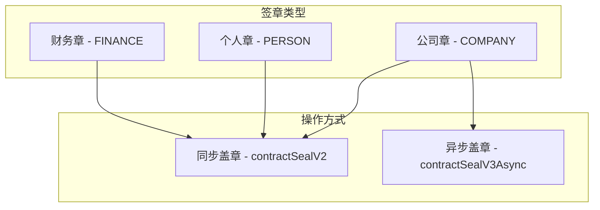

---

### 3.2 ContractVideoService — 签约视频管理

负责管理合同签署前的视频观看流程，确保用户在签署前完成必要的视频观看环节。

#### 视频观看判定逻辑

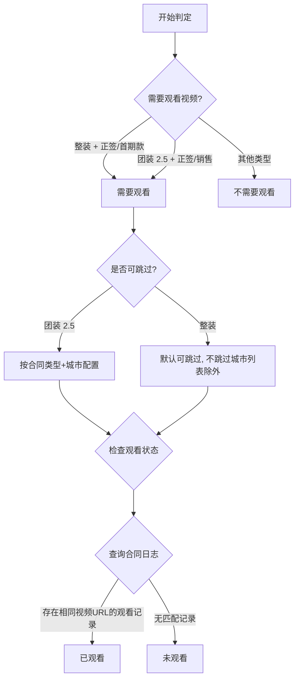

#### 核心方法说明

| 方法 | 功能 |
|------|------|
| `getContractVideo` | 获取视频初始化信息，包含视频链接、观看状态、是否可跳过、签约跳转 Schema |
| `needWatchVideo` | 根据业务类型+合同类型判定是否需要观看视频 |
| `getWatchStatusNew` | 按视频链接维度（而非项目维度）判定观看状态，支持不同合同类型不同视频 |
| `getCanSkipWatch` | 按城市和合同类型配置判定是否允许跳过视频 |
| `submitVideo` | 提交视频观看完成记录到 ContractLog 表 |
| `getVideoSkipUrlNew` | 多级配置获取视频跳转地址：城市维度 > 通用维度 |

#### 观看状态判定改进（V2）

V1 版本按**项目维度**判定观看状态——同一项目下任一合同看过视频即视为完成。V2（`getWatchStatusNew`）改为按**视频链接维度**判定——不同合同类型可能配置不同视频 URL，只有当前合同对应的视频 URL 有观看记录才视为完成。

---

### 3.3 FaceAuthService — 人脸身份认证

在签署前为用户提供人脸活体认证，增强签署安全性。仅被 `ContractBusinessService` 调用。

#### 认证流程

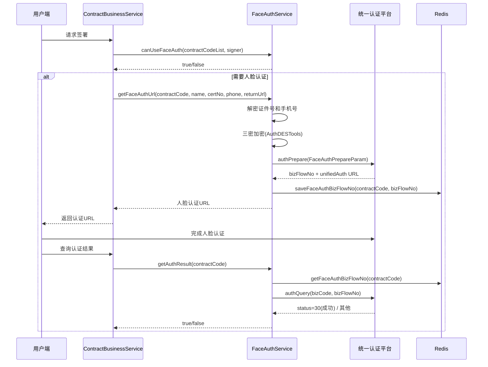

#### 适用条件

人脸认证需同时满足以下所有条件：

| 条件 | 说明 |
|------|------|
| 非白名单项目 | `projectOrderId` 不在 `faceAuthWhiteLists` 中 |
| 整装业务 | `businessType` 为 HOUSE_CERTIFICATE |
| 2.5 流程 | `processV25` 为 true |
| 身份证 | `certificateType` 为 ID_CARD |
| 正式签署 | `userSignType` 为 SIGN |
| 开城城市 | `gbCode` 在 `faceAuthOpenCity` 列表中 |
| 支持合同类型 | `contractType` 在 `faceAuthContractTypes` 列表中 |

---

### 3.4 ContractCompanySignService — 对公签约授权

处理对公线上签约场景下的授权协议书自动生成和管理。核心逻辑是在主合同提交后，为对公（公司）签约场景自动生成授权协议书供法人签署。

#### 授权协议书生成流程

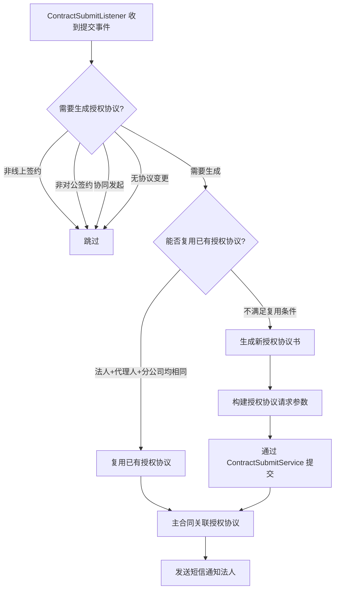

#### 授权协议复用条件

`getExistCanRelatedAcreditContract` 方法判定是否可复用已有授权协议，需同时满足：

1. 主合同与授权协议的**乙方分公司**（companyCode）相同
2. 主合同与授权协议的**甲方分公司**（companyCreditCode）相同
3. **法人证件号**相同
4. **代理人证件号**相同（或均无代理人）

---

### 3.5 ContractSelfSealService — 自主盖章服务

支持业务人员在 PC 端自主上传文件（PDF 或图片），由系统自动盖电子章后返回盖章文件。

#### 盖章流程

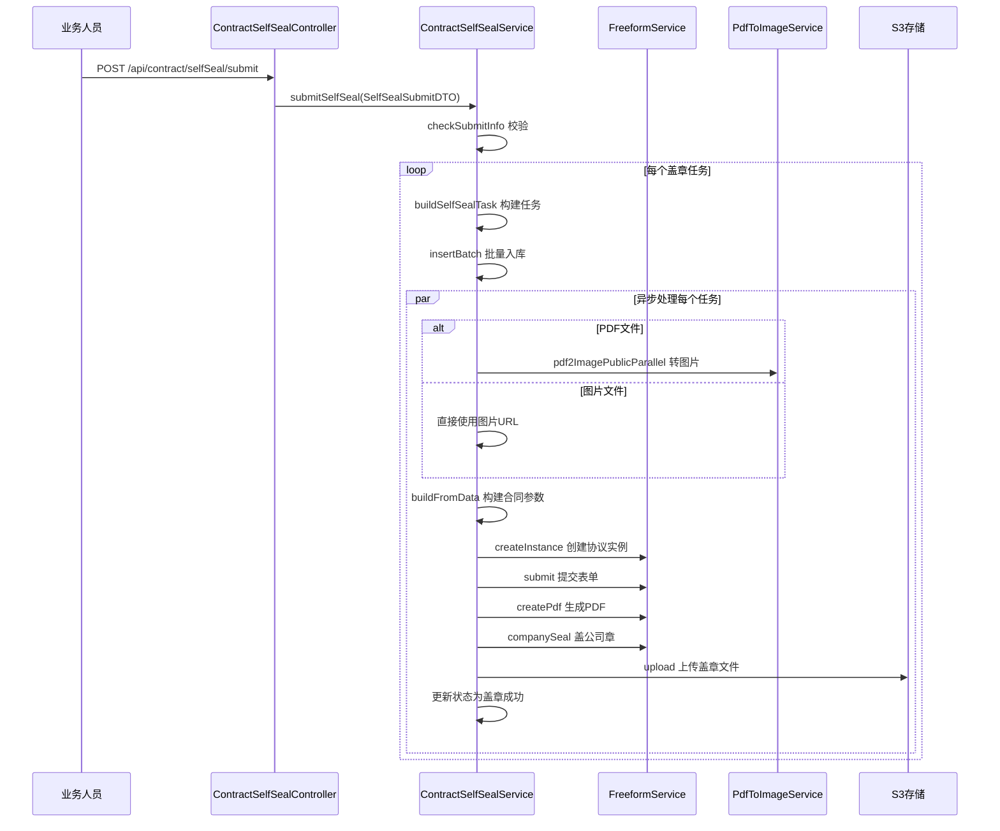

---

### 3.6 FormalReSignService — 正签合同重签

处理 2.0→2.5 订单模式迁移场景下正签合同的重签信息获取与判断。

#### 场景说明

当项目从 2.0 订单模式刷数为 2.5 模式后，原有的 2.0 正签合同需要特殊处理：

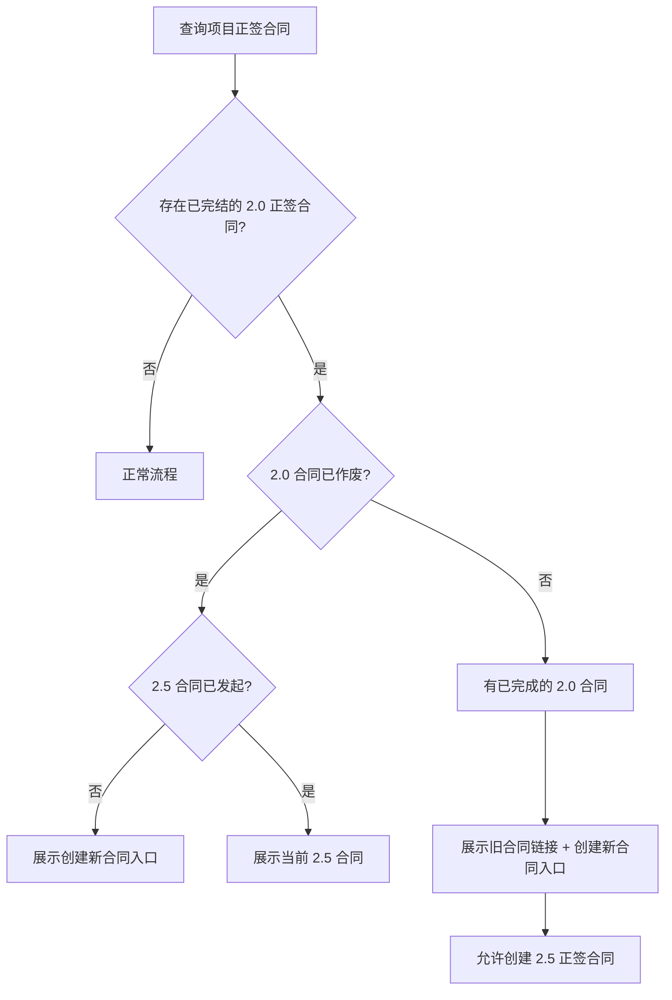

#### 核心判断方法

| 方法 | 功能 |
|------|------|
| `haveHistoricalContract` | 判断是否存在刷数前发起的 2.0 正签合同（通过比较刷数时间和合同发起节点时间） |
| `isCancelHistoricalContract` | 判断历史正签合同是否已被作废 |
| `newContractLaunch` | 判断 2.5 模式下新合同是否已发起（发起时间在刷数之后） |
| `formalContractUnique` | 正签合同唯一性校验，防止重复创建 |
| `historicalContractLink` | 获取历史正签合同的详情链接 |

---

### 3.7 FormalMultipleCompanyService — 多主体报价管理

正签发起时，管理多分公司 C 报价与协同报价的选择逻辑。

#### 报价数据来源

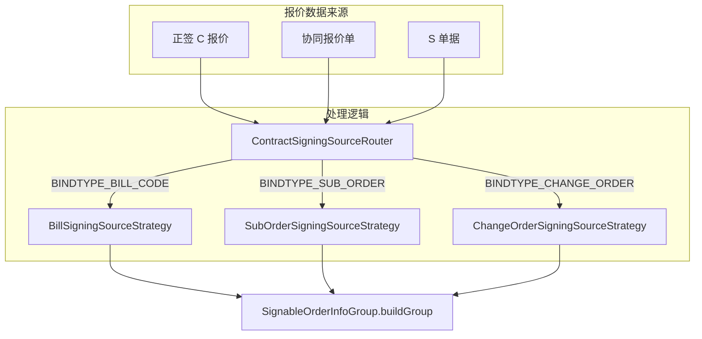

#### V2 签约源路由（`ContractSigningSourceRouter`）

采用策略模式，按绑定类型路由到不同的签约源策略：

| 策略 | 绑定类型 | 数据来源 |
|------|---------|---------|
| `BillSigningSourceStrategy` | 报价单号 (BILL_CODE) | 从报价系统获取可签约的 C 报价单 |
| `SubOrderSigningSourceStrategy` | 子订单号 (SUB_ORDER) | 从订单中心获取可签约的 S 单 |
| `ChangeOrderSigningSourceStrategy` | 变更单号 (CHANGE_ORDER) | 从变更系统获取可签约的变更单 |

每个策略统一实现 `ContractSigningSource` 接口，提供 `buildSignableOrderInfos`、`checkPersonalCanCreate`、`buildGoodsInfo` 等方法。

---

### 3.8 PersonalRelationHandler — 个性化合同关联关系处理

处理个性化合同与报价单/S 单的绑定关系撤回操作，由 Kafka 事件驱动。

#### 撤回流程

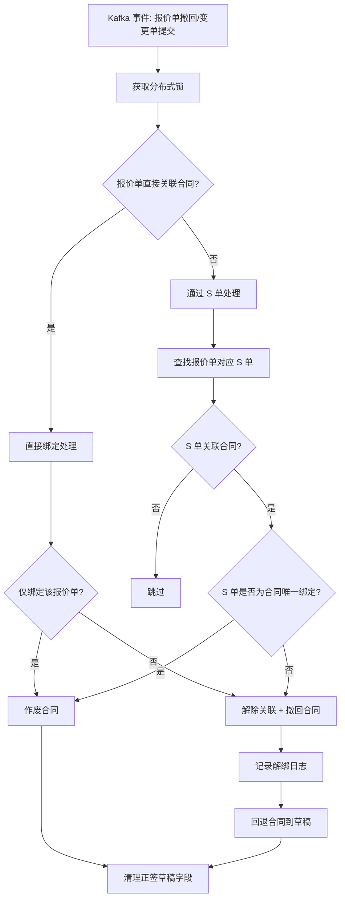

#### 操作类型枚举

| 操作 | 说明 |
|------|------|
| `CANCEL_CONTRACT` | 作废合同（合同仅绑定被撤回的单据） |
| `UNBIND_AND_UNDO` | 解除关联并撤回合同（合同还绑定了其他单据） |
| `SKIP` | 跳过处理（合同处于无效/终态） |

---

### 3.9 JiaFangAgentSupportConfig / SupportWatchVideoConfig — 配置 DTO

| 配置类 | 用途 |
|--------|------|
| `JiaFangAgentSupportConfig` | 甲方代理人签章配置：控制支持城市、合同类型、业务类型、白名单项目（始终走旧逻辑使用甲方签章） |
| `SupportWatchVideoConfig` | 签约视频开关配置：按业务类型+城市维度控制视频功能是否开启 |

---

## 4. 事件驱动交互

ContractSigning 模块与 ContractEvents 模块深度集成，通过 Kafka 事件实现异步解耦。

### 4.1 事件交互时序图

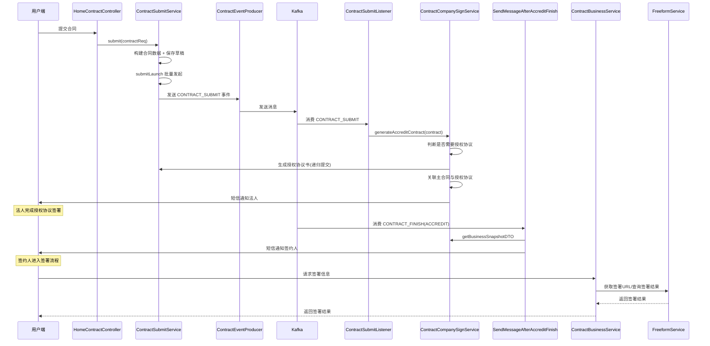

### 4.2 关键事件监听器

| 监听器 | 监听事件 | 行为 |
|--------|---------|------|
| `ContractSubmitListener` | CONTRACT_SUBMIT | 触发授权协议生成（`generateAccreditContract`）、取消历史个性化合同关联 |
| `SendMessageAfterAccreditFinish` | CONTRACT_FINISH (ACCREDIT) | 授权协议签署完成后发送短信通知签约人 |
| `CancelPersonalContractListener` | 合同取消事件 | 调用 `PersonalRelationHandler.revokeCooperQuotation` 解绑关联关系 |
| `ChangeBillSubmitListener` | 变更单提交事件 | 调用 `PersonalRelationHandler.revokeCooperQuotation` 处理变更场景关联 |
| `BillToSubOrderListener` | 报价单换绑事件 | 处理报价单与 S 单的合同关联换绑 |

---

## 5. 数据流

### 5.1 签署前数据准备流

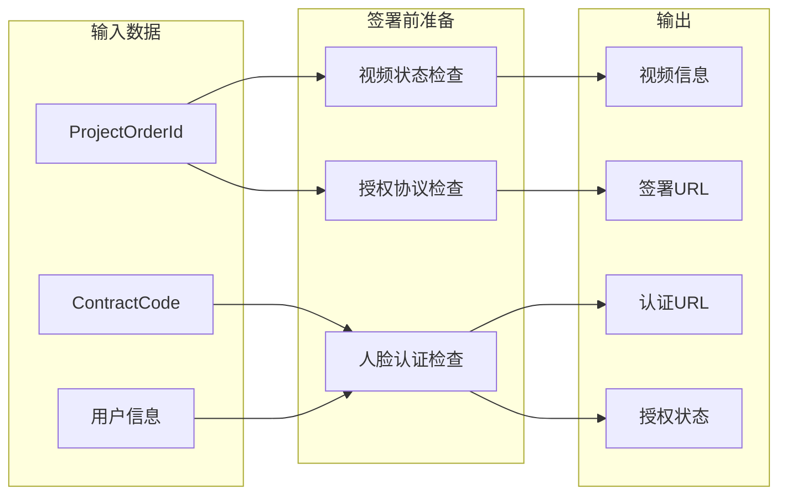

### 5.2 PDF 盖章数据流

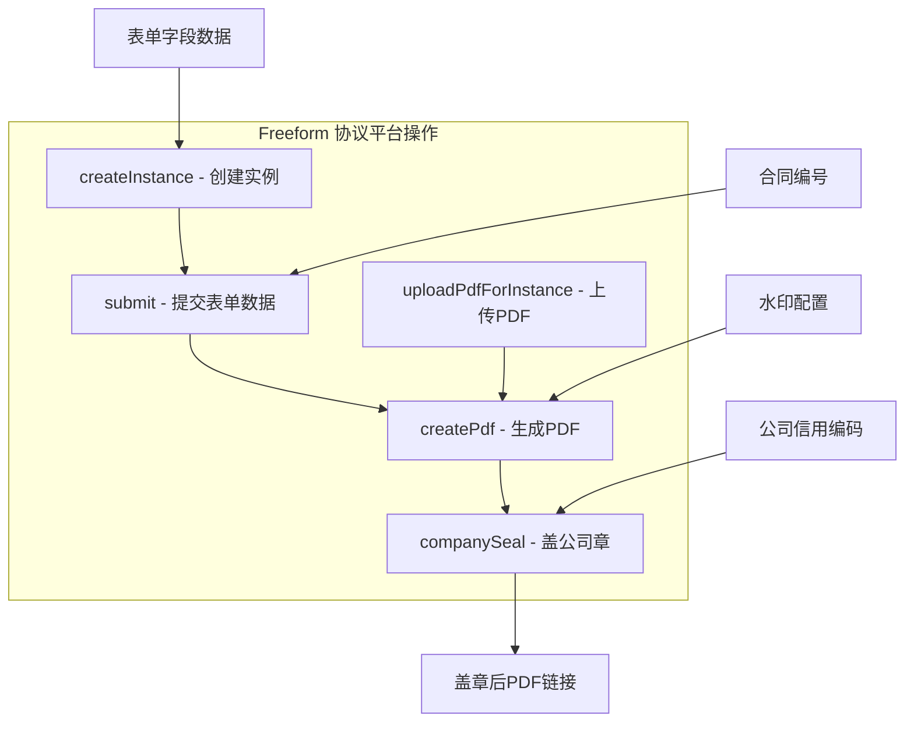

---

## 6. 关键设计模式

### 6.1 策略模式

模块中大量使用策略模式实现可扩展的业务逻辑分发：

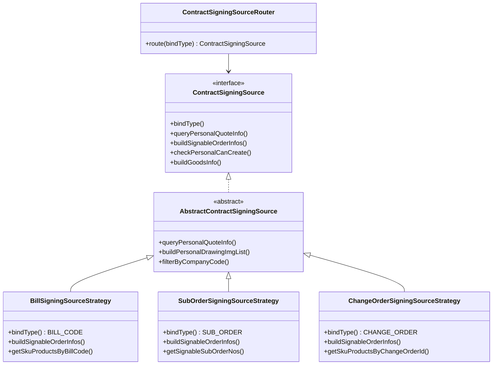

### 6.2 事件驱动模式

模块通过 Kafka 事件实现与其他模块的解耦：

- **发布者**：`ContractSubmitService` 在合同提交成功后发布 `CONTRACT_SUBMIT` 事件
- **消费者**：`ContractSubmitListener` 消费事件后调用 `ContractCompanySignService` 生成授权协议
- **效果**：合同提交与授权协议生成异步解耦，提交不阻塞

### 6.3 模板方法模式

`PersonalRelationHandlerImpl` 中的撤回流程采用类似模板方法的结构：

1. **加锁** → 2. **判断绑定类型** → 3. **确定操作类型** → 4. **执行撤回** → 5. **清理字段**

`executeRevocationAction` 根据 `ContractRevocationAction` 枚举分发到不同的具体操作（作废/解绑撤回/跳过）。

### 6.4 配置驱动模式

通过 Apollo 配置中心（`ContractApolloConfig`）实现业务规则的动态配置：

| 配置项 | 影响范围 |
|--------|---------|
| 视频跳转地址 | `ContractVideoService` 按城市+业务类型+合同类型+小程序类型+开渠维度配置 |
| 人脸认证开城 | `FaceAuthService` 按城市和合同类型控制认证功能 |
| 自主盖章分公司 | `ContractSelfSealService` 按系统号和分公司控制权限 |
| 甲方代理人配置 | `JiaFangAgentSupportConfig` 按城市和项目控制签章类型 |

---

## 7. API 端点汇总

### 7.1 小程序端（MpContractController）

| 端点 | 方法 | 说明 |
|------|------|------|
| `/mp/contract/video/query` | GET | 获取合同视频初始化信息 |
| `/mp/contract/video/submit` | GET | 提交视频观看完成 |
| `/mp/contract/contractAuthList/v2` | GET | 获取授权协议列表（C 端） |
| `/mp/contract/getContractAuthInfo` | GET | 获取授权协议详情 |
| `/mp/contract/canSign/V2` | GET | 检查合同是否可签署 |
| `/mp/contract/signLocationReport` | POST | 上报签署位置信息 |

### 7.2 自主盖章端（ContractSelfSealController）

| 端点 | 方法 | 说明 |
|------|------|------|
| `/api/contract/selfSeal/companyInfos` | GET | 获取可盖章分公司列表 |
| `/api/contract/selfSeal/submit` | POST | 提交自主盖章请求 |
| `/api/contract/selfSeal/getList` | GET | 查询盖章任务列表（分页） |
| `/api/contract/selfSeal/reSeal` | GET | 重新触发盖章 |

---

## 8. 关联模块文档

| 模块 | 关系 | 说明 |
|------|------|------|
| [ContractCore](ContractCore.md) | 上游 | 提供合同基础数据模型（Contract、ContractUser、ContractField 等）和核心服务（CommonContractService、ContractBusinessService、ContractUnifyService） |
| [ContractSubmission](ContractSubmission.md) | 上游 | 合同提交模块，提交成功后通过 Kafka 事件触发本模块的授权协议生成 |
| [ContractPresentation](ContractPresentation.md) | 调用方 | HomeContractService 和 PcContractService 调用本模块的 FormalReSignService 和 FormalMultipleCompanyService |
| [ContractEvents](ContractEvents.md) | 事件总线 | 提供 Kafka 事件监听器，驱动本模块的异步流程 |
| [ContractConfig](ContractConfig.md) | 配置源 | ContractApolloConfig 提供视频、人脸认证、盖章等配置 |
| [ContractPdf](ContractPdf.md) | PDF 生成 | 与本模块的 FreeformService 协作完成 PDF 生成和盖章 |
