# ContractSigning 模块文档

## 模块概述

ContractSigning 是合同系统（ContractCore）的签约执行子模块，负责合同签约阶段的核心业务操作。该模块包含两个核心服务：

- **ContractCompanySignService**：对公签约服务，处理企业对公线上签约场景下的授权协议书生成、授权列表查询、签约信息获取等业务逻辑。
- **ContractSelfSealService**：自主盖章服务，支持内部运营人员上传 PDF 或图片文件，通过 Freeform 平台生成合同 PDF 并加盖电子印章。

该模块位于合同生命周期的中后段，承接 [ContractSubmission](ContractSubmission.md) 模块提交的合同数据，在合同进入待签署状态后，由签约服务驱动授权协议生成和电子签章流程。

---

## 系统架构

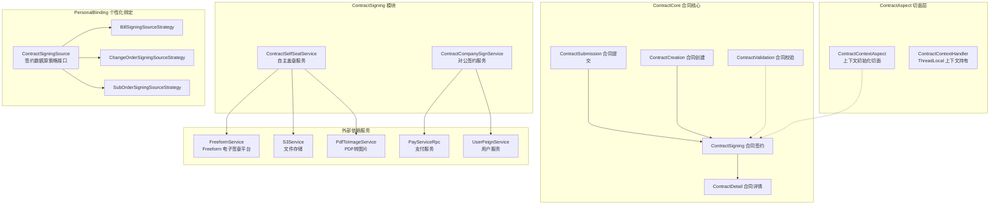

---

## 核心组件详解

### ContractCompanySignService — 对公签约服务

对公签约服务处理企业客户的线上签约场景，核心职责包括**授权协议书生命周期管理**和**C 端授权列表查询**。

#### 职责划分

| 方法 | 职责 | 状态 |
|------|------|------|
| `generateAccreditContract` | 生成/复用授权协议书并关联合同 | @Deprecated |
| `getContractAuthList` | B 端授权协议列表查询 | @Deprecated |
| `getAccreditContractList` | C 端授权协议列表查询（当前主力接口） | 活跃 |
| `getContractAuthInfo` | 获取单个授权协议详情及签约链接 | 活跃 |
| `getBusinessSnapshotDTO` | 构建提醒业务快照 | 活跃 |

#### 授权协议书生成流程

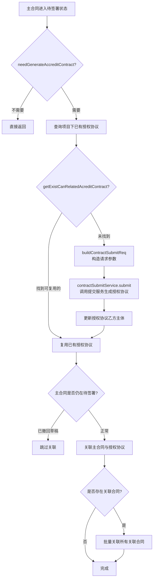

#### 授权协议复用判断逻辑

`getExistCanRelatedAcreditContract` 方法通过四重匹配判断是否可复用已有授权协议：

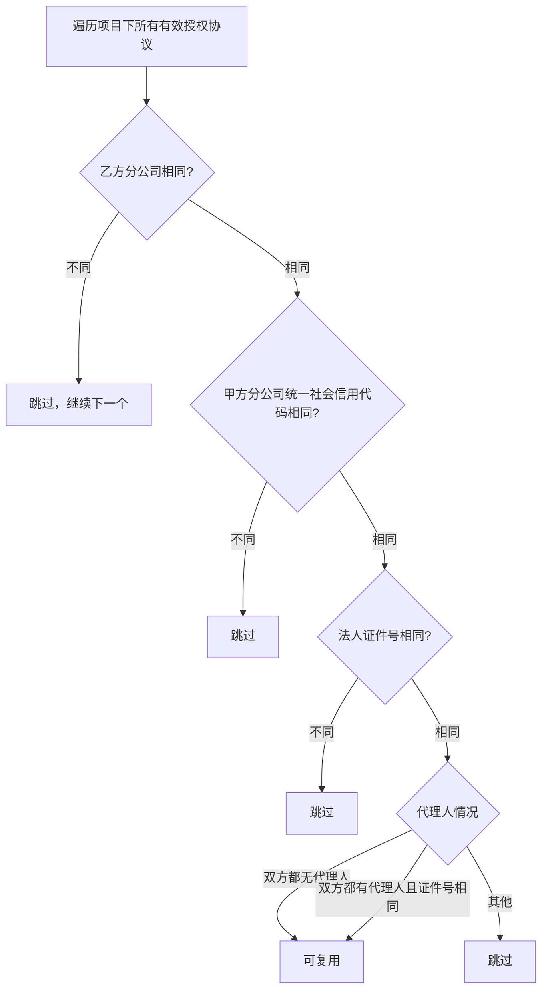

**匹配维度**：

| 维度 | 比较字段 | 说明 |
|------|---------|------|
| 乙方分公司 | `contract.companyCode` | 主合同与授权协议的销售公司编码 |
| 甲方分公司 | `companyCreditCode` 字段值 | 统一社会信用代码，去除空白后比较 |
| 法人 | `ContractUser.certificateNo`（RoleType=LEGAL） | 法人证件号 |
| 代理人 | `ContractUser.certificateNo`（RoleType=COMPANY_AGENT） | 代理人证件号，双方均无代理人也视为匹配 |

#### 生成条件判断

`needGenerateAccreditContract` 方法定义了生成授权协议的前置条件：

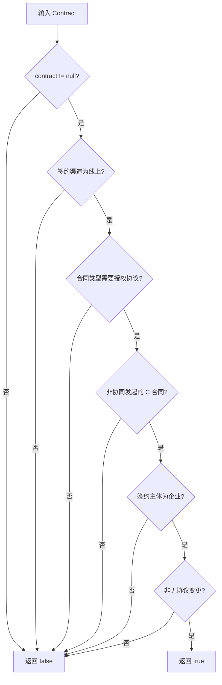

**需要生成授权协议的合同类型**：正签合同、个性化合同、首期款合同、变更合同、设计合同、设计变更合同（由 `ContractTypeEnum.needRelateAccreditContractTypes()` 定义）。

#### C 端授权列表查询

`getAccreditContractList` 方法为 C 端用户提供授权协议列表，查询路径：

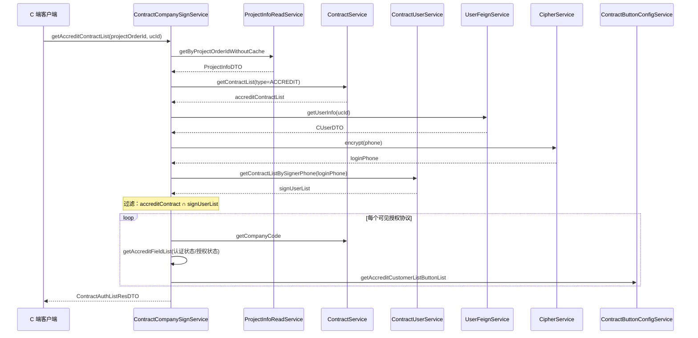

**权限过滤**：仅返回登录用户作为签署人的授权协议，确保数据隔离。

#### 授权信息详情

`getContractAuthInfo` 方法提供单个授权协议的完整信息，包含越权校验：

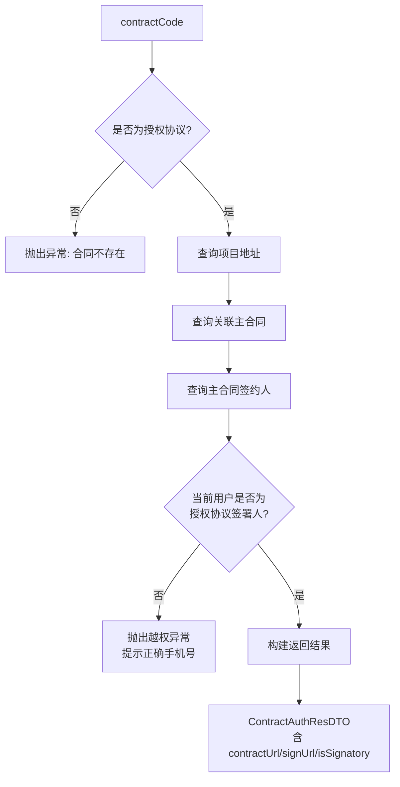

---

### ContractSelfSealService — 自主盖章服务

自主盖章服务为内部运营人员提供自定义文件（PDF/图片）的电子签章能力，支持批量盖章任务的异步处理。

#### 核心流程

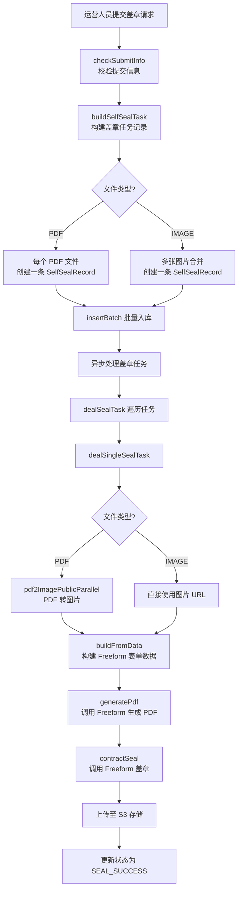

#### 盖章任务构建逻辑

根据文件类型采用不同的记录构建策略：

| 文件类型 | 记录策略 | 文件命名 | 说明 |
|---------|---------|---------|------|
| PDF（`FileTypeEnum.PDF`） | 每个文件一条记录 | 原文件名 | 各 PDF 独立处理 |
| 图片（`FileTypeEnum.IMAGE`） | 多图合并为一条记录 | `yyyyMMdd_random.pdf` | 图片 URL 以逗号拼接存储 |

#### Freeform 集成流程

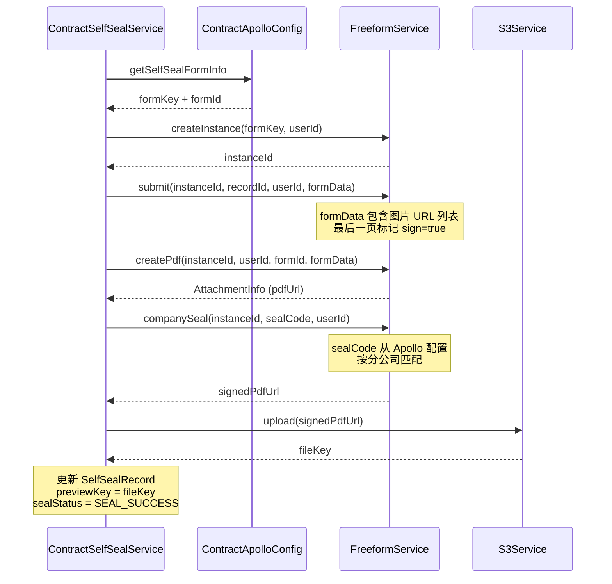

#### 盖章主体与权限

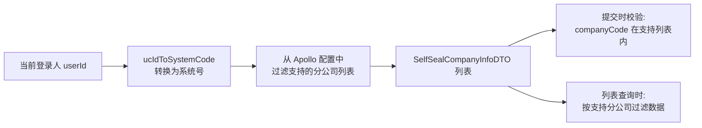

#### 错误处理与重试

- 每个盖章任务独立异步执行（`CompletableFuture.runAsync` + SkyWalking `RunnableWrapper`）
- 单个任务失败不影响其他任务，失败任务状态更新为 `SEAL_FAIL`
- `reSeal(Long id)` 方法支持对失败任务重新发起盖章

---

## 模块间依赖关系

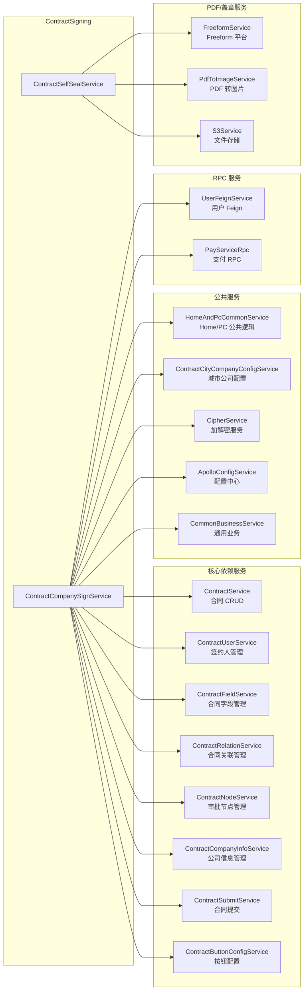

**依赖特征对比**：

| 维度 | ContractCompanySignService | ContractSelfSealService |
|------|---------------------------|------------------------|
| 依赖服务数量 | 17 个 | 4 个 |
| 耦合程度 | 高，涉及合同全流程数据 | 低，专注文件处理 |
| 外部 RPC | UserFeignService, PayServiceRpc | 无 |
| 数据库交互 | Contract, ContractUser, ContractField, ContractRelation, ContractNode, ContractCompanyInfo | SelfSealRecord |
| 与合同状态流转关系 | 紧密耦合（读写合同状态） | 独立于合同生命周期 |

---

## 数据流

### 对公签约主流程数据流

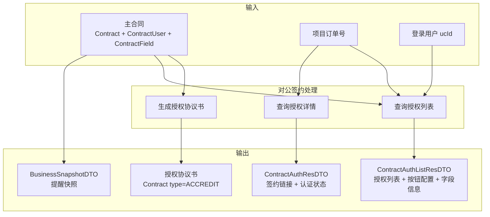

### 自主盖章数据流

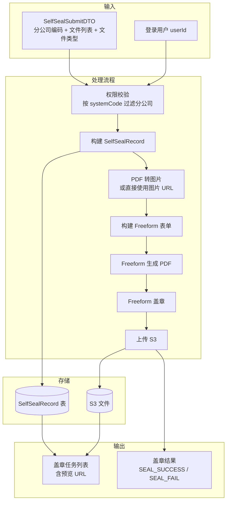

---

## 关键设计模式

### 1. 策略模式 — 授权协议复用判断

`getExistCanRelatedAcreditContract` 方法采用**链式匹配策略**，按优先级依次检查四个匹配维度，任一维度不匹配即跳过当前授权协议。这种设计将匹配规则解耦为独立的判断步骤，便于新增匹配维度。

### 2. 模板方法模式 — 单任务盖章处理

`dealSingleSealTask` 定义了盖章处理的固定流程骨架：

```
文件转换 → 表单构建 → PDF 生成 → 印章加盖 → 状态更新
```

各步骤通过私有方法实现，子类（如有）可覆写特定步骤。当前设计中未使用继承，而是通过方法内联实现。

### 3. 异步任务编排

ContractSelfSealService 使用 `CompletableFuture.runAsync` + SkyWalking `RunnableWrapper` 实现：
- **异步执行**：盖章任务不阻塞主请求
- **链路追踪**：RunnableWrapper 保证 SkyWalking Trace Context 传播
- **容错隔离**：单个任务失败通过 try-catch 更新状态为 `SEAL_FAIL`，不影响其他任务
- **手动重试**：`reSeal` 方法支持对失败任务重新执行

### 4. ThreadLocal 上下文模式

ContractCompanySignService 依赖 [ContractAspect](ContractContextManagement.md) 模块的 ThreadLocal 上下文机制：
- `HeaderContext.getUserId()` 获取当前登录人
- `HeaderContext.getContext().setOperatorUcId()` 设置操作人
- 通过 AOP 切面自动初始化和清理上下文，防止内存泄漏

### 5. 配置驱动的权限模型

自主盖章的分公司权限通过 Apollo 配置中心管理：
- `SelfSealCompanyInfoDTO` 包含 `systemCodes` 字段（逗号分隔的系统号列表）
- 运营人员的系统号通过 `CommonUtil.ucIdToSystemCode` 转换
- 权限判断：当前系统号是否在目标分公司的 `systemCodes` 中

---

## 与其他模块的关系

| 相关模块 | 关系 | 说明 |
|---------|------|------|
| [ContractDetail](ContractDetail.md) | 下游 | 签约完成后，合同详情页面展示签约状态和授权信息 |
| [ContractSubmission](ContractSubmission.md) | 上游 | 合同提交（草稿保存/托管提交）后进入签约流程 |
| [ContractValidation](ContractValidation.md) | 前置 | 签约前的字段校验和工种校验确保数据完整性 |
| [ContractContextManagement](ContractContextManagement.md) | 基础设施 | AOP 切面为对公签约提供上下文初始化和参数预处理 |
| [ButtonConfig](ButtonConfig.md) | 协作 | 授权列表的按钮配置由 ContractButtonConfigService 驱动 |
| [ContractSigningSource](ContractSigningSource.md) | 关联 | 个性化合同签约数据源策略，影响签约前的数据准备 |
| [ContractCreation](ContractCreation.md) | 上游 | 合同创建后进入签约流程，授权协议通过 ContractSubmitService 创建 |

---

## 枚举依赖速查

| 枚举 | 在本模块中的用途 |
|------|----------------|
| `ContractTypeEnum` | 授权协议类型（`ACCREDIT`）、需要授权协议的主合同类型判断、合同名称生成 |
| `ContractStatusEnum` | 合同状态判断（草稿撤回检测、有效状态过滤、完成状态判断） |
| `SignChannelTypeEnum` | 线上/线下签约渠道判断（仅线上签约需要授权协议） |
| `ContractObjectTypeEnum` | 签约主体类型（`COMPANY` 对公、`PERSON` 对私） |
| `RoleTypeEnum` | 签约角色（`LEGAL` 法人、`COMPANY_AGENT` 代理人） |
| `ContractButtonEnum` | 授权列表按钮类型（`VIEW` 查看等） |
| `ContractAuthStatusEnum` | 授权状态（企业实名认证状态、签约人授权状态） |
| `SelfSealStatusEnum` | 盖章任务状态（`SEAL_ING`、`SEAL_SUCCESS`、`SEAL_FAIL`） |
| `FileTypeEnum` | 自主盖章文件类型（`PDF`、`IMAGE`） |