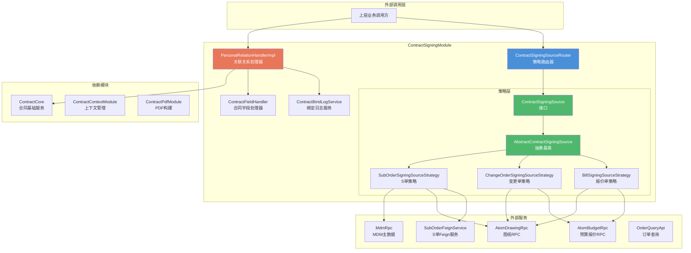
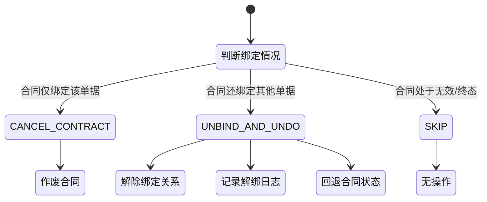
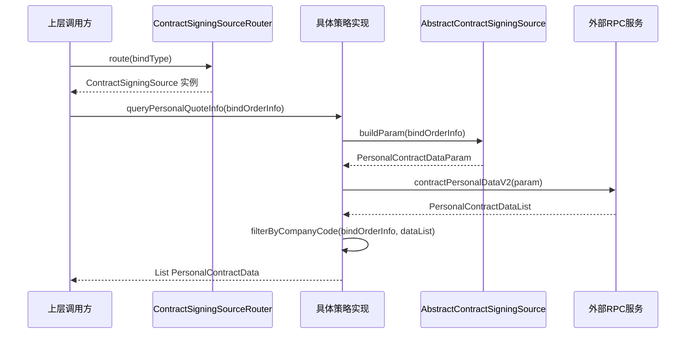
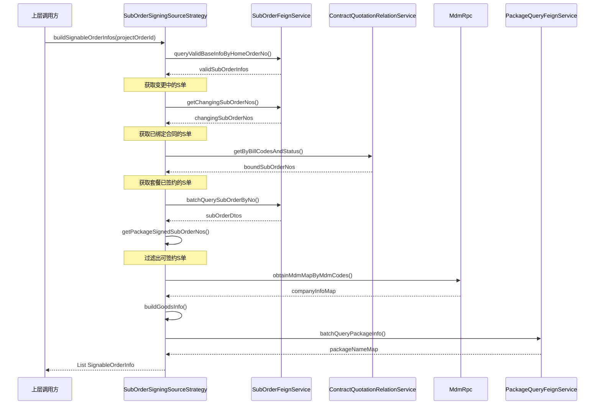
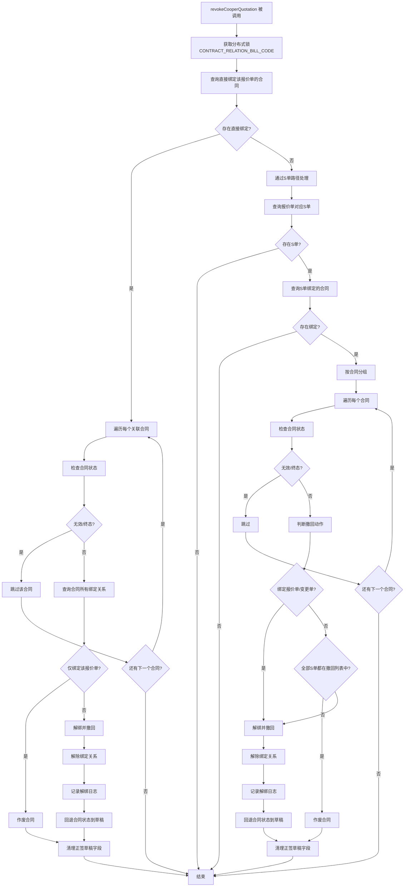
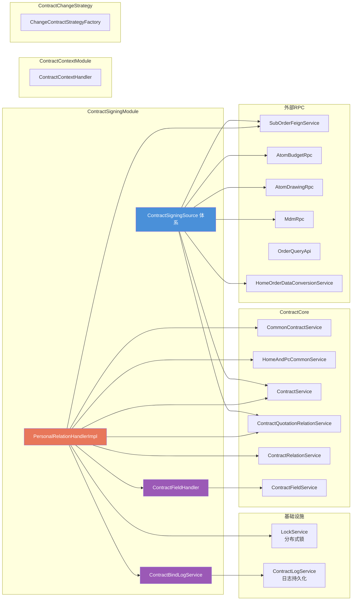

# ContractSigningModule 模块文档

## 1. 模块概述

ContractSigningModule 是销售合同系统中负责**个性化合同签约数据源管理与关联关系处理**的核心模块。该模块解决的核心问题是：在个性化合同签约流程中，系统需要支持多种不同类型的业务单据（报价单、变更单、S 单）作为合同绑定的数据来源，每种单据具有不同的查询逻辑、状态校验规则和商品信息构建方式。本模块通过策略模式统一封装了这些差异，为上层提供一致的签约数据源访问接口。

模块的核心职责包括：

- **签约数据源抽象**：定义统一的 `ContractSigningSource` 接口，抽象不同单据类型的个性化报价查询、可签约单据构建、商品信息组装、状态校验等操作
- **策略路由**：通过 `ContractSigningSourceRouter` 按绑定类型（`bindType`）自动路由到对应的策略实现
- **关联关系管理**：通过 `PersonalRelationHandler` 处理合同与报价单/S 单的绑定与解绑，包括协同报价单撤回时的复杂解绑和合同作废逻辑
- **绑定日志与字段清理**：通过 `ContractBindLogService` 和 `ContractFieldHandler` 记录操作日志并维护正签草稿字段的一致性

本模块属于个性化合同签约领域，与 [ContractCore](ContractCore.md) 模块中的合同基础服务、[ContractContextModule](ContractContextModule.md) 模块中的上下文管理、以及 [ContractChangeStrategy](ContractChangeStrategy.md) 模块中的变更合同策略密切协作。

---

## 2. 架构总览



---

## 3. 核心组件详解

### 3.1 签约数据源策略体系

#### 3.1.1 ContractSigningSource（接口）

**文件**：`personal/bind/ContractSigningSource.java`

定义了个性化合同签约数据源的统一抽象接口，是整个策略体系的顶层契约。接口方法覆盖了签约流程的各个环节：

| 方法 | 职责 | 说明 |
|------|------|------|
| `bindType()` | 绑定类型标识 | 返回该策略处理的绑定类型枚举值，用于路由分发 |
| `queryPersonalQuoteInfo()` | 查询个性化报价 | 从主订单获取对应类型的个性化报价数据 |
| `hasInvalidStatusOrders()` | 状态校验 | 判断待绑定的单据是否包含无效状态（如已删除、已取消等） |
| `buildGoodsInfo()` | 商品信息构建 | 根据单据号构建 goodsInfo（内控类目聚合） |
| `buildSignableOrderInfos()` | 可签约单据构建 | 构造弹窗中供用户选择的可签约单据列表 |
| `checkPersonalCanCreate()` | 创建前置校验 | 编辑合同前校验是否存在可签约的 S 单 |
| `buildPersonalDrawingImgList()` | 图纸图片列表 | 构建个性化图纸的预览图 URL 列表 |
| `buildPersonalDrawing()` | 图纸详情 | 构建完整的个性化图纸数据（含 PDF） |
| `hasCPart()` / `hasBPart()` | 承担方判断 | 判断绑定单据是否包含 C 部分（客户承担）或 B 部分（开发商承担）商品 |

#### 3.1.2 AbstractContractSigningSource（抽象基类）

**文件**：`personal/bind/AbstractContractSigningSource.java`

实现了 `ContractSigningSource` 中的模板方法，通过**模板方法模式**将公共逻辑抽取到基类，子类只需实现差异化的抽象方法：

**已实现的公共方法**：
- `queryPersonalQuoteInfo()` — 构建参数 → 执行查询 → 按主体过滤，三步模板流程
- `buildPersonalDrawingImgList()` — 调用 `buildPersonalDrawing()` 后提取预览图 URL
- `buildPersonalDrawing()` — 获取商品行数据 → 构造图纸查询参数 → 调用 RPC 查询 → 筛选个性化 PDF 图纸
- `mergeCategoryNames()` — 聚合类目名称（最多展示 3 个，第 3 个后加"等"）
- `getHasBoundOrderNos()` — 查询已绑定有效合同的单据号集合
- `buildPackageCodeMap()` / `getPackageCodesByOrderNos()` — 套餐码映射构建
- `isCPart()` / `isBPart()` — 根据 `PurchaseTypeEnum` 判断商品承担类型

**子类必须实现的抽象方法**：

| 抽象方法 | 用途 |
|----------|------|
| `buildDrawingQuery()` | 构造图纸查询参数（不同单据类型参数结构不同） |
| `buildProductItemCodes()` | 获取单据对应的商品唯一键列表 |
| `buildParam()` | 构建个性化报价查询参数 |
| `filterByCompanyCode()` | 按单据号+主体过滤个性化报价数据 |

#### 3.1.3 BillSigningSourceStrategy（报价单策略）

**文件**：`personal/bind/strategy/BillSigningSourceStrategy.java`

处理**报价单**（`bindType = BindTypeEnum.BILL_CODE`）作为合同签约数据源的场景。核心特点：

- **状态校验**：通过 `AtomBudgetRpc` 查询报价单状态，排除"调整中"、"已删除"、"已取消"的报价单
- **商品信息构建**：通过 `ProductQueryService` 获取报价单关联的 SKU 商品，聚合内控类目名作为 goodsInfo
- **可签约单据**：从主订单的正签报价中提取个性化数据，仅在全屋翻新（`REFORM_ALL`）和房本业务（`HOUSE_CERTIFICATE`）类型下生效
- **图纸查询**：按报价单关联的商品行查询图纸，不包含变更单号参数
- **承担方判断**：查询报价单商品的 `purchaseType` 判断是否含 C/B 部分
- **创建校验**：`checkPersonalCanCreate()` 始终返回 `false`（报价单不单独触发创建校验，由 S 单策略负责）
- **公司主体过滤**：根据 `billCode + organizationCode` 组合过滤个性化报价数据

#### 3.1.4 ChangeOrderSigningSourceStrategy（变更单策略）

**文件**：`personal/bind/strategy/ChangeOrderSigningSourceStrategy.java`

处理**变更单**（`bindType = BindTypeEnum.CHANGE_ORDER`）作为合同签约数据源的场景。核心特点：

- **状态校验**：通过 `AtomBudgetRpc.getChangeApplyDetails()` 查询变更单状态，仅允许"待签约"（`WAIT_SIGN`）和"已完成"（`FINISHED`）状态
- **商品信息构建**：通过 `ProductQueryService` 获取变更单关联的 SKU 商品，聚合类目名
- **可签约单据**：`buildSignableOrderInfos()` 返回空列表（变更单不通过弹窗选择签约，而是由变更流程驱动）
- **图纸查询**：图纸查询参数中额外包含 `projectChangeNo`（变更单号）和 `drawingStatus = TEMP`（临时图纸状态）
- **公司主体过滤**：根据 `changeOrderId + organizationCode` 组合过滤

#### 3.1.5 SubOrderSigningSourceStrategy（S 单策略）

**文件**：`personal/bind/strategy/SubOrderSigningSourceStrategy.java`

处理 **S 单**（`bindType = BindTypeEnum.SUB_ORDER`）作为合同签约数据源的场景。这是三种策略中**逻辑最复杂**的一种，因为 S 单是实际的下游履约单元。核心特点：

- **状态校验**：通过 `SubOrderFeignService.batchQuerySubOrderByNo()` 批量查询 S 单，校验数量一致且状态不在无效集合中
- **商品信息构建**：从 S 单的 `SubOrderItemDto` 中提取前台/后台类目名，超过 50 字符截断并加"..."
- **可签约单据构建（核心复杂逻辑）**：
  1. 查询主订单下所有有效状态的 S 单
  2. 过滤变更中的 S 单（`getChangingSubOrderNos`）
  3. 过滤已绑定有效合同的 S 单（`getHasBoundOrderNos`）
  4. 过滤套餐已签约的 S 单（`getPackageSignedSubOrderNos`）—— 同一套餐下如果某个 S 单已绑定合同，其他同套餐 S 单也不能再签约
  5. 构建依赖数据：公司主体名称（MDM 查询）、goodsInfo、套餐名称、是否团装 2.5 标识
- **创建校验**：在编辑模式下检查是否存在可签约 S 单（不过滤草稿合同的关联关系）
- **商品唯一键**：使用 `SubOrderItemDto.skuUniqueKey`（而非报价单的 `productItemCode`）
- **公司主体过滤**：S 单只有单个主体，无需过滤，直接返回全部

#### 3.1.6 ContractSigningSourceRouter（策略路由器）

**文件**：`personal/bind/ContractSigningSourceRouter.java`

通过 Spring 的依赖注入机制，自动收集所有 `ContractSigningSource` 实现并按 `bindType` 建立映射。调用方只需传入 `bindType` 即可获取对应策略，实现了策略选择的解耦：

```java
// 构造时自动注入所有策略
public ContractSigningSourceRouter(List<ContractSigningSource> sources) {
    this.sourceMap = sources.stream().collect(
        Collectors.toMap(ContractSigningSource::bindType, Function.identity())
    );
}

// 按 bindType 路由
public ContractSigningSource route(Integer bindType) {
    return sourceMap.get(bindType);
}
```

---

### 3.2 关联关系处理器

#### 3.2.1 PersonalRelationHandlerImpl（个性化关联关系处理器）

**文件**：`personal/PersonalRelationHandlerImpl.java`

负责处理合同与报价单/S 单绑定关系的变更操作，核心方法为 `revokeCooperQuotation()`（撤回协同报价单）。该方法包含复杂的分支逻辑，是模块中**业务逻辑最密集**的组件。

**核心流程**：

1. **加锁互斥**：以协同报价单号为 Key 加分布式锁（`LockService.CONTRACT_RELATION_BILL_CODE`），防止撤回与换绑并发冲突
2. **判断绑定路径**：
   - 若报价单直接关联合同 → 走 `unbindCooperQuotationFromContract()` 直接处理
   - 若报价单未关联合同 → 说明报价单已下单换绑为 S 单，走 `unbindSubOrderFromContract()` 通过 S 单间接处理
3. **确定撤回动作**：根据合同绑定的单据类型和数量，决定执行哪种操作（`ContractRevocationAction`）：
   - `CANCEL_CONTRACT`（作废合同）：合同仅绑定该单据，无其他绑定物
   - `UNBIND_AND_UNDO`（解绑并撤回）：合同还绑定了其他单据，仅解除当前单据关联
   - `SKIP`（跳过）：合同处于无效或终态，无需处理
4. **执行撤回动作**：
   - 作废：调用 `commonContractService.cancelCurrentContract()`
   - 解绑并撤回：解除绑定关系 → 记录解绑日志 → 回退合同状态到草稿
5. **清理正签草稿字段**：从关联的正签合同草稿中移除被撤回的报价单号和 S 单号

**关键枚举 — ContractRevocationAction**：



**S 单路径下的撤回动作判断逻辑**（`determineRevocationActionForSubOrder`）：

| 条件 | 动作 |
|------|------|
| 合同绑定了报价单或变更单 | `UNBIND_AND_UNDO` — S 单只是附属绑定，主绑定仍在 |
| 合同绑定的全部 S 单都在撤回列表中 | `CANCEL_CONTRACT` — 所有绑定物都将被撤回 |
| 合同绑定了不在撤回列表中的 S 单 | `UNBIND_AND_UNDO` — 仅解除当前 S 单 |

---

### 3.3 辅助服务组件

#### 3.3.1 ContractBindLogService（绑定日志服务）

**文件**：`ContractBindLogService.java`

提供合同绑定关系变更的日志记录能力，支持两种日志类型：

- `recordBindChangeLog()` — 记录换绑操作：原始单据编号 → 新单据编号列表
- `recordUnbindLog()` — 记录解绑操作：被解绑的单据编号列表

日志内容限制最大长度 2900 字符，超长自动截断。操作人默认为系统账号。日志记录失败不会阻断主流程。

#### 3.3.2 ContractFieldHandler（合同字段处理器）

**文件**：`ContractFieldHandler.java`

负责合同字段中 JSON 列表类型数据的解析与移除操作，主要服务于协同报价单撤回时的正签草稿字段清理：

- `removeBillCodeFromContractField()` — 从正签草稿的 `billCodeInfoList` 和 `billCodeList` 字段中移除指定报价单号
- `removeSubOrderNoFromContractField()` — 从正签草稿的 `subOrderInfoList` 字段中移除指定 S 单号
- `removeChangeOrderIdFromContractField()` — 从正签草稿的 `changeOrderInfoList` 字段中移除指定变更单号

底层通过 `removeFromListField()` 泛型方法统一处理：读取字段 → JSON 反序列化 → 条件过滤 → 序列化回写。

---

## 4. 组件交互流程

### 4.1 策略路由查询流程



### 4.2 可签约 S 单构建流程



### 4.3 协同报价单撤回流程



---

## 5. 模块依赖关系



### 依赖模块说明

| 依赖模块 | 依赖组件 | 依赖用途 |
|----------|----------|----------|
| [ContractCore](ContractCore.md) | CommonContractService, HomeAndPcCommonService | 合同作废、状态回退到草稿 |
| [ContractCore](ContractCore.md) | ContractQuotationRelationService | 绑定关系的增删查 |
| [ContractCore](ContractCore.md) | ContractService | 根据合同编号查询合同实体 |
| [ContractCore](ContractCore.md) | ContractRelationService | 正签合同关联关系查询 |
| [ContractCore](ContractCore.md) | ContractFieldService | 合同字段的读写持久化 |
| [ContractCore](ContractCore.md) | LockService | 分布式锁，保证并发安全 |
| [ContractContextModule](ContractContextModule.md) | HomeOrderDataConversionService | 主订单数据转换，获取个性化报价 |
| [ContractChangeStrategy](ContractChangeStrategy.md) | — | 本模块不直接依赖，但变更单策略与变更合同流程配合工作 |

---

## 6. 关键设计模式

### 6.1 策略模式（Strategy Pattern）

本模块最核心的设计模式。`ContractSigningSource` 定义统一接口，三种策略实现类分别处理报价单、变更单、S 单的不同业务逻辑。`ContractSigningSourceRouter` 作为策略工厂，通过 Spring 的自动收集机制按 `bindType` 路由。

**优势**：新增单据类型时，只需添加新的 `ContractSigningSource` 实现并声明 `bindType`，Router 自动发现并注册，符合开闭原则。

### 6.2 模板方法模式（Template Method Pattern）

`AbstractContractSigningSource` 将签约数据源的公共流程（查询参数构建 → RPC 调用 → 结果过滤）固化在基类方法中，将差异点（参数构建细节、图纸查询参数、主体过滤逻辑）定义为抽象方法，由子类按需实现。

### 6.3 状态机模式（State Machine）

`ContractRevocationAction` 枚举定义了合同撤回操作的三种状态（作废、解绑并撤回、跳过），`determineRevocationActionForDirectBound()` 和 `determineRevocationActionForSubOrder()` 作为状态判定函数，根据当前合同绑定情况确定应执行的动作。

### 6.4 分布式锁保护

`PersonalRelationHandlerImpl.revokeCooperQuotation()` 使用分布式锁确保同一协同报价单的撤回操作与换绑操作互斥，避免并发场景下的数据不一致。锁粒度为单个报价单号，超时时间 10 秒。

---

## 7. 绑定类型枚举映射

| BindTypeEnum | 策略实现 | 数据来源 | 业务场景 |
|--------------|----------|----------|----------|
| `BILL_CODE` | BillSigningSourceStrategy | 报价单 | 全屋翻新、房本业务的个性化合同签约 |
| `CHANGE_ORDER` | ChangeOrderSigningSourceStrategy | 变更单 | 变更流程驱动的个性化合同签约 |
| `SUB_ORDER` | SubOrderSigningSourceStrategy | S 单（子订单） | 报价单下单后的 S 单签约，最常见场景 |
