# ContractSubmission 模块文档

## 1. 模块概述

ContractSubmission 是合同系统中负责**合同提交与发起**的核心模块。它承担了从用户点击"提交签约"到合同 PDF 生成、数据入库、状态流转的完整链路，同时集成了设计费审核和补充协议 BPM 审批等子流程。

该模块的核心职责包括：

- **合同提交主流程**：校验 → 草稿保存 → PDF 生成（并行） → 数据入库 → 状态流转
- **设计费审核**：判断设计合同是否"超底"（设计费优惠后应收超过底价），触发 BPM 审批流
- **补充协议 BPM 审批**：补充协议/和解协议发起时构建审批人信息并发起 BPM 流程
- **设计费自动计算**：提交前根据设计师职级、计价面积等参数自动计算设计费
- **合并发起**：支持正签合同合并发起关联的个性化合同、图纸合同、解约协议等

## 2. 架构总览

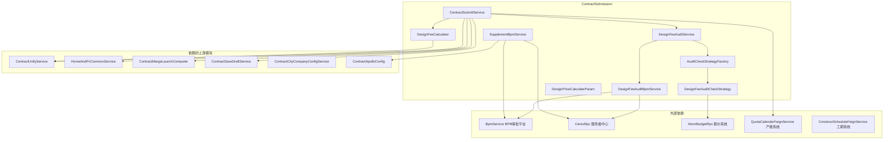

## 3. 核心组件详解

### 3.1 ContractSubmitService —— 合同提交主控服务

这是整个模块的**主入口和编排中心**，协调合同提交的完整生命周期。

#### 3.1.1 主流程 `submit()`

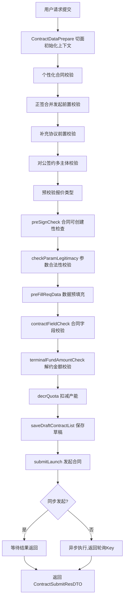

**关键设计决策**：

1. **同步/异步双模式**：通过 `contractSubmitSync()` 方法和 Apollo 配置决定合同发起是同步还是异步。解约协议等特定类型强制同步，其余走异步提升响应速度。
2. **ThreadLocal 上下文传递**：通过 `ContractContextHandler` 和 `HeaderContext` 两个 ThreadLocal 在异步线程间传递请求上下文，异步线程使用 `CommonUtil.deepCopy` 进行深拷贝避免并发问题。
3. **分布式锁**：发起前通过 `LockService` 加锁（key 包含 projectOrderId + contractType），防止同一订单并发发起。

#### 3.1.2 异步发起流程 `submitLaunch()`

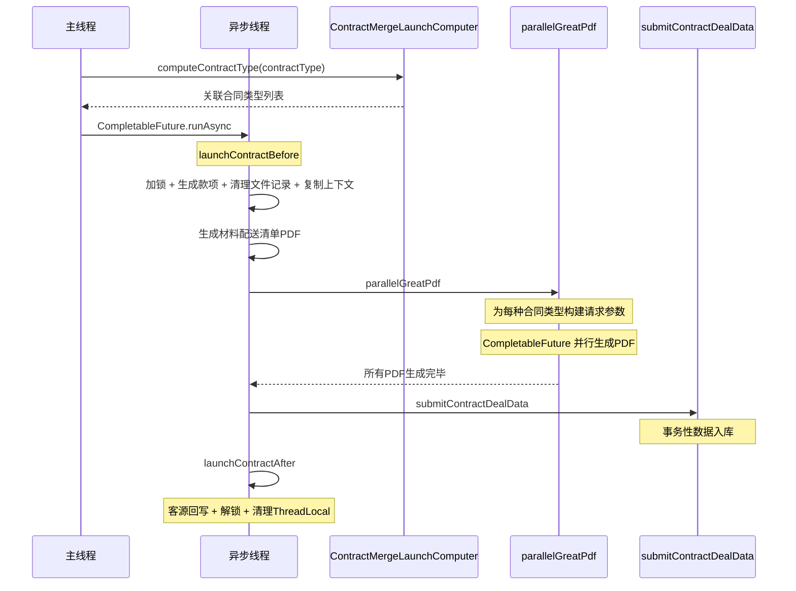

#### 3.1.3 合并发起 PDF 生成 `parallelGreatPdf()`

此方法是并发 PDF 生成的核心编排：

1. **识别合并类型**：通过 `ContractMergeLaunchComputer.computeContractType()` 计算需要额外合并发起的合同类型（如图纸、个性化、解约、授权书等）
2. **构建各类型请求参数**：针对不同合同类型构建对应的 `ContractReqDTO`（如解约协议调用 `buildMergeTerminalContractReq`，设计合同调用 `buildMergeDesignContractReq`）
3. **并行生成 PDF**：为每个 `ContractSubmitCore` 启动 `CompletableFuture` 异步线程调用 `contractUnifyService.createOnlinePdf()`
4. **重试机制**：方法标注 `@Retryable(maxAttempts=2, backoff=3000)`，PDF 生成失败自动重试一次

#### 3.1.4 合同状态计算 `getContractSubmitStatus()`

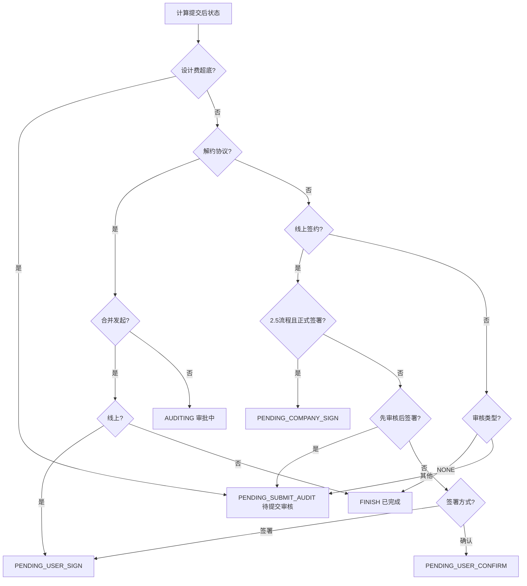

#### 3.1.5 工期处理 `dealConstructSchedule()`

- **整装业务**：调用 `PcContractService.calculateSchedule()` 获取工期，2.5 流程下建筑面积从客源实时取
- **翻新业务**：通过 `ConstructScheduleFeignService` Feign 调用工期微服务
- 工期唯一编码 `durationUniqueCode` 存入 `BusinessInfo`，后续保存到 `contract_field` 表

#### 3.1.6 产能扣减 `decrQuota()`

仅在**整装业务 + 正签合同**场景下执行，通过 `QuotaCalenderFeignService` 调用产能系统扣减产能。入参包含项目 ID、开工日期、国标码、营销码等。

### 3.2 DesignFeeAuditService —— 设计费审核服务

收敛所有与设计费审核相关的业务判断逻辑。

#### 3.2.1 核心判断链路

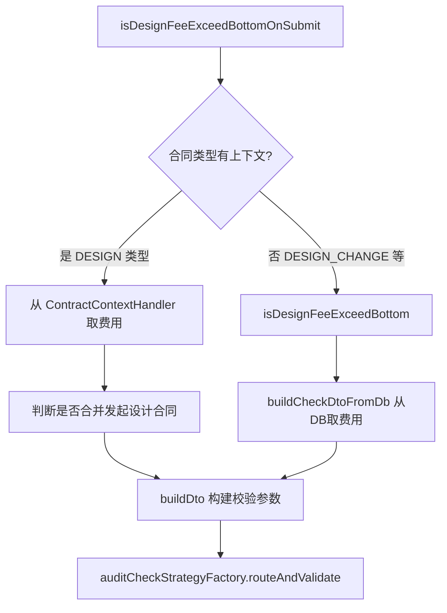

**设计要点**：

- 上下文存在时（提交流程）从 `ContractContextHandler` 实时取费用数据，避免 DB 读延迟
- 上下文不存在时（异步场景等）从 `contract_field` 表读取
- 费用字段缺失或格式异常时记录日志并跳过校验，不阻塞主流程

#### 3.2.2 设计费场景判断

| 方法 | 用途 |
|------|------|
| `isDesignScene(contractType)` | 判断是否为设计/设计变更合同 |
| `isDesignSceneAndHouse(contractType, businessType)` | 判断是否为设计+整装场景 |

### 3.3 设计费审核策略体系

采用**策略模式**实现审核校验的可扩展性：

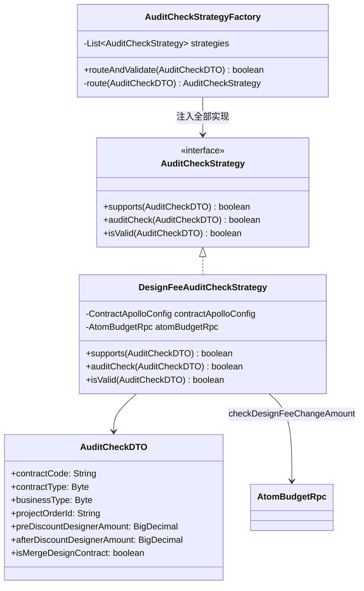

**DesignFeeAuditCheckStrategy.supports() 的路由条件**：

1. Apollo 开关 `getDesignFeeCheckEnabled()` 开启
2. 合同类型为 DESIGN 或 DESIGN_CHANGE
3. 业务类型为整装（HOUSE_CERTIFICATE）
4. 非合并发起的设计合同
5. 2.5 流程

**DesignFeeAuditCheckStrategy.auditCheck()**：调用 `AtomBudgetRpc.checkDesignFeeChangeAmount()` 判断是否超底。

### 3.4 DesignFeeAuditBpmService —— 设计费 BPM 审批流发起

当设计费审核判定"超底"后，通过此服务发起 BPM 审批。

#### 3.4.1 审批流发起流程

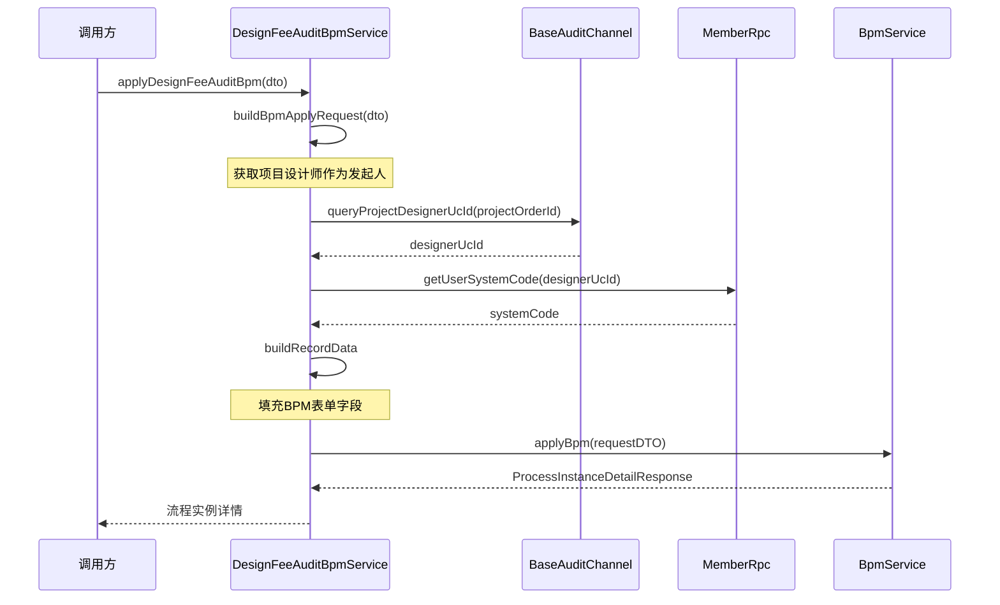

#### 3.4.2 BPM 表单字段

| 字段名 | 来源 | 说明 |
|--------|------|------|
| APPLY_USER | 服务者中心 | 设计师姓名(系统号) |
| PROJECT_ORDER_ID | 请求参数 | 项目订单ID |
| APPLY_TIME | 系统当前时间 | 申请日期 |
| CUSTOMER_NAME | 项目信息 | 客户姓名 |
| PROJECT_ADDRESS | 项目信息 | 项目地址 |
| BILL_ORGANIZATION | 项目信息 | 分公司全称+MDM ID |
| BILL_ORGANIZATION_CODE | 项目信息 | 分公司编码 |
| DESIGN_FEE_BEFORE_COUPON | contract_field | 设计费优惠前应收 |
| DESIGN_FEE_AFTER_COUPON | contract_field | 设计费优惠后应收 |
| DESIGN_FEE_DISCOUNT_RATE | 计算值 | 折扣率=after/pre*10 |
| DISCOUNT_RATE_CAL_CALIBER | 固定文案 | 折扣率计算口径 |
| AUDITREMARK | contract_field | 申请原因 |

### 3.5 SupplementBpmService —— 补充协议 BPM 审批发起

负责补充协议（SUPPLEMENT）和和解协议（SETTLEMENT）的 BPM 审批流发起。

#### 3.5.1 审批人构建规则

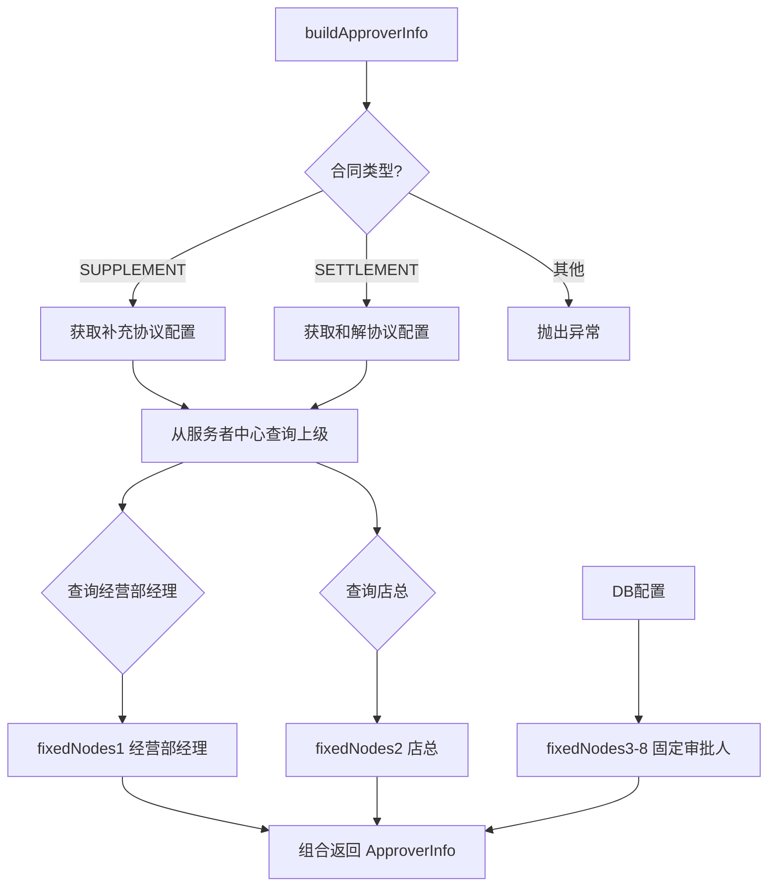

审批人层级：

1. **一级审批人**：经营部经理（从服务者中心 `CeresRpc` 动态获取）
2. **二级审批人**：店总（从服务者中心动态获取）
3. **三至八级审批人**：法务等固定人员（从 `ProjectConfig` 数据库配置读取）

#### 3.5.2 BPM 表单数据

| 字段名 | 来源 | 说明 |
|--------|------|------|
| ownerName | 正签合同字段 | 甲方姓名（个人取 ownerName，公司取 legalName） |
| companyName | 分公司信息 | 乙方名称 |
| applyDate | 正签合同节点 | 正签发起时间 |
| contractNo | 正签合同 | 正签合同编号 |
| projectContractAddress | 正签合同字段 | 施工地址 |
| supplementApplyDate | 补充协议节点 | 补充协议发起时间 |
| contractLink | PDF链接/附件链接 | 线上取PDF URL，线下取附件URL |

### 3.6 DesignFeeCalculator —— 设计费计算器

在合同提交前自动计算并填充设计费字段。

#### 3.6.1 计算决策流程

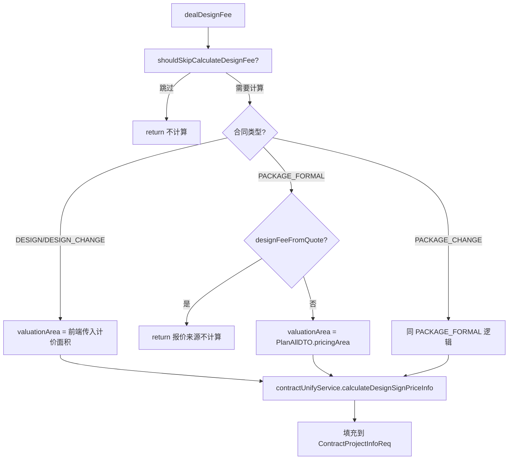

**跳过计算的条件**（`shouldSkipCalculateDesignFee`）：

1. 合同类型不在可计算类型列表中（DESIGN_FEE_PACKAGE_TYPES + DESIGN_FEE_DESIGN_TYPES）
2. 线下签约
3. 正签类型且未约定设计费（`needDesignerAmount = NO`）
4. `designFeeCalculateIsOpen` 开关关闭

### 3.7 DesignPriceCalculateParam —— 设计费计算参数

封装调用 BIM 知识库（报价系统）计算设计费所需的入参，并提供 `buildRpcParam()` 方法转换为 RPC 调用参数。

| 字段 | 说明 |
|------|------|
| companyCode | 分公司编码 |
| designerUcId | 设计师 UC ID |
| psLevelName | 设计师职级 |
| valuationArea | 计价面积 |
| houseBuildType | 房屋结构 |

## 4. 模块间依赖关系

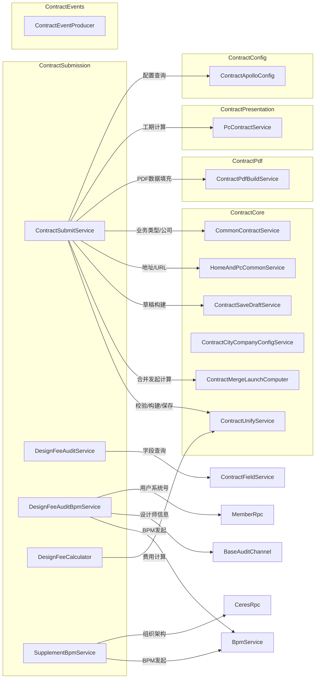

### 上游模块引用

| 被依赖模块 | 提供的能力 |
|-----------|-----------|
| [ContractCore](ContractCore.md) | 合同数据查询、校验、保存、合并发起计算、字段配置 |
| [ContractConfig](ContractConfig.md) | Apollo 动态配置（城市开关、BPM 配置、审批开关等） |
| [ContractPdf](ContractPdf.md) | PDF 数据填充和 PDF 生成 |
| [ContractPresentation](ContractPresentation.md) | 工期计算、PC 端合同表单处理 |
| [ContractEvents](ContractEvents.md) | 合同事件发布（Kafka），驱动后续流程 |

### 下游模块引用

| 引用本模块的模块 | 引用内容 |
|----------------|---------|
| [ContractPresentation](ContractPresentation.md) | `ContractSubmitService.submit()` 被 HomeContractService 和 PcContractService 调用 |
| [ContractChange](ContractChange.md) | 变更合同提交流程参考本模块的状态计算逻辑 |
| [ContractEvents](ContractEvents.md) | `ContractSubmitListener` 消费提交事件后触发后续处理 |

## 5. 数据流

### 5.1 合同提交数据流

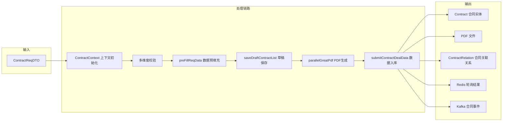

### 5.2 设计费审核数据流

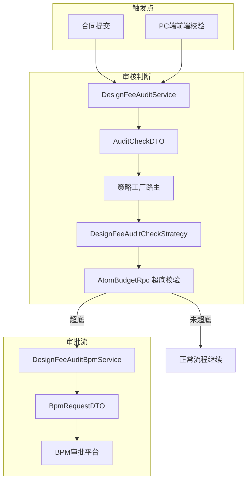

## 6. 关键设计模式

### 6.1 策略模式（Strategy Pattern）

模块中多处使用策略模式实现业务规则的可扩展性：

| 策略接口 | 工厂类 | 已有实现 | 扩展场景 |
|---------|--------|---------|---------|
| `AuditCheckStrategy` | `AuditCheckStrategyFactory` | `DesignFeeAuditCheckStrategy` | 新增合同类型的审核判断 |
| `CreateContractPdfBySelfStrategy` | `CreateContractPdfBySelfStrategyFactory` | House/Group/ReformAll/Drawing | 新增业务线的 PDF 自生成 |
| `ContractSigningSource` | `ContractSigningSourceRouter` | Bill/SubOrder/ChangeOrder | 新增个性化报价来源 |

策略工厂通过 Spring `@Resource List<Strategy>` 自动注入全部实现，运行时通过 `supports()` 方法路由。新增实现类只需加 `@Service` 注解，无需修改已有代码。

### 6.2 AOP 切面上下文初始化（@ContractDataPrepare）

`ContractSubmitService.submit()` 方法标注了 `@ContractDataPrepare` 注解，由 `ContractContextAspect` 拦截，在方法执行前：

1. 初始化 `ContractContext` ThreadLocal
2. 查询并填充 `ProjectInfoDTO`（项目信息）
3. 查询并填充 `PlanAllDTO`（报价方案信息）
4. 处理变更单报价信息（`buildAtomChangeQuotation`）
5. 处理套餐信息（`dealComboInfo`）
6. 处理图纸信息（`dealDrawingDTO`）
7. 处理托管账户信息（`dealEscrowDTO`）

方法执行后或异常时自动清理 ThreadLocal，防止内存泄漏。

### 6.3 异步并发 + 补偿模式

合同提交主流程采用**同步校验 + 异步发起**模式：

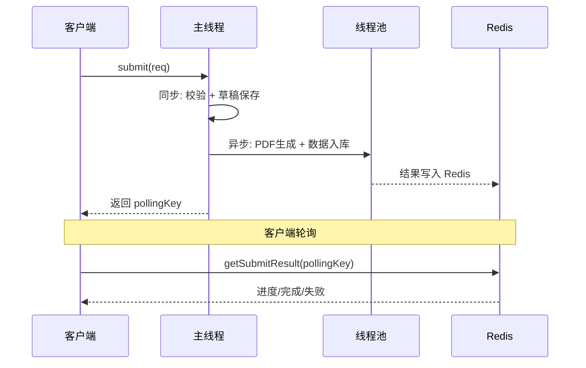

异常补偿机制：

- **PDF 生成失败**：标记 `retrySubmit=true`，前端可展示重试按钮
- **数据入库失败**：回滚草稿，记录错误信息到 `contract.errorMessage`
- **锁超时**：`launchContractException` 中确保释放锁和清理 ThreadLocal

### 6.4 工厂模式（Factory Pattern）

模块通过工厂类实现条件路由：

- `AuditCheckStrategyFactory.routeAndValidate()`：根据合同类型路由审核策略
- `ContractHandlerFactory.getHandler()`：根据合同类型获取对应的 Handler（BaseContractHandler/DesignContractHandler/TerminalContractHandler 等）
- `CreateContractPdfBySelfStrategyFactory.getContractPdfBySelfStrategy()`：根据业务类型获取 PDF 自生成策略

### 6.5 模板方法模式（Template Method）

`ContractSubmitService` 中的发起流程可视为模板方法：

```
submit()
  ├── preSubmitCheck()     // 前置校验（子类或策略可扩展）
  ├── preFillReqData()     // 数据预填充
  ├── saveDraftContractList() // 草稿保存
  ├── submitLaunch()       // 发起
  │   ├── launchContractBefore()
  │   ├── parallelGreatPdf()
  │   ├── submitContractDealData()
  │   └── launchContractAfter()
  └── 异常处理
      └── launchContractException()
```

## 7. 状态机

### 7.1 合同提交后状态流转

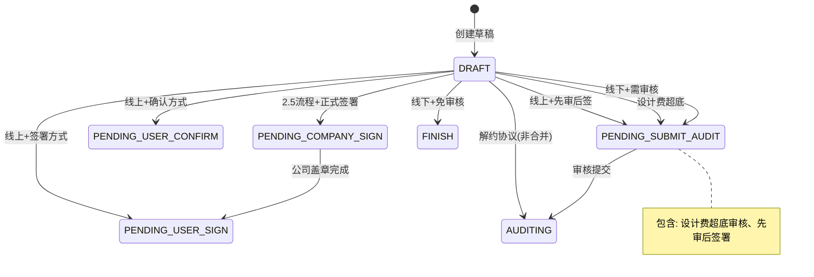

## 8. 外部系统交互

| 外部系统 | 交互方式 | 用途 |
|---------|---------|------|
| BPM 审批平台 | RPC（BpmService） | 设计费审核、补充协议审批流发起 |
| 服务者中心（Ceres） | RPC（CeresRpc） | 查询组织架构（经营部经理、店总） |
| 报价系统（Atom Budget） | RPC（AtomBudgetRpc） | 设计费超底校验、报价数据查询 |
| 产能系统 | Feign（QuotaCalenderFeignService） | 产能扣减和回滚 |
| 工期系统 | Feign（ConstructScheduleFeignService） | 翻新业务工期计算 |
| BIM 知识库 | RPC | 设计费计算 |
| Redis | Spring Data Redis | 合同提交结果轮询、分布式锁、主合同关系缓存 |
| Kafka | Spring Kafka | 合同事件发布，驱动下游异步处理 |

## 9. 配置依赖

| 配置项 | 来源 | 用途 |
|--------|------|------|
| `designFeeAuditBpmProcessDefId` | Apollo | 设计费审核 BPM 流程定义ID |
| `designFeeAuditBpmBoName` | Apollo | 设计费审核 BPM 业务对象名 |
| `supplementBpmBaseConfigDTO` | Apollo | 补充协议 BPM 基础配置 |
| `contractSubmitSync` | Apollo | 合同发起同步/异步开关 |
| `designFeeCheckEnabled` | Apollo | 设计费审核总开关 |
| `isInOwnerPhoneWhitelist` | Apollo | 签约手机号白名单 |
| `durationCalculateIsOpen` | Apollo | 工期计算开关 |
| `designFeeCalculateIsOpen` | Apollo | 设计费计算开关 |
