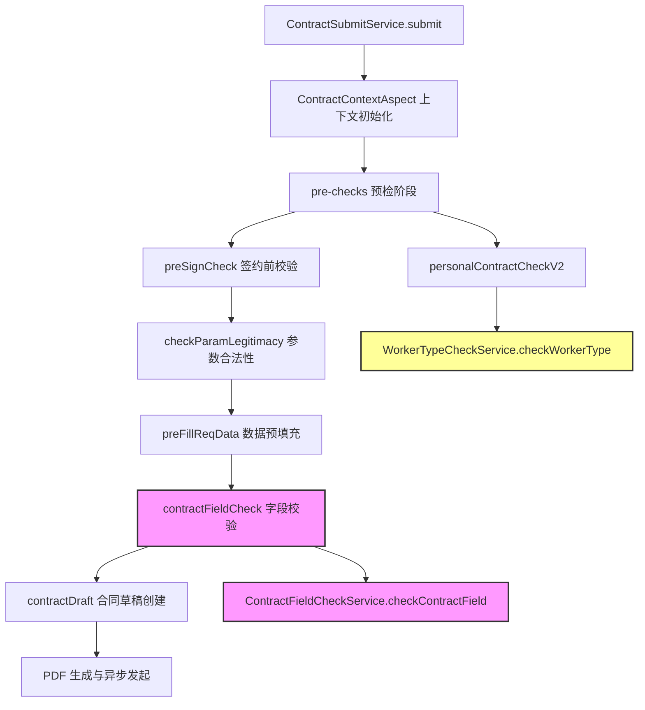
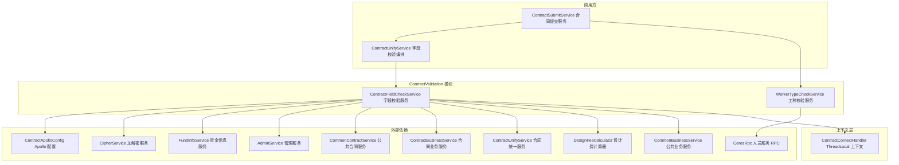
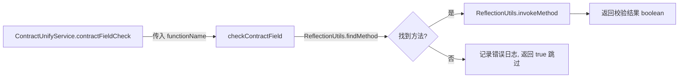
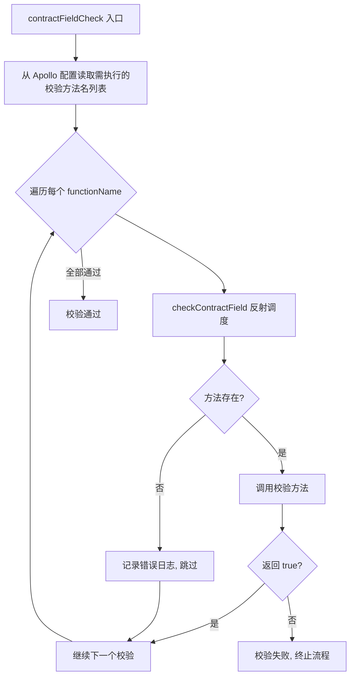
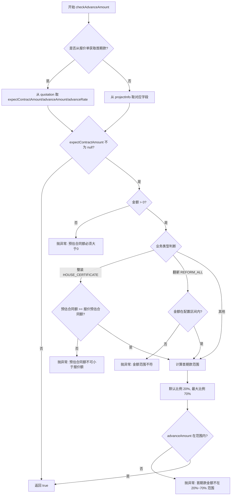
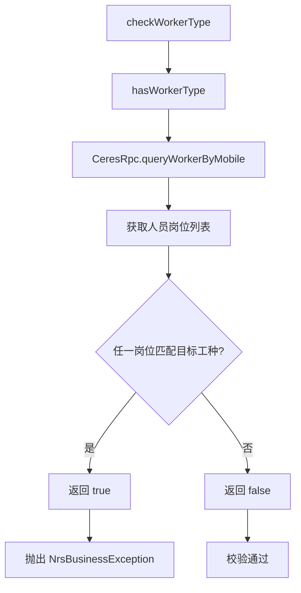
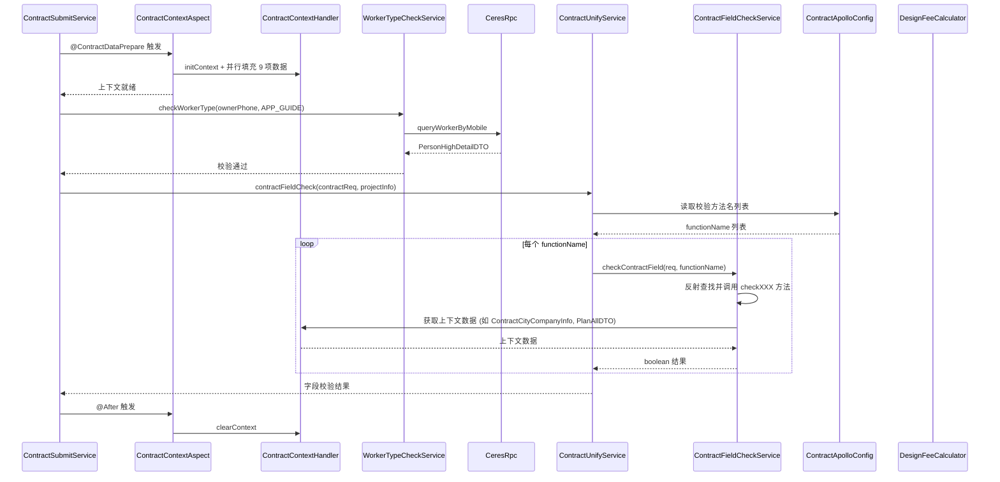
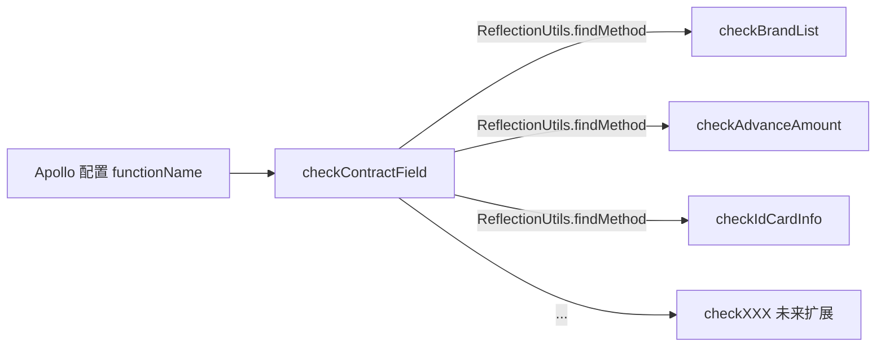
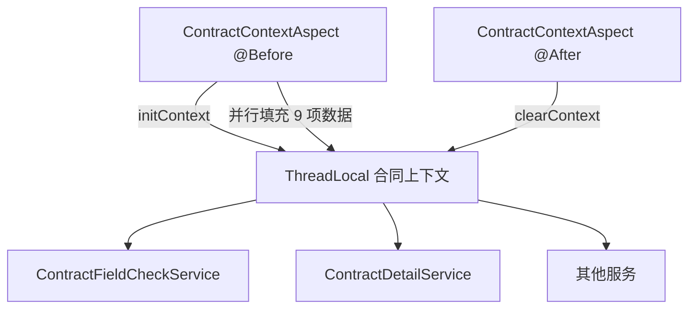

# ContractValidation 模块文档

## 模块概述

ContractValidation 是合同服务（Contract V2）中的**字段校验子模块**，负责在合同提交流程中对请求数据进行业务规则验证。模块包含两个核心服务：

- **ContractFieldCheckService**：基于反射调度的合同字段校验引擎，支持通过 Apollo 配置中心动态配置校验规则
- **WorkerTypeCheckService**：工种校验服务，通过 RPC 查询人员工种信息，防止非目标角色人员签约

该模块在合同提交流水线中位于"数据预填充"之后、"合同创建"之前，是数据合法性的最后一道防线。

---

## 模块在合同系统中的位置



---

## 架构图



---

## 核心组件详解

### 1. ContractFieldCheckService — 反射调度的字段校验引擎

#### 设计模式

采用**反射调度（Reflection Dispatch）**模式：所有校验方法遵循统一签名 `public boolean checkXXX(ContractReqDTO)`，通过入口方法 `checkContractField(contractReq, functionName)` 根据配置的函数名称字符串动态路由到对应校验方法。



> **注意**：源码注释强调"方法通过反射调用，方法名称不能修改，方法不能删除"。任何方法重命名或删除都会导致运行时校验静默跳过。

#### 校验方法清单

| 方法名 | 校验内容 | 数据来源 | 异常类型 |
|--------|---------|---------|---------|
| `checkBrandList` | 品类编码合法性、预收金额合计与报价金额合计一致性、预收金额不低于报价金额的最低比例 | `businessInfo.brandList`、`amountInfo`、`ContractContextHandler` | `NrsBusinessException` (WARN) |
| `checkBrandTotalAmount` | 品类预收总额不小于已付款金额 | `amountInfo`、`FundInfoService` | 返回 false |
| `checkAdvanceAmount` | 首期款金额在预估合同额的 20%~70% 范围内；整装校验预估合同额不小于报价；翻新校验金额在配置区间内 | `projectInfo`、`quotation`、`ContractApolloConfig` | `UtopiaBussinessException` |
| `checkAdvanceFileSize` | 首期报价单文件大小不超过配置上限（如 10M） | `quotation.preQuotationFileUrl`、`AdminService` | `NrsBusinessException` |
| `checkHouseType` | 正式套餐合同（V2.5 流程）的房屋类型须与报价侧一致 | `projectInfo.houseType`、`ContractContextHandler.planAllDTO` | `NrsBusinessException` (WARN) |
| `checkIdCardInfo` | 签约人/代理人/公司代理人/法人的身份证号与姓名一致性校验 | `signInfo` 各角色字段、`CipherService` 解密 | `UtopiaBussinessException` |
| `checkCompanyInfo` | 企业名称与统一社会信用代码非空且一致（仅公司签约类型） | `signInfo.companyName/creditCode` | `UtopiaBussinessException` |
| `checkDesignAmount` | 设计服务费（优惠后）不超过优惠前且大于 0（仅线上签约 + 开城城市） | `projectInfo` 设计费字段、`DesignFeeCalculator` | `UtopiaBussinessException` |

#### 校验流程详细图



#### checkAdvanceAmount 校验逻辑详解



---

### 2. WorkerTypeCheckService — 工种校验服务

#### 设计模式

采用**查询-守卫（Query-Guard）双层 API**模式：

- `hasWorkerType`：纯查询方法，返回 boolean，适用于条件分支
- `checkWorkerType`：守卫方法，条件不满足时直接抛异常，适用于拦截场景



#### 使用场景

当前系统中，`WorkerTypeCheckService` 被 `ContractSubmitService.personalContractCheckV2()` 调用，用于拦截外部导购手机号作为业主手机号签约的情况：

```java
workerTypeCheckService.checkWorkerType(
    ownerPhone,
    "当前签约手机号为外部导购手机号，请修改为客户手机号发起签约",
    WorkTypeEnum.APP_GUIDE
);
```

白名单机制：如果 `projectOrderId` 在 Apollo 白名单中（`contractApolloConfig.isInOwnerPhoneWhitelist`），则跳过该检查。

---

## 数据流图

### 合同提交校验完整数据流



---

## 依赖关系

### 模块依赖图

```mermaid
graph BT
    subgraph ValidationModule[ContractValidation]
        CFCS[ContractFieldCheckService]
        WTCS[WorkerTypeCheckService]
    end

    subgraph InternalModules[合同系统内部模块]
        ASPECT[ContractAspect 上下文切面]
        DETAIL[ContractDetail 合同详情]
        SUBMIT_MOD[ContractSubmission 合同提交]
        SIGN[ContractSigning 合同签署]
        CREATE[ContractCreation 合同创建]
        PERSONAL[PersonalBinding 人员绑定]
        CHANGE[ChangeContract 变更合同]
    end

    subgraph ExternalServices[外部服务与配置]
        APOLLO[ContractApolloConfig]
        CERES[CeresRpc]
        FUND[FundInfoService]
        ADMIN[AdminService]
        CIPHER[CipherService]
        COMMON_SVC[CommonContractService]
        BIZ_SVC[ContractBusinessService]
        UNIFY_SVC[ContractUnifyService]
        COMMONBIZ_SVC[CommonBusinessService]
        DESIGN_CALC[DesignFeeCalculator]
        CFG_SNAP[ProjectConfigSnapService]
        FUND_BASE[FundBaseService]
    end

    CFCS --> APOLLO
    CFCS --> CIPHER
    CFCS --> FUND
    CFCS --> ADMIN
    CFCS --> COMMON_SVC
    CFCS --> BIZ_SVC
    CFCS --> UNIFY_SVC
    CFCS --> COMMONBIZ_SVC
    CFCS --> DESIGN_CALC
    CFCS --> CFG_SNAP
    CFCS --> FUND_BASE
    CFCS --> ASPECT

    WTCS --> CERES

    SUBMIT_MOD --> CFCS
    SUBMIT_MOD --> WTCS
    UNIFY_SVC --> CFCS
```



### 外部依赖说明

| 依赖 | 类型 | 用途 |
|------|------|------|
| `ContractApolloConfig` | Apollo 配置中心 | 品牌编码映射、预收比例阈值、翻新金额区间、文件大小限制、设计费城市列表、白名单等 |
| `CeresRpc` | RPC 远程调用 | 查询人员详细信息（工种、岗位），用于工种校验 |
| `CipherService` | 内部服务 | 身份证号等敏感字段解密，用于姓名-证件号一致性校验 |
| `FundInfoService` | DAO 服务 | 查询关联资金信息（已付金额），用于预收总额校验 |
| `AdminService` | 内部服务 | 获取 PDF 文件大小，用于报价单文件大小校验 |
| `CommonContractService` | 内部服务 | 身份证号-姓名一致性校验（`checkIdName`） |
| `ContractBusinessService` | 内部服务 | 公司名称与统一社会信用代码一致性校验 |
| `ContractUnifyService` | 核心编排服务 | 字段校验入口编排、首期款来源判断、设计费计算开关判断 |
| `DesignFeeCalculator` | 子模块 | 判断是否跳过设计费校验、设计费计算逻辑 |
| `CommonBusinessService` | 内部服务 | 判断流程版本（V2.5）、获取业务类型 |
| `ContractContextHandler` | 上下文层 | 提供 ThreadLocal 上下文数据（城市公司信息、报价方案等） |
| `ProjectConfigSnapService` | DAO 服务 | 项目配置快照查询 |
| `FundBaseService` | 基础服务 | 资金基础操作 |

---

## 关键设计模式

### 1. 反射调度模式（Reflection Dispatch）



**优势**：校验规则通过 Apollo 配置中心动态管理，新增或移除校验项无需代码变更和重新部署。

**风险**：
- 方法名拼写错误导致校验静默跳过（仅记录 ERROR 日志，返回 true）
- 方法签名变更后反射调用失败
- 编译期无法捕获配置错误

### 2. ThreadLocal 上下文模式（ContractContextHandler）



**优势**：避免在方法调用链中层层传递上下文参数，各校验方法通过静态方法直接获取所需数据。

**风险**：
- 必须确保 `clearContext` 在所有路径（含异常）上执行，否则造成内存泄漏
- 隐式依赖降低了方法的可测试性

### 3. 守卫方法模式（Guard Method）

`WorkerTypeCheckService` 的双层 API 设计：
- `hasWorkerType`：纯查询，适用于条件判断
- `checkWorkerType`：守卫拦截，适用于提交前校验

### 4. 枚举驱动的条件分支

校验逻辑大量依赖枚举值进行分支控制：

| 枚举 | 分支影响 |
|------|---------|
| `BusinessTypeEnum` | `HOUSE_CERTIFICATE` → 整装校验；`REFORM_ALL` → 翻新金额区间校验 |
| `ContractObjectTypeEnum` | `PERSON` → 身份证校验；`COMPANY` → 公司信息校验 |
| `SignChannelTypeEnum` | `ONLINE` → 设计费校验生效；`OFFLINE` → 跳过 |
| `ContractTypeEnum` | `PACKAGE_FORMAL` + V2.5 → 房屋类型校验 |
| `CertificateTypeEnum` | `ID` → 触发姓名-证件号一致性校验 |

---

## 配置驱动机制

校验规则通过 Apollo 配置中心进行管理，核心配置项：

| 配置项 | 作用域 | 说明 |
|--------|-------|------|
| 校验方法名列表 | 全局/合同类型 | 控制 `contractFieldCheck` 执行哪些 `checkXXX` 方法 |
| `advanceBrandDueAmountPercent` | 全局 | 品类预收金额最低比例（如 0.2 = 20%） |
| `advanceReformMinAmount` / `advanceReformMaxAmount` | 全局 | 翻新预估合同额范围 |
| `advanceReformMaxSize` | 全局 | 首期报价单文件大小上限（MB） |
| `standardDesignFeeCityCodes` | 城市维度 | 启用标准设计费校验的城市编码列表 |
| `ownerPhoneWhitelist` | 订单维度 | 跳过工种校验的订单白名单 |
| `brandNameByCode` | 公司维度 | 品牌编码到品牌名称的映射表 |

---

## 与其他模块的关系

| 关联模块 | 关系描述 | 文档链接 |
|---------|---------|---------|
| **ContractDetail** | 校验通过后的合同详情展示依赖校验结果 | [ContractDetail](ContractDetail.md) |
| **ContractSubmission** | 提交流程中调用本模块进行字段校验和工种校验 | [ContractSubmission](ContractSubmission.md) |
| **ContractSigning** | 签署流程中涉及的签约人信息校验逻辑由本模块提供 | [ContractSigning](ContractSigning.md) |
| **ContractAspect** | 提供 ThreadLocal 上下文生命周期管理，本模块的校验方法依赖上下文数据 | [ContractAspect](ContractAspect.md) |
| **ContractCreation** | 合同创建前的数据合法性校验由本模块完成 | [ContractCreation](ContractCreation.md) |

---

## 注意事项与风险提示

1. **反射方法命名约束**：`ContractFieldCheckService` 中所有 `public boolean checkXXX(ContractReqDTO)` 方法的名称不可修改、不可删除，否则 Apollo 配置中的 functionName 将无法匹配，导致校验静默跳过。

2. **校验静默跳过**：当反射找不到方法时，`checkContractField` 返回 `true`（通过），仅记录 ERROR 日志。这意味着配置拼写错误不会阻止合同提交，但会跳过必要的校验。

3. **异常类型不一致**：部分校验方法抛出 `UtopiaBussinessException`，部分抛出 `NrsBusinessException`，部分仅返回 `false`。调用方需对三种结果路径都有处理。

4. **ThreadLocal 依赖**：`checkBrandList` 和 `checkHouseType` 依赖 `ContractContextHandler` 提供的上下文数据。如果上下文未正确初始化，`Objects.requireNonNull(contractCityCompanyInfo)` 将抛出 NPE。

5. **工种校验白名单**：`WorkerTypeCheckService` 的拦截可通过 Apollo 白名单绕过，需确保白名单管理的审批流程到位。