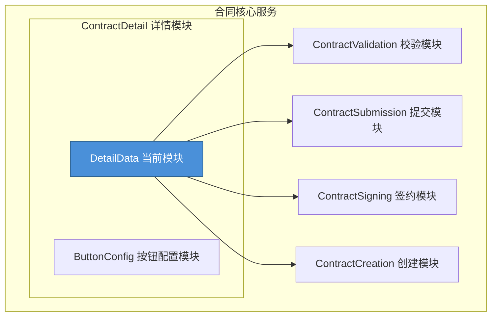
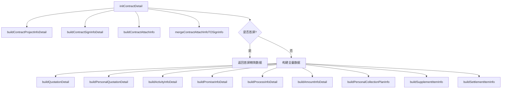
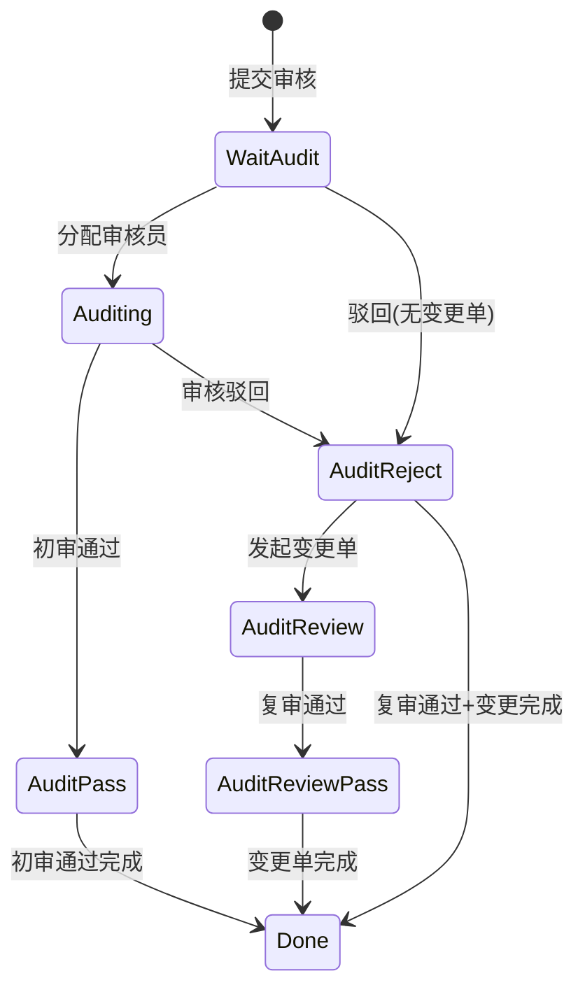
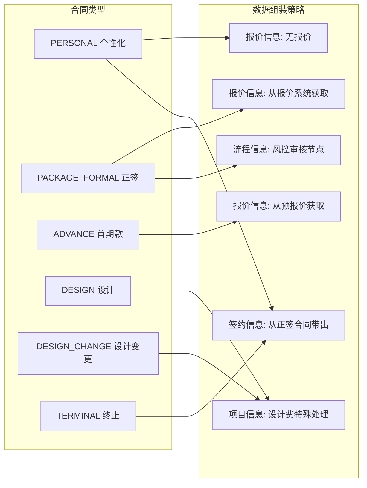
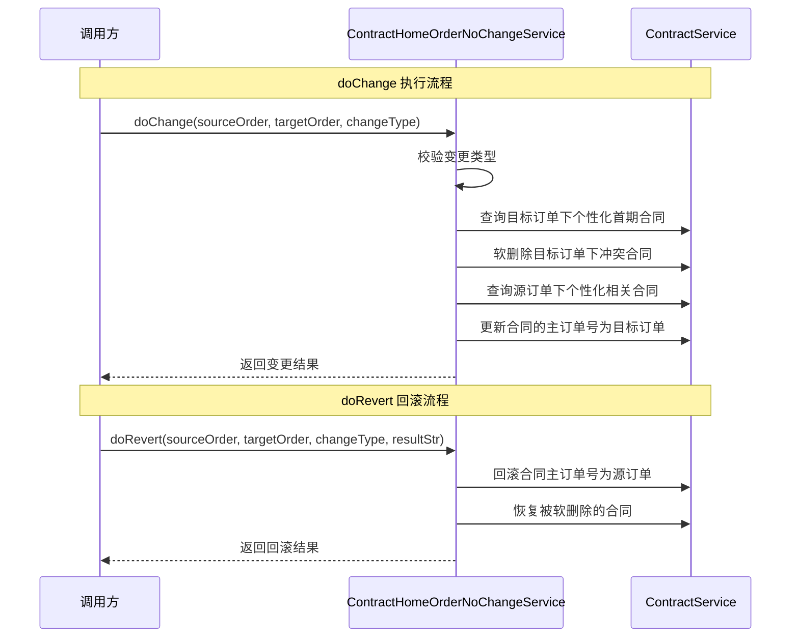
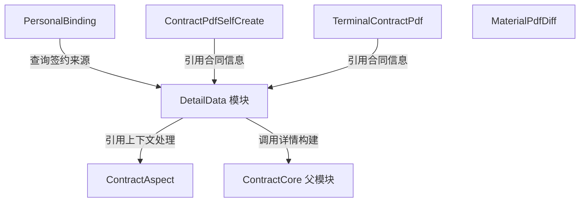
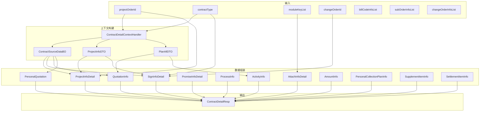
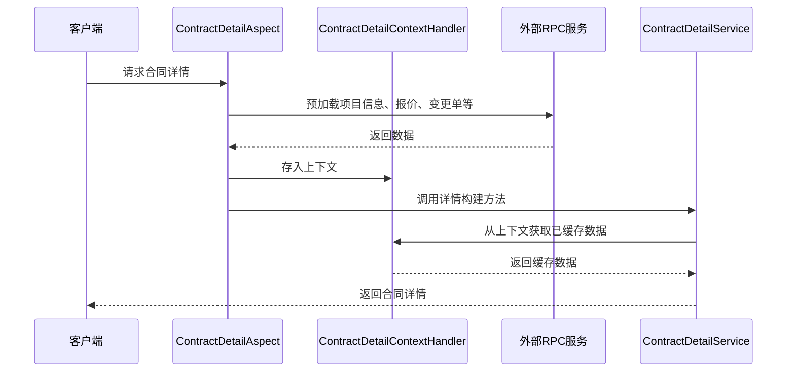

# DetailData 模块文档

## 1. 模块概述

DetailData 模块是合同详情（ContractDetail）子模块的核心数据组装层，位于合同系统（ContractCore）的详情分支下。其主要职责是**根据合同类型、项目订单、变更单等上下文信息，组装并返回完整的合同详情数据**，供前端页面渲染使用。

该模块包含两个核心服务：

- **`ContractDetailService`**：合同详情服务，负责合同全量数据的初始化、各子模块信息的构建与组装（项目信息、签约信息、报价信息、附件信息、流程信息等）。
- **`ContractHomeOrderNoChangeService`**：主订单号变更服务，处理家装主订单号变更场景下合同数据的迁移与回滚。

---

## 2. 模块在系统中的位置

DetailData 模块作为详情数据的"聚合器"，需要从校验、提交、签约、创建等多个子模块获取信息来构建完整的合同详情视图。

---

## 3. 核心组件详解

### 3.1 ContractDetailService

合同详情服务是该模块的核心，负责合同详情的全量数据组装。该类是一个 Spring Service，通过依赖注入聚合了大量下游服务。

#### 3.1.1 主入口方法

`initContractDetail` 是合同详情的初始化入口，根据是否为首屏加载采用不同的数据组装策略：
- **首屏加载**：仅返回 `signInfo`、`contractBaseInfo`、`businessInfo`、`projectInfo` 四个核心对象，减少首屏加载耗时
- **全量加载**：返回包括报价、活动、承诺、附件、流程等在内的完整信息

#### 3.1.2 各子模块构建方法

| 方法名 | 职责 | 依赖的核心服务 |
|--------|------|---------------|
| `buildContractProjectInfoDetail` | 构建项目信息（客户、房屋、设计师、户型等） | `commonContractService`、`homeAndPcCommonService`、`projectInfoReadService` |
| `buildContractSignInfoDetail` | 构建签约信息（签约主体、签约人、代理、证件等） | `contractUserService`、`attachCommonService`、`changeOrderService` |
| `buildContractAttachInfo` | 构建合同附件信息（证件、房产证、营业执照等） | `attachCommonService`、`contractUnifyService` |
| `buildQuotationDetail` | 构建报价信息（套餐、价格、图纸附件等） | `quotationFeignService`、`atomBudgetRpc` |
| `buildPromiseInfoDetail` | 构建承包约定信息（材料、工期、设计费等） | `contractMaterialService`、`contractApolloConfig` |
| `buildProcessInfoDetail` | 构建审核流程信息（风控审核状态、节点等） | `auditRpc`、`atomChangeRpc` |
| `buildActivityInfoDetail` | 构建优惠/活动信息 | `ContractDetailContextHandler`（上下文） |
| `buildPersonalQuotationDetail` | 构建个性化报价信息 | `ContractDetailContextHandler`（上下文） |
| `buildPersonalCollectionPlanInfo` | 构建个性化收款计划 | `ContractDetailContextHandler`（上下文） |
| `buildSupplementItemInfo` | 构建补充协议信息 | `contractRelationService` |
| `buildSettlementItemInfo` | 构建和解协议信息 | 无外部依赖 |
| `buildAmountInfoDetail` | 构建金额汇总信息 | `ContractDetailContextHandler`（上下文） |

#### 3.1.3 审核流程状态计算

`buildProcessInfoDetail` 方法中包含了复杂的审核流程状态计算逻辑，核心状态机如下：

状态计算逻辑 (`computeProcessStatus`) 综合考虑了：
- 风控审核状态（待分配、审核中、通过、驳回）
- 变更单状态（申请中、变更中、待签、待付等）
- 审核类型（初审/复审）

#### 3.1.4 合同类型与数据组装的映射关系

#### 3.1.5 关键业务规则

**首屏优化策略**：通过 `ContractDetailContextHandler.isFirstScreen()` 判断当前请求是否为首屏，首屏仅加载 4 个核心对象以降低延迟。

**附件 OCR 开城控制**：`attachOcrOpenCity` 标记影响附件信息的读取方式——OCR 开城城市使用 documentCode 标识附件，非开城城市直接使用附件 URL。

**合同模式（contractMode）决定**：根据全案开城状态、个性化报价数量、业务类型等综合判断是否为全案签约模式。

**重签判断**：通过 `reSign` 方法查询同类型已确认/已签署的合同来判断当前是否为重签场景。

---

### 3.2 ContractHomeOrderNoChangeService

该服务处理家装主订单号变更场景，提供变更执行（`doChange`）和回滚（`doRevert`）能力。

**核心逻辑**：
1. **变更执行**：先软删除目标订单下冲突的个性化首期合同，再将源订单下的个性化相关合同的主订单号迁移到目标订单
2. **回滚**：将迁移的合同主订单号还原，并恢复被软删除的合同

该服务使用了 `@Transactional` 注解保证数据一致性，通过 `ContractHomeOrderNoChangeResultDTO` 记录变更前的状态，支持可靠的回滚。

---

## 4. 依赖关系

### 4.1 ContractDetailService 依赖图

```mermaid
graph TD
    CDS[ContractDetailService]

    subgraph 内部DAO层
        CS[ContractService]
        CFS[ContractFieldService]
        CUS[ContractUserService]
        CMS[ContractMaterialService]
        CAS[ContractAttachService]
        CRS[ContractRelationService]
    end

    subgraph 内部业务服务层
        CCS[CommonContractService]
        HPC[HomeAndPcCommonService]
        CBS[ContractBusinessService]
        CUS2[PcContractService]
        CUN[ContractUnifyService]
        FBS[FundBaseService]
        PCS[PayConfigService]
        COS[CancelOrderService]
        DES[DesignFeeAuditService]
    end

    subgraph 外部RPC服务
        QFS[QuotationFeignService]
        ABR[AtomBudgetRpc]
        ACR[AtomChangeRpc]
        AR[AuditRpc]
        CR[CeresRpc]
        OSR[OrderStandardQueryRpc]
    end

    subgraph 配置与上下文
        CAC[ContractApolloConfig]
        CAC2[CommonApolloConfig]
        CCH[ContractDetailContextHandler]
    end

    subgraph 其他服务
        S3S[S3Service]
        BAC[BaseAuditChannel]
        PIR[ProjectInfoReadService]
    end

    CDS --> CS
    CDS --> CFS
    CDS --> CUS
    CDS --> CMS
    CDS --> CAS
    CDS --> CRS
    CDS --> CCS
    CDS --> HPC
    CDS --> CBS
    CDS --> CUS2
    CDS --> CUN
    CDS --> FBS
    CDS --> PCS
    CDS --> COS
    CDS --> DES
    CDS --> QFS
    CDS --> ABR
    CDS --> ACR
    CDS --> AR
    CDS --> CR
    CDS --> OSR
    CDS --> CAC
    CDS --> CAC2
    CDS --> CCH
    CDS --> S3S
    CDS --> BAC
    CDS --> PIR
```

### 4.2 外部依赖说明

| 外部系统 | RPC 服务 | 用途 |
|---------|---------|------|
| 报价系统 | `QuotationFeignService` | 设计费配置查询 |
| Atom 预算 | `AtomBudgetRpc` | 预报价列表与详情查询 |
| Atom 变更 | `AtomChangeRpc` | 变更单列表查询 |
| 审核系统 | `AuditRpc` | 风控审核详情查询 |
| 服务者中心 | `CeresRpc` | 设计师人员信息查询 |
| 家装主订单 | `OrderStandardQueryRpc` | 家装标准输出查询 |

### 4.3 模块间依赖

---

## 5. 数据流

### 5.1 合同详情初始化数据流

### 5.2 上下文数据流

`ContractDetailContextHandler` 是一个线程级别的上下文持有者，在请求生命周期内缓存从各外部系统获取的数据，避免重复调用：

---

## 6. 关键设计模式

### 6.1 上下文模式（Context Pattern）

通过 `ContractDetailContextHandler` 实现请求级别的数据缓存，各子模块构建方法通过上下文获取共享数据，避免重复 RPC 调用。上下文中存储的关键数据包括：

| 上下文数据 | 类型 | 来源 |
|-----------|------|------|
| `projectInfoDTO` | `ProjectInfoDTO` | 客源/项目系统 |
| `planAllDTO` | `PlanAllDTO` | 报价系统 |
| `changeOrderList` | `List<ChangeListDTO>` | Atom 变更系统 |
| `auditDetailDTO` | `AuditDetailDto` | 审核系统 |
| `drawingDTO` | `DrawingDTO.DeliverDrawingDTO` | BIM 图纸系统 |
| `attachInfoDetail` | `AttachInfoDetail` | 备件系统 |
| `contractSourceDataBO` | `ContractSourceDataBO` | 主订单协议数据 |
| `designQuoteFeeDTO` | `DesignQuoteFeeDTO` | 设计费报价 |
| `designSignPriceInfo` | `DesignSignPriceInfo` | 设计签约价格 |

### 6.2 建造者模式（Builder Pattern）

各子模块详情对象（`ContractDetailResp`、`BusinessInfoDetail`、`ProcessInfo.Node` 等）均采用 Builder 模式构建，确保对象创建的可读性和灵活性。

### 6.3 策略分支模式

根据不同合同类型（正签、个性化、首期款、设计、终止等）采用不同的数据组装策略。例如：
- 正签合同：完整报价 + 审核流程 + 附件
- 首期款合同：预报价 + 首期款比例
- 设计合同：设计师职级 + 标准设计费
- 个性化合同：从正签合同带出签约信息

### 6.4 首屏优化模式

通过 `ContractDetailContextHandler.isFirstScreen()` 标记实现分屏加载：
- 首屏仅加载 4 个核心对象（`signInfo`、`contractBaseInfo`、`businessInfo`、`projectInfo`）
- 非首屏加载全部 12+ 个子模块信息
- 部分子模块在草稿态会实时获取最新数据（如设计师信息、报价列表等）

### 6.5 事件驱动模式（ContractHomeOrderNoChangeService）

主订单号变更采用 `doChange` + `doRevert` 的命令模式，通过 `ContractHomeOrderNoChangeResultDTO` 记录变更状态，支持事务性回滚，适配领域事件驱动架构。

---

## 7. 与其他模块的关系

| 相关模块 | 关系描述 |
|---------|---------|
| [ButtonConfig](ButtonConfig.md) | 同属 ContractDetail 子模块，根据合同状态和类型配置页面操作按钮 |
| [ContractAspect](../ContractAspect/ContractAspect.md) | 提供 AOP 切面拦截，在详情请求前预加载上下文数据 |
| [ContractValidation](../ContractValidation/ContractValidation.md) | 在合同提交前进行字段校验，依赖 DetailData 提供的字段值 |
| [ContractSubmission](../ContractSubmission/ContractSubmission.md) | 保存草稿/提交托管，需读取 DetailData 组装的合同数据 |
| [ContractSigning](../ContractSigning/ContractSigning.md) | 公司签章/自行盖章，需引用 DetailData 中的签约信息 |
| [ContractCreation](../ContractCreation/ContractCreation.md) | 脚本化创建合同，创建完成后由 DetailData 组装展示数据 |
| [PersonalBinding](../PersonalBinding/PersonalBinding.md) | 个性化合同签约来源策略，影响 DetailData 中报价和绑定订单的组装 |

---

## 8. 注意事项与维护建议

1. **方法体量过大**：`buildContractProjectInfoDetail`、`buildContractSignInfoDetail`、`buildContractAttachInfo` 等方法超过 100 行，包含大量条件分支和类型判断，建议后续按合同类型拆分为独立的策略类。

2. **上下文依赖隐式化**：多个构建方法通过 `ContractDetailContextHandler` 静态方法访问上下文数据，增加了方法的隐式依赖，测试时需要精心准备上下文数据。

3. **`@Lazy` 注入**：`contractUnifyService` 和 `attachCommonService` 使用了 `@Lazy` 注解避免循环依赖，说明模块间存在一定的耦合。

4. **自引用**：`ContractDetailService` 注入了自身（`contractDetailService`），用于通过 Spring AOP 代理调用，确保切面拦截生效（如 `mergeContractAttachInfoTOSignInfo` 等方法）。