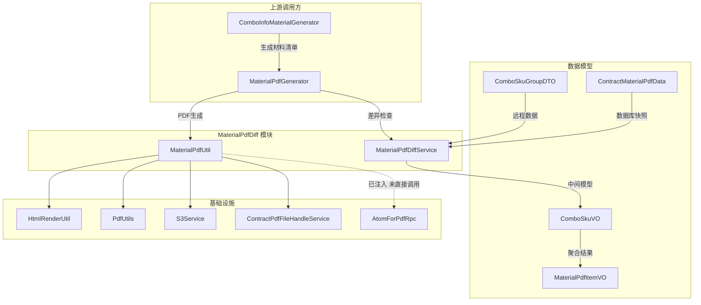
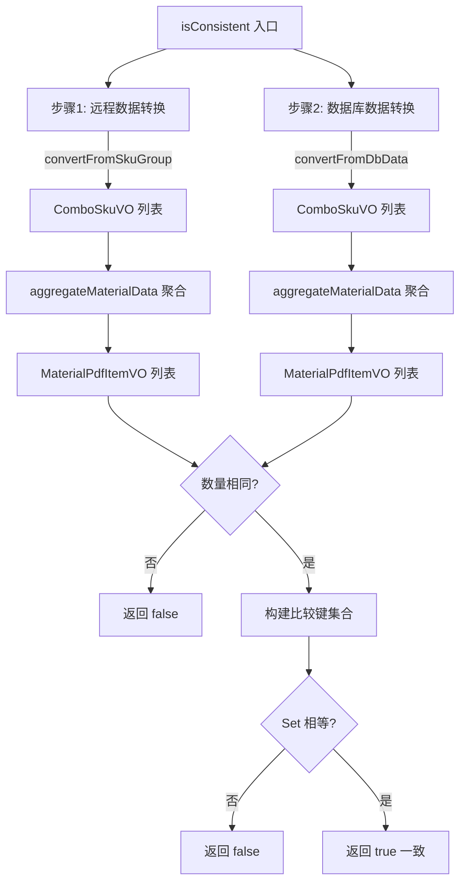
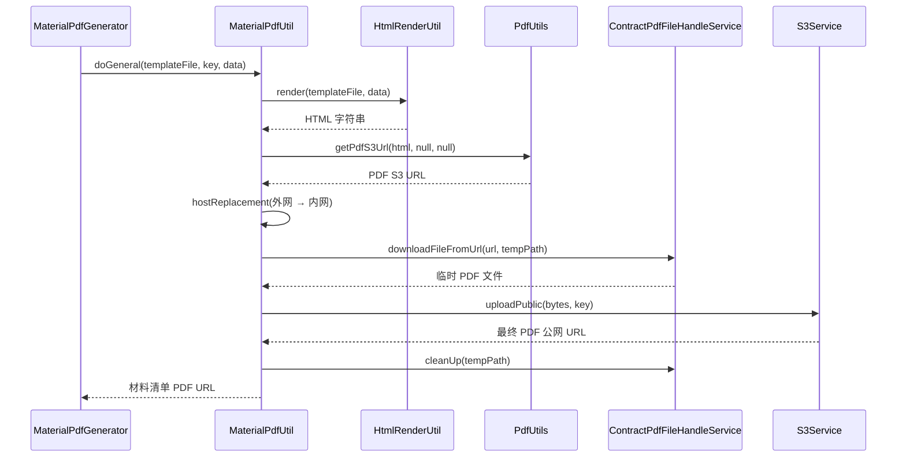
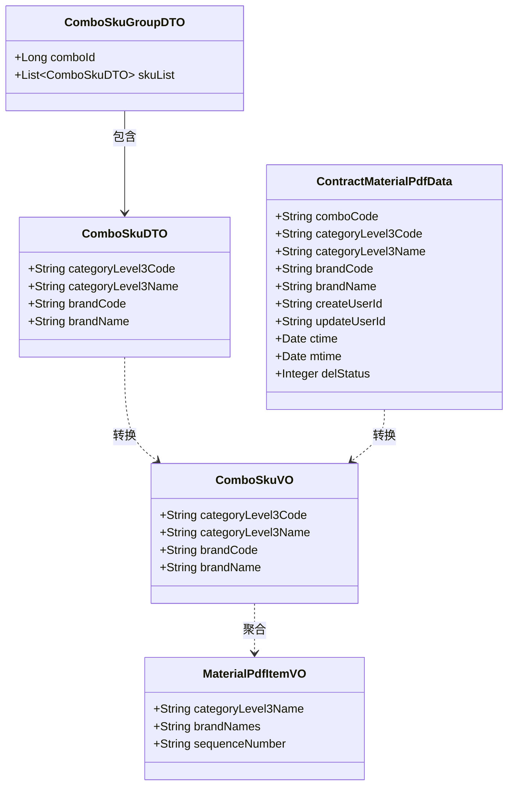
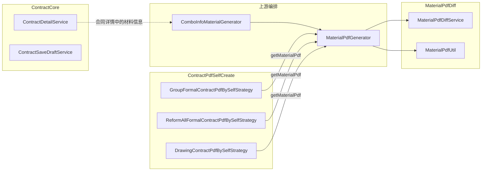
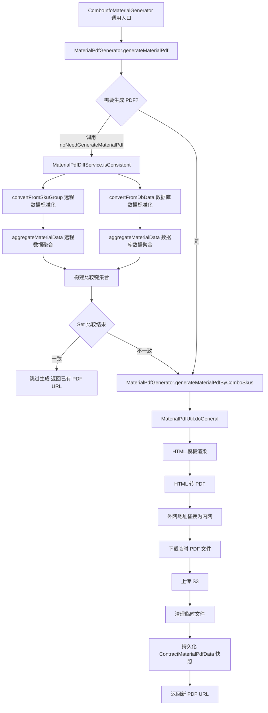
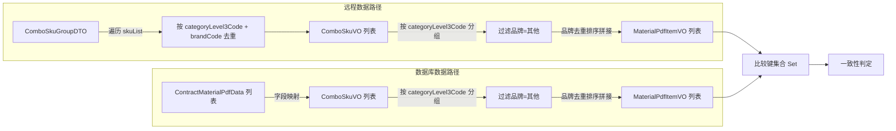

# MaterialPdfDiff 模块文档

## 模块概述

`MaterialPdfDiff` 模块位于合同服务（Contract Service）的材料清单子系统中，路径为 `combo/material/pdf/`。该模块承担两项核心职责：

1. **数据差异检查**（`MaterialPdfDiffService`）：将远程 SCM 实时查询的套餐 SKU 数据与数据库中已持久化的材料 PDF 快照数据进行比对，判断数据是否一致，从而决定是否需要重新生成材料配送清单 PDF。
2. **PDF 生成工具**（`MaterialPdfUtil`）：封装 HTML 模板渲染、PDF 转换、S3 上传的完整流程，为上层调用方提供一站式 PDF 生成能力。

该模块是合同材料清单 PDF 生成管线中的关键环节，上游由 `MaterialPdfGenerator` 编排调用，下游依赖多个基础设施服务完成文件处理。

---

## 架构总览



---

## 核心组件详解

### MaterialPdfDiffService

`MaterialPdfDiffService` 是一个**无状态纯服务**（`@Service`），不依赖任何外部资源注入。其设计遵循"**先转换、再聚合、后比较**"的三段式差异比对策略。



#### 方法清单

| 方法 | 可见性 | 职责 |
|------|--------|------|
| `isConsistent` | public | 入口方法，接收远程数据和数据库数据，返回一致性布尔值 |
| `convertFromSkuGroup` | public | 将 `ComboSkuGroupDTO` 转换为 `List<ComboSkuVO>`，按 `(categoryLevel3Code + brandCode)` 去重 |
| `convertFromDbData` | public | 将 `List<ContractMaterialPdfData>` 转换为 `List<ComboSkuVO>` |
| `compareMaterialData` | private | 执行聚合后的集合比较 |
| `aggregateMaterialData` | private | 按三级类目分组、过滤"其他"品牌、拼接品牌名、排序并编号 |
| `buildMaterialItemCompareKey` | private | 构建 `categoryLevel3Name\|brandNames` 格式的唯一比较键 |

#### 数据聚合规则

`aggregateMaterialData` 方法执行的聚合逻辑是整个差异比对的核心，规则如下：

| 步骤 | 规则 | 说明 |
|------|------|------|
| 1 | 按 `categoryLevel3Code` 分组 | 同一三级类目下的 SKU 归为一组 |
| 2 | 过滤 `brandName == "其他"` | 排除非特定品牌项 |
| 3 | 品牌名去重后按字母序排序，以 `/` 连接 | 例如 `"TOTO/科勒/箭牌"` |
| 4 | 过滤品牌为空的组 | 品牌全被过滤的三级类目不参与比较 |
| 5 | 按 `categoryLevel3Name` 正序排序并编号 | 生成带序号的最终列表 |

#### 比较键生成

最终比较键格式为 `categoryLevel3Name|brandNames`，例如：`"马桶|TOTO/科勒"`。两侧数据各自生成 `Set<String>`，通过 `Set.equals()` 实现无序比较，确保品牌顺序差异不影响结果。

---

### MaterialPdfUtil

`MaterialPdfUtil` 是一个 `@Component`，封装了 PDF 生成的完整基础设施调用链。



#### 内外网地址替换

`MaterialPdfUtil` 包含一个特殊的 host 替换逻辑，将外网 CDN 地址替换为内网地址以提高文件下载速度：

| 配置 | 值 | 用途 |
|------|-----|------|
| `REPLACE_HOST` | `https://file.ljcdn.com` | 外网 CDN 地址 |
| `TARGE_HOST` | `http://file.media.lianjia.com` | 内网文件服务地址 |

当 `PdfUtils` 返回的 S3 URL 以 `REPLACE_HOST` 开头时，自动替换为 `TARGE_HOST`，确保后续 `downloadFileFromUrl` 走内网下载。

---

## 数据模型



模型层次说明：

| 模型 | 来源 | 角色 |
|------|------|------|
| `ComboSkuGroupDTO` / `ComboSkuDTO` | SCM 远程接口 | 外部输入，远程实时数据 |
| `ContractMaterialPdfData` | 数据库（`ContractMaterialPdfDataRepository`） | 内部存储，上一次 PDF 生成时的快照 |
| `ComboSkuVO` | 模块内部 | 统一中间表示，消除远程 DTO 与 DB 模型的结构差异 |
| `MaterialPdfItemVO` | 模块内部 | 聚合后的最终比对单元和 PDF 渲染数据源 |

---

## 在合同模块中的定位



`MaterialPdfDiff` 模块在合同体系中属于**合同 PDF 自生成**（[ContractPdfSelfCreate](ContractPdfSelfCreate.md)）的下游支撑模块。各种 PDF 生成策略（`DrawingContractPdfBySelfStrategy`、`GroupFormalContractPdfBySelfStrategy` 等）在生成正式合同时，需要附带材料配送清单 PDF，此时通过 `MaterialPdfGenerator` → `MaterialPdfDiffService` / `MaterialPdfUtil` 链路完成差异检查与 PDF 生成。

---

## 数据流

### 完整的差异检查与 PDF 生成流程



### 转换与聚合的详细数据流转



---

## 依赖关系

### 内部依赖

| 依赖方向 | 源组件 | 目标组件 | 接口/方法 |
|----------|--------|----------|-----------|
| 上游调用 | `MaterialPdfGenerator` | `MaterialPdfDiffService` | `isConsistent()`, `convertFromSkuGroup()` |
| 上游调用 | `MaterialPdfGenerator` | `MaterialPdfUtil` | `doGeneral()` |
| 更上游 | `ComboInfoMaterialGenerator` | `MaterialPdfGenerator` | `generateMaterialPdf()`, `noNeedGenerateMaterialPdf()` |
| PDF 上下文 | [ContractPdfSelfCreate](ContractPdfSelfCreate.md) 策略 | `MaterialPdfGenerator` | `getMaterialPdf()` |

### 外部依赖

| 依赖服务 | 注入位置 | 用途 |
|----------|----------|------|
| `HtmlRenderUtil` | `MaterialPdfUtil` | FreeMarker/Thymeleaf 模板渲染为 HTML |
| `PdfUtils` | `MaterialPdfUtil` | HTML 转 PDF 文件并上传临时 S3 |
| `S3Service` | `MaterialPdfUtil` | 最终 PDF 公网 S3 上传 |
| `ContractPdfFileHandleService` | `MaterialPdfUtil` | 临时文件下载与清理 |
| `AtomForPdfRpc` | `MaterialPdfUtil` | 远程 PDF 服务 RPC（已注入，当前 `doGeneral` 未直接调用） |

### 数据依赖

| 数据源 | 模型 | 提供方 |
|--------|------|--------|
| SCM 材料选品服务 | `ComboSkuGroupDTO` / `ComboSkuDTO` | 远程 RPC |
| 合同材料 PDF 数据表 | `ContractMaterialPdfData` | `ContractMaterialPdfDataRepository` |

---

## 关键设计模式

### 1. 统一中间模型（Canonical Intermediate Model）

`ComboSkuVO` 作为统一的中间表示，消除了远程 DTO（`ComboSkuDTO`）和数据库实体（`ContractMaterialPdfData`）之间的结构差异。两条数据路径各自独立转换为 `ComboSkuVO` 后，下游比较逻辑无需感知数据来源。

```
ComboSkuGroupDTO ──→ ComboSkuVO ←── ContractMaterialPdfData
```

### 2. 聚合-比较两阶段处理

差异比对不是简单的字段级比较，而是经历了**聚合**（分组、过滤、拼接、排序）后才进行比较。这确保了比对结果反映的是"最终 PDF 内容"层面的一致性，而非原始 SKU 数据层面的一致性。

### 3. Set 比较替代 List 比较

通过 `Set<String>.equals()` 实现无序比较，避免了因数据返回顺序不同导致的误判。比较键格式 `categoryLevel3Name|brandNames` 确保了足够的区分度。

### 4. 幂等 PDF 生成

通过 `isConsistent()` 的差异检查，`MaterialPdfGenerator` 可以避免不必要的重复 PDF 生成，节省计算资源和 S3 存储成本。只有当远程数据与快照不一致时才触发重新生成。

### 5. 内外网地址自适应

`MaterialPdfUtil.hostReplacement()` 确保在服务端环境（内网）中始终使用内网地址下载 PDF 中间文件，避免外网带宽瓶颈。

---

## 注意事项与扩展建议

| 项目 | 说明 |
|------|------|
| **临时工具类定位** | `MaterialPdfUtil` 源码注释标注为"临时先放这里，后续统一管理维护到合理的地方"，后续应迁移至统一的 PDF 工具层 |
| **AtomForPdfRpc 未使用** | `AtomForPdfRpc` 已注入但当前 `doGeneral` 方法未直接调用，可能是历史遗留或预留扩展 |
| **宿主替换硬编码** | 内外网地址以 `static final` 常量硬编码，建议迁移至配置中心或 Nacos 配置 |
| **去重逻辑仅基于远程数据** | `convertFromSkuGroup` 对远程数据执行 `(categoryLevel3Code + brandCode)` 去重，而 `convertFromDbData` 不去重——依赖数据库侧保证无重复 |
| **"其他"品牌过滤** | 硬编码过滤 `brandName == "其他"`，如业务规则变化需修改代码 |