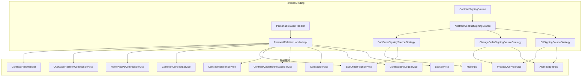
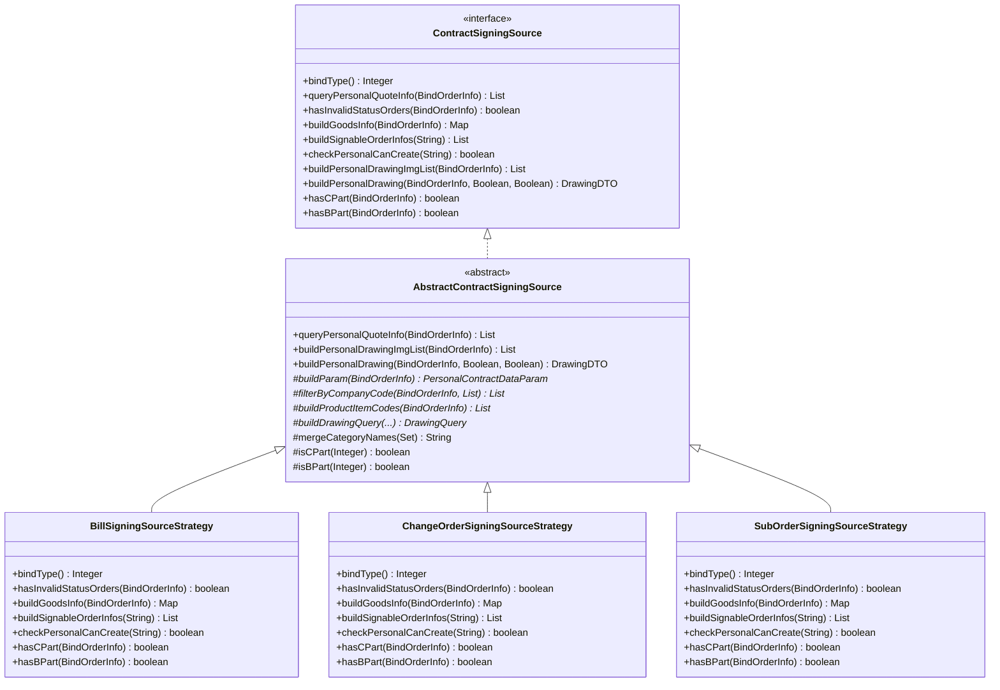
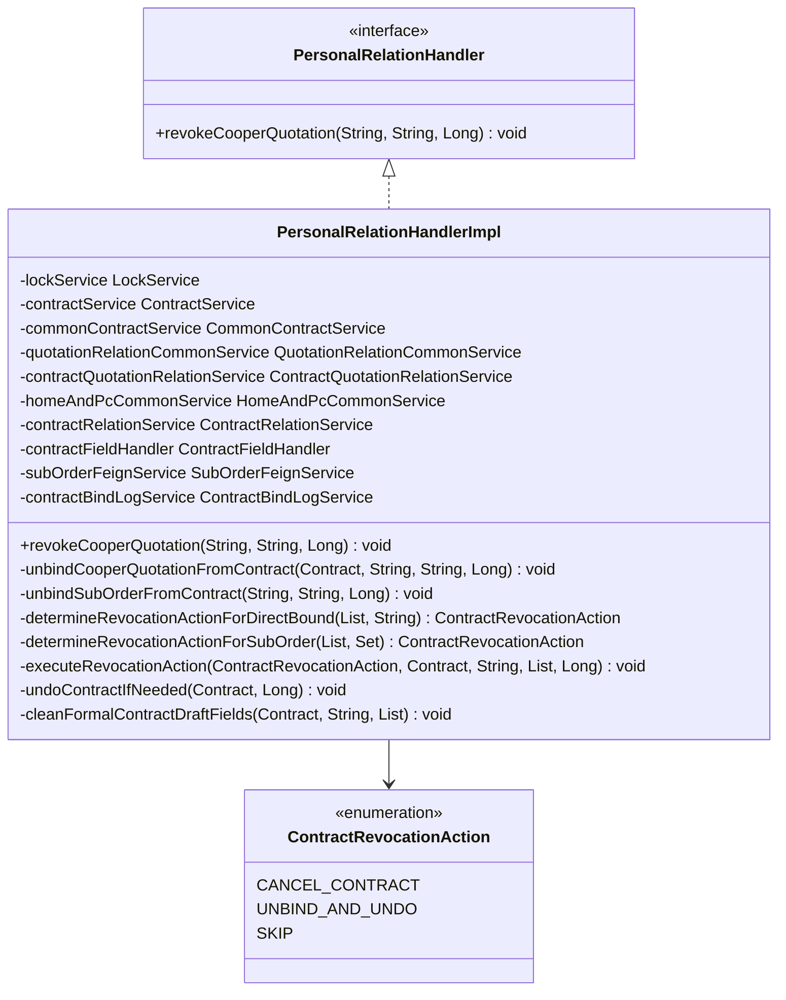
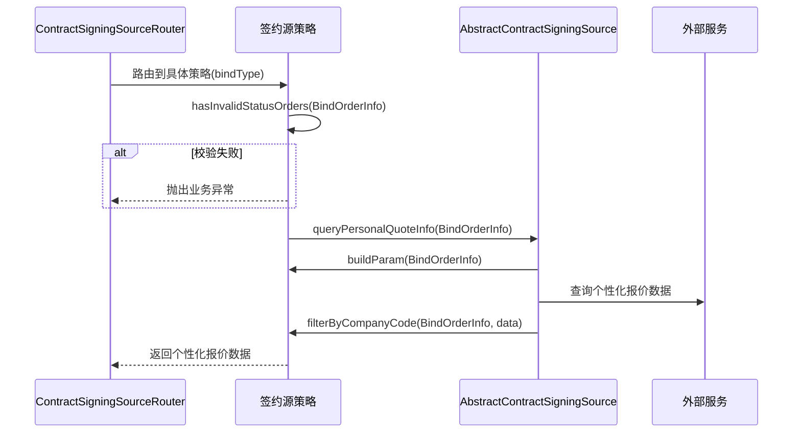
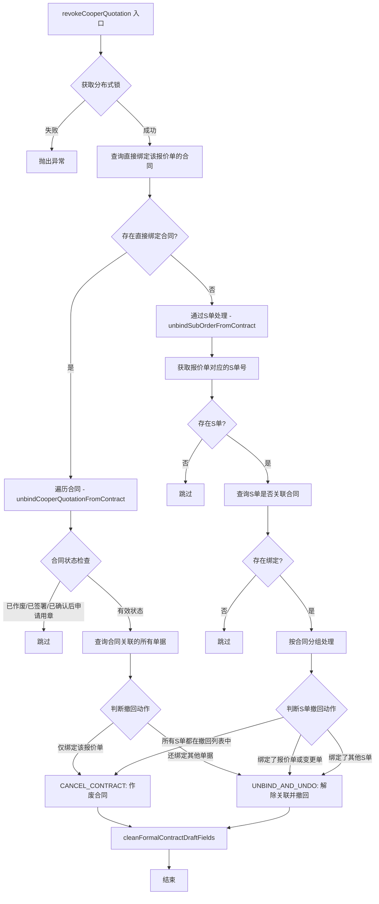
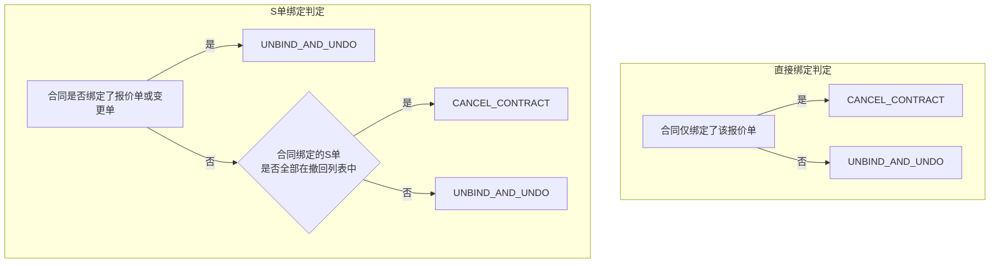
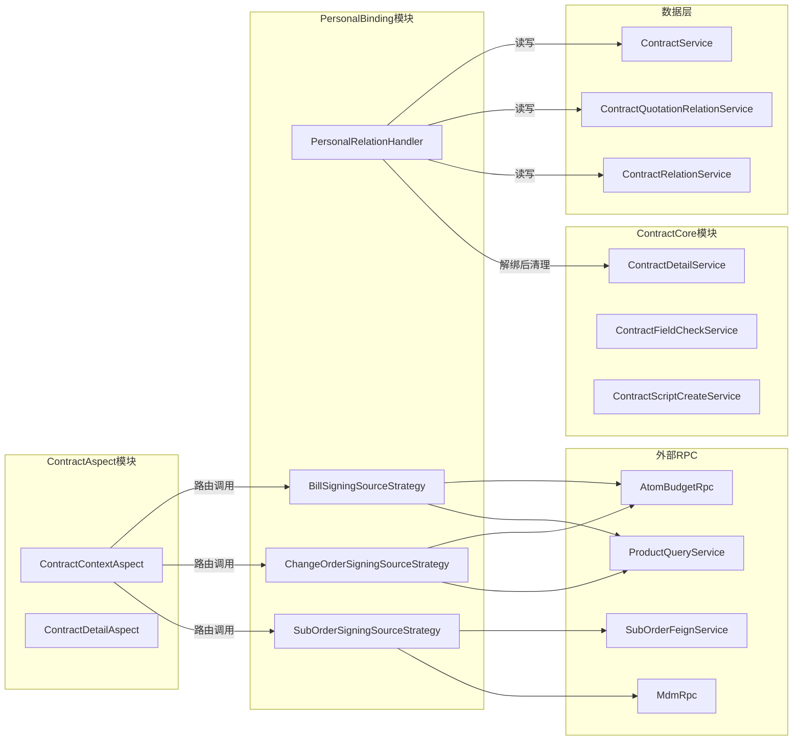

# PersonalBinding 模块文档

## 模块概述

PersonalBinding（个性化合同绑定）模块负责管理销售合同与各类业务单据（报价单、变更单、S单）之间的绑定关系。该模块在合同生命周期中承担两个核心职责：

1. **签约源数据提供**：通过策略模式，根据不同的绑定类型（报价单/变更单/S单），为个性化合同的创建、编辑提供签约源数据（商品信息、图纸、可签约单据等）。
2. **关联关系管理**：处理协同报价单撤回时的合同关联解绑逻辑，包括分布式锁保护、合同状态回退、正签草稿字段清理等。

## 系统架构

## 核心组件详解

### 1. 合同签约源策略体系

该部分采用**策略模式 + 模板方法模式**的组合，为不同绑定类型的个性化合同提供统一的数据获取接口。

#### 策略路由机制

系统通过 `ContractSigningSourceRouter`（参见 [ContractCore](ContractCore.md) 和 [ContractAspect](ContractAspect.md) 模块）根据 `BindTypeEnum` 路由到具体策略实现：

| 绑定类型 | 枚举值 | 策略实现 | 数据来源 |
|---------|--------|---------|---------|
| 报价单 (BILL_CODE) | 1 | `BillSigningSourceStrategy` | Atom 预算服务的报价单数据 |
| 变更单 (CHANGE_ORDER) | 2 | `ChangeOrderSigningSourceStrategy` | Atom 预算服务的变更单数据 |
| S单 (SUB_ORDER) | 3 | `SubOrderSigningSourceStrategy` | 订单服务的子单数据 |

#### 模板方法模式

`AbstractContractSigningSource` 定义了三个模板方法，封装了公共的数据获取流程，子类只需实现差异化的钩子方法：

- **`queryPersonalQuoteInfo`**：查询个性化报价数据 → 子类实现 `buildParam()` 构建查询参数 + `filterByCompanyCode()` 按公司过滤
- **`buildPersonalDrawingImgList`**：构建图纸图片列表 → 子类实现 `buildProductItemCodes()` + `buildDrawingQuery()`
- **`buildPersonalDrawing`**：构建图纸交付物 → 同上

#### 各策略差异点

**BillSigningSourceStrategy（报价单策略）**
- 通过 `AtomBudgetRpc` 校验报价单状态（排除调整中/已删除/已作废的报价单）
- 通过 `ProductQueryService` 获取 SKU 商品信息构建商品描述
- `buildSignableOrderInfos` 获取正签报价中的个性化数据，仅处理"全翻新"和"房产证"业务类型
- `checkPersonalCanCreate` 返回 `false`（报价单不单独判断是否可创建）

**ChangeOrderSigningSourceStrategy（变更单策略）**
- 通过 `AtomBudgetRpc.getChangeApplyDetails()` 校验变更流程状态（仅允许"待签约"/"已完成"）
- 图纸查询增加 `projectChangeNo` 和临时图纸状态过滤条件
- `buildSignableOrderInfos` 返回空列表（变更单不通过此方式构建可签约单据）
- `checkPersonalCanCreate` 返回 `false`

**SubOrderSigningSourceStrategy（S单策略）**
- 通过 `SubOrderFeignService.batchQuerySubOrderByNo()` 批量查询子单并校验状态
- `buildSignableOrderInfos` 包含完整的可签约 S 单筛选逻辑：
  1. 获取状态有效的子单
  2. 排除变更中的子单
  3. 排除已绑定合同的子单
  4. 排除套餐已签约的子单
- `checkPersonalCanCreate` 会放宽草稿合同过滤（兼容编辑场景），只要有可签约单据即返回 `true`
- 额外依赖 `MdmRpc` 获取公司主体名称、`PackageQueryFeignService` 获取套餐名称

### 2. PersonalRelationHandler — 关联关系处理器

`PersonalRelationHandlerImpl` 处理协同报价单撤回时的合同关联解绑，核心入口方法为 `revokeCooperQuotation`。

## 数据流

### 签约源数据查询流

### 协同报价单撤回流程

### 撤回动作判定逻辑

## 组件交互图

## 关键设计模式

### 策略模式（Strategy Pattern）

`ContractSigningSource` 接口定义了统一的签约源数据操作契约，三个策略实现分别处理报价单、变更单和 S 单三种绑定类型。通过 `ContractSigningSourceRouter`（在 [ContractAspect](ContractAspect.md) 模块中）根据 `BindTypeEnum` 动态路由到具体策略，使得新增绑定类型只需添加新的策略实现类，无需修改调用方代码。

### 模板方法模式（Template Method Pattern）

`AbstractContractSigningSource` 抽象类封装了数据获取的公共流程（参数构建 → 数据查询 → 公司过滤 → 结果组装），子类通过实现 `buildParam()`、`filterByCompanyCode()`、`buildProductItemCodes()`、`buildDrawingQuery()` 四个钩子方法来定制差异化逻辑，避免了流程代码的重复。

### 策略枚举 + 状态机模式（Revocation Action）

`PersonalRelationHandlerImpl` 内部定义了 `ContractRevocationAction` 枚举（`CANCEL_CONTRACT` / `UNBIND_AND_UNDO` / `SKIP`），将撤回操作的判定逻辑与执行逻辑分离。`determineRevocationAction*` 方法负责根据业务规则判定动作类型，`executeRevocationAction` 统一执行对应动作，逻辑清晰且易于扩展。

## 依赖关系

| 依赖方向 | 模块/组件 | 用途 |
|---------|---------|------|
| 依赖（被本模块调用） | [ContractCore](ContractCore.md) | 合同作废 (`CommonContractService.cancelCurrentContract`)、合同回退 (`HomeAndPcCommonService.undoContract`)、字段处理 (`ContractFieldHandler`) |
| 依赖（被本模块调用） | [ContractAspect](ContractAspect.md) | AOP 切面通过 Router 调用签约源策略 |
| 依赖（外部RPC） | `AtomBudgetRpc` | 查询报价单状态、变更单详情 |
| 依赖（外部RPC） | `SubOrderFeignService` | 查询子单信息、变更中的子单 |
| 依赖（外部RPC） | `ProductQueryService` | 查询报价单/变更单的商品 SKU 信息 |
| 依赖（外部RPC） | `MdmRpc` | 获取公司主体中文名称 |
| 依赖（基础服务） | `LockService` | 分布式锁，保证协同报价单撤回与换绑操作的互斥 |
| 依赖（基础服务） | `ContractBindLogService` | 记录解绑操作的审计日志 |
| 被依赖（调用本模块） | [ContractAspect](ContractAspect.md) | 合同上下文切面在创建/编辑合同流程中调用签约源策略 |
| 被依赖（调用本模块） | [ContractCore](ContractCore.md) | 合同保存/提交流程中调用 `PersonalRelationHandler` 处理关联关系 |