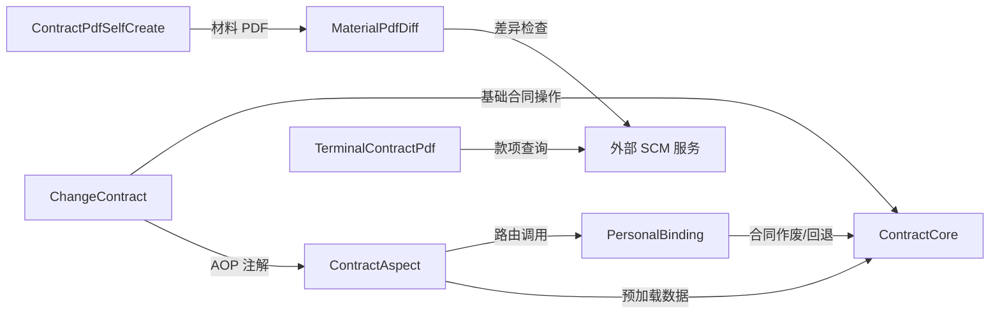

# V2 合同服务仓库概览

## 1. 仓库目的

V2 合同服务（`service/contract/v2`）是家装销售合同的**全生命周期管理引擎**，覆盖从合同创建、草稿保存、字段校验、提交、企业签章/个人签署，到合同详情查询、变更管理、解约处理的完整业务链路。

核心设计目标：
- **关注点分离**：通过 AOP 切面将数据预加载与业务逻辑解耦
- **策略驱动**：合同类型（正签/变更/设计/个人/解约等）通过策略模式路由到不同处理实现
- **可扩展性**：新增合同类型或绑定类型只需添加策略实现，不影响既有代码

---

## 2. 端到端架构

```mermaid
graph TD
    subgraph Client[客户端层]
        Home[Home APP]
        PC[PC Web]
    end

    subgraph Controller[Controller 层]
        HC[Home Controller]
        PCC[PC Controller]
    end

    subgraph AspectModule[ContractAspect — 横切关注点]
        CCA[ContractContextAspect<br/>保存/提交上下文预加载]
        CDA[ContractDetailAspect<br/>详情查询上下文预加载]
        CCH[ContractContextHandler<br/>ThreadLocal 上下文]
        CDCH[ContractDetailContextHandler<br/>ThreadLocal 上下文]
    end

    subgraph CoreModule[ContractCore — 核心业务]
        direction TB
        Detail[ContractDetail<br/>详情查询 · 按钮配置]
        Validation[ContractValidation<br/>字段校验 · 工种校验]
        Submission[ContractSubmission<br/>草稿保存 · 存管提交]
        Signing[ContractSigning<br/>企业签章 · 个人盖章]
        Creation[ContractCreation<br/>脚本创建合同]
    end

    subgraph PersonalModule[PersonalBinding — 个性化绑定]
        BSS[BillSigningSourceStrategy]
        COSS[ChangeOrderSigningSourceStrategy]
        SOS[SubOrderSigningSourceStrategy]
        PRH[PersonalRelationHandler]
    end

    subgraph ChangeModule[ChangeContract — 合同变更]
        Factory[ChangeContractStrategyFactory]
        Normal[NormalChangeContractStrategy<br/>设计变更]
        ZQ[ZQChangeContractStrategy<br/>套餐变更]
    end

    subgraph PdfModule[PDF 生成]
        PdfSelf[ContractPdfSelfCreate<br/>图纸/团装/全翻新 PDF 策略]
        TerminalPdf[TerminalContractPdf<br/>解约协议 PDF]
        MatPdf[MaterialPdfDiff<br/>材料清单差异检查与 PDF 生成]
    end

    subgraph Infra[基础设施层]
        DB[(MySQL)]
        Redis[(Redis)]
        S3[S3 文件存储]
        PDFSvc[PDF 渲染服务]
    end

    subgraph External[外部系统]
        AtomBudget[Atom 预算服务]
        AtomChange[Atom 变更服务]
        AtomDrawing[Atom 图纸服务]
        Project[项目服务]
        Quotation[报价服务]
        Escrow[存管服务]
        Fund[款项服务]
        Audit[风控审核]
        SCM[SCM 材料选品]
        SubOrder[子单服务]
    end

    Home --> HC
    PC --> PCC
    HC --> CCA
    HC --> CDA
    PCC --> CCA
    PCC --> CDA

    CCA --> Submission
    CCA --> Signing
    CCA --> Validation
    CCA --> Creation
    CDA --> Detail

    CCA --> BSS
    CCA --> COSS
    CCA --> SOS

    Factory --> Normal
    Factory --> ZQ
    Normal --> CCA
    Normal --> CoreModule
    ZQ --> CoreModule

    PdfSelf --> MatPdf
    PdfSelf --> SCM

    CCA --> External
    CDA --> External
    PersonalModule --> External
    ChangeModule --> External
    MatPdf --> External

    CoreModule --> DB
    PdfModule --> S3
    PdfModule --> PDFSvc
```

---

## 3. 模块总览

| 模块 | 路径 | 职责 | 关键设计模式 |
|------|------|------|-------------|
| **ContractCore** | `service/contract/v2` | 合同核心业务：详情查询、字段校验、草稿保存、存管提交、企业签章、个人盖章、脚本创建 | 组件化服务拆分 |
| **ContractAspect** | `service/contract/v2` | AOP 切面，在业务方法执行前并行加载项目/报价/图纸等数据到 ThreadLocal 上下文 | AOP + ThreadLocal 上下文模式 |
| **PersonalBinding** | `service/contract/v2/personal` | 个性化合同绑定：按绑定类型（报价单/变更单/S单）提供签约源数据，管理撤回解绑 | 策略模式 + 模板方法 |
| **ChangeContract** | `service/contract/v2/changecontractstrategey` | 合同变更：设计变更与套餐变更的差异计算、提交、确认流程 | 策略工厂 + 模板方法 |
| **ContractPdfSelfCreate** | `service/contract/v2/createcontractpdfbyself` | 合同 PDF 自生成策略：图纸合同、团装正签、全翻新正签的 PDF 构建 | 策略模式 |
| **TerminalContractPdf** | `service/contract/v2` | 解约协议 PDF 数据构建：乙方信息、房屋地址、款项明细等 | 数据构建服务 |
| **MaterialPdfDiff** | `service/contract/v2/combo/material/pdf` | 材料清单 PDF：远程数据与数据库快照的差异比对，HTML→PDF→S3 完整流程 | 统一中间模型 + 聚合比较 |

---

## 4. 核心模块文档索引

| 模块 | 文档路径 | 内容要点 |
|------|----------|---------|
| ContractCore | `ContractCore.md` | 5 个子模块（Detail / Validation / Submission / Signing / Creation）、10 个组件、合同生命周期数据流 |
| ContractAspect | `ContractAspect.md` | 双切面架构（保存流 + 详情流）、并行数据加载策略、首屏优化、13 个外部 RPC 依赖 |
| PersonalBinding | `PersonalBinding.md` | 3 种签约源策略（报价单/变更单/S单）、协同报价单撤回解绑流程、分布式锁保护 |
| ChangeContract | `ChangeContract.md` | 2 种变更策略（设计变更/套餐变更）、V1/V2 提交版本、异步确认 + 轮询、差异计算引擎 |
| MaterialPdfDiff | `MaterialPdfDiff.md` | 差异检查三段式（转换→聚合→比较）、PDF 生成链路（HTML→PDF→S3）、内外网地址自适应 |

---

## 5. 模块间依赖关系

**依赖方向**：所有模块单向依赖 ContractCore 和 ContractAspect，无循环依赖。外部系统通过 RPC 层统一接入。