# V2 合同子系统 — 仓库概览文档

## 1. 仓库目的

V2 合同子系统是家装/整装业务场景下的**合同全生命周期管理平台**，负责从合同创建、草稿保存、字段校验、PDF 生成、电子签章到变更管理的完整业务闭环。系统核心解决以下问题：

- **多数据源聚合**：将分散在报价系统、客源系统、审核系统、资金系统、存管系统等十余个外部系统的数据聚合为统一的合同视图
- **多合同类型编排**：支持首期款、正签、变更、图纸、个性化、设计、存管、解约等多种合同类型，每种类型具有差异化的校验规则、PDF 模板和流程逻辑
- **配置驱动的按钮可见性**：基于 Aviator 表达式引擎，按合同类型和状态动态决定操作按钮的展示
- **个性化合同签约**：支持报价单、变更单、子订单（S 单）三种数据源作为个性化合同的绑定来源
- **自动生成合同 PDF**：支持协议平台模板渲染和本地策略自生成两条路径，涵盖正文、报价单、图纸、材料清单等多附件拼接与签章关键字写入

---

## 2. 端到端架构

```mermaid
graph TD
    subgraph ClientLayer["客户端层"]
        Home["Home App<br/>移动端"]
        PC["PC Web<br/>管理后台"]
    end

    subgraph GatewayLayer["接入层"]
        Controller["ContractController<br/>合同接口入口"]
    end

    subgraph ContextLayer["上下文预处理层"]
        CTX["ContractContextModule<br/>AOP + ThreadLocal<br/>并行数据采集 & 参数预处理"]
    end

    subgraph CoreLayer["核心业务层"]
        Detail["ContractDetailService<br/>合同详情聚合"]
        Draft["ContractSaveDraftService<br/>草稿保存编排"]
        FieldCheck["ContractFieldCheckService<br/>字段校验引擎"]
        BtnConfig["ContractButtonConfigService<br/>按钮配置引擎"]
        CompSign["ContractCompanySignService<br/>对公签约"]
        Escrow["ContractEscrowService<br/>资金存管"]
        SelfSeal["ContractSelfSealService<br/>自主盖章"]
        OrderChange["ContractHomeOrderNoChangeService<br/>主订单变更"]
    end

    subgraph StrategyLayer["策略分发层"]
        ChangeFactory["ChangeContractStrategyFactory"]
        NormalStrategy["NormalChangeContractStrategy"]
        ZQStrategy["ZQChangeContractStrategy"]
    end

    subgraph SigningLayer["签约数据源层"]
        Router["ContractSigningSourceRouter"]
        BillStrategy["BillSigningSourceStrategy<br/>报价单"]
        ChangeOrderStrategy["ChangeOrderSigningSourceStrategy<br/>变更单"]
        SubOrderStrategy["SubOrderSigningSourceStrategy<br/>S单"]
        PersonalRelation["PersonalRelationHandler<br/>关联关系管理"]
    end

    subgraph PdfLayer["PDF 生成层"]
        PdfCreate["ContractPdfCreateService<br/>PDF 生成编排"]
        PdfBuild["ContractPdfBuildService<br/>表单数据构建 100+ 方法"]
        StrategyFactory["CreateContractPdfBySelfStrategyFactory"]
        HousePdf["整装正签 PDF"]
        GroupPdf["团装正签 PDF"]
        ReformPdf["翻新全案 PDF"]
        DrawingPdf["图纸合同 PDF"]
        TerminalPdf["TerminalContractPdfBuildService<br/>解约协议数据"]
    end

    subgraph MaterialLayer["材料 PDF 层"]
        MaterialDiff["MaterialPdfDiffService<br/>数据差异检测"]
        MaterialPdf["MaterialPdfUtil<br/>PDF 生成与上传"]
    end

    subgraph ExternalSystems["外部系统"]
        Quotation["报价系统<br/>QuotationFeignService"]
        Project["客源系统<br/>ProjectInfoReadService"]
        Audit["审核系统<br/>AuditRpc"]
        Fund["资金系统<br/>PayServiceRpc"]
        EscrowRpc["存管系统<br/>EscrowRpc"]
        Atom["中控系统<br/>AtomChangeRpc / BudgetRpc / DrawingRpc"]
        Freeform["协议平台<br/>FreeformService"]
        S3["S3 存储<br/>S3Service"]
        MDM["主数据<br/>MdmRpc / MdmDataRpc"]
        Apollo["Apollo 配置中心"]
        Ceres["服务者中心<br/>CeresRpc"]
        SubOrder["S 单系统<br/>SubOrderFeignService"]
    end

    Home --> Controller
    PC --> Controller

    Controller --> CTX

    CTX --> Project
    CTX --> Quotation
    CTX --> Atom
    CTX --> EscrowRpc
    CTX --> MDM
    CTX --> Apollo

    CTX --> Detail
    CTX --> Draft
    CTX --> FieldCheck
    CTX --> CompSign

    Detail --> Audit
    Detail --> Fund
    Detail --> Ceres

    ChangeFactory --> NormalStrategy
    ChangeFactory --> ZQStrategy
    NormalStrategy --> Draft
    ZQStrategy --> Draft

    Draft --> Router
    Router --> BillStrategy
    Router --> ChangeOrderStrategy
    Router --> SubOrderStrategy
    Draft --> PersonalRelation

    BillStrategy --> Atom
    SubOrderStrategy --> SubOrder

    Draft --> PdfCreate
    PdfCreate --> Freeform
    PdfCreate --> PdfBuild
    PdfBuild --> TerminalPdf
    PdfCreate --> StrategyFactory
    StrategyFactory --> HousePdf
    StrategyFactory --> GroupPdf
    StrategyFactory --> ReformPdf
    StrategyFactory --> DrawingPdf

    HousePdf --> S3
    GroupPdf --> S3
    ReformPdf --> S3
    DrawingPdf --> S3

    MaterialDiff --> MaterialPdf
    MaterialPdf --> S3

    BtnConfig --> Apollo
    Escrow --> EscrowRpc
    SelfSeal --> Freeform
    SelfSeal --> S3
```

---

## 3. 核心模块索引

| # | 模块 | 路径 | 核心职责 | 组件数 | 文档 |
|---|------|------|---------|--------|------|
| 1 | **ContractCore** | `service/` | 合同核心业务逻辑中枢：详情聚合、草稿保存、字段校验、按钮配置、对公签约、资金存管、自主盖章、主订单变更 | 10 | [ContractCore.md](ContractCore.md) |
| 2 | **ContractContextModule** | `context/` | 基于 AOP + ThreadLocal 的数据预处理层，在合同操作前并行采集多源异构数据并装配上下文 | 4 | [ContractContextModule.md](ContractContextModule.md) |
| 3 | **ContractChangeStrategy** | `changecontractstrategey/` | 变更合同的策略分发，按合同类型路由到普通变更或正签变更策略 | 3 | [ContractChangeStrategy.md](ContractChangeStrategy.md) |
| 4 | **ContractPdfModule** | `createcontractpdfbyself/` | PDF 生成核心模块：支持协议平台渲染和本地策略自生成，含表单数据反射构建、多附件拼接、签章关键字写入 | 4 | [ContractPdfModule.md](ContractPdfModule.md) |
| 5 | **ContractSigningModule** | `personal/` | 个性化合同签约数据源管理：策略模式封装报价单/变更单/S单三种数据源，含关联关系管理和协同报价单撤回 | 6 | [ContractSigningModule.md](ContractSigningModule.md) |
| 6 | **ContractMaterialModule** | `combo/material/pdf/` | 材料清单 PDF 管理：数据差异检测（远程 SKU vs 数据库记录）与 PDF 生成上传 | 2 | [ContractMaterialModule.md](ContractMaterialModule.md) |

---

## 4. 关键设计模式总览

| 设计模式 | 应用位置 | 说明 |
|---------|---------|------|
| **策略模式（Strategy）** | ContractChangeStrategy、ContractPdfModule、ContractSigningModule | 三处独立使用：变更合同按类型路由、PDF 按合同类型生成、签约数据源按绑定类型分发 |
| **工厂模式（Factory）** | ChangeContractStrategyFactory、CreateContractPdfBySelfStrategyFactory、ContractSigningSourceRouter | 基于 Spring `ApplicationContextAware` 自动收集策略 Bean，运行时按枚举路由 |
| **AOP + ThreadLocal** | ContractContextModule | 切面在请求进入时并行采集多源数据写入 ThreadLocal，业务方法通过 Handler 直接读取，结束后清理 |
| **模板方法模式（Template Method）** | AbstractContractSigningSource、BaseContractPdfCreateService | 基类定义公共流程骨架，子类实现差异化抽象方法 |
| **反射动态调用** | ContractFieldCheckService、ContractPdfCreateService | 字段校验和 PDF 表单数据构建均通过反射按配置调用方法，实现配置驱动的解耦 |
| **表达式引擎** | ContractButtonConfigService | 基于 Aviator 表达式引擎，按 `[contractType, buttonType]` 维度动态求值按钮可见性 |
| **并行任务编排** | ContractContextModule、ContractScriptCreateService | 使用 `ParallelTaskService` / `CompletableFuture` + 自定义线程池并行调用多个 RPC，结果线程安全合并 |
| **分布式锁** | PersonalRelationHandlerImpl | 协同报价单撤回时加分布式锁，保证与换绑操作的互斥性 |

---

## 5. 外部系统依赖

| 外部系统 | RPC/Feign 接口 | 用途 |
|---------|----------------|------|
| 报价系统 | `QuotationFeignService` | 获取报价方案、套餐价格、预估合同额 |
| 客源系统 | `ProjectInfoReadService` | 获取项目信息、地址、设计师 |
| 审核系统 | `AuditRpc` | 获取风控审核状态和流程节点 |
| 资金系统 | `PayServiceRpc` | 获取款项实收信息 |
| 存管系统 | `EscrowRpc` / `EscrowDomain` | 获取存管账户信息 |
| 中控系统 | `AtomChangeRpc` / `AtomBudgetRpc` / `AtomDrawingRpc` | 变更单、预算报价、图纸查询 |
| 协议平台 | `FreeformService` | PDF 模板渲染、签章规则查询、协议上传 |
| S3 存储 | `S3Service` | PDF 文件上传与下载 |
| 主数据 | `MdmRpc` / `MdmDataRpc` | 公司主体信息查询 |
| 服务者中心 | `CeresRpc` | 设计师职级信息查询 |
| S 单系统 | `SubOrderFeignService` | 子订单查询与状态校验 |
| Apollo 配置 | `ContractApolloConfig` | 动态配置管理（签章位置、压缩阈值、表达式规则等） |