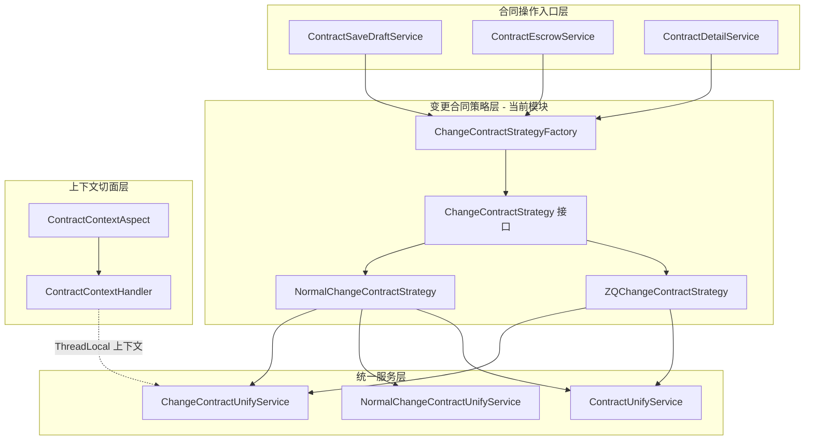
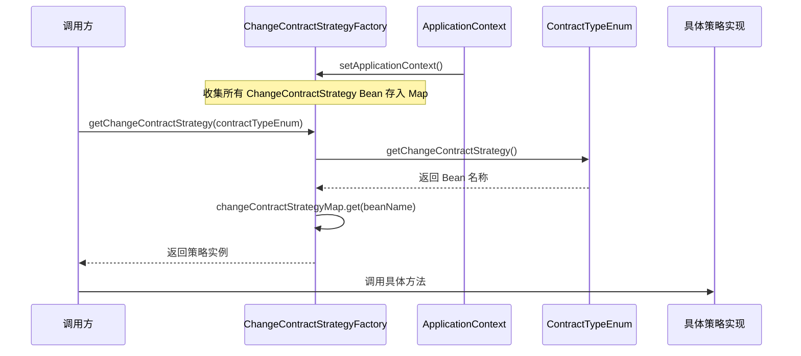
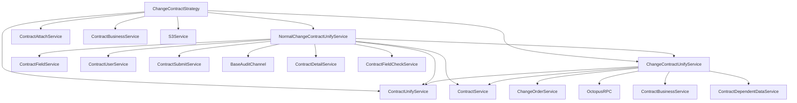
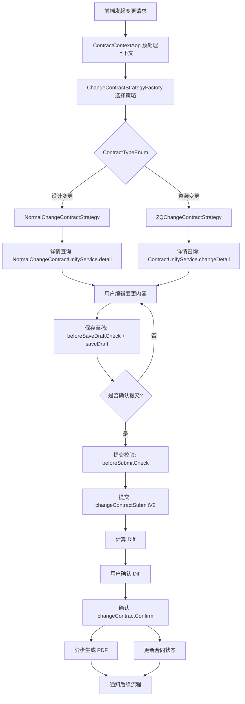
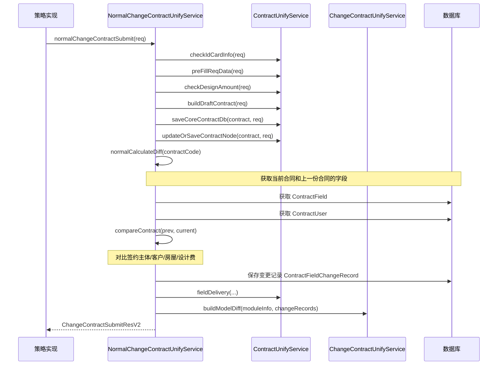
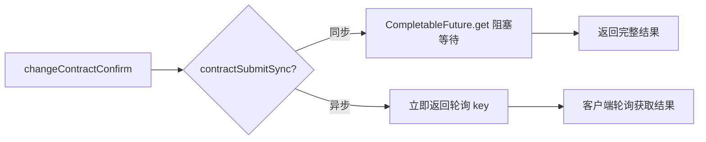

# ChangeContractStrategy 模块

## 1. 模块概述

ChangeContractStrategy 是合同变更子系统中的**策略模式核心模块**，负责根据不同的合同类型（如整装变更、设计变更等）路由到对应的变更合同处理策略。该模块解决了"不同业务类型的合同变更流程存在差异"这一核心问题——通过将差异化的校验逻辑、提交流程、详情展示封装到独立策略实现中，实现了合同变更流程的可扩展性和可维护性。

**核心职责**：
- 根据 `ContractTypeEnum` 动态选择匹配的变更策略实现
- 定义合同变更的完整生命周期接口：详情查询 → 草稿校验 → 草稿保存 → 提交校验 → 合同提交 → 合同确认
- 每个策略实现内部委托给不同的 UnifyService 完成具体的业务逻辑

## 2. 架构设计

### 2.1 整体架构定位

ChangeContractStrategy 模块位于合同系统的**策略路由层**，上层由合同操作入口（ContractOperations）调用，下层委托给统一服务层（ChangeContractUnifyService / NormalChangeContractUnifyService / ContractUnifyService）执行具体逻辑。



### 2.2 策略选择机制

工厂通过 Spring 的 `ApplicationContextAware` 接口，在容器初始化时自动收集所有 `ChangeContractStrategy` 类型的 Bean，存入 Map。运行时根据 `ContractTypeEnum.getChangeContractStrategy()` 返回的 Bean 名称查找对应策略。



## 3. 核心组件详解

### 3.1 ChangeContractStrategy 接口

定义合同变更的完整生命周期操作，是所有变更策略的契约：

| 方法 | 说明 | 返回值 |
|------|------|--------|
| `changeDetail()` | 查询变更合同详情，支持已保存合同和基于上一份合同初始化两种模式 | `ContractDetailResp` |
| `beforeSaveDraftCheck()` | 保存草稿前的参数校验 | void |
| `saveDraft()` | 保存合同草稿到数据库 | `ContractSubmitResDTO` |
| `beforeSubmitCheck()` | 提交前的完整校验（含必填字段校验） | void |
| `changeContractSubmit()` | 提交接口 V1：2.0 整装/局装分模块 diff 字段（已逐步弃用） | `ChangeContractSubmitRes` |
| `changeContractSubmitV2()` | 提交接口 V2：2.5 整装/团装统一 diff 字段（当前主用） | `ChangeContractSubmitResV2` |
| `changeContractConfirm()` | 确认变更合同，触发 PDF 生成和状态流转 | `ContractSubmitResDTO` |

### 3.2 NormalChangeContractStrategy

**适用于**：设计变更合同（不关联变更单的合同类型，如设计补充协议）。

**核心特征**：
- **详情查询**：委托 `NormalChangeContractUnifyService.detail()`，支持从已保存草稿或上一份已确认合同初始化
- **校验逻辑**：使用 `checkChangeContractWithoutChangeOrderId()`，不依赖变更单号，仅校验项目订单下是否存在在途变更合同
- **提交流程**：委托 `NormalChangeContractUnifyService.normalChangeContractSubmit()`，通过 `normalCalculateDiff()` 计算模板字段级差异（签约主体、客户信息、房屋信息、设计费）
- **确认流程**：通过异步任务完成 PDF 生成（基于 `NormalChangeContractFreeformDTO`），支持同步/异步两种提交模式

### 3.3 ZQChangeContractStrategy

**适用于**：整装变更合同（关联变更单的合同类型，如 B 类变更协议）。

**核心特征**：
- **详情查询**：委托 `ContractUnifyService.changeDetail()`，直接基于 contractCode、projectOrderId、changeOrderId 查询
- **校验逻辑**：三重校验链——基础参数校验 → 变更单状态校验（`checkChangeOrder`，要求状态为"合同变更中"）→ 变更合同可发起校验（`checkChangeContract`，防重复创建 + 2.5 场景防重复提交）
- **提交流程**：委托 `ChangeContractUnifyService.changeContractSubmitV2()`，包含字段一致性校验、参数合法性校验，构建 `ChangeContractFreeformDTO` 进行 diff 计算
- **确认流程**：委托 `ChangeContractUnifyService.changeContractConfirm()`，异步生成 PDF，支持在线/线下两种签约渠道

### 3.4 策略差异对比

| 维度 | NormalChangeContractStrategy | ZQChangeContractStrategy |
|------|------------------------------|--------------------------|
| 变更单依赖 | 不需要 changeOrderId | 必须提供 changeOrderId |
| 校验层级 | 2 层（基础参数 + 在途合同） | 3 层（基础参数 + 变更单状态 + 在途合同） |
| Diff 计算方式 | 模板字段级 diff（NormalCalculateDiff） | 结构化变更字段 diff（buildChangeContractDiffV2） |
| PDF 模板 | NormalChangeContractFreeformDTO | ChangeContractFreeformDTO |
| 详情查询入口 | NormalChangeContractUnifyService | ContractUnifyService |
| 提交 V1 接口 | 返回 null（不支持） | 委托 changeContractUnifyService |
| 2.5 流程兼容 | 不涉及 | 支持 processV2_5 判断 |
| 外部依赖 | 较少（FundInfoService 等） | 较多（OctopusRPC 校验变更资格） |

## 4. 依赖关系

### 4.1 模块依赖图



### 4.2 关键依赖说明

| 依赖组件 | 依赖方向 | 说明 |
|----------|---------|------|
| [ContractUnifyService](ContractOperations.md) | 被依赖 | 提供合同校验、构建、存储等基础能力 |
| [ChangeContractUnifyService](ContractOperations.md) | 被依赖 | 提供变更合同专属的提交、diff 计算、确认等能力 |
| [ContractContextAop](ContractContextAop.md) | 被依赖 | 通过 AOP 切面在策略方法执行前预处理上下文数据（项目信息、报价信息、图纸信息等），存入 ThreadLocal |
| [ContractFieldValidation](ContractFieldValidation.md) | 间接依赖 | NormalChangeContractStrategy 的提交流程中调用 `checkDesignAmount()` |
| [ContractPdfGeneration](ContractPdfGeneration.md) | 间接依赖 | 合同确认阶段生成 PDF |
| [SigningSourceBinding](SigningSourceBinding.md) | 无直接依赖 | 与个人合同签约来源绑定属于并行模块 |

## 5. 数据流

### 5.1 合同变更完整流程



### 5.2 提交 Diff 计算数据流



## 6. 关键设计模式

### 6.1 策略模式（Strategy Pattern）

本模块是经典的策略模式实现：

- **Strategy 接口**：`ChangeContractStrategy` 定义统一的合同变更操作契约
- **ConcreteStrategy**：`NormalChangeContractStrategy` 和 `ZQChangeContractStrategy` 提供不同合同类型的具体实现
- **Context（工厂）**：`ChangeContractStrategyFactory` 负责策略的选择和分发
- **策略注册**：利用 Spring IoC 容器的 `getBeansOfType()` 自动发现和注册策略 Bean，新增策略只需添加 `@Component` 注解即可，无需修改工厂代码

### 6.2 模板方法模式（Template Method）

两个策略实现中，`beforeSaveDraftCheck()` 和 `beforeSubmitCheck()` 遵循相似的校验流程模板：

```
基础参数校验 → 业务资格校验 → [必填字段校验（仅提交时）]
```

差异点在于业务资格校验的层级和依赖不同，公共校验逻辑已下沉到 `ChangeContractUnifyService` 和 `ContractUnifyService` 中复用。

### 6.3 异步提交模式

合同确认（`changeContractConfirm`）采用 `CompletableFuture.runAsync()` 异步执行，通过自定义线程池 `contractSubmitExternalExecutor` 隔离。同时支持同步阻塞模式（通过 `contractSubmitSync()` 判断），适配不同调用场景。



## 7. 扩展指南

### 7.1 新增合同变更策略

1. 创建新的策略类，实现 `ChangeContractStrategy` 接口，添加 `@Component` 注解
2. 在 `ContractTypeEnum` 中为新合同类型配置 `changeContractStrategy` 属性，值为新策略的 Bean 名称
3. 实现接口的 7 个方法，根据业务需求委托给对应的 UnifyService

### 7.2 注意事项

- `saveDraft()` 在两个策略中实现相同（均委托 `changeContractUnifyService.saveDraft`），未来可考虑抽取到基类
- `changeContractSubmit()`（V1）在 NormalChangeContractStrategy 中返回 null，已逐步被 `changeContractSubmitV2()` 替代
- 合同确认流程涉及异步操作和状态更新，需关注异常处理和幂等性
- 新增策略时需确保 `ContractContextAop` 中的上下文预处理逻辑能覆盖新策略所需的数据
