# ContractContextAop 模块

## 1. 模块概述

ContractContextAop 是合同子系统中基于 Spring AOP 的**数据预加载与上下文管理模块**。该模块通过切面编程机制，在合同保存草稿、提交、详情查询等核心操作执行前，自动从多个远程服务和数据源并行拉取项目信息、报价信息、图纸信息、存管账户信息等，填充到线程级上下文对象中，供下游业务逻辑直接消费。执行完毕后自动清理上下文，防止线程内存泄漏。

该模块的核心价值在于：
- **统一数据准备**：将合同操作所需的多源数据聚合逻辑从各业务方法中抽离，避免重复代码
- **并行化加载**：通过 `ParallelTaskService` 并行调用多个 RPC 服务，显著降低接口响应时间
- **线程安全隔离**：基于 `ThreadLocal` 的上下文管理确保并发场景下数据不串扰
- **参数预处理**：在数据准备阶段统一清理无效字段、校验前置条件，降低下游复杂度

## 2. 架构总览

```mermaid
graph TD
    subgraph ContractContextAop[ContractContextAop 模块]
        CA[ContractContextAspect]
        CH[ContractContextHandler]
        DA[ContractDetailAspect]
        DH[ContractDetailContextHandler]
    end

    subgraph Annotations[自定义注解]
        CDP[ContractDataPrepare 注解]
        CDDP[ContractDetailDataPrepare 注解]
    end

    subgraph ContextObjects[上下文对象]
        CC[ContractContext]
        CDC[ContractDetailContext]
    end

    subgraph DownstreamServices[下游合同服务]
        CS[ContractSaveDraftService]
        CE[ContractEscrowService]
        CSS[ContractCompanySignService]
        CD[ContractDetailService]
        CB[ContractButtonConfigService]
    end

    subgraph DataSources[外部数据源]
        PRJ[ProjectInfoReadService]
        QFS[QuotationFeignService]
        ADR[AtomDrawingRpc]
        ABR[AtomBudgetRpc]
        ACR[AtomChangeRpc]
        ESD[EscrowDomain]
        ORS[OrderStandardQueryRpc]
        HOD[HomeOrderDataConversionService]
    end

    CDP -->|触发| CA
    CDDP -->|触发| DA

    CA -->|读写| CH
    CH -->|持有| CC
    DA -->|读写| DH
    DH -->|持有| CDC

    CA -->|并行调用| PRJ
    CA -->|并行调用| QFS
    CA -->|并行调用| ADR
    CA -->|并行调用| ABR
    CA -->|并行调用| ACR
    CA -->|并行调用| ESD
    CA -->|并行调用| ORS
    CA -->|并行调用| HOD

    DA -->|并行调用| PRJ
    DA -->|并行调用| QFS
    DA -->|并行调用| ADR
    DA -->|并行调用| ACR
    DA -->|并行调用| ORS
    DA -->|并行调用| HOD

    CA -.->|数据准备后| CS
    CA -.->|数据准备后| CE
    DA -.->|数据准备后| CD
    DA -.->|数据准备后| CB
```

## 3. 核心组件详解

### 3.1 ContractContextAspect — 合同操作数据准备切面

**职责**：拦截所有标注了 `@ContractDataPrepare` 注解的合同保存/提交方法，在方法执行前完成全量数据准备。

**切面生命周期**：

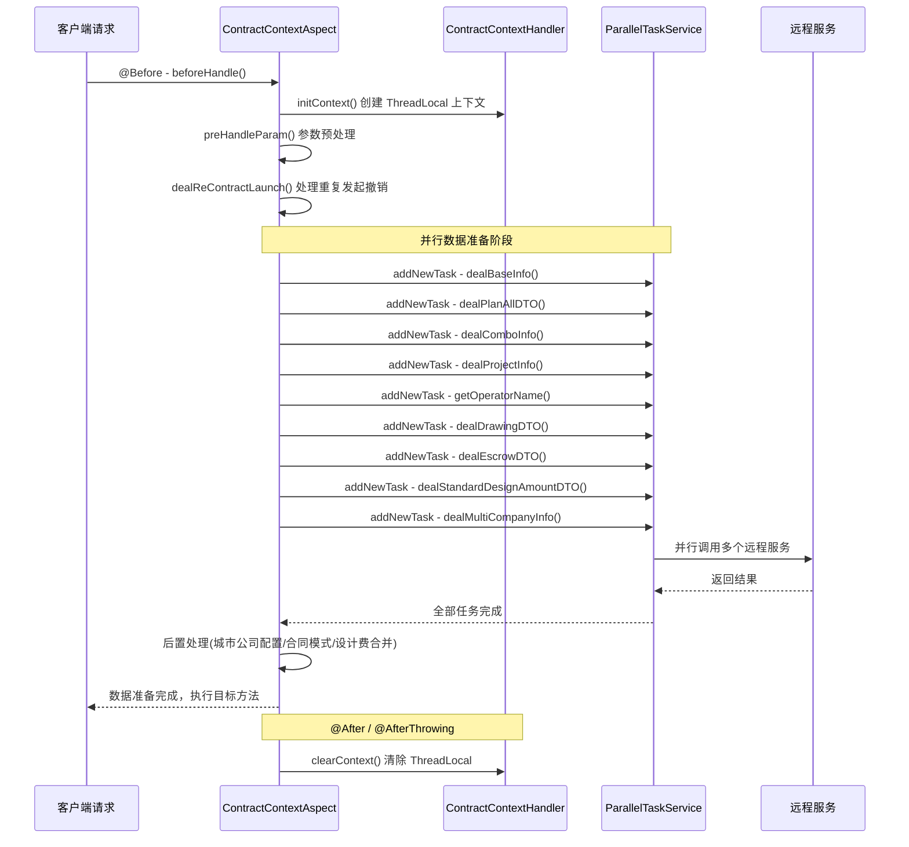

**并行数据准备任务清单**：

| 任务 | 数据来源 | 条件 | 输出到 Context |
|------|---------|------|---------------|
| `dealBaseInfo` | ContractUnifyService | 始终执行 | `developerChannel` |
| `dealPlanAllDTO` | AtomBudgetRpc / HomeOrderDataConversionService / ContractDependentDataService | 按合同类型分支 | `planAllDTO`, `contractSourceDataBO`, `designQuoteFeeDTO` |
| `dealComboInfo` | OrderStandardQueryRpc | 仅 V2.5 流程 + 房产证业务 + 正签合同 | `comboDTOList` |
| `dealProjectInfo` | ProjectInfoReadService | 始终执行 | `projectInfoDTO` |
| `getOperatorName` | HomeAndPcCommonService | 始终执行 | `operatorName` |
| `dealDrawingDTO` | AtomDrawingRpc / ContractBusinessService | 正签/图纸/个人合同 + V2.5 | `drawingDTO` |
| `dealEscrowDTO` | EscrowDomain | 资金存管类合同 | `escrowInfo` |
| `dealStandardDesignAmountDTO` | HomeAndPcCommonService | 设计费合同 + 特定城市 | 回写到请求参数 |
| `dealMultiCompanyInfo` | EscrowRpc / MdmDataRpc / MdmRpc | 资金存管合同 | `contractCompanyList` |

**参数预处理逻辑 (`preHandleParam`)**：

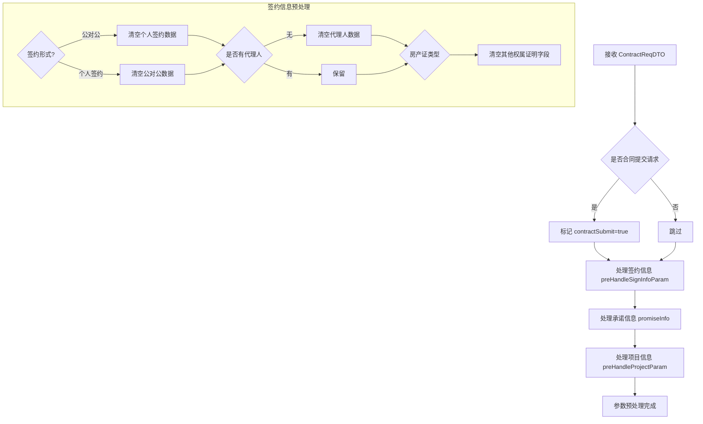

**报价信息获取的分支策略 (`dealPlanAllDTO`)**：

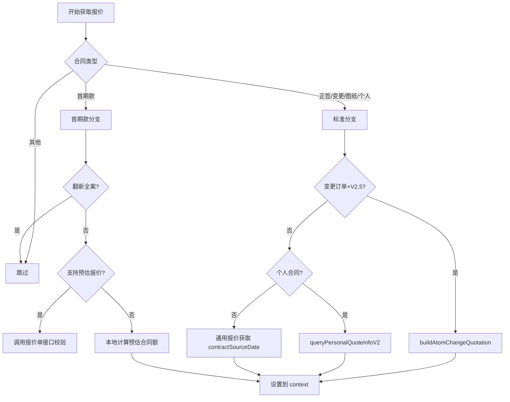

**关键设计决策**：

1. **流程版本判断（V2.5）**：通过 `commonBusinessService.isPROCESS_V2_5()` 区分新旧流程，V2.5 流程走协同报价、变更报价等新逻辑
2. **业务类型细分**：通过 `businessType` 区分房产证、整装、翻新全案等业务，不同业务的数据准备路径差异显著
3. **设计费来源合并**：正签合同发起时，如果设计费来自报价，则将报价中的设计费信息回写到请求参数，实现数据对齐

### 3.2 ContractContextHandler — 合同上下文持有者

**职责**：基于 `ThreadLocal<ContractContext>` 提供线程安全的上下文存取，作为切面与下游业务之间的数据桥梁。

**核心机制**：

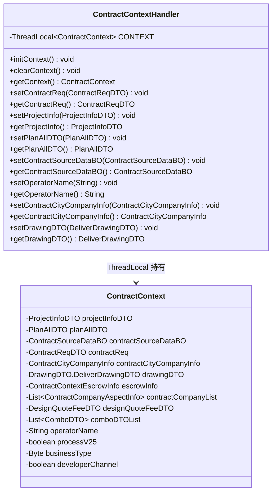

**设计要点**：
- **静态方法模式**：所有方法均为 `static`，任何业务代码均可通过 `ContractContextHandler.getContext()` 获取当前线程上下文，无需注入
- **防御性空值检查**：getter 方法对 `CONTEXT.get() == null` 进行判断，避免切面未执行或异常时 NPE
- **生命周期管理**：由切面的 `@Before` 和 `@After`/`@AfterThrowing` 保证 `init` 和 `clear` 配对，避免 ThreadLocal 泄漏

### 3.3 ContractDetailAspect — 合同详情查询数据准备切面

**职责**：拦截标注了 `@ContractDetailDataPrepare` 注解的合同详情查询方法，在详情展示前预加载所需数据。

**与 ContractContextAspect 的差异**：

| 维度 | ContractContextAspect | ContractDetailAspect |
|------|----------------------|---------------------|
| 触发注解 | `@ContractDataPrepare` | `@ContractDetailDataPrepare` |
| 上下文类型 | `ContractContext` | `ContractDetailContext` |
| Handler | `ContractContextHandler` | `ContractDetailContextHandler` |
| 核心场景 | 合同保存/提交 | 合同详情查询 |
| 首屏优化 | 无 | 支持 `isFirstScreen` 分级加载 |
| 额外数据 | 存管账户、多公司信息 | 款项实收、风控审核、变更范围、备件信息 |

**首屏分级加载策略**：

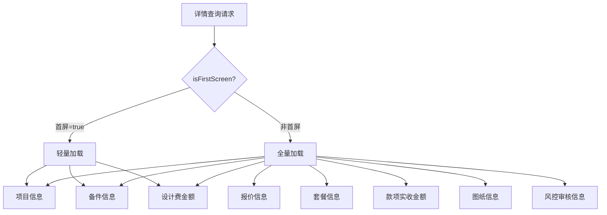

首屏模式下只加载首屏渲染所必需的 3 项数据（项目信息、备件信息、设计费金额），其余数据延迟到非首屏请求时再加载，优化首屏响应速度。

**变更报价获取 (`buildAtomChangeQuotation`)**：

该方法处理 V2.5 协同签约模式下的变更合同报价获取，与 `ContractContextAspect` 中的同名方法逻辑相似但有细微差异：

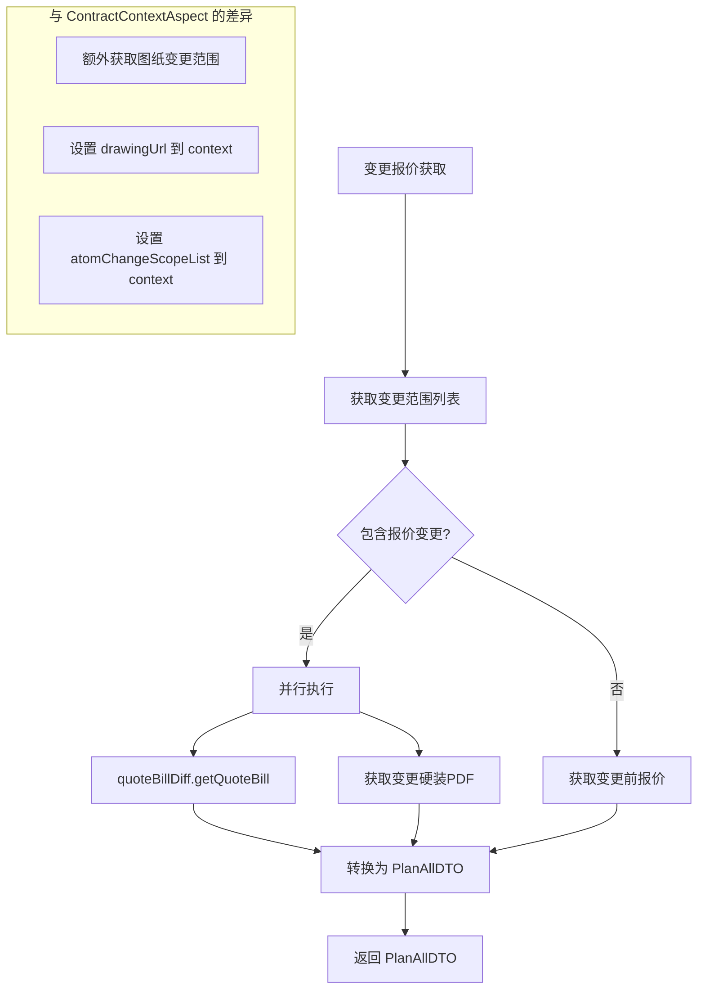

关键差异：`ContractDetailAspect.buildAtomChangeQuotation` 额外处理了 `ChangeScopeEnum.DRAWING` 的变更范围，将图纸 URL 和变更范围列表设置到详情上下文中，用于详情页面展示变更对比信息。

### 3.4 ContractDetailContextHandler — 合同详情上下文持有者

**职责**：基于 `ThreadLocal<ContractDetailContext>` 提供合同详情查询场景的线程安全上下文管理。

与 `ContractContextHandler` 结构完全对称，但持有不同的上下文对象 `ContractDetailContext`，包含详情场景特有的字段：

- `drawingUrl`：变更图纸 URL（详情展示变更对比用）
- `atomChangeScopeList`：变更范围列表（报价变更/图纸变更）
- `firstScreen`：是否首屏加载标志
- `preQuotationDTO`：首期款预报价信息
- `relateFundInfo`：关联款项信息
- `auditDetailDTO`：风控审核详情
- `changeOrderList`：变更单列表
- `attachInfoDetail`：备件详情信息
- `designSignPriceInfo`：设计费签约价格信息

## 4. 模块间依赖关系

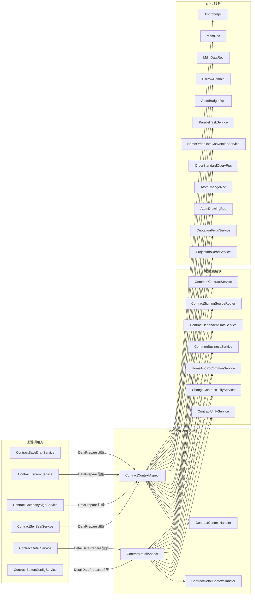

**关键依赖说明**：

| 依赖服务 | 用途 | 被哪些切面使用 |
|---------|------|--------------|
| `ProjectInfoReadService` | 获取项目基础信息（客户、地址、公司编码） | CA + DA |
| `QuotationFeignService` | 查询套餐信息和设计费配置 | CA + DA |
| `AtomDrawingRpc` | 获取图纸列表（正签/变更/个人） | CA + DA |
| `AtomBudgetRpc` | 获取报价单信息（首期款预报价） | CA |
| `AtomChangeRpc` | 获取变更申请信息和变更范围 | CA + DA |
| `EscrowDomain` | 查询资金存管账户开户信息 | CA |
| `ParallelTaskService` | 并行任务编排和执行 | CA + DA |
| `ContractUnifyService` | 合同业务工具方法（字段配置、公司信息等） | CA + DA |
| `ChangeContractUnifyService` | 变更合同专用工具（报价差异计算等） | CA + DA |
| `ContractDependentDataService` | 个人合同报价数据构建 | CA + DA |
| `ContractSigningSourceRouter` | 个人合同签约来源路由（报价单/子订单/变更单） | CA + DA |
| `HomeOrderDataConversionService` | 家装订单数据转换（通用报价获取） | CA + DA |

## 5. 数据流详解

### 5.1 合同保存/提交数据流

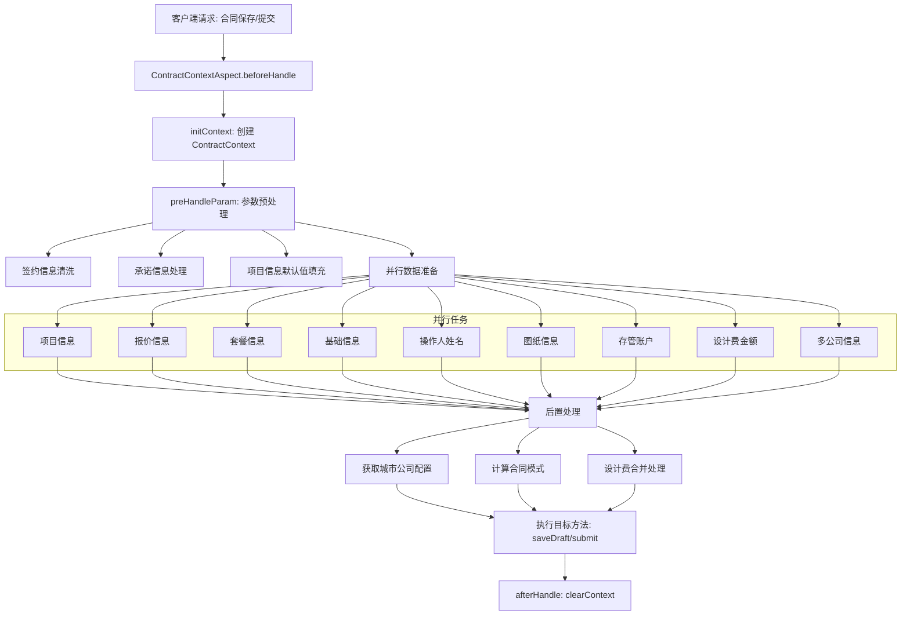

### 5.2 合同详情查询数据流

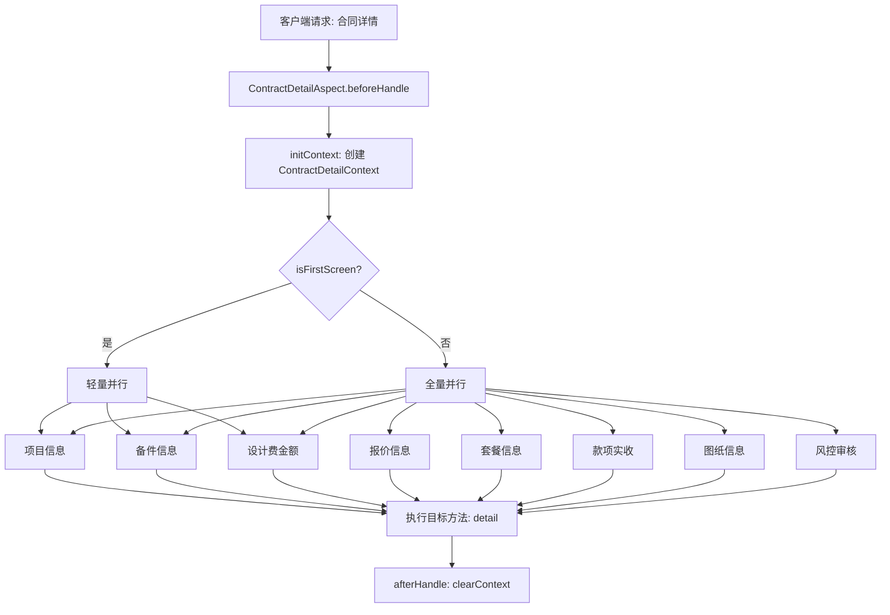

### 5.3 上下文数据消费链路

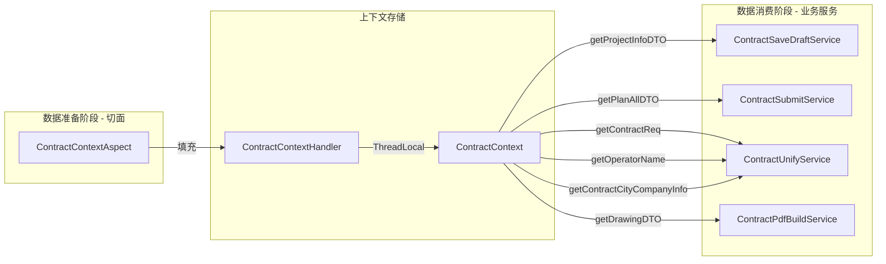

## 6. 关键设计模式

### 6.1 AOP 拦截器模式

模块采用 `@Aspect` + 自定义注解的方式实现横切关注点的分离：

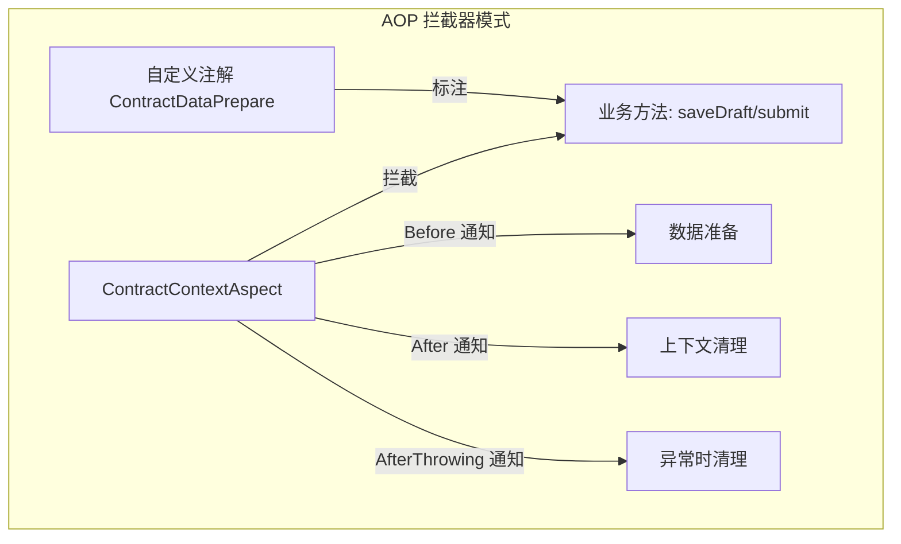

**优势**：业务方法（如 `ContractSaveDraftService.saveDraft`）只需加一行注解，即可获得完整的数据准备能力，无需感知数据来源和加载策略。

### 6.2 ThreadLocal 上下文模式

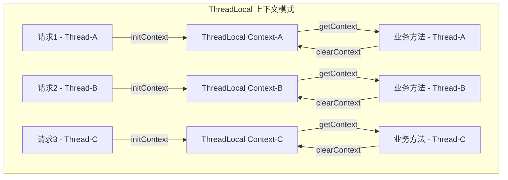

每个请求线程拥有独立的上下文副本，通过 `init → 使用 → clear` 的生命周期管理，确保线程安全且无内存泄漏。

### 6.3 并行任务编排模式

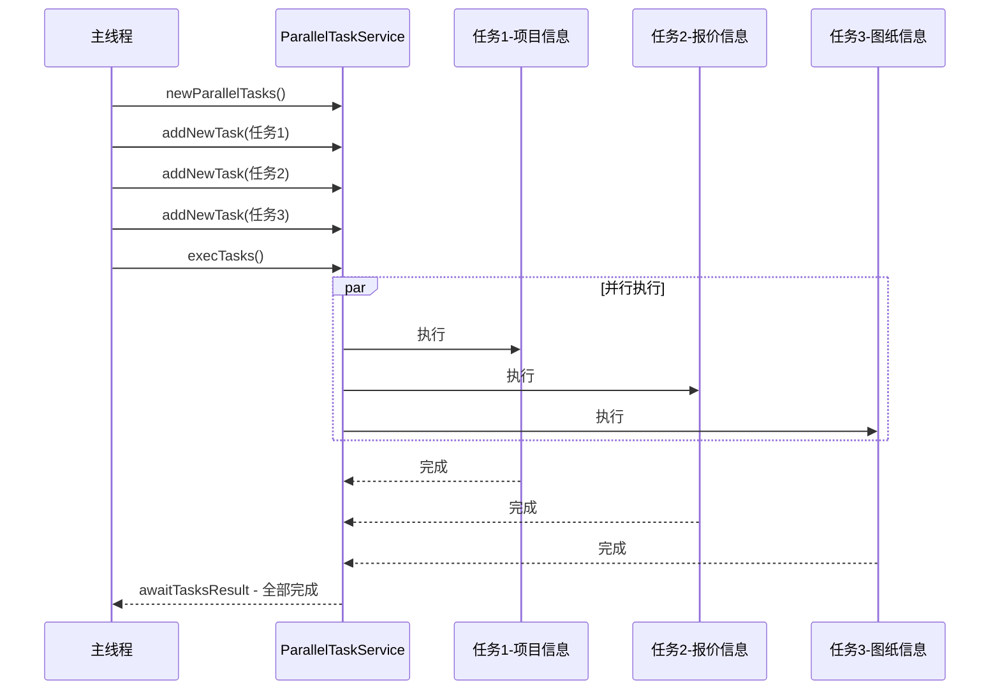

所有数据准备任务通过 `ParallelTaskService` 并行执行，使用 `awaitTasksResult` 阻塞等待全部完成后再继续。这将原本串行的多次 RPC 调用（可能耗时数秒）压缩到最慢单次调用的时间。

### 6.4 策略分支模式（报价获取）

报价信息获取根据合同类型、业务类型、流程版本的不同组合，走不同的数据获取策略。这是一种**隐式策略模式**，通过条件分支而非策略接口实现：

| 条件组合 | 获取策略 | 数据来源 |
|---------|---------|---------|
| 首期款 + 非翻新全案 + 支持预估报价 | 报价单实时校验 | `AtomBudgetRpc.getPreQuotationByBillCode` |
| 首期款 + 非翻新全案 + 不支持预估报价 | 本地计算 | `HomeAndPcCommonService.getExpectContractAmount` |
| 变更合同 + V2.5 协同 | 变更报价构建 | `ChangeContractUnifyService.getQuoteBillDiff` |
| 个人合同 | 个人报价查询 | `ContractDependentDataService.queryPersonalQuoteInfoV2` |
| 其他（正签/图纸等） | 通用报价获取 | `HomeOrderDataConversionService.contractSourceDate` |

## 7. 关注点与设计约束

### 7.1 线程安全性

- `ContractContext` 和 `ContractDetailContext` 通过 `ThreadLocal` 存储，天然线程安全
- 切面 `@After` 和 `@AfterThrowing` 均调用 `clearContext()`，确保异常场景下也不泄漏
- `ContractContextHandler` 的 getter 方法进行空值判断，防止切面未触发时调用方 NPE

### 7.2 性能优化

- **并行加载**：9 项数据准备任务并行执行，理论耗时 = max(单任务耗时)，而非 sum(所有任务耗时)
- **条件短路**：每个数据准备方法内部根据合同类型、业务类型等条件提前 `return`，避免不必要的 RPC 调用
- **首屏分级**：`ContractDetailAspect` 支持首屏轻量加载，首屏只加载 3 项核心数据

### 7.3 可维护性风险

- **上下文膨胀**：`ContractContext` 承载了越来越多的字段（当前 13+ 个），随着业务扩展可能继续膨胀
- **隐式依赖**：下游业务通过 `ContractContextHandler.getContext()` 静态方法获取数据，这种隐式依赖难以在编译期发现
- **分支复杂度**：`dealPlanAllDTO` 方法内含多层嵌套条件分支（合同类型 × 业务类型 × 流程版本），维护难度较高
- **代码重复**：`ContractContextAspect` 和 `ContractDetailAspect` 在报价获取、图纸获取等逻辑上有大量相似代码，但因上下文类型不同难以直接复用

## 8. 与其他模块的关系

| 相关模块 | 关系 | 说明 |
|---------|------|------|
| [ContractOperations](ContractOperations.md) | 上游消费方 | `ContractSaveDraftService`、`ContractEscrowService` 等通过注解触发数据准备 |
| [ChangeContractStrategy](ChangeContractStrategy.md) | 间接依赖 | 变更合同策略执行前，由切面预加载变更报价数据 |
| [SigningSourceBinding](SigningSourceBinding.md) | 数据提供 | `ContractSigningSourceRouter` 被切面调用，为个人合同提供图纸数据 |
| [ContractFieldValidation](ContractFieldValidation.md) | 后置消费 | 字段校验依赖切面预填充的上下文数据 |
| [ContractPdfGeneration](ContractPdfGeneration.md) | 数据消费 | PDF 生成服务通过 `ContractContextHandler` 获取报价、图纸等数据 |
