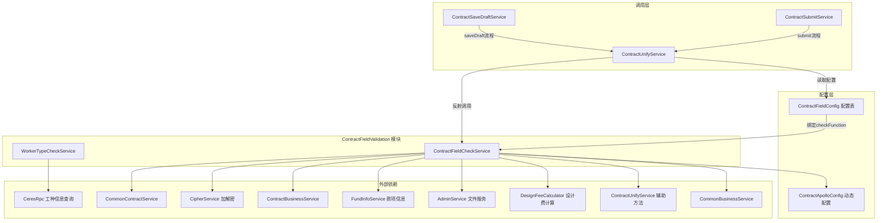
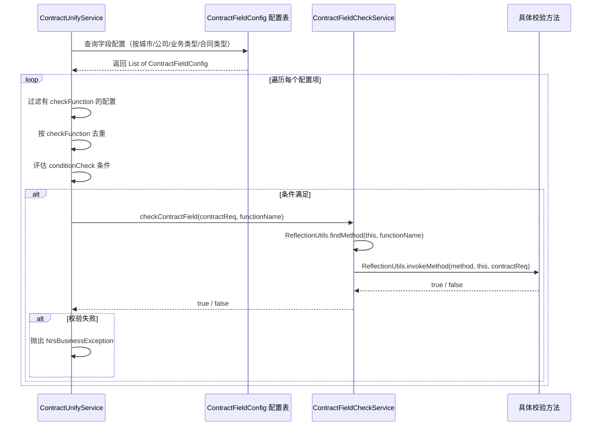
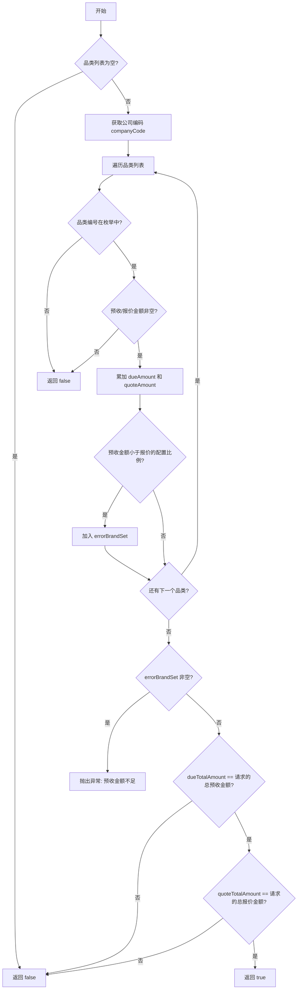
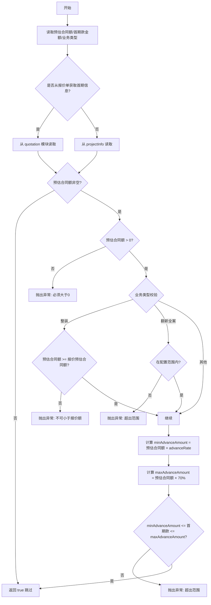
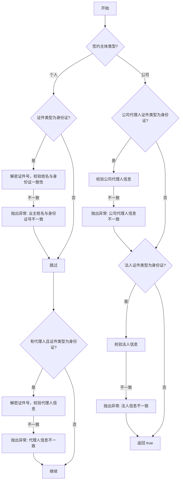
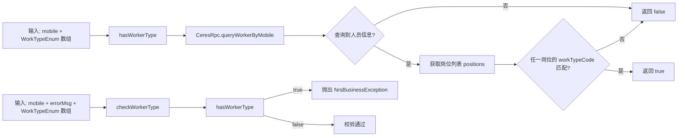
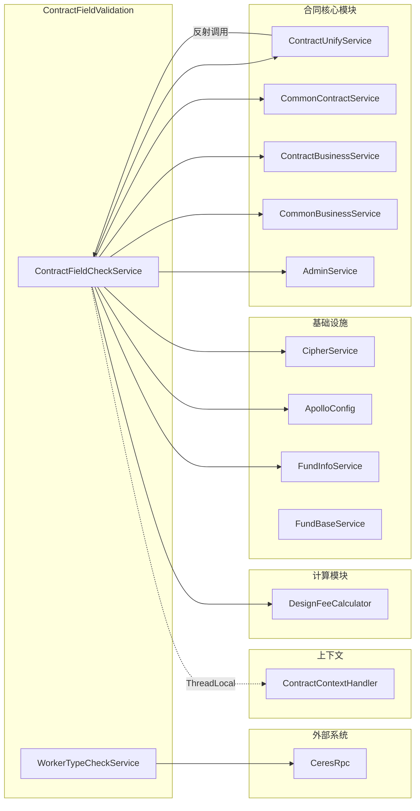
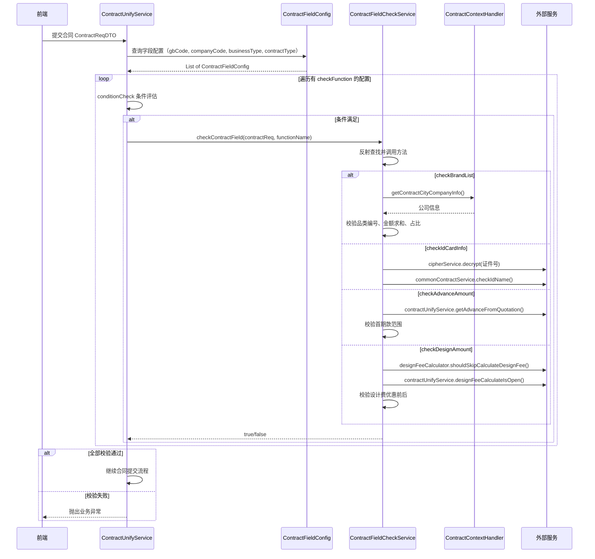
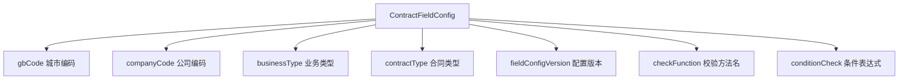

# ContractFieldValidation 模块文档

## 模块概述

ContractFieldValidation 是合同子系统中的**字段校验模块**，负责在合同提交、保存草稿等关键业务节点对合同数据进行规则校验。该模块采用**反射驱动 + 配置化**的校验架构：校验方法通过配置表动态绑定，运行时由 `ContractUnifyService` 读取字段配置后反射调用对应校验方法，实现校验逻辑与调用方的解耦。

模块包含两个核心服务：
- **ContractFieldCheckService**：合同字段校验主服务，包含品类校验、金额校验、身份信息校验、设计费校验等 9 个校验方法
- **WorkerTypeCheckService**：工种校验服务，通过 RPC 查询人员工种信息，提供通用的工种类型校验能力

---

## 架构总览

---

## 核心组件详解

### ContractFieldCheckService

**职责**：合同字段校验的核心执行器，所有校验方法通过反射机制被动态调用。

> **重要约束**：该类中的校验方法通过反射调用，方法名称不能修改，方法不能删除。新增校验方法时需同步在 `ContractFieldConfig` 配置表中注册对应的 `checkFunction` 名称。

#### 反射调用机制

#### 校验方法一览

| 方法名 | 校验内容 | 失败处理 | 依赖服务 |
|--------|---------|---------|---------|
| `checkBrandList` | 品类列表预收金额求和校验、品类编号合法性、预收金额占比校验 | 返回 false 或抛出异常（预收金额不足时） | `ContractApolloConfig`, `ContractContextHandler` |
| `checkBrandTotalAmount` | 品类列表总计金额不小于款项已付金额 | 返回 false | `FundInfoService`, `FundRelateContractMapping` |
| `checkAdvanceAmount` | 首期款金额在预估合同额的 20%~70% 范围内；预估合同额与报价一致性校验 | 抛出 `UtopiaBussinessException` | `ContractUnifyService`, `ContractApolloConfig` |
| `checkAdvanceFileSize` | 首期款报价单文件大小不超过配置上限（默认 10M） | 抛出 `NrsBusinessException` | `AdminService`, `ContractApolloConfig` |
| `checkHouseType` | 正式套餐合同提交时，房屋类型与报价侧一致（仅 V2.5 流程） | 抛出 `NrsBusinessException` | `CommonBusinessService`, `ContractContextHandler` |
| `checkIdCardInfo` | 业主/代理人/公司代理人/法人姓名与身份证号一致性校验 | 抛出 `UtopiaBussinessException` | `CommonContractService`, `CipherService` |
| `checkCompanyInfo` | 企业名称与统一社会信用代码非空及一致性校验 | 抛出 `UtopiaBussinessException` | `ContractBusinessService` |
| `checkDesignAmount` | 设计服务费（优惠后）不大于（优惠前），且大于 0 | 抛出 `UtopiaBussinessException` | `DesignFeeCalculator`, `ContractUnifyService`, `ContractApolloConfig` |

#### 校验方法内部逻辑

**checkBrandList 品类校验流程**：

**checkAdvanceAmount 首期款校验流程**：

**checkIdCardInfo 身份校验流程**：

#### 直接调用的校验方法

除反射调用外，`ContractUnifyService` 中还存在两个直接调用的校验场景：

1. **`checkCompanyInfo`** — 在 `ContractUnifyService.checkParamLegitimacy()` 中直接调用，校验公司信息合法性
2. **`checkDesignAmount`** — 在 `ContractUnifyService.checkParamLegitimacy()` 中直接调用，校验设计服务费（仅对设计变更/套餐变更合同类型）

---

### WorkerTypeCheckService

**职责**：提供通用的工种校验能力，通过 RPC 查询人员信息，判断手机号对应的人员是否属于指定工种。

#### 核心能力

#### 方法说明

| 方法 | 签名 | 说明 |
|------|------|------|
| `hasWorkerType` | `(String mobile, WorkTypeEnum... workTypes) → boolean` | 判断手机号对应的人员是否包含任一指定工种，支持可变参数传入多种工种 |
| `checkWorkerType` | `(String mobile, String errorMsg, WorkTypeEnum... workTypes) → void` | 校验手机号不能为指定工种，匹配则抛出 `NrsBusinessException` |

#### 外部依赖

- **CeresRpc**：通过 `queryWorkerByMobile(mobile)` 查询人员详情（`PersonHighDetailDTO`），获取岗位列表（`PersonPositionHighDetailDTO`），比对 `workTypeCode` 与传入的 `WorkTypeEnum.code`

---

## 模块间依赖关系

### 依赖模块说明

| 依赖模块 | 文件 | 用途 |
|---------|------|------|
| [ContractOperations](ContractOperations.md) | ContractUnifyService | 校验入口，读取字段配置后反射调用本模块的校验方法 |
| [ContractContextAop](ContractContextAop.md) | ContractContextHandler | 通过 ThreadLocal 获取当前请求上下文（如城市公司信息、报价 DTO 等） |
| CipherService | - | 身份证号加解密，`checkIdCardInfo` 中解密后校验 |
| CommonContractService | - | 提供 `checkIdName` 方法，校验姓名与身份证号一致性 |
| ContractBusinessService | - | 提供 `checkCompanyInfo` 方法，校验企业信用代码 |
| DesignFeeCalculator | - | 判断是否跳过设计费计算校验 |
| FundInfoService | - | 查询款项信息，用于 `checkBrandTotalAmount` 校验已付金额 |
| AdminService | - | 获取 PDF 文件大小，用于 `checkAdvanceFileSize` |
| ContractApolloConfig | - | 动态配置中心，提供品类名称映射、预收比例、城市编码等配置 |

---

## 数据流

### 合同提交时的校验数据流

---

## 关键设计模式

### 1. 反射驱动的策略校验

模块最核心的设计是**基于反射的动态校验调度**：

- 校验方法的名称存储在 `ContractFieldConfig.checkFunction` 字段中
- 运行时通过 `ReflectionUtils.findMethod` 查找方法，`ReflectionUtils.invokeMethod` 调用
- 方法签名统一为 `public boolean methodName(ContractReqDTO contractReq)`
- 返回 `true` 表示校验通过，返回 `false` 或抛出异常表示校验失败

**优势**：新增校验规则只需添加方法 + 配置记录，无需修改调用方代码。

**约束**：方法名不能修改、方法不能删除（见类注释中的三重强调）。

### 2. 条件化校验（ConditionCheck）

`ContractUnifyService.contractFieldCheck` 在调用校验方法前会先执行 `conditionCheck` 评估，只有满足条件的校验才会被执行。这使得同一套校验配置可以按城市、业务类型、合同类型等维度差异化生效。

### 3. 配置驱动的校验范围

校验范围由以下维度的配置决定：

不同城市、公司、业务类型可以配置不同的校验规则组合，实现灵活的差异化校验策略。

### 4. 双通道校验

校验方法分为两种调用通道：

| 通道 | 触发方式 | 适用场景 |
|------|---------|---------|
| 反射调用 | `checkContractField(contractReq, functionName)` | 配置化的通用字段校验（品类、金额、房屋类型等） |
| 直接调用 | `contractFieldCheckService.checkXxx(contractReq)` | 特定场景的硬编码校验（公司信息、设计费） |

### 5. 加密数据的校验处理

`checkIdCardInfo` 中涉及敏感数据（身份证号）的校验时，先通过 `CipherService.decrypt` 解密后再调用 `CommonContractService.checkIdName` 进行一致性比对，确保校验逻辑工作在明文数据上，同时不泄露解密后的数据到日志或前端。

---

## 与相邻模块的关系

| 相关模块 | 关系描述 |
|---------|---------|
| [ContractOperations](ContractOperations.md) | `ContractUnifyService` 是本模块的主要调用方，在合同保存草稿、提交、变更等流程中触发字段校验 |
| [ContractContextAop](ContractContextAop.md) | `ContractContextAspect` 在请求进入时初始化上下文，本模块通过 `ContractContextHandler` 读取上下文中的城市公司信息、报价 DTO 等数据 |
| [ContractPdfGeneration](ContractPdfGeneration.md) | PDF 生成前的数据准备阶段依赖本模块的校验结果，确保字段数据合法 |
| [MaterialPdfUtils](MaterialPdfUtils.md) | `checkBrandList` 中的品类校验与材料清单有关联，确保品类编号在有效范围内 |
