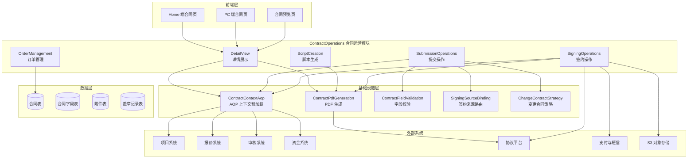
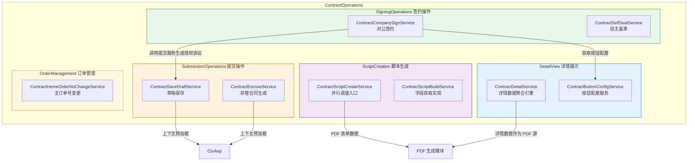
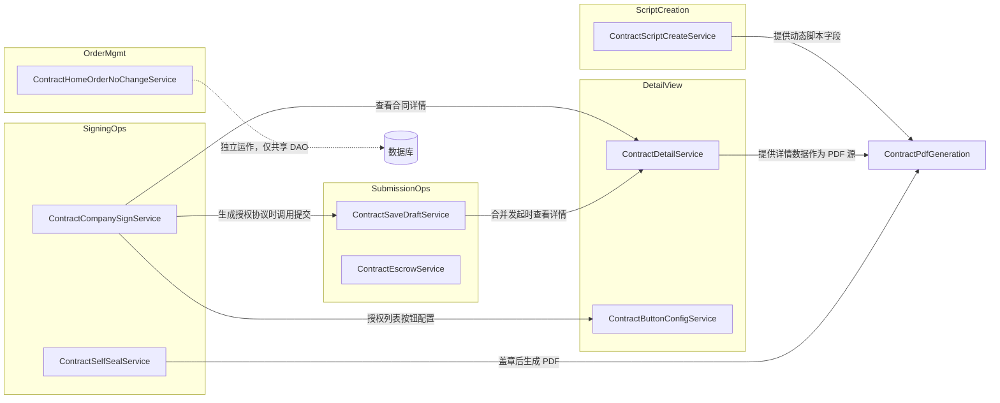
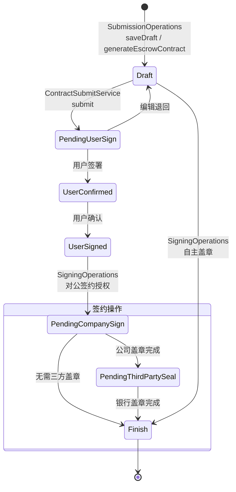

# ContractOperations 模块概览文档

## 1. 模块概述

ContractOperations（合同运营模块）是合同业务系统的**核心操作层**，负责合同从创建到签署全生命周期的关键业务操作。该模块聚合了合同详情展示、草稿保存与提交、签约授权、自主盖章、PDF 脚本字段生成、订单号变更等五大子模块，是前端页面与底层数据服务之间的业务编排中枢。

### 核心职责

| 职责 | 说明 |
|------|------|
| **合同详情展示** | 聚合 10+ 个外部子系统数据，为前端提供统一的合同详情响应；通过 Aviator 表达式引擎动态计算按钮可见性 |
| **草稿保存与提交** | 参数校验 → 数据拆分 → 草稿持久化 → 关联绑定；支持资金存管合同的幂等生成 |
| **签约授权** | 对公签约场景下授权协议书的生成、复用、关联与短信通知；自主盖章的异步 PDF 生成与印章加盖 |
| **脚本字段生成** | 通过反射 + 并行异步模式，为 PDF 生成提供动态脚本字段数据 |
| **订单号变更** | 处理"零售客源绑定整装客源"场景下的合同迁移与回滚 |

---

## 2. 模块架构

### 2.1 系统全景

### 2.2 子模块架构与数据流

---

## 3. 子模块总览

| 子模块 | 核心服务 | 职责 | 文档链接 |
|--------|---------|------|---------|
| **DetailView** | `ContractDetailService`、`ContractButtonConfigService` | 合同详情数据聚合（15 个子模块）+ 按钮可见性计算（Aviator 表达式引擎） | [DetailView 文档](DetailView.md) |
| **SubmissionOperations** | `ContractSaveDraftService`、`ContractEscrowService` | 草稿保存（校验→拆分→持久化→关联绑定）、存管合同幂等生成 | [SubmissionOperations 文档](SubmissionOperations.md) |
| **SigningOperations** | `ContractCompanySignService`、`ContractSelfSealService` | 对公签约授权协议管理、自主盖章（异步 PDF 生成+印章加盖） | [SigningOperations 文档](SigningOperations.md) |
| **ScriptCreation** | `ContractScriptCreateService` | 反射+并行异步获取 PDF 脚本讲解所需的动态字段数据 | [ScriptCreation 文档](ScriptCreation.md) |
| **OrderManagement** | `ContractHomeOrderNoChangeService` | 主订单号变更（换单）：正向迁移+回滚恢复 | [OrderManagement 文档](OrderManagement.md) |

---

## 4. 子模块协作关系

### 4.1 协作依赖图

### 4.2 协作场景说明

| 协作场景 | 涉及子模块 | 说明 |
|---------|-----------|------|
| **合同查看** | DetailView | 独立运作，通过 AOP 上下文预加载外部数据 |
| **草稿保存** | SubmissionOps → DetailView | 保存前参考详情模块的合并发起计算 |
| **合同提交 + PDF 生成** | SubmissionOps → ScriptCreation → PdfGen | 提交时触发 PDF 生成，脚本模块提供动态字段 |
| **对公签约授权** | SigningOps → SubmissionOps + DetailView | 生成授权协议复用提交流程，按钮配置复用详情模块 |
| **自主盖章** | SigningOps → PdfGen | 上传文件后异步生成盖章 PDF |
| **换单** | OrderManagement | 独立运作，不依赖其他子模块 |

---

## 5. 公共基础设施

ContractOperations 的各子模块共享以下公共基础设施：

### 5.1 ContractContextAop（上下文管理）

通过 **AOP 切面 + ThreadLocal** 模式，在请求生命周期内预加载并缓存外部依赖数据（项目信息、报价方案、审核信息等），支持并行 RPC 调用以优化性能。

- **ContractDetailContextHandler**：详情查看场景，预加载 8 类外部数据
- **ContractContextHandler**：提交/保存等写操作场景，预加载 6 类外部数据
- **首屏优化**：详情请求支持首屏仅返回 4 个核心子模块

### 5.2 其他共享模块

| 模块 | 职责 | 被谁使用 |
|------|------|---------|
| **ContractPdfGeneration** | PDF 生成策略（自生成/协议平台） | ScriptCreation、DetailView、SigningOperations |
| **ContractFieldValidation** | 合同字段校验 | SubmissionOperations、SigningOperations |
| **SigningSourceBinding** | 签约来源路由策略（报价单/S 单/变更单） | SubmissionOperations |
| **ChangeContractStrategy** | 变更合同策略（普通变更/装企变更） | DetailView、SubmissionOperations |
| **MaterialPdfUtils** | 材料清单 PDF 差异比较 | ScriptCreation（间接） |

---

## 6. 合同生命周期与模块映射

| 生命周期阶段 | 对应子模块 | 核心操作 |
|-------------|-----------|---------|
| **查看/编辑** | DetailView | 详情数据组装、按钮配置计算 |
| **草稿保存** | SubmissionOperations | 参数校验、数据拆分、草稿持久化 |
| **合同提交** | SubmissionOperations + ScriptCreation | 提交 → PDF 生成（动态脚本字段） |
| **签约** | SigningOperations | 授权协议生成、自主盖章 |
| **换单** | OrderManagement | 合同迁移与回滚 |

---

## 7. 关键设计模式

| 设计模式 | 应用位置 | 说明 |
|---------|---------|------|
| **AOP + ThreadLocal 上下文** | ContractContextAop → 全模块 | 请求级数据预加载，避免重复 RPC 调用 |
| **组合模式** | DetailView | 15 个独立子模块组合为统一的详情响应 |
| **策略模式（Aviator 表达式）** | ContractButtonConfigService | 按钮可见性的多维度规则配置 + 动态求值 |
| **反射 + 并行异步** | ScriptCreation | 通过 CompletableFuture 并行获取脚本字段，总耗时取决于最慢单个查询 |
| **幂等保障** | ContractEscrowService | "先查后建"策略避免重复生成存管合同 |
| **合并发起** | ContractSaveDraftService | 发起正签合同时，自动计算并一并生成补充/结算协议 |
| **策略路由** | SigningSourceBinding → SubmissionOperations | 按绑定类型（报价单/S 单/变更单）路由到不同策略构建商品信息 |
| **操作快照回滚** | OrderManagement | 正向操作序列化结果为 JSON，回滚时直接反序列化恢复 |
| **软删除** | OrderManagement | 作废合同采用软删除，保证可恢复性和审计追溯 |

---

## 8. 注意事项

### 8.1 性能优化
- **首屏加载**：详情首屏仅返回 4 个核心子模块（contractBaseInfo、projectInfo、signInfo、businessInfo），减少数据量
- **并行 RPC**：AOP 切面并行调用多个外部服务，避免串行等待
- **按需加载**：前端通过 `moduleKeyList` 控制子模块返回

### 8.2 历史兼容
- 2023-03-23 前的证件信息存储方式不同，详情和附件模块均做了兼容处理
- 团装历史数据中报价单附件类型可能不一致

### 8.3 城市差异化
- 首期款比例、设计费标准、备件 OCR、公对公签约等功能存在城市维度差异

### 8.4 合同类型差异
- 正签、个性化、首期款、设计、变更、补充、解约、和解等 8+ 种合同类型在详情构建、按钮配置、签约流程中有大量差异化处理