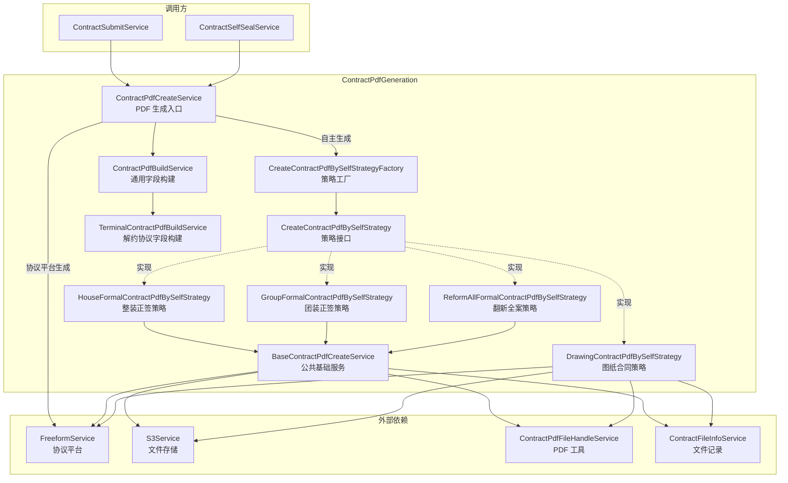
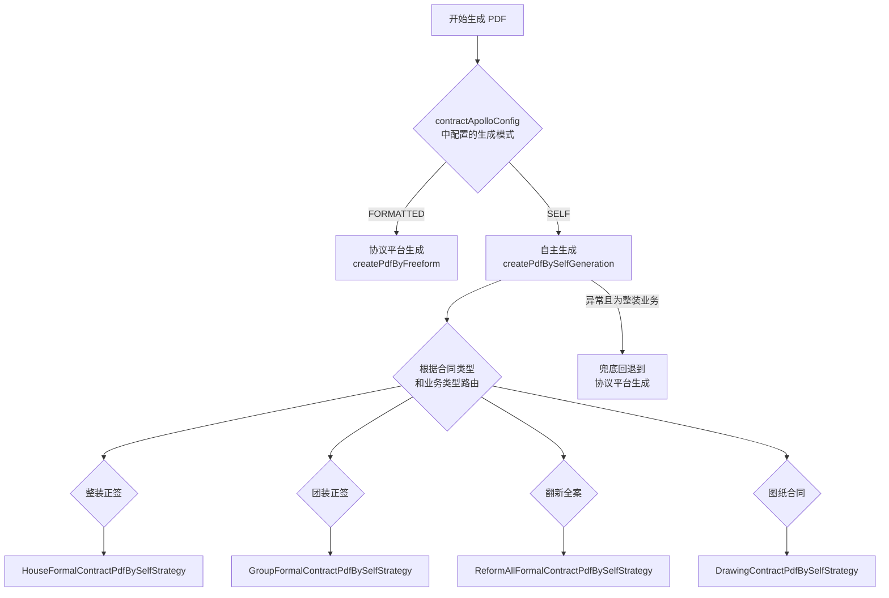
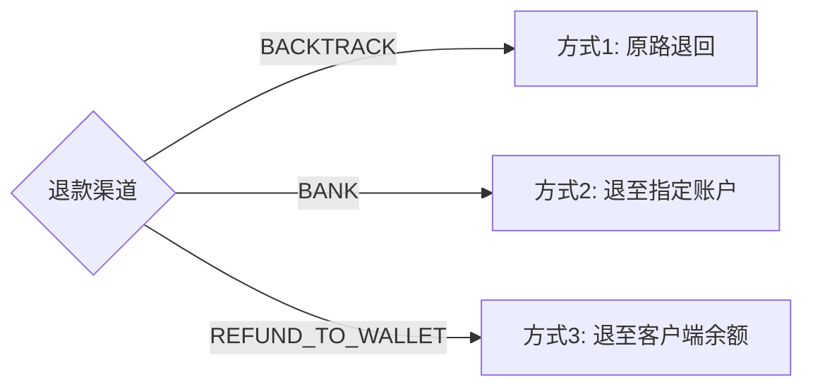
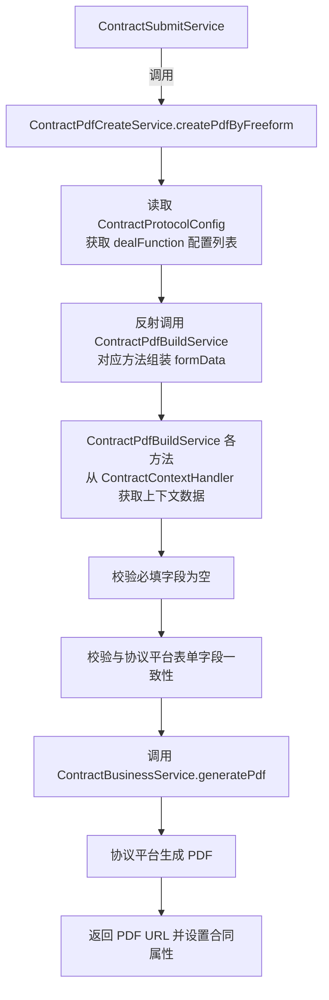
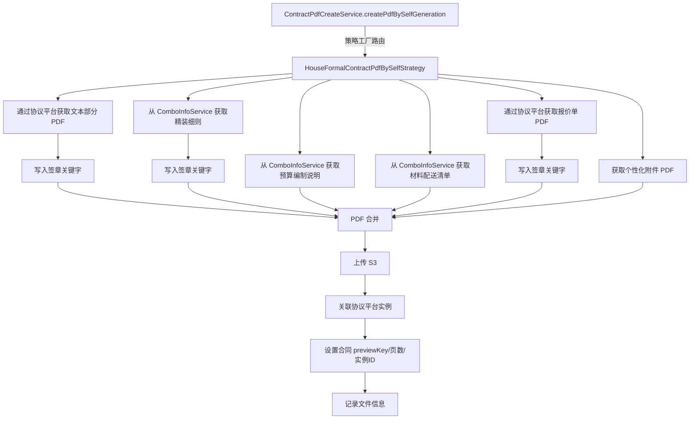
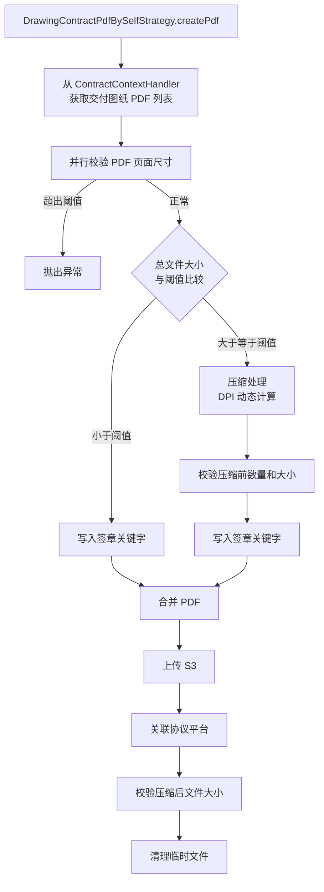
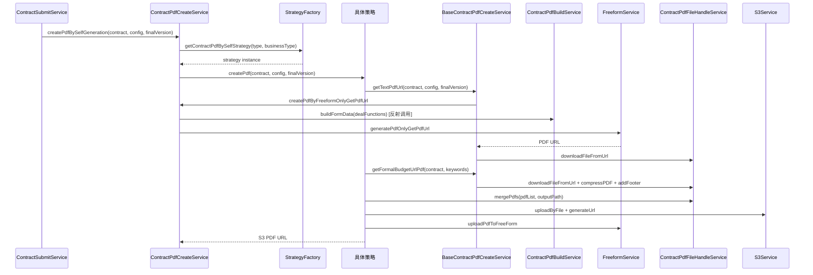

# ContractPdfGeneration 模块文档

## 1. 模块概述

ContractPdfGeneration 是合同运营系统中负责**合同 PDF 文件生成**的核心模块。该模块封装了两种 PDF 生成模式——**协议平台生成**和**自主拼接生成**——并通过策略模式按合同类型（整装正签、团装正签、翻新全案、图纸合同、解约协议）分发到不同的生成策略，最终产出可签署的合同 PDF 文件。

模块的入口为 `ContractPdfCreateService`，它根据合同配置判断使用哪种生成方式，协调各策略完成 PDF 的拼接、压缩、上传和协议平台关联。

## 2. 架构总览



## 3. 核心组件详解

### 3.1 ContractPdfCreateService — PDF 生成入口

| 方法 | 说明 |
|------|------|
| `createPdfByFreeform` | 通过协议平台生成 PDF：读取协议配置、反射调用字段构建方法组装 formData、校验必填字段和配置一致性后调用协议平台生成 |
| `createPdfBySelfGeneration` | 自主拼接生成 PDF：通过策略工厂获取对应策略执行，包含**兜底逻辑**——自生成失败时回退到协议平台生成（仅限整装业务） |
| `createPdfByFreeformOnlyGetPdfUrl` | 仅获取协议平台生成的 PDF URL，不设置合同对象的属性值，供自生成策略中获取文本部分 PDF 使用 |
| `buildFormData` | 通过 Java 反射机制，根据数据库 `dealFunction` 配置逐个调用 `ContractPdfBuildService` 的方法，组装提交给协议平台的表单数据 |
| `checkCreatePdfData` | 校验最终版本 PDF 的必填字段是否为空 |
| `checkFormFieldConfig` | 校验合同协议配置的表单字段与协议平台表单字段的一致性 |

**生成方式选择逻辑：**



### 3.2 ContractPdfBuildService — 通用 PDF 字段构建

该类是一个大型字段构建器，包含 100+ 个方法，每个方法对应合同 PDF 模板中的一个或一组动态字段。`ContractPdfCreateService.buildFormData()` 通过 Java 反射按配置调用这些方法，组装协议平台所需的 `formData`。

字段分类：
- **基础信息**：合同编号 `getContractNo`、房屋地址 `getProjectContractAddress`、面积 `getArea`、户型 `getHuXingV2`
- **签约人信息**：甲方签章 `getSignUserInfo`/`getSignUserInfoV2`、乙方公司 `getSecondPartyCompanyInfo`、代理人 `getAgentUserInfo`
- **金额信息**：合同金额 `getContractAmount`/`getContractAmountV2`、设计费 `getDesignContractAmountInfo`、首付款 `getAdvancePaidInfo`
- **附件链接**：报价单 `getBudgetUrl`/`getBudgetUrlV2`、图纸 `getDrawingUrlV2`、精装细则 `getDecorateRuleUrl`
- **解约协议专用**：委托 `TerminalContractPdfBuildService` 的方法处理解约协议特有字段

### 3.3 TerminalContractPdfBuildService — 解约协议字段构建

专门为**解约协议 PDF** 提供动态字段数据，处理退单场景下的复杂业务逻辑。

| 方法 | 功能 | 核心逻辑 |
|------|------|----------|
| `getTerminalSecondPartyCompanyInfo` | 获取乙方公司名称 | 从正向签约合同中获取公司信息 |
| `getTerminalProjectContractAddress` | 获取房屋地址 | 拼接城市-区-小区-楼栋-单元-楼层-房间号 |
| `getTerminalSignContractInfo` | 获取已签署合同信息 | 按合同类型分组已签合同编号，组装设计合同+主合同文本 |
| `getTerminalDetailFundInfo` | 获取明细款项信息 | 区分团装/整装局装不同模板，包含设计费、工程款、违约金、已发生费用等 |
| `getTerminalTotalFundInfo` | 获取总款项信息 | 判断应付/应收，应付走付款模板，应收走退款模板（含退款渠道和银行账户信息） |
| `getTerminalRetrieveMaterialDays` | 获取剩余施工材料取回天数 | 从项目信息获取 |
| `getBreachPenaltyAmount` | 获取保密违约金金额 | 从项目信息获取 |
| `getTerminalRelationHouseFormalInfo` | 获取合并发起关联的家装正签合同信息 | 仅合并发起模式生效 |

**退款渠道映射：**



### 3.4 CreateContractPdfBySelfStrategy 接口与策略工厂

`CreateContractPdfBySelfStrategy` 是自生成 PDF 策略的统一接口，仅有一个核心方法：

```java
String createPdf(Contract contract, ContractCityCompanyInfo config, boolean finalVersion) throws Exception;
```

`CreateContractPdfBySelfStrategyFactory` 利用 Spring 的 `ApplicationContextAware` 在启动时收集所有实现 Bean，运行时根据 `contractType` 和 `businessType` 路由到对应策略。

### 3.5 BaseContractPdfCreateService — 策略公共基础

为各正签合同自生成策略提供公共能力，被 `HouseFormalContractPdfBySelfStrategy`、`GroupFormalContractPdfBySelfStrategy`、`ReformAllFormalContractPdfBySelfStrategy` 继承。

| 方法 | 功能 |
|------|------|
| `getTextPdfUrl` | 调用协议平台获取合同文本部分 PDF 并下载到本地 |
| `getFormalBudgetUrlPdf` | 获取报价单 PDF，必要时压缩后写入盖章关键字 |
| `addFooter` | 在 PDF 的指定位置写入甲方/乙方/甲方代理人签章关键字 |
| `getJiaFangSealKeyword` / `getYiFangSealKeyword` / `getJiaFangAgentSealKeyword` | 从协议平台签章规则中提取各角色签章关键字 |
| `getCustomAttach` | 获取个性化附件 PDF（按城市、公司、业务类型配置） |

### 3.6 HouseFormalContractPdfBySelfStrategy — 整装正签策略

处理整装（HOUSE_CERTIFICATE）业务的正签合同 PDF 自生成。

**PDF 拼接顺序：**
1. 正签文本部分（通过协议平台生成）
2. 精装细则（最后一页写入盖章关键字）
3. 预算编制说明
4. 材料配送清单
5. 报价单（最后一页写入盖章关键字）
6. 个性化附件（可选）

每个附件均通过 `ComboInfoService` 按套餐代码获取，支持多套餐循环拼接。

### 3.7 GroupFormalContractPdfBySelfStrategy — 团装正签策略

继承 `BaseContractPdfCreateService`，处理团装（GROUP_DECORATE）业务的正签合同 PDF 自生成。

**PDF 拼接顺序：**
1. 正签文本部分
2. 报价单（写入盖章关键字）
3. 基础图纸（从交付图纸中筛选 PDF 格式的全屋图纸，大于 5MB 时压缩）
4. 个性化附件（可选）

**图纸处理：**
- 从 `ContractContextHandler.getDrawingDTO()` 获取交付图纸列表
- 按 `全屋图纸` 业务类型和 PDF 扩展名筛选
- 超过 5MB 阈值时调用 `ContractPdfFileHandleService.batchCompressPdf` 压缩

### 3.8 ReformAllFormalContractPdfBySelfStrategy — 翻新全案策略

继承 `BaseContractPdfCreateService`，处理翻新全案（REFORM_ALL）业务的正签合同 PDF 自生成。

**PDF 拼接顺序：**
1. 正签文本部分
2. 报价单（写入甲方、乙方、甲方代理人三方签章关键字）
3. 工期说明附件（图片转 PDF，超 5MB 压缩）
4. 个性化附件（可选）

**工期说明附件获取：** 从 `ContractAttachConfig` 按城市、公司、合同表单类型和附件类型查询，支持默认配置回退。

### 3.9 DrawingContractPdfBySelfStrategy — 图纸合同策略

独立实现 `CreateContractPdfBySelfStrategy`（不继承 `BaseContractPdfCreateService`），专门处理**图纸合同**的 PDF 生成。

**核心流程：**
1. 从 `ContractContextHandler.getDrawingDTO()` 获取基础图纸 PDF URL 列表
2. 校验 PDF 尺寸面积（宽高不超过配置阈值）
3. 根据总文件大小与阈值比较：
   - **小于阈值**：直接写入签章关键字 → 合并
   - **大于等于阈值**：先压缩（DPI 动态计算）→ 写入签章关键字 → 合并
4. 压缩前后分别校验文件数量和大小是否超出系统上限
5. 上传 S3 → 关联协议平台实例

**并行尺寸校验：** 使用 `CompletableFuture` 线程池并发读取每个 PDF 文件的页面尺寸信息，15 秒超时保护。

## 4. 依赖关系

```mermaid
graph TD
    subgraph ContractPdfGeneration
        PdfCreate[ContractPdfCreateService]
        PdfBuild[ContractPdfBuildService]
        TerminalBuild[TerminalContractPdfBuildService]
        BaseCreate[BaseContractPdfCreateService]
        HouseStrategy[HouseFormalContractPdfBySelfStrategy]
        GroupStrategy[GroupFormalContractPdfBySelfStrategy]
        ReformStrategy[ReformAllFormalContractPdfBySelfStrategy]
        DrawingStrategy[DrawingContractPdfBySelfStrategy]
    end

    subgraph ContractContextAop
        CtxHandler[ContractContextHandler]
    end

    subgraph MaterialPdfUtils
        MatPdfService[MaterialPdfDiffService]
        MatPdfUtil[MaterialPdfUtil]
    end

    subgraph 外部服务
        FreeformSvc[FreeformService]
        S3Svc[S3Service]
        PdfHandleSvc[ContractPdfFileHandleService]
        FileRecordSvc[ContractFileInfoService]
        ComboInfoSvc[ComboInfoService]
        ApolloCfg[ContractApolloConfig]
        CipherSvc[CipherService]
        CancelSvc[CancelOrderService]
        ContractBizSvc[ContractBusinessService]
        CommonBizSvc[CommonBusinessService]
        CommonContractSvc[CommonContractService]
    end

    PdfCreate --> PdfBuild
    PdfCreate --> BaseCreate
    PdfCreate --> ContractBizSvc
    PdfCreate --> ApolloCfg
    PdfBuild --> TerminalBuild
    PdfBuild --> CtxHandler
    PdfBuild --> CommonBizSvc
    TerminalBuild --> ContractBizSvc
    TerminalBuild --> CancelSvc
    TerminalBuild --> CommonContractSvc
    TerminalBuild --> CipherSvc
    TerminalBuild --> CtxHandler
    BaseCreate --> FreeformSvc
    BaseCreate --> PdfHandleSvc
    BaseCreate --> S3Svc
    BaseCreate --> FileRecordSvc
    BaseCreate --> ApolloCfg
    HouseStrategy --> ComboInfoSvc
    GroupStrategy --> CtxHandler
    ReformStrategy --> ApolloCfg
    DrawingStrategy --> FreeformSvc
    DrawingStrategy --> PdfHandleSvc
    DrawingStrategy --> S3Svc
    DrawingStrategy --> FileRecordSvc
    DrawingStrategy --> ApolloCfg
    DrawingStrategy --> CtxHandler
```



## 5. 数据流

### 5.1 协议平台生成模式数据流



### 5.2 自主生成模式数据流（以整装正签为例）



### 5.3 图纸合同自生成数据流



## 6. 关键设计模式

### 6.1 策略模式（Strategy Pattern）

模块最核心的设计模式。`CreateContractPdfBySelfStrategy` 接口定义统一的 `createPdf` 方法，4 个策略实现类分别处理不同业务类型的 PDF 生成：

| 策略实现 | 适用业务 | 继承关系 |
|---------|---------|---------|
| `HouseFormalContractPdfBySelfStrategy` | 整装正签 | 继承 `BaseContractPdfCreateService` |
| `GroupFormalContractPdfBySelfStrategy` | 团装正签 | 继承 `BaseContractPdfCreateService` |
| `ReformAllFormalContractPdfBySelfStrategy` | 翻新全案正签 | 继承 `BaseContractPdfCreateService` |
| `DrawingContractPdfBySelfStrategy` | 图纸合同 | 独立实现（不继承基础类） |

`CreateContractPdfBySelfStrategyFactory` 通过 Spring 的 `ApplicationContextAware` 在启动时自动收集所有策略 Bean，运行时根据 `ContractTypeEnum.getContractPdfBySelfStrategy(contractType, businessType)` 返回 Bean 名称进行路由。

### 6.2 模板方法模式（Template Method Pattern）

`BaseContractPdfCreateService` 提供了 PDF 生成的公共骨架步骤（获取文本 PDF → 获取报价单 → 写入关键字 → 压缩 → 合并 → 上传），子类在 `createPdf` 方法中组合调用这些步骤并按各自业务需求插入额外附件（如精装细则、图纸、工期说明等）。

### 6.3 反射机制驱动的字段映射

`ContractPdfCreateService.buildFormData()` 使用 Java 反射调用 `ContractPdfBuildService` 的方法。数据库 `ContractProtocolConfig` 表中存储 `dealFunction` 字段（方法名），实现了字段配置与代码实现的解耦——新增字段只需在数据库新增配置并添加对应方法，无需修改框架代码。

### 6.4 优雅降级（Graceful Degradation）

`ContractPdfCreateService.createPdfBySelfGeneration` 中实现了自生成失败时的**兜底回退机制**：当自主生成 PDF 异常且业务类型为整装时，自动切换到协议平台生成方式，保障签约流程的可用性。

## 7. 模块间交互



## 8. 相关模块

| 模块 | 关系 | 文档链接 |
|------|------|---------|
| [ContractContextAop](ContractContextAop.md) | 为 PDF 生成提供上下文数据（项目信息、图纸、报价等） | AOP 切面在请求进入时初始化 `ContractContextHandler` 中的线程本地数据 |
| [MaterialPdfUtils](MaterialPdfUtils.md) | 提供材料清单 PDF 的比对和生成工具 | 正签合同拼接材料配送清单时依赖 |
| [ContractOperations](ContractOperations.md) | 上层调用方，提交/保存/盖章等操作触发 PDF 生成 | `ContractSubmitService` 和 `ContractSelfSealService` 调用本模块 |
| [ContractFieldValidation](ContractFieldValidation.md) | PDF 生成前的字段校验 | 确保合同字段合法性后才进入 PDF 生成流程 |
| [SigningSourceBinding](SigningSourceBinding.md) | 提供个人签约来源数据 | 个人合同 PDF 生成时的报价和图纸数据来源 |

## 9. 配置项

模块通过 `ContractApolloConfig` 进行动态配置，关键配置项包括：

| 配置分类 | 配置项 | 说明 |
|---------|--------|------|
| 图纸合同 | `drawingLaunchConfig.drawingCompressSize` | 图纸压缩阈值（MB） |
| 图纸合同 | `drawingLaunchConfig.drawingCountLimit` | 图纸文件数量上限 |
| 图纸合同 | `drawingLaunchConfig.drawingSpaceSizeLimit` | 图纸占用空间上限（MB） |
| 图纸合同 | `drawingLaunchConfig.pdfMaxArea` | 单页 PDF 面积上限 |
| 图纸合同 | `drawingLaunchConfig.positionXRatio/positionYRatio` | 甲方签章位置比例 |
| 图纸合同 | `drawingLaunchConfig.checkPdfAreaSize` | PDF 尺寸校验开关 |
| 正签合同 | `formalLaunchConfig.compressSize` | 正签附件压缩阈值（MB） |
| 正签合同 | `formalLaunchConfig.positionXRatio*` | 各角色签章位置比例 |

## 10. 异常处理与边界条件

| 场景 | 处理方式 |
|------|----------|
| 图纸数量/大小超限 | 抛出 `DRAWING_LIMIT_ERROR`，提示用户联系设计 SSC 调整 |
| PDF 页面尺寸超限 | 抛出异常，提示调整至 3370×2384 以内 |
| 压缩后仍超限 | 抛出异常，阻止继续生成 |
| 自生成策略不存在 | 工厂抛出 `NrsBusinessException` |
| 自生成异常（整装） | 兜底回退到协议平台生成 |
| 自生成异常（非整装） | 直接抛出异常 |
| 报价单/精装细则 PDF 为空 | 抛出异常提示联系运营 |
| 签章关键字获取失败 | 抛出异常中断生成 |
| 合并发起但无正签合同 | 抛出异常 |
| 必填字段为空 | 抛出 `CONTRACT_FIELD_MISS` 异常 |
