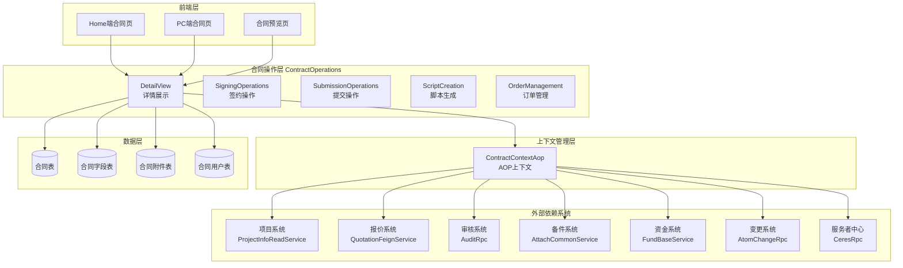
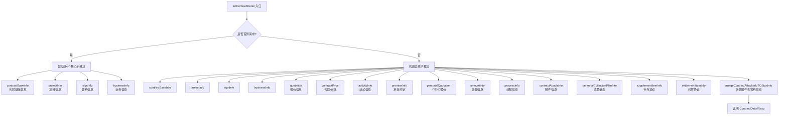
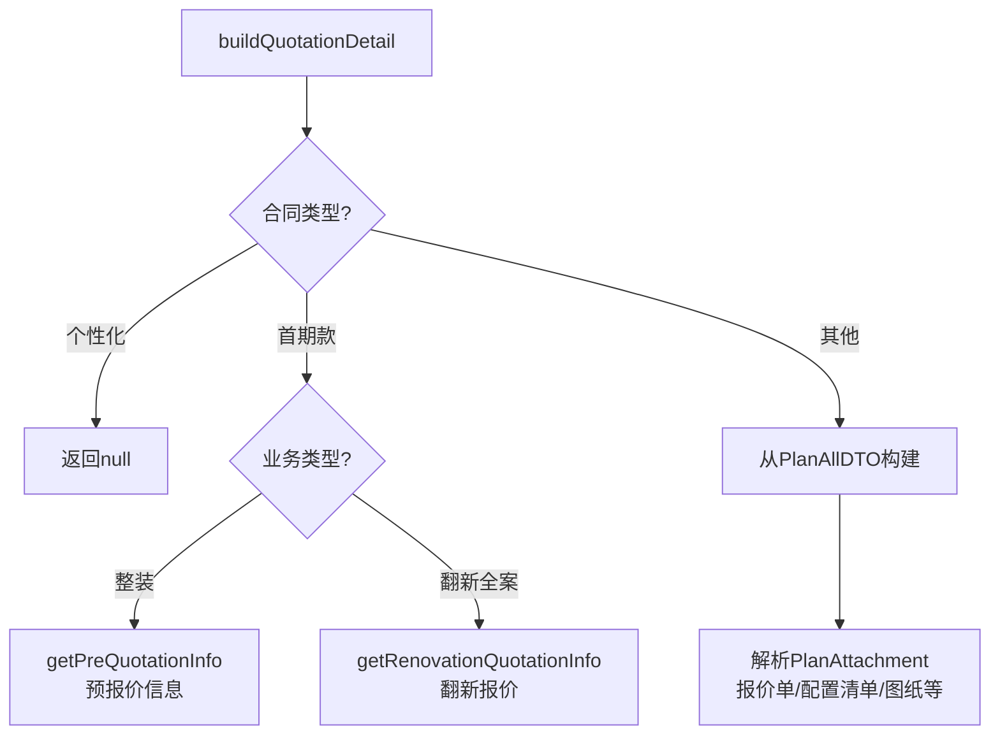
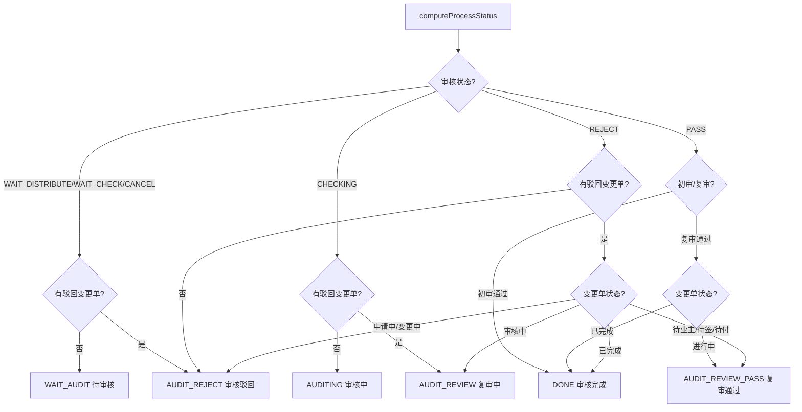
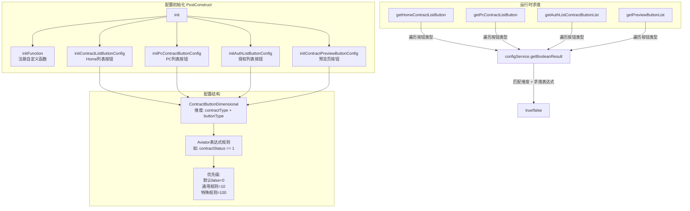
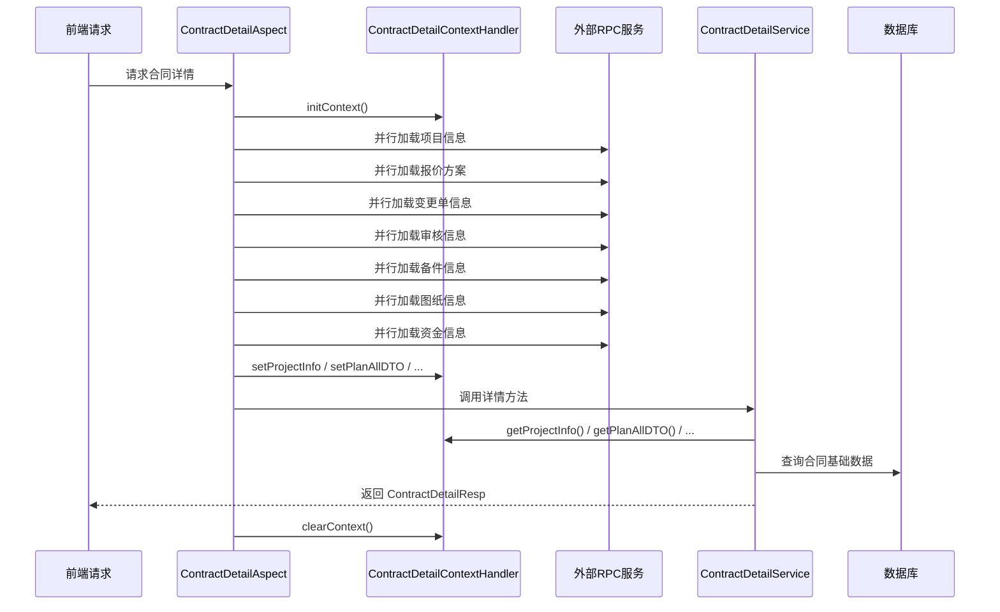
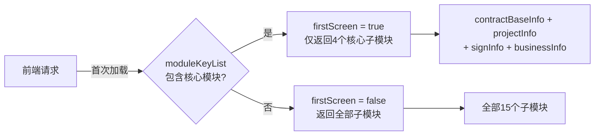
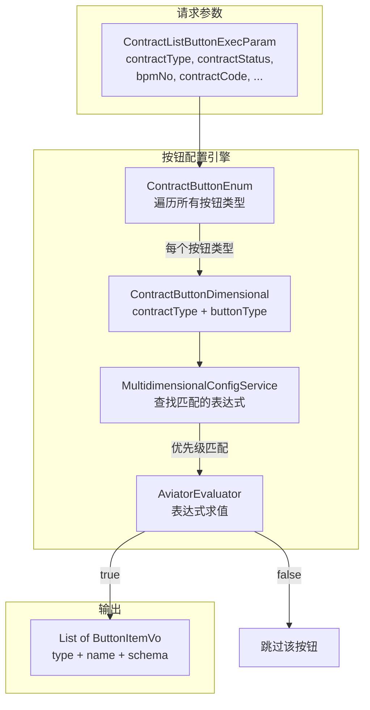

# DetailView 模块文档

## 1. 模块概述

DetailView 模块是合同业务系统中的**详情展示层**，负责合同详情页的数据组装和按钮可见性计算。该模块是用户查看合同时的核心数据出口，将来自多个子系统（项目信息、报价系统、风控审核、备件系统、收款计划等）的数据聚合为前端所需的完整详情响应。

### 核心职责

- **合同详情数据组装**：将散落在多个子系统中的数据聚合为统一的 `ContractDetailResp` 响应
- **按钮配置与可见性计算**：基于合同类型、状态、业务规则等多维度条件，使用 Aviator 表达式引擎动态计算按钮的显示/隐藏
- **上下文管理**：通过 AOP 切面 + ThreadLocal 模式，在请求生命周期内预加载并缓存外部依赖数据

### 核心组件

| 组件 | 职责 |
|------|------|
| `ContractDetailService` | 合同详情数据聚合引擎，组装项目信息、签约信息、报价信息、附件信息等 10+ 个子模块 |
| `ContractButtonConfigService` | 按钮配置服务，通过多维度配置 + 表达式引擎实现按钮级别的显示/隐藏规则 |

---

## 2. 系统架构

### 2.1 模块在系统中的位置



### 2.2 核心组件架构

```mermaid
graph TD
    subgraph AOP切面层
        ContractDetailAspect[ContractDetailAspect<br/>详情AOP切面]
        ContractContextAspect[ContractContextAspect<br/>通用上下文AOP]
        ContractDetailContextHandler[ContractDetailContextHandler<br/>详情上下文Handler]
        ContractContextHandler[ContractContextHandler<br/>通用上下文Handler]
    end

    subgraph 详情核心服务
        CDS[ContractDetailService<br/>合同详情服务]
        CBCS[ContractButtonConfigService<br/>按钮配置服务]
    end

    subgraph 详情子模块构建器
        ProjectInfo[buildContractProjectInfoDetail<br/>项目信息]
        BaseInfo[buildContractBaseInfoDetail<br/>基础信息]
        SignInfo[buildContractSignInfoDetail<br/>签约信息]
        QuoteInfo[buildQuotationDetail<br/>报价信息]
        AttachInfo[buildContractAttachInfo<br/>附件信息]
        ProcessInfo[buildProcessInfoDetail<br/>流程信息]
        PromiseInfo[buildPromiseInfoDetail<br/>承包约定]
        ActivityInfo[buildActivityInfoDetail<br/>活动信息]
        AmountInfo[buildAmountInfoDetail<br/>金额信息]
        PersonalQuote[buildPersonalQuotationDetail<br/>个性化报价]
        CollectionPlan[buildPersonalCollectionPlanInfo<br/>收款计划]
        SupplementInfo[buildSupplementItemInfo<br/>补充协议]
        SettlementInfo[buildSettlementItemInfo<br/>和解协议]
    end

    subgraph 外部数据预加载
        ProjData[项目信息]
        PlanData[报价方案]
        AuditData[审核信息]
        AttachData[备件信息]
        FundData[资金信息]
        ChangeData[变更信息]
        DrawData[图纸信息]
    end

    ContractDetailAspect -->|拦截详情请求| ContractDetailContextHandler
    ContractContextAspect -->|拦截提交请求| ContractContextHandler
    ContractDetailAspect -->|预加载| ProjData
    ContractDetailAspect -->|预加载| PlanData
    ContractDetailAspect -->|预加载| AuditData
    ContractDetailAspect -->|预加载| AttachData
    ContractDetailAspect -->|预加载| FundData
    ContractDetailAspect -->|预加载| ChangeData
    ContractDetailAspect -->|预加载| DrawData

    CDS -->|读取上下文| ContractDetailContextHandler
    CDS --> ProjectInfo
    CDS --> BaseInfo
    CDS --> SignInfo
    CDS --> QuoteInfo
    CDS --> AttachInfo
    CDS --> ProcessInfo
    CDS --> PromiseInfo
    CDS --> ActivityInfo
    CDS --> AmountInfo
    CDS --> PersonalQuote
    CDS --> CollectionPlan
    CDS --> SupplementInfo
    CDS --> SettlementInfo
```



---

## 3. 核心组件详解

### 3.1 ContractDetailService — 合同详情数据聚合引擎

#### 3.1.1 职责与设计

`ContractDetailService` 是整个详情模块的核心，采用**组合模式**将 10+ 个子模块的数据组装为统一的 `ContractDetailResp` 响应对象。每个子模块对应详情页上的一个区域（如项目信息、签约信息、报价信息等），各自独立构建。

#### 3.1.2 入口方法：initContractDetail

```
initContractDetail(projectOrderId, contractType, moduleKeyList, changeOrderId, billCodeInfoList, subOrderInfoList, changeOrderInfoList)
```

这是合同详情的初始化入口（新建合同时调用），流程如下：



**首屏优化策略**：通过 `ContractDetailContextHandler.isFirstScreen()` 标记首屏请求，首屏仅返回 4 个核心子模块（contractBaseInfo、projectInfo、signInfo、businessInfo），减少首屏加载时间。非首屏请求返回全部模块。

#### 3.1.3 子模块构建详解

**1) 项目信息 (ContractProjectInfoDetail)**

`buildContractProjectInfoDetail` 负责构建项目信息，数据来源包括：
- 客源系统：客户姓名、电话、地址、房屋信息
- 报价系统：户型信息（2.5 合并发起模式下从报价获取）
- 备件系统：备件 OCR 覆盖面积、房本地址
- 设计师中心：设计师信息（UCID、职级）
- Apollo 配置：工期间开关、工期单位开关

关键业务规则：
- 草稿态合同：设计师信息、地址等字段**实时**从客源获取（保证数据最新）
- 非草稿态合同：使用数据库已保存的字段值
- 2.5 合并发起模式：房屋类型从报价获取，原始户型从报价获取
- 首期款合同：计算并返回首期款比例选项

**2) 签约信息 (ContractSignInfoDetail)**

`buildContractSignInfoDetail` 构建签约信息，逻辑分为两大分支：

| 场景 | 逻辑 |
|------|------|
| 新建合同 (contract == null) | 设置默认值，从备件/正签/首期款合同继承信息 |
| 编辑已有合同 (contract != null) | 从 DB 字段回填，从 ContractUser 表读取签约人信息 |

数据继承链（新建个性化合同时）：
```
首期款合同(已确认/已签约) → 当前个性化合同
```

数据继承链（新建正签合同时）：
```
前一项目正签合同 → 当前正签合同（团转非团场景）
```

**3) 报价信息 (QuotationInfo)**

`buildQuotationDetail` 根据合同类型选择不同的报价数据源：



**4) 流程信息 (ProcessInfo)**

`buildProcessInfoDetail` 构建风控审核流程状态，仅对**已签署的正签合同**生效。

流程状态计算逻辑 `computeProcessStatus`：



**5) 附件信息 (ContractAttachInfoDetail)**

`buildContractAttachInfo` 构建合同附件信息，数据来源优先级：

1. 合同已保存的附件数据（ContractAttach 表）
2. 备件系统上传的证件信息（AttachInfoDetail）
3. 前一项目的合同附件（团转非团场景）
4. 历史合同用户表中的证件信息（兼容 2023-03-23 前的历史数据）

附件类型覆盖：身份证、房产证、购房合同、认购合同、契税票、特殊房产证明、营业执照、代理人证件、公司代理人证件、法人证件、团装终止证明等。

#### 3.1.4 数据来源汇总

| 子模块 | 主要数据来源 |
|--------|-------------|
| 项目信息 | ProjectInfoReadService（客源）、PlanAllDTO（报价）、AttachCommonService（备件）、CeresRpc（设计师） |
| 基础信息 | ContractService（合同表）、ContractFieldService（字段表）、ContractApolloConfig（配置） |
| 签约信息 | ContractUser（签约人）、ContractField（字段）、AttachCommonService（备件） |
| 报价信息 | PlanAllDTO（报价方案）、AtomBudgetRpc（预报价）、AtomDrawingRpc（图纸） |
| 流程信息 | AuditRpc（审核信息）、AtomChangeRpc（变更单） |
| 附件信息 | ContractAttachService、AttachCommonService、ContractUserService |
| 承包约定 | ContractApolloConfig、ContractMaterialService |
| 活动信息 | PlanAllDTO（活动、优惠券） |
| 金额信息 | FundInfoService（资金信息） |
| 收款计划 | PayConfigService、FundBaseService |

---

### 3.2 ContractButtonConfigService — 按钮配置服务

#### 3.2.1 职责与设计

`ContractButtonConfigService` 使用 **Aviator 表达式引擎 + 多维度配置** 实现按钮级别的显示/隐藏控制。配置在服务启动时（`@PostConstruct`）初始化到内存中，运行时通过表达式求值判断按钮可见性。

#### 3.2.2 架构设计



#### 3.2.3 多维度配置体系

配置采用**二维矩阵**模式：`合同类型 × 按钮类型 → 表达式`，通过优先级实现规则覆盖：

| 优先级 | 用途 | 示例 |
|--------|------|------|
| 0 | 默认兜底 | `false`（所有按钮默认隐藏） |
| 10 | 通用规则 | `*_1` → 所有合同类型的"预览并分享"按钮 |
| 100 | 特殊规则 | `4_2` → 变更合同的"编辑"按钮 = false（覆盖通用规则） |

**Home 端按钮配置覆盖矩阵（部分）**：

| 合同类型 | 预览分享(1) | 编辑(2) | 撤回(3) | 申请用章(4) | 审核详情(5) | 删除(6) | 查看(7) | 去重签(8) |
|---------|------------|---------|---------|------------|------------|---------|---------|----------|
| 通用(*) | status!=1且!=10 | status==1 | status含2/4/5/6 | status==3 | bpmNo非空且status含6/7/8 | status==1 | status!=1且!=10 | 条件复杂 |
| 设计(2) | - | status==1且单独发起 | 单独发起时跟随通用 | - | - | status==1且单独发起 | 单独发起时显示 | - |
| 变更(4) | - | **false** | **false** | - | - | **false** | **false** | - |
| 解约(5) | status含3/8 | **false** | **false** | - | - | **false** | 非当前项目不显示 | - |
| 个性化(8) | - | status==1且C单独发起 | 条件复杂 | - | - | status==1且无变更 | **false** | - |
| 补充(29) | - | status==1且单独发起 | 跟随通用+单独发起 | status==3且单独发起 | bpmNo非空且status含2/3/4/6/7/8 | status==1且单独发起 | - | **false** |

#### 3.2.4 自定义 Aviator 函数

按钮配置中使用了 `ContractFunction` 类注册的自定义函数：

| 函数 | 用途 |
|------|------|
| `ContractFunction.showUndoButton(contractCode, userConfirmNodeList)` | 判断是否显示撤销按钮 |
| `ContractFunction.showReSignButton(contractCode, contractType, contractStatus, contractList)` | 判断是否显示重签按钮 |
| `ContractFunction.showChangeButton(contractList, contractCode)` | 判断是否显示变更按钮 |
| `ContractFunction.showPersonCreateButton(contractList)` | 判断是否显示个性化创建按钮 |

#### 3.2.5 按钮 Schema 生成

按钮不仅控制可见性，还生成跳转 Schema（deep link），引导前端跳转到对应页面：

| 按钮类型 | Schema 生成逻辑 |
|---------|----------------|
| 查看授权 | `/jinggong/bj/contract_confirm_meijia?contractCode=xxx&isSignContract=false` |
| 去签约 | `/jinggong/bj/contract_confirm_meijia?contractCode=xxx&isAuth=true` |
| 去授权 | `/jinggong/bj/contract_result_meijia?contractCode=xxx&isAuth=true` |
| 修改协议(撤回) | `recallSchema` 模板 + projectOrderId + contractType |

---

## 4. 上下文管理机制

### 4.1 AOP 切面 + ThreadLocal 模式

DetailView 模块采用 **AOP 切面预加载 + ThreadLocal 缓存** 的模式管理请求级别的上下文数据。



### 4.2 两个 Handler 的职责划分

| Handler | 适用场景 | 预加载数据 |
|---------|---------|-----------|
| `ContractDetailContextHandler` | 详情查看请求 | 项目信息、报价方案、审核信息、备件信息、图纸信息、资金信息、变更信息、设计费标准 |
| `ContractContextHandler` | 提交/保存等写操作请求 | 项目信息、报价方案、图纸信息、变更报价信息、多公司信息、托管账户信息 |

### 4.3 首屏优化

`ContractDetailContextHandler` 维护 `firstScreen` 标记：



---

## 5. 关键数据流

### 5.1 合同详情初始化数据流

```mermaid
graph TD
    subgraph 输入参数
        PID[projectOrderId 项目单号]
        CT[contractType 合同类型]
        MK[moduleKeyList 模块列表]
        COID[changeOrderId 变更单号]
        BILLCODES[billCodeInfoList 报价单列表]
    end

    subgraph 上下文预加载 ContractDetailAspect
        PINFO[项目信息<br/>ProjectInfoDTO]
        PLAN[报价方案<br/>PlanAllDTO]
        CHANGE[变更单<br/>ChangeListDTO]
        AUDIT[审核信息<br/>AuditDetailDto]
        ATTACH[备件信息<br/>AttachInfoDetail]
        DRAW[图纸信息<br/>DrawingDTO]
        FUND[资金信息<br/>FundInfo]
        DEPSRC[个性化报价源<br/>ContractSourceDataBO]
    end

    subgraph 详情组装 ContractDetailService
        INIT[initContractDetail]
        PROJ[项目信息模块]
        BASE[基础信息模块]
        SIGN[签约信息模块]
        BIZ[业务信息模块]
        QUOTE[报价信息模块]
        PROC[流程信息模块]
        ATT[附件信息模块]
        PROMISE[承包约定模块]
        AMOUNT[金额信息模块]
        PQUOTE[个性化报价模块]
        PLAN2[收款计划模块]
        SUPP[补充协议模块]
        SETTLE[和解协议模块]
    end

    subgraph 输出
        RESP[ContractDetailResp]
    end

    PID --> INIT
    CT --> INIT
    MK --> INIT
    COID --> INIT
    BILLCODES --> INIT

    PINFO --> PROJ
    PINFO --> SIGN
    PLAN --> QUOTE
    PLAN --> PROJ
    CHANGE --> BIZ
    CHANGE --> PROC
    AUDIT --> PROC
    ATTACH --> ATT
    DRAW --> QUOTE
    FUND --> AMOUNT
    DEPSRC --> PQUOTE
    DEPSRC --> BIZ

    INIT --> PROJ
    INIT --> BASE
    INIT --> SIGN
    INIT --> BIZ
    INIT --> QUOTE
    INIT --> PROC
    INIT --> ATT
    INIT --> PROMISE
    INIT --> AMOUNT
    INIT --> PQUOTE
    INIT --> PLAN2
    INIT --> SUPP
    INIT --> SETTLE

    PROJ --> RESP
    BASE --> RESP
    SIGN --> RESP
    BIZ --> RESP
    QUOTE --> RESP
    PROC --> RESP
    ATT --> RESP
    PROMISE --> RESP
    AMOUNT --> RESP
    PQUOTE --> RESP
    PLAN2 --> RESP
    SUPP --> RESP
    SETTLE --> RESP
```



### 5.2 按钮配置求值数据流



---

## 6. 关键设计模式

### 6.1 模板方法模式 — 子模块构建

每个子模块的构建方法遵循统一模式：
1. 检查 `moduleKeyList` 是否包含该模块（按需加载）
2. 从上下文/数据库获取数据
3. 业务逻辑转换
4. 返回子模块 DTO

```java
// 典型的子模块构建方法结构
public XxxDetail buildXxxDetail(List<String> moduleKeyList, ...) {
    if (!moduleKeyList.contains(ContractModuleEnum.XXX.getKey())) {
        return null;  // 前端未请求该模块
    }
    // 数据获取 + 业务逻辑 + 返回
}
```

### 6.2 策略模式 — 按钮配置规则

按钮配置通过 Aviator 表达式引擎实现规则与代码的解耦：
- 规则定义在 Java 代码中（`initXxxButtonConfig` 方法），但以**表达式字符串**形式存储
- 运行时通过表达式引擎动态求值，无需修改代码即可调整按钮可见性逻辑
- 优先级机制实现规则的覆盖和继承

### 6.3 上下文模式 — AOP + ThreadLocal

通过 AOP 切面在方法执行前预加载所有外部依赖数据，存入 ThreadLocal，业务方法通过静态方法直接访问。这实现了：
- **性能优化**：并行加载外部 RPC，减少串行调用延迟
- **代码简洁**：业务方法无需感知数据获取细节
- **上下文隔离**：ThreadLocal 保证线程安全

### 6.4 组合模式 — 详情响应组装

`ContractDetailResp` 由 15 个独立子模块组合而成，每个子模块：
- 可独立构建（无顺序依赖）
- 可按需返回（前端通过 `moduleKeyList` 控制）
- 可独立演进（修改一个子模块不影响其他）

---

## 7. 与其他模块的关系

### 7.1 上游依赖（DetailView 依赖的模块）

| 模块 | 依赖关系 |
|------|---------|
| [ContractContextAop](ContractContextAop.md) | AOP 切面预加载外部数据，为详情构建提供上下文 |
| [ContractFieldValidation](ContractFieldValidation.md) | 按钮配置中的字段校验规则参考 |
| [ChangeContractStrategy](ChangeContractStrategy.md) | 变更合同详情使用策略模式处理不同变更类型 |

### 7.2 下游被依赖（依赖 DetailView 的模块）

| 模块 | 依赖关系 |
|------|---------|
| [ContractOperations](ContractOperations.md) | DetailView 作为 ContractOperations 的子模块，提供详情展示能力 |
| [SigningOperations](SigningOperations.md) | 签约操作前需查看合同详情 |
| [SubmissionOperations](SubmissionOperations.md) | 提交操作前需加载合同详情数据进行校验 |

### 7.3 横向协作模块

| 模块 | 协作关系 |
|------|---------|
| [ContractPdfGeneration](ContractPdfGeneration.md) | PDF 生成依赖详情数据作为源数据 |
| [MaterialPdfUtils](MaterialPdfUtils.md) | 材料清单 PDF 差异比较，详情中报价信息可能涉及 |
| [SigningSourceBinding](SigningSourceBinding.md) | 个性化报价数据的来源绑定策略 |

---

## 8. 注意事项与约束

### 8.1 性能相关

- **首屏优化**：首屏仅返回 4 个核心子模块，减少数据加载量
- **上下文预加载**：AOP 切面并行调用多个 RPC，避免详情构建时的串行等待
- **按需加载**：前端通过 `moduleKeyList` 控制需要返回的子模块，避免不必要的数据组装

### 8.2 历史兼容

- 2023-03-23 前的历史数据中，证件信息可能仅存于 `ContractUser` 表，`buildContractAttachInfo` 中做了兼容处理
- 团装历史数据中报价单附件可能存为不同类型，`buildQuotationDetail` 中做了兼容处理

### 8.3 城市差异化

- 首期款比例：北京固定 20%/60%，其他城市从收款计划获取
- 设计费标准：不同城市使用不同的职级名称映射（`designerLevelNameMap` vs `sdDesignerLevelNameMap`）
- 备件 OCR：仅开城城市启用备件 OCR 功能
- 公对公线上签约：需项目维度+公司维度双重判断

### 8.4 合同类型差异

详情构建对不同合同类型有大量差异化处理，主要差异体现在：

| 合同类型 | 特殊处理 |
|---------|---------|
| 正签(PACKAGE_FORMAL) | 流程信息、设计费、补充协议、全案模式 |
| 个性化(PERSONAL) | 实时更新报价单列表、继承首期款签约信息 |
| 首期款(ADVANCE) | 预报价信息、首期款比例 |
| 设计(DESIGN) | 设计师职级、标准设计服务费 |
| 变更(PACKAGE_CHANGE) | 变更范围控制模块显示、变更单关联 |
| 补充(SUPPLEMENT) | 继承正签签约信息、单独发起校验 |
| 解约(TERMINAL) | 继承正签签约信息、退单金额 |
| 和解(SETTLEMENT) | 继承正签签约信息 |
