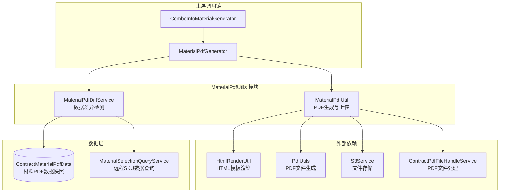
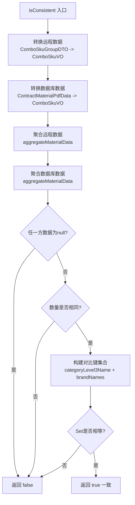
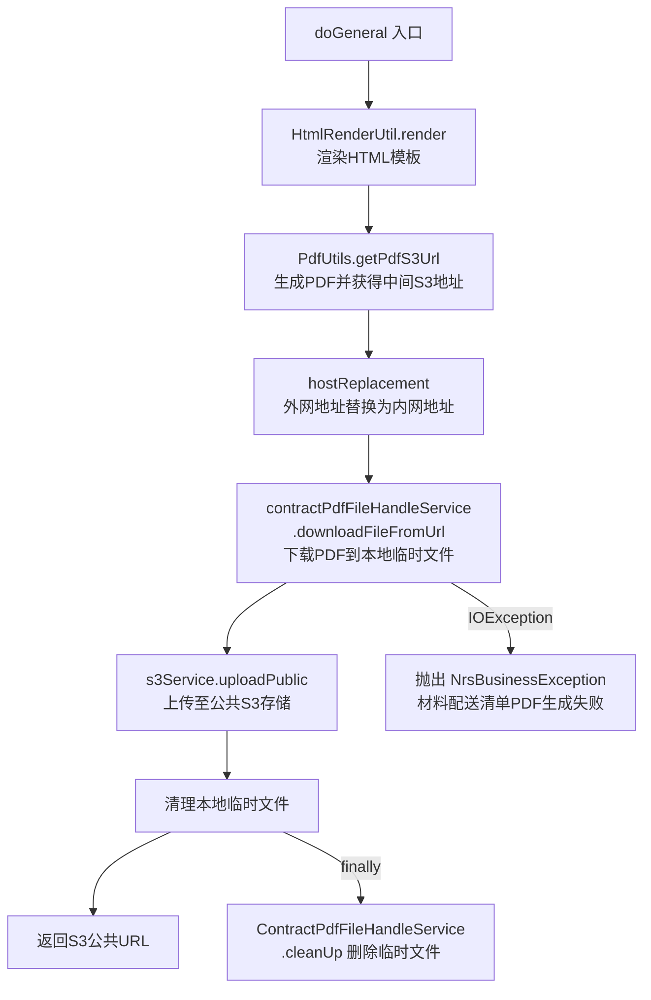
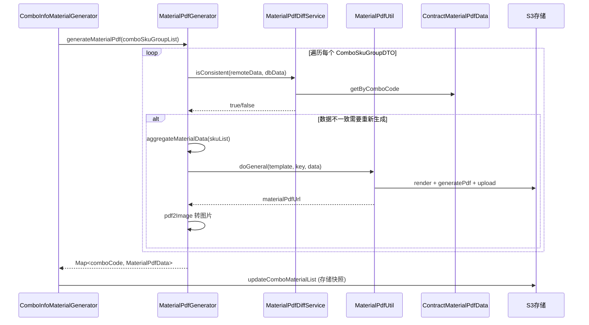
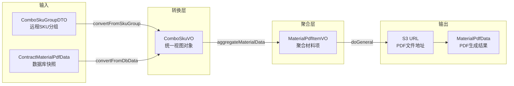

# MaterialPdfUtils 模块文档

## 模块概述

MaterialPdfUtils 模块位于合同系统的材料配送清单（Material Delivery List）PDF 生成子领域中，承担**材料清单 PDF 的数据差异检测**和**PDF 文件生成与上传**两项核心职责。该模块是合同 PDF 生成体系的组成部分，与 [ContractPdfGeneration](ContractPdfGeneration.md) 模块协同工作，专门处理材料配送清单这一特定文档类型的生成流水线。

模块包含两个核心服务类：
- **MaterialPdfDiffService** —— 负责对比远程实时 SKU 数据与数据库快照数据，判断是否需要重新生成 PDF
- **MaterialPdfUtil** —— 负责将 HTML 模板渲染为 PDF 文件并上传至 S3 存储

## 系统定位与模块关系

MaterialPdfUtils 模块处于合同 PDF 生成链路的底层工具层，被上层的 `MaterialPdfGenerator` 和 `ComboInfoMaterialGenerator` 调用。以下是该模块在整体系统中的定位：

## 核心组件详解

### MaterialPdfDiffService —— 数据差异检测服务

#### 职责

判断远程实时查询的套餐 SKU 数据与数据库中已存储的材料 PDF 数据快照是否一致。若一致则无需重新生成 PDF，避免不必要的 PDF 重建开销。

#### 核心方法

| 方法名 | 可见性 | 说明 |
|--------|--------|------|
| `isConsistent(ComboSkuGroupDTO, List<ContractMaterialPdfData>)` | public | 入口方法，判断远程数据与数据库数据是否一致 |
| `convertFromSkuGroup(ComboSkuGroupDTO)` | public | 将远程 SKU 分组数据转换为 `List<ComboSkuVO>`，按 (categoryLevel3Code + brandCode) 去重 |
| `convertFromDbData(List<ContractMaterialPdfData>)` | public | 将数据库存储数据转换为 `List<ComboSkuVO>` |
| `compareMaterialData(List<ComboSkuVO>, List<ComboSkuVO>)` | private | 对比两个转换后的数据列表是否一致 |
| `aggregateMaterialData(List<ComboSkuVO>)` | private | 聚合材料数据：按三级类目分组、过滤"其他"品牌、连接品牌名、排序 |
| `buildMaterialItemCompareKey(MaterialPdfItemVO)` | private | 构建对比唯一键：`categoryLevel3Name|brandNames` |

#### 数据聚合规则

聚合过程是差异检测的核心逻辑，遵循以下规则：

1. 按 `categoryLevel3Code`（三级类目编码）分组
2. 过滤掉品牌名称为 **"其他"** 的 SKU 项
3. 同一组内品牌名称按**字母升序**排序，用 `"/"` 连接
4. 聚合后品牌为空的三级类目**不展示**（跳过）
5. 最终结果按 `categoryLevel3Name` **正序**排序，并从 1 开始重新赋值 `sequenceNumber`

#### 数据一致性对比流程

#### 远程数据去重逻辑

`convertFromSkuGroup` 方法在转换远程数据时，按 `categoryLevel3Code + "#" + brandCode` 作为去重键，使用 `LinkedHashMap` 保持插入顺序，key 冲突时保留第一条记录。

### MaterialPdfUtil —— PDF 生成工具

#### 职责

封装材料配送清单 PDF 的完整生成链路：HTML 模板渲染 → PDF 文件生成 → S3 上传。

#### 核心方法

| 方法名 | 说明 |
|--------|------|
| `doGeneral(String templateFile, String key, Map<String, Object> data)` | PDF 生成主流程：渲染模板 → 生成 PDF → 替换 Host → 下载 → 上传 S3 |
| `hostReplacement(String pdfS3Url)` | 将外网地址 (`file.ljcdn.com`) 替换为内网地址 (`file.media.lianjia.com`)，加速下载 |

#### 依赖注入

| 依赖 | 类型 | 用途 |
|------|------|------|
| `HtmlRenderUtil` | 工具类 | HTML 模板渲染 |
| `PdfUtils` | 工具类 | HTML 转 PDF 并上传至中间存储 |
| `S3Service` | 服务类 | PDF 文件上传至 S3 公共存储 |
| `ContractPdfFileHandleService` | 服务类 | 从 URL 下载 PDF 文件到本地临时路径 |
| `AtomForPdfRpc` | RPC 服务 | 外部 PDF 服务调用（已注入但当前未直接使用） |

#### PDF 生成流程

#### Host 替换策略

PDF 生成服务返回的地址使用外网域名 `https://file.ljcdn.com`，但内网环境需要使用 `http://file.media.lianjia.com` 以获得更快的下载速度。`hostReplacement` 方法通过字符串前缀判断和替换实现此优化。

## 上下游调用链路

### 上游调用方

MaterialPdfUtils 的两个核心服务被以下组件调用：

### 下游服务调用

MaterialPdfUtil.doGeneral 内部的调用链路：

1. **HtmlRenderUtil.render(templateFile, data)** —— 使用模板引擎将数据填充到 HTML 模板中
2. **PdfUtils.getPdfS3Url(html, null, null)** —— 将渲染后的 HTML 转换为 PDF 文件并上传至中间 S3 存储，返回 S3 URL
3. **hostReplacement(pdfS3Url)** —— 替换域名为内网地址
4. **ContractPdfFileHandleService.downloadFileFromUrl(url, tempPath)** —— 下载 PDF 文件到本地临时目录
5. **S3Service.uploadPublic(bytes, key)** —— 将 PDF 字节流上传至公共 S3 存储
6. **ContractPdfFileHandleService.cleanUp(tempPaths)** —— 在 finally 块中清理本地临时文件

## 数据模型

### 输入数据模型

| 模型 | 来源 | 说明 |
|------|------|------|
| `ComboSkuGroupDTO` | 远程 RPC 查询 | 套餐 SKU 分组数据，包含 `comboId` 和 `List<ComboSkuDTO>` |
| `ComboSkuDTO` | 远程 RPC 查询 | 单个 SKU 数据，包含三级类目、品牌等信息 |
| `ContractMaterialPdfData` | 数据库 | 材料 PDF 数据快照，存储了生成 PDF 时的 SKU 数据 |
| `ComboSkuVO` | 内部转换 | 统一的 SKU 视图对象，用于对比 |

### 输出数据模型

| 模型 | 说明 |
|------|------|
| `MaterialPdfItemVO` | 聚合后的材料项，包含 `sequenceNumber`、`categoryLevel3Name`、`brandNames` |
| `MaterialPdfData` | PDF 生成结果，包含 `comboCode`、`materialPdfUrl`、`materialImageUrls`、`materialSkus` |

### 数据流转模型

## 关键设计模式与决策

### 1. 差异检测避免无效生成

系统通过 `MaterialPdfDiffService.isConsistent()` 在生成 PDF 之前检测数据是否变化。只有当远程数据与数据库快照不一致时才触发 PDF 重新生成，这是一种**缓存失效策略**，有效减少了不必要的 PDF 生成开销。

### 2. 快照存储与对比

每次生成 PDF 后，系统将原始 SKU 数据以快照形式存储到 `ContractMaterialPdfData` 表中。下次生成时，将远程实时数据与快照对比。快照存储了去重后的 SKU 列表（categoryLevel3Code、categoryLevel3Name、brandCode、brandName），用于后续的差异比对。

### 3. 内外网 Host 替换

`MaterialPdfUtil` 中采用了 Host 替换策略，将外部 PDF 生成服务返回的外网 URL 替换为内网地址，这是典型的**网络环境适配**模式，确保在服务端内部网络中能高效访问文件资源。

### 4. 临时文件生命周期管理

PDF 生成过程中使用 UUID 生成临时文件名，在 finally 块中通过 `ContractPdfFileHandleService.cleanUp()` 确保临时文件被清理，防止磁盘泄漏。

### 5. 聚合规则的业务语义

材料数据聚合逻辑体现了明确的业务规则：
- **品牌"其他"被过滤**：不在材料清单中展示通用/兜底品牌
- **品牌为空的类目被跳过**：避免展示无意义的空白行
- **品牌按字母排序**：确保生成结果的确定性和一致性
- **唯一键由 categoryLevel3Name + brandNames 构成**：忽略 sequenceNumber 等排序字段，只关注业务内容变化

## 与其他模块的关系

| 关联模块 | 关系类型 | 说明 |
|----------|---------|------|
| [ContractPdfGeneration](ContractPdfGeneration.md) | 协作 | MaterialPdfUtils 为合同 PDF 自生成策略（如 `HouseFormalContractPdfBySelfStrategy`）提供材料清单 PDF |
| [ContractOperations](ContractOperations.md) | 间接依赖 | 合同提交/保存流程触发套餐材料清单的生成 |
| [ContractFieldValidation](ContractFieldValidation.md) | 无直接依赖 | 材料清单 PDF 生成独立于字段校验流程 |

## 配置项

| 配置项 | 来源 | 说明 |
|--------|------|------|
| `noNeedAutoGenerateComboCodes` | Apollo | 配置不需要自动生成材料 PDF 的套餐 code 列表 |
| `materialListPdfGenerationEnabled` | Apollo | 材料清单 PDF 自动生成总开关 |
