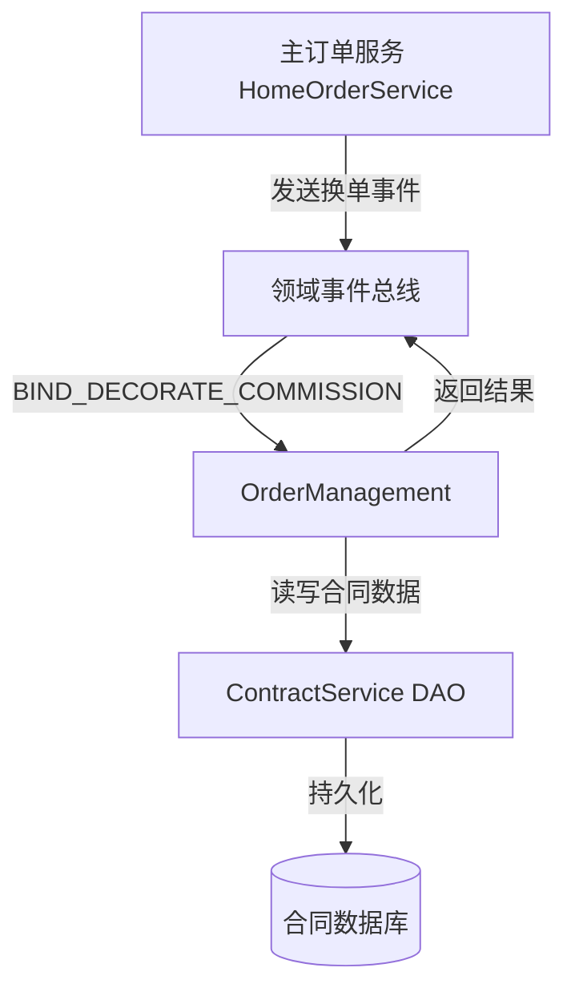
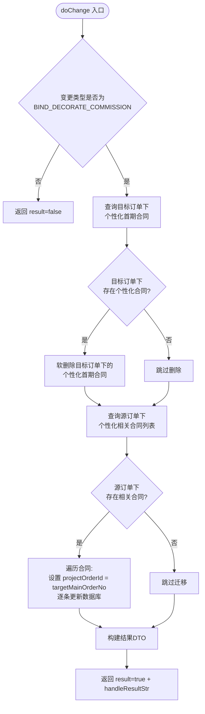
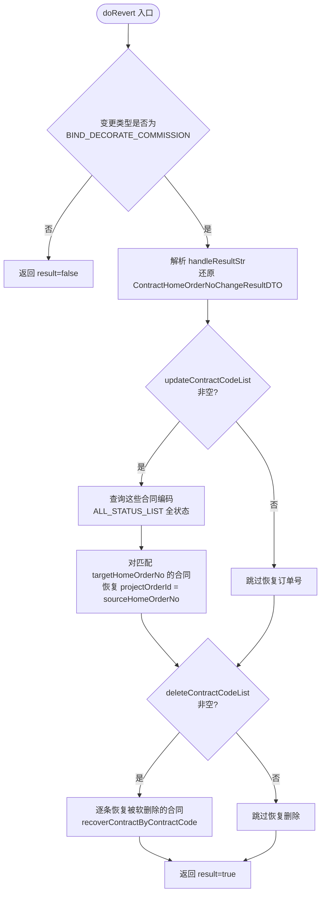
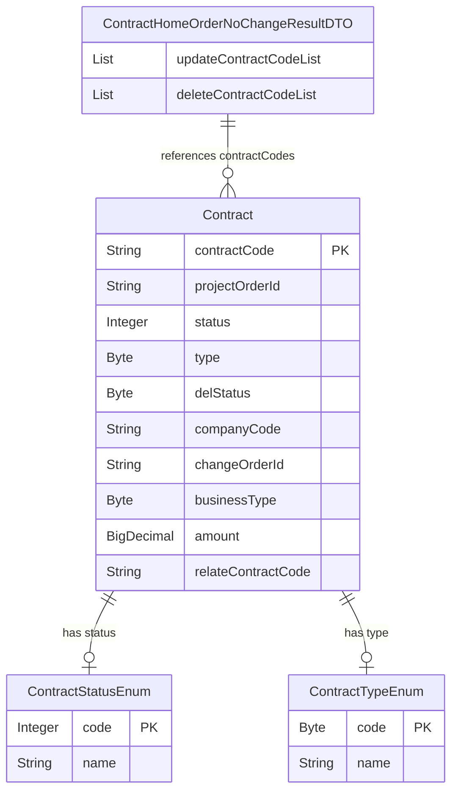
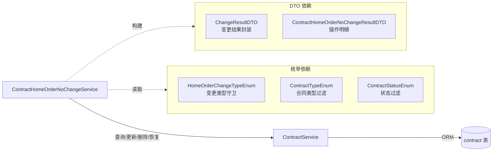
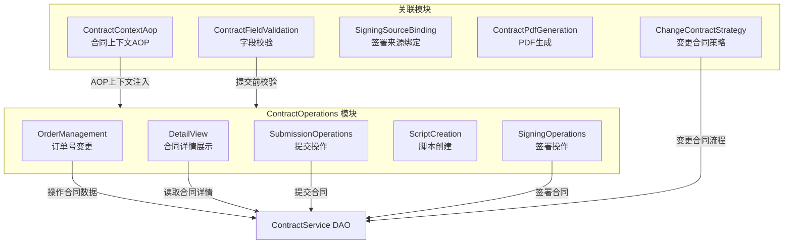

# OrderManagement 模块

## 模块概述

OrderManagement 是 [ContractOperations](ContractOperations.md) 模块的子模块，负责处理合同维度的**主订单号变更（换单）**业务。当系统发生"零售客源绑定整装客源"（`BIND_DECORATE_COMMISSION`）类型的主订单号变更时，本模块协调合同数据的迁移与回滚，确保合同与主订单的绑定关系保持一致。

核心职责：
- **正向换单**：将源主订单下的个性化相关合同迁移到目标主订单，同时作废目标订单下已存在的个性化首期合同
- **回滚换单**：在换单操作失败或需要撤销时，恢复合同的原始绑定关系和被软删除的合同

## 在整体系统中的位置



本模块作为主订单变更事件的**下游消费者**，仅在变更类型为 `BIND_DECORATE_COMMISSION`（changeType=1）时被激活。

## 核心组件详解

### ContractHomeOrderNoChangeService

| 属性 | 说明 |
|------|------|
| 包路径 | `com.ke.utopia.nrs.salesproject.service.contract.v2` |
| Spring 注解 | `@Component` |
| 事务管理 | `@Transactional`（方法级） |
| 核心依赖 | `ContractService`（DAO 层） |

该服务暴露两个核心方法，分别处理正向换单和回滚换单：

| 方法 | 签名 | 说明 |
|------|------|------|
| `doChange` | `ChangeResultDTO doChange(String sourceMainOrderNo, String targetMainOrderNo, Integer changeType)` | 执行正向换单 |
| `doRevert` | `ChangeResultDTO doRevert(String sourceHomeOrderNo, String targetHomeOrderNo, Integer changeType, String changeResultStr)` | 回滚换单操作 |

## 业务流程

### 正向换单流程（doChange）



**详细步骤说明：**

1. **变更类型守卫**：仅处理 `BIND_DECORATE_COMMISSION`（零售客源绑定整装客源，changeType=1），其他类型直接返回失败
2. **作废目标订单下的个性化首期合同**：
   - 查询目标订单（`targetMainOrderNo`）下所有 `PERSONALIZED_CONTRACT` 类型合同
   - 将这些合同的 contractCode 收集后执行软删除（`deleteSoftByContractCodes`）
3. **迁移源订单下的合同**：
   - 查询源订单（`sourceMainOrderNo`）下所有个性化相关合同（`getPersonalizedRelevantContractList()`，包含 11 种个性化首期类型 + 销售合同 PERSONAL）
   - 将每条合同的 `projectOrderId` 从源订单号改为目标订单号，逐条更新
4. **返回操作结果**：将更新和删除的合同编码列表序列化为 JSON 字符串，封装在 `ChangeResultDTO.handleResultStr` 中，供后续回滚使用

### 回滚换单流程（doRevert）



**详细步骤说明：**

1. **变更类型守卫**：同正向流程
2. **解析回滚数据**：从 `changeResultStr`（JSON 字符串）反序列化出 `ContractHomeOrderNoChangeResultDTO`
3. **回滚合同订单号**：
   - 查询被迁移的合同列表（全状态），验证当前 `projectOrderId` 确实等于 `targetHomeOrderNo`
   - 将其 `projectOrderId` 恢复为 `sourceHomeOrderNo`
4. **恢复被软删除的合同**：逐条调用 `recoverContractByContractCode` 恢复在正向流程中被作废的个性化首期合同

## 数据模型

### 核心实体关系



### 涉及的合同类型

`doChange` 操作涉及以下合同类型（通过 `ContractTypeEnum.getPersonalizedRelevantContractList()` 获取）：

| 合同类型枚举 | 编码 | 说明 |
|-------------|------|------|
| PERSONAL | 8 | 销售合同 |
| CARPENTER_ADVANCE | 9 | 木工首期 |
| MATERIAL_ADVANCE | 10 | 材料首期 |
| HOUSEHOLD_APPLIANCES_ADVANCE | 13 | 家电首期 |
| HOME_ADVANCE | 14 | 家居家装首期 |
| CUSTOMIZED_ADVANCE | 15 | 定制首期 |
| SOFT_FURNISHINGS_ADVANCE | 16 | 软装首期 |
| DOORS_WINDOWS_ADVANCE | 17 | 门窗首期 |
| DOORS_WINDOWS_HEATING_ADVANCE | 21 | 门窗暖首期 |
| K3_ADVANCE | 25 | K3 首期 |
| K5_ADVANCE | 26 | K5 首期 |
| K7_ADVANCE | 27 | K7 首期 |

### 涉及的合同状态

回滚操作（`doRevert`）使用 `ContractStatusEnum.ALL_STATUS_LIST` 查询合同，覆盖所有 11 种状态：

| 状态 | 编码 | 说明 |
|------|------|------|
| DRAFT | 1 | 起草中 |
| PENDING_USER_CONFIRM | 2 | 待确认 |
| USER_CONFIRMED | 3 | 已确认 |
| PENDING_USER_SIGN | 4 | 待签署 |
| PENDING_SUBMIT_AUDIT | 5 | 待提交审核 |
| AUDITING | 6 | 审核中 |
| PENDING_COMPANY_SIGN | 7 | 待盖公司章 |
| FINISH | 8 | 已签署 |
| CANCEL | 9 | 已取消 |
| AUDIT_REJECT | 10 | 已驳回 |
| PENDING_THIRD_PARTY_SEAL | 11 | 待盖第三方章 |

## 依赖关系

### 依赖的外部服务



### ContractService 方法使用映射

| ContractService 方法 | 调用位置 | 用途 |
|---------------------|---------|------|
| `getContractList(orderNo, ContractTypeEnum)` | `doChange` | 查询目标订单下的个性化首期合同 |
| `getContractList(orderNo, List<ContractTypeEnum>)` | `doChange` | 查询源订单下的个性化相关合同 |
| `deleteSoftByContractCodes(List)` | `doChange` | 软删除目标订单下的冲突合同 |
| `update(Contract)` | `doChange` / `doRevert` | 更新合同的 `projectOrderId` |
| `getListByContractCodesAndStatus(List, List)` | `doRevert` | 按编码和状态查询需回滚的合同 |
| `recoverContractByContractCode(code)` | `doRevert` | 恢复被软删除的合同 |

### 被依赖关系

本模块被**主订单服务**通过领域事件机制调用，作为 `BIND_DECORATE_COMMISSION` 变更类型的合同处理处理器。返回的 `ChangeResultDTO`（包含 `serviceId` 和 `handleResultStr`）供主订单服务在需要回滚时传回。

## 与相关模块的关系



本模块与其他 ContractOperations 子模块的关系：
- **独立运作**：OrderManagement 的换单逻辑不依赖其他子模块的输出
- **共享基础设施**：通过 `ContractService` DAO 层共享数据访问能力
- **职责边界清晰**：本模块仅处理主订单号维度的变更，不涉及合同内容变更（由 [ChangeContractStrategy](ChangeContractStrategy.md) 处理）、合同签署（由 [SigningOperations](SigningOperations.md) 处理）等其他业务

## 关键设计决策

### 事务策略

`doChange` 和 `doRevert` 均使用 `@Transactional` 注解，保证每步操作的原子性：
- 正向流程中，"作废目标订单合同"和"迁移源订单合同"在同一事务内，任一失败整体回滚
- 回滚流程中，"恢复订单号"和"恢复软删合同"在同一事务内

### 变更类型守卫

两个方法入口均通过 `HomeOrderChangeTypeEnum.BIND_DECORATE_COMMISSION` 进行守卫，明确限定本服务仅处理"零售客源绑定整装客源"场景。其他变更类型（如翻新切换整装、整装切换局装等）由系统中其他处理器负责。

### 操作结果可回滚设计

`doChange` 方法将操作明细（更新和删除的合同编码列表）序列化为 JSON 字符串返回给调用方。当需要回滚时，调用方将此字符串传给 `doRevert`，实现了基于**操作快照**的回滚机制，避免回滚时需要重新计算影响范围。

### 软删除策略

对目标订单下冲突的个性化首期合同采用**软删除**（设置 `delStatus`），而非物理删除。这保证了：
- 数据可恢复性：回滚时通过 `recoverContractByContractCode` 可完整恢复
- 审计追溯性：软删除记录保留在数据库中，便于问题排查

## 包结构

```
com.ke.utopia.nrs.salesproject.service.contract.v2/
├── ContractHomeOrderNoChangeService.java   ← 本模块核心服务
└── ... (其他 ContractOperations 子模块的服务类)
```
