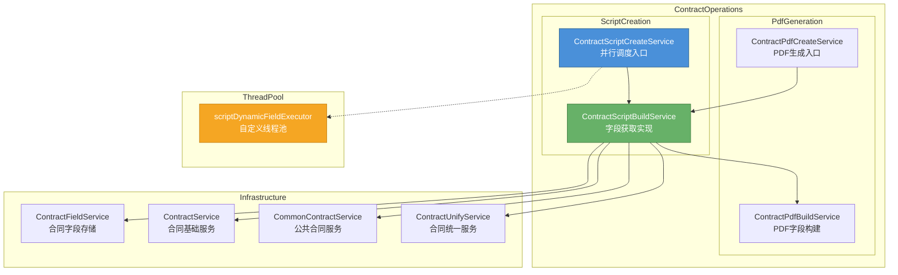
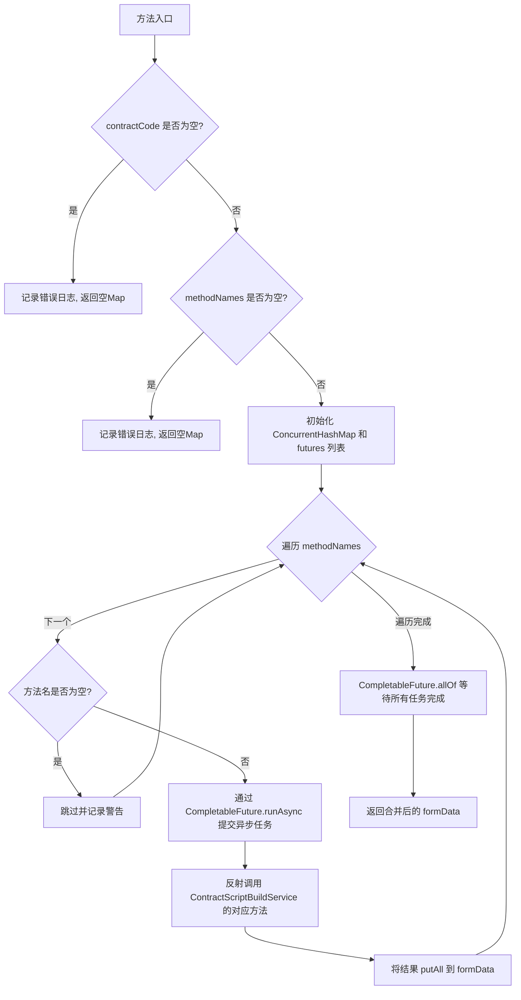
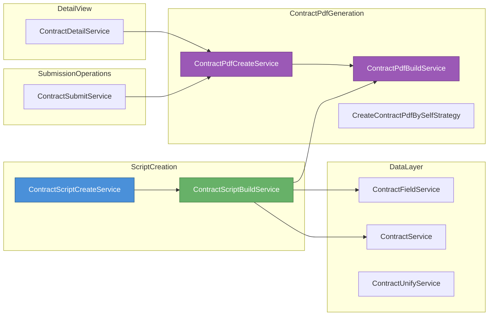
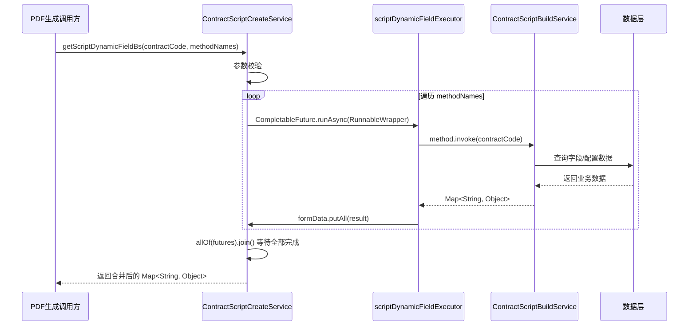
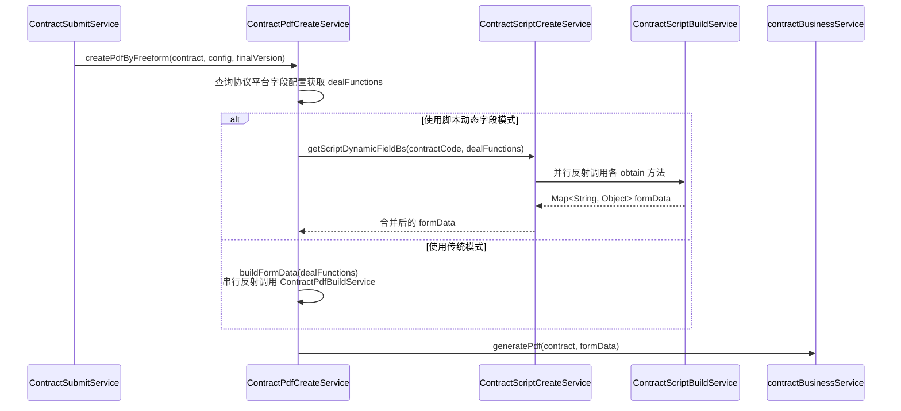
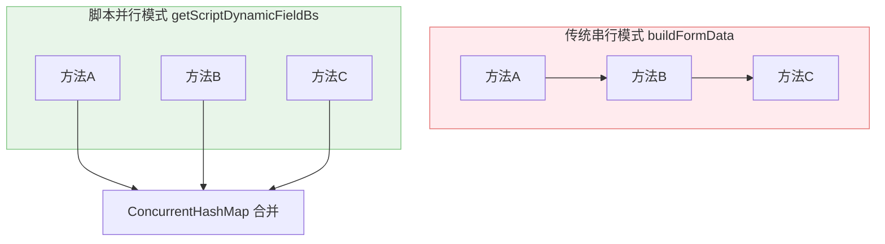
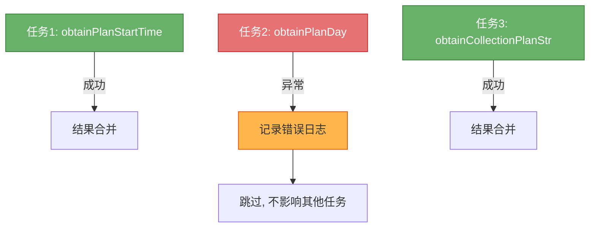

# ScriptCreation —— 合同讲解脚本动态字段生成模块

## 1. 模块概述

ScriptCreation 模块是合同操作子系统（ContractOperations）的核心子模块之一，负责在合同 PDF 生成流程中**并行获取脚本讲解所需的动态字段数据**。该模块服务于"合同讲解脚本"场景——当系统需要生成合同 PDF 时，许多脚本字段（如计划开工日期、工期、保修年限、收款计划等）并非静态配置，而是需要从合同数据库、业务配置等多处动态查询并汇总。

模块采用**反射 + 并行异步**的模式，将一组方法名映射到实际的数据查询方法，并通过 `CompletableFuture` 并发执行，显著提升了多字段查询的吞吐效率。

### 核心职责

- 接收合同编号和一组方法名集合，批量获取脚本动态字段
- 使用自定义线程池实现并行查询，避免阻塞主流程
- 通过反射机制解耦调用方与具体字段获取逻辑
- 将所有查询结果合并为统一的 `Map<String, Object>` 返回

---

## 2. 架构总览

---

## 3. 核心组件详解

### 3.1 ContractScriptCreateService

| 属性 | 说明 |
|------|------|
| **文件** | `ContractScriptCreateService.java` |
| **职责** | 动态字段并行获取的调度入口 |
| **注入依赖** | `ContractScriptBuildService`、`scriptDynamicFieldExecutor` |

该组件是模块的唯一公开入口，提供一个核心方法：

#### `getScriptDynamicFieldBs(String contractCode, Set<String> methodNames)`

**设计要点：**

1. **反射调度**：通过 `Class.getMethod(methodName, String.class)` 动态查找方法，每个方法签名约定为 `(String contractCode) -> Map<String, Object>`，实现调用方与具体字段逻辑的解耦
2. **并行执行**：使用 `CompletableFuture.runAsync` 提交到自定义线程池 `scriptDynamicFieldExecutor`，通过 SkyWalking 的 `RunnableWrapper` 保证链路追踪上下文传递
3. **线程安全**：结果存储使用 `ConcurrentHashMap`，`putAll` 操作在 key 不冲突的前提下是安全的（`Set` 去重保证同一方法只调用一次）
4. **容错设计**：区分 `NoSuchMethodException`（方法不存在）、`InvocationTargetException`（方法内部异常）和通用 `Exception`，分别记录不同级别的日志但不会中断其他并行任务
5. **阻塞等待**：通过 `CompletableFuture.allOf().join()` 等待所有任务完成后返回，确保调用方拿到完整数据

### 3.2 ContractScriptBuildService

| 属性 | 说明 |
|------|------|
| **文件** | `ContractScriptBuildService.java` |
| **职责** | 合同讲解脚本字段的实际获取实现 |
| **注入依赖** | `ContractFieldService`、`ContractService`、`ContractPdfBuildService`、`CommonContractService`、`ContractUnifyService` |

该组件包含一组以 `obtain` 前缀命名的方法，每个方法负责获取一个特定的脚本动态字段。所有方法签名统一为 `(String contractCode) -> Map<String, Object>`。

#### 方法清单

| 方法名 | 功能 | 数据来源 |
|--------|------|----------|
| `obtainPlanStartTime` | 获取计划开工日期 | `ContractFieldService` 查询合同字段表 |
| `obtainPlanDay` | 获取工期（总天数） | `ContractFieldService` 查询合同字段表 |
| `obtainWaterElectricGuaranteeYear` | 获取水电管道保修期 | `ContractPdfBuildService` 业务配置 |
| `obtainWaterProofGuaranteeYear` | 获取防水保修期 | `ContractPdfBuildService` 业务配置 |
| `obtainOtherGuaranteeYear` | 获取其他保质期 | `ContractPdfBuildService` 业务配置 |
| `obtainCollectionPlanStr` | 获取收款计划 | `CommonContractService` 公共服务 |

> **重要约束**：注释明确标注"无引用方法不可删除"——这些方法虽然在 Java 代码中没有直接调用，但通过反射机制在运行时被动态调用，删除将导致脚本字段获取失败。

---

## 4. 模块间依赖关系

**依赖说明：**

- **上游调用方**：`ContractPdfCreateService` 在构建 PDF 表单数据时（`buildFormData` 方法），以及提交流程 `ContractSubmitService` 中的 `parallelGreatPdf` 会调用脚本字段获取
- **同层依赖**：`ContractScriptBuildService` 复用了 `ContractPdfBuildService` 中的业务配置查询方法（如保修期相关），避免重复实现
- **下游数据源**：依赖 `ContractFieldService` 查询合同字段表、`ContractService` 获取合同基本信息

---

## 5. 数据流

### 5.1 脚本动态字段获取流程

### 5.2 与 PDF 生成流程的协作

> **两种模式对比**：`ContractPdfCreateService.buildFormData` 是传统的**串行反射**模式，逐个调用 `ContractPdfBuildService` 的无参方法；而 `ContractScriptCreateService.getScriptDynamicFieldBs` 是**并行反射**模式，调用 `ContractScriptBuildService` 的带参方法。后者是前者的性能优化版本。

---

## 6. 关键设计模式

### 6.1 反射 + 配置驱动的策略模式

系统通过数据库配置每个脚本字段对应的获取方法名，运行时通过反射动态调用。这种设计的优势：
- **新增字段无需改代码**：只需在 `ContractScriptBuildService` 中添加新的 `obtain` 方法，并在数据库中配置方法名
- **解耦配置与实现**：调用方不感知具体有哪些字段及如何获取

### 6.2 并行任务编排

通过 `CompletableFuture.allOf` + 自定义线程池，多个字段查询并发执行，总耗时取决于最慢的单个查询而非所有查询之和。SkyWalking `RunnableWrapper` 确保分布式链路追踪上下文在线程间正确传递。

### 6.3 容错隔离

每个并行任务独立 try-catch，单个方法的异常不会影响其他字段的获取：

---

## 7. 关联模块参考

| 模块 | 说明 | 文档链接 |
|------|------|----------|
| **ContractPdfGeneration** | PDF 生成策略体系，包含自生成和协议平台两种模式 | [ContractPdfGeneration](ContractPdfGeneration.md) |
| **MaterialPdfUtils** | 材料清单 PDF 工具，脚本字段中材料数据的来源之一 | [MaterialPdfUtils](MaterialPdfUtils.md) |
| **ContractFieldValidation** | 合同字段校验，确保脚本字段数据完整性 | [ContractFieldValidation](ContractFieldValidation.md) |
| **DetailView** | 合同详情展示，部分脚本字段在详情页也会使用 | [DetailView](DetailView.md) |
| **SubmissionOperations** | 合同提交流程，PDF 生成的上层触发方 | [SubmissionOperations](SubmissionOperations.md) |
