# SigningOperations 模块文档

## 1. 模块概述

SigningOperations 是合同运营子系统（ContractOperations）中的签约操作模块，负责**对公签约授权协议管理**和**自主盖章**两大核心业务。该模块位于合同签署流程的中后段——在合同草稿创建和提交之后，处理与企业法人授权认证、授权协议生成与关联、电子印章加盖等签约环节。

模块包含两个核心 Service：

| 组件 | 职责 |
|------|------|
| `ContractCompanySignService` | 对公签约全流程：授权协议生成、复用判断、授权列表查询、短信通知 |
| `ContractSelfSealService` | 自主盖章全流程：盖章主体配置、文件上传校验、异步 PDF 生成与盖章、盖章任务管理 |

---

## 2. 架构总览

```mermaid
graph TD
    subgraph ContractOperations[ContractOperations 合同运营]
        DetailView[DetailView 合同详情视图]
        SigningOps[SigningOperations 签约操作]
        SubmissionOps[SubmissionOperations 提交操作]
        ScriptCreation[ScriptCreation 脚本创建]
        OrderMgmt[OrderManagement 订单管理]
    end

    subgraph SigningOps[SigningOperations 签约操作]
        CompanySign[ContractCompanySignService 对公签约]
        SelfSeal[ContractSelfSealService 自主盖章]
    end

    subgraph Dependencies[依赖模块]
        ContractContext[ContractContextAop 上下文管理]
        ButtonConfig[ContractButtonConfigService 按钮配置]
        PdfGen[ContractPdfGeneration PDF生成]
        FieldCheck[ContractFieldValidation 字段校验]
        ChangeStrategy[ChangeContractStrategy 变更策略]
        SigningSource[SigningSourceBinding 签约来源绑定]
    end

    CompanySign --> ButtonConfig
    CompanySign --> SubmissionOps
    CompanySign --> DetailView
    SelfSeal --> PdfGen
    SelfSeal --> FieldCheck

    CompanySign -.-> ContractContext
    SelfSeal -.-> ContractContext

    subgraph External[外部服务]
        FreeformService[FreeformService 协议平台]
        PayServiceRpc[PayServiceRpc 支付服务]
        S3Service[S3Service 文件存储]
        PdfToImage[PdfToImageService PDF转图片]
        ApolloConfig[ApolloConfigService 配置中心]
    end

    CompanySign --> PayServiceRpc
    CompanySign --> ApolloConfig
    SelfSeal --> FreeformService
    SelfSeal --> S3Service
    SelfSeal --> PdfToImage
```

---

## 3. 核心组件详解

### 3.1 ContractCompanySignService（对公签约服务）

#### 3.1.1 职责定位

该服务处理**对公签约（B2B）场景**下的授权协议书管理。当企业客户进行线上签约时，需要先由法人完成企业实名认证并授权给具体签约人，授权协议书是这一流程的凭证载体。

#### 3.1.2 核心方法与业务流程

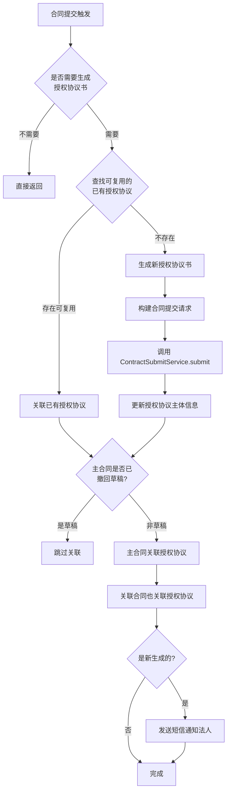

#### 3.1.3 授权协议复用判断逻辑（getExistCanRelatedAcreditContract）

系统采用**三级匹配策略**判断是否可以复用已有授权协议，避免为同一项目下相同法人/代理人重复生成：

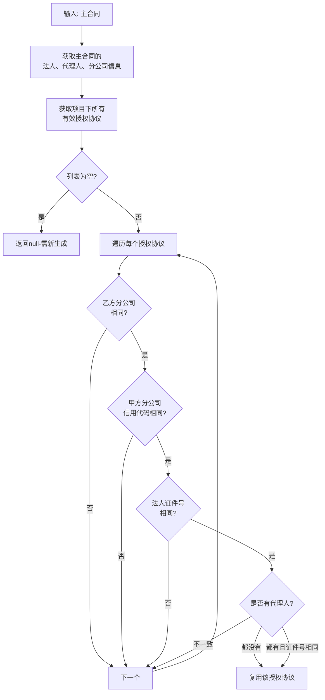

#### 3.1.4 需要生成授权协议的条件（needGenerateAccreditContract）

| 条件 | 说明 |
|------|------|
| 签约渠道为线上 | `SignChannelTypeEnum.ONLINE` |
| 合同类型属于需授权类型 | 正签、个性化、首期款、变更、设计、设计变更合同 |
| 非协同发起 | 不存在 `ContractRelation` 关联 |
| 签约主体为企业 | `ContractObjectTypeEnum.COMPANY` |
| 有协议变更 | 包装变更时 `platformInstanceId != 0` |

#### 3.1.5 授权列表查询

提供两套授权列表查询接口：

| 方法 | 用途 | 可见性控制 |
|------|------|-----------|
| `getContractAuthList`（已废弃） | PC 端授权列表 | 基于登录手机号匹配法人才可见 |
| `getAccreditContractList` | C 端授权列表 | 基于登录人作为签署人的授权协议 |

#### 3.1.6 短信通知流程

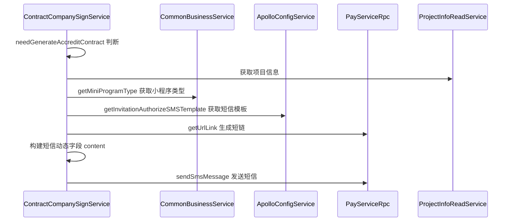

短信发送的**排除规则**：
- 施工套餐合同（DRAWING）单独发送
- 个性化合同中，非变更发起且非多报价单的不发送

---

### 3.2 ContractSelfSealService（自主盖章服务）

#### 3.2.1 职责定位

该服务处理**内部员工自主盖章**场景——允许具有权限的操作员上传 PDF 或图片文件，由系统自动套用公司电子印章模板生成盖章后的合同 PDF。

#### 3.2.2 核心流程

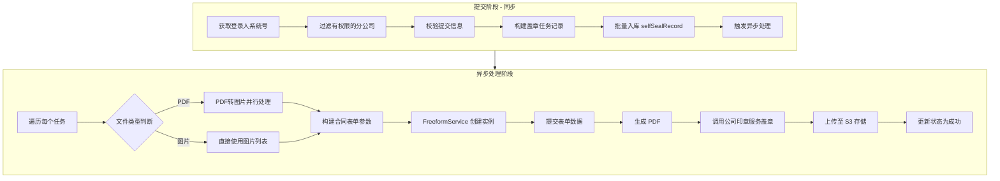

#### 3.2.3 盖章任务状态流转

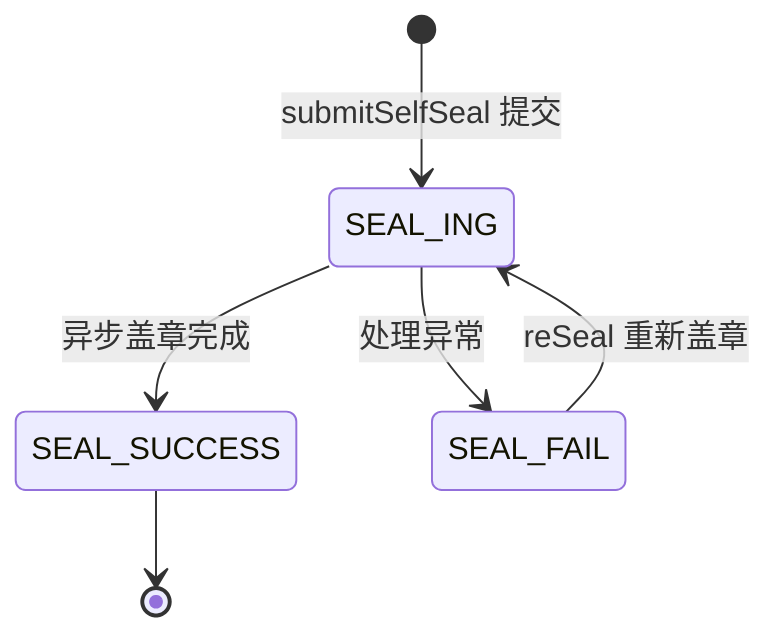

#### 3.2.4 文件类型处理

| 文件类型 | 处理方式 | 结果 |
|---------|---------|------|
| PDF（`FileTypeEnum.PDF`） | 调用 `pdfToImageService.pdf2ImagePublicParallel` 并行转为图片 | 每个 PDF 文件生成一条记录 |
| 图片（`FileTypeEnum.IMAGE`） | 多张图片 URL 逗号拼接 | 合并为一条记录，生成随机文件名 |

#### 3.2.5 盖章主体权限控制

权限通过 Apollo 配置中心管理，配置项 `selfSealCompanyInfoConfig` 定义了：
- 每个分公司支持的系统号列表（`systemCodes`）
- 每个分公司的印章编码（`sealCode`）

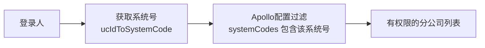

---

## 4. 模块依赖关系

### 4.1 内部模块依赖

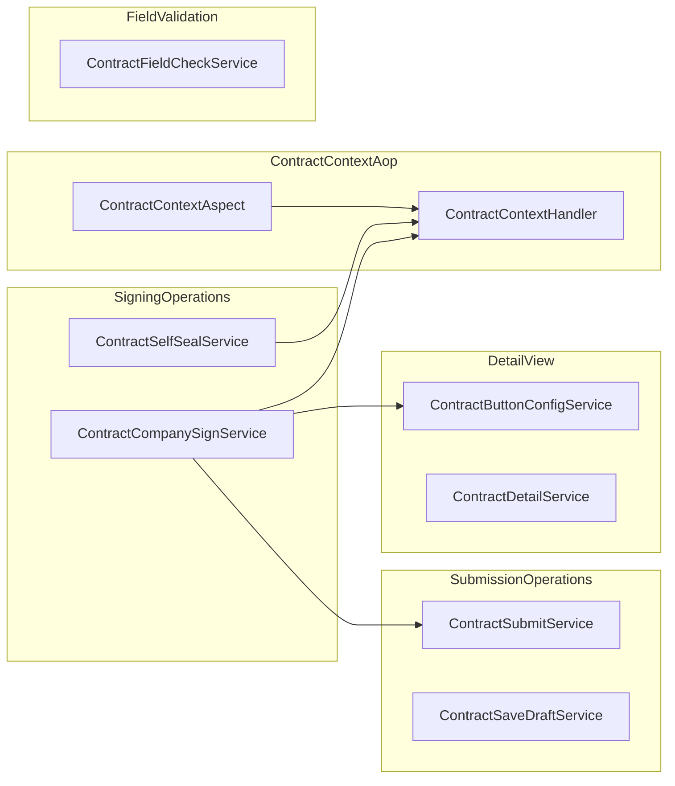

### 4.2 核心依赖说明

| 依赖组件 | 作用 | 被谁使用 |
|---------|------|---------|
| `ContractButtonConfigService` | 根据合同状态、类型、用户角色动态配置按钮列表（查看、签署、授权等） | CompanySign：授权列表按钮生成 |
| `ContractSubmitService` | 通用合同提交服务，负责合同数据持久化、PDF 生成触发、节点状态更新 | CompanySign：授权协议书提交 |
| `ContractContextHandler` | ThreadLocal 上下文管理，存储项目信息、报价数据、操作人信息 | 两者均用于获取当前操作上下文 |
| `SelfSealRecordService` | 自主盖章记录的数据库操作 | SelfSeal：任务 CRUD |

### 4.3 外部服务依赖

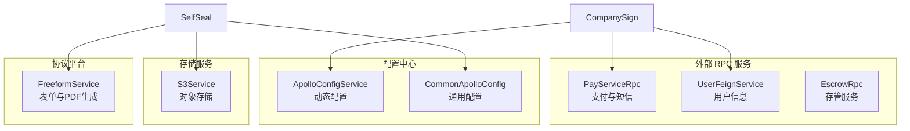

---

## 5. 数据流

### 5.1 对公签约授权协议数据流

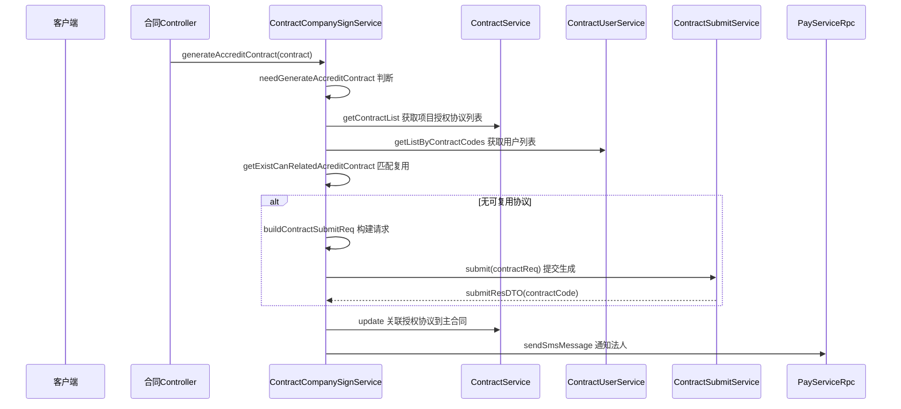

### 5.2 自主盖章数据流

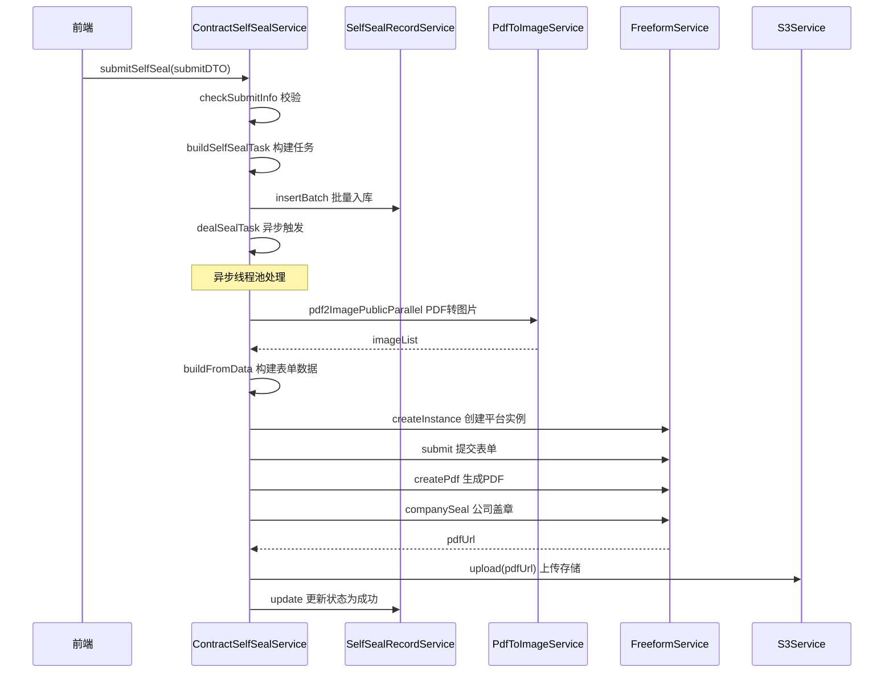

---

## 6. 关键设计模式

### 6.1 策略模式（按钮配置驱动）

`ContractButtonConfigService` 使用策略模式，通过 Aviator 表达式引擎动态计算按钮可见性。对公签约场景中，授权列表按钮根据合同状态和用户角色动态生成：

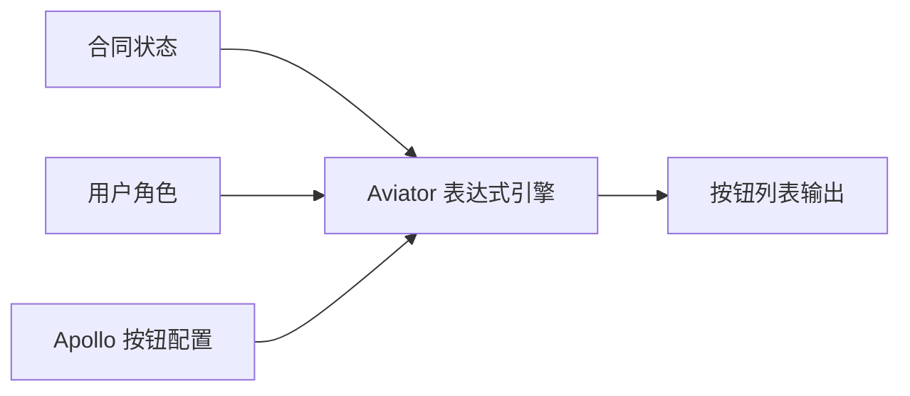

按钮类型包括：
- `VIEW`：查看已完成的授权协议
- `AUTH`：去认证授权（未完成状态）

### 6.2 异步并行模式（自主盖章）

自主盖章采用 `CompletableFuture.runAsync` + SkyWalking `RunnableWrapper` 实现异步任务处理：

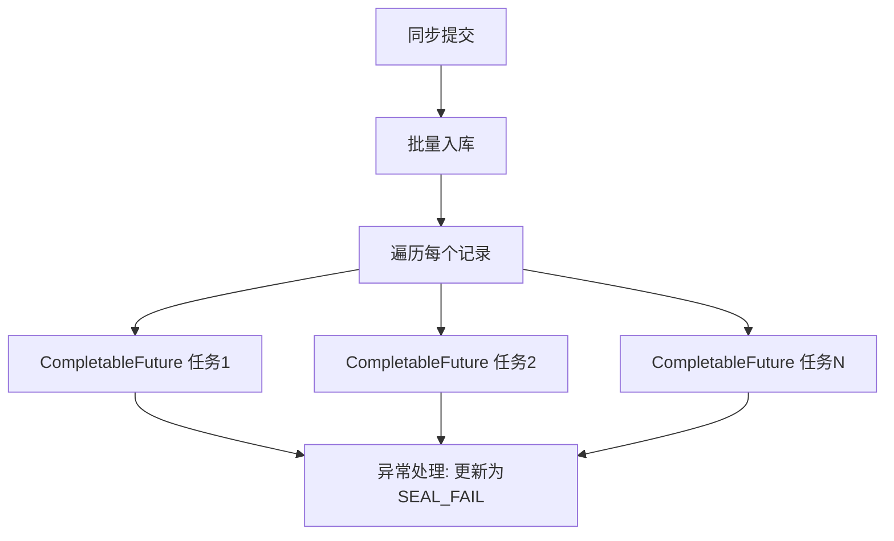

- 每个盖章任务独立异步执行，互不影响
- 失败任务记录为 `SEAL_FAIL`，支持通过 `reSeal` 重试
- PDF 转图片阶段也采用并行处理（`pdf2ImagePublicParallel`）

### 6.3 上下文传播模式（ContractContextAop）

签约模块通过 AOP 切面 + ThreadLocal 实现请求级别的上下文传播：

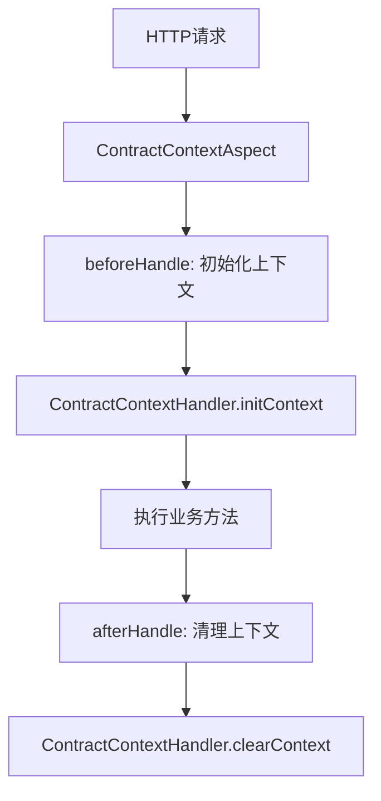

上下文中存储的关键数据：
- `ProjectInfoDTO`：项目基础信息
- `PlanAllDTO`：报价方案数据
- `ContractSourceDataBO`：个性化签约来源数据
- `ContractCityCompanyInfo`：分公司配置信息

### 6.4 权限过滤模式（自主盖章）

权限控制采用「系统号 + 分公司」双重匹配模式：

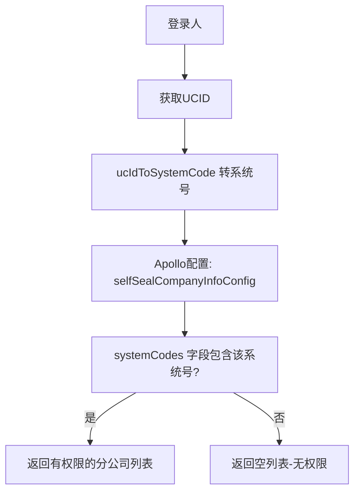

---

## 7. 与其他模块的关系

| 相关模块 | 关系说明 |
|---------|---------|
| [DetailView](DetailView.md) | `ContractCompanySignService` 依赖 `ContractButtonConfigService` 生成授权列表和详情页的按钮配置 |
| [SubmissionOperations](SubmissionOperations.md) | `ContractCompanySignService` 调用 `ContractSubmitService.submit()` 生成授权协议书；`ContractEscrowService` 也复用了相同的提交流程 |
| [ContractContextAop](ContractContextAop.md) | 两者均通过 `ContractContextHandler` 访问请求级别的上下文数据 |
| [ContractFieldValidation](ContractFieldValidation.md) | 自主盖章后的合同字段校验依赖此模块 |
| [ContractPdfGeneration](ContractPdfGeneration.md) | 自主盖章的 PDF 生成策略通过 `FreeformService` 实现，与 PDF 自生成策略为互补关系 |
| [SigningSourceBinding](SigningSourceBinding.md) | 个性化合同的签约来源数据构建（账单/子单/变更单）影响授权协议中的主体信息 |

---

## 8. 关键枚举值参考

| 枚举 | 含义 |
|------|------|
| `ContractTypeEnum.ACCREDIT` | 授权协议类型 |
| `ContractStatusEnum.DRAFT / PENDING_USER_SIGN / FINISH` | 草稿 / 待用户签署 / 签署完成 |
| `SignChannelTypeEnum.ONLINE` | 线上签约渠道 |
| `ContractObjectTypeEnum.COMPANY` | 企业签约主体 |
| `RoleTypeEnum.LEGAL / COMPANY_AGENT` | 法人 / 企业代理人 |
| `SelfSealStatusEnum.SEAL_ING / SEAL_SUCCESS / SEAL_FAIL` | 盖章中 / 成功 / 失败 |
| `FileTypeEnum.PDF / IMAGE` | PDF 文件 / 图片文件 |
| `ContractButtonEnum.VIEW / AUTH` | 查看按钮 / 授权按钮 |
