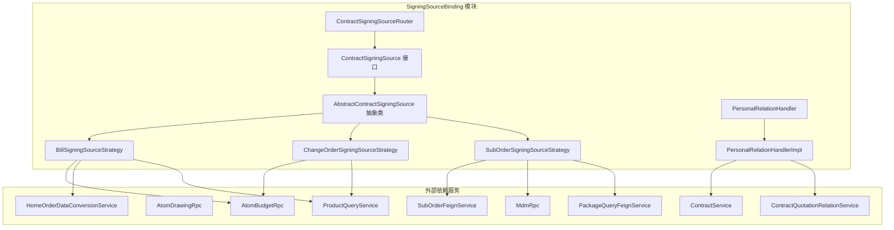
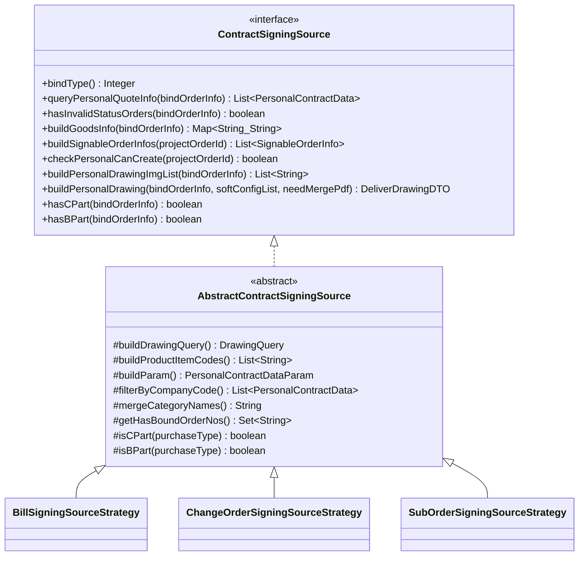
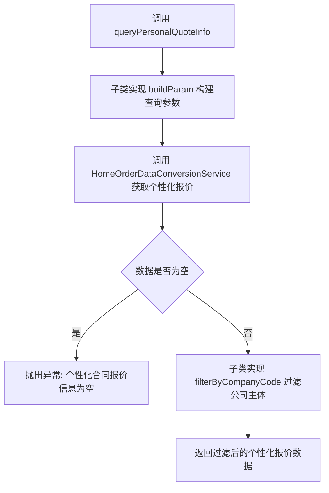
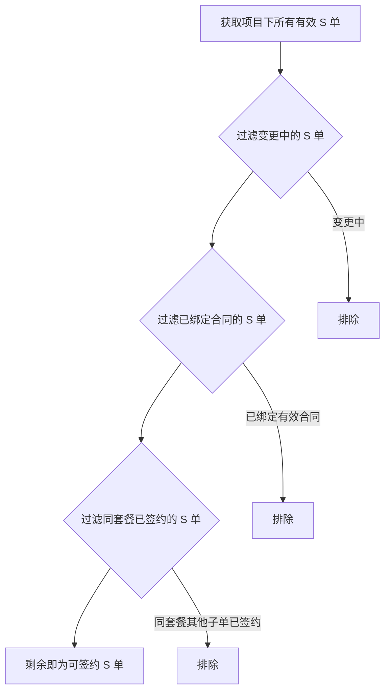
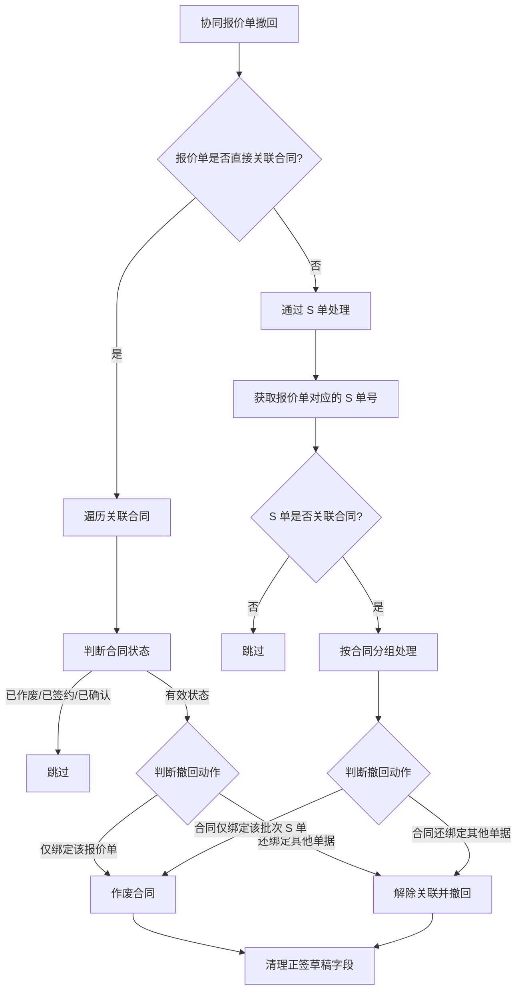
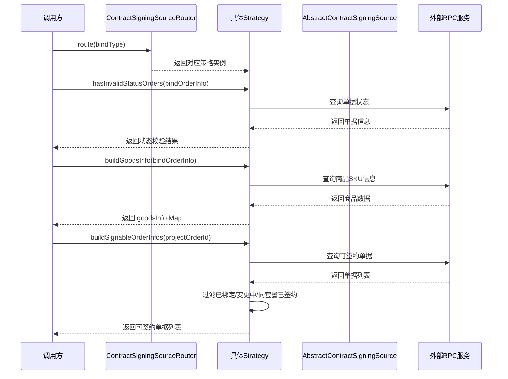
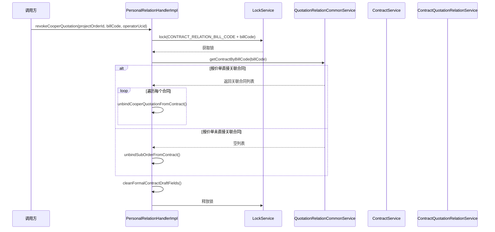
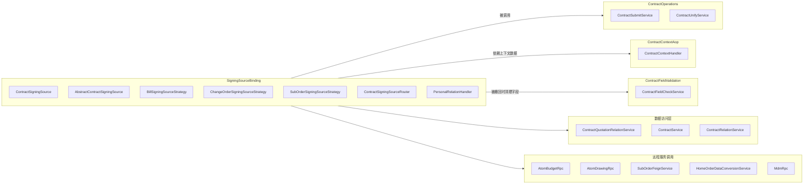

# SigningSourceBinding — 签约数据源绑定模块

## 模块概述

SigningSourceBinding 模块负责**销售合同签约过程中，不同类型的业务单据（报价单、变更单、S单）与合同之间的绑定关系管理**。该模块通过策略模式，针对不同绑定类型（`BindType`）封装了各自的数据查询、状态校验、商品信息构建、图纸构建等逻辑，为合同签约流程提供统一的数据源抽象。

核心设计思想：将"签约数据源"抽象为统一接口 `ContractSigningSource`，由具体策略实现对不同单据类型的差异化处理，通过路由器 `ContractSigningSourceRouter` 根据 `bindType` 动态分发到对应策略。

## 架构总览



## 核心组件详解

### 1. ContractSigningSource — 签约数据源接口

定义了所有签约数据源必须实现的契约方法，是本模块的核心抽象。



**接口方法说明：**

| 方法 | 职责 |
|------|------|
| `bindType()` | 返回该策略处理的绑定类型标识（报价单/变更单/S单） |
| `queryPersonalQuoteInfo()` | 从主订单获取个性化报价信息 |
| `hasInvalidStatusOrders()` | 校验单据是否处于不可签约的无效状态 |
| `buildGoodsInfo()` | 根据单据构建商品类目信息（goodsInfo），用于合同展示 |
| `buildSignableOrderInfos()` | 构建可签约的单据列表，供前端弹窗选择 |
| `checkPersonalCanCreate()` | 发起合同前校验是否存在可签约单据 |
| `buildPersonalDrawingImgList()` | 构建个性化图纸图片列表 |
| `buildPersonalDrawing()` | 构建个性化图纸详情（含交付图纸） |
| `hasCPart()` / `hasBPart()` | 判断是否包含 C 部分（客户承担）或 B 部分（开发商承担）的商品 |

### 2. AbstractContractSigningSource — 抽象基类

提供了 `ContractSigningSource` 中多个方法的模板实现，子类只需关注差异化的抽象方法：

- **`buildParam()`** — 构建查询个性化报价的参数
- **`buildProductItemCodes()`** — 从单据获取商品行唯一键列表
- **`buildDrawingQuery()`** — 构造图纸查询参数
- **`filterByCompanyCode()`** — 按公司主体过滤个性化报价数据（报价单/变更单需按主体过滤，S单无需过滤）

**模板方法模式（`queryPersonalQuoteInfo` 流程）：**



### 3. 三种签约数据源策略

#### 3.1 BillSigningSourceStrategy — 报价单策略

**绑定类型：** `BindTypeEnum.BILL_CODE`

处理基于**报价单（billCode）**的合同签约数据源。适用于个性化报价单与合同的绑定场景。

**关键实现：**

| 功能 | 实现要点 |
|------|---------|
| 状态校验 | 通过 `AtomBudgetRpc.queryBillsByCondition` 查询报价单，校验状态不在"调整中/已删除/已作废" |
| 商品信息 | 根据报价单号获取 SKU 商品集合，提取 `skuCategoryName` 合并为 goodsInfo |
| 可签约单据 | 仅在整装全案（REFORM_ALL）或房本业务（HOUSE_CERTIFICATE）下，从正签报价中获取个性化数据构建可签约列表 |
| 图纸构建 | 使用 `projectOrderId` + `productItemCodes` 构建图纸查询参数 |
| B/C 部分判断 | 通过 `QuotationProductDTO.getPurchaseType()` 判断 |

**外部依赖：**
- `AtomBudgetRpc` — 查询报价单信息
- `HomeOrderDataConversionService` — 获取正签报价数据
- `ProductQueryService` — 获取报价商品 SKU 信息
- `CommonBusinessService` — 获取业务类型

#### 3.2 ChangeOrderSigningSourceStrategy — 变更单策略

**绑定类型：** `BindTypeEnum.CHANGE_ORDER`

处理基于**变更单（changeOrderId）**的合同签约数据源。适用于变更合同场景下变更单与合同的绑定。

**关键实现：**

| 功能 | 实现要点 |
|------|---------|
| 状态校验 | 通过 `AtomBudgetRpc.getChangeApplyDetails` 查询变更申请详情，仅允许"待签约/已完成"状态 |
| 商品信息 | 根据变更单号获取变更报价商品 SKU，提取类目名称合并 |
| 可签约单据 | 返回空列表（变更单不支持单独发起可签约弹窗） |
| 图纸构建 | 使用 `projectOrderId` + `projectChangeNo` + 临时图纸状态构建查询参数 |

**与报价单策略的差异：** 变更单图纸查询额外携带 `projectChangeNo` 和 `drawingStatus=TEMP`（临时图纸状态）。

#### 3.3 SubOrderSigningSourceStrategy — S单策略

**绑定类型：** `BindTypeEnum.SUB_ORDER`

处理基于**S单（subOrderNo）**的合同签约数据源。S单是最常见的个性化合同绑定对象。

**关键实现：**

| 功能 | 实现要点 |
|------|---------|
| 状态校验 | 批量查询 S 单，校验数量匹配且状态不在无效集合中 |
| 商品信息 | 从 S 单商品明细中提取前品类名/后品类名，超长截断至 50 字符 |
| 可签约单据 | 查询有效 S 单 → 过滤变更中 → 过滤已绑定合同 → 过滤同套餐已签约 → 构建可签约列表 |
| 图纸构建 | 从 S 单商品明细获取 `skuUniqueKey` 作为商品行唯一键 |
| 公司主体过滤 | S 单只有单个主体，`filterByCompanyCode` 直接返回原始数据不做过滤 |

**可签约 S 单过滤流程：**



**套餐签约过滤逻辑：** 当一个套餐包含多个 S 单时，如果该套餐下已有任一 S 单绑定了有效合同，则该套餐下其他 S 单也不允许再签约，避免同一套餐被重复绑定。

### 4. ContractSigningSourceRouter — 策略路由器

```java
@Component
public class ContractSigningSourceRouter {
    private final Map<Integer, ContractSigningSource> sourceMap;

    public ContractSigningSourceRouter(List<ContractSigningSource> sources) {
        this.sourceMap = sources.stream().collect(
            Collectors.toMap(ContractSigningSource::bindType, Function.identity())
        );
    }

    public ContractSigningSource route(Integer bindType) {
        // 根据 bindType 查找对应策略
    }
}
```

采用 Spring 自动注入 + Map 注册模式：构造函数接收所有 `ContractSigningSource` 实现的 List，以 `bindType()` 为 key 构建路由表。调用方通过 `route(bindType)` 获取对应策略，无需关心具体实现。

### 5. PersonalRelationHandler — 个性化关联关系处理器

负责合同与报价单/S单绑定关系的**撤回处理**，当协同报价单被撤回时，需要同步处理关联合同的状态。



**撤回动作枚举（`ContractRevocationAction`）：**

| 动作 | 含义 |
|------|------|
| `CANCEL_CONTRACT` | 作废合同（合同仅绑定了被撤回的单据） |
| `UNBIND_AND_UNDO` | 解除关联并回退合同状态到草稿（合同还绑定了其他单据） |
| `SKIP` | 跳过处理（合同已处于无效/终态） |

**并发控制：** 使用 `LockService` 对报价单号加分布式锁（`CONTRACT_RELATION_BILL_CODE + billCode`），防止撤回与换绑操作并发冲突。

## 数据流

### 签约数据源查询主流程



### 协同报价单撤回流程



## 模块依赖关系



## 关键设计模式

### 1. 策略模式（Strategy Pattern）

`ContractSigningSource` 接口 + 三个策略实现类是典型的策略模式应用。通过 `ContractSigningSourceRouter` 根据 `bindType` 路由到具体策略，使得新增绑定类型时只需：
1. 实现 `ContractSigningSource` 接口
2. 注册为 Spring Bean
3. 路由器自动发现并注册

无需修改调用方代码，符合开闭原则。

### 2. 模板方法模式（Template Method Pattern）

`AbstractContractSigningSource` 提供了 `queryPersonalQuoteInfo()`、`buildPersonalDrawing()` 等方法的模板实现，将差异化的步骤（`buildParam`、`buildProductItemCodes`、`buildDrawingQuery`、`filterByCompanyCode`）定义为抽象方法，由子类实现。

```
queryPersonalQuoteInfo() {
    param = buildParam()           // 子类实现
    data = queryFromRPC(param)     // 模板实现
    filtered = filterByCompanyCode()  // 子类实现
    return filtered
}
```

### 3. Spring 自动注册 + Map 路由

`ContractSigningSourceRouter` 通过构造函数注入 `List<ContractSigningSource>`，利用 Spring 的自动收集机制获取所有策略实现，再以 `bindType()` 为 key 构建 Map。这是 Spring 生态中常见的策略注册模式，避免了手动维护注册表。

### 4. 分布式锁保障并发安全

`PersonalRelationHandlerImpl.revokeCooperQuotation()` 使用 `LockService` 对报价单号加锁，确保协同报价单撤回与换绑操作互斥，防止并发场景下的数据不一致。

## 与其他模块的关系

| 关联模块 | 关系说明 |
|---------|---------|
| [ContractOperations](ContractOperations.md) | 签约流程的上游调用方，通过本模块获取可签约单据、校验状态、构建商品信息 |
| [ContractContextAop](ContractContextAop.md) | 为合同操作提供上下文数据（项目信息、报价数据、图纸数据等），本模块的策略依赖上下文中的数据 |
| [ChangeContractStrategy](ChangeContractStrategy.md) | 变更合同策略在处理变更单签约时，通过 `ChangeOrderSigningSourceStrategy` 获取变更单的签约数据 |
| [ContractFieldValidation](ContractFieldValidation.md) | 合同字段校验模块，`PersonalRelationHandler` 在撤回时通过 `ContractFieldHandler` 清理正签草稿中的关联字段 |
| [ContractPdfGeneration](ContractPdfGeneration.md) | PDF 生成模块，本模块构建的图纸数据（`buildPersonalDrawing`）被用于合同 PDF 生成时的图纸附件 |

## 枚举类型参考

| 枚举 | 含义 | 值域 |
|------|------|------|
| `BindTypeEnum` | 绑定类型 | BILL_CODE（报价单）、CHANGE_ORDER（变更单）、SUB_ORDER（S单） |
| `RelationStatusEnum` | 关联状态 | RELATED（已关联）等 |
| `ContractStatusEnum` | 合同状态 | DRAFT（草稿）、CANCEL（已作废）、PENDING_USER_SIGN（待用户签约）、SIGNED_STATUS_LIST（已签约状态集）等 |
| `BusinessTypeEnum` | 业务类型 | REFORM_ALL（翻新全案）、HOUSE_CERTIFICATE（房本业务）等 |
| `PurchaseTypeEnum` | 采购类型 | 客户承担成本（C部分）、开发商承担成本（B部分）、混合承担等 |
