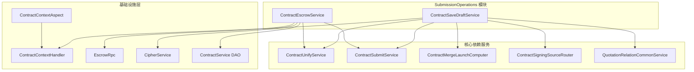
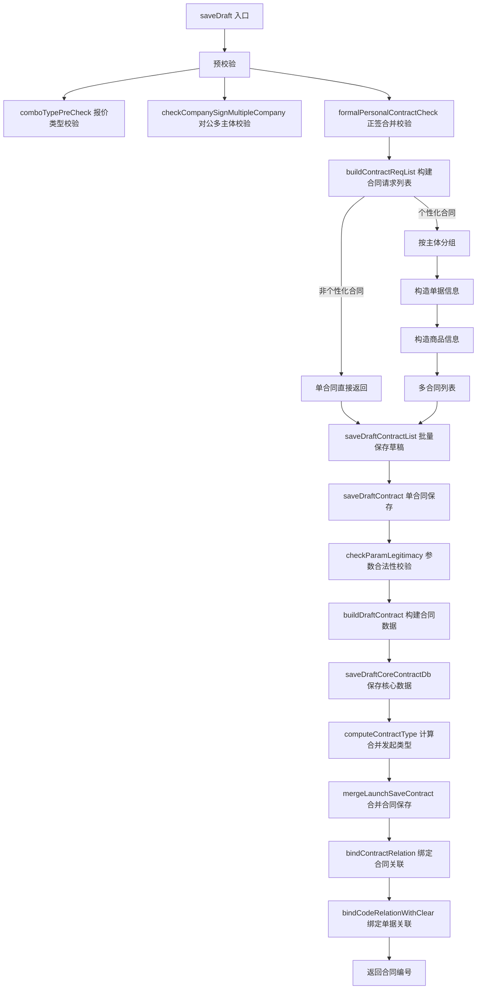
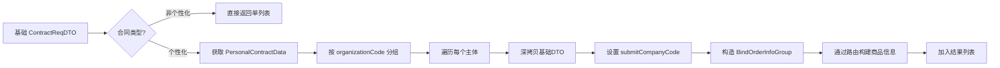
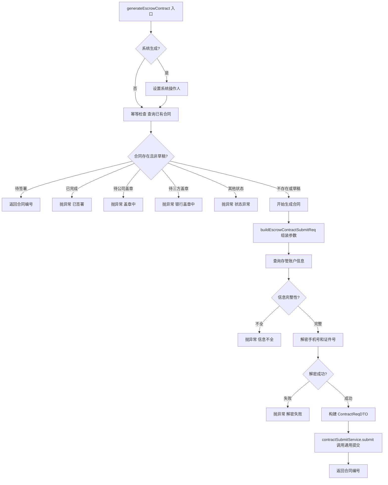
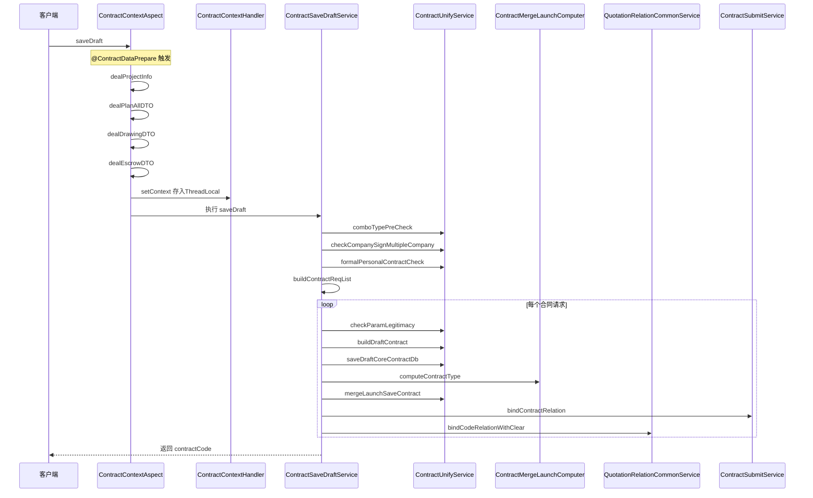
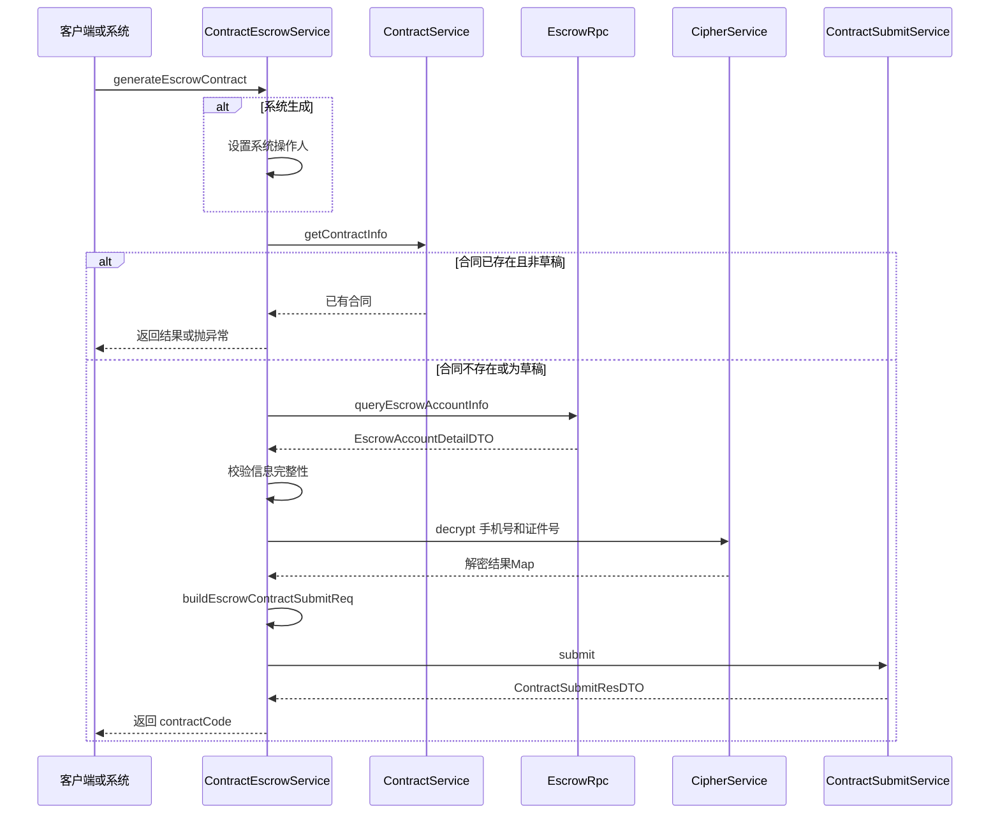
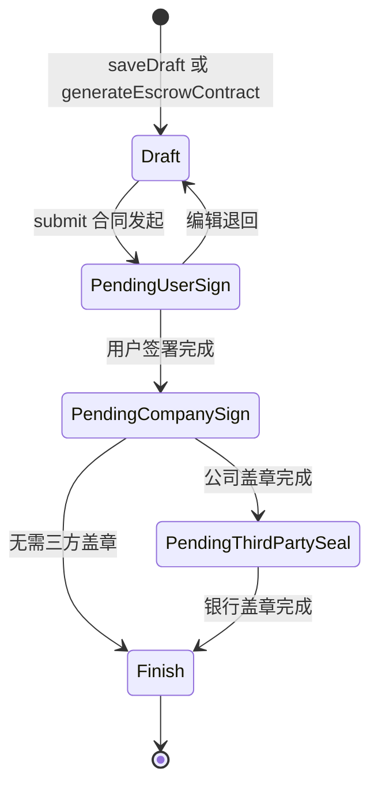

# SubmissionOperations 模块文档

## 模块概述

SubmissionOperations 是 [ContractOperations](ContractOperations.md) 模块下的子模块，负责合同的**提交保存**操作，包括普通合同的草稿保存和资金存管合同的生成。该模块是合同生命周期中从"编辑"到"持久化"的关键环节，承担参数校验、数据拆分、草稿持久化、关联绑定以及存管合同生成等核心职责。

模块包含两个核心服务：

| 服务 | 职责 |
|------|------|
| `ContractSaveDraftService` | 通用草稿保存：校验参数 → 拆分合同请求 → 持久化草稿 → 绑定关联关系 |
| `ContractEscrowService` | 资金存管合同生成：幂等校验 → 查询存管账户 → 组装参数 → 调用通用提交 |

---

## 模块架构



---

## 核心组件详解

### 1. ContractSaveDraftService — 草稿保存服务

负责将用户编辑的合同内容保存为草稿状态，是合同正式提交（submit）前的预保存操作。

#### 1.1 主流程



#### 1.2 关键方法说明

**`saveDraft(ContractReqDTO)`**
- 入口方法，通过 `@ContractDataPrepare` 注解触发 [ContractContextAop](ContractContextAop.md) 的 AOP 切面进行上下文数据预处理
- 执行三层预校验：报价类型、对公多主体、正签合并规则
- 调用 `AopContext.currentProxy()` 确保事务生效

**`buildContractReqList(ContractReqDTO)`**
- 判断合同类型：非个性化合同直接返回单元素列表
- 个性化合同从 `ContractContextHandler` 获取 `PersonalContractDataList`
- 按主体（`organizationCode`）分组，每组构建独立的 `ContractReqDTO`
- 通过 `ContractSigningSourceRouter` 路由到对应策略构建商品信息

**`saveDraftContract(ContractReqDTO)`**
- 单合同保存的完整事务方法
- 步骤：参数校验 → 构建草稿 → 保存核心数据 → 计算并保存合并发起合同 → 绑定关联关系
- 合并发起类型由 `ContractMergeLaunchComputer` 根据合同类型计算，决定哪些附加合同需一并生成

#### 1.3 个性化合同拆分逻辑



---

### 2. ContractEscrowService — 存管合同生成服务

负责生成资金存管合同（`FUND_ESCROW` 类型），支持系统自动触发和用户手动触发两种模式。

#### 2.1 主流程



#### 2.2 关键设计

**幂等性保障**：通过 `projectOrderId + ContractTypeEnum.FUND_ESCROW` 查询已有合同，根据不同状态返回不同结果或抛出业务异常，避免重复生成。

**系统/人工双模式**：`boolSystemGenerate` 参数控制是否将操作人设置为系统账户（`SYSTEM_CREATE_UCID` / `SYSTEM_CREATE_NAME`），支持自动触发场景。

**敏感信息处理**：存管账户中的手机号和证件号经过加密存储，生成合同时通过 `CipherService` 批量解密后再填入合同参数。

---

## 依赖关系

### 上游调用方

SubmissionOperations 作为合同草稿保存和存管合同生成的入口，通常由以下场景触发：
- 合同编辑页面的"保存草稿"操作
- 存管流程中的系统自动生成
- 合同发起前的预保存

### 下游依赖详解

```mermaid
graph TD
    subgraph SELF[SubmissionOperations 模块]
        SaveDraft[ContractSaveDraftService]
        Escrow[ContractEscrowService]
    end

    SaveDraft --> |参数校验和持久化| UnifySvc[ContractUnifyService]
    SaveDraft --> |关联关系绑定| SubmitSvc[ContractSubmitService]
    SaveDraft --> |合并发起计算| MergeComp[ContractMergeLaunchComputer]
    SaveDraft --> |商品信息路由| SrcRouter[ContractSigningSourceRouter]
    SaveDraft --> |单据关联绑定| QuotationSvc[QuotationRelationCommonService]
    SaveDraft --> |AOP上下文预处理| CtxAspect[ContractContextAspect]
    SaveDraft --> |线程上下文读取| CtxHandler[ContractContextHandler]

    Escrow --> |通用提交| SubmitSvc
    Escrow --> |存管账户查询| EscrowRpcSvc[EscrowRpc]
    Escrow --> |敏感数据解密| CipherSvc[CipherService]
    Escrow --> |合同查询| ContractDao[ContractService DAO]
    Escrow --> |合同业务服务| BizSvc[ContractBusinessService]
```



| 依赖服务 | 模块归属 | 用途 |
|---------|---------|------|
| `ContractUnifyService` | [ContractOperations](ContractOperations.md) | 参数校验（`checkParamLegitimacy`）、草稿构建（`buildDraftContract`）、数据持久化（`saveDraftCoreContractDb`）、预校验（`comboTypePreCheck`等） |
| `ContractSubmitService` | [ContractOperations](ContractOperations.md) | 合同关联关系绑定（`bindContractRelation`）、通用合同提交（`submit`） |
| `ContractMergeLaunchComputer` | [ContractOperations](ContractOperations.md) | 根据当前合同类型计算需要合并发起的附加合同类型列表 |
| `ContractSigningSourceRouter` | [SigningSourceBinding](SigningSourceBinding.md) | 根据绑定类型（报价单/S单/变更单）路由到对应策略构建商品信息 |
| `QuotationRelationCommonService` | [ContractOperations](ContractOperations.md) | 管理合同与单据（报价单、S单、变更单）之间的关联关系，支持清除重绑 |
| `ContractContextAop` | [ContractContextAop](ContractContextAop.md) | `@ContractDataPrepare` 注解触发的 AOP 切面，在方法执行前预处理项目信息、报价数据、图纸数据等上下文 |
| `ContractContextHandler` | [ContractContextAop](ContractContextAop.md) | 基于 ThreadLocal 的上下文存储，跨方法传递预处理后的数据 |
| `EscrowRpc` | 基础设施层 | RPC 调用查询存管账户详情（户名、手机号、证件号等） |
| `CipherService` | 基础设施层 | 敏感字段（手机号、身份证号）的加解密 |

---

## 数据流

### 草稿保存数据流



### 存管合同生成数据流



---

## 关键设计模式

### 1. AOP 上下文预处理模式

`ContractSaveDraftService.saveDraft()` 通过 `@ContractDataPrepare` 注解委托 [ContractContextAop](ContractContextAop.md) 的 `ContractContextAspect` 进行数据预处理。切面在方法执行前从多个数据源（项目信息、报价服务、图纸服务等）查询并补充上下文数据，存入 `ContractContextHandler` 的 ThreadLocal，使得后续方法可以直接获取已填充的上下文，避免重复查询。

```
@ContractDataPrepare → ContractContextAspect.beforeHandle()
  → dealProjectInfo / dealPlanAllDTO / dealDrawingDTO / dealEscrowDTO
  → ContractContextHandler.setContext()
```

### 2. 策略路由模式

`buildContractReqList` 中，商品信息的构建通过 `ContractSigningSourceRouter` 根据 `bindType` 路由到不同的 `ContractSigningSource` 策略实现：

| 策略 | 绑定类型 | 来源 |
|------|---------|------|
| `BillSigningSourceStrategy` | 报价单 | [SigningSourceBinding](SigningSourceBinding.md) |
| `SubOrderSigningSourceStrategy` | S单 | [SigningSourceBinding](SigningSourceBinding.md) |
| `ChangeOrderSigningSourceStrategy` | 变更单 | [SigningSourceBinding](SigningSourceBinding.md) |

### 3. 合并发起模式

`ContractMergeLaunchComputer` 根据当前合同类型动态计算需要一并生成的附加合同类型。例如发起正签合同时，可能同时需要生成补充协议或结算协议。计算逻辑基于业务规则引擎（`dealMachRule`），支持全包/非全包、是否有人工报价、是否有代理等条件判断。

### 4. 幂等保障模式

`ContractEscrowService.generateEscrowContract()` 采用"先查后建"策略实现幂等：
- 先通过 `projectOrderId + contractType` 查询已有合同
- 已存在且非草稿状态 → 根据状态返回对应结果或抛出异常
- 不存在或为草稿 → 正常生成新合同

### 5. 事务与锁协同

草稿保存涉及多表写入（合同表、字段表、关联关系表等），通过 `@Transactional` 保证数据一致性。同时 `QuotationRelationCommonService.bindCodeRelationWithClear()` 内部使用分布式锁（`LockService`）防止并发操作导致的关联关系混乱。

---

## 合同状态机

草稿保存相关状态流转如下：



SubmissionOperations 负责创建 `Draft` 状态的合同，后续状态流转由 [ContractOperations](ContractOperations.md) 的其他子模块（如 [SigningOperations](ContractOperations.md)）处理。

---

## 相关模块引用

| 模块 | 关系 | 文档链接 |
|------|------|---------|
| ContractOperations | 父模块，包含合同全生命周期操作 | [ContractOperations](ContractOperations.md) |
| ContractContextAop | AOP 上下文预处理，为草稿保存提供数据填充 | [ContractContextAop](ContractContextAop.md) |
| SigningSourceBinding | 签约来源策略，草稿保存时路由商品信息构建 | [SigningSourceBinding](SigningSourceBinding.md) |
| ContractFieldValidation | 字段校验，被 `ContractUnifyService.checkParamLegitimacy` 间接调用 | [ContractFieldValidation](ContractFieldValidation.md) |
| DetailView | 详情查看，展示草稿/已提交的合同内容 | [DetailView](ContractOperations.md) |
