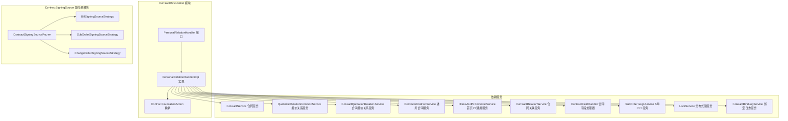
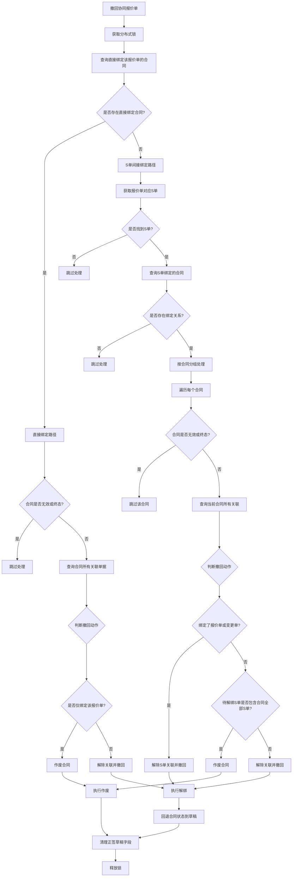
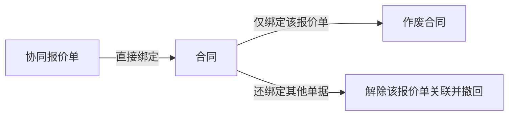
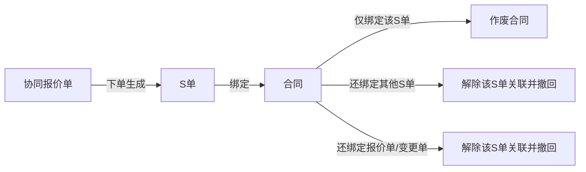
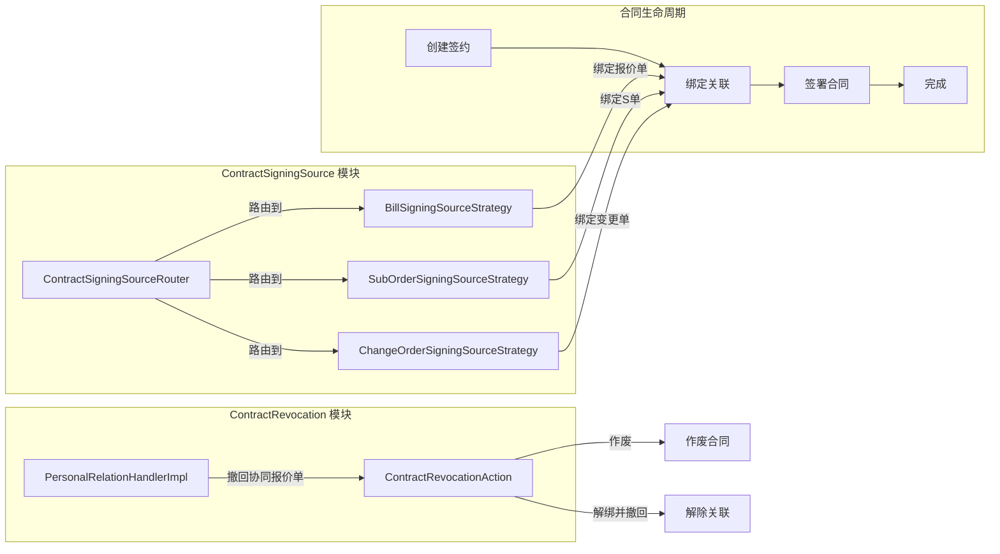

# ContractRevocation 模块

## 模块概述

ContractRevocation 模块是销售合同系统中负责处理**协同报价单撤回时的合同关联关系清理**的核心模块。当协同报价单被撤回时，该模块负责：

1. **判断撤回路径**：区分报价单直接绑定合同还是通过 S 单间接绑定
2. **确定撤回动作**：根据合同当前绑定的单据数量，决定是作废合同还是解除关联并撤回
3. **执行撤回操作**：作废合同或解除绑定关系，并在必要时回退合同状态
4. **清理关联数据**：维护正签草稿字段和日志记录

---

## 架构总览



---

## 核心组件详解

### 1. PersonalRelationHandler（接口）

**职责**：定义协同报价单撤回操作的契约。

**核心方法**：

```java
void revokeCooperQuotation(String projectOrderId, String billCode, Long operatorUcid);
```

**参数说明**：
- `projectOrderId`：项目订单 ID，用于关联查询
- `billCode`：协同报价单号，撤回的目标对象
- `operatorUcid`：操作人 UCID，用于日志记录和权限校验

---

### 2. PersonalRelationHandlerImpl（实现类）

**职责**：实现协同报价单撤回的完整业务逻辑，包含两种撤回路径的分支处理。

**核心依赖**：
- `ContractService`：查询和操作合同数据
- `QuotationRelationCommonService`：查询报价单与合同的绑定关系
- `ContractQuotationRelationService`：操作合同-报价单关联表
- `CommonContractService`：执行合同作废操作
- `HomeAndPcCommonService`：执行合同状态回退
- `LockService`：分布式锁，保证并发安全
- `SubOrderFeignService`：RPC 调用查询 S 单信息

---

### 3. ContractRevocationAction（枚举）

**职责**：定义合同撤回时可执行的操作类型。

| 枚举值 | 含义 | 触发条件 |
|--------|------|----------|
| `CANCEL_CONTRACT` | 作废合同 | 合同仅绑定了当前要撤回的单据 |
| `UNBIND_AND_UNDO` | 解除关联并撤回 | 合同还绑定了其他单据 |
| `SKIP` | 跳过处理 | 合同处于无效态或终态 |

---

## 数据流与执行流程



---

## 撤回路径详解

### 路径一：直接绑定路径（unbindCooperQuotationFromContract）

**场景**：协同报价单直接与合同建立了绑定关系。

**处理逻辑**：

1. 检查合同状态，若为无效态或终态则跳过
2. 查询合同关联的所有单据（bindType=null 查询所有类型）
3. 判断撤回动作：
   - 若合同**仅绑定该报价单**（allRelations.size() == 1 且 billCode 匹配）→ `CANCEL_CONTRACT`
   - 否则 → `UNBIND_AND_UNDO`



### 路径二：S 单间接绑定路径（unbindSubOrderFromContract）

**场景**：协同报价单已下单生成 S 单，合同由报价单换绑到了 S 单。

**处理逻辑**：

1. 通过 `SubOrderFeignService` 查询报价单对应的所有 S 单号
2. 查询这些 S 单与合同的绑定关系（bindType=SUB_ORDER）
3. 按合同分组，逐个处理：
   - 若合同绑定了报价单或变更单 → `UNBIND_AND_UNDO`
   - 若合同绑定的 S 单全部在待解绑列表中 → `CANCEL_CONTRACT`
   - 否则 → `UNBIND_AND_UNDO`



---

## 撤回动作执行详解

### CANCEL_CONTRACT（作废合同）

直接调用 `CommonContractService.cancelCurrentContract()` 作废合同，传入 `forceCancel=true`。

### UNBIND_AND_UNDO（解除关联并撤回）

执行步骤：

1. **解绑关联**：调用 `ContractQuotationRelationService.cancelRelationsByBillCodes()` 解除报价单号和 S 单号的绑定
2. **记录日志**：调用 `ContractBindLogService.recordUnbindLog()` 记录解绑操作
3. **回退合同**：调用 `HomeAndPcCommonService.undoContract()` 将合同状态回退到草稿（仅当合同非草稿、非无效、非终态时执行）

---

## 合同状态判断

### 无效态/终态判断（isContractInInvalidOrFinalStatus）

合同处于以下状态时视为无效或终态，撤回操作将跳过：

| 状态 | 含义 |
|------|------|
| `CANCEL` | 已作废 |
| `SIGNED_STATUS_LIST` | 已签署状态集合 |
| `PENDING_USER_SIGN` + 用户已确认 | 待用户签署且用户已确认 |

### 可回退判断（canUndoContract）

合同可回退到草稿的条件：
- 当前状态**不是**草稿
- 当前状态**不是**无效态或终态

---

## 与 ContractSigningSource 模块的关系

ContractRevocation 模块与 [ContractSigningSource](ContractSigningSource.md) 模块形成**互补关系**：



**ContractSigningSource** 负责合同的**创建和绑定**：
- 通过 `ContractSigningSourceRouter` 根据 `bindType` 路由到不同策略
- 支持报价单（BILL_CODE）、S 单（SUB_ORDER）、变更单（CHANGE_ORDER）三种绑定类型

**ContractRevocation** 负责合同的**解绑和撤回**：
- 通过判断绑定类型和绑定数量，决定撤回策略
- 支持直接绑定和间接绑定（通过 S 单）两种撤回路径

---

## 并发控制

模块通过 `LockService` 实现分布式锁，保证并发安全：

```java
lockService.lockElseThrow(
    LockService.CONTRACT_RELATION_BILL_CODE + cooperBillCode,
    () -> { /* 撤回逻辑 */ },
    10000  // 锁超时时间 10 秒
);
```

**锁粒度**：按协同报价单号加锁，确保同一报价单的撤回和换绑操作互斥。

**锁范围**：覆盖整个撤回流程，包括查询、判断、执行三个阶段。

---

## 依赖关系图

```mermaid
graph TD
    subgraph ContractRevocation[ContractRevocation 模块]
        PersonalRelationHandler[PersonalRelationHandler]
        PersonalRelationHandlerImpl[PersonalRelationHandlerImpl]
    end

    subgraph DataAccess[数据访问层]
        ContractService[ContractService]
        ContractQuotationRelationService[ContractQuotationRelationService]
        ContractRelationService[ContractRelationService]
    end

    subgraph BusinessService[业务服务层]
        CommonContractService[CommonContractService]
        QuotationRelationCommonService[QuotationRelationCommonService]
        HomeAndPcCommonService[HomeAndPcCommonService]
        ContractFieldHandler[ContractFieldHandler]
        ContractBindLogService[ContractBindLogService]
    end

    subgraph Infrastructure[基础设施层]
        LockService[LockService]
        SubOrderFeignService[SubOrderFeignService]
    end

    subgraph ExternalService[外部服务]
        OrderService[订单服务 RPC]
    end

    PersonalRelationHandlerImpl --> PersonalRelationHandler
    PersonalRelationHandlerImpl --> ContractService
    PersonalRelationHandlerImpl --> ContractQuotationRelationService
    PersonalRelationHandlerImpl --> ContractRelationService
    PersonalRelationHandlerImpl --> CommonContractService
    PersonalRelationHandlerImpl --> QuotationRelationCommonService
    PersonalRelationHandlerImpl --> HomeAndPcCommonService
    PersonalRelationHandlerImpl --> ContractFieldHandler
    PersonalRelationHandlerImpl --> ContractBindLogService
    PersonalRelationHandlerImpl --> LockService
    PersonalRelationHandlerImpl --> SubOrderFeignService
    SubOrderFeignService --> OrderService
```



---

## 关键设计模式

### 1. 策略模式（间接使用）

模块通过 `ContractRevocationAction` 枚举实现策略分发：

- `CANCEL_CONTRACT`：作废策略
- `UNBIND_AND_UNDO`：解绑并撤回策略
- `SKIP`：跳过策略

通过 `determineRevocationActionForDirectBound()` 和 `determineRevocationActionForSubOrder()` 两个方法分别判断不同场景下的策略。

### 2. 模板方法模式（隐含）

撤回流程遵循统一模板：

```
获取锁 → 判断路径 → 确定动作 → 执行动作 → 清理数据 → 释放锁
```

### 3. 防御性编程

- **空值检查**：所有集合操作前检查是否为空
- **状态校验**：执行操作前检查合同状态
- **异常捕获**：顶层 try-catch 包装，抛出业务异常
- **分布式锁**：防止并发操作导致数据不一致

---

## 性能考虑

1. **锁超时**：设置 10 秒超时，避免死锁
2. **批量操作**：`cancelRelationsByBillCodes()` 支持批量解绑
3. **惰性查询**：仅在需要时查询 S 单信息
4. **跳过无效数据**：快速跳过无效态和终态合同

---

## 相关模块文档

- [ContractSigningSource](ContractSigningSource.md)：合同签约源策略模块，处理合同创建和绑定
- [FormalMultipleCompanyService](FormalMultipleCompanyService.md)：正签多方服务，处理协同报价单信息查询
- [ProductQuery](ProductQuery.md)：产品查询服务，提供报价单商品信息
