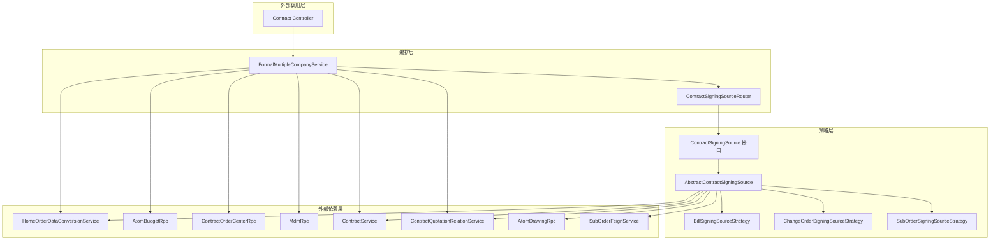
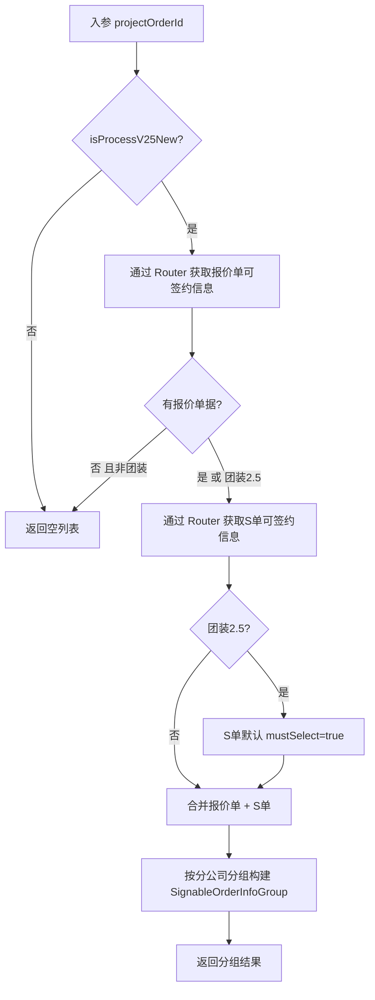
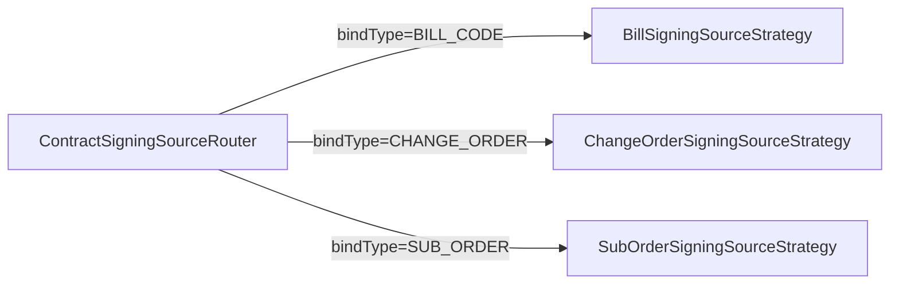
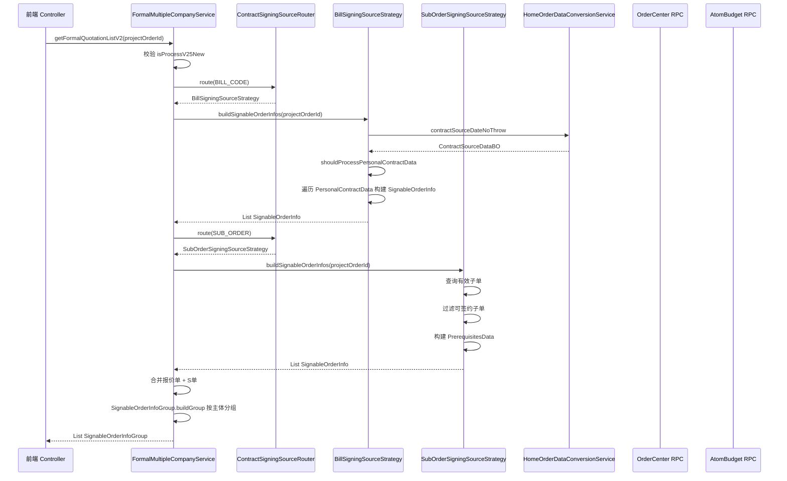
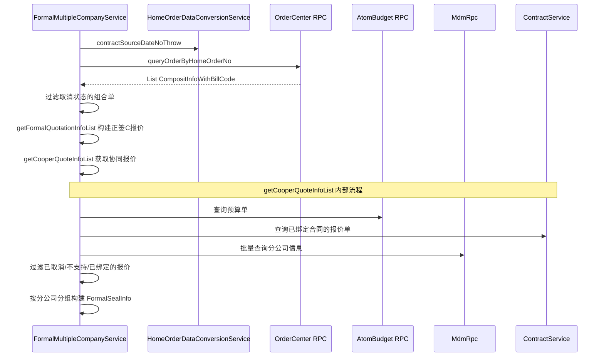
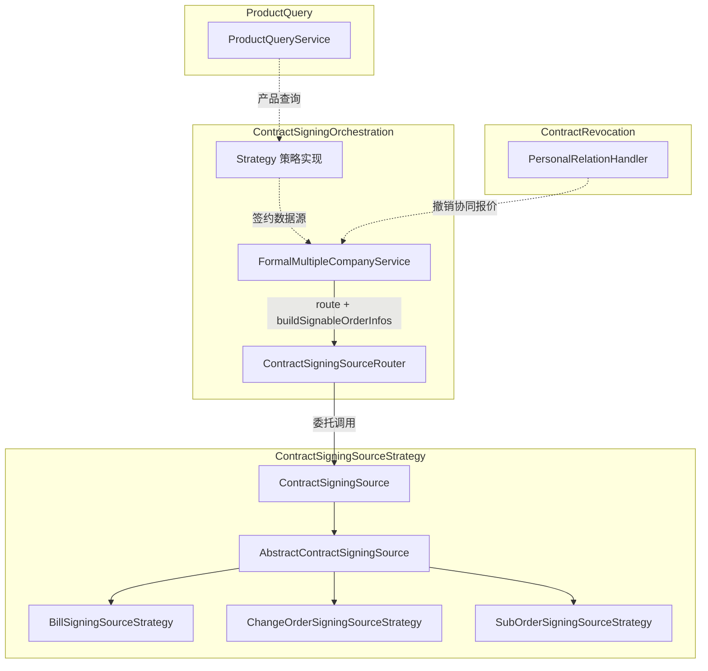

# ContractSigningOrchestration 模块文档

## 模块概述

ContractSigningOrchestration（合同签约编排）是销售合同系统中的核心编排模块，负责在正签（正式签约）场景下，统一调度不同类型的签约数据源（报价单、变更单、S单），为前端弹窗提供可签约单据列表，并管理多主体合同的签约流程。

该模块的核心职责包括：

- **签约数据源路由**：通过策略模式，根据单据类型（`BindTypeEnum`）路由到对应的签约数据源策略
- **可签约单据聚合**：从报价单（Bill Code）、S单（Sub Order）、变更单（Change Order）等多种数据源获取可签约信息，并按分公司主体分组
- **协同报价管理**：处理设计师正签C报价与家居顾问协同C报价的合并逻辑
- **多主体合同编排**：支持一个项目订单下多个分公司主体同时发起合同的场景

## 架构总览

## 核心组件详解

### FormalMultipleCompanyService

正签发起多主体合同的服务类，是本模块的顶层编排入口。提供以下核心方法：

| 方法 | 说明 |
|------|------|
| `getFormalQuotationListV2` | **V2 主入口**。聚合报价单（Bill Code）和S单（Sub Order）两路数据源，返回按分公司分组的可签约单据列表 |
| `getFormalQuotationList` | （已废弃）V1 入口，包含协同报价合并逻辑 |
| `getFormalQuotationInfoList` | （已废弃）获取基础报价内的C报价信息 |
| `getCooperQuoteInfoList` | 获取协同报价单信息列表，过滤已绑定合同的报价 |
| `getNotSupportSignBillCodeList` | 获取不支持签约的协同报价单列表（基于变更单状态判断） |

#### getFormalQuotationListV2 核心流程

### ContractSigningSourceRouter

路由组件，基于 Spring 依赖注入自动收集所有 `ContractSigningSource` 实现，通过 `bindType` 建立映射关系。

**设计特点**：

- 构造函数注入 `List<ContractSigningSource>`，Spring 自动收集所有实现 Bean
- 以 `bindType()` 为 key 构建 `Map<Integer, ContractSigningSource>`
- 路由失败时抛出 `NrsBusinessException`

### ContractSigningSource 接口

定义了签约数据源的统一抽象，所有策略必须实现以下契约方法：

| 方法 | 职责 |
|------|------|
| `bindType()` | 返回绑定类型标识，用于路由 |
| `queryPersonalQuoteInfo` | 从主订单获取个性化报价数据 |
| `hasInvalidStatusOrders` | 判断是否包含无效状态的单据 |
| `buildGoodsInfo` | 构造商品类目摘要信息 |
| `buildSignableOrderInfos` | 构建可签约单据列表（弹窗场景） |
| `checkPersonalCanCreate` | 创建/编辑合同前校验 |
| `buildPersonalDrawingImgList` | 构建个性化图纸图片列表 |
| `buildPersonalDrawing` | 构建个性化图纸详情 |
| `hasCPart` / `hasBPart` | 判断是否包含C部分/B部分品 |

### AbstractContractSigningSource

抽象基类，实现了 `ContractSigningSource` 中的通用逻辑，子类只需覆写差异化的抽象方法：

| 抽象方法 | 说明 |
|---------|------|
| `buildParam` | 构建查询个性化数据的参数 |
| `buildDrawingQuery` | 构建图纸查询参数 |
| `buildProductItemCodes` | 获取单据号对应的商品唯一键 |
| `filterByCompanyCode` | 根据单据号+主体过滤个性化报价数据 |

**通用实现方法**：

- `queryPersonalQuoteInfo`：构建参数 → 执行查询 → 按主体过滤
- `buildPersonalDrawingImgList`：获取图纸 → 筛选预览路径
- `buildPersonalDrawing`：查询商品行 → 构建图纸参数 → RPC 调用 → 过滤个性化PDF图纸
- `mergeCategoryNames`：聚合类目名称（最多3个，多余显示"等"）
- `getHasBoundOrderNos`：查询已绑定合同的单据号，支持编辑/非编辑场景区分
- `isCPart` / `isBPart`：根据 `PurchaseTypeEnum` 判断成本承担方

### 策略实现

#### BillSigningSourceStrategy（报价单策略）

- **bindType**: `BindTypeEnum.BILL_CODE`
- **职责**：处理基础报价单的签约数据源
- **核心逻辑**：
  - 获取正签报价的个性化数据（`PersonalContractData`）
  - 判断是否需要处理个性化合同数据（`shouldProcessPersonalContractData`）
  - 为每条个性化数据构建 `SignableOrderInfo`（含 goodsInfo 商品信息）

#### SubOrderSigningSourceStrategy（S单策略）

- **bindType**: `BindTypeEnum.SUB_ORDER`
- **职责**：处理S单（子订单）的签约数据源
- **核心逻辑**：
  - 查询有效的子单列表
  - 过滤可签约的子单（排除已绑定合同的）
  - 构建前置依赖数据（`PrerequisitesData`）
  - 团装2.5场景下S单默认勾选

#### ChangeOrderSigningSourceStrategy（变更单策略）

- **bindType**: `BindTypeEnum.CHANGE_ORDER`
- **职责**：处理变更单的签约数据源
- **当前状态**：`buildSignableOrderInfos` 直接返回空列表（变更单暂不参与弹窗选择）

## 数据流

### 正签弹窗数据流

### V1 协同报价数据流（已废弃）

## 与其他模块的关系

### 依赖模块说明

| 模块 | 关系 | 说明 |
|------|------|------|
| [ContractSigningSourceStrategy](ContractSigningSourceStrategy.md) | **依赖** | 提供具体的签约数据源策略实现，本模块通过 Router 调度 |
| [ContractRevocation](ContractRevocation.md) | **协作** | 签约的逆向操作，`PersonalRelationHandler` 负责撤销协同报价与合同的绑定关系 |
| [ProductQuery](ProductQuery.md) | **依赖** | `ProductQueryService` 提供报价单/变更单的产品查询能力，被策略层使用 |

## 关键设计模式

### 策略模式（Strategy Pattern）

本模块的核心架构模式。`ContractSigningSource` 接口定义统一契约，三种策略实现（报价单、变更单、S单）各自封装差异化的数据获取逻辑。

**优势**：
- 新增单据类型时只需添加新的策略实现类，无需修改编排层代码
- 每种策略独立演进，互不影响
- Spring 自动发现机制简化了策略注册

### 模板方法模式（Template Method Pattern）

`AbstractContractSigningSource` 作为模板基类，定义了查询、过滤、图纸构建的通用流程骨架，将差异化的步骤（`buildParam`、`filterByCompanyCode`、`buildDrawingQuery` 等）延迟到子类实现。

### 路由器模式（Router Pattern）

`ContractSigningSourceRouter` 充当策略路由器，将 `bindType` 映射到具体的策略实例，解耦了调用方与具体策略实现。

## 注意事项

1. **V1 方法已废弃**：`getFormalQuotationList`、`getFormalQuotationInfoList` 等标注 `@Deprecated` 的方法是 V1 实现，保留是为了兼容旧逻辑。新功能应使用 `getFormalQuotationListV2`。

2. **团装2.5特殊处理**：团装（`GROUP_DECORATE`）场景下，S单默认设置 `mustSelect=true`，即弹窗中默认勾选所有S单。

3. **协同报价过滤逻辑**：`getNotSupportSignBillCodeList` 基于变更单业务状态判断是否支持签约，只有"待签约"和"已完成"状态的变更单允许签约。

4. **编辑/非编辑场景区分**：`getHasBoundOrderNos` 方法的 `isEdit` 参数影响对草稿合同的处理——编辑场景下已绑定草稿合同的单据仍视为有效。
