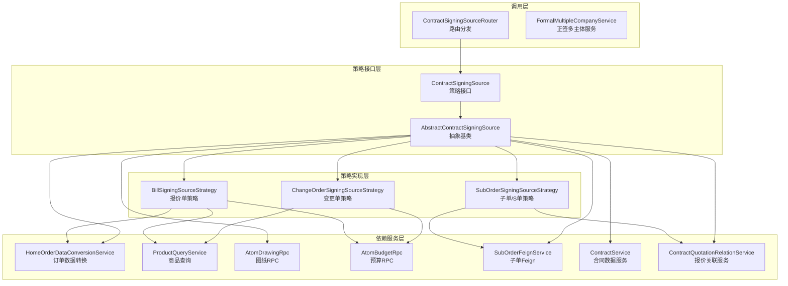
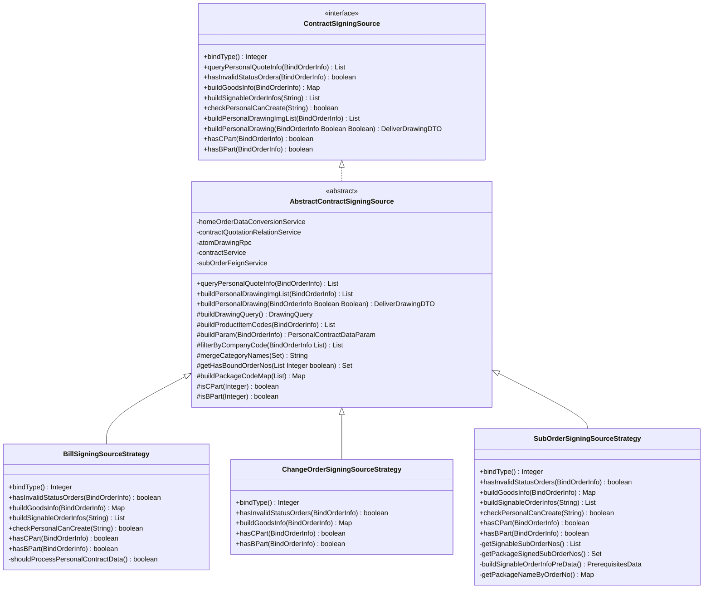
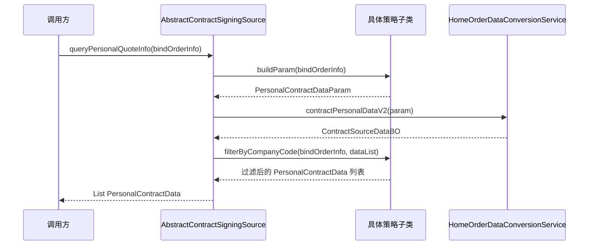
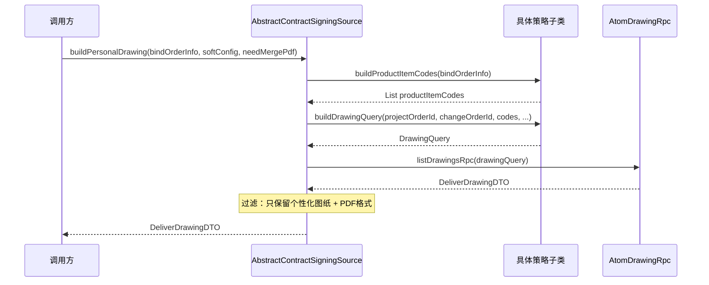
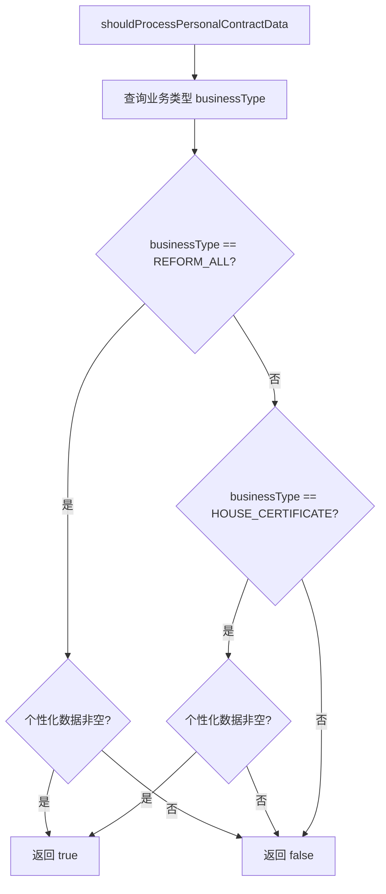
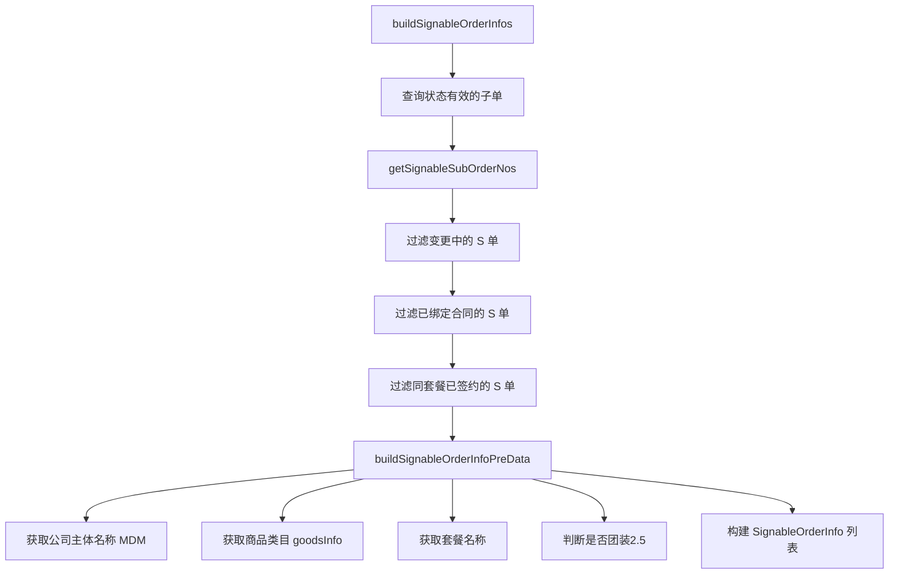
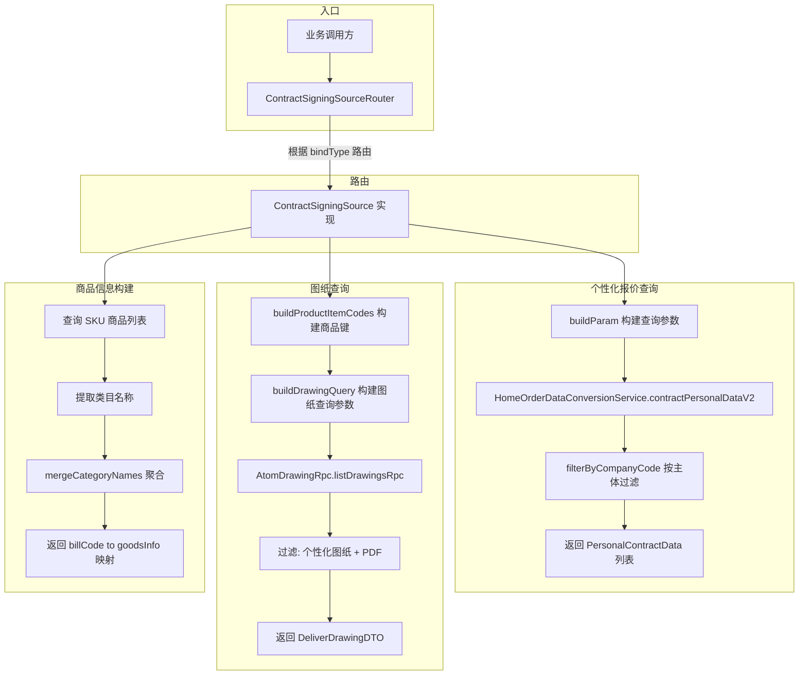

# ContractSigningSourceStrategy 模块文档

## 1. 模块概述

ContractSigningSourceStrategy 是销售合同个性化签约流程的核心数据源策略模块，采用**策略模式（Strategy Pattern）**将不同单据类型（报价单、变更单、子单/S单）的签约数据查询、校验、构建逻辑解耦为独立策略实现。该模块解决了"不同单据类型在签约过程中需要不同查询和校验逻辑"这一核心业务问题，使新增单据类型时只需新增一个策略类，无需修改已有代码。

### 核心职责

- **个性化报价查询**：根据单据类型构建不同参数，查询个性化合同报价数据
- **单据状态校验**：校验待签约单据是否处于有效状态
- **商品信息构建**：聚合类目名称作为合同商品描述
- **可签约单据枚举**：为弹窗场景提供可选单据列表
- **图纸数据获取**：从 Atom 平台获取个性化图纸信息
- **成本分担判定**：判断报价中是否包含 B 方（开发商）或 C 方（客户）承担部分

## 2. 整体架构

### 2.1 分层架构图



### 2.2 策略模式类图



## 3. 核心组件详解

### 3.1 ContractSigningSource — 策略接口

定义了签约数据源的统一契约，所有策略必须实现以下 10 个方法：

| 方法 | 职责 |
|------|------|
| `bindType()` | 返回策略绑定的单据类型编码（对应 `BindTypeEnum`） |
| `queryPersonalQuoteInfo()` | 查询个性化报价数据 |
| `hasInvalidStatusOrders()` | 校验单据是否包含无效状态 |
| `buildGoodsInfo()` | 构建单据号 → 商品描述的映射 |
| `buildSignableOrderInfos()` | 构建可签约单据列表（弹窗场景） |
| `checkPersonalCanCreate()` | 校验是否存在可签约的个性化单据 |
| `buildPersonalDrawingImgList()` | 获取个性化图纸图片 URL 列表 |
| `buildPersonalDrawing()` | 获取完整的图纸详情数据 |
| `hasCPart()` | 判断是否包含客户承担（C部分）的商品 |
| `hasBPart()` | 判断是否包含开发商承担（B部分）的商品 |

### 3.2 AbstractContractSigningSource — 抽象基类

实现了 `ContractSigningSource` 中 3 个公共方法的模板逻辑（模板方法模式），并为子类提供 7 个可复用的工具方法。

#### 模板方法实现

**`queryPersonalQuoteInfo()`** — 查询个性化报价



**`buildPersonalDrawing()`** — 获取个性化图纸



#### 公共工具方法

| 方法 | 说明 |
|------|------|
| `mergeCategoryNames()` | 聚合类目名称，最多取前 3 个，超出追加"等" |
| `getHasBoundOrderNos()` | 查询已绑定合同的单据号，区分编辑/非编辑场景（草稿合同是否算有效） |
| `buildPackageCodeMap()` | 构建子单号 → 套餐实例编码的映射 |
| `getPackageCodesByOrderNos()` | 根据单据号集合获取关联的套餐编码集合 |
| `isCPart()` | 判定 purchaseType 是否为客户承担成本 |
| `isBPart()` | 判定 purchaseType 是否为开发商承担或混合承担 |

### 3.3 BillSigningSourceStrategy — 报价单策略

绑定类型：`BindTypeEnum.BILL_CODE`

针对**基础报价单**场景的策略实现，是最复杂的策略之一。

#### 关键特性

- **状态校验**：通过 `AtomBudgetRpc.queryBillsByCondition()` 查询报价单状态，若状态为调整中/已删除/已作废则判定为无效
- **商品信息**：通过 `ProductQueryService.getQuotationProductDTOS()` 查询报价商品 SKU，聚合其内控类目
- **可签约单据**：先查询正签报价源数据，再根据业务类型（全改/精装改造/房产证）决定是否处理个性化数据，最后逐单构建 `SignableOrderInfo`
- **创建校验**：报价单策略固定返回 `false`（不依赖 S 单校验）
- **多主体过滤**：根据 `单据号_主体编码` 精确匹配，因为报价单可能存在多主体数据

#### 业务类型过滤逻辑



### 3.4 ChangeOrderSigningSourceStrategy — 变更单策略

绑定类型：`BindTypeEnum.CHANGE_ORDER`

针对**变更申请单**场景的策略实现。

#### 关键特性

- **状态校验**：通过 `AtomBudgetRpc.getChangeApplyDetails()` 查询变更流程状态，仅待签约/已完成状态允许签约
- **图纸查询差异**：变更单图纸需要额外传入 `projectChangeNo`（变更单号）和 `drawingStatus = TEMP`（临时状态图纸）
- **不支持弹窗**：`buildSignableOrderInfos()` 和 `checkPersonalCanCreate()` 均返回空/false，变更单不支持独立弹窗选择
- **多主体过滤**：根据 `变更单号_主体编码` 精确匹配

### 3.5 SubOrderSigningSourceStrategy — 子单/S单策略

绑定类型：`BindTypeEnum.SUB_ORDER`

针对**子单（S单）**场景的策略实现，是三个策略中逻辑最丰富的。

#### 关键特性

- **状态校验**：批量查询子单，校验数量一致性，并检查是否有处于无效状态的子单
- **商品信息**：从子单明细中提取前/后台类目名，超长截断（50字符限制）
- **可签约单据构建**（弹窗核心逻辑）：



- **套餐签约关联**：`getPackageSignedSubOrderNos()` 处理套餐内子单的联动关系——若同套餐中某个子单已绑定合同，则该套餐下的其他子单也不可再签约
- **创建校验**：与 `buildSignableOrderInfos()` 逻辑类似，但不过滤草稿合同关联（兼容编辑场景）
- **不过滤主体**：`filterByCompanyCode()` 直接返回全部数据（S单只有单个主体）

## 4. 数据流

### 4.1 签约数据查询完整流程



### 4.2 可签约单据筛选流程

```mermaid
graph TD
    subgraph 报价单场景
        BillStart[buildSignableOrderInfos] --> BillQuery[查询正签报价源数据]
        BillQuery --> BillFilter[根据业务类型判断是否处理]
        BillFilter --> BillBuild[逐单构建 SignableOrderInfo]
    end

    subgraph 子单场景
        SubStart[buildSignableOrderInfos] --> SubQuery[查询有效子单列表]
        SubQuery --> SubFilterChange[排除变更中的子单]
        SubFilterChange --> SubFilterBound[排除已绑定合同的子单]
        SubFilterBound --> SubFilterPackage[排除同套餐已签约的子单]
        SubFilterPackage --> SubBuild[构建依赖数据 + SignableOrderInfo]
    end

    subgraph 变更单场景
        ChangeStart[buildSignableOrderInfos] --> ChangeEmpty[返回空列表 - 不支持弹窗]
    end
```



## 5. 依赖关系

### 5.1 外部依赖汇总

| 依赖服务 | 提供能力 | 使用方 |
|---------|---------|--------|
| `HomeOrderDataConversionService` | 个性化报价数据查询、正签报价源数据查询 | Abstract、BillStrategy |
| `ProductQueryService` | 报价/变更报价商品 SKU 查询 | BillStrategy、ChangeStrategy |
| `AtomDrawingRpc` | 个性化图纸查询 | Abstract |
| `AtomBudgetRpc` | 报价单状态查询、变更申请详情查询 | BillStrategy、ChangeStrategy |
| `SubOrderFeignService` | 子单批量查询、有效子单查询、变更中子单查询 | Abstract、SubStrategy |
| `ContractService` | 合同信息查询（状态判断） | Abstract |
| `ContractQuotationRelationService` | 报价-合同关联关系查询 | Abstract、SubStrategy |
| `MdmRpc` | 公司主体信息查询（MDM主数据） | SubStrategy |
| `PackageQueryFeignService` | 套餐信息查询 | SubStrategy |
| `CommonBusinessService` | 业务类型查询、团装版本判断 | BillStrategy、SubStrategy |
| `ContractDependentDataService` | 合同依赖数据服务 | BillStrategy |

### 5.2 与关联模块的关系

| 关联模块 | 关系 | 说明 |
|---------|------|------|
| [ContractSigningOrchestration](ContractSigningOrchestration.md) | 被依赖 | `ContractSigningSourceRouter` 作为编排层的路由组件，将 `bindType` 路由到具体策略 |
| [ProductQuery](ProductQuery.md) | 依赖 | 报价单和变更单策略通过 `ProductQueryService` 查询商品 SKU 信息 |
| [ContractRevocation](ContractRevocation.md) | 协作 | 合同撤回时通过 `PersonalRelationHandler` 解除报价单/子单与合同的绑定关系，与签约时的绑定互为逆操作 |

## 6. 关键设计模式

### 6.1 策略模式 + 模板方法模式

本模块同时运用了两种经典设计模式：

- **策略模式**：`ContractSigningSource` 接口定义统一契约，`ContractSigningSourceRouter` 根据 `bindType` 动态路由到具体策略，调用方无需感知具体实现
- **模板方法模式**：`AbstractContractSigningSource` 在 `queryPersonalQuoteInfo()`、`buildPersonalDrawingImgList()`、`buildPersonalDrawing()` 中定义了算法骨架（构建参数 → 执行查询 → 过滤/后处理），将变化点（参数构建、查询条件、过滤规则）延迟到子类实现

### 6.2 Spring 自动注册机制

`ContractSigningSourceRouter` 通过 Spring 的 `List<ContractSigningSource>` 注入机制，在构造函数中自动收集所有策略 Bean 并以 `bindType()` 为 key 构建路由映射表，新增策略类只需添加 `@Service` 注解即可自动注册。

### 6.3 三层抽象分工

```
ContractSigningSource        → 定义"做什么"（接口契约）
AbstractContractSigningSource → 定义"怎么做框架"（模板 + 公共工具）
XxxSourceStrategy            → 定义"具体差异"（单据类型特定逻辑）
```

这种分层使得：公共逻辑（如图纸过滤、类目聚合、已绑定查询）在抽象层统一实现，避免重复；单据类型差异（状态校验规则、商品查询方式、过滤条件）在具体策略中独立演进，互不干扰。

## 7. 各策略对比

| 维度 | Bill（报价单） | Change（变更单） | SubOrder（子单/S单） |
|------|--------------|----------------|-------------------|
| `bindType` | BILL_CODE | CHANGE_ORDER | SUB_ORDER |
| 状态校验方式 | RPC 查询报价单状态 | RPC 查询变更流程状态 | Feign 批量查询子单状态 |
| 无效状态定义 | 调整中/已删除/已作废 | 非待签约且非已完成 | SubOrderFeignService.invalidStatus |
| 商品查询 | ProductQueryService | ProductQueryService | SubOrderFeignService 子单明细 |
| 弹窗支持 | 支持（需判断业务类型） | 不支持 | 支持 |
| 多主体过滤 | 单据号 + 主体编码 | 变更单号 + 主体编码 | 不过滤（单主体） |
| 图纸查询参数 | projectOrderId + itemCodes | projectOrderId + changeOrderId + itemCodes + TEMP | projectOrderId + itemCodes |
| 创建校验 | 固定返回 false | 固定返回 false | 查询可签约子单（不过滤草稿） |
| 套餐联动 | 无 | 无 | 同套餐子单签约互斥 |
