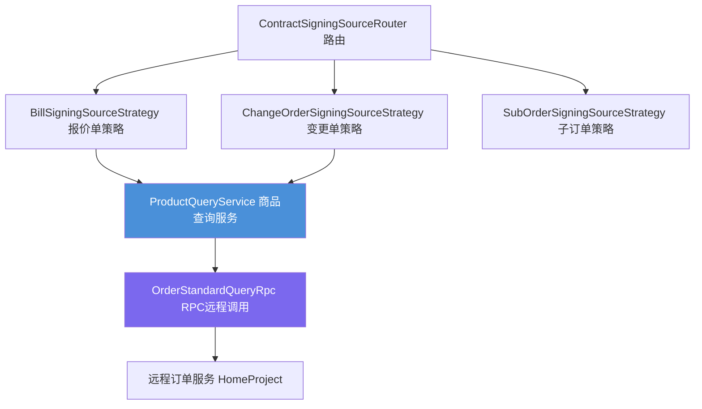
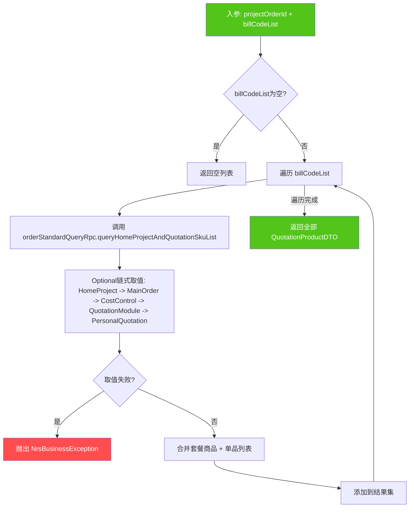
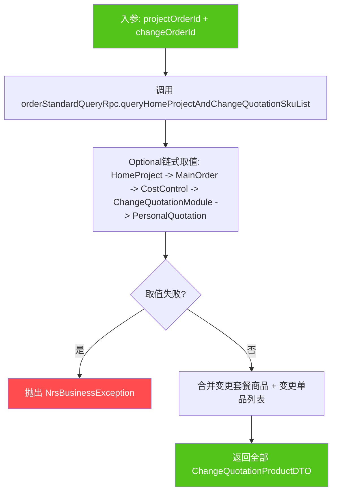
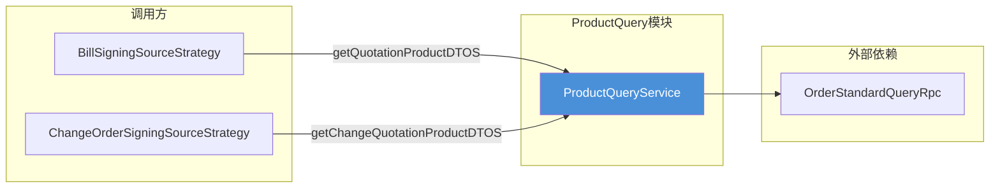
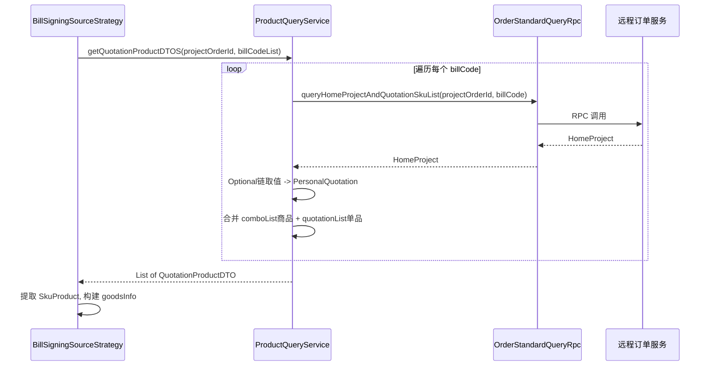
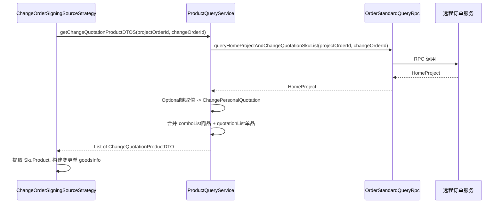
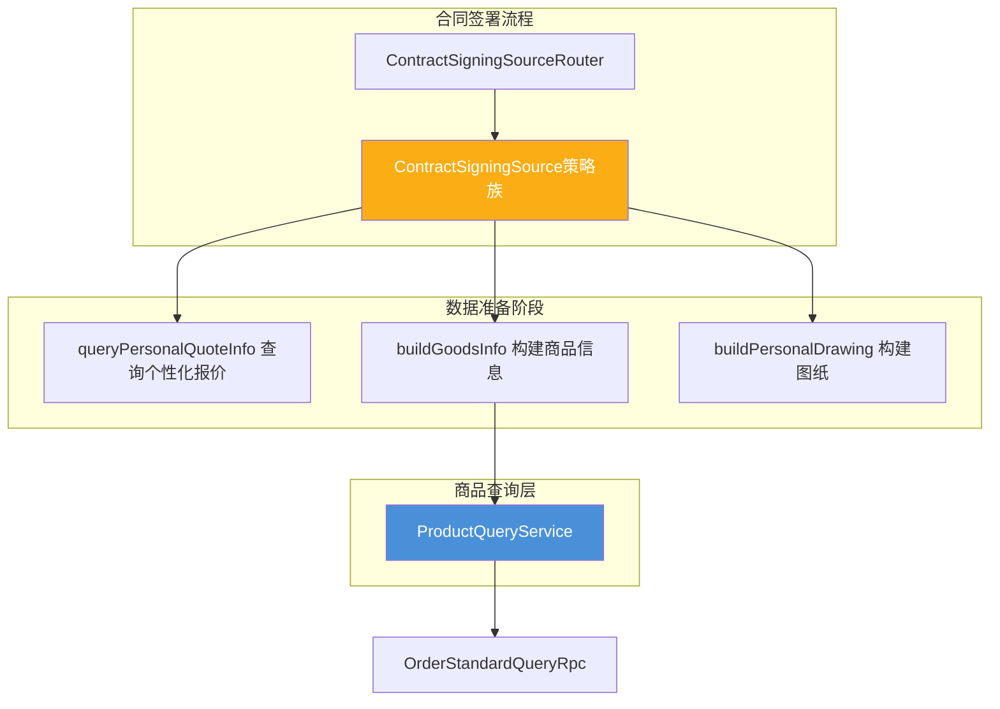

# ProductQuery 模块文档

## 1. 模块概述

`ProductQuery` 模块是合同签署流程中的**产品信息查询层**，负责根据主订单号和报价单号/变更单号，从订单标准化查询服务中获取个性化报价商品（SKU）信息。该模块为 [ContractSigningSource](ContractSigningSource.md) 策略族提供商品数据支撑，是合同签署"商品信息构建"环节的核心数据来源。

模块仅包含一个服务类 `ProductQueryService`，对外暴露两个查询方法：

| 方法 | 入参 | 出参 | 场景 |
|------|------|------|------|
| `getQuotationProductDTOS` | projectOrderId + billCodeList | `List<QuotationProductDTO>` | 报价单签署时查询商品 |
| `getChangeQuotationProductDTOS` | projectOrderId + changeOrderId | `List<ChangeQuotationProductDTO>` | 变更单签署时查询商品 |

## 2. 架构位置

ProductQuery 在个性化合同签署体系中处于**数据查询层**，位于调用链的中间位置：



## 3. 核心组件详解

### 3.1 ProductQueryService

Spring `@Service`，通过 `OrderStandardQueryRpc` 远程调用获取商品数据，内部统一采用 `Optional` 链式取值 + Stream 聚合的模式处理数据。

#### 3.1.1 getQuotationProductDTOS（报价单商品查询）



**数据取值链路：**

```
HomeProject
  └── MainOrder
        └── CostControl
              └── QuotationModule
                    └── PersonalQuotation (ComboQuotationListDTO)
                          ├── comboList -> 每个套餐的 quotationProductList (套餐内商品)
                          └── quotationList (单品列表)
```

**商品合并逻辑：** 将套餐内商品（`combo.quotationProductList`）与单品（`quotationList`）通过 `Stream.concat` 合并，并过滤 `null`。

#### 3.1.2 getChangeQuotationProductDTOS（变更单商品查询）



**数据取值链路：**

```
HomeProject
  └── MainOrder
        └── CostControl
              └── ChangeQuotationModule
                    └── PersonalQuotation (ChangeComboQuotationListDTO)
                          ├── comboList -> 每个变更套餐的 quotationProductList
                          └── quotationList (变更单品列表)
```

## 4. 依赖关系

### 4.1 上游依赖

| 依赖组件 | 依赖方式 | 说明 |
|----------|----------|------|
| `OrderStandardQueryRpc` | `@Resource` 注入 | 远程过程调用，查询 HomeProject 及其关联的报价/变更 SKU 列表 |

### 4.2 下游调用方

| 调用方 | 调用方法 | 使用场景 |
|--------|----------|----------|
| `BillSigningSourceStrategy` | `getQuotationProductDTOS` | 通过报价单号获取 SKU 商品，用于构建 goodsInfo 和商品类目信息 |
| `ChangeOrderSigningSourceStrategy` | `getChangeQuotationProductDTOS` | 通过变更单号获取 SKU 商品，用于构建变更单的 goodsInfo |



## 5. 数据流

### 5.1 报价单签署的商品查询数据流



### 5.2 变更单签署的商品查询数据流



## 6. 关键设计模式

### 6.1 Optional 防空链式取值

两个方法均采用 `Optional.ofNullable().map().map()...orElseThrow()` 模式逐层取值，避免深层对象的空指针异常。当任一中间节点为 `null` 时，统一抛出 `NrsBusinessException("通过主订单查询商品信息失败")`。

### 6.2 套餐 + 单品合并模式

```
最终商品列表 = Stream.concat(套餐内商品流, 单品流).filter(nonNull)
```

报价数据采用"套餐 + 单品"的二元结构：
- **套餐（Combo）**：嵌套结构，需 `flatMap` 展开内部 `quotationProductList`
- **单品（Quotation）**：扁平结构，直接作为 Stream 元素

两个方法的数据合并模式完全一致，差异仅在 DTO 类型（`QuotationProductDTO` vs `ChangeQuotationProductDTO`）和数据路径（`QuotationModule` vs `ChangeQuotationModule`）。

### 6.3 逐单循环查询 vs 单次查询

- `getQuotationProductDTOS`：对 `billCodeList` 逐个循环查询，因为 RPC 接口按单个报价单号查询
- `getChangeQuotationProductDTOS`：单次查询，因为变更单通过唯一 `changeOrderId` 标识

## 7. 模块在整体系统中的角色



ProductQuery 模块在合同签署流程中的职责边界清晰：

- **职责**：根据订单标识查询商品 SKU 列表
- **不负责**：商品数据的转换、类目合并、图纸构建等业务逻辑（这些由策略类完成）
- **依赖方向**：策略类依赖 ProductQueryService，ProductQueryService 依赖 OrderStandardQueryRpc，单向无循环

该模块是 [ContractSigningSource](ContractSigningSource.md) 策略族构建商品信息（`buildGoodsInfo`）的唯一数据来源，被 `BillSigningSourceStrategy` 和 `ChangeOrderSigningSourceStrategy` 两个策略实现使用。
