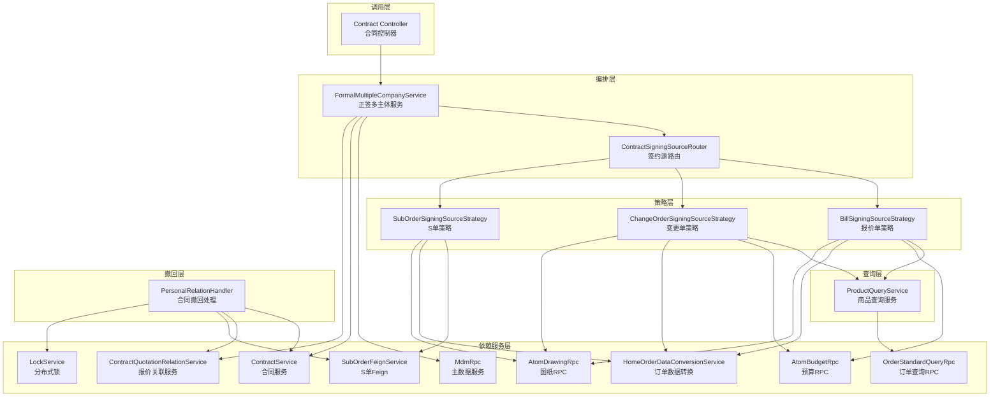
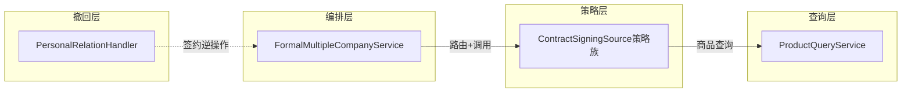

# Personal 仓库概览文档

## 仓库目的

Personal 仓库是**销售合同个性化签署系统**的核心业务模块，负责处理家装场景下的个性化合同签约、数据源路由、协同报价管理和合同撤回等业务流程。该系统采用策略模式和模板方法模式，支持报价单、变更单、S单等多种单据类型的签约场景，实现合同签署的灵活扩展和统一管理。

## 端到端架构

## 核心模块

### 1. ContractSigningSourceStrategy（签约数据源策略）

**职责**：将不同单据类型（报价单、变更单、S单）的签约数据查询、校验、构建逻辑解耦为独立策略实现。

**核心组件**：
- `ContractSigningSource` - 策略接口，定义统一契约
- `AbstractContractSigningSource` - 抽象基类，实现模板方法
- `BillSigningSourceStrategy` - 报价单策略实现
- `ChangeOrderSigningSourceStrategy` - 变更单策略实现
- `SubOrderSigningSourceStrategy` - S单策略实现

**关键能力**：
- 个性化报价查询
- 单据状态校验
- 可签约单据枚举
- 图纸数据获取
- 成本分担判定

📄 详细文档：[ContractSigningSourceStrategy.md](ContractSigningSourceStrategy.md)

---

### 2. ContractSigningOrchestration（合同签约编排）

**职责**：在正签场景下，统一调度不同类型的签约数据源，为前端弹窗提供可签约单据列表，并管理多主体合同的签约流程。

**核心组件**：
- `FormalMultipleCompanyService` - 正签多主体服务，顶层编排入口
- `ContractSigningSourceRouter` - 路由组件，根据单据类型分发策略

**关键能力**：
- 可签约单据聚合
- 协同报价管理
- 多主体合同编排
- 团装2.5特殊处理

📄 详细文档：[ContractSigningOrchestration.md](ContractSigningOrchestration.md)

---

### 3. ProductQuery（商品查询）

**职责**：根据主订单号和报价单号/变更单号，从订单标准化查询服务中获取个性化报价商品（SKU）信息。

**核心组件**：
- `ProductQueryService` - 商品查询服务，封装 RPC 调用

**关键能力**：
- 报价单商品查询（套餐 + 单品合并）
- 变更单商品查询
- Optional 防空链式取值

📄 详细文档：[ProductQuery.md](ProductQuery.md)

---

### 4. ContractRevocation（合同撤回）

**职责**：处理协同报价单撤回时的合同关联关系清理，是签约操作的逆向流程。

**核心组件**：
- `PersonalRelationHandler` - 撤回处理接口
- `PersonalRelationHandlerImpl` - 撤回实现类
- `ContractRevocationAction` - 撤回动作枚举

**关键能力**：
- 直接绑定路径撤回
- S单间接绑定路径撤回
- 合同作废/解绑决策
- 分布式锁并发控制

📄 详细文档：[ContractRevocation.md](ContractRevocation.md)

---

## 模块依赖关系

| 模块 | 依赖关系 | 说明 |
|------|----------|------|
| ContractSigningOrchestration | **依赖** ContractSigningSourceStrategy | 通过 Router 调度具体策略实现 |
| ContractSigningSourceStrategy | **依赖** ProductQuery | 报价单/变更单策略使用商品查询服务 |
| ContractRevocation | **协作** ContractSigningOrchestration | 签约的逆向操作，负责解绑和撤回 |

---

## 设计模式

### 策略模式（Strategy Pattern）

`ContractSigningSource` 接口定义统一契约，三种策略实现各自封装差异化的数据获取逻辑。新增单据类型时只需添加新的策略实现类，无需修改编排层代码。

### 模板方法模式（Template Method Pattern）

`AbstractContractSigningSource` 定义了查询、过滤、图纸构建的通用流程骨架，将差异化的步骤延迟到子类实现。

### 路由器模式（Router Pattern）

`ContractSigningSourceRouter` 通过 Spring 自动注入，根据 `bindType` 映射到具体策略实例，解耦了调用方与具体策略实现。

---

## 关键业务场景

### 1. 正签弹窗签约流程

1. 前端请求可签约单据列表
2. `FormalMultipleCompanyService` 聚合报价单 + S单数据
3. 按分公司主体分组返回 `SignableOrderInfoGroup`
4. 前端弹窗展示可选单据

### 2. 协同报价撤回流程

1. 协同报价单被撤回
2. `PersonalRelationHandler` 获取分布式锁
3. 判断撤回路径（直接绑定 / S单间接绑定）
4. 确定撤回动作（作废 / 解绑并撤回）
5. 执行撤回操作并清理关联数据

### 3. 图纸数据获取流程

1. 策略类构建图纸查询参数（`buildDrawingQuery`）
2. 调用 `AtomDrawingRpc.listDrawingsRpc` 获取图纸
3. 过滤只保留个性化图纸 + PDF格式
4. 返回图纸详情或图片列表

---

## 技术栈

- **语言**：Java
- **框架**：Spring Boot / Spring MVC
- **设计模式**：策略模式、模板方法模式、路由器模式
- **分布式**：分布式锁（LockService）、Feign 远程调用
- **数据访问**：MyBatis / MyBatis-Plus

---

## 相关文档

- [ContractSigningSourceStrategy.md](ContractSigningSourceStrategy.md) - 签约数据源策略详细设计
- [ContractSigningOrchestration.md](ContractSigningOrchestration.md) - 签约编排详细设计
- [ProductQuery.md](ProductQuery.md) - 商品查询服务详细设计
- [ContractRevocation.md](ContractRevocation.md) - 合同撤回详细设计